ASG - Lifecycle Hooks
---

## 2. Lifecycle Hooks

- Lifecycle hooks let you **pause** instance start/stop actions to perform custom steps.

- WorkFlow:

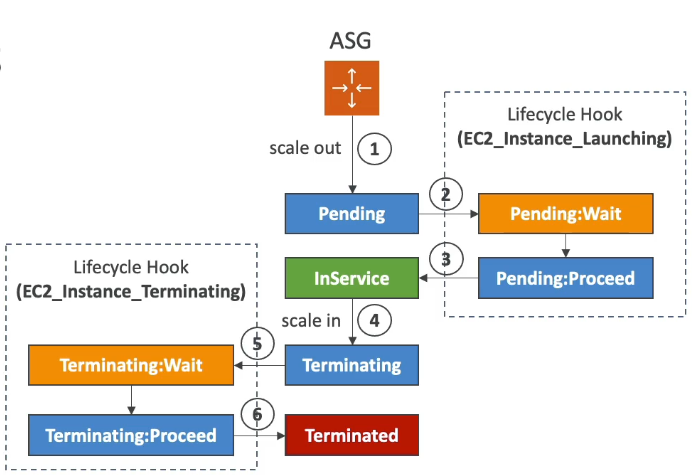

- You can connect lifecycle hooks to:
- **SNS**
- **SQS**
- **EventBridge**

to trigger automation (e.g., Lambda or custom scripts).


Get SQS msg and AutoScale EC2.
---

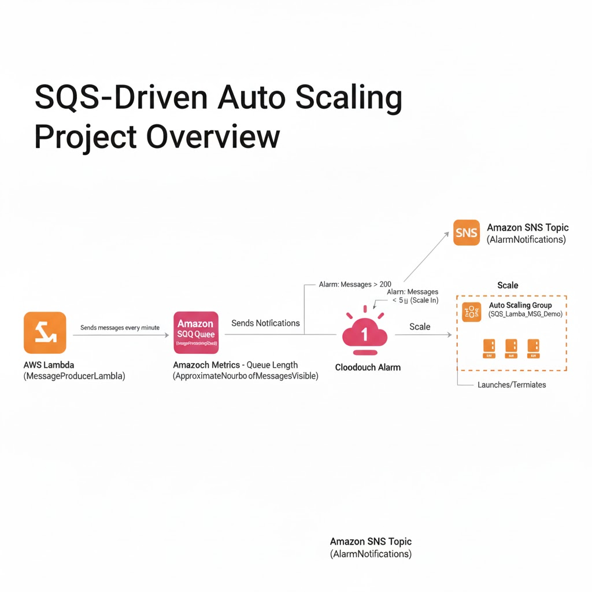

1. Create SQS

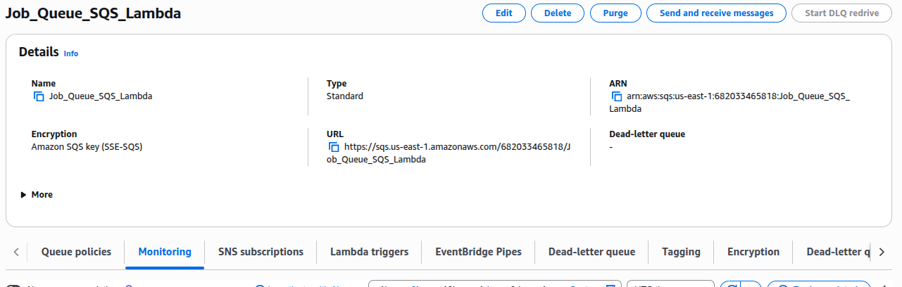

2. Create Role for Lambda and attach this role to lambda.

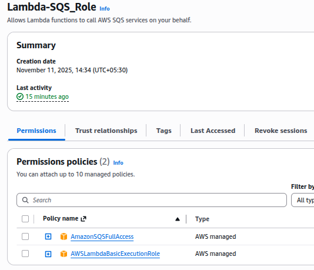

3. Create lambda & choose Runtime as `Runtime: Python 3.10`.

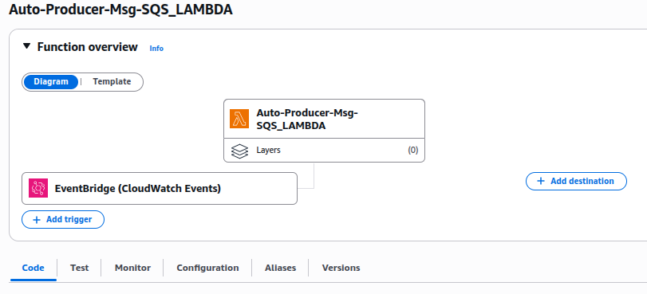

4. To Execute this lambda every minute by Lambda

  - In the Lambda console, click Add trigger.

  - Select EventBridge (CloudWatch Events).

  - Rule: Create a new rule.

  - Rule name: Give_Rule_Name

  - Schedule expression: rate(1 minute).

  - Click Add.

  - 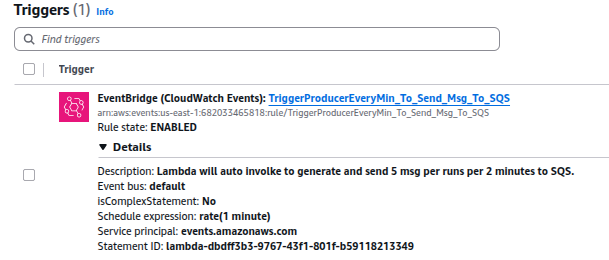

5. Test your lambda code to send msg to sqs

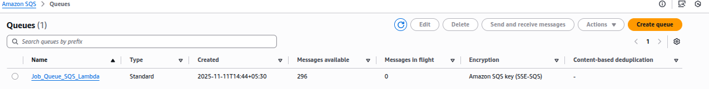

6. Create ASG and create Scale out and Scale in policy

7. Create CloudWatch Alarm.

  - Choose SQS > Queue Metrics for metrics

  - 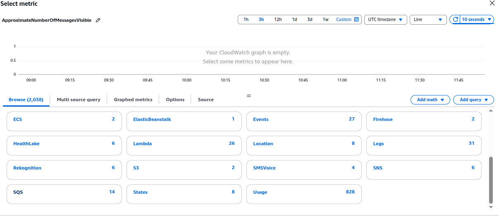

8. Choose below metrics

  - 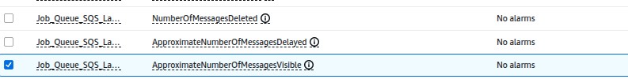

9. Set treshold for >= 300 msg for Max.

10. Add ASG Actions

11. Choose your ASG and Choose which policy will apply for this metrics.

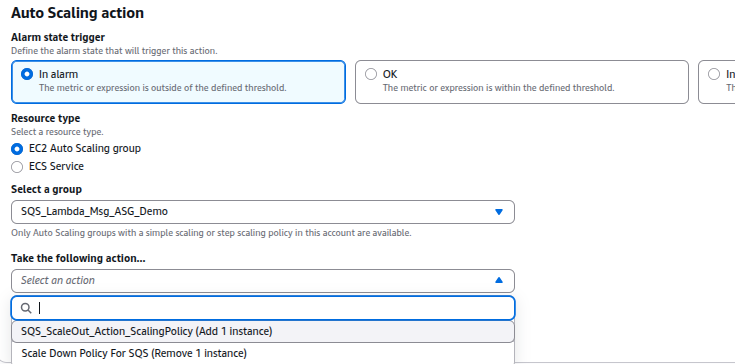

12. Same do for Scale in policy

13. Created CW Alerts.

  - 


S3 Bulk Ops
---

# Amazon S3 Batch Operations

## Overview
**Amazon S3 Batch Operations** allow you to perform **bulk actions** on existing S3 objects with a single managed request.  
Instead of writing scripts to loop through millions of files, you can use this feature to apply changes efficiently, reliably, and with full tracking.


## How It Works
An S3 Batch Operation job includes:
- **List of Objects** → which files to process  
- **Action to Perform** → what operation to execute  
- **Optional Parameters** → extra configuration  

AWS handles:
- Task scheduling  
- Parallel execution  
- Retries on failure  
- Progress tracking  
- Notifications and completion reports  


## Common Use Cases
1. Modify metadata or object properties in bulk  
2. Copy objects between S3 buckets  
3. Encrypt all unencrypted objects in a bucket  
4. Update ACLs or tags for multiple objects  
5. Restore many archived objects from S3 Glacier  
6. Invoke a Lambda function for each object (custom actions)


## Why Use S3 Batch Operations Instead of Custom Scripts?
| Feature | Batch Operations | Custom Script |
|----------|------------------|---------------|
| Automatic retries | Yes | Manual |
| Progress tracking | Yes | Manual |
| Completion reports | Yes | Manual |
| Notifications | Yes | Manual setup |
| Scalability | Up to billions of objects | Limited by script runtime |


## Preparing the Object List
To tell S3 Batch which objects to process:

1. **Use S3 Inventory**  
   - Automatically generates a CSV or Parquet file listing all objects in your bucket.  

2. **Filter with Amazon Athena**  
   - Query the inventory file to select only the specific objects you want to process (e.g., only unencrypted ones).  

3. **Submit to S3 Batch Operations**  
   - Use the filtered file as the *manifest* for your Batch Job.  


## Example Use Case: Encrypt Unencrypted Objects
1. Generate an **S3 Inventory report** for your bucket.  
2. Use **Athena** to query and find all objects missing encryption.  
3. Create an **S3 Batch Operations job** with:
   - Action: `PutObject`
   - Parameters: Apply default encryption (e.g., SSE-S3 or SSE-KMS)
4. S3 Batch executes encryption on all selected objects.
5. Check progress and review the **final completion report**.


| Step | Description |
|------|--------------|
| 1 | Generate S3 Inventory list |
| 2 | Filter objects using Athena |
| 3 | Create an S3 Batch job (define action + parameters) |
| 4 | AWS processes all objects automatically |
| 5 | Review completion status and reports |


Amazon Athena
---

- Amazon Athena is a Serverless query service to analyze lot of data by make query to filter and analyze data stored in S3.

- It uses std SQL Language to query the files.

- Athena supports CSV, JSON, ORC, Avro and Parquet.

- Pricing: $5/TB.

- Athena can be used with **Amazon Quicksight** service to create **Reports and Dashboards** of fileterd and Analyzed data by athena.


- Use Case: To query, analytics, reporting and to analyze & query any kind of logs that originate from your AWS Accounts like CloudTrail, ELB Logs, VPC Flow logs etc.

**Amazon Athena - Federated Query**

- Allows you to run sql queries across data stored in `Relational`, `Non-relational`, `Objects` and `Custom data sources` stored on AWS or On-premises.

**How it works ?**

- Use `Data Source Connectors` that run `AWS Lambda Functions` to run Federated queries. (Ex. Cloudwatch logs, DynamoDB, RDS etc)

- You have Athena connected to Lambda functions.
- Lambda has connected to Data source connnectors.
- Now you can make query to all aws services by Athena.

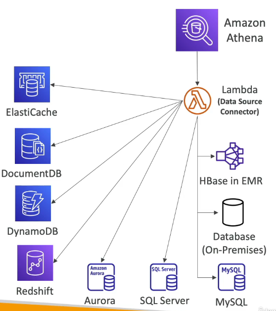

Amazon S3 - MFA Delete
---

- MFA will be required to:

  - Permanently delete an object versions.
  - Suspend versioning on the bucket.

- MFA Won't be required to:
  
  - Enable Versioning
  - List deleted versions

- To use MFA DELETE, **Versioning must be enabled** on the bucket.

- Only **Root User** can enable S3 MFS DELETE from AWS CLI.

```bash
aws s3 ls --profile "root-account-awscli-profile"

aws s3api put-bucket-versioning --bucket <bucket_name> --versioning-configuratino Status=Enabled,MFADelete=Enabled --mfa "<arn-of-mfa-device> <mfa-code>" --profile <root_profile>

```

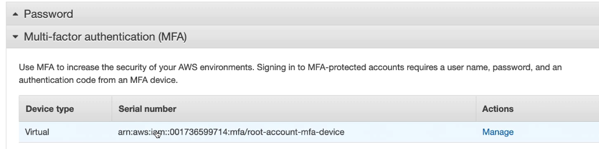


S3 Access logs
---

- Any request made to S3, from any account, authorized or unauthorized, denied , all will be logged into another S3 Bucket.

- This data will analuzed by Amazon Athena.

- Your S3 bucket and Target S3 bucket should be in Same Regions.

- Create Dest Bucket.
- Go to Existing bucket > Properties > Server Access Logging > Choose Dest bucket > enabled.

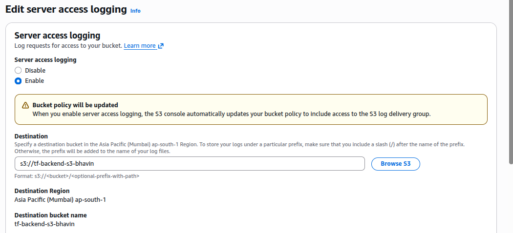

- Go to Dest Bucket and see for logs

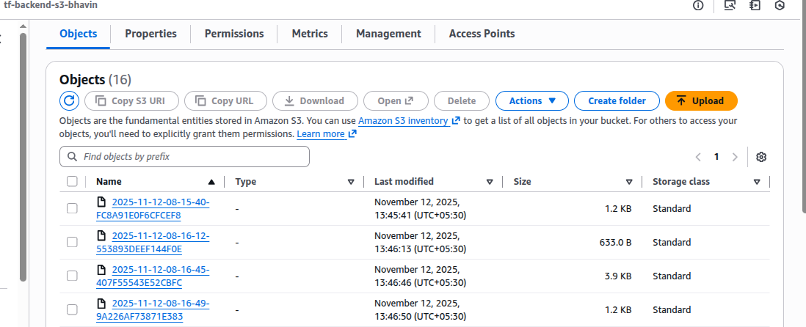


S3 VPC EndPoints
---

- Only accessed by resource in the VPC only.
- **DNS Support** Should Enabled in VPC.

- Keep on using the `Public DNS of S3`.

- Make sure OubBound rules of SG of Privat EC2 allows to S3.

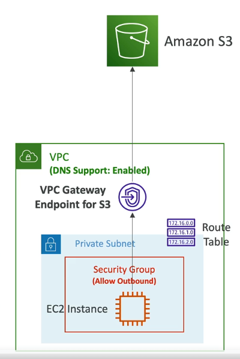

Use Case: You have EC2 in Private Subnet and You have S3 Bucket. You want to Access this S3 bucket for Private EC2. You can use `VPC Gateway Endpoint for S3`.

VPC Interface EndPoints
---

- ENIs are deplyed in your private subnets.
- This ENIs will have its own Security groups.

- Now, You can access S3 from **On-premises** via VPN and Direct Connect.

- For this It should enabled Both VPC Settings **Enable DNS hostnames** and **Enable DNS Support**.

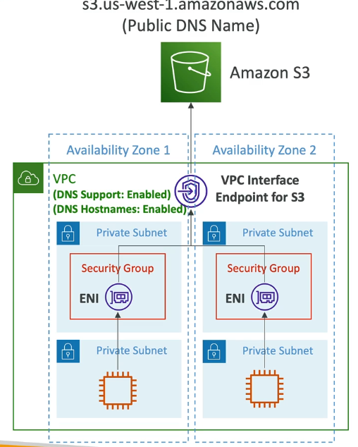


AWS Disaster Recovery
---

**1. AWS DataSync**

- Move large amount of data `to` and `from` :
  
  - On-premises/other cloud to AWS. **Agent is required**..
  - AWS to AWS (diff storage services) - `No agent required`.

  - Can Synchronize to:
    - Amazon S3(including Galciers)
    - Amazon EFS
    - Amazon FSx(Windows, Luster, NetApp, OpenZFS)

  - You can schedule backup for hourly, daily, weekly.

  - `DataSync` will kepp your **File Permissions** and **Metadata preserved**.

  - One Agent task can use 10 Gbps, 

## AWS DataSync NFS/SMB protocol to AWS S3, EFS, FSx

- You have On-premise server of SMB/NSF protocol.

- You have to install **AWS DataSync Agent** in your On-premises server

- After that you will be able to connect your on-premise server to AWS DataSync service for backup.


**NOTE**: `You want to Take backup of your On-premise server into AWS storage options vis **DataSync service** but you dont have a capacity for it to store data.

**You can use `AWS Snowcone` service which will have Pre-installed DataSync Agent. You can ship to Amazon after taking backup.**

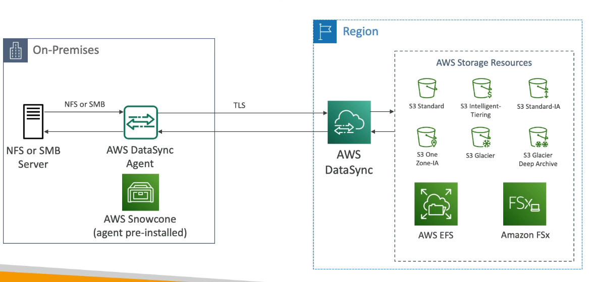

**2. AWS Backup**

- It is centrally manage and automate backup across AWS Services.

- It will take backup from:

  - Amazon EC2 / EBS
  - Amazon S3
  - Amazon RDS / Aurora / DynamoDB
  - Amazon EFS / FSx
  - AWS Storage Gateway

- It supports `cross-regions` backup.

- Also supports `cross-account` backup.

- You can create backup for specific resource tags.

EventBridge Context Filter
---

1. Create S


EventBridge - Pipe
---

- you can pull all events from variations of sources to Targeted destinations services.


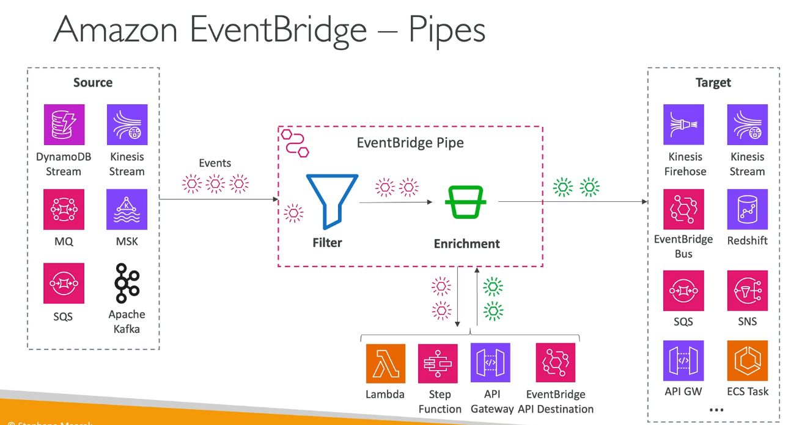


- By EventBridge - Pipe you can fileter for a specific event let you pass to dest services  and also let you Enrichment (Let you transform event into data type formate you need).

- For Enrichment that event into data type formate you can use other services like:

  - Lamdba,
  - Step Functions,
  - API Gateway,
  - EventBridge API Destinations.

- Once this all event has been filetered and processed , you can send it to Target Services.

- We will not required to write the code to send to Target.


EventBridge - Retries & DLQs
---

- Sometimes events can't be delivered to a Target due to:

  - Target not being available
  - Network Issues

- You can define a **Retry Policy** by configuring:

  - Length of Time (defult: 24hr)
  - Retry Attempts (default: 185)

- By defining **Retry Policy** it will retry atleast 185 times in 24 hr and send to dest services.

- During this, you can send Undelivered events to **Dead Letter Queue (DLQ)** using SQS for later processing.

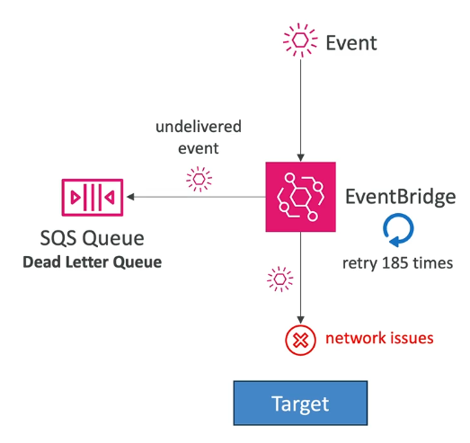

EventBridge - Trigger SSM Automations
---

- You can specify SSM Automations as a target of EventBridge event

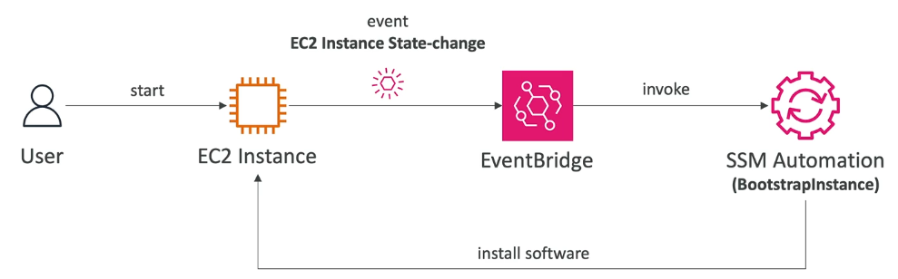

- You can schedule or When a specific event occurs you can trigger EventBridge for same.

EventBridge - Cross-Account
---

- You have EventBridge as a Target

- You have 2 diff aws account.

- You want to Send an event from one account to another account's EventBridge event-bus.

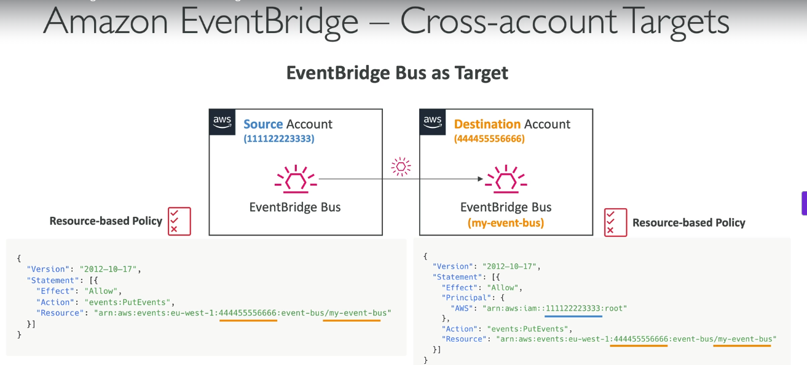

- You will required a Resource-based policy to allow Accont 1 to Putevents in another Account. 

- Account 2 is also required a Policy to Recevie and Put event from account 1.


Cross-Account VPC Peering
---

- Create VPC Peering

- Choose Your VPC ID
- Select Another Account - Enter User B Account ID.

- Send VPC Peering Request

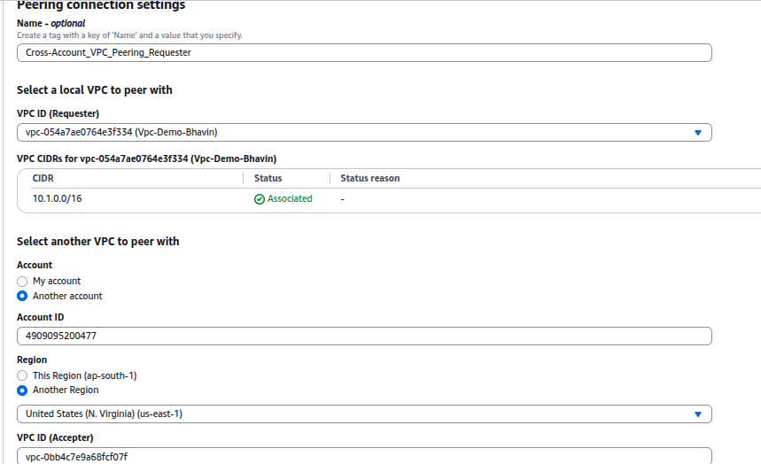

- User B will Accept the request.

- Add Route Table to Use User B VPC id and Peering Connection ID.

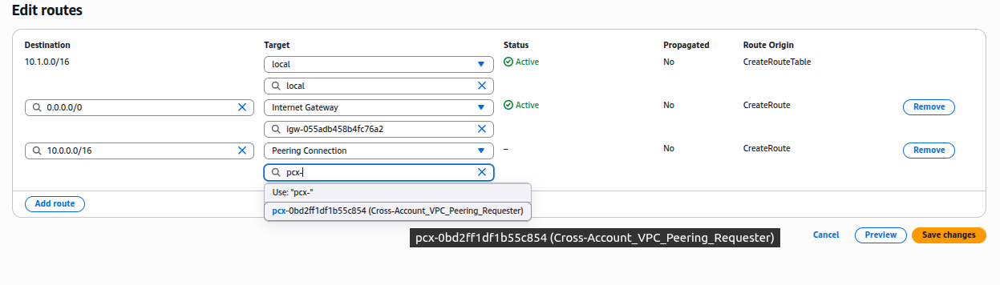

- Add Pub SG for allow inbound traffic from User B Account

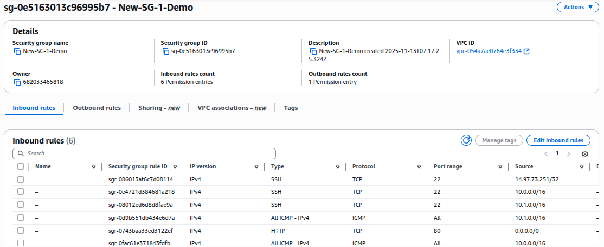

- Allow traffic from Pub Subnet to Private Subnets only.

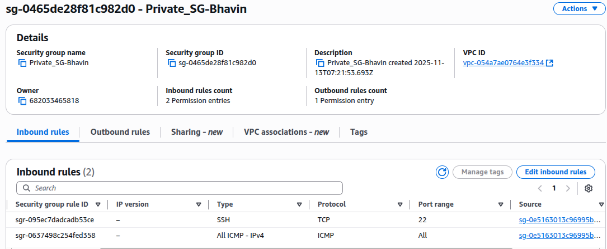

- Modify Route table, SG same way for Account B user.

- SSH into My Account's Public EC2

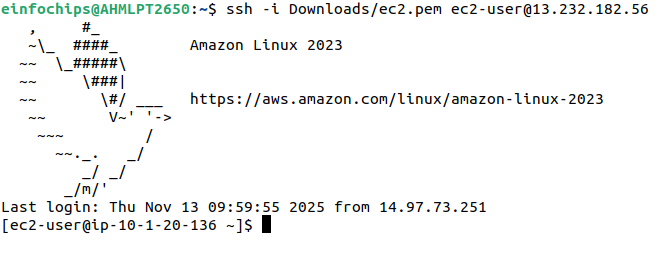

- Try to Ping and SSH into User B Public EC2

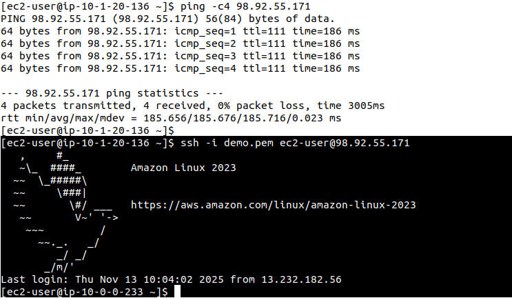

- Try to Ping and SSH into User B Private EC2

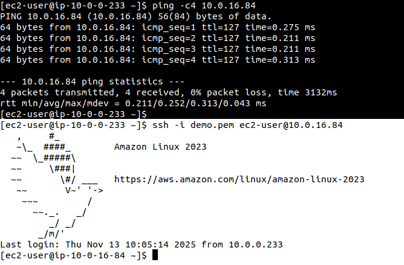


EventBridge Cross Account
---

- Go to Event Bus - Add resoruce policy to Allow to Account B can put their events into My Account A.


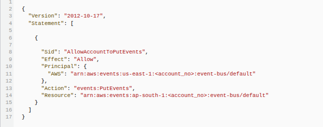

- Go to Account A and Define EventBridge Rule for EC2 for Status: running
- Assign Resource Policy to EventBridge for Put Event from Account A to Account B by using ARN of EventBridge Default Bus of Account B.


- Go to Account B > Create Role for SSM and give permissions.

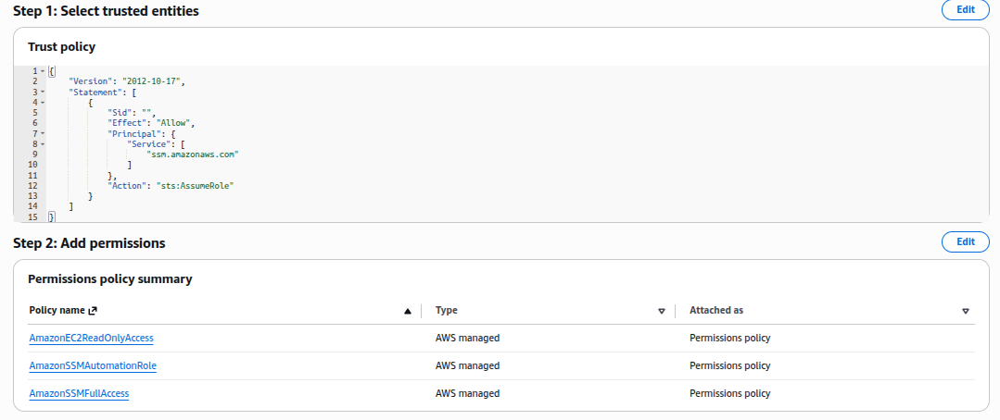

- Create SSM Doc To install nginx

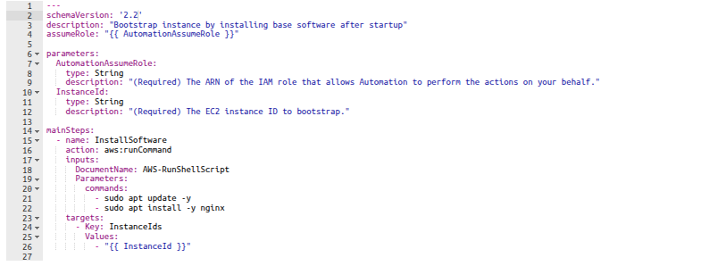

- Create EventBridge Rule in Account B.
- To Trigger SSM Automation in Account A - Choose Target As Account A.

```yml
{
  
  "source": ["aws.ec2"],
  "account": ["490909520477"],
  "detail-type": ["EC2 Instance State-change Notification"],
  "detail": { "state": ["running"] }
}
```

- Choose target as SSM and Give ARN of SSM Role

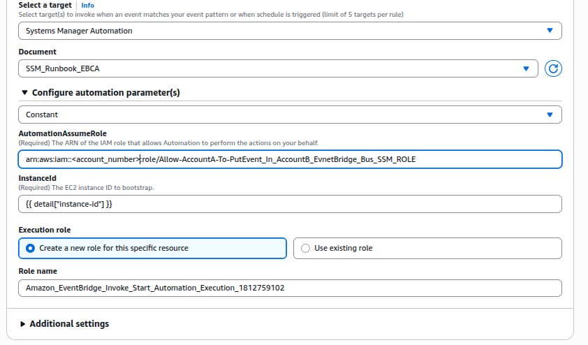

