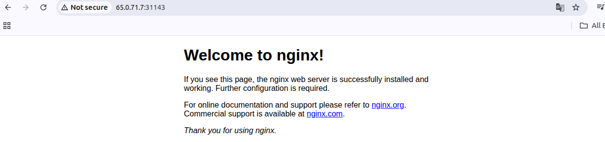

Create Deployments
---

- Create Deployments
```bash
kubectl create deployment <deployment_name> --image=<image_name>

kubectl create deployment my-first-deployment --image=nginxdemos/hello

kubectl get deployments

kubectl describe deployment my-first-deployment
```


Scaling Deployments
---

```bash

# Scale Up the deployment

kubectl scale --replicas=4 deployment/<deployment_name>

kubectl scale --replicas=4 deployment/my-first-deployment

# Scale Down the Deployment

kubectl scale --replicas=2 deployment/my-first-deployment
```


Update Deployments
---

### Introductions

- We can update deployments using two methods
    - Set Image
    - Edit Deployment

## 1. Updating Apps version V1 to V2 using 'Set Image'

```bash

kubectl set image deployment/<deployment_name> <container__name>=<container_image>

kubectl set image deployment/my-first-deployment hello:nginxdemos/hello

# If your lables is matches into your svc and deployment/pods etc , it will work.
```


- ## 1.2. Go back to previous Versions

```bash
kubectl rollout undo deployment/my-first-deployment
```



- ## 1.3. Go to Specific Revision Number Only

```bash
kubectl rollout undo deployment/my-first-deployment --to-revision=3
```

- ## 1.4 List of all history of revisions

```bash
kubectl rollout history deployment/my-first-deployment
```
