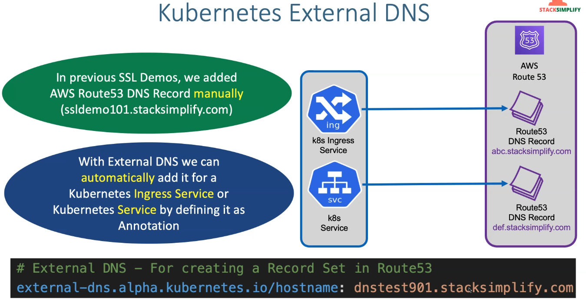
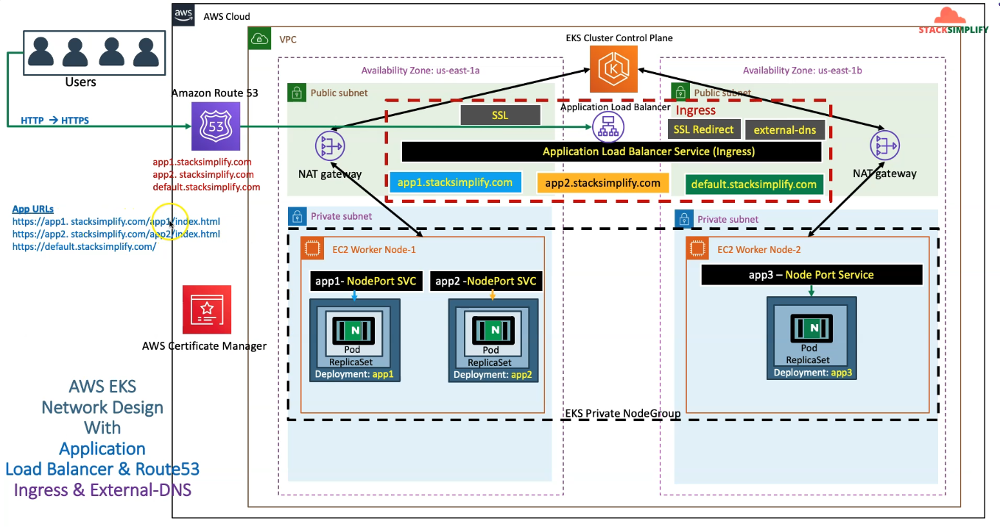
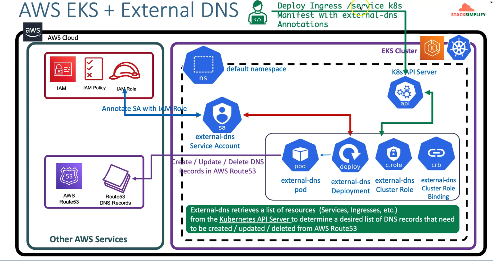
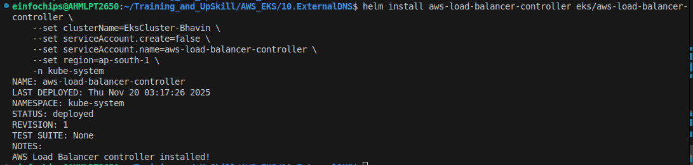
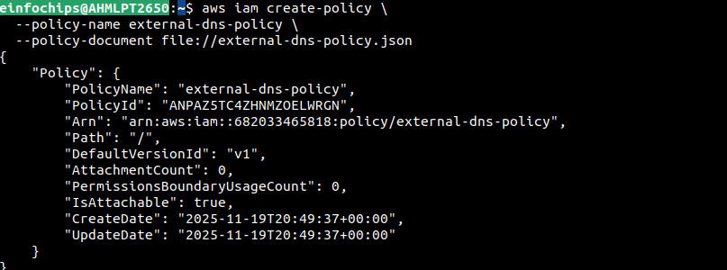
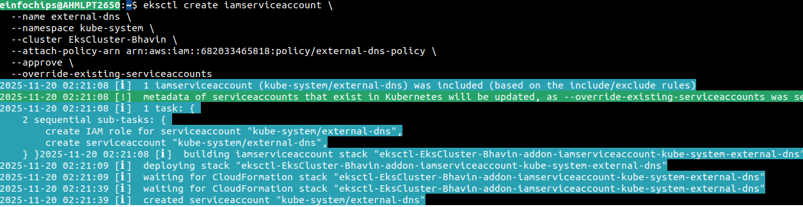
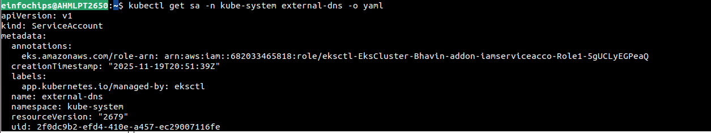

K8s External DNS
---

- In previous SSL Ingress Project, we added AWS Rout53 DNS Records manually (*.yourdomains.com)

- With help of `External DNS` we can automatically add it for a Kubernetes Ingress Service by `Defininig its Annotatinos`.

Annotations:
    external-dns.alpha.kubernetes.io/hostname: <sub_domains>.<your_domains_name.com>



- You can **Create**, **Update** and **Delete** DNS Records using this External DNS Service.




## This is how it works!



- You have to create Service Account for this External DNS.

- Assign IAM Role to this SA & SA will create in Default NameSpace.

- Once `kube-apiserver` will get info about deployment for this External DNS it will create and configure all things defined in `Ingress Service`.


## 1. Create cluster

```yml
eksctl create cluster --name=EksCluster-Bhavin \
--zones=ap-south-1a,ap-south-1b \
--region=ap-south-1 \
--without-nodegroup
```

## 2. Create & Associate IAM OIDC Provider for our EKS Cluster

```yml
eksctl utils associate-iam-oidc-provider \
    --region ap-south-1 \
    --cluster EksCluster-Bhavin \
    --approve
```

## 3. Create Node Group (worker nodes) with additional Add-Ons in Private Subnets

```yml
eksctl create nodegroup --cluster=EksCluster-Bhavin \
    --region=ap-south-1 \
    --name=nodegroup-private \
    --node-type=t3.medium \
    --nodes=2 \
    --nodes-min=2 \
    --nodes-max=3 \
    --node-volume-size=20 \
    --ssh-access \
    --ssh-public-key=eks-demo \
    --managed \
    --asg-access \
    --external-dns-access \ 
    --full-ecr-access \
    --appmesh-access \
    --alb-ingress-access \
    --node-private-networking # This will make worker node in private subnets.
```

## 4. Varify Cluster, NodeGroups

```bash

# Varify EKS Cluster
eksctl get cluster

# Varify EKS Node Groups
eksctl get nodegroup --cluster=EksCluster-Bhavin

# Varify if anuy IAM Service Accounts present in EKS Cluster

eksctl get iamserviceaccount --cluster=EksCluster-Bhavin

# Configure kubeconfig for kubectl

eksctl get cluster

aws eks --region<region-code> updat-kubeconfig --name<cluster_name>

aws eks --region ap-south-1 update-kubeconfig --name EksCluster-Bhavin

# Varify EKS Nodes in EKS Cluster
kubectl get nodes
```

## 5. Create IAM Policy

- Create IAM Policy for AWS Load Balancer Controller that allows it to make calls to AWS APIs on your behalf.

### 5.1 Download IAM Policy latest by manual
```bash
curl -o iam_policy_latest.json https://raw.githubusercontent.com/kubernetes-sigs/aws-load-balancer-controller/main/docs/install/iam_policy.json

###  Verify latest
ls -lrta 
```

### Create IAM Policy for Load Balancer with downloaded Latest IAM Policy

```bash
aws iam create-policy \
    --policy-name AWSLoadBalancerControllerEKSIAMPolicy \
    --policy-document file://iam_policy_latest.json
```

### Attach IAM Policy to SA to Creat Role and Create SA for Load Balancer
```bash
eksctl create iamserviceaccount \
    --cluster=EksCluster-Bhavin \
    --namespace=kube-system \
    --name=aws-load-balancer-controller \ # Service Account name here
    --attach-policy-arn=arn:aws:iam::682033465818:policy/AWSLoadBalancerControllerEKSIAMPolicy \
    --override-existing-serviceaccounts \
    --approve

# Install Load Balancer Controller with our LB Service Account

```bash
helm install aws-load-balancer-controller eks/aws-load-balancer-controller \
  --set clusterName=EksCluster-Bhavin \
  --set serviceAccount.create=false \
  --set serviceAccount.name=aws-load-balancer-controller \
  --set region=ap-south-1 \
  -n kube-system
```



### Install Ingress Class

```bash
kubectl apply -f kube-manifests/ingress_class.yml
```


### Set up IAM permissions and deploy ExternalDNS

  1. Create the following policy to set up IAM permissions that give the ExternalDNS pod permissions to create, update, and delete Route 53 records in your AWS account:

```json # external-dns-policy.json
{
  "Version": "2012-10-17",
  "Statement": [
    {
      "Effect": "Allow",
      "Action": [
        "route53:ChangeResourceRecordSets"
      ],
      "Resource": [
        "arn:aws:route53:::hostedzone/*"
      ]
    },
    {
      "Effect": "Allow",
      "Action": [
        "route53:ListHostedZones",
        "route53:ListResourceRecordSets",
        "route53:ListTagsForResource"
      ],
      "Resource": [
        "*"
      ]
    }
  ]
}
```

#### Creat IAM Policy for External DNS

```bash
aws iam create-policy \
    --policy-name external-dns-policy \
    --policy-document file://external-dns-policy.json
```




  2. Use the policy to create an IAM role for the service account for External DNS:

```bash
eksctl create iamserviceaccount --name SERVICE_ACCOUNT_NAME --namespace NAMESPACE 
--cluster CLUSTER_NAME --attach-policy-arn IAM_POLICY_ARN --approve

# Create Service Account and Associat this IAM to Creat ROLE

eksctl create iamserviceaccount \
    --name external-dns \
    --namespace default \
    --cluster EksCluster-Bhavin \
    --attach-policy-arn arn:aws:iam::682033465818:policy/List_and_Update_DNSRecords_EKS_ExternalDNS \
    --override-existing-serviceaccounts \
    --approve 
```




### Verify service account of External DNS has attached role

```bash
kubectl get sa -n kube-system external-dns -o yaml
```



### Create Cluster Role, Binding it with Service Account and Give Permission to External DNS Pod in Deployment

  1. Create Service Account if not created.
```bash
  apiVersion: v1
kind: ServiceAccount
metadata:
  name: external-dns
  namespace: kube-system
  annotations:
  # Attach here IAM Role of External DNS Service Account by describe SA of External DNS.
    eks.amazonaws.com/role-arn: arn:aws:iam::682033465818:role/eksctl-EksCluster-Bhavin-addon-iamserviceacco-Role1-5gUCLyEGPeaQ 

---

---
# Create Cluster Role to give access of eks resources by ExternalDNS Service.
apiVersion: rbac.authorization.k8s.io/v1
kind: ClusterRole
metadata:
  name: external-dns
rules:
- apiGroups: [""] 
  resources: ["services","endpoints","pods"] # 
  verbs: ["get","watch","list"] # Permission of read and list.
- apiGroups: ["extensions","networking.k8s.io"]
  resources: ["ingresses"] # For Any of ingress resource can get, watch, list
  verbs: ["get","watch","list"]
- apiGroups: [""]
  resources: ["nodes"] # For Resource of Nodes can list and watch
  verbs: ["list","watch"]

---

# Cluster role binding with some permission given to SA of External DNS.
apiVersion: rbac.authorization.k8s.io/v1
kind: ClusterRoleBinding
metadata:
  name: external-dns-viewer
roleRef:
  apiGroup: rbac.authorization.k8s.io
  kind: ClusterRole
  name: external-dns
subjects:
- kind: ServiceAccount
  name: external-dns
  namespace: kube-system

---

# Give External DNS Pods Permission of cluster role by using Service Account of External DNS.

# External DNS SA has all permission which is required to External DNS Pod Deloyments.

# So whenever you deploy ingress services it will watch kube-apiserver for that.
# Once detect ingress has been deployed in cluster , External DNS Service will list , see , watch all nodes, pods in your cluters for every namespace and Create DNS Records in your Route53.

# For Create and Modify DNS Records your Service Account of External DSN is already has Permission for that.
apiVersion: apps/v1
kind: Deployment
metadata:
  name: external-dns
  namespace: kube-system
spec:
  strategy:
    type: Recreate
  selector:
    matchLabels:
      app: external-dns
  template:
    metadata:
      labels:
        app: external-dns
      # If you're using kiam or kube2iam, specify the following annotation.
      # Otherwise, you may safely omit it.  #Change-2: Commented line 55 and 56
      #annotations:  
        #iam.amazonaws.com/role: arn:aws:iam::ACCOUNT-ID:role/IAM-SERVICE-ROLE-NAME    
    spec:
      serviceAccountName: external-dns
      containers:
      - name: external-dns
        #image: k8s.gcr.io/external-dns/external-dns:v0.10.2
        image: registry.k8s.io/external-dns/external-dns:v0.20.0
        args:
        - --source=service
        - --source=ingress
        # Change-3: Commented line 65 and 67 - --domain-filter=external-dns-test.my-org.com # will make ExternalDNS see only the hosted zones matching provided domain, omit to process all available hosted zones
        - --domain-filter=bhavindevops.shop
        - --provider=aws
       # Change-3: Commented line 65 and 67  - --policy=upsert-only # would prevent ExternalDNS from deleting any records, omit to enable full synchronization
        - --aws-zone-type=public # only look at public hosted zones (valid values are public, private or no value for both)https://chatgpt.com/c/6918cbf0-ad48-8320-8db7-933fa307eb6e
        - --registry=txt
        - --txt-owner-id=my-hostedzone-identifier
      securityContext:
        fsGroup: 65534 # For ExternalDNS to be able to read Kubernetes and AWS token files
```

- Deploy all kube-manifests

- Ensure Your LB is created

```bash
kubectl describe ingress <ingress_name>

# Look for Deployed LB reconsile
```

- Go to your Hosted Zones

- Look for a new DNS Records has been created by Ext DNS Serivce


- Browse this DNS Records to access your multiple Apps for Name Based Routing.

- App1


- Default App


