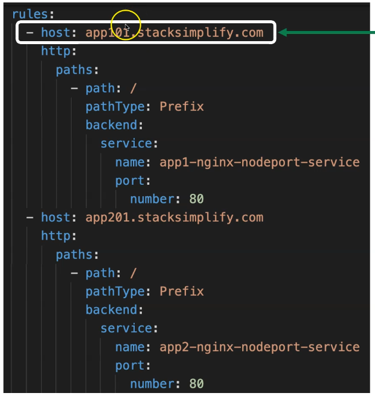
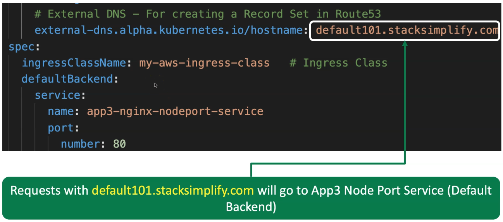

Name Based / Host Header Routing with External DNS
---

Ex. app1.yourdomain.com - route to App1 Apps Pods,
    app2.yourdomain.com - route to App2 Apps Pods.


- While you configure Ingress service for header routing with External DNS.
- It will create DNS Recoreds in Route53 automatically.
- Here, you will not required to craete DNS Records manually.

- Also, It will supports for diff Subdomains for multiple targets applications.

**You have to Add these two things in your Ingress Service**

- 1. Add hosts 



- 2. add defult backend



## Deploy resources
```bash
kubectl apply -f kube-manifests/
```

## Check DNS Records for all 3 diff apps and hosts entry is created and it is targeting to our ALB.

## Browse apps

- Browse apps with diff hostname.

