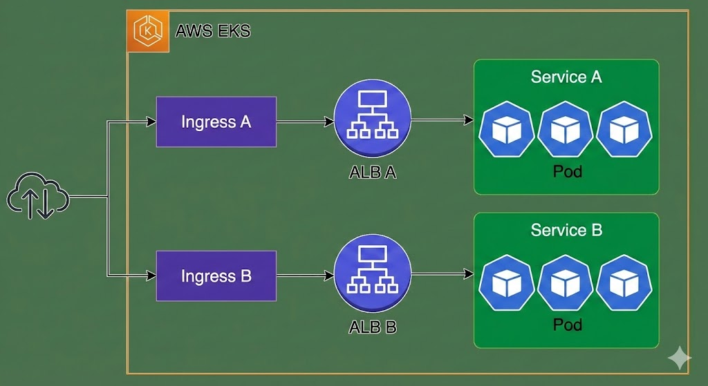
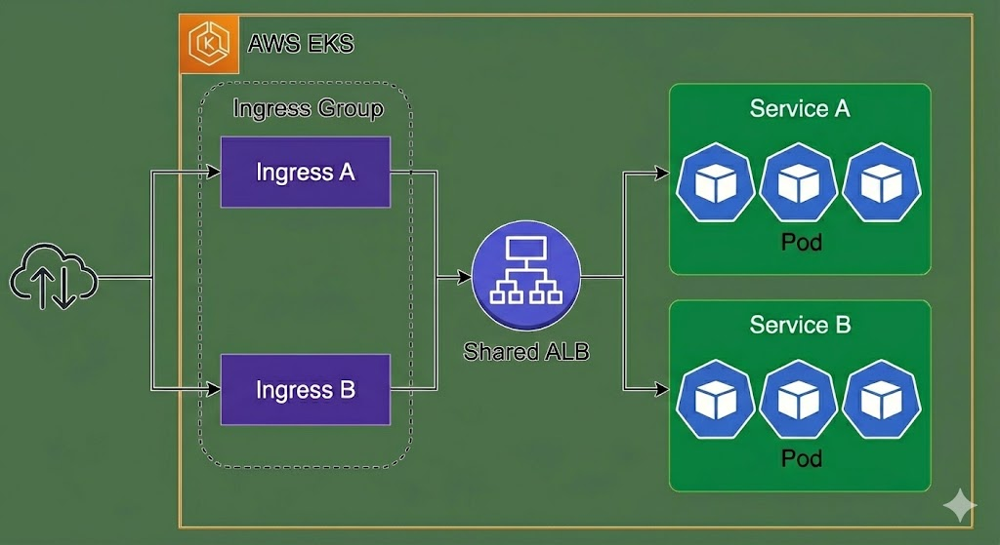
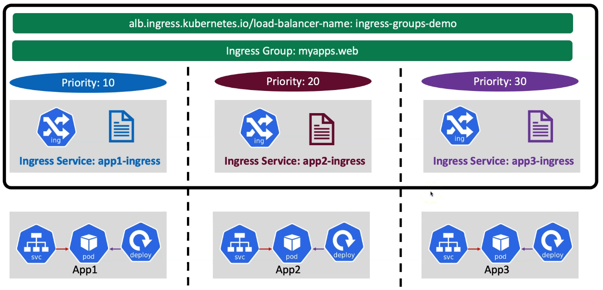
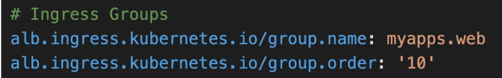
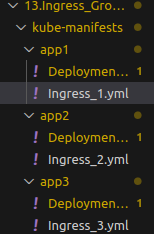
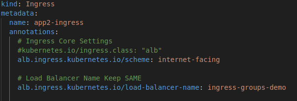
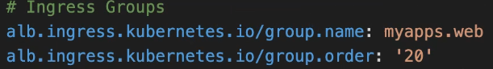
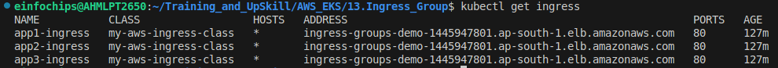
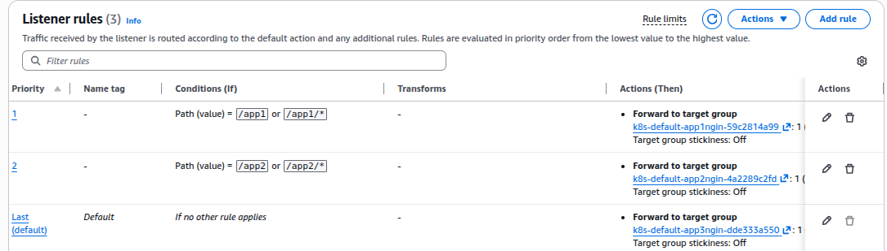
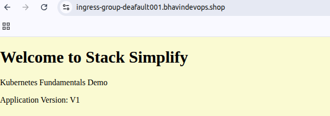

ALB Ingress - Ingress Group
---

**The Problem: Multiple Load Balancers**

- In a standard EKS setup, each Kubernetes Ingress resource you create typically provisions a separate AWS Application Load Balancer (ALB). 
- As you add more services and Ingress rules, the number of ALBs grows, which can lead to higher costs and complex management.



**The Solution: Introducing Ingress Groups**

- An Ingress Group is a feature of the AWS Load Balancer Controller that allows you to group multiple Ingress resources together. 
- **By adding a specific annotation** (`alb.ingress.kubernetes.io/group.name`) to your Ingress resources, you tell the controller that they belong to the same logical group.



T**he Result: A Single, Shared Load Balancer**

- Once the `AWS Load Balancer Controller detects` the `Ingress Group`, it automatically consolidates the rules from all Ingress resources in that group onto a single, shared Application Load Balancer. 
- This significantly reduces cost and complexity.

With Ingress Group
---



- You can group all Ingress Resource and its deployments into Sigle ALB via Ingress Group And your ALB can direct your ALB request to respective Ingress Rules/Resource.


- You can give Priorith to Ingress Rule/Resource.

- Most annotatinos defined on an Ingress only applies to the paths defined by that ingress.

- You have to define that from which Ingress group your ingress resource are belongs to ? By `group.name`

- Also have to give Priority to that Ingress Resource by `group.order`.



- Our directory sturcture should like this



Keep in Minds! What will be changes for Ingress Group
---

1. Change your Ingress Resource name

```bash
metadata:
    name: app2-ingress
```



2. Keep same Load Balancer name

```bash
alb.ingress.kubernetes.io/load-balancer-name: ingress-groups-demo
```

3. Use Same Ingress Group name and Give Priority to each Ingress Resource as below




- Deploy Ingress Resouce to use Ingress Group

```bash
kubectl apply -R -f kube-manifests
```


- After deploy this, It should create 3 diff ingress resource

- Ensure it created 3 diff Ingress Resource by
```bash
kubectl get ingress
```



- If your `external-dns` pod is restarting every minutes.
- You may have issue with RBAC in Cluster Role.

- Ensure you had given proper pemissions to create, update, delete DNS Records and list DNS service.

```bash
- apiGroups: [""]
  resources: ["services","endpoints","pods", "create","patch"]
  verbs: ["get","watch","list"]
```

- ALB Controller created Load Balancer Rules.




- Verify DNS Records has been created

- Just Browse your Domains

- Default App



- App1


- App2

