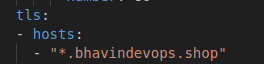
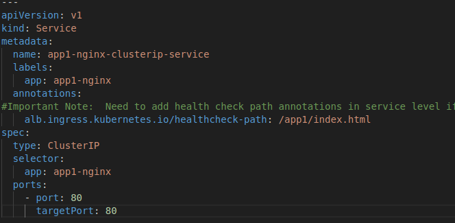
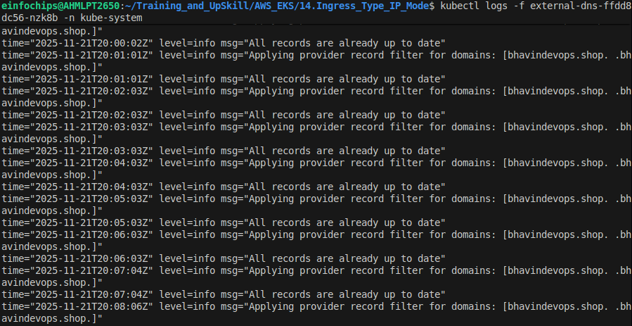
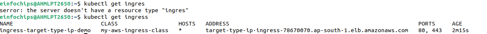
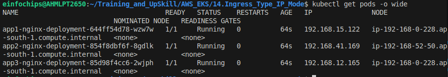
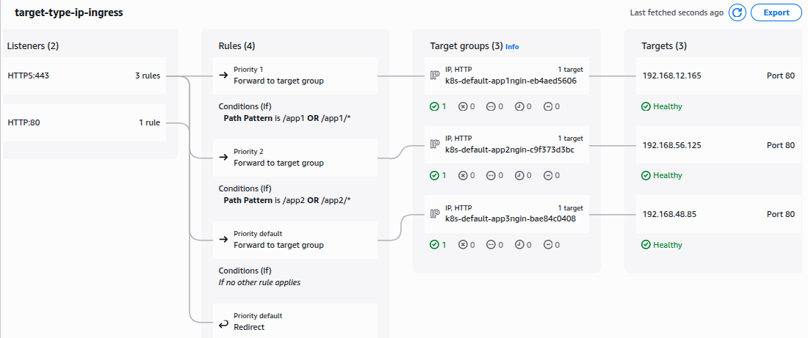
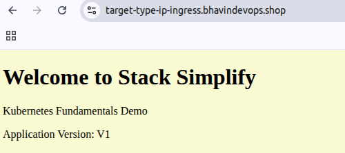
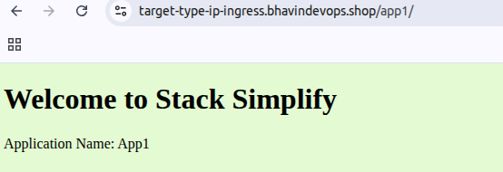

# AWS Ingress Target Types and IP Mode

## 1. AWS Ingress Target Types

- When creating an **Ingress** in EKS, the AWS ALB (Application Load Balancer) needs to know **what to route traffic to**. This is defined by the **target type**.

| Target Type | Description | Notes |
|------------|-------------|------|
| `instance` | ALB routes traffic to **nodes (EC2 instances)** in the EKS cluster. | Works with NodePort services. Each node must allow traffic on NodePort. |
| `ip`       | ALB routes traffic directly to **pod IPs**. | Works with ClusterIP or NodePort services. No dependency on node ports. Recommended for most workloads. |
| `lambda`   | ALB routes traffic to an **AWS Lambda function**. | Used for serverless backend integrations. |

**Default:** `ip`

**Routing Flow Example:**
- **instance:** ALB → EC2 Node → kube-proxy → Pod
- **ip:** ALB → Pod directly (via VPC networking)

- Instance mode will route traffic to all ec2 instance within cluster on NodePort opened for your service.

- Service must be of type NodePort of LoadBalancer to use instance mode.

- Default Target Type is Instance Mode which means no need to define this annotaion in ingress, by deafult it takes Instance Mode.

```bash
# Target Type: Istance
alb.ingress.kubernetes.io/target-type: instance
```

---

## 2. IP Mode

**IP Mode** defines **which IP version** the ALB uses to reach targets (pods or nodes).

- IP Mode will route traffic directly to the Pod IP.

- Your request will go to Load Balancer to Directly to Pod IP.

- IP Mode is requiredd for Sticky Sessions to work with Application Load Balancer.

Ex. Usefull while use Fargate.

- Need to define the annotation explicitly as `target-type: ip`.

```bash
# Target Type: IP
alb.ingress.kubernetes.io/target-type: ip
```


| Mode       | Description | Use Case |
|-----------|-------------|----------|
| `ipv4`    | Only IPv4 addresses are used for targets. | Most common, default mode in EKS. |
| `dualstack` | Both IPv4 and IPv6 addresses are used. | For clusters with dual-stack networking enabled. |
| `ipv6`    | Only IPv6 addresses are used. | For IPv6-only clusters. |

**Notes:**
- When `target type = ip`, the ALB must know which IP version to use.
- `ip` mode works best with **Amazon VPC CNI** networking.
- IPv6-only targets require dual-stack mode for full ALB support.

---

## 3. Recommendations

- Use **`ip` target type** for most Kubernetes workloads.
- Stick to **`ipv4`** mode unless your cluster is configured for IPv6.
- Ensure ALB security groups allow traffic to the pod IPs or node ports as applicable.

---

## 4. References

- [AWS Load Balancer Controller Documentation](https://kubernetes-sigs.github.io/aws-load-balancer-controller/latest/)
- [Ingress Target Type Overview](https://docs.aws.amazon.com/eks/latest/userguide/alb-ingress.html)
- [IP Addressing in EKS](https://docs.aws.amazon.com/eks/latest/userguide/pod-networking.html)


## We are going to deploy Ingress Target Type: IP

### Which will directly communicate with Pods IP.
### Not required NodePort Service.

1. Give Annotations for taget-type: ip


2. Write tls path to not required AWS Certficate ARN Hardcoded.



3. Create Service as ClusterIP




4. Deploy kube-manifests

5. Ensure your External DNS Pods is wokring well



6. Ensure Ingress is work well



7. Verify Pods IP is registered with Load Balancer Target Group



8. Target Group has registered Pod IP



6. Browse your domains

- Default App



- App1



- App2

