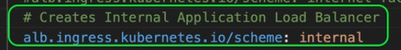
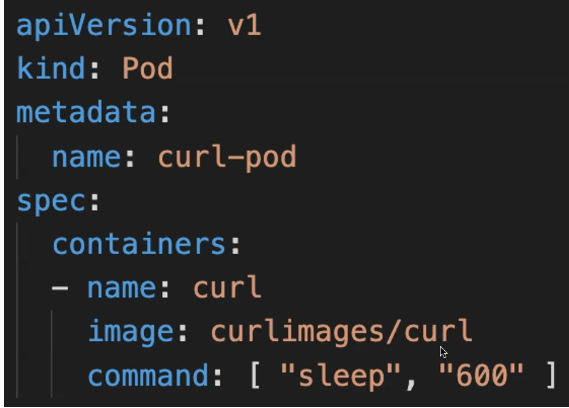
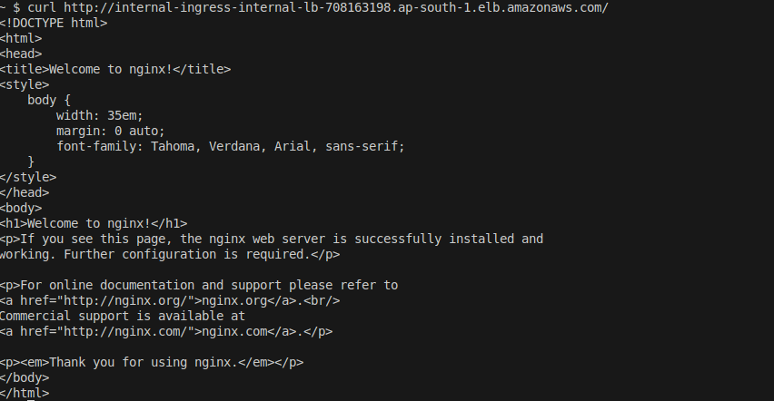
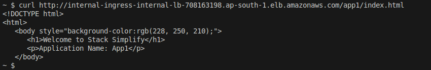

Ingress - Internal ALB
---

1. Use schema as `internal`.



- We can't connect to Internal LB directly from Internet.

- We will deploy a `curl pod` in EKS Cluster.
- So we can connect to `curl pod` and then we can connect to `Internal LB EndPoint` usig `curl` command.



We will use this commands to connect to curl to Intenal LB

  1. Deploy curl-pod
```bash
kubectl apply -f kube-manifests-curl
```

  2. Loginto curl pod
```bash
kubectl exec -it curl-pod --sh
```
  3. Curl to google and Internal LB EP
  
```bash
curl http://google.com
curl <Internal_LB_DNS>
```

  4. Default Curl Test
```bash
curl <App1_Internal_LB_EP>
```



- App1



- App2

