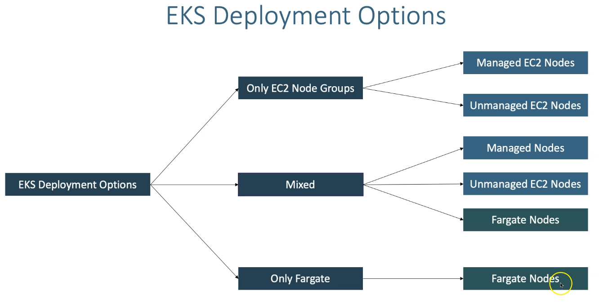
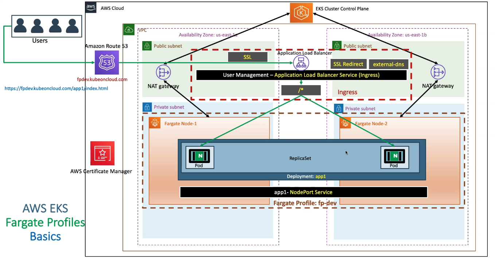
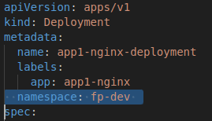
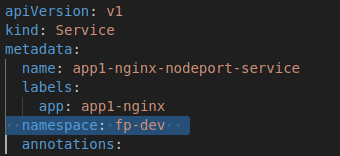
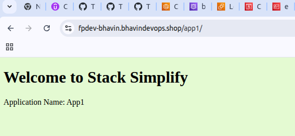

## What Is AWS Fargate?

**Fargate = Serverless compute for containers.**

With Fargate, you run containers **without provisioning or managing EC2 worker nodes**.

You no longer need to manage:

- EC2 instances  
- AMI updates  
- Node groups  
- Capacity planning  
- Scaling  

AWS automatically provides the **right amount of compute per pod**.

## How Fargate Works in EKS

In a normal Kubernetes setup:

- The Kubernetes scheduler picks a worker node  
- The pod runs on that node  

With **Fargate**:

- There are **no EC2 worker nodes**
- EKS uses a **special Fargate scheduler** inside the control plane
- That scheduler decides when and how pods should run on Fargate

## Important Components Inside EKS for Fargate

When you enable Fargate, AWS adds special components inside the EKS control plane:

### 1. Fargate Scheduler
- A Kubernetes scheduler built by AWS  
- Runs alongside the default Kubernetes scheduler  
- Decides whether a pod should run on Fargate or EC2  

### 2. Mutating Admission Controller
- Automatically adds required settings to pods for Fargate  
  (e.g., annotations, runtime config)

### 3. Validating Admission Controller
- Ensures pods meet Fargate requirements  
  (e.g., correct namespace, labels)

### 4. Control Plane Controllers
- Manage the lifecycle of Fargate pods  
- Ensure correct provisioning and execution inside AWS  

## What Are Fargate Profiles?

A **Fargate Profile** defines **which pods should run on Fargate**.

A profile contains:
- Namespaces  
- Labels  

**Example:**

```yaml
namespace: "default"
labels:
  run: fargate
```

Any pod that matches this namespace + label will run on Fargate instead of EC2


## Short Summary (Super Simple)

| Concept                   | Meaning                                             |
|---------------------------|-----------------------------------------------------|
| **Fargate**               | Serverless compute — AWS runs pods without nodes    |
| **Fargate Scheduler**     | Decides which pod runs on Fargate                   |
| **Admission Controllers** | Auto-check/modify pods for Fargate requirements     |
| **Fargate Profile**       | Rules that define which pods run on Fargate         |





- Pods are running on Fargate are supported only on Private Subnets.

EKS Fargate vs Managed Nodes vs Unmanaged Nodes
---


AWS Fargate Considerations
---

## Fargate Considerations Table

| Area                                | Details / Considerations                                                                 |
| ----------------------------------- | ---------------------------------------------------------------------------------------- |
| **Pod Scheduling**                  | Pods run only if they match a **Fargate Profile** (namespace + labels).                  |
| **No DaemonSets Support**           | Fargate **does NOT support DaemonSets** (example: logging/monitoring agents).            |
| **No Host Networking**              | HostPort, hostNetwork, hostPID, hostIPC are **not supported**.                           |
| **Ephemeral Storage Limit**         | Default: **20 GiB** ephemeral storage (configurable to 200 GiB).                         |
| **Pod Size**                        | You must choose CPU & Memory combination (e.g., 0.25vCPU/0.5GB → 4vCPU/16GB).            |
| **No Privileged Mode**              | Privileged containers are **not supported**.                                             |
| **No Init Containers (Some Cases)** | Heavy/init containers with privileged actions may fail.                                  |
| **Networking (ENI per Pod)**        | Each Pod gets an **ENI** from the subnet → increases IP usage.                           |
| **IAM Execution Role**              | Pods use **Fargate Pod Execution Role**, not node instance role.                         |
| **Logging**                         | Default: logs go to **CloudWatch Logs** unless custom configured.                        |
| **Cost Model**                      | Pay per Pod CPU/Memory **per second** → more expensive for long-running heavy workloads. |
| **Better for**                      | Lightweight APIs, jobs, low-ops workloads, burst workloads.                              |
| **Not good for**                    | High-performance apps, GPUs, DaemonSet-dependent workloads.                              |

## When Should You Use Fargate?

Use Fargate in EKS when:

* You don’t want to manage EC2 worker nodes
* You need **isolation per workload**
* Workloads are **small, bursty, or event-driven**
* Cost is acceptable for your workload type

## When NOT to Use Fargate

Avoid Fargate when workloads require:

❌ DaemonSets 

❌ Privileged containers 

❌ Sidecar-heavy apps like service mesh (Istio) 

❌ GPU workloads 

❌ Ultra-high throughput apps needing powerful nodes 

## Fargate Profile Example (YAML)

```yaml
apiVersion: eksctl.io/v1alpha5
kind: ClusterConfig
metadata:
  name: my-eks
  region: ap-south-1

fargateProfiles:
  - name: app-profile
    selectors:
      - namespace: app
        labels:
          run: webapp
    tags:
      Owner: Bhavin
```


- When you deploy pods , fargate will create that much amount of Fargate Nodes in Private Subnet Only.

- Deploy 2 Pods = Create 2 Fargate Nodes

- Fargate will have auto outbound via Net Gateway to EKS Cljuster Control Plans.

- Now You have to deploy your Ingress Service to Access your apps in Fargate Nodes via ALB Controller and External DNS.

- This Ingress will communicate to your Fargate Nodes > Pods.



# We are going to deploy Fargate Mix deployment

## 1. Deploy External DNS with ALB Controller


## 2. Create Fargate Profile on cluster

### 2.1 Create Fargate Profile

```bash
# Get list of Fargate Profiles in a cluster
eksctl get fargateprofile --cluster EksCluster-Bhavin

# Template
eksctl create fargateprofile --cluster <cluster_name> \
                             --name <fargate_profile_name> \
                             --namespace <kubernetes_namespace>
# Replace values
eksctl create fargateprofile --cluster EksCluster-Bhavin \
                             --name fp-demo \
                             --namespace fp-dev

```

- We are going to deploy a simple NGINX App1 with Ingress Load Balancer
- We cannot use Worker Node Node Ports for Fargate Pods for (Only use of Fargate IF NOT USE MIX DEPLOYMENT) for two reasons

  - Fargate Pods are created in Private Subnets, so no access to internet to access
  - Fargate Pods are created on random worker nodes whose information is unknown to us to use NodePort Service
- So, we are in mixed environment with Node Groups and Fargate, if we create a NodePort service, it will create the service with Node Group EC2 Worker Nodes Ports and it will work but when we delete those Node Groups, we will have an issue.

- Recommended to use `alb.ingress.kubernetes.io/target-type: ip` in ingress manifest for Fargate workloads

### 2.2 Create Farget Namespace

```bash
apiVersion: v1
kind: namespace
metadata:
  name: fp-dev

# OR

kubectl create ns <namespace_name>

kubectl create ns fp-dev
```

  - Update all manifests with namespace: fp-dev in metadata.

    - Update namespace in Deployment


 
    - Update namespace in Service




## 3. Update all Manifests to add `resources:`

- This is highly recommended while using Fargate to avoide restarting pods due to unavailable resources or resource exhausted due to high memory consumption by some apps.

```bash
resources:
  requests:
    memory: "128Mi"
    cpu: "500m"
  limits:
    memory: "500Mi"
    cpu: "1000m"
```

## 4. Update Ingress Resources

  1. Define annotations for use `target-type: ip` Only.

- Bcz, Fargate will not schedule pod in nodes.
- It will schedule pod in new fargate node only.
- That pod can schedule to any of fargate nodes.

- Here, NOT CONCEPT FOR INSTANCES, Just will have Pod IP.

```bash
# For Fargate
alb.ingress.kubernetes.io/target-type: ip
```

  2. Update DNS Names

```bash
# External DNS
external-dns.alpha.kubernetes.io/hostname: fpdev-bhavin.bhavindevops.shop
```

## 5. Deploy Manifests

```bash
kubectl apply -f kube-manifest

kubectl get pods -n fp-dev -o wide

kubectl get ingress -n fp-dev
```

- Ensure your deployment is working well


- Access your apps on browser

```bash
http://fpdev.<your_domains/app1/index.html>
```

- Fargate App1

