EKS - Monitoring
---

- We can set `CloudWatch Alarms` on metrics that container insights collects.
- The metrics collected by Container Insights are available in `CloudWatch Automatic Dashboards`.

- We can analyze and troubleshoot containers performance and logs data with `CloudWatch Logs Insights`.


To collect data from all pods from all worker nodes. We have to deploy `DeamonSets`. and have to use `Fluentd Pod`.

`Fluentd Pod` is log collectors from containers.

Also have to deploy `CW Agent as demonsets` to collect applications metrics like CPU, Memory, Networks and 134+ Metrics.

- This both are `CW Agent` and 1 `Fluentd Pod` will send Logs and  Metircs to `AWS CloudWatch` Service.

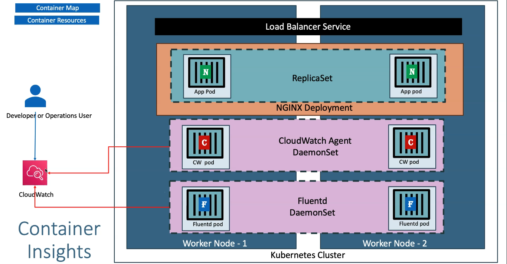

**Container Insight Maps**

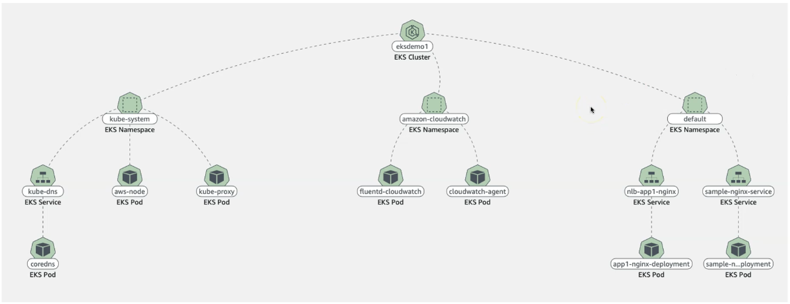

- We will deploy our CW Agnet and Fluentd Pod as demonset in the `amazon-cloudwatch` namespace.

## 1.Associate CloudWatch Polich to EKS Worker Nodes Role.

### 1.1 Get IAM Role attached to your worker nodes by

  1. Describe nodegroup

```bash
aws eks describe-nodegroup \
  --cluster-name EksCluster-Bhavin \
  --nodegroup-name nodegroup-private \
  --query "nodegroup.nodeRole" \
  --output text
```

  2. By Console

- Choose your worker node > look for `IAM Role`.

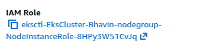

- Choose that iam role and look for iam policy `CloudWatchAgentServerPolicy`.

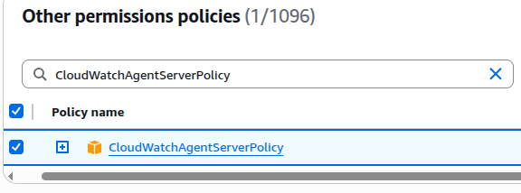

- Add it.

## 2. Install Container Insights

### 2.1 Deploy CW Agent and Fluentd as DaemonSets

```bash
curl -s https://raw.githubusercontent.com/aws-samples/amazon-cloudwatch-container-insights/latest/k8s-deployment-manifest-templates/deployment-mode/daemonset/container-insights-monitoring/quickstart/cwagent-fluentd-quickstart.yaml | sed "s/{{cluster_name}}/EksCluster-Bhavin/;s/{{region_name}}/ap-south-1/" | kubectl apply -f -

```
- This will create ns `amazon-cloudwatch`
- Will create Security Account, ClusterRole, ClusterRoleBinding

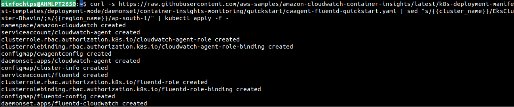

- Will deploy `cloudwatch-agent` as a daemonset.

- Will deploy `fluentd` as daemonset.


- Will deploys ConfigMap configurations for both daemonsets.

### 2.2 Verify both daemonSets.

```bash
# List Daemonsets
kubectl get daemonsets -n amazon-cloudwatch
```

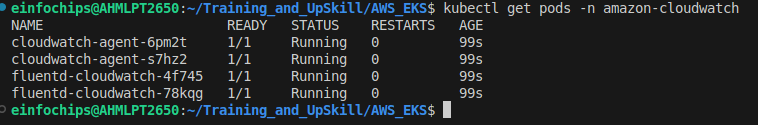

## 3. Deploy Applications
```bash
kubectl apply -f kube-manifests/
```

## 4. Ensure your apps is works well

- Defualt App1

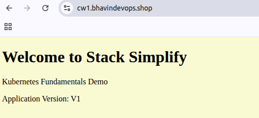

- App1

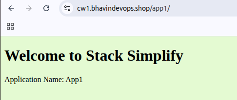

## 5. Generate testing load on your apps

```bash
kubectl run apache-bench-app1 \
  --image=httpd \
  --restart=Never \
  --rm -i --tty \
  --command -- ab -n 5000 -c 50 http://cw1.bhavindevops.shop/app1

kubectl run apache-bench-app1 \
  --image=httpd \
  --restart=Never \
  --rm -i --tty \
  --command -- ab -n 5000 -c 50 http://cw1.bhavindevops.shop/
```

- Go to CloudWatch > Container Insights > map

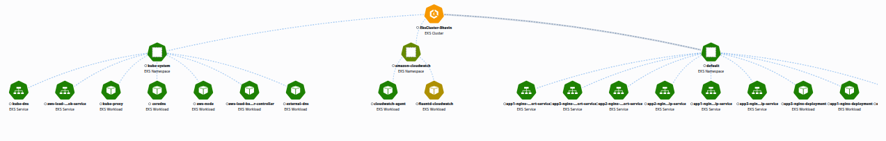

- CW - Dashboard 1

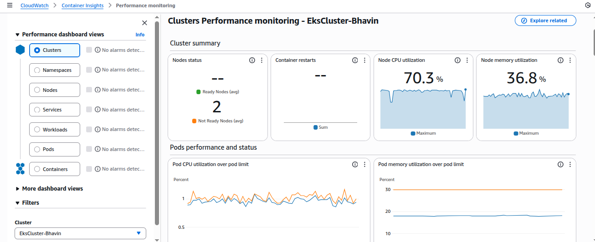

- CW - Dashboard 2 Node Performance

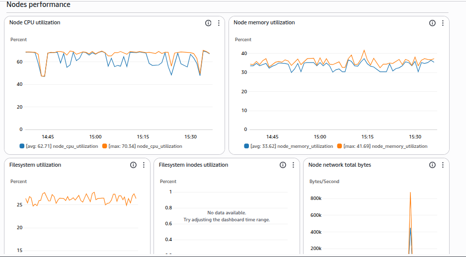

- CW - Dashboard 3 Container Performance

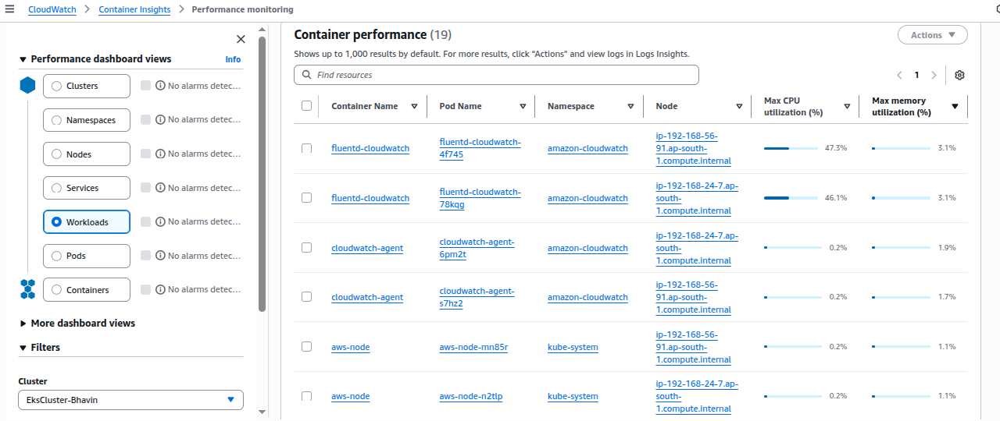

- CW - Logs


- CW - Performance Logs

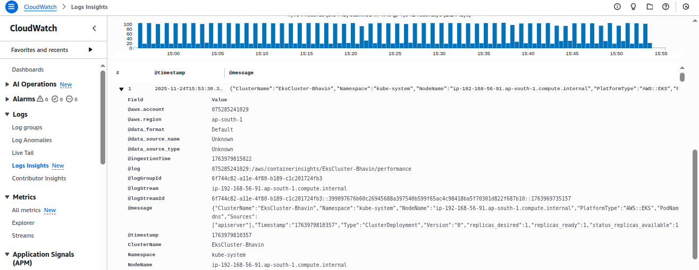


**Create Alart**


