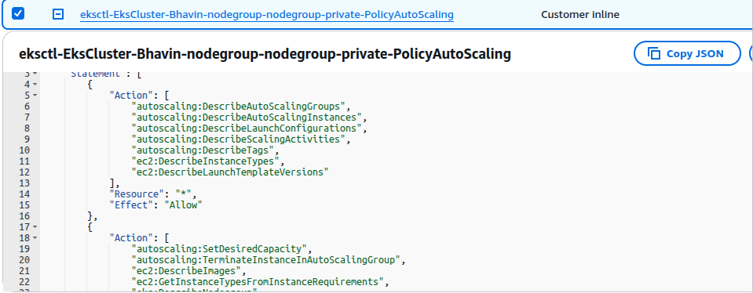
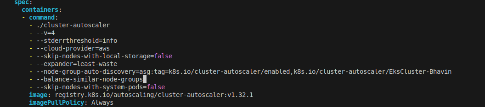
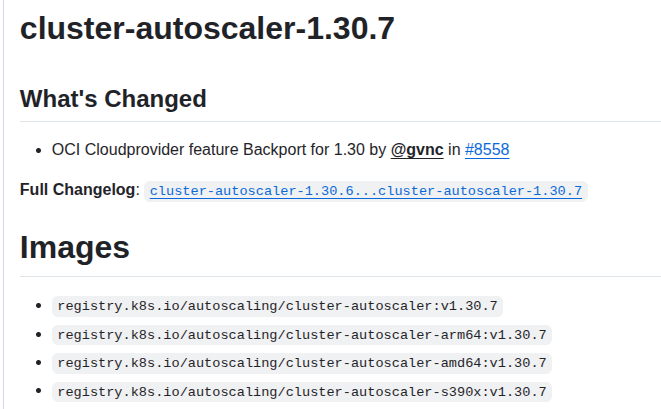
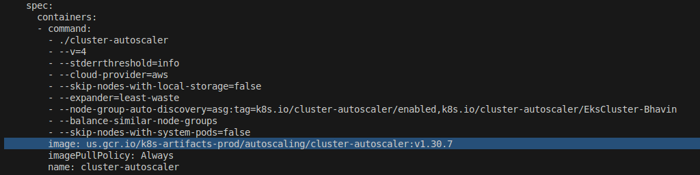
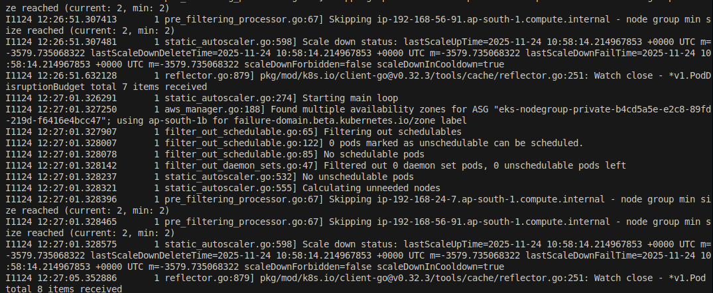

Cluster AutoScaler
---

- `Cluster AutoScaler` is a tool that `automatically scale` the size of EKS when one of the following condtion is meet.

  1. There are pods that `failed to run` in the cluster due to `insufficient resources`.

  2. There are nodes in the cluster that have been `underutilized` for and extended period of time and their pods can be placed on other existing nodes.

  3. The cluster autoscaler modifies our worker nodes groups so that they can `scale out` when we `required more resources` and `scale in` while we have `underutilized` resources.


## 1. Verify if our NodeGroup as --asg-access


- While creating nodegroup we already given `asg-access`



## 2. Deploy Cluster AutoScaler


```bash
# Deploy the Cluster Autoscaler to your cluster
kubectl apply -f https://raw.githubusercontent.com/kubernetes/autoscaler/master/cluster-autoscaler/cloudprovider/aws/examples/cluster-autoscaler-autodiscover.yaml

# Add the cluster-autoscaler.kubernetes.io/safe-to-evict annotation to the deployment
kubectl -n kube-system annotate deployment.apps/cluster-autoscaler cluster-autoscaler.kubernetes.io/safe-to-evict="false"
```

## 3. Edit Cluster Autoscaler Deployment to add Cluster name and two more parameters

```bash
# Edit parameter into your cluster-autoscaler

kubectl -n kube-system edit deployment.apps/cluster-autoscaler
```

  - Give your cluster name

```bash
# Before Change
        - --node-group-auto-discovery=asg:tag=k8s.io/cluster-autoscaler/enabled,k8s.io/cluster-autoscaler/<YOUR CLUSTER NAME>

# After Change
        - --node-group-auto-discovery=asg:tag=k8s.io/cluster-autoscaler/enabled,k8s.io/cluster-autoscaler/EksCluster-Bhavin

# Add this parameter also


        - --balance-similar-node-groups
        - --skip-nodes-with-system-pods=false
```



## 4. Set the Cluster AutoScaler Image to our EKS Cluster Versions

- Open https://github.com/kubernetes/autoscaler/releases

- Our EKS Versions is `1.30`

- So look for `cluster autoscaler version ~1.30.*`



```bash
# Template
# Update Cluster Autoscaler Image Version
kubectl -n kube-system set image deployment.apps/cluster-autoscaler cluster-autoscaler=us.gcr.io/k8s-artifacts-prod/autoscaling/cluster-autoscaler:v1.XY.Z


# Update Cluster Autoscaler Image Version
kubectl -n kube-system set image deployment.apps/cluster-autoscaler cluster-autoscaler=registry.k8s.io/autoscaling/cluster-autoscaler:v1.30.7
```

### 4.1 Verify your cluster-autoscaler image has been updated ?

```bash
kubectl -n kube-system get deployment.apps/cluster-autoscaler -o yaml
```


## 4. Verify your cluster-autoscaler logs

```bash
kubectl -n kube-system logs -f deployment.apps/cluster-autoscaler
```



**Cluster Autoscaler scales based on:**

- Pending pods → scale UP

- Underutilized nodes → scale DOWN

**Cluster Autoscaler does NOT scale based on:**

- CPU %

- Memory %

- Requests / RPS

- Latency (unless HPA creates new pods)


**NOTE** - If your set min=2 and max=3 during nodegroup creations.
`It will scale up your worker nodes to max 3 nodes`. while any of pods are not scheudling due to insufficient resource on your worker nodes only.

