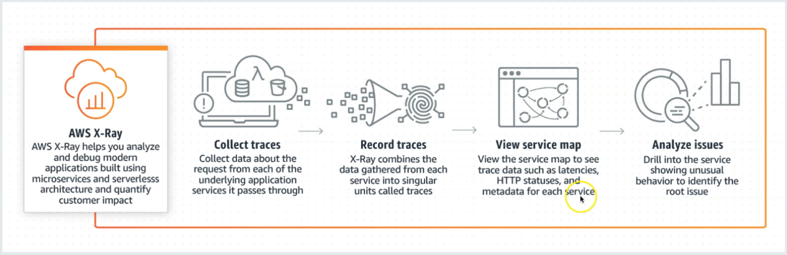
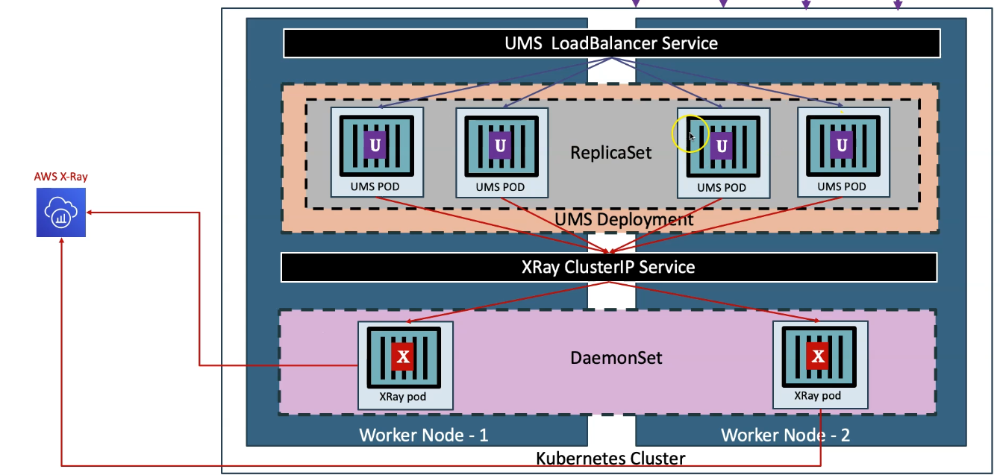
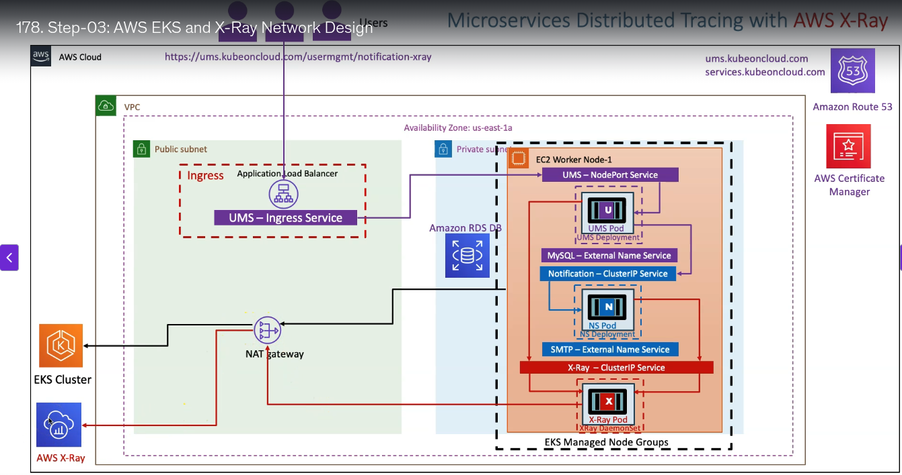
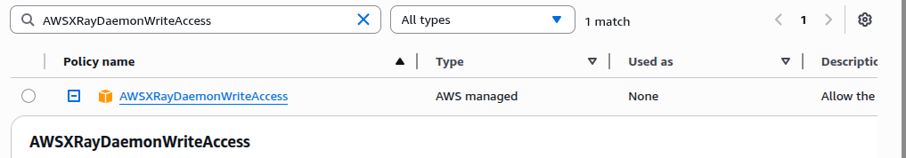
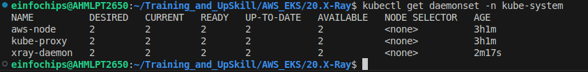
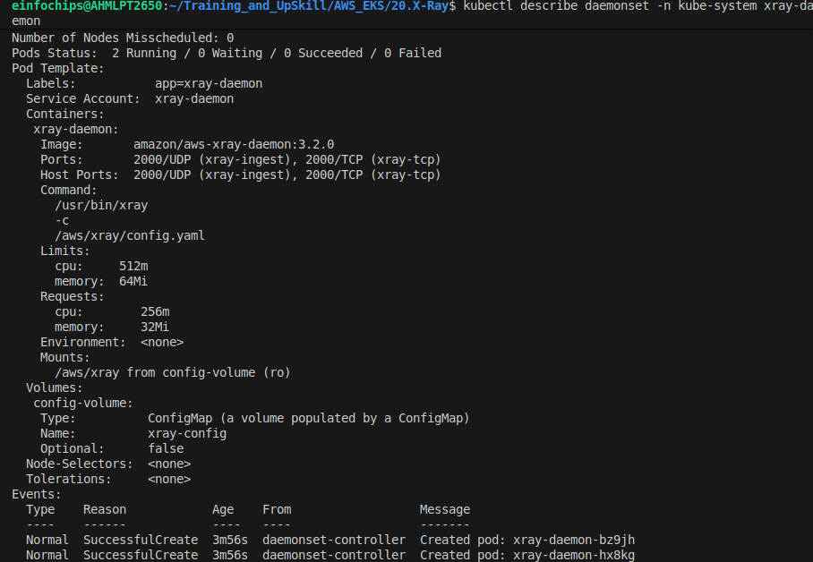

AWS X-Ray
---

- Aws X-Ray helps to **analyse and debug** distributed apps.

- We can get how apps and services are performing to **identify and troubleshoot** the root cause of performance issues and errors.

- X-Ray provides an **end-to-end view** of requests as they travel through our apps and show **a map** of our apps.



- To get a performance issue with trace and maps we have to deploy an **X-Ray related agent** into EKS.

- It should be `daemonset` pod.




EKS Arch




PreRequisite Required
---

- You should have installed `External-DNS` and `load balancer controller`.
- Connected to RDS DB.

## 1. Create IAM Permissios for AWS X-Ray daemonsets.

- Attach this policy



```bash

# Template
eksctl create iamserviceaccount \
    --name service_account_name \
    --namespace service_account_namespace \
    --cluster cluster_name \
    --attach-policy-arn arn:aws:iam::aws:policy/AWSXRayDaemonWriteAccess \
    --approve \
    --override-existing-serviceaccounts

# Replace Name, Namespace, Cluster Info (if any changes)
eksctl create iamserviceaccount \
    --name xray-daemon \
    --namespace kube-system \
    --cluster EksCluster-Bhavin \
    --attach-policy-arn arn:aws:iam::aws:policy/AWSXRayDaemonWriteAccess \
    --approve \
    --override-existing-serviceaccounts
```

## 1.1 Verify SA for x-ray and IAM Role

```bash
# List k8s Service Accounts
kubectl get sa -n kube-system

# Describe Service Account (Verify IAM Role annotated)
kubectl describe sa xray-daemon -n kube-system

# List IAM Roles on eksdemo1 Cluster created with eksctl
eksctl  get iamserviceaccount --cluster EksCluster-Bhavin
```


## 2. Verify daemonsets

```bash
kubectl get daemonsets -n kube-system
```



```bash
kubectl describe daemonsets -n kue-system xray-daemon
```




