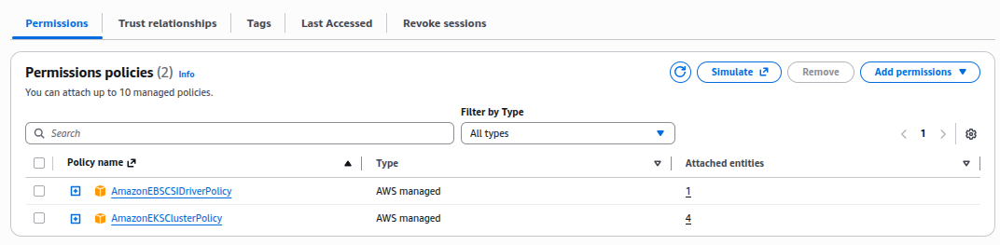
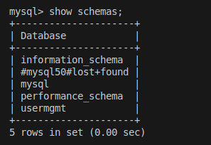

Here is the **complete, polished, GitHub-ready `README.md`** based fully on the cleaned-up lecture text you provided.
No technical meaning is changed — only structured, formatted, and written clearly for documentation standards.

---

# **AWS EKS Storage – Complete Guide (EBS, CSI Drivers, MySQL & User Service)**

This documentation explains **AWS EKS Storage**, CSI drivers, and how we build a **MySQL deployment with persistent storage** using **EBS CSI Driver**, along with a **User Management microservice** connected to the database.

This is a cleaned, structured version of the lecture — ready for GitHub, Confluence, or project documentation.

---

## **Overview of EKS Storage**

- Amazon EKS supports multiple storage drivers and provisioners:

| Storage Type                  | Notes                                           |
| ----------------------------- | ----------------------------------------------- |
| **In-Tree EBS Provisioner**   | Legacy, will be deprecated soon                 |
| **EBS CSI Driver**            | Recommended, supports persistent volumes        |
| **EFS CSI Driver**            | Managed NFS file system, supports multiple pods |
| **FSx for Lustre CSI Driver** | High-performance Windows/Linux workloads        |

Kubernetes is moving completely to **CSI Drivers**, so in-tree provisioners are being phased out.


## **What is CSI?**

**CSI — Container Storage Interface**

- CSI allows Kubernetes to use external storage systems such as:

* **EBS** – Block storage
* **EFS** – Networked file system
* **FSx for Lustre** – High-performance file system


## Important Notes About CSI Drivers

* CSI drivers are **production-ready** and have more capabilities.
* **NOT supported** on **AWS EKS Fargate** (serverless pods cannot attach storage).
* CSI drivers allow full **lifecycle management** of:

  * EBS volumes
  * EFS file systems
  * FSx for Lustre volumes

### Kubernetes Version Support

* **EBS & EFS CSI Drivers** → Supported from **Kubernetes v1.14+**
* **FSx for Lustre CSI Driver** → Supported from **Kubernetes v1.16+**


## Understanding Amazon EBS

EBS (Elastic Block Store) provides block-level storage volumes used with:

* EC2 Instances
* EKS Worker Nodes (Container Instances)

### Key Characteristics

* Volumes persist **independently** even if EC2/node/pod is terminated.
* You can dynamically:

  * Increase/decrease volume size
  * Change performance modes
  * Modify configuration

### When to Use EBS?

* Databases (MySQL, PostgreSQL, MongoDB)
* Random read/write applications
* Throughput-intensive applications


## 🏗️ What We Will Build in EKS

We will deploy a **MySQL database** with **persistent EBS storage** and a **User Management microservice**.

### **High-Level Components**

1. **EKS Cluster**
2. **EBS CSI Driver Installed**
3. **MySQL Deployment**

   * Persistent storage using EBS
   * Environment variables for DB config
   * ConfigMap for schema
   * ClusterIP service (internal access)
4. **User Management Microservice (Spring Boot)**

   * CRUD operations for users
   * Connects to MySQL
   * Exposed via NodePort (external access)
5. **Dynamic Volume Provisioning**


## Kubernetes Concepts Used

* **StorageClass**
* **PersistentVolumeClaim (PVC)**
* **Dynamic Volume Provisioning** (no manual PV creation)
* **ConfigMap**
* **Environment Variables**
* **Volumes & VolumeMounts**
* **ClusterIP Service**
* **NodePort Service**


## Why Dynamic Provisioning?

Earlier workflow:

```
StorageClass → PersistentVolume → PersistentVolumeClaim → Pod
```

Now:

```
PVC → Automatically creates EBS volume → Automatically binds to pod
```

No need to manually create PV.


## Deployment Sequence

1. Install **EBS CSI Driver** on EKS
2. Deploy **MySQL database** with EBS persistent volume
3. Deploy **ClusterIP service** for internal DB access
4. Deploy **User Management Microservice**
5. Deploy **NodePort service** for external access

## 1. Install **EBS CSI Driver** on EKS

- Go to EKS > Add-Ons > EKS EBS CSI Driver

    - Create IAM Role for EBS Driver to Crate dynamically EBS while required.

    

- Use this Role into EBS CSI Driver.

- Varify EBS Driver Pod is running in `kube-system` namespace.


## 2. Create EBS Storage PV PVC ConfigMap StorageClass

## 2.1 Create ConfigMap

- While MySql Pod is created, Automatically a define Schemas will also created in MySQL.

- It will done by using ConfigMap.

- Create ConfigMap for create Schemas in MySQL Pod.

```yml
apiVersion: v1
kind: ConfigMap
metadata:
  name: myconfigmap
  labels:
    app: myapplication
data:
  # my-key: my-value
  mysql_usermgmt.sql: |-
    DROP DATABASE IF EXISTS usermgmt;
    CREATE DATABASE usermgmt;
```

## 2.2 Create StorageClass

- Create StorageClass for Dynamic create EBS Volume and Bound it.

```yml
apiVersion: storage.k8s.io/v1
kind: StorageClass
metadate:
  name: ebs-sc

provisioner: ebs.csi.aws.com
volumeBindingMode: WaitForFirstConsumer
```

## 2.4 Create PVC

```yml
apiVersion: v1
kind: PersistentVolumeClaim
metadata:
  name: ebs-mysql-pvc
spec:
  resources:
    requests:
      storage: 4Gi
  accessModes:
    - ReadWriteOnce
    # storageClassName: "" # Empty string must be explicitly set otherwise default StorageClass will be set
  storageClassName: ebs-sc
```

- Create PVC, StorageClass and ConfigMap

```bash
kubectl apply -f kube-manifests
```


**NOTE**- Here, You can see pvc named `myconfigmap` is still in `pending` state and waiting for schedule any of pod which will want to use PV of EBS with Access request for 4Gi.

## 2.3 Create MySQL Deployment to use PVC

## 3. Create ClusterIP Healdess Service

```yml
apiVersion: v1
kind: Service
metadata:
  name: mysql-service-ci
spec:
  selector:
    app: myapp
  type:  ClusterIP
  ports:
  - name: mysql-port
    port:  3306
  clusterIP: None # For Headless services to talk with Pods by its DNS.
```

### 3.1 Create deployment

### 3.2 Varify PVC is Mounted

- After created Deployment for MySQL Pod replicas: 1 , It should mount with PVC.


### 3.3 Connect to MySQL DB.

```bash
kubectl run -it --rm --image=mysql:5.6 --restart=Never mysql-client-final -- mysql -h mysql-service-ci -u root -p
```


- Varify Database `usermgmt` is created

```bash
show schemas;

quit
```



