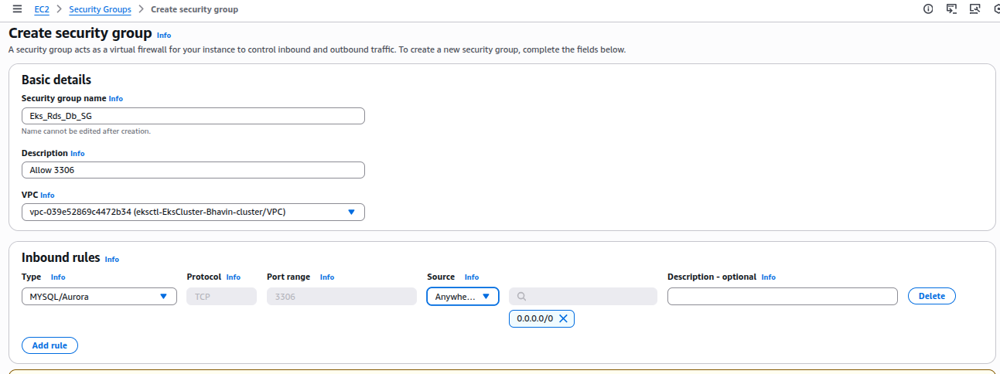
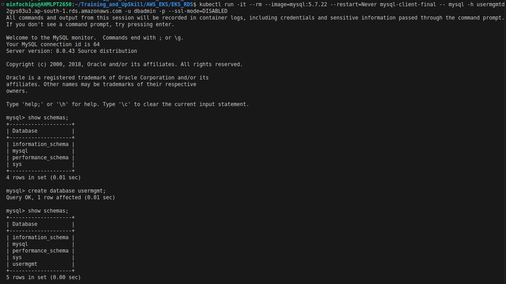

AWS EKS with RDS Architecture
---

- We will use RDS instead of MySQL Pods for High availability, Backup, Disaster Recovery and OS Patching & MySQL Version Upgrades.


- To use RDS in EKS we will use Service as `External | Name Service`.

AWS EKS With RDS - VPC Architectures
---


## 1. Create Security Group For RDS



## 2. Create DB Subnet in RDS

- Go to RDS > Subnet > Create.
- Choose VPC of your EksCtl & AZs: `ap-south-1a`, `ap-south-1b`.
- Subnets: 2 Subnets in 2 AZs


## 3. Create MySQL RDS DB.

- Leave for `initial database name`. We will create db via script.

- Keep database as Private via Pubic Accessible: No.

- Give Master Username: `dbadmin`.

- Give Passwd: "dbpassword11"

- Give DB Instance Identifier: "usermgmtdb"

- Choose RDS DB Existing: "Eks_Rds_Db_SG"

- Choose DB Subnet Group: "eks-rds-db-subnetgroup-private"

- Create DB.

## 4. Create K8s ExternalName Service Manifest and Deploy

- Create mysql externalName Service

```yml
apiVersion: v1
kind: Service
metadata:
  name: mysql
spec:g 
  type: ExternalName
  externalName: "Enter RDS DB EndPoints"
```

## 5. Connect to RDS DB using kubectl & create usermgmt schema/db

```bash
kubectl run -it --rm --image=mysql:5.7.22 --restart=Never mysql-client -- mysql -h <DB EndPoint>

kubectl run -it --rm --image=mysql:5.7.22 --restart=Never mysql-client-final -- mysql -h usermgmtdb.czuw2gys03u3.ap-south-1.rds.amazonaws.com -u dbadmin -p --ssl-mode=DISABLED

show schemas;
create database usermgmt;
show schemas;
exit
```



- Add Port 8095 and 30000-32767 in EKS Public SG.

- Browse for `http://<NodePort_PublicIP>:31231/usermgmt/health-status`


