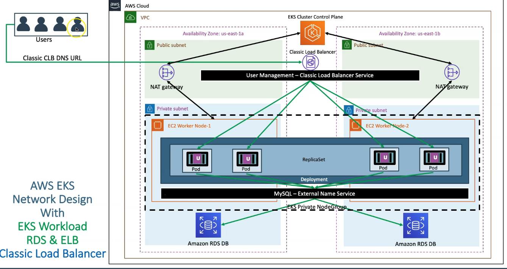
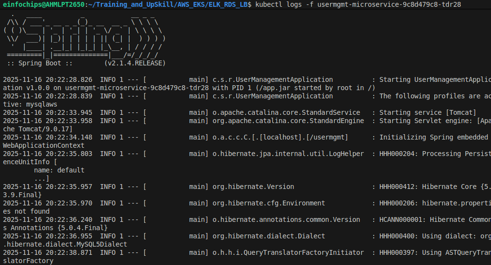
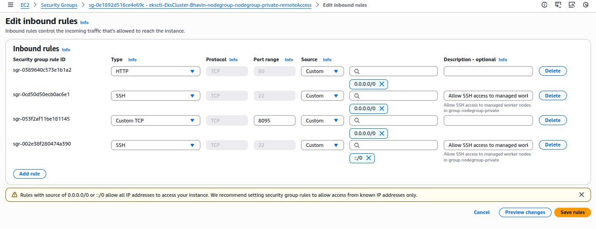
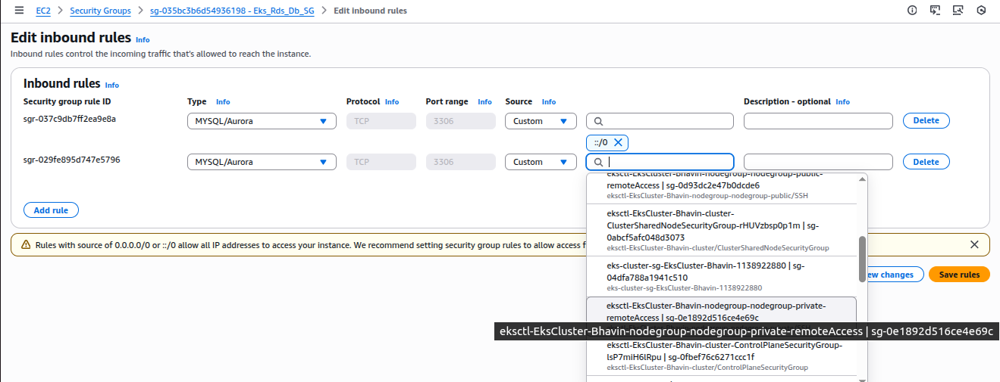
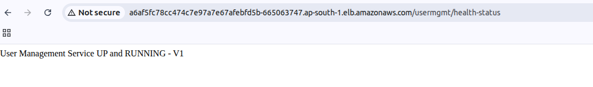

ELK With RDS & LB
---



## 1. Create NodeGroup in private subnets.

- Delete existing Public NodeGroup in EKS.

```bash
eksctl delete nodegroup nodegroup-public
```

```bash
eksctl create nodegroup --cluster=EksCluster-Bhavin \
    --region=ap-south-1 \
    --name=nodegroup-private \
    --node-type=t3.medium \
    --nodes=2 \
    --nodes-min=2 \
    --nodes-max=3 \
    --node-volume-size=20 \
    --ssh-access \
    --ssh-public-key=eks-demo \
    --managed \
    --asg-access \
    --external-dns-access \ 
    --full-ecr-access \
    --appmesh-access \
    --alb-ingress-access \
    --node-private-networking # This will make worker node in private subnets.
```

- apply kube-manifests

```bash
kubect l apply -f kube-manifests/
```

- check logs for deployments

```bash
kubectl logs -f usermgmt-microservice-9c8d479c8-tdr28
```



- If it is fails, You have to look into Pvt SG to allow HTTP & 8095.



- Add RDS SG to allow MySQL  from Pvt SG.



- Browse Classic LB URL



---

**Configure Service to create Network Load Balancer instead of Classic load balancer.**

- You will require to define `annotations` to tell control plan to explicitly use NLB.

```yml
annotations:
    service.beta.kubernetes.io/aws-load-balancer-type: nlb
```
- Apply all kube-manifests

```bash
kubectl apply -f NLB_KubeManifests/
```

- Go to Load Balancer > Look for ALB > Copy ALB EP and Browse it.


