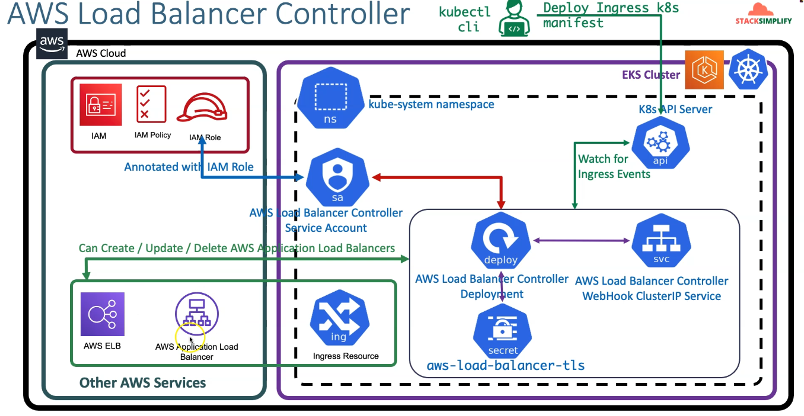
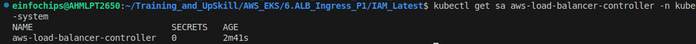
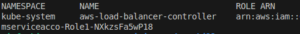
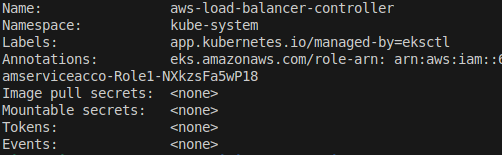
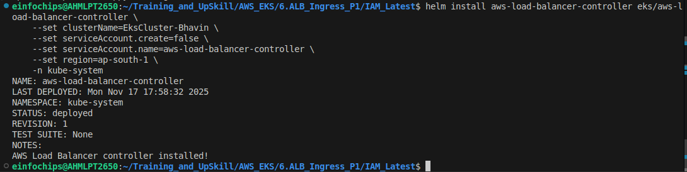
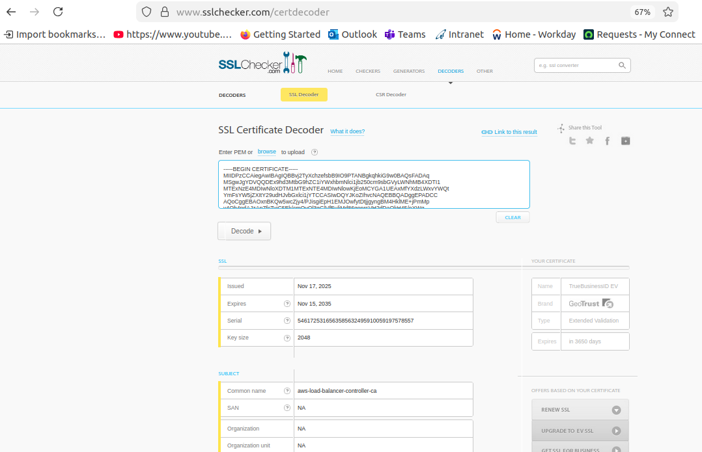
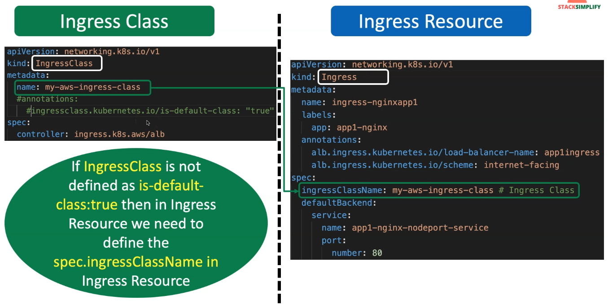
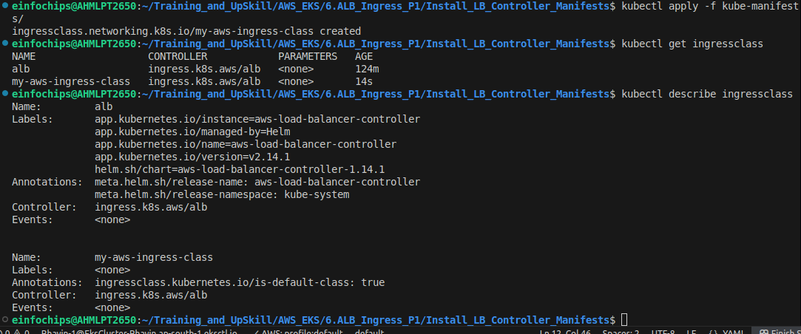

AWS Load Balancer Controller (Ingress k8s)
---




## 1. Create cluster

```yml
eksctl create cluster --name=EksCluster-Bhavin \
--zones=ap-south-1a,ap-south-1b \
--region=ap-south-1 \
--without-nodegroup
```

## 2. Create & Associate IAM OIDC Provider for our EKS Cluster

```yml
eksctl utils associate-iam-oidc-provider \
    --region ap-south-1 \
    --cluster EksCluster-Bhavin
```

## 3. Create Node Group (worker nodes) with additional Add-Ons in Public Subnets

```yml
eksctl create nodegroup --cluster=EksCluster-Bhavin \
    --region=ap-south-1 \
    --name=nodegroup-private \
    --node-type=t3.medium \
    --nodes=2 \
    --nodes-min=2 \
    --nodes-max=3 \
    --node-volume-size=20 \
    --ssh-access \
    --ssh-public-key=eks-demo \
    --managed \
    --asg-access \
    --external-dns-access \ 
    --full-ecr-access \
    --appmesh-access \
    --alb-ingress-access \
    --node-private-networking # This will make worker node in private subnets.
```

## 4. Varify Cluster, NodeGroups

```bash

# Varify EKS Cluster
eksctl get cluster

# Varify EKS Node Groups
eksctl get nodegroup --cluster=EksCluster-Bhavin

# Varify if anuy IAM Service Accounts present in EKS Cluster

eksctl get iamserviceaccount --cluster=EksCluster-Bhavin

# Configure kubeconfig for kubectl

eksctl get cluster

aws eks --region<region-code> updat-kubeconfig --name<cluster_name>

aws eks --region ap-south-1 update-kubeconfig --name EksCluster-Bhavin

# Varify EKS Nodes in EKS Cluster
kubectl get nodes
```

## 5. Create IAM Policy

- Create IAM Policy for AWS Load Balancer Controller that allows it to make calls to AWS APIs on your behalf.

### 5.1 Download IAM Policy latest by manual
```bash
curl -o iam_policy_latest.json https://raw.githubusercontent.com/kubernetes-sigs/aws-load-balancer-controller/main/docs/install/iam_policy.json

###  Verify latest
ls -lrta 
```

### Create IAM Policy with downloaded Latest IAM Policy

```bash
aws iam create-policy \
    --policy-name AWSLoadBalancerControllerEKSIAMPolicy \
    --policy-document file://iam_policy_latest.json
```

## 6. Create an IAM Role for AWS LB Controller and attach role to k8s Service Account

### 6.1 Create IAM Role 
```bash

# Verify SA is exists ?

kubectl get sa -n kube-system
kubectl get sa aws-load-balancer-controller -n kube-system

# Create Service account and attach arn of iam latest policy
eksctl create iamserviceaccount \
    --cluster=EksCluster-Bhavin \
    --namespace=kube-system \
    --name=aws-load-balancer-controller \
    --attach-policy-arn=<Put your IAM Policy ARN here> \
    --override-existing-serviceaccounts \
    --approve

eksctl create iamserviceaccount \
    --cluster=EksCluster-Bhavin \
    --namespace=kube-system \
    --name=aws-load-balancer-controller \ # Service Account name here
    --attach-policy-arn=arn:aws:iam::682033465818:policy/AWSLoadBalancerControllerEKSIAMPolicy \
    --override-existing-serviceaccounts \
    --approve
```



```bash
eksctl get iamserviceaccount --cluster=EksCluster-Bhavin
```



- We should see ARN in annotations to confirm we had bounded iam role to eks service account.

```bash
kubeclt describe sa aws-load-balancer-controller -n kube-system
```




## 7. Install AWS Load Balancer Controller using Helm Charts.

- **Notes** - If you are deploying the LB Controller in your EC2 ( kubeadm ), It will have restricted access to EC2 Instance metadata service (IMDS), Or If you are installing this LB Controller to Fargate Cluster , Just follow below commands:

```bash
--set region=<region>
--set vpcId=<vpc_id>
```

- Install AWS Load Balancer Controller using helm

```bash
# Add eks-charts repo in your helm
helm repo add eks https://aws.github.io/eks-charts

# Update your local repo of heml
helm repo update

# Install AWS Load Balancer Controller.

helm install aws-load-balancer-controller eks/aws-load-balancer-controller \
    -n kube-system \
    --set clusterName=EksCluster-Bhavin \
    --set serviceAccount.create=false \
    --set serviceAccount.name=aws-load-balancer-controller \
    --set region=ap-south-1 \
    --set vpcId="" \
    --set image.repository=<account>.dkr.ecr.<ap-south-1>.amazon.com/amazon/aws-load-balancer-controller


helm install aws-load-balancer-controller eks/aws-load-balancer-controller \
    -n kube-system \
    --set clusterName=EksCluster-Bhavin \
    --set serviceAccount.create=false \
    --set serviceAccount.name=aws-load-balancer-controller \
    --set region=ap-south-1 \
    --set vpcId="" \
    --set image.repository=<account>.dkr.ecr.<ap-south-1>.amazon.com/amazon/aws-load-balancer-controller

# OR

helm install aws-load-balancer-controller eks/aws-load-balancer-controller \
    --set clusterName=EksCluster-Bhavin \
    --set serviceAccount.create=false \
    --set serviceAccount.name=aws-load-balancer-controller \
    --set region=ap-south-1 \
    -n kube-system

```




### 7.1. Verify that the controller is installed and Webhook Service created

```bash
# Verify that the controller is installed.
kubectl -n kube-system get deployment 

kubectl -n kube-system get deployment aws-load-balancer-controller

kubectl -n kube-system describe deployment aws-load-balancer-controller

# Verify AWS Load Balancer Controller Webhook service created
kubectl -n kube-system get svc 
kubectl -n kube-system get svc aws-load-balancer-webhook-service
kubectl -n kube-system describe svc aws-load-balancer-webhook-service

# Verify Labels in Service and Selector Labels in Deployment
kubectl -n kube-system get svc aws-load-balancer-webhook-service -o yaml
kubectl -n kube-system get deployment aws-load-balancer-controller -o yaml
Observation:
1. Verify "spec.selector" label in "aws-load-balancer-webhook-service"
2. Compare it with "aws-load-balancer-controller" Deployment "spec.selector.matchLabels"
3. Both values should be same which traffic coming to "aws-load-balancer-webhook-service" on port 443 will be sent to port 9443 on "aws-load-balancer-controller" deployment related pods. 

```


### 7.2 Verify AWS Load Balancer Controller Logs

```bash
# List Pods
kubectl get pods -n kube-system

# Review logs for AWS LB Controller POD-1
kubectl -n kube-system logs -f <POD-NAME> 
kubectl -n kube-system logs -f  aws-load-balancer-controller-78785b5df6-6km6m

# Review logs for AWS LB Controller POD-2
kubectl -n kube-system logs -f <POD-NAME> 
kutlscerdecodebectl -n kube-system logs -f aws-load-balancer-controller-86b598cbd6-vqqsk
```

### 7.3 Verify AWS Load Balancer Controller k8s Service Account - Internals

```bash
# List Service Account and its secret
kubectl -n kube-system get sa aws-load-balancer-controller
kubectl -n kube-system get sa aws-load-balancer-controller -o yaml

kubectl get secrets -n kube-system aws-load-balancer-tls -o yaml
```

- Decode tls.key into base64.


- Copy this decoded value and paste it into certdecoder to match it.



```bash
kubectl -n kube-system get secret <GET_FROM_PREVIOUS_COMMAND - secrets.name> -o yaml
kubectl -n kube-system get secret aws-load-balancer-controller-token-5w8th 
kubectl -n kube-system get secret aws-load-balancer-controller-token-5w8th -o yaml
```

## Decoce ca.crt using below two websites
https://www.base64decode.org/
https://www.sslchecker.com/certdecoder

## Decode token using below two websites
https://www.base64decode.org/
https://jwt.io/
Observation:


1. Review decoded JWT Token

# List Deployment in YAML format
```bash
kubectl -n kube-system get deploy aws-load-balancer-controller -o yaml
```

Observation:
1. Verify "spec.template.spec.serviceAccount" and "spec.template.spec.serviceAccountName" in "aws-load-balancer-controller" Deployment
2. We should find the Service Account Name as "aws-load-balancer-controller"

# List Pods in YAML format
```bash
kubectl -n kube-system get pods
kubectl -n kube-system get pod <AWS-Load-Balancer-Controller-POD-NAME> -o yaml
kubectl -n kube-system get pod aws-load-balancer-controller-65b4f64d6c-h2vh4 -o yaml
```

Observation:
1. Verify "spec.serviceAccount" and "spec.serviceAccountName"
2. We should find the Service Account Name as "aws-load-balancer-controller"
3. Verify "spec.volumes". You should find something as below, which is a temporary credentials to access AWS Services
CHECK-1: Verify "spec.volumes.name = aws-iam-token"
  - name: aws-iam-token
    projected:
      defaultMode: 420
      sources:
      - serviceAccountToken:
          audience: sts.amazonaws.com
          expirationSeconds: 86400
          path: token
CHECK-2: Verify Volume Mounts
    volumeMounts:
    - mountPath: /var/run/secrets/eks.amazonaws.com/serviceaccount
      name: aws-iam-token
      readOnly: true          
CHECK-3: Verify ENVs whose path name is "token"
    - name: AWS_WEB_IDENTITY_TOKEN_FILE
      value: /var/run/secrets/eks.amazonaws.com/serviceaccount/token          


Ingress Controller
---

Below is a **beginner-friendly, clean, production-ready README** explaining the **difference between Ingress for EKS vs Ingress for Kubeadm**.

You can directly copy-paste this into your project or documentation.


# **README: Difference Between Ingress YAML for EKS and Kubeadm**

## Overview

Kubernetes supports multiple Ingress Controllers.
Depending on where your cluster is running, the **Ingress YAML configuration changes**.

This README explains the **key differences** between:

* **Ingress for kubeadm (on-prem / VM / bare-metal)**
* **Ingress for Amazon EKS (AWS cloud)**


# 1. Ingress in Kubeadm (Bare-Metal / On-Prem)

### Uses: **NGINX Ingress Controller**

In kubeadm-based clusters, the most common Ingress Controller is **NGINX**.

### YAML Characteristics

* Uses the **NGINX ingress class**
* Does **not** create any cloud load balancer
* Routes traffic through an NGINX Pod inside the cluster
* NGINX-specific annotations

### Example (kubeadm ingress.yaml)

```yaml
apiVersion: networking.k8s.io/v1
kind: IngressClass
metadata:
  name: nginx
spec:
  controller: k8s.io/ingress-nginx
---
apiVersion: networking.k8s.io/v1
kind: Ingress
metadata:
  name: my-app-ingress
  annotations:
    nginx.ingress.kubernetes.io/rewrite-target: /
spec:
  ingressClassName: nginx
  rules:
    - http:
        paths:
          - path: /
            pathType: Prefix
            backend:
              service:
                name: my-app-service
                port:
                  number: 80
```

### Request Flow (kubeadm)

```
Client → NGINX Ingress Pod → Service → Pods
```

### Use Case

* Local/minikube
* On-prem data centers
* Bare-metal servers
* kubeadm clusters on VMs


# 2. Ingress in Amazon EKS (AWS Cloud)

### Uses: **AWS Load Balancer Controller (ALB)**

EKS does NOT use NGINX by default.
Instead, it integrates with AWS and creates an **Application Load Balancer (ALB)**.

### YAML Characteristics

* Uses AWS **ALB ingress class**
* Creates an **AWS Application Load Balancer**
* Requires AWS-specific annotations
* Targets Pods directly via AWS Target Groups

### Example (EKS ingress.yaml)

```yaml
apiVersion: networking.k8s.io/v1
kind: IngressClass
metadata:
  name: alb
spec:
  controller: ingress.k8s.aws/alb
---
apiVersion: networking.k8s.io/v1
kind: Ingress
metadata:
  name: my-app-ingress
  annotations:
    kubernetes.io/ingress.class: alb
    alb.ingress.kubernetes.io/scheme: internet-facing
    alb.ingress.kubernetes.io/target-type: ip
    alb.ingress.kubernetes.io/listen-ports: '[{"HTTP": 80}]'
spec:
  ingressClassName: alb
  rules:
    - http:
        paths:
          - path: /
            pathType: Prefix
            backend:
              service:
                name: my-app-service
                port:
                  number: 80
```

### Request Flow (EKS)

```
Client → AWS Application Load Balancer → Target Group → Pods
```

### Use Case

* Amazon EKS clusters
* Need managed AWS load balancers (ALB)
* Internet-facing or internal L7 load balancing


# 3. Side-By-Side Comparison

| Feature                    | kubeadm (NGINX)        | EKS (AWS ALB)                  |
| -------------------------- | ---------------------- | ------------------------------ |
| Ingress Controller         | NGINX                  | AWS Load Balancer Controller   |
| IngressClass               | `k8s.io/ingress-nginx` | `ingress.k8s.aws/alb`          |
| Creates AWS Load Balancer? | ❌ No                   | ✔️ Yes (ALB)                   |
| Traffic Routing            | NGINX reverse proxy    | AWS ALB → Target Groups → Pods |
| Annotations                | NGINX-specific         | AWS ALB-specific               |
| Works On                   | Local/kubeadm/on-prem  | Amazon EKS                     |


# 4. When to Use Which?

### Use **kubeadm NGINX Ingress** if:

* You run Kubernetes on **VMs, bare-metal, local**, or **on-prem**
* You don’t need AWS cloud features
* You prefer running your own ingress controller

### Use **EKS ALB Ingress** if:

* Your cluster is in **Amazon EKS**
* You want AWS-managed load balancers
* You need WAF, SSL (ACM certs), HTTP/HTTPS listeners, auto-scaling ALB
* You want traffic to directly reach Pods via AWS Target Groups


# Summary

| kubeadm                | EKS                      |
| ---------------------- | ------------------------ |
| Uses NGINX Ingress     | Uses AWS ALB Ingress     |
| Works locally/on-prem  | Works only in AWS EKS    |
| No cloud load balancer | Creates AWS ALB          |
| Simple annotations     | AWS-specific annotations |
| Traffic via NGINX pod  | Traffic via AWS ALB      |


EKS Ingress Class & Ingress Resource
---




# Review IngressClass Kubernetes Manifest & Install LB Controller via manifests

```yml
apiVersion: networking.k8s.io/v1
kind: IngressClass
metadata:
  name: my-aws-ingress-class
  annotations:
    ingressclass.kubernetes.io/is-default-class: "true"
spec:
  controller: ingress.k8s.aws/alb

## Additional Note
# 1. You can mark a particular IngressClass as the default for your cluster. 
# 2. Setting the ingressclass.kubernetes.io/is-default-class annotation to true on an IngressClass resource will ensure that new Ingresses without an spec.ingressClassName field specified will be assigned this default IngressClass.  
# 3. Reference: https://kubernetes-sigs.github.io/aws-load-balancer-controller/v2.3/guide/ingress/ingress_class/
```

- To install AWS Load Balancer Controller:
```bash
kubectl apply -f ingress_class.yml

kubectl describe ingressclass my-aws-ingress-class
```


