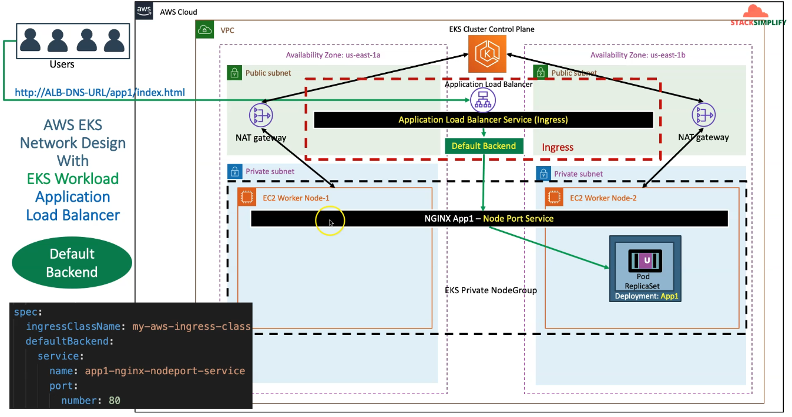
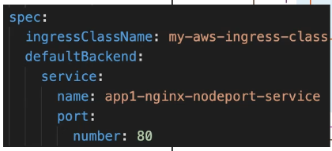
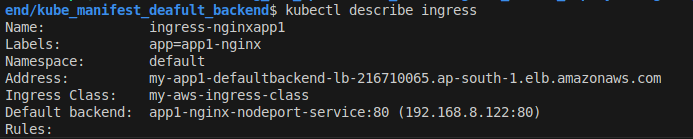
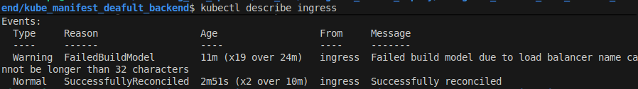
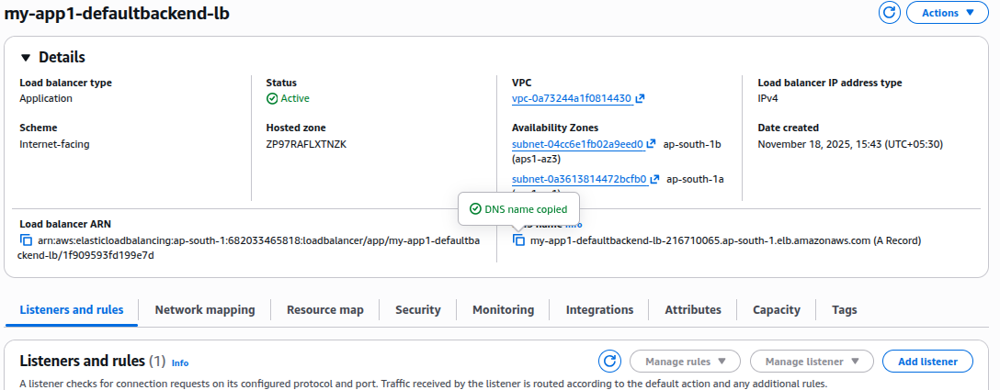
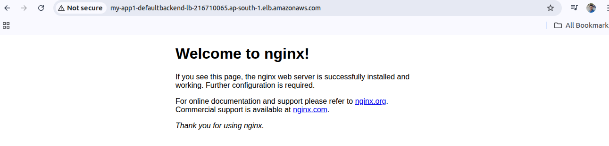
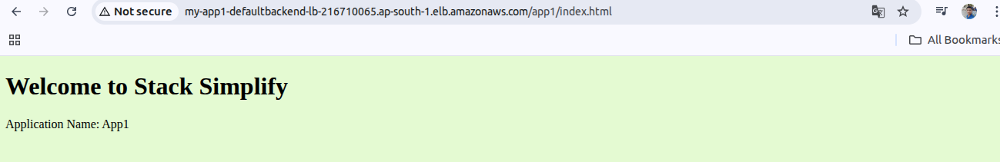
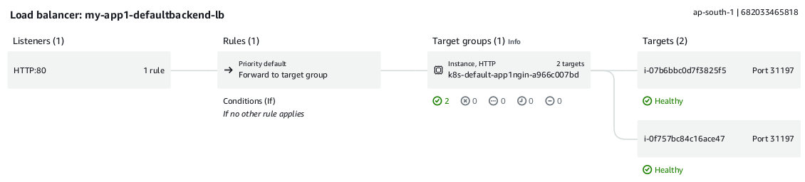

Ingress service with Default Backend
---

- We are going to deploy Ingress services with Default Backend

- This is our architecture and explainations how it will works



- EKS Cluster has 2 Public and 2 Private subnets.

- In private subnet, we will deploy our apps called app1.

- This app1 will have service of NodePort to expose in a public.

- This is our default backend defined in this ingress service.



- This default backend has defined service named `app1-nginx-nodeport=-service`.

- This NodePort Service is connected to Default backend & Default backend is connected to Application Load Balancer (Created by Ingress controller).

- When user make a request to this ALB URL it will pass to the default backend , default backend has NodePort Service on port 80 for nginx.

- It will go to that pod and user will get access of app1.

- Create IngressClass 

```bash
kubectl apply -f ingress_class.yml
```

## 1. Create cluster

```yml
eksctl create cluster --name=EksCluster-Bhavin \
--zones=ap-south-1a,ap-south-1b \
--region=ap-south-1 \
--without-nodegroup
```

## 2. Create & Associate IAM OIDC Provider for our EKS Cluster

```yml
eksctl utils associate-iam-oidc-provider \
    --region ap-south-1 \
    --cluster EksCluster-Bhavin \
    --approve
```

## 3. Create Node Group (worker nodes) with additional Add-Ons in Public Subnets

```yml
eksctl create nodegroup --cluster=EksCluster-Bhavin \
    --region=ap-south-1 \
    --name=nodegroup-private \
    --node-type=t3.medium \
    --nodes=2 \
    --nodes-min=2 \
    --nodes-max=3 \
    --node-volume-size=20 \
    --ssh-access \
    --ssh-public-key=eks-demo \
    --managed \
    --asg-access \
    --external-dns-access \ 
    --full-ecr-access \
    --appmesh-access \
    --alb-ingress-access \
    --node-private-networking # This will make worker node in private subnets.
```

## 4. Varify Cluster, NodeGroups

```bash

# Varify EKS Cluster
eksctl get cluster

# Varify EKS Node Groups
eksctl get nodegroup --cluster=EksCluster-Bhavin

# Varify if anuy IAM Service Accounts present in EKS Cluster

eksctl get iamserviceaccount --cluster=EksCluster-Bhavin

# Configure kubeconfig for kubectl

eksctl get cluster

aws eks --region<region-code> updat-kubeconfig --name<cluster_name>

aws eks --region ap-south-1 update-kubeconfig --name EksCluster-Bhavin

# Varify EKS Nodes in EKS Cluster
kubectl get nodes
```

## 5. Create IAM Policy

- Create IAM Policy for AWS Load Balancer Controller that allows it to make calls to AWS APIs on your behalf.

### 5.1 Download IAM Policy latest by manual
```bash
curl -o iam_policy_latest.json https://raw.githubusercontent.com/kubernetes-sigs/aws-load-balancer-controller/main/docs/install/iam_policy.json

###  Verify latest
ls -lrta 
```

### Create IAM Policy with downloaded Latest IAM Policy

```bash
aws iam create-policy \
    --policy-name AWSLoadBalancerControllerEKSIAMPolicy \
    --policy-document file://iam_policy_latest.json
```

## 6. Create an IAM Role for AWS LB Controller and attach role to k8s Service Account

### 6.1 Create IAM Role 
```bash

# Verify SA is exists ?

kubectl get sa -n kube-system
kubectl get sa aws-load-balancer-controller -n kube-system

# Create Service account and attach arn of iam latest policy
eksctl create iamserviceaccount \
    --cluster=EksCluster-Bhavin \
    --namespace=kube-system \
    --name=aws-load-balancer-controller \
    --attach-policy-arn=<Put your IAM Policy ARN here> \
    --override-existing-serviceaccounts \
    --approve

eksctl create iamserviceaccount \
    --cluster=EksCluster-Bhavin \
    --namespace=kube-system \
    --name=aws-load-balancer-controller \ # Service Account name here
    --attach-policy-arn=arn:aws:iam::682033465818:policy/AWSLoadBalancerControllerEKSIAMPolicy \
    --override-existing-serviceaccounts \
    --approve
```


```bash
eksctl get iamserviceaccount --cluster=EksCluster-Bhavin
```


- We should see ARN in annotations to confirm we had bounded iam role to eks service account.

```bash
kubeclt describe sa aws-load-balancer-controller -n kube-system
```


## 7. Install AWS Load Balancer Controller using Helm Charts.

- **Notes** - If you are deploying the LB Controller in your EC2 ( kubeadm ), It will have restricted access to EC2 Instance metadata service (IMDS), Or If you are installing this LB Controller to Fargate Cluster , Just follow below commands:

```bash
--set region=<region>
--set vpcId=<vpc_id>
```

- Install AWS Load Balancer Controller using helm

```bash
# Add eks-charts repo in your helm
helm repo add eks https://aws.github.io/eks-charts

# Update your local repo of heml
helm repo update

# Install AWS Load Balancer Controller.

helm install aws-load-balancer-controller eks/aws-load-balancer-controller \
    -n kube-system \
    --set clusterName=EksCluster-Bhavin \
    --set serviceAccount.create=false \
    --set serviceAccount.name=aws-load-balancer-controller \
    --set region=ap-south-1 \
    --set vpcId="" \
    --set image.repository=<account>.dkr.ecr.<ap-south-1>.amazon.com/amazon/aws-load-balancer-controller


helm install aws-load-balancer-controller eks/aws-load-balancer-controller \
    -n kube-system \
    --set clusterName=EksCluster-Bhavin \
    --set serviceAccount.create=false \
    --set serviceAccount.name=aws-load-balancer-controller \
    --set region=ap-south-1 \
    --set vpcId="" \
    --set image.repository=<account>.dkr.ecr.<ap-south-1>.amazon.com/amazon/aws-load-balancer-controller

# OR

helm install aws-load-balancer-controller eks/aws-load-balancer-controller \
    --set clusterName=EksCluster-Bhavin \
    --set serviceAccount.create=false \
    --set serviceAccount.name=aws-load-balancer-controller \
    --set region=ap-south-1 \
    -n kube-system

```


- Create NodePort service, Deployment and Ingress service.

```bash
kubectl apply -f kube_manifest_default_backend/
```

- Verify Ingress.
```bash
kubectl get ingress

# Observations:
# 1. Verify the ADDRESS Value in ingress, like this "app1ingress-12345678.<region>.elb....
```



- Look for Ingress is successfully deployed 

```bash
kubectl describe ingress <ingress_name>
```



- Here, The ingress was failed at first time due to given load balancer name is above 32 char.

- Now, it was deployed

- Go to EC2 > Load Balancer > LB URL



- Browse this lb url, it will show nginx page bydefault.



- Search for this path, `app1/index.html`




- Application Load Balancer has configured with 2 diff target group with diff NodePort Ports as service port.



- Monitoring of App1.


