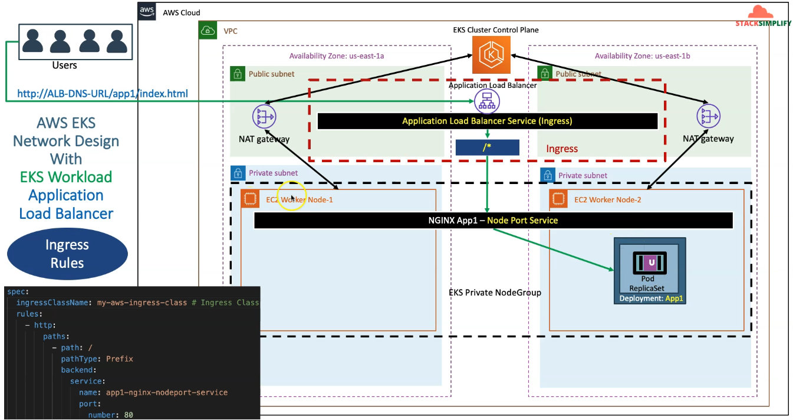

Ingress service with Ingress rules
---

- Here, we will use `Ingress Rules` and it will allow to route request by define paths by `/` .

- If i pass this path <LB_URL>/path1/index.html , it will allow to get all info inside path1/*.

- While you deploy Ingress service , API Server will detect it and create Load Balancer's Listeners: HTTP and Listeners: HTTPS.

