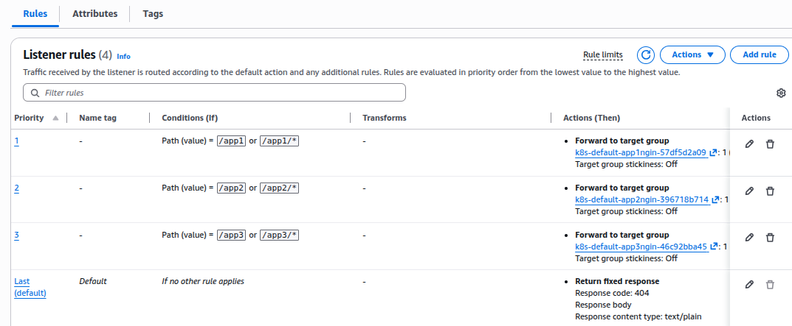
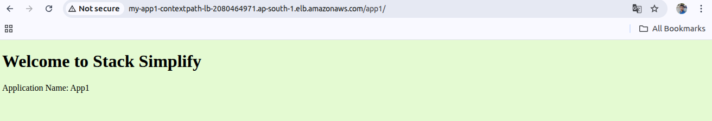

Ingress Context Path Based Routing
---


- We are going to deploy multiple appliation for context path based routing using aws laod balancer controller with Ingress rules.

## 1. Create deployment for Multiple Services.

### 1.1 Create deployment for Service A.

```yml
apiVersion: apps/v1
kind: Deployment
metadata:
  name: app1-nginx-deployment
  labels:
    app: app1-nginx
spec:
  replicas: 1
  selector:
    matchLabels:
      app: app1-nginx
  template:
    metadata:
      labels:
        app: app1-nginx
    spec:
      containers:
        - name: app1-nginx-c
          image: stacksimplify/kube-nginxapp1:1.0.0
          ports:
            - containerPort: 80

---

apiVersion: apps/v1
kind: Deployment
metadata:
  name: app2-nginx-deployment
  labels:
    app: app2-nginx
spec:
  replicas: 1
  selector:
    matchLabels:
      app: app2-nginx
  template:
    metadata:
      labels:
        app: app2-nginx
    spec:
      containers:
        - name: app2-nginx-c
          image: stacksimplify/kube-nginxapp1:1.0.0
          ports:
            - containerPort: 80
        
---

apiVersion: apps/v1
kind: Deployment
metadata:
  name: app3-nginx-deployment
  labels:
    app: app3-nginx
spec:
  replicas: 1
  selector:
    matchLabels:
      app: app3-nginx
  template:
    metadata:
      labels:
        app: app3-nginx
    spec:
      containers:
        - name: app3-nginx-c
          image: stacksimplify/kube-nginxapp1:1.0.0
          ports:
            - containerPort: 80
```

### 1.2 Create Services for Service A, Service B, Service C.

- Here, We have to define annotations for health-check for each service due to we want to deploy multiple applications.

- Also we will have to add health-check path in **Ingress Service**.

```yml
apiVersion: v1
kind: Service
metadata:
  name: app1-nginx-nodeport-service
  labels:
    app: app1-nginx
# NOTES: We will require to add health-check path in annotation in this service if we are planning to deploy multiple applications targets like app1/index.html, app2/index.html using Load Balancer Controller Ingress.
  annotations:
    alb.ingress.kubernetes.io/healthcheck-path: /app1/index.html
spec:
  selector:
    app: app1-nginx
  type: NodePort
  ports:
  - name: nginx-port
    port:  80
    targetPort:  80
```

### 1.3 Create Ingress Services

```yml
apiVersion: networking.k8s.io/v1
kind: Ingress
metadata:
  name: ingress-for-contextpath
  annotations:
  # Give ALB Load Balancer Name
    alb.ingress.kubernetes.io/load-balancer-name: my-app1-contextpath-lb

  # Give ALB Types: Internal or internet-facing (public)
    alb.ingress.kubernetes.io/scheme: internet-facing
  # Check health-check for our ALB
    alb.ingress.kubernetes.io/healthcheck-protocol: HTTP
  # alb.ingress.kubernetes.io/healthcheck-port specifies the port used when performing health check on targets.
    alb.ingress.kubernetes.io/healthcheck-port: traffic-port    
# traffic-port: This is the port number that the Target Group uses to send incoming application traffic to the targets. 
# Since we are using a NodePort service, the traffic-port must be set to the NodePort (e.g., 31234).
# healthcheck-port: traffic-port: By setting the health check port to traffic-port, you are telling the ALB: "The port I use for sending live traffic (the NodePort) is the exact same port that you should use to check the health of the target."

#########################################################################################################################
# Here we can only enalbe health-check for one service only. And Can't for multiple value. It's not allowed.
# That's for We enabled this health-check for all services at "kind: Service" service level in annotations.
#########################################################################################################################

# # Check health check on path of app1.
#     alb.ingress.kubernetes.io/healthcheck-path: /app1/index.html
# # Check health check on path of app2.
#     alb.ingress.kubernetes.io/healthcheck-path: /app2/index.html
# # Check health check on path of app3.
#     alb.ingress.kubernetes.io/healthcheck-path: /app3/index.html

# Check for health check of interval for 10s.
    alb.ingress.kubernetes.io/healthcheck-interval-seconds: '10'

# Health-check will fail if no respons within 8s.
    alb.ingress.kubernetes.io/healthcheck-timeout-seconds: '8'

# status code that should be expected when doing health checks against the specified health check path.
    alb.ingress.kubernetes.io/success-codes: '200'

# Check for health-check atleast 2 times before considering into UNHEALTHY
    alb.ingress.kubernetes.io/healthy-threshold-count: '2'

    alb.ingress.kubernetes.io/unhealthy-threshold-count: '2'
spec:
  rules:
    - http:
        paths: 
        # Add Path for App1
          - pathType: Prefix
            path: /app1/
            backend:
              service:
                name: app1-nginx-nodeport-service
                port: 
                  number: 80
        # Add Path for App2
          - pathType: Prefix
            path: /app2/
            backend:
              service:
                name: app2-nginx-nodeport-service
                port: 
                  number: 80
        # Add Path for App3
          - pathType: Prefix
            path: /
            backend:
              service:
                name: app3-nginx-nodeport-service
                port: 
                  number: 80
```


## Apply kube-manifests

```bash
kubectl apply -f kube-manifests/
```

## Listeners are created by alb controller



## Browse LB URL

-  <ALB_URL>/app1



- <ALB_URL>/ - for App3


