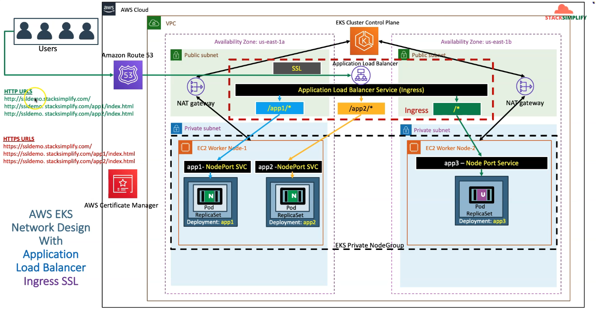
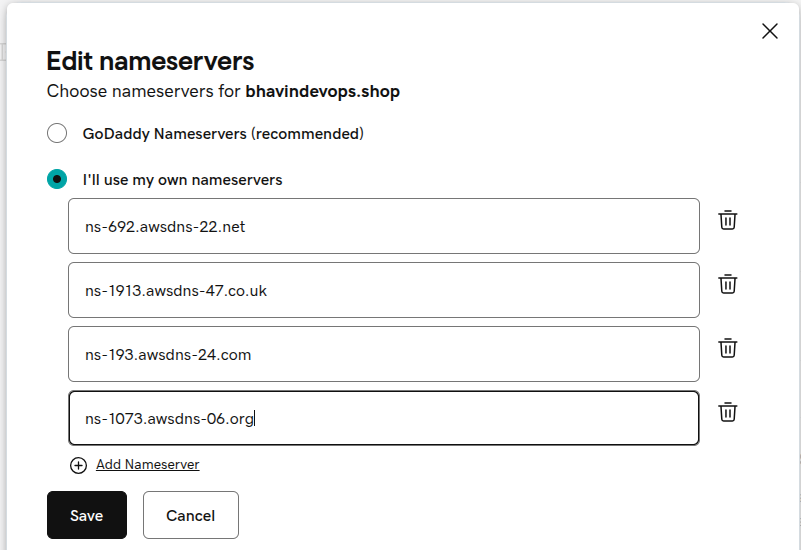
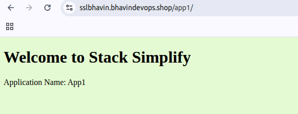
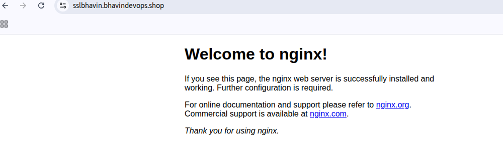

ALB Ingress SSL
---

1. Register AWS Route53 DNS Domains
2. Create SSL Cert in AWS Certificate Manager
3. Update SSL Cert in Ingress Service
4. Deplpy k8s manifests and Test




1. Register domain in AWS Route53.


2. Create a SSL Certificat in Certificate Manager

    - Go to AWS certificate manager > Request.
    - Give your domain name like `*.mydomain.com`.
    - Choose validation mathod as **DNS Validations**.

3. Update SSL Cert in Ingress Service

    - Add Annotations for SSL

```bash
 ## SSL Settings
    alb.ingress.kubernetes.io/listen-ports: '[{"HTTPS":443}, {"HTTP":80}]'
    alb.ingress.kubernetes.io/certificate-arn: arn:aws:acm:us-east-1:180789647333:certificate/632a3ff6-3f6d-464c-9121-b9d97481a76b
```

4. Deploy all manifests

```bash
kubectl apply -f kube-manifests/

kubectl get ingress

kubectl get deployments,pods,svc
```

5. Create Route53 Hosted Zones for your domains.

    - Go to Route53 > HostedZones
    - Give your domain name `mydomain.com`.
    - Choose Type as `Public hosted zones`.
    - Click on Create.

6. Modify your **nameserver** in your controller domains.

    - Add 4 nameserver created in HostedZones into Your Controller Domains by

        - Go to Controller domains > DNS > NameServer > Add 4 nameserver.
    


7. Create DNS Records in amazone Route53 for create validation records

    - Choose your Certificates created in AWS Certificate Manager > create records in route53.
    - Choose domains & create.

8. Create DNS Record Name to use it instead of Load Balancer URL.

8. Update SSL Cert in Ingress

```yml
    alb.ingress.kubernetes.io/listen-ports: '[{"HTTPS":443}, {"HTTP":80}]'
    alb.ingress.kubernetes.io/certificate-arn: arn:aws:acm:us-east-1:180789647333:certificate/632a3ff6-3f6d-464c-9121-b9d97481a76b
```

9. Deploy kube-manifests
```bash
kubectl apply -f kube-manifests/
```

10. Browse you DNS Records

- App1



- App2

