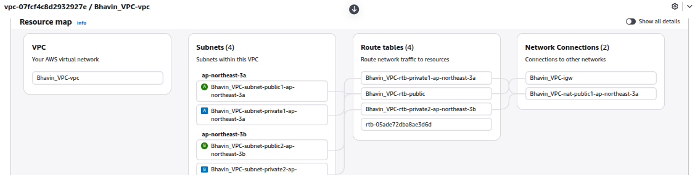
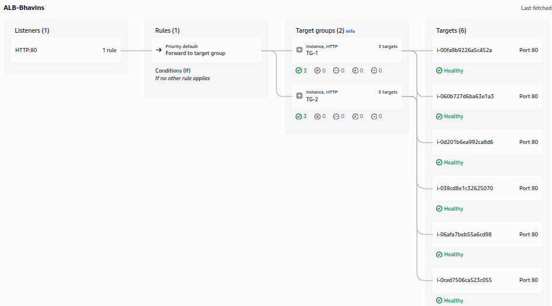
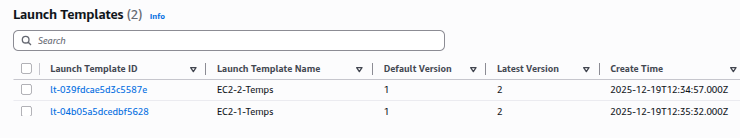
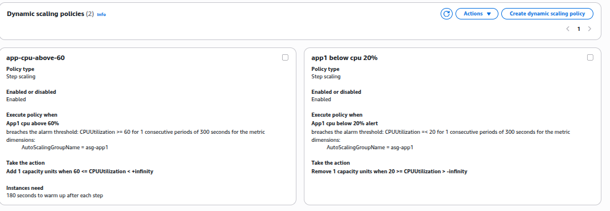
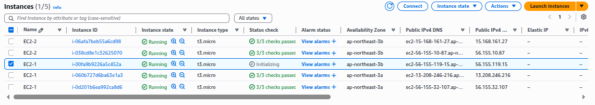
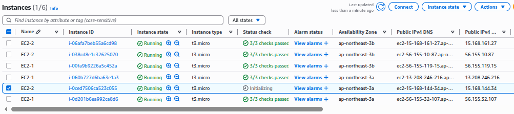
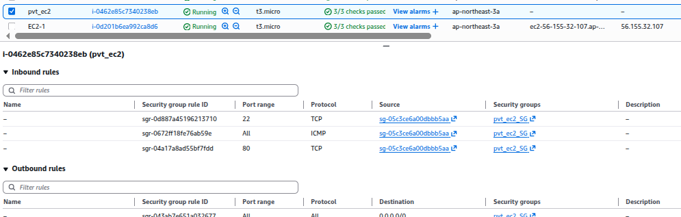
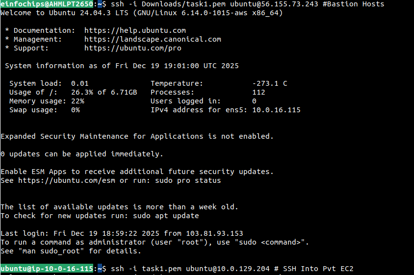
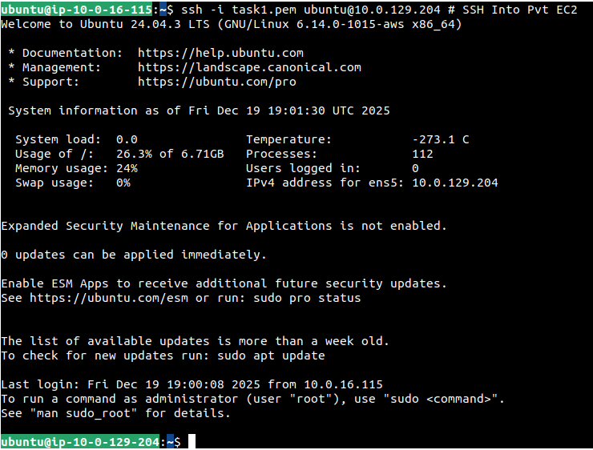

Create a Highly Available Web App Using ALB + EC2 Auto Scaling with architect diagram and explanation.
---

- Set up VPC with Pvt and Pub Route tabel
- Attach NAT and IGW



- Create 2 EC2 Instance
- Create 2 Target Group
- Create ALB

- Add listeners > Choose both Target Groups
- Keep weighted for each Target Group is 50%



- Create AMI of App1 and App2 Instance.

- Create Launch Template from AMIs.



- Create CW Metrics Alert for CPU Utilizations conditions for App1 and App2


- Create ASG for Each App1 and App2.


- Go to ASG > Autoscaling Scaling > Create Dynamica Scaling Policy.

- Add this CW Alert and use this alert in Step Scaling Policy.



- Generate load in your each apps.

```bash
sudo apt-get install stress -y

stress --cpu 2 --timeout 10m
```

- Scale up for App1


- Scale up for App2



## Task 3

- Create Bastion Host
- Create Pvt EC2 in Pvt Subnets.


- Allow Pvt EC2 SG Ports for SSH , HHTP Only from Bastion Hosts.



- SSH into Bastion Hosts.



- SSH into Pvt EC2

