Build a Serverless App Using API Gateway + Lambda + DynamoDB
---


## 1. Create a DynamoDB table (e.g., Products).

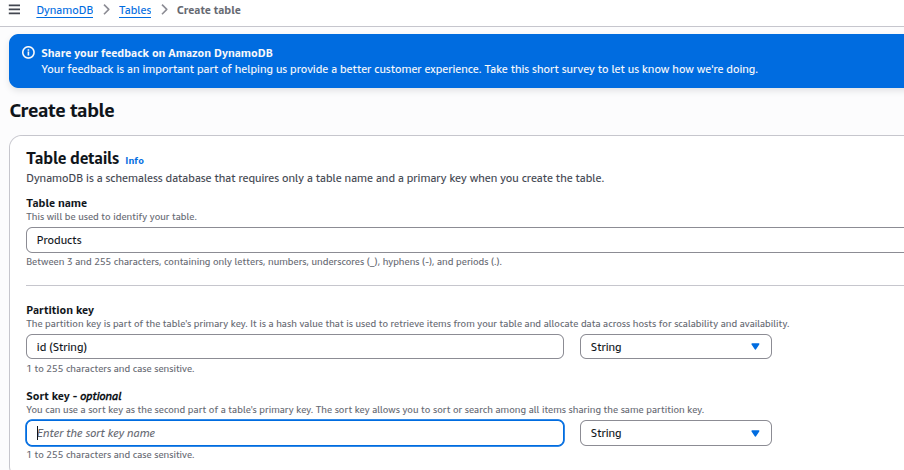

## 2. Create API for Handle Lambda request

### 2.1 Create API and Resource

- Go to API Gateway > Create APIs - `test-api`
- Create resource `/product`.

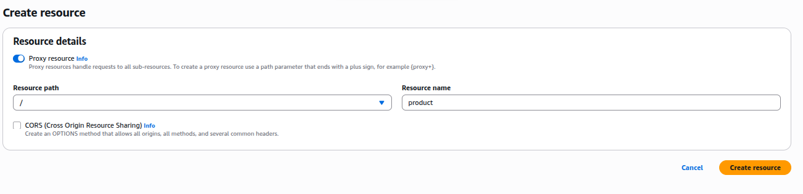

### 2.2 Create POST method

- Choose your resource `/product` > Create method
- Choose `POST`
- Integration type - `Lambda functions` > Choose your lambda function for POST.

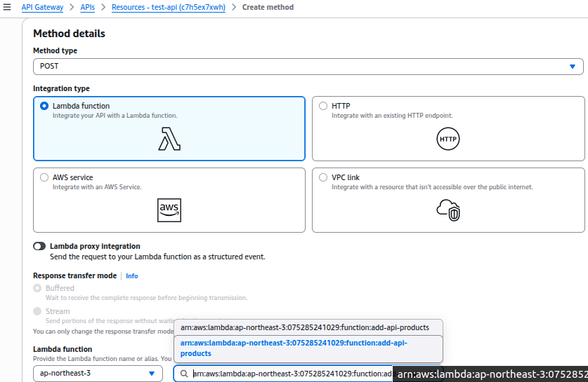


## 3. Create Basic pre-requisite role for Lambda for DynamoDB.

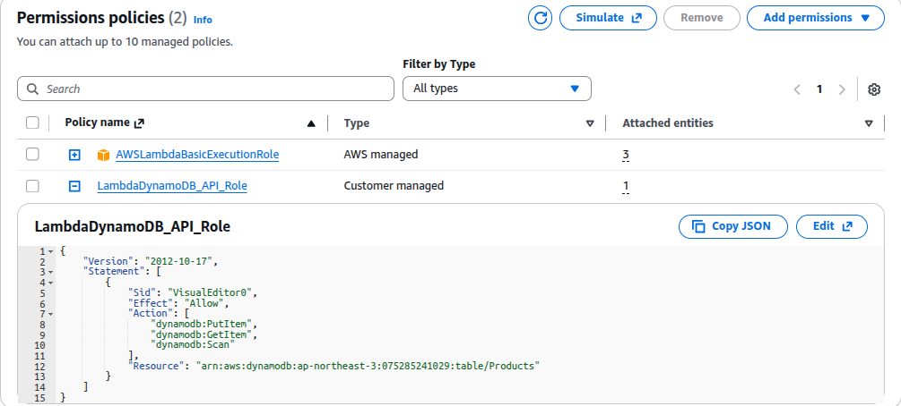

### 3.1 Create Lambda functions:

  - a. Add item (Add Product (POST))

  - Create lambda > choose runtime Python 3.12
  - Choose Existing role of lambda

  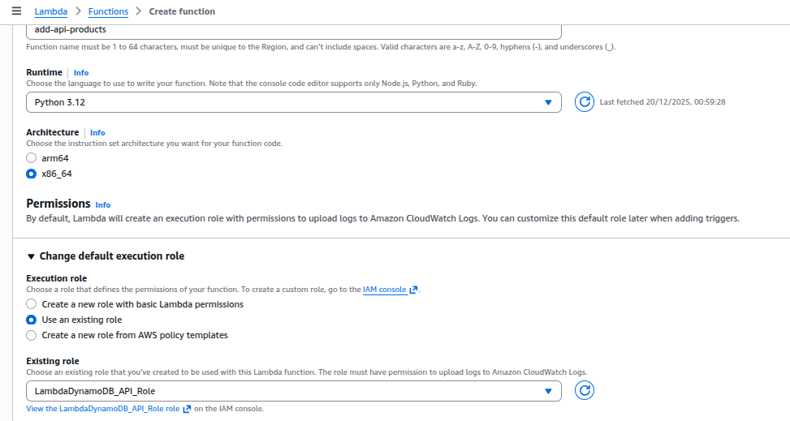

### 3.2 Deploy lambda post functions

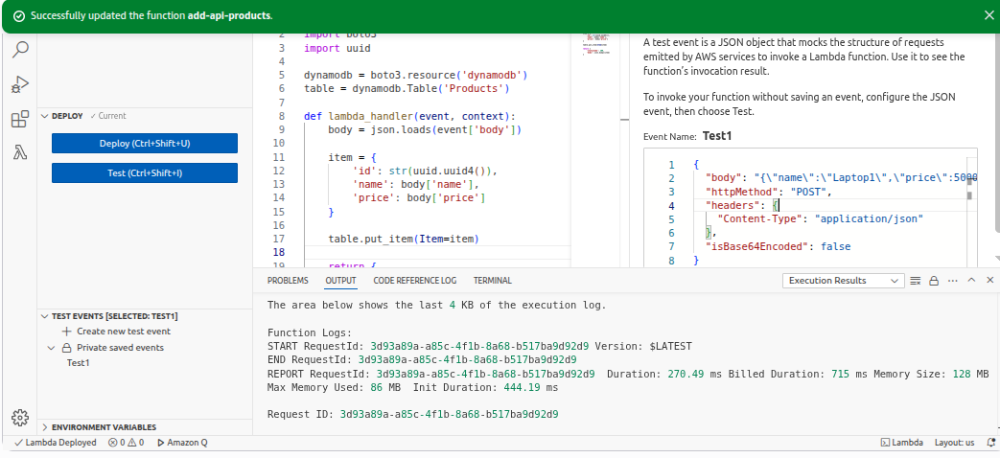

### 3.3 Varify table updated in DynamoDB.

- Go to DynamoDB > Table `Products` > Look for `Item Count`

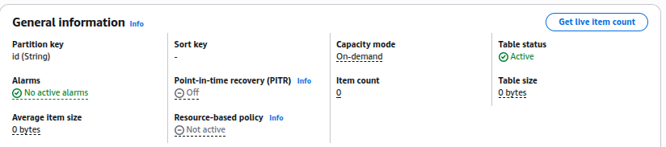

- It's still `0` due to DynamoDB updates the following information approximately every six hours.

- Ensure by aws cli
```bash
aws dynamodb scan --table-name Products --region <Your_Regions>
```

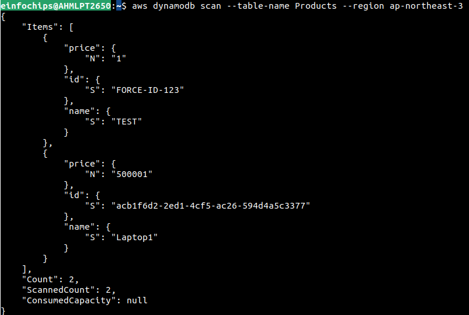

## 4. Create Lambda for Get Method

- Create Test Env to get product details via `id`

```json
{
  "pathParameters": {
    "id": "FORCE-ID-123"
  }
}
```

- Deploy lamdba > Test

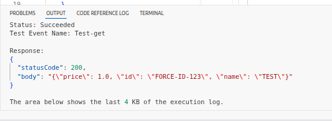

## 5. Create GET Method in API Gateway

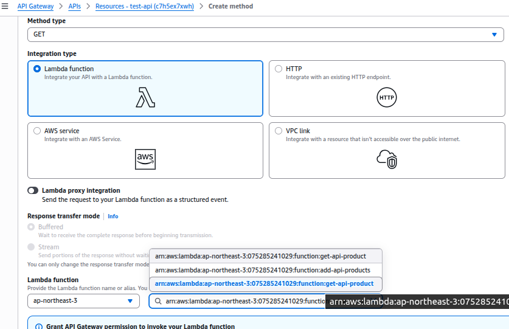


## 6. Deploy API

- Create Stage env `Dev`

- Deploy API

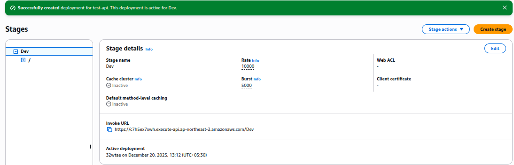

- Browse Dev Stage API URL

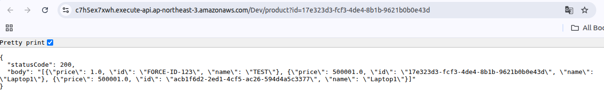
