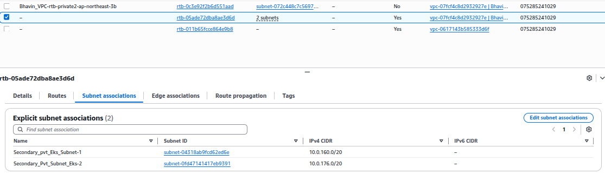
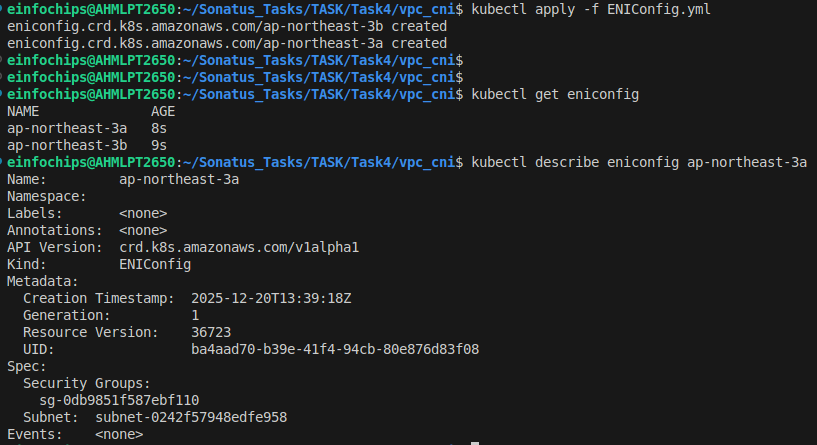
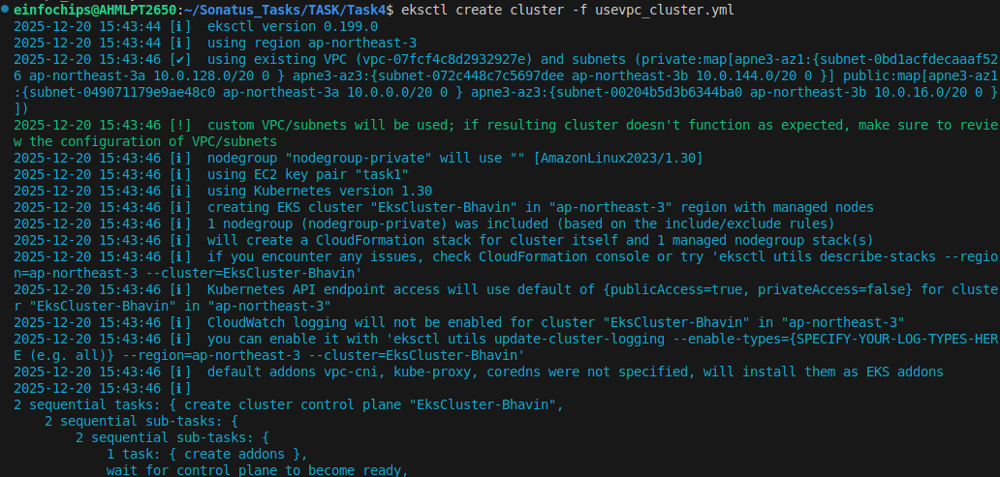
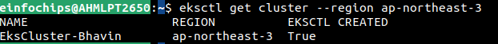
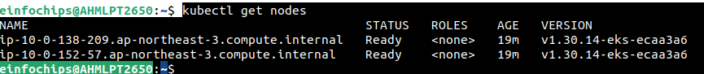
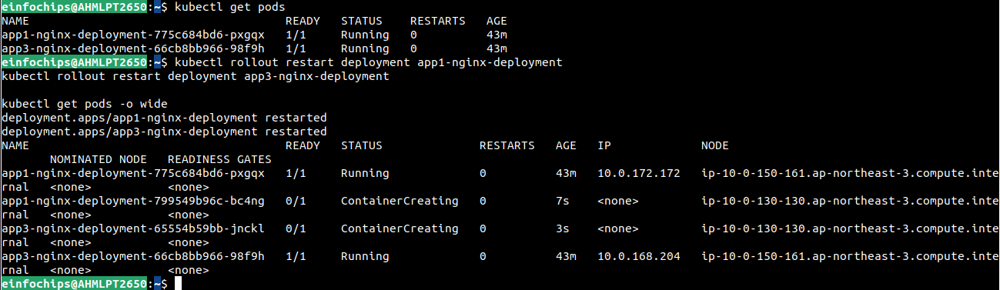
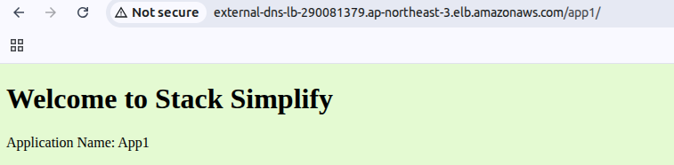
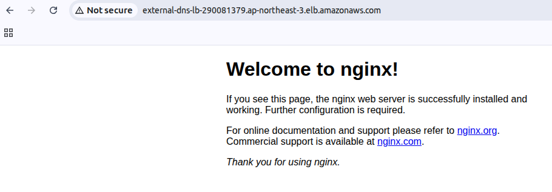

Build a Production-Ready EKS Cluster With Private Nodes + Public ALB with VPC CNI Custome Networking
---

## 1. Set up Custom VPC CNI Nerworking

### 1.1 Created 2 another Pvt Subnets

- Associate this secondary pvt subnet into default route table



- Assign Lables on that secondary pvt subnets which will used by `eniConfig`.

`kubernets.io/cluster/<Your_ClusterName>` = `shared`

## 2. Enable ENIConfig for each AZs of Secondary Pvt Subnets

- Enalbe ENIConfig for each AZs of Secondary Pvt Subnets

```bash
kubectl apply -f ENIConfig.yml
```

```yml
apiVersion: crd.k8s.amazonaws.com/v1alpha1
kind: ENIConfig
metadata:
  name: ap-northeast-3a  # Use 'a' for AZ1
spec:
  subnet: subnet-xxxx-az1 # Your pod subnet in AZ1
  securityGroups: 
    - sg-xxxx # The Cluster SG

apiVersion: crd.k8s.amazonaws.com/v1alpha1
kind: ENIConfig
metadata:
  name: ap-northeast-3b  # Use 'a' for AZ1
spec:
  subnet: subnet-xxxx-az2 # Your pod subnet in AZ1
  securityGroups: 
    - sg-xxxx # The Cluster SG
```

- Ensure ENIConfig created

```bash
kubectl get eniconfig
```



## 3. Enalbe VPC CNI Custom Networking

Set aws-node env vars
   - AWS_VPC_K8S_CNI_CUSTOM_NETWORK_CFG=true
   - ENI_CONFIG_LABEL_DEF=k8s.amazonaws.com/eniConfig

```bash
kubectl set env daemonset aws-node -n kube-system AWS_VPC_K8S_CNI_CUSTOM_NETWORK_CFG=true

kubectl set env daemonset aws-node -n kube-system ENI_CONFIG_LABEL_DEF=k8s.amazonaws.com/eniConfig
```


## 4. Create nodegroup WITH labels

### 4.1 - Run uservpc_cluster.yml


```yml
# uservpc_cluster.yml
# Setup EKS with Exisiting VPC

apiVersion: eksctl.io/v1alpha5
kind: ClusterConfig

metadata:
  name: EksCluster-Bhavin
  region: ap-northeast-3

vpc:
  id: "vpc-07fcf4c8d2932927e" 
  subnets:
    public:
      apne3-az1: { id: "subnet-049071179e9ae48c0" }
      apne3-az3: { id: "subnet-00204b5d3b6344ba0" }
    private:
      apne3-az1: { id: "subnet-0bd1acfdecaaaf526" }
      apne3-az3: { id: "subnet-072c448c7c5697dee" }

managedNodeGroups:
  - name: nodegroup-private
    instanceType: t3.medium
    minSize: 2
    maxSize: 3
    desiredCapacity: 2
    volumeSize: 20
    privateNetworking: true
    ssh: 
      allow: true
      publicKeyName: task1 # Matches your --ssh-public-key
    iam:
      withAddonPolicies:
        imageBuilder: true   # THIS gives you --full-ecr-access (PowerUser)
        autoScaler: true     # THIS gives you --asg-access
        externalDNS: true    # Matches --external-dns-access
        albIngress: true     # Matches --alb-ingress-access
        appMesh: true        # Matches --appmesh-access
```

- Configure your VPC for EKS

```bash
kubectl apply -f usevpc_cluster.yml
```



- Get EKS Cluster

```bash
kubectl get cluster
```



- Get nodes



### 4.2 Lable nodes

- Lable your nodes as in the eniConfig has metadata.

```bash
kubectl label node ip-10-0-130-130 k8s.amazonaws.com/eniConfig=private-subnet-1
kubectl label node ip-10-0-150-161 k8s.amazonaws.com/eniConfig=private-subnet-2
```

- Restart aws-nodes to load this lables and used by ENI Configs.

```bash
kubectl delete pod -n kube-system -l k8s-app=aws-node
```

## 5. Install ALB Controller , Service Account for ALB

## 6. Deploy Apps and Services



- Browse ALB EndPoints



