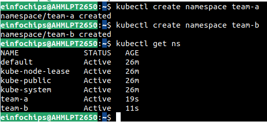
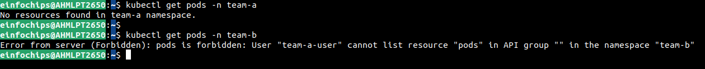
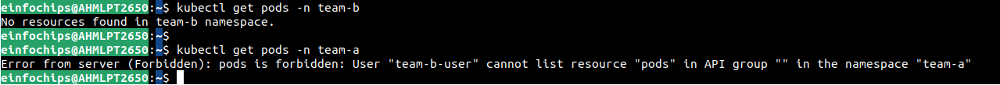
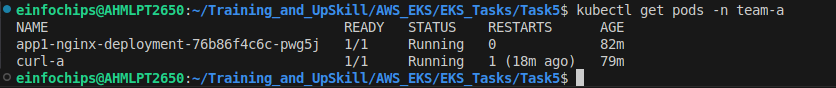
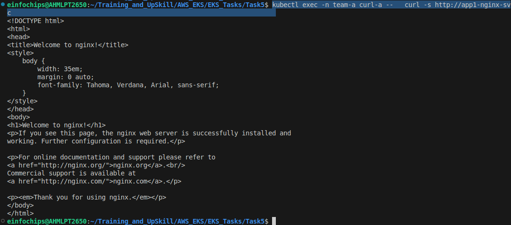
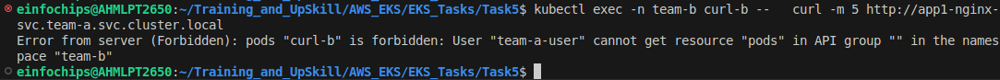
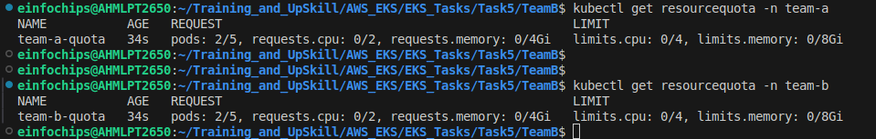
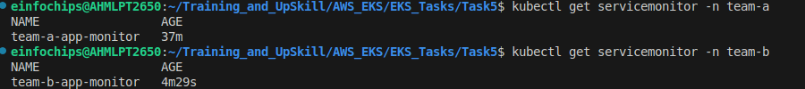
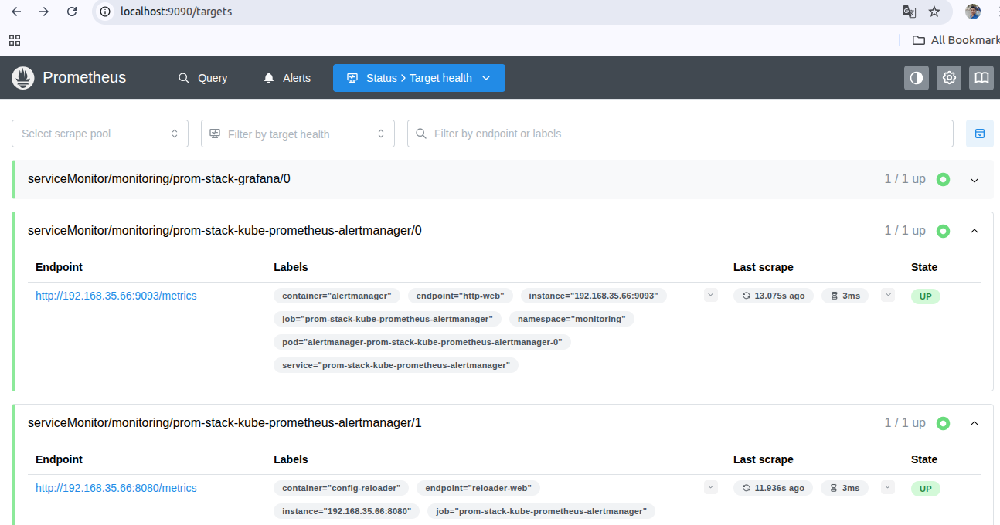
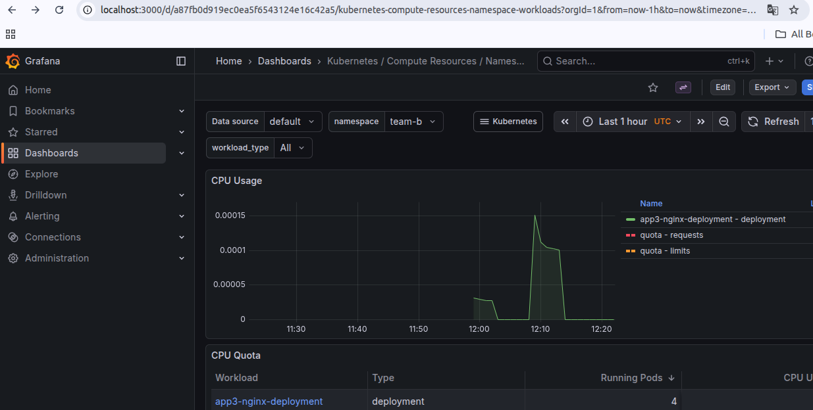

Multi-Tenant EKS Setup
---

## 1. Create IAM User for Team A and Team B

- Create Role which is assume by Team A and Team B users. And Assign Least Permission of EKS to both IAM Users to Authenticate EKS.

## 2. Create EKS Cluster


## 2.1 Create namespaces

```bash
kubectl create ns team-a
kubectl create ns team-b
```



## 2.2 Map IAM user to EKS

- Edit aws-auth:
```bash
kubectl edit configmap aws-auth -n kube-system
```

- Add team-a-user in `team-a-group` by IAM User ARNs.

```yml
mapRoles: |
  - rolearn: arn:aws:iam::<ACCOUNT_ID>:role/TeamARole
    username: team-a
    groups:
      - team-a-group
  - rolearn: arn:aws:iam::<ACCOUNT_ID>:role/TeamBRole
    username: team-b
    groups:
      - team-b-group
```

## 3. Create RBAC for IAM User to allow what can they do in their namespace

```yml
# team-a-role.yaml
apiVersion: rbac.authorization.k8s.io/v1
kind: Role
metadata:
  namespace: team-a
  name: team-a-role
rules:
- apiGroups: ["", "apps"]
  resources: ["pods", "services", "deployments"]
  verbs: ["get", "list", "create", "delete"]

---

# team-a-binding.yaml
apiVersion: rbac.authorization.k8s.io/v1
kind: RoleBinding
metadata:
  name: team-a-binding
  namespace: team-a
subjects:
- kind: Group
  name: team-a-group
roleRef:
  kind: Role
  name: team-a-role
  apiGroup: rbac.authorization.k8s.io
```

- Create Cluster role and binding

```bash
kubectl apply -f team-a-rbac.yml
kubectl apply -f team-b-rbac.yml
```

### 3.1 Ensure Team A User can't access any resource of Team B NameSpace

```bash
kubectl get pods -n team-a

kubectl get pods -n team-b
```



### 3.2 Ensure Team B User can't access any resource of Team A NameSpace



**`This is concept of Why RBAC is required in real prod env`**

`RBAC can restrics User permissions in cluster.`

While `Network Policy can Restrics Network Ingress and Egress between NameSpace.`


## 4. NetworkPolicy Isolations

- Team-A pods cannot talk to Team-B pods

- Team-B pods cannot talk to Team-A pods

- Each team can access their own namespace only.

### 4.1 Disable all Ingress for all namespace

- Bydefault All namespace can accesss cross-namespaces pods, networks.

- We want to restrict it for cross-namespace, so Each team can access pods within their namespace only.

```yml
apiVersion: networking.k8s.io/v1
kind: NetworkPolicy
metadata:
  name: deny-all-ingress
  namespace: team-a
spec:
  podSelector: {}
  policyTypes:
  - Ingress

---

apiVersion: networking.k8s.io/v1
kind: NetworkPolicy
metadata:
  name: deny-all-ingress
  namespace: team-b
spec:
  podSelector: {}
  policyTypes:
  - Ingress

```

### 4.2 Allow Networks for each namespace itslef

```yml
apiVersion: networking.k8s.io/v1
kind: NetworkPolicy
metadata:
  name: allow-same-namespace
  namespace: team-a
spec:
  podSelector: {}
  policyTypes:
  - Ingress
  ingress:
  - from:
    - podSelector: {}
```

### 4.3 Update RBAC for all namespaces

- To access your app for namespace `team-a` by `exec`.

- You will have to update RBAC.

- `exec/pod` and `deployments` has diff APIs.
- You will have to create 2 rules for API `""` and API `apps`.

```yml
# team-a-role.yaml
apiVersion: rbac.authorization.k8s.io/v1
kind: Role
metadata:
  namespace: team-a
  name: team-a-role
rules:
- apiGroups: [""]
  resources: ["pods/exec", "pods", "services"]
  verbs: ["get", "list", "create", "delete"]

- apiGroups: ["apps"]
  resources: ["deployments"]
  verbs: ["get", "list", "create", "delete"]
```

### 4.4 Access your app1

- Check Team A has Runnig Pods



- Access your App1 by team-a-user from team-a namespace

```bash
kubectl exec -n team-a curl-a --   curl -s http://app1-nginx-svc
```



### 4.5 Test NetworkPolicy for Team B from Team A NS

```bash
kubectl exec -n team-b curl-b --   curl -m 5 http://app1-nginx-svc.team-a.svc.cluster.local
```



**It Shouldn't access to NameSpace `team-b` resurces** - Applies RBAC
**It Shouldn't access Pod of `team-a` to `team-b` Pods** - Applies NetworkPolicy

## 5. Resource Quotas

- Limit CPU, Memory, number of pods/services per namespace

- Prevent one team from consuming all cluster resources



## 6. Setup Monitoring

- We will setup monitoring by Prometheus and Grafana.
- Prometheus and Grafana will be installed in `monitoring` namespace to monitor all ns.

### 6.1 Create namespace

```bash
kubectl create ns monitoring
```

### 6.2 Add helm repo

```bash
helm repo add prometheus-community prometheus-community.github.io
helm repo update
```

### 6.3 Add prometheus-stack by helm

```bash
helm install prom-stack prometheus-community/kube-prometheus-stack \
  --namespace monitoring \
  --create-namespace \
  --set prometheus.prometheusSpec.serviceMonitorSelectorNilUsesHelmValues=false \
  --set prometheus.prometheusSpec.podMonitorSelectorNilUsesHelmValues=false \
  --set prometheus.prometheusSpec.ruleSelectorNilUsesHelmValues=false
```

- After installing the operator, you or your teams (team-a, team-b) can define ServiceMonitor or PodMonitor resources in their respective namespaces, and the central 
Prometheus instance will automatically discover and scrape the metrics.


### 6.4 Create Service Monitor in each namespces

```yml
# For team-a ns
apiVersion: monitoring.coreos.com/v1
kind: ServiceMonitor
metadata:
  name: team-a-app-monitor
  namespace: team-a  # The team's namespace
  labels:
    release: prom-stack # Optional, but helps with organization
spec:
  selector:
    matchLabels:
      app: app1-nginx-svc # Must match the label on your team-a Service
  endpoints:
  - port: http-metrics # Must match the 'name' of the port in your team-a Service
    interval: 30s
```

- Same you will have to create for team-b ns.



### 6.5 Expose on local by port-forwarding

- Prometheus

```bash
kubectl port-forward svc/prom-stack-kube-prometheus-prometheus 9090:9090 -n monitoring
```



- Grafana

```bash
kubectl port-forward svc/prom-stack-grafana 3000:80 -n monitoring
```



