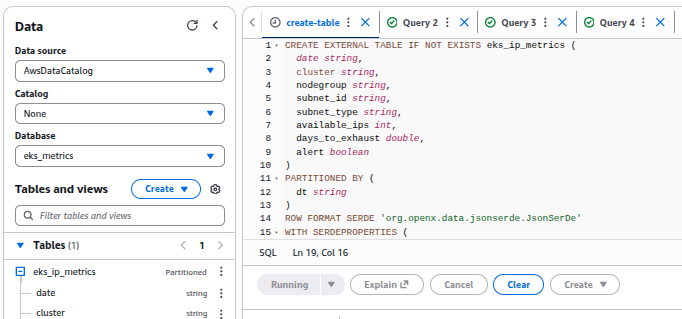
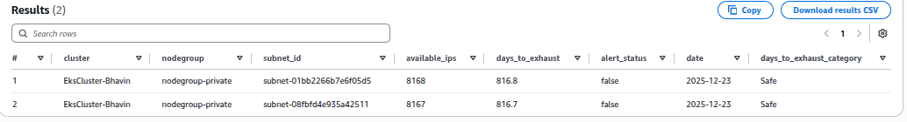
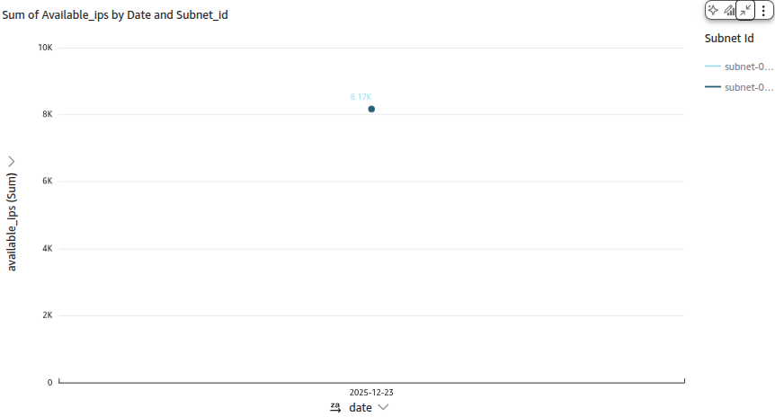
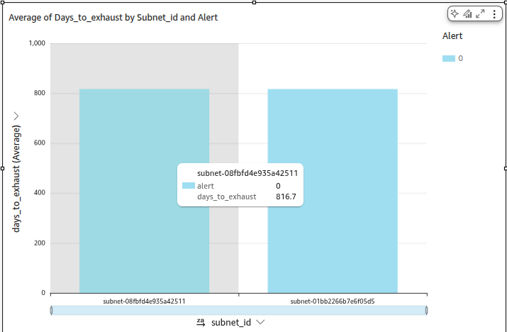
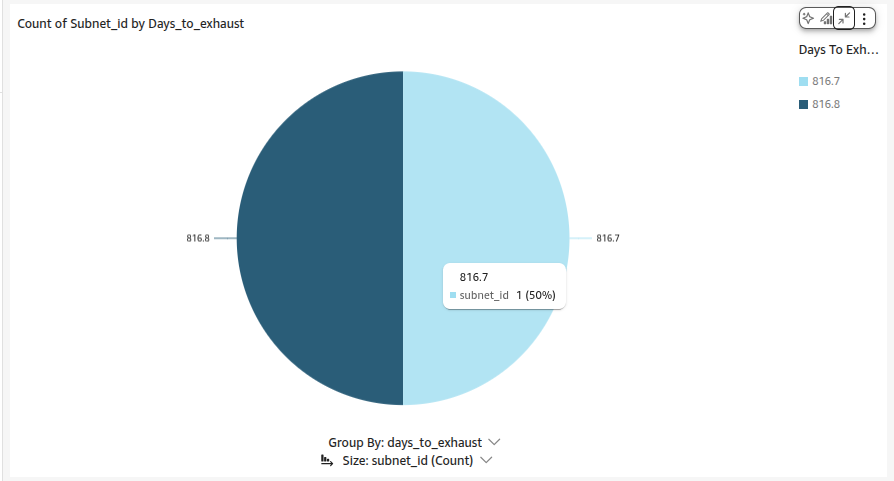
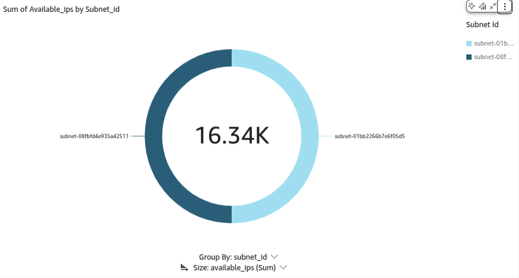
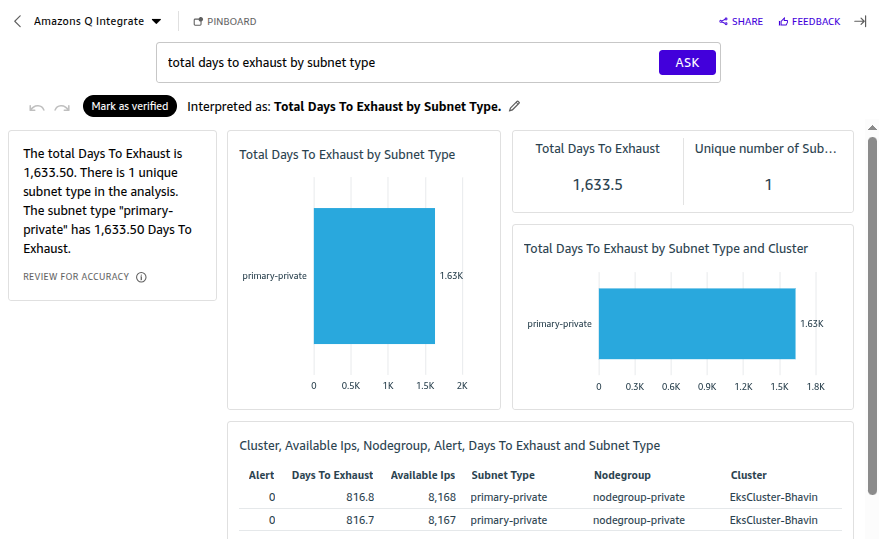
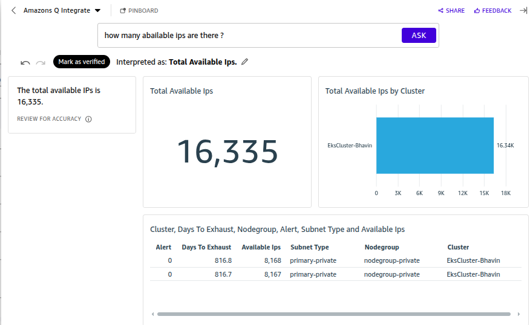

## 1. Setup EKS

## 2. Create labmda 

- Lambda will fetch Available IPs from Primary pvt subnets.
- This will prevent from exhaust primary subnets in prod env.

- Lambda will create metrics.json and send to S3 bucket.

- Athena will use this S3 to create table data.

```py
import boto3
import json
from datetime import date

# AWS Clients
s3 = boto3.client('s3')
eks = boto3.client('eks')
ec2 = boto3.client('ec2')

# CONFIG
BUCKET = "source-s3-athena-bhavins"
DAILY_IP_GROWTH = 10
ALERT_THRESHOLD_DAYS = 3

def lambda_handler(event, context):

    # IMPORTANT: ISO format for Athena partitions
    today = date.today().isoformat()  # YYYY-MM-DD

    clusters = eks.list_clusters()['clusters']
    ndjson_lines = []

    for cluster in clusters:
        nodegroups = eks.list_nodegroups(
            clusterName=cluster
        )['nodegroups']

        for ng in nodegroups:
            ng_info = eks.describe_nodegroup(
                clusterName=cluster,
                nodegroupName=ng
            )['nodegroup']

            for subnet_id in ng_info['subnets']:

                subnet = ec2.describe_subnets(
                    SubnetIds=[subnet_id]
                )['Subnets'][0]

                # Available IPs
                available_ips = subnet['AvailableIpAddressCount']

                # Prediction logic (Phase-1 static)
                days_to_exhaust = round(available_ips / DAILY_IP_GROWTH, 2)

                # 🔹 CORRECT SUBNET TYPE DETECTION
                subnet_type = "other"
                for tag in subnet.get("Tags", []):
                    if tag.get("Key") == "SubnetType":
                        subnet_type = tag.get("Value")
                        break

                # Alert logic
                alert = days_to_exhaust <= ALERT_THRESHOLD_DAYS

                record = {
                    "date": today,
                    "cluster": cluster,
                    "nodegroup": ng,
                    "subnet_id": subnet_id,
                    "subnet_type": subnet_type,
                    "available_ips": available_ips,
                    "days_to_exhaust": days_to_exhaust,
                    "alert": alert
                }

                # NDJSON → one JSON per line
                ndjson_lines.append(json.dumps(record))

    # Write to S3 (partitioned)
    s3.put_object(
        Bucket=BUCKET,
        Key=f"dt={today}/metrics.json",
        Body="\n".join(ndjson_lines),
        ContentType="application/json"
    )

    return {
        "status": "SUCCESS",
        "clusters_processed": len(clusters),
        "records_written": len(ndjson_lines)
    }
```

## 3. Create S3 bucket for lambda

- Lambda will put metrics.json in this S3.

```json
{"date": "2025-12-23", "cluster": "EksCluster-Bhavin", "nodegroup": "nodegroup-private", "subnet_id": "subnet-01bb2266b7e6f05d5", "subnet_type": "primary-private", "available_ips": 8168, "days_to_exhaust": 816.8, "alert": false}

{"date": "2025-12-23", "cluster": "EksCluster-Bhavin", "nodegroup": "nodegroup-private", "subnet_id": "subnet-08fbfd4e935a42511", "subnet_type": "primary-private", "available_ips": 8167, "days_to_exhaust": 816.7, "alert": false}
```

## 4. Create S3 bucket for Athenas 


- Create tables in athena by



- It will create partitions for your data into tabular.

```bash
MSCK REPAIR TABLE eks_ip_metrics;
```

- This is for 2 Primary pvt subnets.



## 5. Create QuickSight

- Create Account.
- Create DataSet > give your athena S3 bucket as Data Source

- Create Dashboards

1. Dashboard 1



2. Dashboard 2



3. Dashboard 3



4. Dashboard 4



## 6. Integrate with Amazon Q.

- Create Topic in this Quickight




