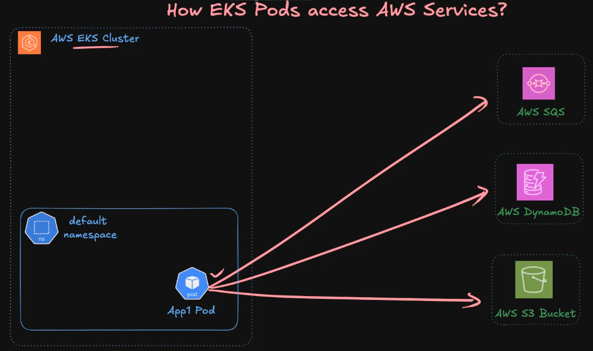
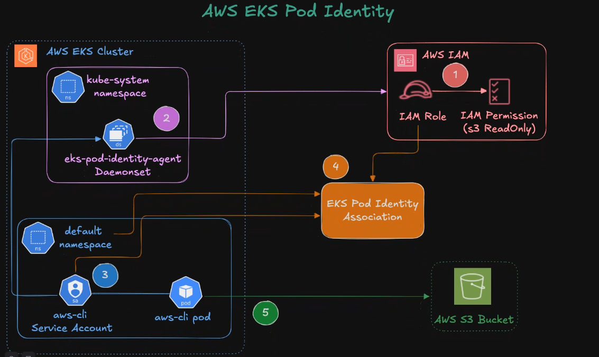
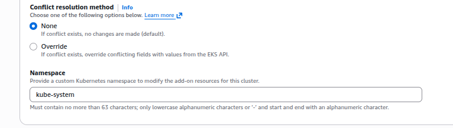
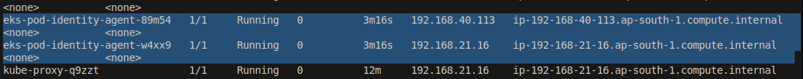
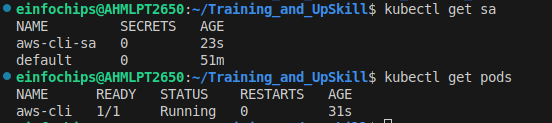
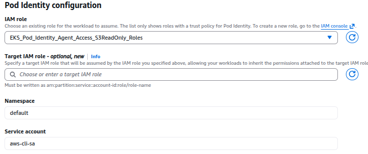

EKS Pod Identity Agent
---

- EKS Cluster Pods can able to communicate with AWS Services (OutSide of EKS) like S3, DynamoDB, SQS etc.



- How EKS Pods will able to do this ?

- By `Pod Identity Agent`.

How to Implement Pod Identity Agent ?
---




# What is an aws-cli-pod?

- An aws-cli-pod is a standard Kubernetes Pod that runs an official image (like amazon/aws-cli or a custom image) which has the AWS CLI installed and configured.

- Its typical configuration includes:

    1. `**Image**`: An official AWS CLI container image.

    2. `**IAM Role**`: The Pod is usually associated with an IAM Role for Service Accounts (IRSA). This grants the Pod the necessary AWS permissions (e.g., read/write S3, manage EC2, or interact with EKS itself) without needing to store static access keys.

## 1. Create and Assign IAM Role to aws-cli Pod

- We will create IAM ROLE for give access to S3 List,Read to our EKS `aws-cli pod`.

## 2. Install Pod Identity Agent

- We will Install Pod Identity Agent as `**DeamonSet**` to Run it in Each & Every Nodes available.

## 3. Create Service Account

- We will create Service Account for `aws-cli pod`.

## 4. EKS Pod Identity Associations

- We will do EKS Pod Identity Associations.


## 1. Install Pod Identity Agent

- Go to EKS > Add-ons > Search for "EKS Pod Identity" > Install it.


- It will install in `kube-sustem` namespace.



- Varify it in kube-system namespace

```bash
kubectl get pods -n kube-system
```



## 2. Deploy AWS CLI Pod (Without Pod Identity Associations)

### 2.1 Create Service Account

```yml
apiVersion: v1
kind: ServiceAccount
metadata:
  name: aws-cli-sa
  namespace: default
```

### 2.2 Create AWS CLI Pod

```yml
apiVersion: v1
kind: Pod
metadata:
  name: aws-cli
  namespace: default

spec:
  serviceAccountName: aws-cli-sa
  containers:
    - name: aws-cli
      image: amazon/aws-cli
      command: ["sleep","infinity"]
```

- Create Sevice Account & AWS CLI Pod

```bash
kubectl create -f sa.yml

kubectl create -f aws-cli.yml
```



### 3. Create and Assign IAM Role to aws-cli Pod

- Go to Roles > EKS > EKS > Pod Identity


- Choose S3 ReadOnly Permjissions.

### 4. EKS Pod Identity Associations

- Go to EKS > Access > Create Pod Identity association 



- Choose Name space and Service Account & Create.

### 5. Try to list all s3 in aws-cli pods

```bash
kubectl exec -it aws-cli -- /bin/bash
```


### 5.1 You have to Restart aws-cli Pods to load all changes

```bash
kubectl delete pods aws-cli

kubectl create -f aws-cli.yml

kubectl exec -it aws-cli -- /bin/bash
```


