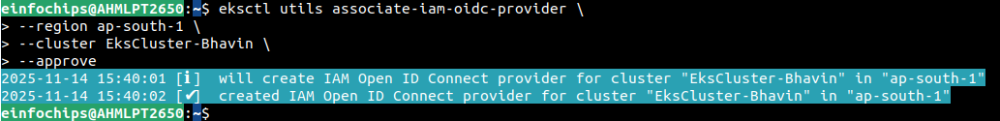
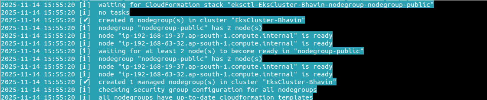
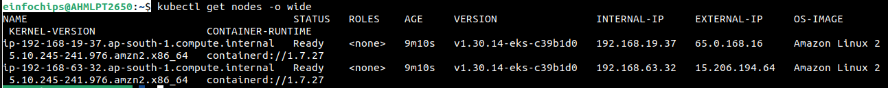

## **What is AWS EKS?**

- Amazon Elastic Kubernetes Service (EKS) is a **fully managed Kubernetes service** on AWS.
- AWS manages the **control plane**, while you manage the **worker compute** (EC2 or Fargate).

- EKS helps you run containerized applications at scale without managing Kubernetes master nodes.


# **Core Components of EKS**

EKS primarily consists of **four key components**:

1. **EKS Control Plane**
2. **Worker Nodes & Node Groups**
3. **Fargate Profiles**
4. **VPC (Virtual Private Cloud)**

## 1. **EKS Control Plane**

- The control plane is the **master component** of Kubernetes.

- It includes:

* API Server
* etcd (cluster database)
* Scheduler
* Controller Manager

### Key Features

* Fully managed by AWS
* Runs across **3 Availability Zones** for high availability
* Automatically detects and replaces unhealthy control plane nodes
* Dedicated per cluster (not shared with others)
* No need to patch, upgrade, or maintain master nodes

You only manage your worker compute—not the Kubernetes master.


## 2.**Worker Nodes & Node Groups**

- Worker nodes are the actual **EC2 instances** where your **pods run**.

A **Node Group** is:

* One or more EC2 instances
* Managed under an **Auto Scaling Group**
* Using EKS-optimized AMI
* Running the same instance type family
* Sharing the same IAM Role

### Key Features

* Runs application workloads
* Connects to the control plane through the cluster API endpoint
* Can scale automatically with Kubernetes Cluster Autoscaler
* Can be created manually or through tools like `eksctl` or CloudFormation


## 3.**Fargate Profiles**

- AWS Fargate is a **serverless compute engine** for containers.

With Fargate:

* You don’t create or maintain EC2 nodes
* AWS provides exact CPU/RAM per pod
* No resource wastage
* Each pod runs in an isolated environment

### ✔ Key Features

* Ideal for small apps, event-driven workloads
* Requires **private subnets** in the VPC
* Fargate controller schedules pods based on:

  * Namespace
  * Labels

Fargate makes Kubernetes fully serverless.


## 4️**VPC (Virtual Private Cloud)**

A properly designed VPC is critical for EKS.

### ✔ Why VPC matters

* Defines networking for the cluster
* Controls public/private subnet placement
* Ensures communication between worker nodes and control plane
* Enables NAT Gateway for private subnet access
* Secures traffic using:

  * Route Tables
  * Security Groups
  * NACLs

### ✔ Important Notes

* Fargate requires **at least one private subnet**
* Worker nodes can communicate with the cluster endpoint:

  * Internally (private endpoint)
  * Or via Internet (public endpoint)


# **EKS Workflow – How EKS Operates**

1. **Create EKS Cluster (Control Plane)**
2. **Create Node Groups (EC2 Nodes) or Fargate Profiles**
3. **Configure kubeconfig & connect via kubectl**
4. **Deploy Pods & Services**
5. **EKS schedules workloads on Node Groups or Fargate**


# Create EKS Cluster 

```bash
eksctl create cluster --name=EksCluster_Bhavin \
                    --region=ap-south-1a,ap-south-1b \
                    --without-nodegroup
```


- Lists all EKS Cluster
```bash
eksctl get clusters
```

- Lists all Nodes
```bash
eksctl get nodes
```

# 2. Create & Associate IAM OIDC Provider for our EKS Cluster

```bash
eksctl utils associate-iam-oidc-provider \
    --region -ap-south-1 \
    --cluster EksCluster-Bhavin
```



# 3. Create EC2 Keypair

- Required for SSH into workder nodes.

- created keypair with name of `eks-demo`.

# 4. Create Node Group (worker nodes) with additional Add-Ons in Public Subnets

```bash
# Create Public Node Group

eksctl create nodegroup --cluster=EksCluster-Bhavin \
    --region=ap-south-1 \
    --name=nodegroup-public \
    --node-type=t3.medium \
    --nodes=2 \
    --nodes-min=2 \
    --nodes-max=3 \
    --node-volume-size=20 \
    --ssh-access \
    --ssh-public-key=eks-demo \
    --managed \
    --asg-access \
    --external-dns-access \ 
    --full-ecr-access \
    --appmesh-access \
    --alb-ingress-access
```



# 5. Verify Cluster & Nodes

## Verify NodeGroup subnets to confirm EC2 Instances are in Public Subnet

## Varify you nodes

```bash
eksctl get nodes -o wide
```



## Verify Security Group Associated to Worker Nodes

  - Go to EC2 > Choose Worker Nodes > SG.