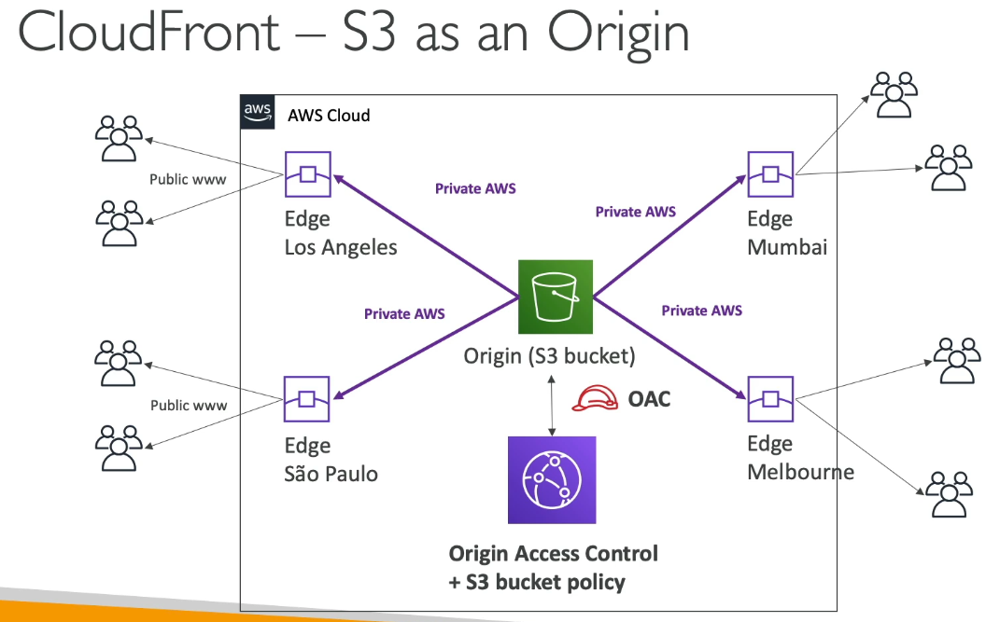

# Amazon CloudFront – Global Content Delivery Network (CDN)

## Overview
**Amazon CloudFront** is a **Content Delivery Network (CDN)** service that **improves website and application performance** by caching content closer to users at **AWS Edge Locations** worldwide.

Whenever you see **CDN** in AWS context — think **CloudFront**.

## Key Benefits

| Feature | Description |
|----------|--------------|
| **Global Caching** | Content is cached at hundreds of **Edge Locations** for low latency and fast delivery. |
| **High Performance** | Improves read speed by serving cached data locally instead of the origin every time. |
| **Security** | Built-in **DDoS protection** via **AWS Shield** and **AWS WAF** integration. |
| **Secure Access** | Protects origins (like S3 or Load Balancers) using **Origin Access Control (OAC)**. |
| **Cost-Efficient** | Reduces load on your origin servers, saving bandwidth and compute costs. |

## Supported Origins

| Origin Type | Description | Use Case |
|--------------|--------------|-----------|
| **Amazon S3 Bucket** | Static website or file hosting (e.g., images, videos, downloads). | Fast global file delivery. |
| **Application Load Balancer / EC2** | Dynamic or API-based applications hosted in AWS. | Accelerate dynamic content and APIs. |
| **Custom Origin (HTTP)** | Any public HTTP backend (on AWS or outside). | Serve web content from any web server. |
| **Private VPC Origin** | Connects securely to apps hosted inside a private subnet. | Secure delivery for internal apps. |