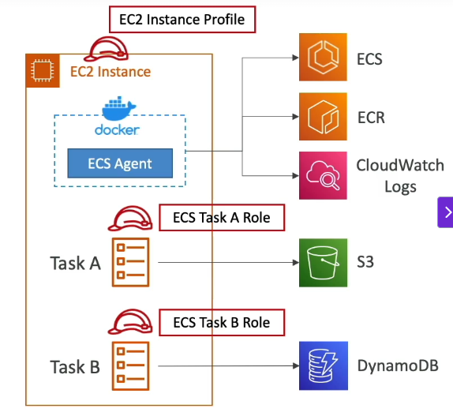
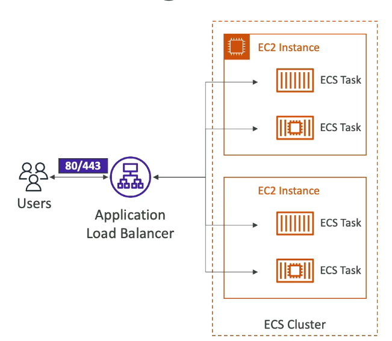
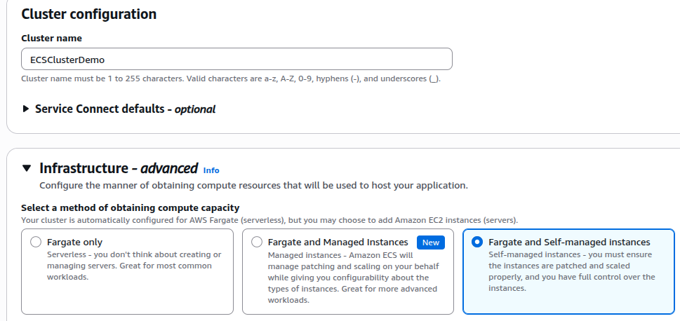
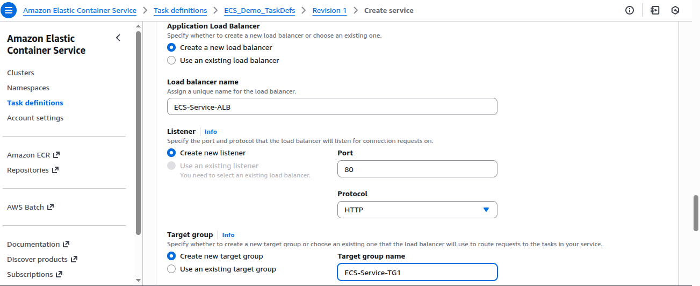

ECS - IAM Roles
---

- ECS will create docker instances inside this ec2 container host

## 1. The Container Instance (Host Layer)

The **EC2 Instance** acts as the container host for running ECS Tasks.

### Key Components

| Component | Description | Role / Purpose |
|------------|--------------|----------------|
| **Docker** | The container runtime installed on the EC2 instance. | Runs containers as defined in ECS Task Definitions. |
| **ECS Agent** | A background service running on the EC2 instance. | Registers the instance with ECS Cluster, reports resource status, and starts/stops containers as instructed by ECS. |
| **EC2 Instance Profile (IAM Role)** | IAM Role attached to the EC2 host. | Grants permissions to the ECS Agent and instance OS for infrastructure-level operations. |

### Common Permissions for Instance Profile

| Permission Scope | Examples | Purpose |
|------------------|-----------|----------|
| **ECS Service Communication** | `ecs:RegisterContainerInstance` | Allows the agent to communicate with the ECS control plane. |
| **CloudWatch Logs** | `logs:CreateLogStream`, `logs:PutLogEvents` | Enables log publishing. |
| **ECR Access** | `ecr:GetAuthorizationToken`, `ecr:BatchGetImage` | Allows pulling container images. |
| **Other AWS Services** | As needed | Enables ECS agent operations. |

## Architecture Flow

1. **EC2 Instance (Container Host)**
   - Acts as the base host for running containers.
   - Runs:
     - **Docker Engine** → Manages container creation and execution.
     - **ECS Agent** → Connects the EC2 host to the ECS Cluster.

2. **ECS Agent Registration**
   - Automatically registers the EC2 instance into the ECS Cluster.
   - Reports available CPU, memory, and resource status.

3. **Task Definition**
   - Blueprint that defines:
     - Which Docker image to run.
     - CPU & memory limits.
     - Networking, ports, and IAM roles.

4. **Running Tasks or Services**
   - ECS instructs the ECS Agent to:
     - **Pull Docker images** from ECR or Docker Hub.
     - **Run containers** according to the Task Definition.

5. **Container Execution**
   - Docker runs one or more containers per task.
   - ECS monitors and restarts containers as needed.

## ECS Layered Architecture

| Layer | Managed By | Description |
|-------|-------------|-------------|
| **ECS Control Plane** | AWS | Decides where containers run |
| **EC2 Instance (Container Host)** | You | Runs Docker & ECS Agent |
| **Docker Engine** | EC2 Host | Executes containers |
| **ECS Tasks / Containers** | ECS + Docker | Run your actual applications |

# ECS and ALB Integration

## Concept: Why ECS Needs an ALB (Application Load Balancer)

ECS services (running containers) often need to:
- Accept external traffic from the internet or internal apps.
- Balance traffic between multiple running containers.
- Handle scaling up or down automatically.

When ECS scales tasks (adds or removes containers), it requires a component that:
- Knows which containers are currently running.
- Can route requests to them automatically.
- Can check the health of each container.

That’s exactly what the **Application Load Balancer (ALB)** does.  
It acts as the **entry point** for incoming traffic and automatically distributes it to ECS tasks.

## How ECS–ALB Integration Works (Step-by-Step)

### 1. Service Definition in ECS
When you create an **ECS Service**, you define:
- **Task Definition** – Docker containers to run  
- **Desired Count** – Number of tasks to maintain  
- **Load Balancer** – ALB or NLB  
- **Target Group** – Used by the ALB to route traffic  

### 2. ECS Creates and Manages Target Groups
Each ECS service registers its running **tasks (containers)** as **targets** in an **ALB Target Group**.  
Each target = one container’s **private IP + port** (example: `10.0.2.45:8080`).

### 3. Dynamic Port Mapping
When ECS launches new containers:
- Each container gets a **random port** (e.g., `8080`, `32768`).
- ECS automatically **registers** the port + IP in the Target Group.
- ALB **dynamically routes** requests to the correct container.

This means multiple containers can run on the same EC2 instance while ALB correctly routes to each one.

### 4. Health Checks
- ALB continuously performs **health checks** (e.g., `/health`) on each container.  
- If a container fails the check, ALB automatically **stops sending traffic** to it.  
- ECS then **replaces** the unhealthy task automatically.

### 5. Scaling & Traffic Flow
- **Auto Scaling:** When ECS adds new tasks, they are automatically registered in the ALB target group.  
- **Load Balancing:** ALB evenly distributes requests among healthy containers.  
- **Cleanup:** When tasks stop, ECS automatically deregisters them from the ALB.

## IAM & Permissions

ECS uses the **Task Execution Role** and **Service Linked Role** to:
- Register or deregister targets in the ALB Target Group.  
- Describe or modify load balancer attributes.  
- Send health check results and scaling signals.

## When to Use ECS + ALB

| Use Case | Why ALB Fits |
|-----------|--------------|
| **Web Applications** | Distributes HTTP/HTTPS traffic efficiently. |
| **Microservices** | Allows each service to use its own path rule (e.g., `/api`, `/auth`). |
| **Auto-scaling Containers** | ALB automatically registers and deregisters tasks. |
| **Blue/Green Deployments** | Enables gradual traffic shifting between versions safely. |

## Summary

**ECS + ALB integration** allows you to:
- Manage dynamic containers with automatic routing.  
- Achieve health-based traffic distribution.  
- Simplify scaling and service management.  
- Enable modern deployment strategies like blue/green and canary rollouts.

Create ECS Cluster
---

`ECS Cluster` is that the cluster is just the environment and capacity.

while the `task definition` and service tell ECS what to run and how to run it.

- Create cluster and select self-managed instances.

- 

- Choose ASG create.
- Select Instance type `t2.micro`.

- Create `Task definitions` where you can define port mapping, docker or ECR Images etc.

- Also required to create `Service` where we can use load balancing integratinos, Deployment strategy like rolling updates, Expose the Services / Tasks , Define replicas , demonsets etc.

- Create ALB in this service to Expose your service.

ECS Service Auto Scaling
---

- Automatically increase/decrease desired no. of ECS Tasks.

- **Target Tracking** - Scale based on target value for a specific **CloudWatch Metrics**.

- **Step Scaling** - Scale based on a specific **CloudWatch Alarm**.

- **Scheduled Scaling** - Scale based on a specific **Date/Time**.

EKS
---

# Amazon EKS (Elastic Kubernetes Service)

## 1. What is Amazon EKS
- **Full form:** *Amazon Elastic Kubernetes Service*  
- **Purpose:** Run and manage **Kubernetes clusters** on AWS.  
- **Equivalent to:** ECS (both run containers) but with different APIs.  

## 2. What is Kubernetes
- **Kubernetes** is an **open-source container orchestration system** for deploying, scaling, and managing containerized (usually Docker) applications.  
- **Cloud-agnostic:** Runs on AWS, Azure, Google Cloud, or on-premises.  
- **EKS = AWS-managed Kubernetes**, whereas **ECS = AWS-native proprietary service**.  

## 3. EKS Launch Modes

| Launch Mode             | Description                                  | Managed Servers?       |
| ----------------------- | -------------------------------------------- | ---------------------- |
| **EC2 launch mode**     | Run Kubernetes worker nodes on EC2 instances | You manage EC2         |
| **Fargate launch mode** | Run pods serverlessly, AWS manages compute   | AWS manages everything |

## 4. Typical Use Cases
- Company already uses **Kubernetes on-prem or multi-cloud**.  
- Need to **reuse Kubernetes YAML / API** while leveraging AWS infrastructure.  
- Want **cloud-agnostic migration path** for containers.  

## 5. Architecture Overview
- Runs inside a **VPC** with multiple **Availability Zones**.  
- Contains **public** and **private** subnets.  
- **EKS Worker Nodes** = EC2 instances running **EKS Pods**.  
  - *(Pods ≈ ECS Tasks — same concept, different naming)*  
- **Load Balancers** (public or private) expose EKS services to users.  

## 6. Node (Worker) Types in EKS

| Node Type                        | Who Manages | Details                                                                            |
| -------------------------------- | ----------- | ---------------------------------------------------------------------------------- |
| **Managed Node Groups**          | AWS         | AWS creates & manages EC2 nodes (ASG controlled), supports On-Demand & Spot        |
| **Self-Managed Nodes**           | You         | You create EC2 ASG, register nodes manually; can use EKS-Optimized AMI or your own |
| **Fargate Profile (Serverless)** | AWS         | No EC2 instances at all — just run pods directly; zero maintenance                 |

## 7. Storage Options (via CSI Drivers)
EKS uses **Container Storage Interface (CSI)** drivers and **StorageClass** manifests for persistent storage.

| Storage Option                  | Works With    | Notes                                             |
| ------------------------------- | ------------- | ------------------------------------------------- |
| **Amazon EBS**                  | EC2 nodes     | Block-level storage for persistent volumes        |
| **Amazon EFS**                  | Fargate & EC2 | Shared file storage (only option for Fargate)   |
| **Amazon FSx for Lustre**       | EC2           | High-performance file system for analytics        |
| **Amazon FSx for NetApp ONTAP** | EC2           | Enterprise NAS features and advanced data control |
