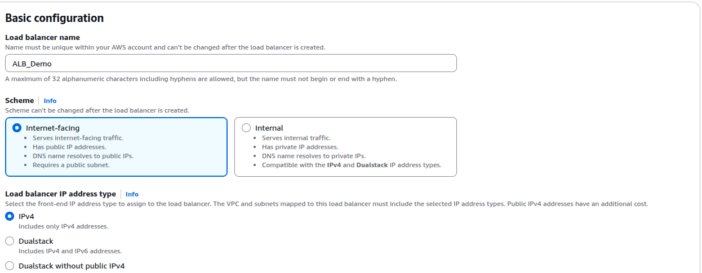
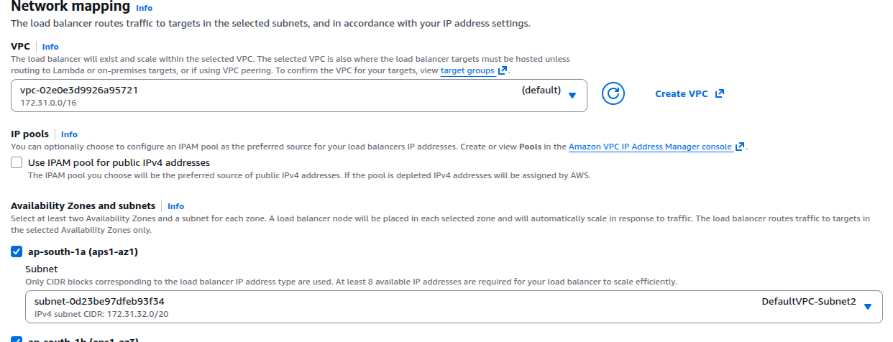
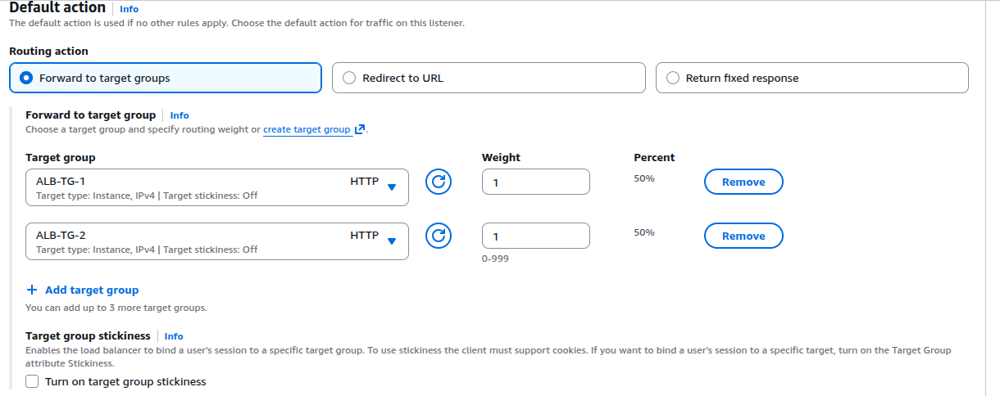
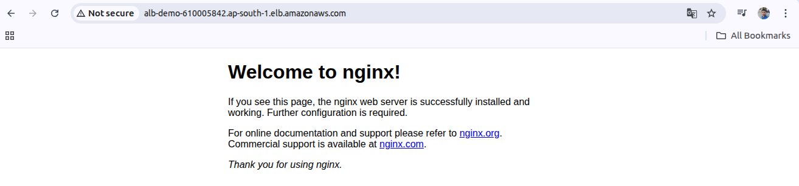
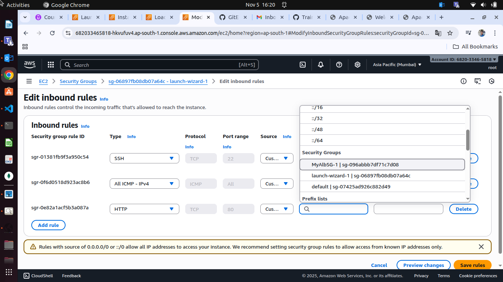

| **Feature**       | **Application Load Balancer (ALB)**           | **Network Load Balancer (NLB)**              | **Gateway Load Balancer (GWLB)**                         | **Classic Load Balancer (CLB)**  |
| ----------------- | --------------------------------------------- | -------------------------------------------- | -------------------------------------------------------- | -------------------------------- |
| **OSI Layer**     | Layer 7 (Application)                         | Layer 4 (Transport)                          | Layer 3 (Network/Gateway)                                | Layer 4 & 7 (Legacy)             |
| **Protocols**     | HTTP, HTTPS, gRPC, WebSockets                 | TCP, TLS, UDP                                | IP Protocol (GENEVE)                                     | HTTP, HTTPS, TCP, SSL/TLS        |
| **Routing Logic** | Content-based (URL, Host, Header, Query)      | Flow/Connection-based (IP & Port)            | Packet-based (Routes to the next hop virtual appliance)  | Basic request/connection         |
| **Performance**   | High                                          | Extreme Performance / Ultra-low latency      | High                                                     | Moderate (Legacy)                |
| **Key Feature**   | Advanced request routing, Lambda targets, SNI | Static IP per AZ, preserves Client Source IP | Transparent Network Gateway, scales 3rd party appliances | Legacy (Deprecated for new apps) |
| **Target Types**  | EC2, IP, Lambda, ALB                          | EC2, IP                                      | EC2, IP                                                  | EC2 Only (Instance ID)           |

Application Load Balancer
---

- Fixed hostname LB URL.
- The application server don't see the IP of the client iirectly.
  - The true IP of the client is **inserted in the header X-Forwarded-For**.
  - We can also get Port (X-Forwarded-Port) and proto (X-Forwarded-Proto)

Create ALB
---

- Create 2 diff EC2.
- Create 2 diff Target group - where your backend will run as EC2.

- Create ALB > Choose Internet-Facing

- Choose your VPC and AZs. Atleast 2 AZs are required for LB.

- Create Security Group for your ALB Backends.

- Create Listeners and Routing
- Listeners will define your Target group have to used for which Route based , URL based applications.

- After added target group into listeners, Click on Create LB.

- Wait for 2 minutes to get Provisioned this LB.

- You will get LB URL to hit your backends.

 Just hit this URL.

- App1

- App2

**NOTE** - This backends are accessible via ALB Security Group and Instances itslelf's Security group.
**More Secure Your Backends** - To accessible your backends via only LB URL, Just Use this LB URL into your Instance's Security Group.

Network Load Balancer
---

- This LB is work for Receive request 