CloudWatch Metrics
---

- CloudWatch provides metrics foe all aws services
- Metrics (CPU, Memory etc)

- Dimensions is an attribute of a metrics (instance id, env)

- Upto 30 Dims / metrics

**CloudWatch Logs** - Can send logs to:

- S3 bucket,
- Kinesis Data Streams,
- Kinesis Data Firehose,
- AWS Lambda,
- OpenSearch.

**Logs are encrypted by default**.

CloudWatch Logs - Source of Logs collections
---

- SDK, Cloudwatch log agent, Cloudwatch unified agent.
- ECS - Collection from containers.
- Beanstalks -  collections of logs from apps.
- AWS Lambda - collecton from functions logs
- API Gateway
- Route53: Log DNS queries

CloudWatch logs insights
---

- Allow to search and analyze log data stored in CloudWatch logs.

- Ex. find a IP inside log by make query, Find "ERROR" logs.

Cloudwatch logs subscriptions
---

- Get a real-time log events from cloudwatch logs for processing and analysis.

- Send to kinesis data streams, Lambda etc

- Subscription Filter - filter which logs are events delivered to your dest like S3 etc.

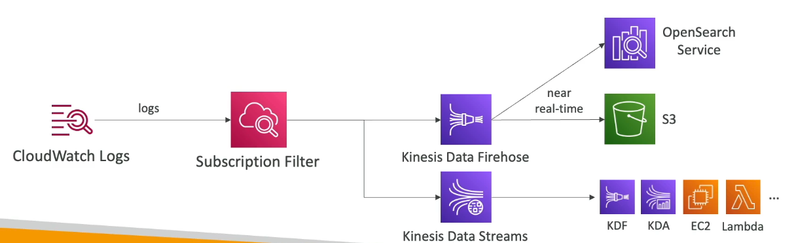

CloudWatch Live Tail
---

- Get real time live logs from log group to log streams.

log streams - Which part of log you want to see or filter
Ex. Container logs - Select container id.

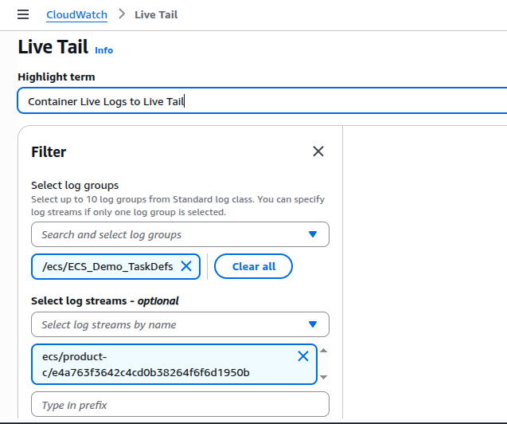

- This is Live logs received by live tails.

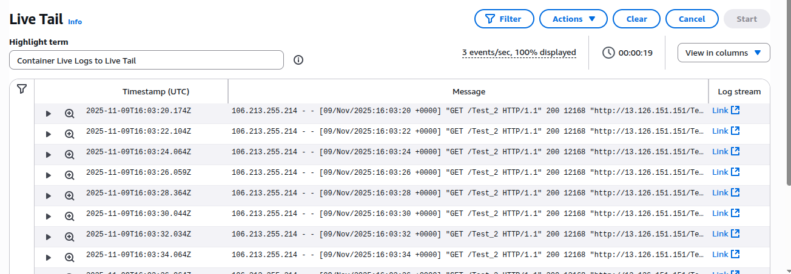

CloudWatch Logs for EC2 
---

- Bydefault, EC2 doesn't sends EC2's logs to cloudwatch.

- We have to start **Cloudwatch Agetn** in your EC2 to push the log files you wants.

- To send EC2 logs via **CloudWatch Agent** to CloudWatch - EC2 have **IAM Roles/Instance Profile** to have permisson to send the logs to cloudwatch.

- **CloudWatch Agent** can also setup for **On-Premises**.

CloudWatcb Logs Agent & Unified Agents
---

- **CloudWatch Logs Agent**
  - Old version of the agent
  - Can only send to cloudwatch logs

- **CloudWatch Unified Agent**
  - Collect additional system-level metrics such as RAM, Processes etc.

  - Collect logs to send to CloudWatch Logs.

**CloudWatch Unified Agent - Metrics**
---

- If you installed it on your server, You can collect Metrics like CPU(active, guest, idle, system, user, steal).

- Disk Metrics (free, used , total, cached),

- Netstate (No. of TCP, UDP connections, net pkg bytes)

- Processes (total, dead, bloqued, idle, running, sleep)

CloudWatch Alarm Targets
---

- Stop, Reboot, Terminate, Recover an EC2 Instance.
- Trigger Auto Scaling Actions
- Send notifications to SNS

- CloudWatch Alarms are on a `single metrics`.

- **Composite Alarms** are monitoring the states of multiple other alarms. It will combine all other Alarms.

- You can use AND and OR conditions in Alarms.

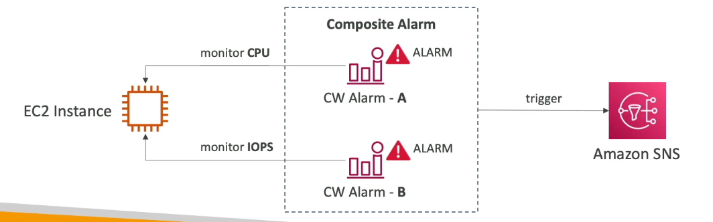

- CW Alarm A - High CPU Utilizations.
- CW Alarm B - High IOPS

If both are true then it will trigger an another alarm SNS which is called Composite Alarm.

EventBridge
---

## What It Is
**Amazon EventBridge** is a serverless AWS service that helps you **react automatically when something happens** — in AWS, in your own applications, or even in third-party tools.

Think of it as a **smart “event router”** that listens for *events* (like “something happened”) and then sends those events to the right *target* (like Lambda, SQS, or SNS).

## Concept Overview
**Event happens → EventBridge catches it → triggers something**

### Example
- When a file is uploaded to **S3**, EventBridge triggers a **Lambda** function to process it.  
- When **IAM root user** logs in, EventBridge sends an alert via **SNS**.

## Types of Events

1. **Scheduled Events (Cron jobs)**  
   - Run tasks at fixed times (e.g., “Every hour, trigger this Lambda”).  
   - Perfect for periodic automation such as backups or reports.

2. **Event Patterns (Reaction to something)**  
   - Reacts instantly when an AWS service action happens.  
   - Example: “When EC2 stops, send a message to SQS.”

## Event Flow

1. **Sources (Where events come from)**  
   - AWS Services → EC2, S3, CloudTrail, CodeBuild, etc.  
   - Partner Apps → Datadog, Zendesk, Auth0, etc.  
   - Custom Apps → Your own applications.

2. **EventBridge (The Router)**  
   - Uses **rules** to filter and decide which events to react to.  
   - Forwards them to the right **targets**.

3. **Targets (What gets triggered)**  
   - AWS Lambda  
   - SNS topic  
   - SQS queue  
   - Step Functions  
   - ECS Task  
   - CodePipeline / CodeBuild  
   - EC2 (start/stop)  
   - Many more...

## Event Buses

| Type | Description | Example |
|------|--------------|---------|
| **Default Event Bus** | Receives events from AWS services within your account. | S3 → Lambda trigger |
| **Partner Event Bus** | Receives events from external SaaS partners. | Datadog, Zendesk, Auth0 |
| **Custom Event Bus** | You create it for your own applications to send events. | Your App → EventBridge → Lambda |

## Key Features

### Schema Registry  
- EventBridge detects the structure of events automatically (JSON format).  
- Lets developers generate code that understands event data.

### Archive & Replay  
- Store (archive) events for later debugging or testing.  
- Replay past events if you fix a bug in your Lambda or app.

### Resource-Based Policies  
- Control which AWS accounts or regions can send/receive events.  
- Useful for **centralized EventBridge setups** across multiple AWS accounts.

## Summary Table

| Feature | What It Does |
|----------|---------------|
| **Schedules (cron)** | Run actions at specific times. |
| **Event patterns** | React to real-time AWS or app activity. |
| **Multiple event buses** | Separate AWS, partner, and custom app events. |
| **Schema registry** | Understand event structure automatically. |
| **Archive & replay** | Debug or test old events easily. |
| **Resource policies** | Manage cross-account permissions. |

## Simple Analogy

**EventBridge is like a post office:**
- **Sources** = people sending letters (events)  
- **EventBridge** = post office that sorts mail (filters & routes events)  
- **Targets** = recipients (Lambda, SNS, etc.)

## Example Use Case

> You want to be notified when someone uses the root account.

1. **IAM root login event** → sent to EventBridge  
2. **EventBridge rule** detects the pattern  
3. **EventBridge** sends message to **SNS topic**  
4. **SNS** emails you the alert  

Instant security alert without manual checks! 

Create EventBridge for Change Instance Status
---

- Create Event Rule & Choose Rule type is event patterns.

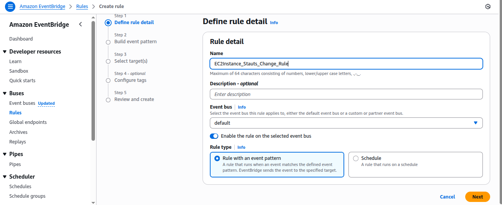

- Choose Event Source as `AWS Event or EventBridge`.

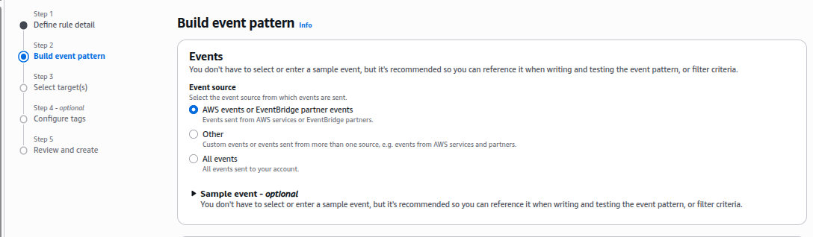

- Choose Event Pattern as `Use Pattern form`.

- Event Shorce - AWS Service > EC2.

- Event Type - `EC2 Instance state-change notifications`.

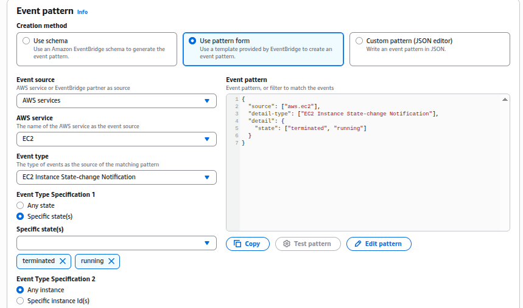

- Choose Event Type - `Specific state` - [Terminating, Running].

- Event Type - `Any Instances or Specific Instances`.

- Choose Target as SNS

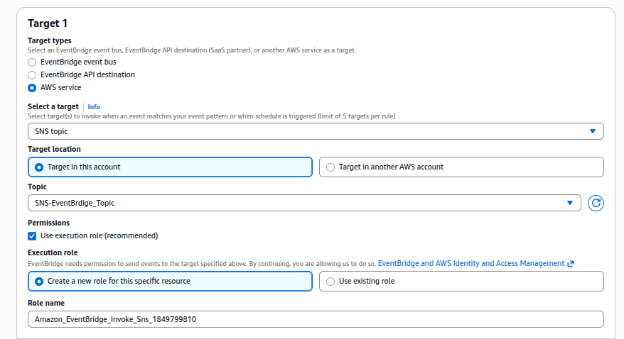

- Create SNS Topic and choose it as target.

- Review & Create.

- Try to Create New Instance. It will Notify on SMS.

CloudWatch Container Insights
---

- collect, aggregate, summarize metrics and logs from containers.

- Ex. Collect metrics & logs from EKS, ECS, Fargate, Kubernetes platforms on EC2.

- It uses **Containeriezed version of cloudwatch agent** to discvoer containers.

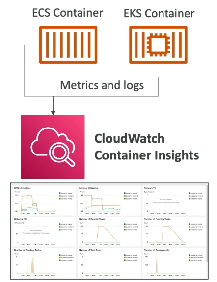

CloudWatch Lambda Insights
---

- Monitoring and troubleshooting sol for serverless apps running on AWS Lambda.

- Collects, aggregates and summarizes system-level metrics including CPU, memory, disk and network.

CloudWatch Contirbutor Insights
---

- This helps you to find Top Talkers Networks to cause permforming issue like Creating High Traffic Networks to cause High CPU Utilized etc.

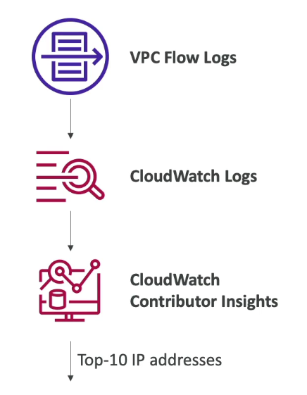

CloudWatch Applications Insights
---

- Provides automated dashboards that show potential problems with monitored applications, to help isolate ongoing issues.

- Your apps runs on EC2 with selected technology only  like (Java, .NET, Microsoft IIS Web Server, db) and Your apps also uses other aws services like (Labmda, SQS, DynamoDB, S3 bucket, EBS, RDS, ELB, ASG, SNS) and in case your apps having some issues , `Applications Insights` will create a automated dashboard.

- Finding and alerts are sent to EventBridge and SSM OpsCenters.

AWS CloudTrail
---

- Provides gov, compliance and audit for your aws account.
- CloudTrail is enabled bydefault.

- It will get an history of event / API calls made within your accounts.

- You can put/send logs from CloudTrail to CloudWatch logs or S3.

- Ex. someone has deleted a resource, Investigate by `CloudTrail`.

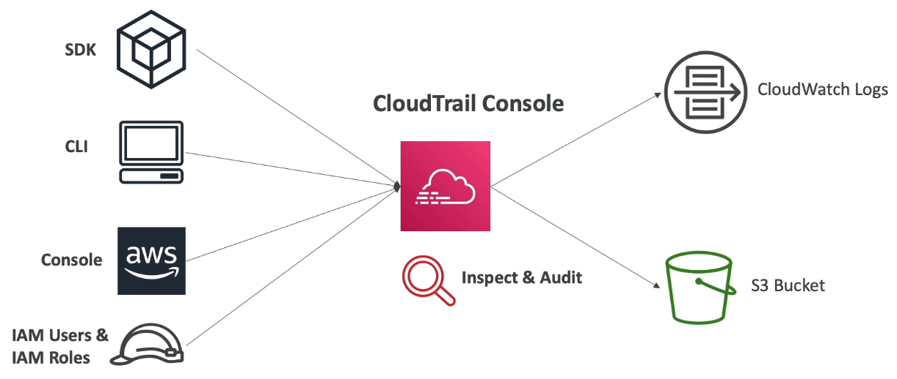

CloudTrail Insights
---

- It enable to **Detect unusal activity** in your account.

  - Inaccurate resource Provisoning
  - Hitting service limits.
  - Bursts of AWS IAM actions.
  - Gaps in periodic maintenance activity.

- CloudTrail Insights analyze normal manage events to create a baselines.

- Ex. Management Events/Activity happens continuously and collcted by `cloudtrail insights`.

- cloudtrail insights will generate `Insights Events` and will be send to `cloudtrail console`, `S3 Bucket`, `EventBridge Events`.

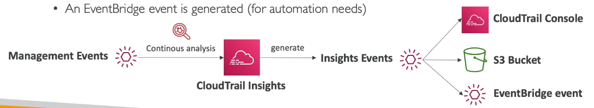

Integrate EventBridge with CloudTrail

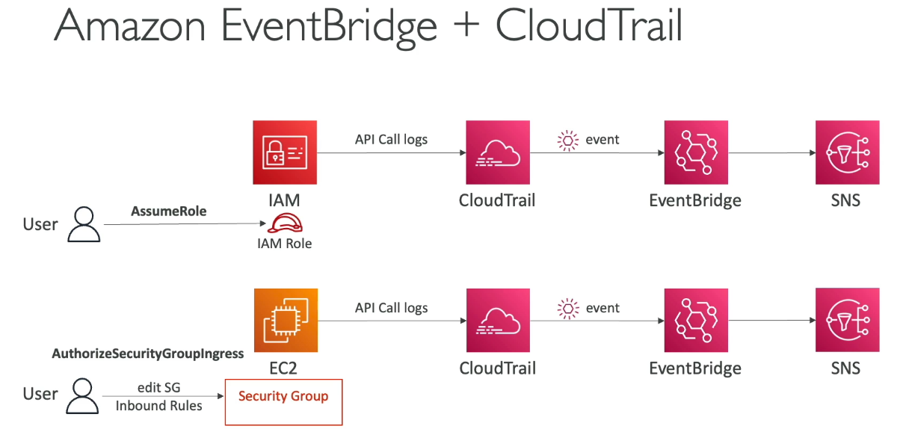

# AWS Config – Easy Concept Guide

## What Is AWS Config?

**AWS Config** is like a **security camera** for your AWS account.  
It **records the configuration** of all your resources (EC2, S3, IAM, etc.)  
and **checks if they follow your rules** for security and compliance.

## Why Use AWS Config?

- Track **what changed**, **who changed it**, and **when**.  
- Check if AWS resources follow your **security rules**.  
- Get **alerts** or **auto-fix** problems when resources become non-compliant.  
- Keep **audit history** for compliance or troubleshooting.

## How It Works (Step by Step)

1. **Enable AWS Config** → starts recording all resource changes.  
2. **Create Config Rules** → define what “compliant” means.  
3. **AWS Config watches changes** and checks each rule.  
4. **It marks resources** as **Compliant** or **Non-compliant**.  
5. **Send notifications** via SNS or EventBridge when rules fail.  
6. (Optional) **Auto-remediate** non-compliance using SSM or Lambda.

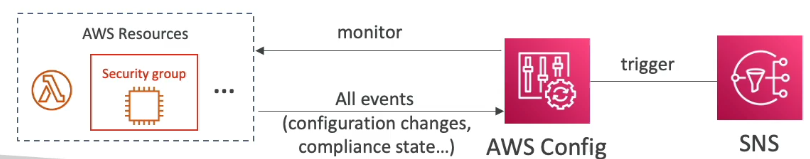

## Types of Config Rules

| Type | Description | Example |
|------|--------------|----------|
| **Managed Rules** | Ready-made rules from AWS | Check if S3 buckets are public |
| **Custom Rules** | Your own rule using Lambda | Ensure EC2 instance type = t2.micro |

## Rule Triggers

| Type | When It Runs | Example |
|------|---------------|----------|
| **Change Triggered** | When a resource changes | When an S3 bucket is modified |
| **Periodic** | At regular intervals | Every 6 hours check IAM password policy |

## Auto Remediation (Self-Healing)

If a rule fails, AWS Config can automatically fix it.

Examples:
- Disable **old IAM keys**  
- Remove **public S3 bucket access**  
- Change **EBS volume type**

You can use:
- **AWS Managed SSM Documents**, or  
- **Your own Lambda function**

## Notifications

When a resource becomes non-compliant:
- **SNS** → Send Email, SMS, or Slack alert.  
- **EventBridge** → Trigger Lambda or workflows automatically.

## Multi-Region Setup

- AWS Config is **regional**, so enable it in every region you care about.  
- Use **Aggregators** to combine results from all regions and accounts.

## Pricing

| Item | Cost (Approx.) |
|------|----------------|
| Per Configuration Item Recorded | $0.003 |
| Per Config Rule Evaluation | $0.001 |

Tip: Enable only for key services to avoid high costs.

## Integrations

| Service | Purpose |
|----------|----------|
| **CloudTrail** | See API calls that changed resources |
| **Athena** | Query historical configuration data |
| **S3** | Stores configuration history |
| **SNS / EventBridge** | Sends alerts or triggers automation |

## Summary

| Feature | What It Does |
|----------|---------------|
| **Tracks resources** | Records AWS configuration changes |
| **Compliance rules** | Checks if resources meet your policies |
| **Managed rules** | Ready-made by AWS |
| **Custom rules** | Built by you using Lambda |
| **Auto remediation** | Fix non-compliance automatically |
| **Notifications** | SNS or EventBridge |
| **Scope** | Per region |
| **Does not block actions** | Monitors only, doesn’t deny |
| **Cost** | Per record + rule evaluation |

## Real-Life Example

You create this rule:  
`“No S3 bucket should allow public access.”`

### What happens:
1. Someone makes a bucket public.
2. AWS Config marks it **Non-compliant**  
3. AWS sends you an **SNS email alert**  
4. (Optional) Config runs an **SSM automation** that removes public access

AWS Config HandsOn

- Create config > Choose All resource type or Specific resource type.

- Choose Recording freq. as `Continuouse` or `Daily recording`.

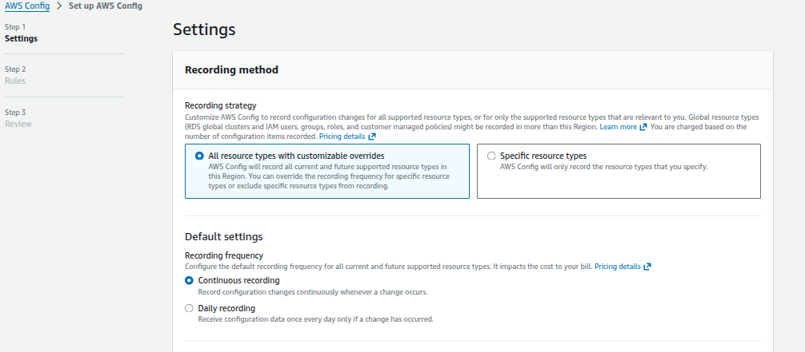

- Click on `Create AWS Config service-linked role` or choose `custom role`.

- Create S3 Bucket or choose existing bucket to stores the all data collected by aws config.

- Review & Create.

AWS Config
---

- Create Config rule > Select rule type is `AWS managed rule`.

- Select rule for Restrict to any OPEN PORTS in SG.

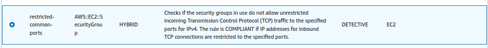

- Give rule name and Select for which resource type you want to apply config rule.

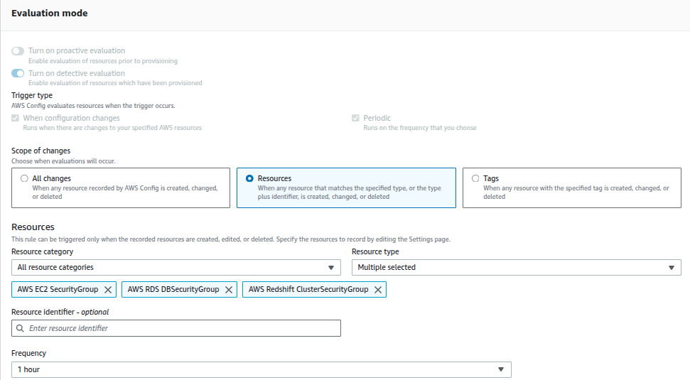

- Review & Create.

- Now wait for minutes and check dashboard for NonComplaints.

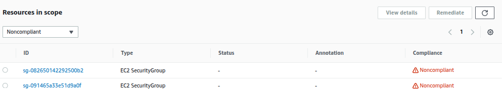

- You can see here 80 and 443 are opens.

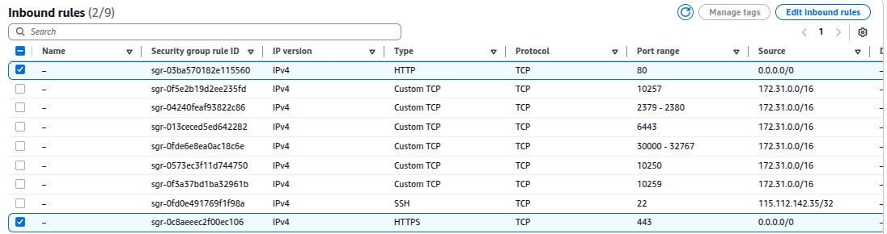

- After modify sg rule you can see that into Resource Timelines.

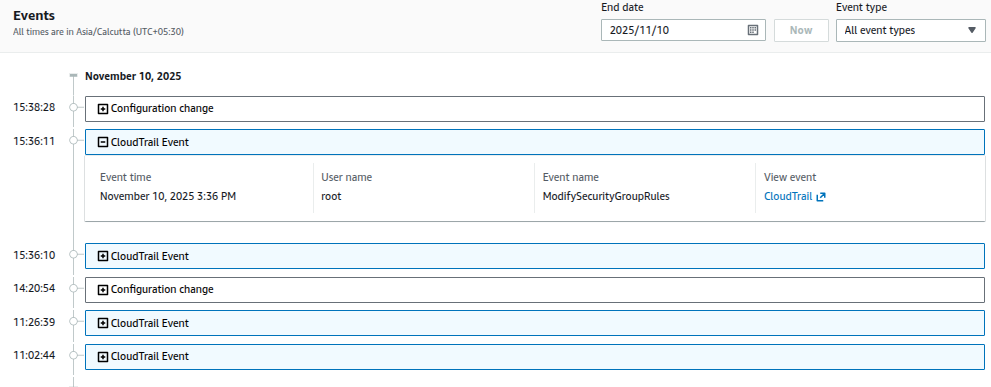