# AWS RDS (Relational Database Service)

## Overview

- **Amazon RDS (Relational Database Service)** is a **fully managed database service** by AWS for databases that use **SQL** as their query language.  
It simplifies setup, operation, and scaling of databases in the cloud — AWS handles provisioning, patching, backups, and recovery.

## Supported Database Engines
RDS supports several SQL-based engines:

1. **PostgreSQL**  
2. **MySQL**  
3. **MariaDB**  
4. **Oracle**  
5. **Microsoft SQL Server**  
6. **IBM DB2**  
7. **Amazon Aurora** *(AWS proprietary engine with superior performance)*

## RDS Storage Auto Scaling

Automatically increases the allocated **storage capacity** of your RDS database when usage grows close to full capacity — **no downtime or manual action required**.

### How It Works
- You set a **maximum storage limit**.
- Auto-scaling triggers when:
  - Free storage < **10%** of allocated capacity,
  - The condition lasts **more than 5 minutes**, and
  - **6 hours** have passed since the last scale-up event.

### Benefits
- Prevents storage-related outages  
- Ideal for **unpredictable workloads**  
- Works with **all RDS engines**

## Key Advantages of AWS RDS
- Fully managed by AWS (patching, backups, failover)
- High availability (Multi-AZ replication)
- Easy performance monitoring
- Automatic scaling (compute and storage)
- Reliable EBS-backed storage
- No manual maintenance or SSH access required


# AWS RDS – Read Replicas vs Multi-AZ Deployments

## Overview
In AWS RDS, **Read Replicas** and **Multi-AZ** both create multiple database instances — but they serve **completely different purposes**.

| Feature | Read Replica | Multi-AZ |
|----------|---------------|-----------|
| **Purpose** | Scale **read performance** | Provide **high availability** & **disaster recovery** |
| **Replication Type** | **Asynchronous** | **Synchronous** |
| **Writes Supported?** | ❌ (Read-only) | ✅ (writes handled by master only) |
| **Used For** | Reporting, analytics, heavy read workloads | Failover, business continuity |
| **Failover Support** | Manual promotion | Automatic failover |
| **Scaling Type** | Horizontal (read scaling) | Redundancy (no scaling benefit) |

## Read Replicas

### Definition
**Read Replicas** are **read-only copies** of your primary RDS database.  
They use **asynchronous replication** — meaning data is **eventually consistent**.

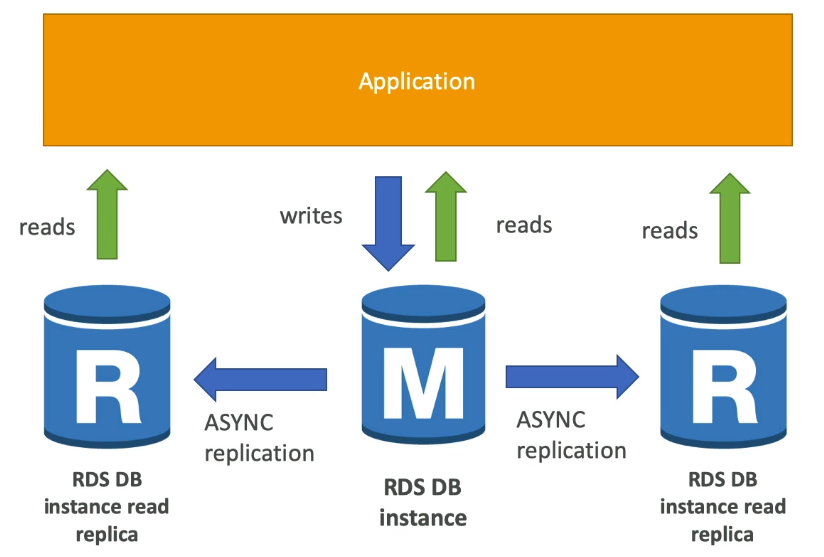

### Purpose
Used to **scale read operations** without affecting the performance of the primary database.

### Key Characteristics
- Up to **15 Read Replicas** per database.
- Can exist:
  - In the **same AZ**,  
  - In a **different AZ** (cross-AZ), or  
  - In a **different region** (cross-region).
- Replication is **asynchronous** → slight delay between master and replica.
- Each replica can be **promoted** to become its own standalone database.

### Use Case Example
**Scenario:**  
Your production DB handles user transactions.  
A new analytics team wants to run **reporting queries**.  

**Solution:**  
- Create a **Read Replica**.
- The reporting app queries the replica (read-only).  
- Production workload remains unaffected.

**Note:**  
Read Replicas only support **SELECT** statements (reads).  
No **INSERT**, **UPDATE**, or **DELETE** allowed.

### Networking Costs
- **Same Region (cross-AZ)** replication traffic is **free** (AWS managed service benefit).  
- **Cross-Region** replication incurs **data transfer costs**.

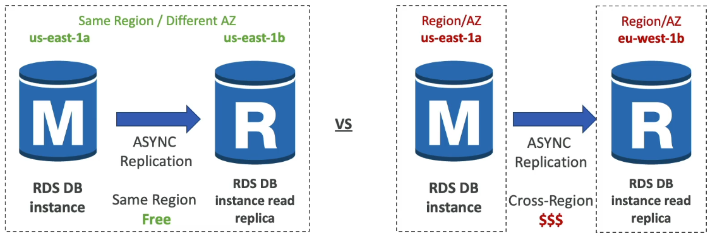

### Promotion
You can **promote** a Read Replica into a standalone database:
- Becomes writable.

- Stops receiving replication updates.

## Multi-AZ Deployments

### Definition
**Multi-AZ (Availability Zone)** provides **high availability and failover** for RDS databases.  
It creates a **synchronously replicated standby instance** in a different AZ.

### How It Works
- The **primary (master)** DB is in **AZ-A**.
- A **standby** DB is in **AZ-B**.
- All writes are **synchronously replicated**.
- Both share a **single DNS endpoint**.
- In case of failure, RDS **automatically fails over** to the standby.

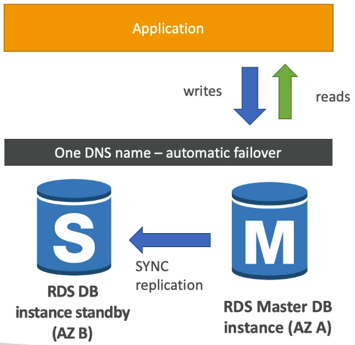

### Purpose
- Ensures **disaster recovery**.
- Maintains **high availability**.
- Provides **automatic failover** with **zero manual intervention**.

### Key Points
- Standby DB is **not readable** (used only for failover).
- **Not used for scaling** — only for redundancy.
- Failover happens automatically if:
  - Master AZ fails,
  - Network failure occurs, or
  - Storage/instance failure on master.


### Converting Single-AZ → Multi-AZ
- **Zero downtime operation**.
- Simply **modify** the RDS instance and enable Multi-AZ.
- AWS process behind the scenes:
  1. Takes a **snapshot** of the primary DB.
  2. Restores it into a new **standby** DB.
  3. Establishes **synchronous replication**.
  4. Database stays online during the process.

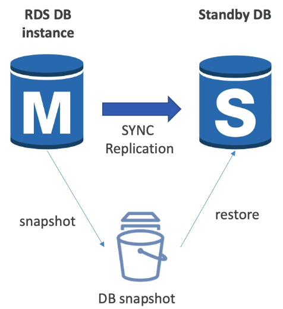

- This is cloudformation code to create single az mysql db.

[RDS_CF](https://github.com/GitEic-Bhavin/Training_and_UpSkill/blob/master/CloudFormation_Basic/RDS.yml)

RDS is created

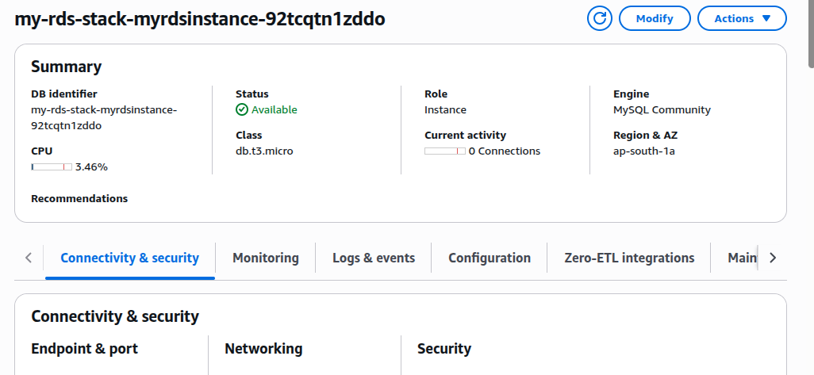

- Now installed GUI of Sql Electrons to connect our RDS DB.

- Give your db's credentials and test your connections.

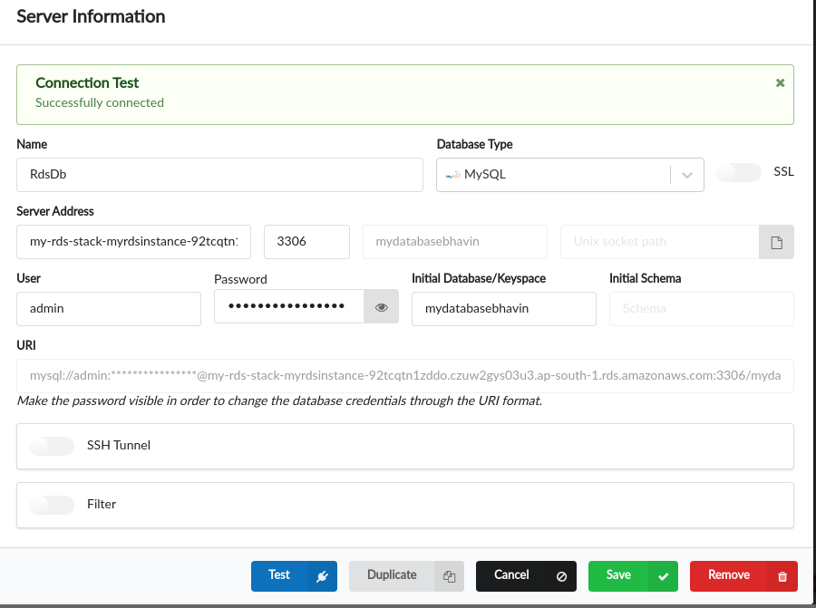

- Create table and insert data

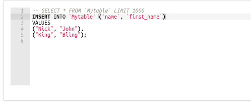

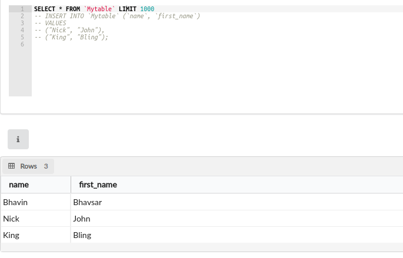


# Amazon Aurora – AWS Database Overview

## Overview
Amazon **Aurora** is a **cloud-native, fully managed relational database** built by AWS.  
It is **compatible with MySQL and PostgreSQL**, providing **higher performance**, **auto-scaling storage**, and **high availability** — all with minimal administrative overhead.

## Key Highlights
- **5× faster** than MySQL on RDS  
- **3× faster** than PostgreSQL on RDS  
- **Auto-scales storage** from **10 GB to 256 TB**  
- **Fully managed** – AWS handles patching, backups, and replication  
- Ideal for **high-performance**, **mission-critical** workloads  

## Aurora Architecture
Aurora uses a **cluster-based design**:

- **Primary (Writer) Instance** – handles **write** operations  
- **Up to 15 Read Replicas** – handle **read** queries  
- **Shared Storage Layer** – data is replicated across **3 Availability Zones (AZs)**  

### Data Replication
- 6 copies of data (2 per AZ)  
- Aurora needs:
  - 4 out of 6 copies for writes  
  - 3 out of 6 copies for reads  
- **Self-healing storage** and **auto-expanding** volumes  

## High Availability (HA)
- Aurora is built for **continuous availability**:

- Multi-AZ architecture (3 AZs by default)  
- **Automatic failover** to promote read replica as new master (≈30 seconds)  
- **Zero-downtime patching and upgrades**  
- **Self-healing storage** for data integrity  


## Scalability
- **Compute Scaling:** Up to 15 read replicas with auto-scaling support  
- **Storage Scaling:** Automatically grows up to 256 TB  


## Backup and Recovery
- Continuous **backups to Amazon S3**  
- **Point-in-time recovery (PITR)** supported  
- **Backtrack:** Instantly restore database to a previous time without restoring from a snapshot  

## Cross-Region Capabilities
- **Cross-region read replicas** for global read scaling  
- **Disaster recovery (DR)** with minimal replication lag  

## Aurora vs RDS

| Feature | Amazon RDS | Amazon Aurora |
|----------|-------------|----------------|
| Performance | Standard | 3–5× faster |
| Replication Lag | Seconds | <10 ms |
| Read Replicas | 5 max | 15 max |
| Failover Time | 60–120 sec | <30 sec |
| Storage Scaling | Manual | Auto (10 GB–256 TB) |
| Backtrack | ❌ | ✅ |
| Multi-AZ | Optional | Built-in |
| Cost | Lower | ~20% higher (but more efficient) |


# Aurora – Advanced Concepts

This document covers the **advanced Aurora features** you need to understand for AWS certification exams and practical usage.

## 1. Replica Auto Scaling

### Concept:
- Automatically **adds or removes Aurora Read Replicas** based on **CPU utilization or load metrics**.
- When read traffic increases, Aurora adds more replicas automatically.
- The **Reader Endpoint** automatically updates to include the new replicas.


### Purpose:
- Balance **read workload** dynamically.
- Maintain consistent performance during **high read traffic**.

## 2. Custom Endpoints

### Concept:
- Create **named subsets** of Aurora replicas for specific workloads.
- Example setup:
  - `reporting-endpoint` → connects to large instances (e.g., `db.r5.2xlarge`)
  - `app-endpoint` → connects to smaller replicas (e.g., `db.r3.large`)
- Reader endpoint still exists but is typically **not used** when custom endpoints are defined.

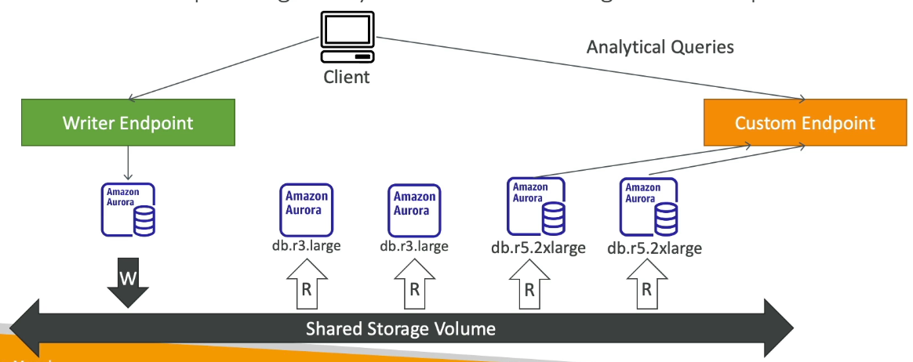

### Purpose:
- Route queries to the **right replica group** based on workload.
- Improve performance for **analytics**, **reporting**, or **transactional** workloads.

## 3. Aurora Serverless

### Concept:
- Fully **on-demand**, **auto-scaling** version of Aurora.
- Database **starts, stops, and scales automatically** based on actual usage.
- Uses a **proxy fleet** that manages database connections dynamically.

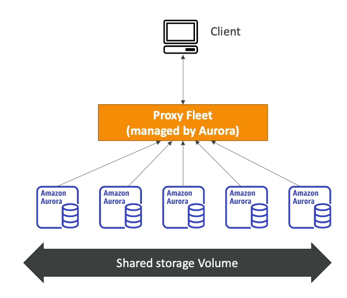

### Billing:
- Pay **per second** of Aurora instance usage.

### Purpose:
- Ideal for **infrequent, intermittent, or unpredictable workloads**.
- Eliminates **capacity planning** and reduces idle costs.

## 4. Aurora Global Database

### Concept:
- Aurora setup across **multiple AWS regions** for **global availability** and **disaster recovery (DR)**.

### Structure:
- **1 Primary Region** → Handles all **reads/writes**.
- **Up to 10 Secondary Regions** → **Read-only** replicas.
- **Up to 16 Read Replicas per secondary region**.

### Performance:
- **Replication lag**: < 1 second between regions.
- **Failover time (RTO)**: < 1 minute to promote another region.

### Purpose:
- Provide **low-latency reads** globally.
- Enable **cross-region disaster recovery**.

## 5. Aurora Machine Learning (Aurora ML)

### Concept:
- Aurora integrates directly with **AWS ML services** to run predictions via **SQL queries**.
- Supports:
  - **Amazon SageMaker** → use your custom ML models.
  - **Amazon Comprehend** → for sentiment analysis and NLP.

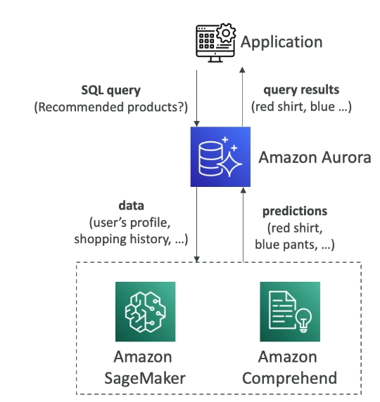

### Example:
```sql
SELECT ml_predict('fraud_model', transaction_data)
FROM payments;
```

RDS Proxy
---

# Amazon RDS Proxy – Complete Overview

- **Amazon RDS Proxy** acts as a **middle layer** between your **application** and your **RDS database**.

- It efficiently manages database connections — think of it like a **traffic controller** that balances and reuses connections between your app and database.

## Why We Use RDS Proxy

### 1. Connection Pooling
- Normally, every app request opens a **new DB connection**, which can **overload the database**.
- RDS Proxy **reuses existing connections** instead of creating new ones.
- This saves **CPU, memory**, and prevents **timeouts**.

** Example:**
If 1000 users hit your app → instead of 1000 DB connections,  
**RDS Proxy might only keep 50 active** and reuse them efficiently.

---

### 2. Faster Failover
- When the main database fails, RDS automatically switches to a **standby DB**.
- Normally, this causes downtime during reconnection.
- With RDS Proxy:
  - The proxy automatically detects the failover.
  - Reconnects to the new DB.
  - Your application **doesn’t notice any downtime**.

Failover becomes **up to 66% faster**.

---

### 3. More Secure
- RDS Proxy **never exposes a public endpoint** — it stays **inside your VPC**.
- Supports **IAM Authentication**, allowing access via AWS IAM users instead of static credentials.
- **Stores DB credentials in AWS Secrets Manager**, so you never hardcode passwords.

---

### 4. No Code Change Needed
You don’t need to modify your application code.

Just update your connection string to use the **Proxy endpoint** instead of the **RDS endpoint**.

**Example Flow:**
`App → RDS Proxy → RDS Database`

## Summary Table

| Feature | Without RDS Proxy | With RDS Proxy |
|----------|------------------|----------------|
| Connection Handling | Each app request creates a new DB connection | Proxy reuses existing connections |
| Failover Time | Slower reconnection during DB failover | 66% faster automatic reconnection |
| Security | Direct DB access, hardcoded credentials | Uses IAM Auth + Secrets Manager |
| Code Changes | Requires updates to handle failover | No app code changes needed |
| Public Exposure | Possible if DB is public | Proxy stays private in VPC |

## When to Use RDS Proxy
Use RDS Proxy when:
- Your app has **high concurrent connections**.
- You use **Lambda or Fargate** (where DB connections can spike quickly).
- You need **faster failover and higher availability**.
- You want to **centralize connection security** using IAM and Secrets Manager.
