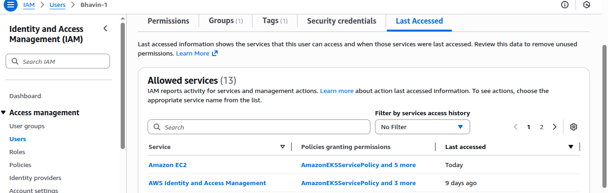
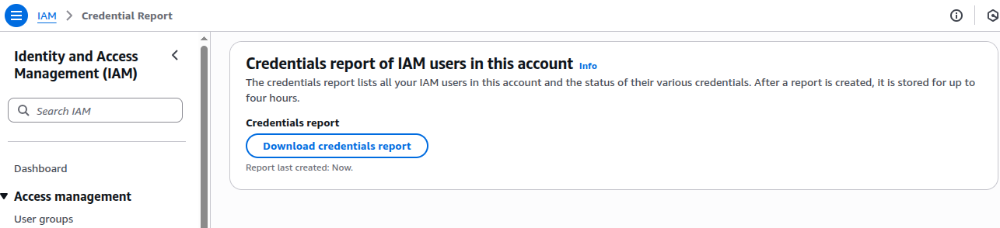

IAM Security Tools
---

- AWS offers several security tools to enhance IAM security and protect against unauthorized access:

    1. `IAM Access Advisor`: Access advisor shows the service permissions granteed to a user and when those services were last accessed.

    - Go to IAM > Users > Choose IAM User > Last Accessed.

    

    2. `IAM Credential Report`: Provides a detailed list of all users and their associated credentials, helping administrators monitor and manage IAM users effectively.

    - Go to IAM > Access Reports > Credential Reports > Click on `Download credential report`.
    
    

EC2 Instance Type
---

1. Memory Optimize

- Fast performance for workloads that process large data sets in memory.

**Use case**
 
  - High performance, db.
  - Distributed web scale cache stores
  - In-memory db optimized for BI.

2. Storage Optimize

- Great for storage-intensive tasks that require high read and write access to large data sets.

**Use case**
 
  - High Freq online transaction processing systems
  - Relational & NoSQL DB.

3. Compute Optimize

- Great for compute-intensive tasks that require high performance processor

**Use case**

  - Batch Processing wl
  - Media transcoding
  - High performance Computing
  - Dedicated gaming servers
  - Machine learning

# Amazon EC2 Cost Optimization Options

- You can use the following options to **optimize your costs** for Amazon EC2:

| **Option** | **Description** |
|-------------|-----------------|
| **On-Demand Instances** | Pay **by the second** for the instances that you launch. |
| **Savings Plans** | Reduce EC2 costs by committing to a **consistent amount of usage (USD/hour)** for **1 or 3 years**. |
| **Reserved Instances** | Commit to a **specific instance configuration** (type and Region) for **1 or 3 years** to reduce costs. |
| **Spot Instances** | Request **unused EC2 capacity** at significantly reduced prices (up to 90% off). |
| **Dedicated Hosts** | Pay for a **physical host** dedicated to your use; bring your own software licenses to save costs. |
| **Dedicated Instances** | Pay **by the hour** for instances running on **single-tenant hardware**. |
| **Capacity Reservations** | **Reserve capacity** in a specific **Availability Zone** to ensure instance availability. |

# AWS EC2 Spot Instances and Spot Fleet

## Spot Instances

### Overview
Spot Instances let you use **unused EC2 capacity** at **much lower cost** — up to 90% cheaper than On-Demand pricing.

### Key Concepts
1. **Low-Cost Compute**
   - Uses AWS’s spare capacity at discounted rates.
   - You pay only for the time your instance runs.

2. **Interruptible**
   - AWS can stop or terminate your instance when it needs capacity back.
   - You get a 2-minute warning before interruption.

3. **Best for Flexible Workloads**
   - Ideal for batch jobs, testing, data analysis, and background tasks.
   - Not recommended for critical or long-running applications.

4. **Self-Managed**
   - You launch and manage Spot Instances yourself.
   - You handle any interruptions or replacements manually.

---

## Spot Fleet

### Overview
A Spot Fleet is a **collection of Spot Instances** (and optionally On-Demand Instances) managed as a single group by AWS.  
It automatically launches and maintains your desired capacity at the lowest possible cost.

### Key Concepts
1. **Managed Group of Instances**
   - You set a target capacity (e.g., 100 vCPUs).
   - AWS automatically selects and runs the best mix of instances to meet it.

2. **Automatic Replacement**
   - If any Spot Instances are interrupted, AWS automatically launches new ones to maintain capacity.

3. **Mix of Instance Types and Zones**
   - Supports multiple instance types and Availability Zones for better cost and availability.

4. **Best for Scalable Workloads**
   - Ideal for large-scale, distributed, or auto-scaling workloads such as data processing clusters, containerized applications, and CI/CD systems.

---

## Summary

| Feature | Spot Instance | Spot Fleet |
|----------|----------------|-------------|
| **Definition** | Single discounted EC2 instance | Managed group of Spot (and optional On-Demand) instances |
| **Managed By** | You | AWS |
| **Interruption Handling** | Manual | Automatic |
| **Use Case** | Small, flexible workloads | Large-scale or auto-scaling workloads |
| **Cost Savings** | Up to 90% | Up to 90% with better stability |

---

## 💡 Quick Tip
Use **Spot Instances** for short-term or single jobs, and **Spot Fleet** when you need AWS to automatically manage and maintain capacity for bigger workloads.
