IAM Security Tools
---

- AWS offers several security tools to enhance IAM security and protect against unauthorized access:

    1. `IAM Access Advisor`: Access advisor shows the service permissions granteed to a user and when those services were last accessed.

    - Go to IAM > Users > Choose IAM User > Last Accessed.

    

    2. `IAM Credential Report`: Provides a detailed list of all users and their associated credentials, helping administrators monitor and manage IAM users effectively.

    - Go to IAM > Access Reports > Credential Reports > Click on `Download credential report`.
    
    

EC2 Instance Type
---

1. Memory Optimize

- Fast performance for workloads that process large data sets in memory.

**Use case**
 
  - High performance, db.
  - Distributed web scale cache stores
  - In-memory db optimized for BI.

2. Storage Optimize

- Great for storage-intensive tasks that require high read and write access to large data sets.

**Use case**
 
  - High Freq online transaction processing systems
  - Relational & NoSQL DB.

3. Compute Optimize

- Great for compute-intensive tasks that require high performance processor

**Use case**

  - Batch Processing wl
  - Media transcoding
  - High performance Computing
  - Dedicated gaming servers
  - Machine learning

# Amazon EC2 Cost Optimization Options

- You can use the following options to **optimize your costs** for Amazon EC2:

| **Option** | **Description** |
|-------------|-----------------|
| **On-Demand Instances** | Pay **by the second** for the instances that you launch. |
| **Savings Plans** | Reduce EC2 costs by committing to a **consistent amount of usage (USD/hour)** for **1 or 3 years**. |
| **Reserved Instances** | Commit to a **specific instance configuration** (type and Region) for **1 or 3 years** to reduce costs. |
| **Spot Instances** | Request **unused EC2 capacity** at significantly reduced prices (up to 90% off). |
| **Dedicated Hosts** | Pay for a **physical host** dedicated to your use; bring your own software licenses to save costs. |
| **Dedicated Instances** | Pay **by the hour** for instances running on **single-tenant hardware**. |
| **Capacity Reservations** | **Reserve capacity** in a specific **Availability Zone** to ensure instance availability. |

# AWS EC2 Spot Instances and Spot Fleet

## Spot Instances

### Overview
Spot Instances let you use **unused EC2 capacity** at **much lower cost** — up to 90% cheaper than On-Demand pricing.

### Key Concepts
1. **Low-Cost Compute**
   - Uses AWS’s spare capacity at discounted rates.
   - You pay only for the time your instance runs.

2. **Interruptible**
   - AWS can stop or terminate your instance when it needs capacity back.
   - You get a 2-minute warning before interruption.

3. **Best for Flexible Workloads**
   - Ideal for batch jobs, testing, data analysis, and background tasks.
   - Not recommended for critical or long-running applications.

4. **Self-Managed**
   - You launch and manage Spot Instances yourself.
   - You handle any interruptions or replacements manually.

---

## Spot Fleet

### Overview
A Spot Fleet is a **collection of Spot Instances** (and optionally On-Demand Instances) managed as a single group by AWS.  
It automatically launches and maintains your desired capacity at the lowest possible cost.

### Key Concepts
1. **Managed Group of Instances**
   - You set a target capacity (e.g., 100 vCPUs).
   - AWS automatically selects and runs the best mix of instances to meet it.

2. **Automatic Replacement**
   - If any Spot Instances are interrupted, AWS automatically launches new ones to maintain capacity.

3. **Mix of Instance Types and Zones**
   - Supports multiple instance types and Availability Zones for better cost and availability.

4. **Best for Scalable Workloads**
   - Ideal for large-scale, distributed, or auto-scaling workloads such as data processing clusters, containerized applications, and CI/CD systems.

---

## Summary

| Feature | Spot Instance | Spot Fleet |
|----------|----------------|-------------|
| **Definition** | Single discounted EC2 instance | Managed group of Spot (and optional On-Demand) instances |
| **Managed By** | You | AWS |
| **Interruption Handling** | Manual | Automatic |
| **Use Case** | Small, flexible workloads | Large-scale or auto-scaling workloads |
| **Cost Savings** | Up to 90% | Up to 90% with better stability |

Elastic IP
---

# AWS Networking Basics: Private IP, Public IP & Elastic IP

This document explains the core concepts of IP addressing in AWS, including the differences between **Private IP**, **Public IP**, and **Elastic IP**.

---

## 1. IPv4 vs IPv6

- **IPv4**
  - Format: `x.x.x.x` (e.g., `192.168.1.1`)
  - Total addresses: ~3.7 billion
  - Most commonly used in AWS
- **IPv6**
  - Format: Long alphanumeric string (e.g., `2001:db8::1`)
  - Supports a much larger number of devices
  - Used mainly in IoT and modern large-scale networks
  - AWS supports IPv6, but IPv4 remains standard for most setups

---

## 2. Private IP

- Used **inside private networks** (e.g., within a VPC or company LAN)
- **Not accessible from the internet**
- **Unique only within the same private network**
- **Reusable** across different networks (no global conflict)
- Defined by the following **reserved ranges**:
  - `10.0.0.0 – 10.255.255.255`
  - `172.16.0.0 – 172.31.255.255`
  - `192.168.0.0 – 192.168.255.255`
- Internet access requires:
  - **NAT Gateway** or **NAT Instance**
  - **Internet Gateway** for outbound traffic

---

## 3. Public IP

- Used for **internet communication**
- **Globally unique**
- Automatically assigned to an EC2 instance (if enabled)
- **Changes** each time you **stop/start** an instance
- Allows public access (SSH/HTTP) to EC2 instances
- Useful for:
  - Temporary or testing environments
  - Publicly accessible web servers

---

## 4. Elastic IP

- A **static public IPv4 address** owned by your AWS account
- **Does not change** when the instance is stopped or restarted
- Can be **reassigned** to another instance (useful for failover)
- Limited to **5 per AWS account** (can request more if needed)
- Best used when:
  - You need a **fixed public IP** for whitelisting or DNS mapping
- **Best Practice:** Avoid EIPs unless necessary  
  Use **Load Balancers** or **Route 53 DNS** for scalability and flexibility

---

## 5. EC2 Instance IP Behavior

When you launch an EC2 instance:

| IP Type     | Behavior | Description |
|--------------|-----------|-------------|
| **Private IP** | Stays same after reboot | Used for internal AWS VPC communication |
| **Public IP**  | Changes on stop/start | Used for internet access (temporary) |
| **Elastic IP** | Remains same always | Static public IP; reassignable |

You can SSH or HTTP into your EC2 instance using:
- **Public IP / Elastic IP** → From internet
- **Private IP** → Only via VPN or within same VPC

---

## 6. Summary Table

| Type         | Visibility           | Static? | Scope / Uniqueness | Typical Use Case |
|---------------|----------------------|----------|--------------------|------------------|
| **Private IP** | Internal (VPC only) | Yes | Unique within VPC | Internal communication |
| **Public IP**  | Internet | No (changes) | Unique globally | Internet access |
| **Elastic IP** | Internet | Yes (static) | Unique globally | Fixed public access or failover |

**Allocate EIP to Instance**
- 1. Stop the running instance.
- 2. Create EIP.
- 3. Select EIP > Go to Actions > Associate Elastic IP address

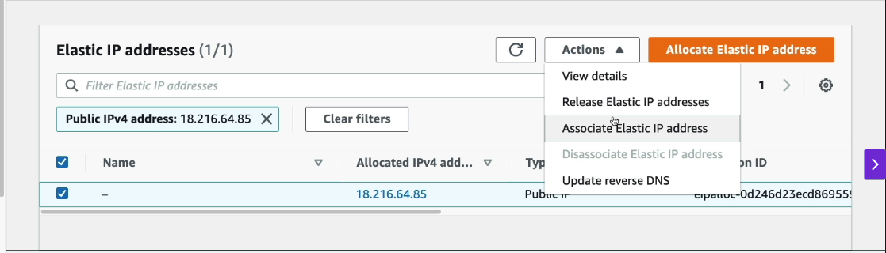

- 4. Choose Resource type is `Instance`.
- 5. Select EC2 instance_id.
- 6. Choose your Instance's Private IP.

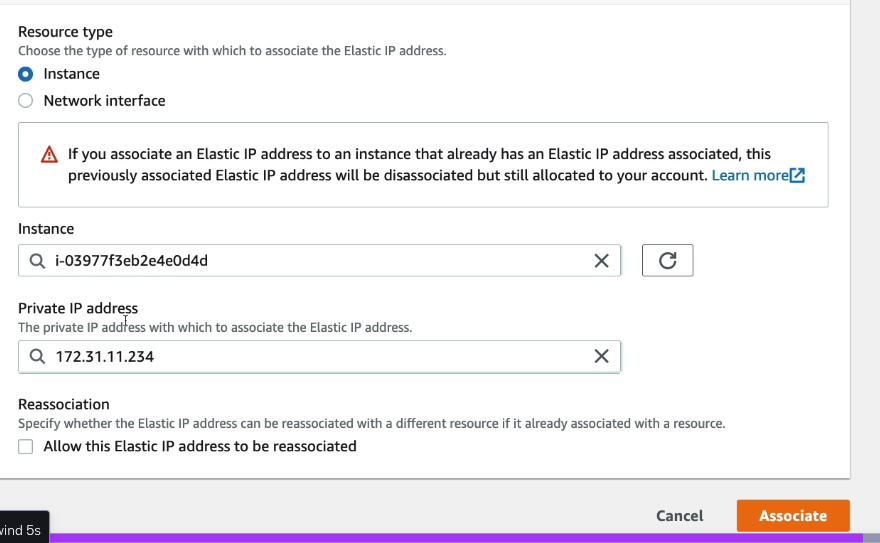

- 7. Start the Instance.

Placement Group
---

# AWS Placement Groups

## Concept Overview
Placement Groups in AWS define **how EC2 instances are physically placed** within the AWS infrastructure.  
They give you **control over instance placement** to achieve specific goals like:
- Low latency
- High network throughput
- Fault isolation
- High availability

You **don’t choose hardware directly**, but you tell AWS your **placement strategy**.

There are **three types** of placement groups:
1. **Cluster Placement Group**
2. **Spread Placement Group**
3. **Partition Placement Group**

---

## 1. Cluster Placement Group

### Definition
All instances are placed **close together** within the **same Availability Zone (AZ)** to achieve **low latency** and **high network performance**.

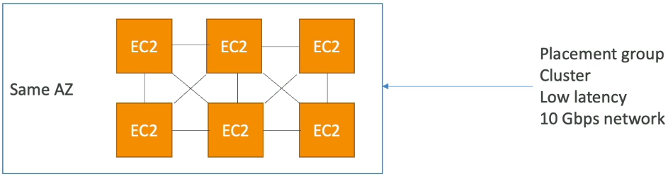

### Characteristics
- Instances share the **same rack or nearby racks**.
- Provide **up to 10 Gbps+ network bandwidth** between instances (with enhanced networking).
- Designed for **high-performance computing** or **low-latency workloads**.

### Drawbacks
- If the **AZ fails**, all instances in that group fail together (single point of failure).
- Must **all be in the same AZ**.

### Use Cases
- Big data or HPC (High Performance Computing) jobs
- Applications requiring **high throughput & low latency** (e.g., GPU clusters, real-time analytics)

---

## 2. Spread Placement Group

### Definition
Instances are placed **across different physical hardware** and with **Diff multiple AZs** to **minimize correlated failures**.

### Characteristics
- Each instance runs on **separate hardware** (different racks).
- Can **span multiple Availability Zones**.
- **Limit:** Maximum **7 instances per AZ per placement group**.
- Designed for **high availability and fault isolation**.

### Drawbacks
- Limited to 7 instances per AZ.
- Slightly higher network latency compared to cluster placement.

### Use Cases
- **Critical applications** that must remain available if hardware fails.
- **Small but important workloads** where **failure isolation** is essential (e.g., production databases, critical microservices).

---

## 3. Partition Placement Group

### Definition
Instances are **divided into partitions**, each partition using a **separate set of racks**.  
Partitions are **isolated from failures** in other partitions.

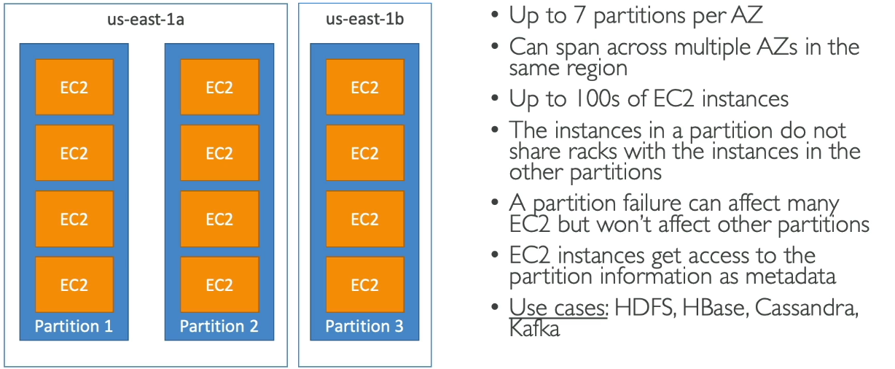

### Characteristics
- Each **partition = one or more racks**.
- Up to **7 partitions per AZ**.
- Can **span multiple Availability Zones** in the same region.
- **Hundreds of instances** per placement group supported.
- **Instances in one partition** do **not share hardware** with those in other partitions.
- You can **view partition IDs** using EC2 metadata.

### Drawbacks
- Requires applications that are **partition-aware**.

### Use Cases
- **Big data and distributed systems** that can handle data partitioning, such as:
  - Apache Hadoop / HDFS
  - Apache HBase
  - Apache Cassandra
  - Apache Kafka

---

## Summary Comparison Table

| Feature / Type              | Cluster Placement Group | Spread Placement Group | Partition Placement Group |
|-----------------------------|--------------------------|--------------------------|----------------------------|
| **Placement**               | Same rack / AZ           | Separate racks, across AZs | Separate racks grouped by partitions |
| **AZ Scope**                | Single AZ                | Multiple AZs             | Multiple AZs               |
| **Network Performance**     | Very High (10+ Gbps)     | Moderate                 | High (depends on partition layout) |
| **Failure Risk**            | High (single AZ failure) | Very Low (isolated)      | Isolated per partition     |
| **Instance Limit**          | No hard limit            | 7 per AZ                 | Hundreds per group         |
| **Scalability**             | Moderate                 | Low                      | Very High                  |
| **Use Case**                | HPC, real-time jobs      | Critical small apps       | Big data, partitioned apps |

---

## Key Takeaways

- **Cluster** → Best for **performance** (low latency, high throughput).  
- **Spread** → Best for **availability** (minimize failure risk).  
- **Partition** → Best for **scalable distributed systems** (Hadoop, Kafka, Cassandra).  
- AWS automatically manages **rack placement** and **failure isolation**.
- Placement groups help you **balance performance vs fault tolerance**.

---

**Author:** AWS Compute (EC2) Concepts  
**Category:** EC2 / Infrastructure / Networking

- To Assign / Use the Instance within Placement group, You should have to **Create First Placement group before Create EC2**.

- You can Assign Placement group to EC2 during Creation of EC2 Only.

**To create placement group**

- Go to Placement group > Give name > Choose stretegy type of placement group as `cluster`.

- Click on Create.

**Cluster PG**

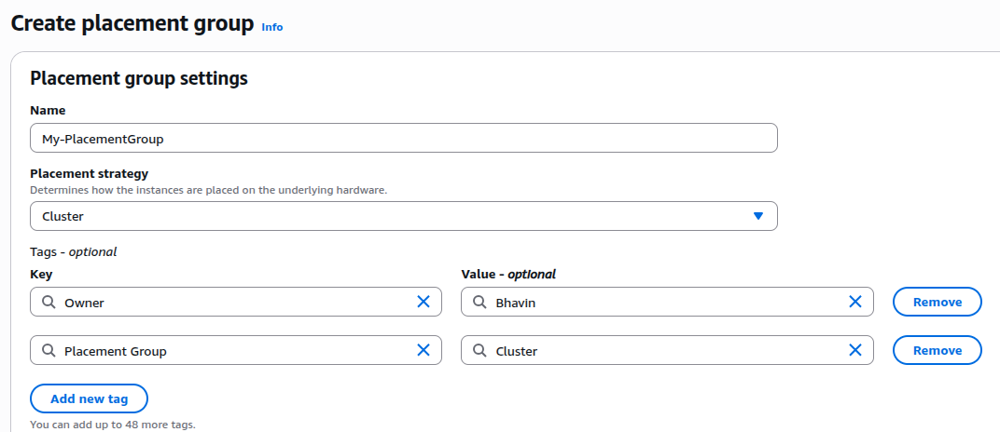

**Spread PG**

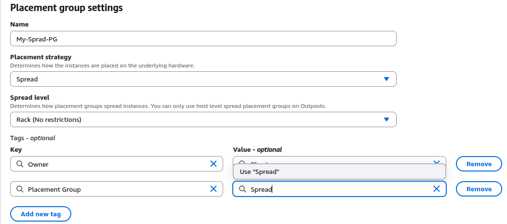

**Partition PG**

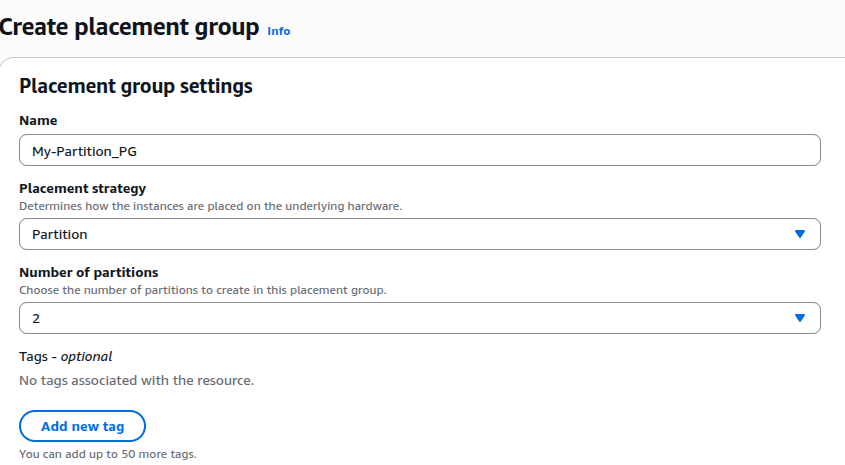

- ### Attach Placement Group to EC2 during creation of EC2

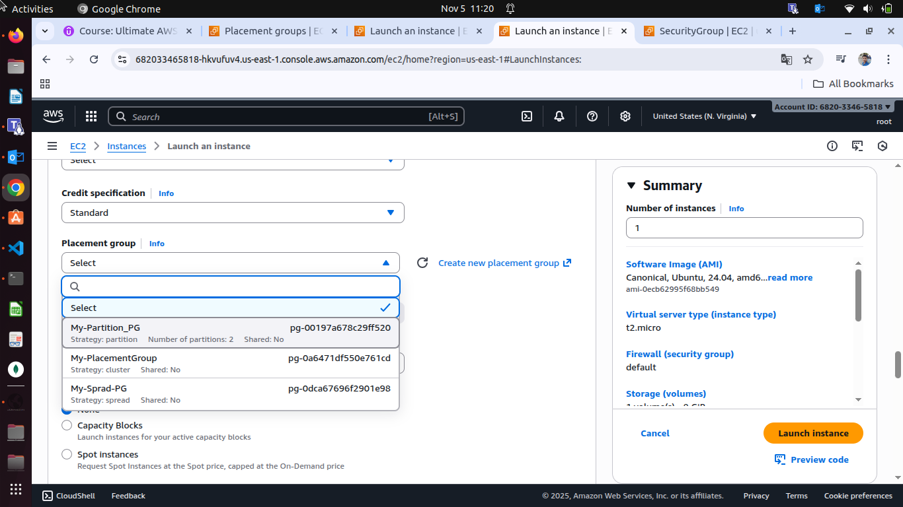

Elastic NIC
---

## Concept Overview

An **Elastic Network Interface (ENI)** is a **virtual network card** within your **VPC (Virtual Private Cloud)**.  
It provides **network connectivity** to your **EC2 instances** — similar to how a physical NIC (Network Interface Card) connects a computer to a network.

Each ENI represents:
- A **logical networking component** in AWS.
- A **virtual adapter** that defines how an instance connects to subnets, IPs, and security groups.

---

## 1.Key Attributes of an ENI

Each ENI can have the following properties:

| Attribute | Description |
|------------|--------------|
| **Primary Private IPv4** | Every ENI has one **primary private IPv4** address. |
| **Secondary Private IPv4s** | You can assign **multiple additional private IPv4** addresses. |
| **Elastic IP / Public IP** | Each private IP can be associated with a **public IP** or **Elastic IP**. |
| **Security Groups** | One or more **security groups** can be attached for network rules. |
| **MAC Address** | Each ENI has its own **unique MAC address** (like a real NIC). |
| **Attachment** | Can be **attached to or detached from** EC2 instances dynamically. |
| **Availability Zone Bound** | Each ENI is tied to a **specific Availability Zone (AZ)**. You cannot move it to another AZ. |

---

## 2. ENI and EC2 Relationship

- Each EC2 instance has a **primary ENI** (named `eth0`) attached by default.  
  - This ENI gives the instance its **private IP** and **network connectivity**.
- You can attach **additional ENIs** (e.g., `eth1`, `eth2`, etc.) for:
  - Multi-homed networking setups
  - Traffic separation
  - High availability configurations

---

## 3. ENI Mobility and Failover

- ENIs can be **moved between EC2 instances** within the **same Availability Zone**.
- When an ENI is moved, its **IP address and configuration move with it**.
- This is useful for **failover** or **redundancy**:
  - Example:
    - `ENI eth1` is attached to Instance A.
    - Instance A fails.
    - You **detach** the ENI and **attach** it to Instance B.
    - The same private IP is now active on Instance B — allowing seamless failover.

---

## 4. ENI Use Cases

| Use Case | Description |
|-----------|--------------|
| **High Availability (Failover)** | Move ENI between instances to preserve the same IP and minimize downtime. |
| **Network Segmentation** | Attach multiple ENIs to separate traffic (e.g., public and private networks). |
| **Security Isolation** | Assign ENIs with different security groups to control access layers. |
| **Custom Network Appliances** | Use ENIs for routing, firewalls, or proxy instances. |
| **Backup / Redundancy** | Maintain standby EC2 with ENI ready to take over on failure. |

EC2 Hibernates
---

## Overview
**EC2 Hibernate** is a feature that allows you to pause (hibernate) an EC2 instance while preserving its in-memory (RAM) state.  
When restarted, the instance **resumes exactly where it left off**, making it much faster than a normal stop/start cycle.

---

## What Happens in Hibernate
When an instance is hibernated:
1. The **RAM contents** are written to the **root EBS volume**.
2. The instance goes into a **“stopping” → “stopped”** state.
3. Upon restart, the **RAM data is reloaded** from EBS back into memory.
4. The instance resumes from the same point — open applications and processes remain exactly as before.

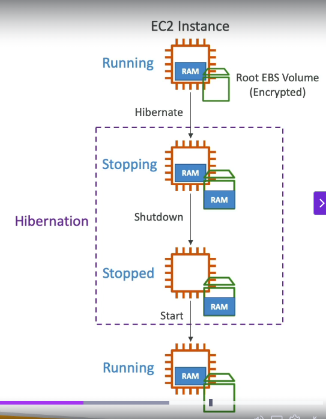

---

## Comparison with Stop and Terminate

| Action | What Happens | Data in RAM | Data in EBS | Boot Time |
|--------|----------------|--------------|--------------|------------|
| **Stop** | Instance shuts down gracefully | Lost | Preserved | Slow (cold boot) |
| **Hibernate** | Instance state saved to disk | Saved to EBS | Preserved | Fast (resume) |
| **Terminate** | Instance deleted | Lost | Deleted (if configured) | N/A |

---

## How It Works Internally
1. **Running Instance:** Applications are active and data exists in RAM.  
2. **Hibernate Command:** The OS pauses and dumps RAM data into the EBS volume.  
3. **Instance Stops:** EC2 releases resources (RAM cleared), but EBS retains RAM dump.  
4. **Restart:** RAM data is reloaded from EBS → instance resumes as if never stopped.

---

## Requirements
- ✅ **Root Volume:** Must be **EBS**, not instance store.
- 🔐 **EBS Volume:** Must be **encrypted** (RAM dump contains sensitive data).
- 💾 **EBS Size:** Must be **large enough** to hold the RAM contents.
- 🧮 **RAM Limit:** Instance must have **< 150 GB RAM** (approximate limit).
- 🕒 **Hibernate Duration:** Can remain hibernated for **up to 60 days**.
- 🧱 **Instance Types:** Works on **On-Demand, Reserved, and Spot** instances.
- 🚫 **Not Supported:** **Bare metal** instances.
- 🖥️ **Operating Systems:** Supported on **Linux** and **Windows** AMIs.

---

## Use Cases
### 1. Fast Booting Systems
- Ideal for systems where **application startup takes time** (e.g., caches, analytics engines).

### 2. Long-running Workloads
- Preserve computation state without restarting workloads.

### 3. Development / Testing Environments
- Quickly **resume from the exact state** without reconfiguring or restarting services.

**Configure EC2 for Hibernates**

- Create EC2
- Create EBS and enable Encryptions.

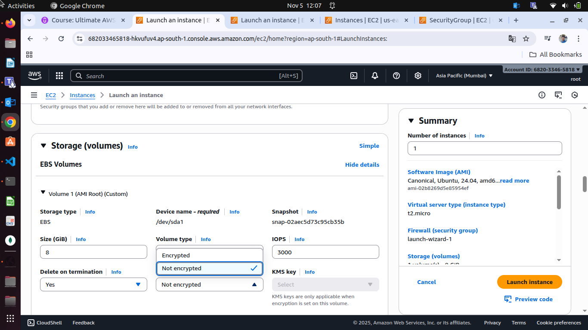

- Select KMS Key as Default. So Encryption key will managed by aws itself.

- Go to Advance Settings > Hibernate behavior > Choose Enable.

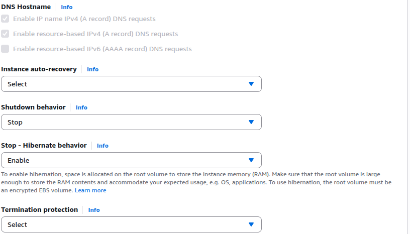

- Launch Instances.

To Hibernate Instance, Just select EC2 > Go to Instance state > Hibernate Instance.

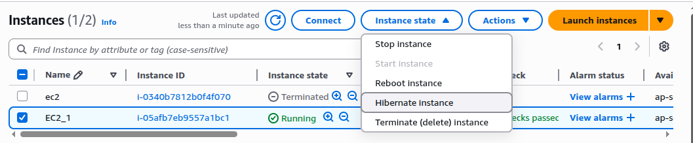

- Now Stop you EC2

- Start EC2

- Connect to EC2 and Run command `uptime`.

- If you enabled hibernates, Your ec2 should not boot process and should show **Total uptime from Launched Instance**.

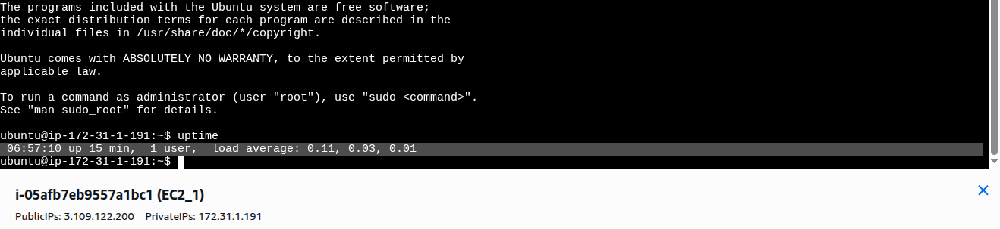

- Here, You can see total uptime is **6 minutes** after restart EC2.

