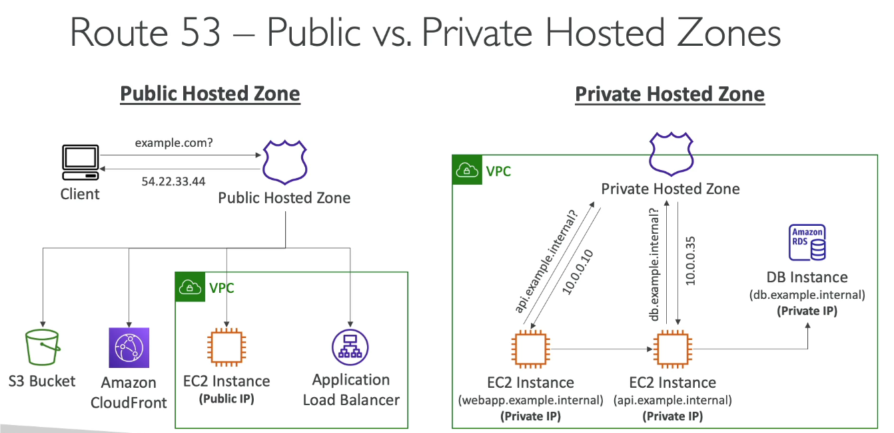

What is DNS ?

| Concept                      | Meaning / Example                                                                                                              |
| ---------------------------- | ------------------------------------------------------------------------------------------------------------------------------ |
| **DNS (Domain Name System)** | Converts human-friendly names → IP addresses. Example: `www.google.com → 142.250.72.14`                                        |
| **Purpose**                  | Makes it easy for humans to access websites without remembering IPs.                                                           |
| **Hierarchy**                | Root (.) → Top-Level Domain (.com) → Second-Level Domain (example.com) → Subdomain ([www.example.com](http://www.example.com)) |

## DNS

| Term                                   | Description                                       | Example                               |
| -------------------------------------- | ------------------------------------------------- | ------------------------------------- |
| **Domain Registrar**                   | Where you buy your domain name                    | GoDaddy, Route 53                     |
| **DNS Record Types**                   | Define how domain names map to IPs or other names | A, AAAA, CNAME, NS                    |
| **Zone File**                          | File storing all DNS records for a domain         | Contains list of mappings             |
| **Name Server (NS)**                   | Server that answers DNS queries                   | Provided by registrar or AWS Route 53 |
| **Top-Level Domain (TLD)**             | Last part of domain                               | `.com`, `.org`, `.in`                 |
| **Second-Level Domain (SLD)**          | Main domain name                                  | `example.com`                         |
| **Subdomain**                          | Extension of your domain                          | `www.example.com`, `api.example.com`  |
| **FQDN (Fully Qualified Domain Name)** | Full domain name path                             | `api.www.example.com.`                |
| **Protocol**                           | Defines how you access resource                   | `http://`, `https://`                 |

**What is Route 53 ?**

| Topic                    | Key Points                                                                                                                                                                               |
| ------------------------ | ---------------------------------------------------------------------------------------------------------------------------------------------------------------------------------------- |
| **What is Route 53?**    | - AWS’s **managed DNS (Domain Name System)** service. - **Highly available, scalable, and authoritative** DNS. - “Authoritative” = you can **create/update your own DNS records**. |
| **Why called Route 53?** | - Because **DNS uses port 53** on the internet.                                                                                                                                          |
| **Use Case Example**     | - You want `example.com` to point to your EC2 instance (IP `54.22.33.44`). - You add this record in Route 53 → when users type `example.com`, they reach your EC2.                    |

**DNS Records Types**

| Type             | Purpose                                                       | Example                         |
| ---------------- | ------------------------------------------------------------- | ------------------------------- |
| **A Record**     | Maps hostname → IPv4 address                                  | `example.com → 1.2.3.4`         |
| **AAAA Record**  | Maps hostname → IPv6 address                                  | `example.com → 2001:db8::1`     |
| **CNAME Record** | Maps one hostname → another hostname                          | `www.example.com → example.com` |
| **NS Record**    | Lists **Name Servers** for a domain (who answers DNS queries) | `ns-123.awsdns-45.com`          |

**DNS Hosted Zones**

| Type                    | Description                                                                                                                             | Example              |
| ----------------------- | --------------------------------------------------------------------------------------------------------------------------------------- | -------------------- |
| **Public Hosted Zone**  | - Visible to the **Internet**. - Used for **public websites**. - Queries can come from **any client**.                            | `mypublicdomain.com` |
| **Private Hosted Zone** | - Visible **only inside your VPC**. - Used for **internal/private apps**. - Queries come **only from AWS resources (e.g., EC2)**. | `example.internal`   |

## 🌍 Public Hosted Zone

### Purpose
Used to make your domain name (like `example.com`) **available to the internet**.

### How It Works
1. A **client/browser** sends a DNS query for `example.com`.
2. The **Public Hosted Zone** in Route 53 responds with a **public IP address** (e.g., `54.22.33.44`).
3. The client can now access:
   - S3 website bucket
   - CloudFront distribution
   - EC2 instance (with Public IP)
   - Application Load Balancer

### Key Points
- Accessible **from anywhere on the internet**
- Uses **Public IP addresses**
- DNS records are **publicly visible**
- Example domain: `example.com`

## Private Hosted Zone

### Purpose
Used for **internal DNS resolution** inside your AWS **VPC**.  
Not accessible from the internet.

### How It Works
1. EC2 or other AWS resources inside a VPC use **private DNS names**, for example:
   - `webapp.example.internal`
   - `api.example.internal`
   - `db.example.internal`
2. When an instance queries `api.example.internal`,  
   Route 53’s **Private Hosted Zone** returns a **private IP** (e.g., `10.0.0.10`).
3. Similarly, `db.example.internal` resolves to `10.0.0.35`.
4. The connection happens **within the VPC** — no internet needed.

### Key Points
- Works **only inside associated VPC(s)**
- Uses **Private IPs**
- Not reachable from the public internet
- Example domain: `example.internal`

**AWS Route 53 Routing Policies Summary**

| **Routing Policy**        | **What It Does**                                                                                              | **When to Use It**                                                                  | **Example**                                                 |
| ------------------------- | ------------------------------------------------------------------------------------------------------------- | ----------------------------------------------------------------------------------- | ----------------------------------------------------------- |
| **Simple**             | Maps one domain name to **one resource (IP or load balancer)**.                                               | When you have **only one server/app** and don’t need special routing logic.         | `example.com → 54.22.33.44`                                 |
| ⚖️ **Weighted**           | Splits traffic **based on percentage or weight** you define.                                                  | For **A/B testing**, **gradual deployments**, or load sharing.                      | 70% to `server A`, 30% to `server B`                        |
| **Latency-based**      | Routes users to the region that gives the **lowest network latency**.                                         | When you have **same app in multiple AWS Regions** for best speed.                  | User in India → Mumbai region; User in US → Virginia region |
| **Failover**           | Sends traffic to a **primary** resource, and if it fails, routes to **secondary (backup)**.                   | For **disaster recovery** or **high availability setups**.                          | Primary EC2 down → Redirect to backup EC2                   |
| **Geolocation**        | Routes based on the **user’s geographic location** (continent, country, or state).                            | To show **localized content** or comply with **regional rules**.                    | US users → `us.example.com`, EU users → `eu.example.com`    |
| **Geoproximity**       | Routes based on **location of users and resources**, and allows **biasing** (you can shift traffic manually). | When you want **control over how much traffic** each region gets, even nearby ones. | Move 20% extra traffic to Tokyo instead of Singapore        |
| **IP-based**           | Routes based on the **client’s IP address range (CIDR)**.                                                     | When you need **custom routing for specific IPs or networks**.                      | Corporate IPs → Private API; Public IPs → Public site       |
| **Multi-Value Answer** | Returns **multiple IPs** for one DNS query, randomly chosen.                                                  | For **basic load balancing and redundancy**.                                        | `example.com → [54.22.33.44, 54.22.33.45]`                  |
