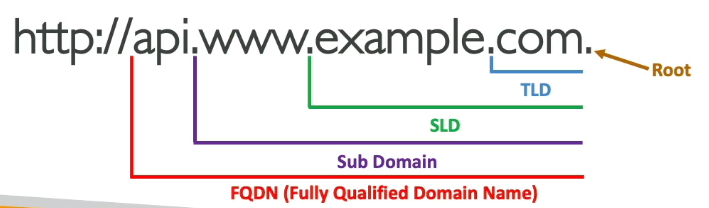
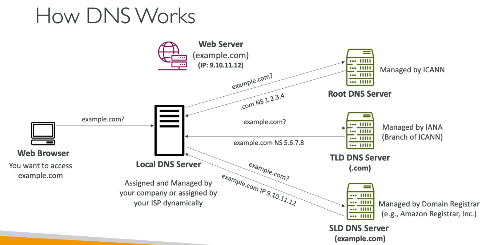

What is DNS ?

| Concept                      | Meaning / Example                                                                                                              |
| ---------------------------- | ------------------------------------------------------------------------------------------------------------------------------ |
| **DNS (Domain Name System)** | Converts human-friendly names → IP addresses. Example: `www.google.com → 142.250.72.14`                                        |
| **Purpose**                  | Makes it easy for humans to access websites without remembering IPs.                                                           |
| **Hierarchy**                | Root (.) → Top-Level Domain (.com) → Second-Level Domain (example.com) → Subdomain ([www.example.com](http://www.example.com)) |

## DNS

| Term                                   | Description                                       | Example                               |
| -------------------------------------- | ------------------------------------------------- | ------------------------------------- |
| **Domain Registrar**                   | Where you buy your domain name                    | GoDaddy, Route 53                     |
| **DNS Record Types**                   | Define how domain names map to IPs or other names | A, AAAA, CNAME, NS                    |
| **Zone File**                          | File storing all DNS records for a domain         | Contains list of mappings             |
| **Name Server (NS)**                   | Server that answers DNS queries                   | Provided by registrar or AWS Route 53 |
| **Top-Level Domain (TLD)**             | Last part of domain                               | `.com`, `.org`, `.in`                 |
| **Second-Level Domain (SLD)**          | Main domain name                                  | `example.com`                         |
| **Subdomain**                          | Extension of your domain                          | `www.example.com`, `api.example.com`  |
| **FQDN (Fully Qualified Domain Name)** | Full domain name path                             | `api.www.example.com.`                |
| **Protocol**                           | Defines how you access resource                   | `http://`, `https://`                 |

**What is Route 53 ?**

| Topic                    | Key Points                                                                                                                                                                               |
| ------------------------ | ---------------------------------------------------------------------------------------------------------------------------------------------------------------------------------------- |
| **What is Route 53?**    | - AWS’s **managed DNS (Domain Name System)** service. - **Highly available, scalable, and authoritative** DNS. - “Authoritative” = you can **create/update your own DNS records**. |
| **Why called Route 53?** | - Because **DNS uses port 53** on the internet.                                                                                                                                          |
| **Use Case Example**     | - You want `example.com` to point to your EC2 instance (IP `54.22.33.44`). - You add this record in Route 53 → when users type `example.com`, they reach your EC2.                    |

**DNS Records Types**

| Type             | Purpose                                                       | Example                         |
| ---------------- | ------------------------------------------------------------- | ------------------------------- |
| **A Record**     | Maps hostname → IPv4 address                                  | `example.com → 1.2.3.4`         |
| **AAAA Record**  | Maps hostname → IPv6 address                                  | `example.com → 2001:db8::1`     |
| **CNAME Record** | Maps one hostname → another hostname                          | `www.example.com → example.com` |
| **NS Record**    | Lists **Name Servers** for a domain (who answers DNS queries) | `ns-123.awsdns-45.com`          |

**DNS Hosted Zones**

| Type                    | Description                                                                                                                             | Example              |
| ----------------------- | --------------------------------------------------------------------------------------------------------------------------------------- | -------------------- |
| **Public Hosted Zone**  | - Visible to the **Internet**. - Used for **public websites**. - Queries can come from **any client**.                            | `mypublicdomain.com` |
| **Private Hosted Zone** | - Visible **only inside your VPC**. - Used for **internal/private apps**. - Queries come **only from AWS resources (e.g., EC2)**. | `example.internal`   |

