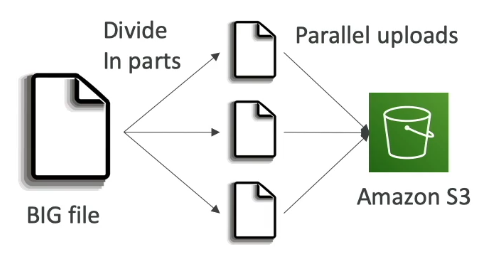
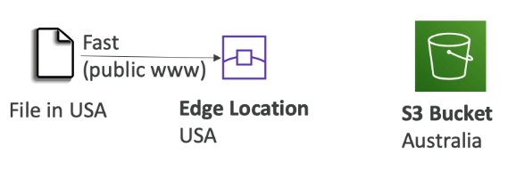
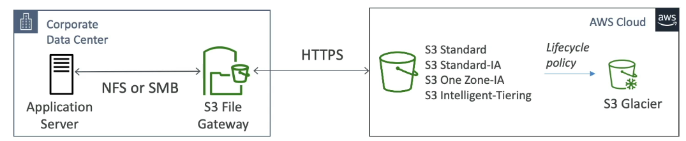

Resource based Policy
---
- **Bucket Policies** - Bucket wide rules - Allows cross account.

```json
{
    "Version": "2012-10-17",
    "Statement": [
        {
            "Sid": "Statement1",
            "Effect": "Allow",  # Allow Or Deny.
            "Principal": {  # Who will have Access for Resource. IAM USER - Use ARN.
                "AWS": "arn:aws:iam::account_number:user/Bhavin-1"
            },
            "Action": "s3:ListBucket", # What can perform.
            "Resource": "arn:aws:s3:::tf-backend-s3-bhavin" # Which Resource can access by user
        }
    ]
}
```


**S3 Storage Classes**

| Storage Class                                        | Description                                                                      | Use Case                                           | Cost          | Retrieval Speed  |
| ---------------------------------------------------- | -------------------------------------------------------------------------------- | -------------------------------------------------- | ------------- | ---------------- |
| **S3 Standard**                                      | Default class — stores frequently accessed data across multiple AZs              | Websites, apps, real-time data                     | 💲💲          | ⚡ Very Fast      |
| **S3 Standard-IA (Infrequent Access)**               | For data accessed less often, but still needs fast access                        | Backups, older files                               | 💲 (lower)    | ⚡ Fast           |
| **S3 One Zone-IA**                                   | Like Standard-IA but stored in one AZ only                                       | Re-creatable data                                  | 💲 (cheaper)  | ⚡ Fast           |
| **S3 Intelligent-Tiering**                           | Automatically moves objects between frequent and infrequent tiers based on usage | Unpredictable access patterns                      | 💲💲 (varies) | ⚡ Fast           |
| **S3 Glacier Instant Retrieval**                     | Archival with instant access                                                     | Medical images, backups that need immediate access | 💲            | ⚡ Fast           |
| **S3 Glacier Flexible Retrieval (formerly Glacier)** | Archive data that’s rarely accessed, minutes-to-hours retrieval                  | Long-term backups                                  | 💲 (very low) | 🕒 Minutes–Hours |
| **S3 Glacier Deep Archive**                          | Long-term cold storage, rarely accessed                                          | Compliance, regulatory archives                    | 💲 (lowest)   | 🕒 Hours         |


**Lifecycle Rules**

- Lifecycle rules help automate the movement between these classes.

**Example:**

- Day 0–30 → S3 Standard (frequently accessed)

- After 30 days → Move to Standard-IA

- After 90 days → Move to Glacier Deep Archive

- After 365 days → Delete the object automatically


S3 - Requster Pays
---

**Normally, in S3:**

- The bucket owner pays for everything — both storage and data transfer (download).

But **with Requester Pays,**

- The person who downloads (the - requester) pays for the data transfer cost — not the bucket owner.

- In Std. S3 bucket - That bucket owner will pay for Stroage and Networking cost while users download that larger files between regions.

- While `Requester Pays` - The Bucket Onwer Still `have to Pay for Only for **Storage Objects in S3**` & `User OR Requester` Have to **Pay for Downloading Objects**.

# Amazon S3 Performance Optimization

## 1. Multi-Part Upload (Faster Uploads)

### What It Is
- Splits a large file into smaller parts and uploads them **in parallel** to S3.



### Why It’s Faster
- Maximizes bandwidth by uploading chunks simultaneously.  
- Retries only failed parts (not the entire file).

### When to Use
- **Recommended:** Files > **100 MB**  
- **Required:** Files > **5 GB**

### How It Works

- Large file → Split into parts → Upload parts in parallel → S3 reassembles them


## 2. S3 Transfer Acceleration (Global Speed Boost)

### What It Is
Speeds up uploads and downloads **across long distances** using AWS **Edge Locations**.

### How It Works
1. File is uploaded to the **nearest AWS Edge Location** (close to user).  
2. Data travels via the **AWS private backbone network** to the S3 bucket region.



### Why It’s Faster
- Reduces public internet usage.  
- Uses AWS’s optimized internal network.

### Example
- User (US) → Edge Location (US) → AWS Backbone → S3 Bucket (Australia)

## 3. S3 Byte-Range Fetches (Faster Downloads)

### What It Is
Allows downloading **specific byte ranges** of an object, instead of the entire file.

### Benefits
1. **Parallel downloads:** Fetch multiple parts simultaneously.  
2. **Partial reads:** Retrieve only a portion (e.g., file headers).

### Example

GET bytes=0–1048575 → Part 1
GET bytes=1048576–2097151 → Part 2
GET bytes=2097152–... → Part 3

- Use **Multi-Part Upload** for files >100 MB  
- Enable **Transfer Acceleration** for cross-region uploads/downloads  
- Use **Byte-Range Fetches** for parallel downloads or partial reads  


# Amazon FSx File System Types

- FSX is file system shared over a network. Most of aws services can use this service.

- Based on Data write , Data removes, It will scale up or downs.

Amazon FSx provides fully managed, high-performance file systems built on popular file system technologies.  
Each FSx variant is optimized for a specific **operating system**, **protocol**, and **workload type**.


| **FSx Service Name** | **Primary Target OS / Protocol** | **Primary Workload Focus** |
|--------------------------|------------------------------------|--------------------------------|
| **FSx for Windows File Server** | Windows (uses **SMB** protocol) | General-purpose file shares, home directories, and lift-and-shift of Windows applications. |
| **FSx for Lustre** | Linux (uses **POSIX-compliant Lustre client**) | High-Performance Computing (HPC), Machine Learning (ML), and large-scale data processing. |
| **FSx for OpenZFS** | Linux (uses **NFS** protocol) | Linux-based applications, high-performance general workloads, and DevOps pipelines. |
| **FSx for NetApp ONTAP** | Multi-Protocol (**NFS**, **SMB**, **iSCSI**) | Enterprise NAS features, hybrid cloud storage, and data replication across environments. |


**Tip:**  
Choose your FSx type based on your **OS compatibility** and **performance requirements**:
- Use **FSx for Windows** for seamless Active Directory integration.  
- Use **FSx for Lustre** for data-intensive workloads like analytics or AI training.  
- Use **FSx for OpenZFS** for Linux-based apps with snapshots and cloning.  
- Use **FSx for NetApp ONTAP** for hybrid or enterprise-grade NAS features.


# Amazon FSx – Fully Managed File Systems on AWS

Amazon **FSx** lets you launch popular **third-party high-performance file systems** on AWS as a **fully managed service**, just like RDS does for databases.

You can choose among **four core file systems**, each designed for different workloads and environments.


## 1. FSx for Windows File Server

### 🔹 Overview
- Fully managed **Windows File Server** on AWS.  
- Uses **SMB protocol** and **NTFS** file system.  
- Integrates with **Microsoft Active Directory (AD)** for authentication.  
- Supports **Access Control Lists (ACLs)** and **user quotas**.

### 🔹 Features
- Can be **mounted on both Windows and Linux EC2** instances.  
- Can join on-premises **Windows File Servers** using **DFS (Distributed File System)**.  
- **Scales** up to tens of GB/s, millions of IOPS, and hundreds of PBs.  
- **Storage types:**  
  - **SSD** – low-latency, IOPS-intensive workloads (databases, media, analytics).  
  - **HDD** – cost-efficient general workloads (home directories, CMS).  
- **Multi-AZ** support for high availability.  
- **Daily backups** to S3 for disaster recovery.  
- **On-premises access** via Direct Connect or VPN.


## 2.FSx for Lustre

### 🔹 Overview
- Managed **Lustre** (from *Linux* + *Cluster*) file system for **HPC** and **ML** workloads.  
- Optimized for **large-scale compute and data processing**.

### 🔹 Use Cases
- High-Performance Computing (HPC)  
- Machine Learning (ML) training  
- Video processing, financial modeling, EDA

### 🔹 Performance
- Hundreds of GB/s throughput, millions of IOPS, **sub-millisecond latency**.  
- **Storage options:**  
  - **SSD** – low latency, random I/O  
  - **HDD** – throughput-intensive, sequential workloads

### 🔹 Integration
- **Seamless integration with S3**:  
  - Read S3 objects as files through FSx.  
  - Write computation outputs back to S3.

### 🔹 Deployment Types
| Type | Description | Replication | Use Case |
|------|--------------|--------------|-----------|
| **Scratch** | Temporary, non-replicated storage | ❌ No | Short-term processing, highest performance (6× faster) |
| **Persistent** | Long-term storage with replication | ✅ Within AZ | Durable, sensitive data workloads |


## 3.FSx for NetApp ONTAP

### 🔹 Overview
- Managed **NetApp ONTAP** file system on AWS.  
- Supports **NFS**, **SMB**, and **iSCSI** protocols.  
- Ideal for **enterprise NAS** and **hybrid architectures**.

### 🔹 Compatibility
- Works with **Linux**, **Windows**, **macOS**, and services like:  
  - VMware Cloud on AWS  
  - Amazon WorkSpaces & AppStream  
  - EC2, ECS, EKS

### 🔹 Key Features
- **Auto-scaling storage** (automatic shrink/grow).  
- **Snapshots** and **replication** support.  
- **Data compression** and **deduplication**.  
- **Instant point-in-time cloning** (useful for dev/test environments).  
- Cost-effective, enterprise-grade, hybrid storage.

## 4. FSx for OpenZFS

### 🔹 Overview
- Managed **OpenZFS** file system on AWS.  
- Uses **NFS protocol** (multiple versions supported).  
- Targets **Linux**, **Mac**, and **Windows** workloads.

### 🔹 Features
- **High performance:** Up to **1 million IOPS**, <0.5 ms latency.  
- **Snapshots**, **compression**, and **instant cloning** support.  
- No **deduplication** (unlike NetApp ONTAP).  
- Best for **Linux-based DevOps**, high-performance general workloads.


## Comparison Table

| FSx Service | Target OS / Protocol | Primary Workload | Key Highlights |
|--------------|---------------------|------------------|----------------|
| **FSx for Windows File Server** | Windows (**SMB**) | File shares, home directories, Windows app lift-and-shift | AD integration, ACLs, Multi-AZ, backups to S3 |
| **FSx for Lustre** | Linux (**POSIX**) | HPC, ML, data processing | S3 integration, scratch/persistent modes |
| **FSx for NetApp ONTAP** | Multi-Protocol (**NFS/SMB/iSCSI**) | Enterprise NAS, hybrid cloud | Snapshots, deduplication, replication, cloning |
| **FSx for OpenZFS** | Linux (**NFS**) | Linux workloads, DevOps pipelines | Low-latency, snapshots, cloning, no deduplication |


## Key Exam Pointers

- **Windows File Server →** Use for AD integration & SMB shares.  
- **Lustre →** Use for ML, HPC, or S3-integrated workloads.  
- **NetApp ONTAP →** Use for enterprise NAS, hybrid, or deduplication needs.  
- **OpenZFS →** Use for Linux apps needing snapshots/cloning.  


**Summary:**  
Amazon FSx brings the power of enterprise and open-source file systems—Windows, Lustre, NetApp, and OpenZFS—to AWS as **managed, scalable, and high-performance storage solutions** for diverse workloads.

AWS Storage Gateway
---

- Bridge between **On-premises** data and **Cloud** data.

**Use cases**:

- Disaster recovery
- Backup & restore
- Tiered storage
- On-premises cache & low-latency files access.

**Types of Storage Gateway**:
  - S3 File Gateway
  - Volume Gateway
  - Tape Gateway

### 1. S3 File Gateway



- you have S3 bucket and data.
- You want to get data~ from s3 bucket to your on-premise server.

- Configure your on-premise to use `NFS` or `SMB` Protocol.

- Configure `S3 File Gateway` and connect between On-Premise and S3 Bucket Cloud Network.
## 💽 Volume Gateway

**Purpose:** Provide **block storage** (like disks) for applications, with AWS backup.

### 🔧 How It Works

App Server → (iSCSI) → Volume Gateway → (HTTPS) → S3 / EBS Snapshots


- Stores data as **Amazon EBS snapshots** in AWS.
- Used for **backup, disaster recovery, or cloud migration**.

### 🔸 Two Modes

| Mode | Description | Where Data Lives |
|-------|--------------|------------------|
| **Cached Volumes** | Recently used data cached locally, rest in AWS | Mostly in S3 |
| **Stored Volumes** | Full dataset stored locally, backups in AWS | On-premises with cloud backup |

### ✅ Example
A local database uses an iSCSI volume.  
Storage Gateway automatically creates **EBS snapshots** in AWS for recovery.

---

## 🎞️ Tape Gateway

**Purpose:** Replace **physical tape backup systems** with **virtual tapes in AWS**.

### 🔧 How It Works

Backup App → (iSCSI VTL) → Tape Gateway → (HTTPS) → S3 / Glacier


- Creates **Virtual Tape Library (VTL)** visible to existing backup software.  
- Stores virtual tapes in **S3** and archives to **Glacier** or **Glacier Deep Archive**.  
- Works with major backup solutions (Veeam, NetBackup, Commvault, etc.)

### ✅ Example
Your backup software thinks it’s writing to tape,  
but it’s actually storing data in **S3 and Glacier** automatically.

---

## 🧠 Quick Comparison Summary

| Gateway | Protocol | Backend | Main Use | Key Point |
|----------|-----------|----------|-----------|------------|
| **S3 File Gateway** | NFS / SMB | S3 | File sharing & backup | Local file share backed by S3 |
| **Volume Gateway** | iSCSI | S3 + EBS | Block storage & DR | Snapshots in AWS |
| **Tape Gateway** | iSCSI (VTL) | S3 + Glacier | Tape backup replacement | Virtual tapes stored in cloud |


## 2. Volume Gateway
**Purpose:** Provide **block storage** (like disks) for applications, with AWS backup.

### How It Works

App Server → (iSCSI) → Volume Gateway → (HTTPS) → S3 / EBS Snapshots


- Stores data as **Amazon EBS snapshots** in AWS.
- Used for **backup, disaster recovery, or cloud migration**.

### Two Modes

| Mode | Description | Where Data Lives |
|-------|--------------|------------------|
| **Cached Volumes** | Recently used data cached locally, rest in AWS | Mostly in S3 |
| **Stored Volumes** | Full dataset stored locally, backups in AWS | On-premises with cloud backup |

### Example
A local database uses an iSCSI volume.  
Storage Gateway automatically creates **EBS snapshots** in AWS for recovery.

## 3. Tape Gateway

**Purpose:** Replace **physical tape backup systems** with **virtual tapes in AWS**.

### How It Works

Backup App → (iSCSI VTL) → Tape Gateway → (HTTPS) → S3 / Glacier


- Creates **Virtual Tape Library (VTL)** visible to existing backup software.  
- Stores virtual tapes in **S3** and archives to **Glacier** or **Glacier Deep Archive**.  
- Works with major backup solutions (Veeam, NetBackup, Commvault, etc.)

### Example
Your backup software thinks it’s writing to tape,  
but it’s actually storing data in **S3 and Glacier** automatically.

## Quick Comparison Summary

| Gateway | Protocol | Backend | Main Use | Key Point |
|----------|-----------|----------|-----------|------------|
| **S3 File Gateway** | NFS / SMB | S3 | File sharing & backup | Local file share backed by S3 |
| **Volume Gateway** | iSCSI | S3 + EBS | Block storage & DR | Snapshots in AWS |
| **Tape Gateway** | iSCSI (VTL) | S3 + Glacier | Tape backup replacement | Virtual tapes stored in cloud |
- Bucket Access using **IAM Roles** for **Each File Gateway**.


## 2.Volume Gateway

**Purpose:** Provide **block storage** (like disks) for applications, with AWS backup.

### How It Works

App Server → (iSCSI) → Volume Gateway → (HTTPS) → S3 / EBS Snapshots


- Stores data as **Amazon EBS snapshots** in AWS.
- Used for **backup, disaster recovery, or cloud migration**.

### Two Modes

| Mode | Description | Where Data Lives |
|-------|--------------|------------------|
| **Cached Volumes** | Recently used data cached locally, rest in AWS | Mostly in S3 |
| **Stored Volumes** | Full dataset stored locally, backups in AWS | On-premises with cloud backup |

### Example
A local database uses an iSCSI volume.  
Storage Gateway automatically creates **EBS snapshots** in AWS for recovery.


## 3. Tape Gateway

**Purpose:** Replace **physical tape backup systems** with **virtual tapes in AWS**.

### How It Works

Backup App → (iSCSI VTL) → Tape Gateway → (HTTPS) → S3 / Glacier


- Creates **Virtual Tape Library (VTL)** visible to existing backup software.  
- Stores virtual tapes in **S3** and archives to **Glacier** or **Glacier Deep Archive**.  
- Works with major backup solutions (Veeam, NetBackup, Commvault, etc.)

### Example
Your backup software thinks it’s writing to tape,  
but it’s actually storing data in **S3 and Glacier** automatically.


## Quick Comparison Summary

| Gateway | Protocol | Backend | Main Use | Key Point |
|----------|-----------|----------|-----------|------------|
| **S3 File Gateway** | NFS / SMB | S3 | File sharing & backup | Local file share backed by S3 |
| **Volume Gateway** | iSCSI | S3 + EBS | Block storage & DR | Snapshots in AWS |
| **Tape Gateway** | iSCSI (VTL) | S3 + Glacier | Tape backup replacement | Virtual tapes stored in cloud |
