# AWS Solution Architech C03 Exam Questions

## Q-1 

The engineering team at an in-home fitness company is evaluating multiple in-memory data stores with the ability to power its on-demand, live leaderboard. The company's leaderboard requires high availability, low latency, and real-time processing to deliver customizable user data for the community of users working out together virtually from the comfort of their home.

As a solutions architect, which of the following solutions would you recommend? (Select two)

- Power the on-demand, live leaderboard using Amazon Neptune as it meets the in-memory, high availability, low latency requirements

- **Power the on-demand, live leaderboard using Amazon DynamoDB with DynamoDB Accelerator (DAX) as it meets the in-memory, high availability, low latency requirements**

- **Power the on-demand, live leaderboard using Amazon ElastiCache for Redis as it meets the in-memory, high availability, low latency requirements**

- Power the on-demand, live leaderboard using Amazon DynamoDB as it meets the in-memory, high availability, low latency requirements

- Power the on-demand, live leaderboard using Amazon RDS for Aurora as it meets the in-memory, high availability, low latency requirements

## Q-2

A healthcare analytics company centralizes clinical and operational datasets in an Amazon S3–based data lake. Incoming data is ingested in Apache Parquet format from multiple hospitals and wearable health devices. To ensure quality and standardization, the company applies several transformation steps: anomaly filtering, datetime normalization, and aggregation by patient cohort. The company needs a solution to support a code-free interface that enables data engineers and business analysts to collaborate on data preparation workflows. The company also requires data lineage tracking, data profiling capabilities, and an easy way to share transformation logic across teams without writing or managing code.

Which AWS solution best meets these requirements?

- **Use AWS Glue DataBrew to visually build transformation workflows on top of the raw Parquet files in S3. Use DataBrew recipes to track, audit, and share the transformation steps with others. Enable data profiling to inspect column statistics, null values, and data types across datasets**

- **Use AWS Glue DataBrew to visually build transformation workflows on top of the raw Parquet files in S3. Use DataBrew recipes to track, audit, and share the transformation steps with others. Enable data profiling to inspect column statistics, null values, and data types across datasets**

- Use Amazon AppFlow to move and transform Parquet files in S3. Configure AppFlow transformations and mappings within the visual interface. Share flows with collaborators through AWS IAM policies and scheduled executions

- Use AWS Glue Studio’s visual canvas to design data transformation workflows on top of the Parquet files in Amazon S3. Configure Glue Studio jobs to run these transformations without writing code. Share the job definitions with team members for reuse. Use the visual job editor to track transformation progress and inspect profiling statistics for each dataset column

- Create Amazon Athena SQL queries to perform transformation steps directly on S3. Store queries in AWS Glue Data Catalog and share saved queries with other users through Amazon Athena's query editor


## Q-3

An audit department generates and accesses the audit reports only twice in a financial year. The department uses AWS Step Functions to orchestrate the report creating process that has failover and retry scenarios built into the solution. The underlying data to create these audit reports is stored on Amazon S3, runs into hundreds of Terabytes and should be available with millisecond latency.

As an AWS Certified Solutions Architect – Associate, which is the MOST cost-effective storage class that you would recommend to be used for this use-case?

- Amazon S3 Intelligent-Tiering (S3 Intelligent-Tiering)

- Amazon S3 Glacier Deep Archive

- Amazon S3 Standard

- **Amazon S3 Standard-Infrequent Access (S3 Standard-IA)**

## Q-4

A media agency stores **`re-creatable`** assets on Amazon S3. The assets are **accessed** heavily during the **first few days**. After a week, access drops drastically. **Occasional access may occur after the first week**, but assets must remain **immediately accessible** when needed.

The agency wants to **reduce storage costs** as much as possible.

As an AWS Certified Solutions Architect – Associate, can you suggest a way to lower the storage costs while fulfilling the business requirements?

- Configure a lifecycle policy to transition the objects to Amazon S3 One Zone-Infrequent Access (S3 One Zone-IA) after 7 days

- Configure a lifecycle policy to transition the objects to Amazon S3 Standard-Infrequent Access (S3 Standard-IA) after 7 days

- **Configure a lifecycle policy to transition the objects to Amazon S3 One Zone-Infrequent Access (S3 One Zone-IA) after 30 days**

- Configure a lifecycle policy to transition the objects to Amazon S3 Standard-Infrequent Access (S3 Standard-IA) after 30 days

## Q-5

A company has moved its business critical data to Amazon Elastic File System (Amazon EFS) which will be accessed by multiple Amazon EC2 instances.

As an AWS Certified Solutions Architect - Associate, which of the following would you recommend to exercise access control such that only the permitted Amazon EC2 instances can read from the Amazon EFS file system? (Select two)

- Set up the IAM policy root credentials to control and configure the clients accessing the Amazon EFS file system

- **Use VPC security groups to control the network traffic to and from your file system**

- **Use an IAM policy to control access for clients who can mount your file system with the required permissions**

- Use network access control list (network ACL) to control the network traffic to and from your Amazon EC2 instance

- Use Amazon GuardDuty to curb unwanted access to Amazon EFS file system

## Q-6

A junior scientist working with the Deep Space Research Laboratory at NASA is trying to upload a high-resolution image of a nebula into Amazon S3. The image size is approximately 3 gigabytes. The junior scientist is using Amazon S3 Transfer Acceleration (Amazon S3TA) for faster image upload. It turns out that Amazon S3TA did not result in an accelerated transfer.

Given this scenario, which of the following is correct regarding the charges for this image transfer?

- The junior scientist only needs to pay Amazon S3 transfer charges for the image upload

- The junior scientist only needs to pay S3TA transfer charges for the image upload

- **The junior scientist does not need to pay any transfer charges for the image upload**
`Bcz, he is uploadig image not downloading and accessing from multi azs`.

- The junior scientist needs to pay both S3 transfer charges and S3TA transfer charges for the image upload


## Q-7

A development team requires permissions to list an Amazon S3 bucket and delete objects from that bucket. A systems administrator has created the following IAM policy to provide access to the bucket and applied that policy to the group. The group is not able to delete objects in the bucket. The company follows the principle of least privilege.

```yml
    "Version": "2021-10-17",
    "Statement": [
        {
            "Action": [
                "s3:ListBucket",
                "s3:DeleteObject"
            ],
            "Resource": [
                "arn:aws:s3:::example-bucket"
            ],
            "Effect": "Allow"
        }
    ]
```

Which statement should a solutions architect add to the policy to address this issue?

```yml
{
    "Action": [
        "s3:DeleteObject"
    ],
    "Resource": [
        "arn:aws:s3:::example-bucket/*"
    ],
    "Effect": "Allow"
}
```

## Q-8

A large financial institution operates an on-premises data center with hundreds of petabytes of data managed on Microsoft’s Distributed File System (DFS). The CTO wants the organization to transition into a hybrid cloud environment and run data-intensive analytics workloads that support DFS.

Which of the following AWS services can facilitate the migration of these workloads?


- Amazon FSx for Lustre
(Designed for high-performance Linux/HPC workloads, not Microsoft DFS or SMB.)

- **Amazon FSx for Windows File Server**

- AWS Directory Service for Microsoft Active Directory (AWS Managed Microsoft AD)
(Provides Active Directory only (identity), not file storage or DFS data migration.)

- Microsoft SQL Server on AWS

## Q-9 

A news network uses Amazon Simple Storage Service (Amazon S3) to aggregate the raw video footage from its reporting teams across the US. The news network has recently expanded into new geographies in Europe and Asia. The technical teams at the overseas branch offices have reported huge delays in uploading large video files to the destination Amazon S3 bucket.

Which of the following are the MOST cost-effective options to improve the file upload speed into Amazon S3 (Select two)

- Create multiple AWS Site-to-Site VPN connections between the AWS Cloud and branch offices in Europe and Asia. Use these VPN connections for faster file uploads into Amazon S3

- **Use Amazon S3 Transfer Acceleration (Amazon S3TA) to enable faster file uploads into the destination S3 bucket**

- Use AWS Global Accelerator for faster file uploads into the destination Amazon S3 bucket
(Optimizes TCP/UDP traffic to applications behind ALB/NLB/EC2.
Does NOT accelerate S3 uploads.)

- **Use multipart uploads for faster file uploads into the destination Amazon S3 bucket**

- Create multiple AWS Direct Connect connections between the AWS Cloud and branch offices in Europe and Asia. Use the direct connect connections for faster file uploads into Amazon S3

(Faster, yes — but very expensive (ports, circuits, setup).
Question asks for MOST cost-effective, so not the best choice.)

## Q-10

A leading carmaker would like to build a new car-as-a-sensor service by leveraging fully serverless components that are provisioned and managed automatically by AWS. The development team at the carmaker does not want an option that requires the capacity to be manually provisioned, as it does not want to respond manually to changing volumes of sensor data.

Given these constraints, which of the following solutions is the BEST fit to develop this car-as-a-sensor service?

- Ingest the sensor data in Amazon Kinesis Data Firehose, which directly writes the data into an auto-scaled Amazon DynamoDB table for downstream processing

- **Ingest the sensor data in an Amazon Simple Queue Service (Amazon SQS) standard queue, which is polled by an AWS Lambda function in batches and the data is written into an auto-scaled Amazon DynamoDB table for downstream processing**

- Ingest the sensor data in an Amazon Simple Queue Service (Amazon SQS) standard queue, which is polled by an application running on an Amazon EC2 instance and the data is written into an auto-scaled Amazon DynamoDB table for downstream processing

- Ingest the sensor data in Amazon Kinesis Data Streams, which is polled by an application running on an Amazon EC2 instance and the data is written into an auto-scaled Amazon DynamoDB table for downstream processing

## Q-11

A healthcare company is developing a secure internal web portal hosted on AWS. The application must communicate with legacy systems that reside in the company's on-premises data centers. These data centers are connected to AWS via a site-to-site VPN. The company uses Amazon Route 53 as its DNS solution and requires the application to resolve private DNS records for the on-premises services from within its Amazon VPC.

What is the MOST secure and appropriate way to meet these DNS resolution requirements?

- Create a Route 53 private hosted zone for the on-premises domain. Associate the hosted zone with the VPC to allow the application to resolve DNS names of the on-premises services
(Private hosted zones store records inside AWS, not on-prem.

Requirement is to resolve existing on-prem DNS records, not recreate them.)


- Configure a Route 53 Resolver inbound endpoint and create a DNS forwarding rule. Enable recursive DNS resolution in the VPC to access on-premises services
(Inbound endpoint is used when:
👉 On-prem → needs to resolve AWS DNS

Here requirement is the opposite direction.

👉 Quick exam trick:

AWS → On-prem = OUTBOUND

On-prem → AWS = INBOUND)


- **Create a Route 53 Resolver outbound endpoint. Define a forwarding rule that routes DNS queries for on-premises domains to the on-premises DNS server. Associate the rule with the VPC**


- Create a hybrid connectivity gateway and attach the on-premises DNS servers to Route 53 as authoritative zones for internal domains
(No such Route53 feature exists.)

## Q-12

The payroll department at a company initiates several computationally intensive workloads on Amazon EC2 instances at a designated hour on the last day of every month. The payroll department has noticed a trend of severe performance lag during this hour. The engineering team has figured out a solution by using Auto Scaling Group for these Amazon EC2 instances and making sure that 10 Amazon EC2 instances are available during this peak usage hour. For normal operations only 2 Amazon EC2 instances are enough to cater to the workload.

As a solutions architect, which of the following steps would you recommend to implement the solution?

- **Configure your Auto Scaling group by creating a scheduled action that kicks-off at the designated hour on the last day of the month. Set the desired capacity of instances to 10. This causes the scale-out to happen before peak traffic kicks in at the designated hour**

- Configure your Auto Scaling group by creating a simple tracking policy and setting the instance count to 10 at the designated hour. This causes the scale-out to happen before peak traffic kicks in at the designated hour
(Scaling policies react to CloudWatch metrics.

They are reactive, not time-based.

Question requires fixed-time scaling.)

- Configure your Auto Scaling group by creating a target tracking policy and setting the instance count to 10 at the designated hour. This causes the scale-out to happen before peak traffic kicks in at the designated hour

- Configure your Auto Scaling group by creating a scheduled action that kicks-off at the designated hour on the last day of the month. Set the min count as well as the max count of instances to 10. This causes the scale-out to happen before peak traffic kicks in at the designated hour

## Q-13


A technology blogger wants to write a review on the comparative pricing for various storage types available on AWS Cloud. The blogger has created a test file of size 1 gigabytes with some random data. Next he copies this test file into AWS S3 Standard storage class, provisions an Amazon EBS volume (General Purpose SSD (gp2)) with 100 gigabytes of provisioned storage and copies the test file into the Amazon EBS volume, and lastly copies the test file into an Amazon EFS Standard Storage filesystem. At the end of the month, he analyses the bill for costs incurred on the respective storage types for the test file.

What is the correct order of the storage charges incurred for the test file on these three storage types?

- **Cost of test file storage on Amazon EBS < Cost of test file storage on Amazon S3 Standard < Cost of test file storage on Amazon EFS**

- Cost of test file storage on Amazon S3 Standard < Cost of test file storage on Amazon EBS < Cost of test file storage on Amazon EFS

- Cost of test file storage on Amazon S3 Standard < Cost of test file storage on Amazon EFS < Cost of test file storage on Amazon EBS

- Cost of test file storage on Amazon EFS < Cost of test file storage on Amazon S3 Standard < Cost of test file storage on Amazon EBS

## Q-14

A video analytics company runs data-intensive batch processing workloads that generate large log files and metadata daily. These files are currently stored in an on-premises NFS-based storage system located in the company's primary data center. However, the storage system is becoming increasingly difficult to scale and is unable to meet the company's growing storage demands. The IT team wants to migrate to a cloud-based storage solution that minimizes costs, retains NFS compatibility, and supports automated tiering of rarely accessed data to lower-cost storage. The team prefers to continue using existing NFS-based tools and protocols for compatibility with their current application stack.

Which solution will meet these requirements MOST cost-effectively?

- Deploy an AWS Storage Gateway Volume Gateway in cached mode. Attach it as a block device to an on-premises file server and mount NFS on top. Store snapshots in Amazon S3 Glacier Deep Archive, and use AWS Backup to manage recovery operations and tiering

- Provision an Amazon Elastic File System (Amazon EFS) file system with the One Zone–IA storage class. Use AWS DataSync to migrate the NFS data to EFS. Configure the application to mount the file system over NFS and activate lifecycle management to tier infrequently accessed files

- **Deploy an AWS Storage Gateway File Gateway on premises. Configure it to present an NFS-compatible file share to the workloads. Store the uploaded files in Amazon S3, and use S3 Lifecycle policies to automatically transition infrequently accessed objects to lower-cost storage classes**

- Use Amazon FSx for Windows File Server to replace the NFS workload. Enable data deduplication and automatic backups. Use Amazon S3 Glacier to move snapshots to a cost-efficient storage tier. Reconfigure the analytics application to access files using SMB protocol

## Q-15

A biotech research company needs to perform data analytics on real-time lab results provided by a partner organization. The partner stores these lab results in an Amazon RDS for MySQL instance within the partner’s own AWS account. The research company has a private VPC that does not have internet access, Direct Connect, or a VPN connection. However, the company must establish secure and private connectivity to the RDS database in the partner’s VPC. The solution must allow the research company to connect from its VPC while minimizing complexity and complying with data security requirements.

Which solution will meet these requirements?

- Instruct the partner to enable public access on the Amazon RDS instance and add a security group rule to allow inbound access from the company’s IP range. The company accesses the database over the public internet through a NAT Gateway configured in a private subnet

- Set up VPC peering between the company’s VPC and the partner’s VPC. Use AWS Transit Gateway in the partner's account to route traffic from the company’s VPC to the database. Modify the RDS subnet route tables to allow access from the company’s CIDR block

- Configure a client VPN endpoint in the company’s account. Have researchers connect to the VPN from their local machines. Establish a Direct Connect gateway to the partner’s VPC and route RDS traffic via this connection

- **Instruct the partner to create a Network Load Balancer (NLB) in front of the Amazon RDS for MySQL instance. Use AWS PrivateLink to expose the NLB as an interface VPC endpoint in the research company’s VPC**
- **NOTE** - `Need PRIVATE ACCESS to ONE service? → PrivateLink`
`Need PRIVATE NETWORK between locations? → Direct Connect`

## Q-16

An e-commerce company is looking for a solution with high availability, as it plans to migrate its flagship application to a fleet of Amazon Elastic Compute Cloud (Amazon EC2) instances. The solution should allow for content-based routing as part of the architecture.

As a Solutions Architect, which of the following will you suggest for the company?

`Content based rouing means - URL path or host header , HTTP, HTTPS`

- Use an Auto Scaling group for distributing traffic to the Amazon EC2 instances spread across different Availability Zones (AZs). Configure an elastic IP address (EIP) to mask any failure of an instance

- Use a Network Load Balancer for distributing traffic to the Amazon EC2 instances spread across different Availability Zones (AZs). Configure a Private IP address to mask any failure of an instance

- **Use an Application Load Balancer for distributing traffic to the Amazon EC2 instances spread across different Availability Zones (AZs). Configure Auto Scaling group to mask any failure of an instance**

- Use an Auto Scaling group for distributing traffic to the Amazon EC2 instances spread across different Availability Zones (AZs). Configure a Public IP address to mask any failure of an instance


## Q-17

A retail analytics company operates a large-scale data lake on Amazon S3, where they store daily logs of customer transactions, product views, and inventory updates. Each morning, they need to transform and load the data into a data warehouse to support fast analytical queries. The company also wants to enable data analysts to build and train machine learning (ML) models using familiar SQL syntax without writing custom Python code. The architecture must support massively parallel processing (MPP) for fast data aggregation and scoring, and must use serverless AWS services wherever possible to reduce infrastructure management and operational overhead.

Which solution best meets these requirements?

- Provision and run a daily Amazon EMR cluster with Apache Spark to process and transform the S3 data. Load the results into Amazon Redshift (provisioned). Enable ML model development by integrating Redshift with Amazon SageMaker notebooks for advanced modeling tasks

- Use an AWS Glue job to transform and load data into Amazon RDS for PostgreSQL. Allow analysts to run machine learning models using Amazon Aurora ML integrated with PostgreSQL, leveraging Amazon SageMaker endpoints behind the scenes

- **Use a daily AWS Glue job to transform and clean the data stored in Amazon S3. Load the transformed dataset into Amazon Redshift Serverless, which offers MPP capabilities in a serverless model. Enable analysts to use Amazon Redshift ML to build and train ML models**

- Run a daily AWS Glue job to process and transform the raw files in S3 and register the outputs as Amazon Athena tables in AWS Glue Data Catalog. Allow analysts to build ML models using Amazon Athena ML, with SQL-based predictions on top of S3 data without moving it to a warehouse

## Q-18

A software engineering intern at an e-commerce company is documenting the process flow to provision Amazon EC2 instances via the Amazon EC2 API. These instances are to be used for an internal application that processes Human Resources payroll data. He wants to highlight those volume types that **`cannot`** be used as a **`boot volume`**.

Can you help the intern by identifying those storage volume types that CANNOT be used as boot volumes while creating the instances? (Select two)

**NOTE**
`Can be used as Boot Volume`
`General Purpose SSD (gp2 / gp3) ✔`
`Provisioned IOPS SSD (io1 / io2) ✔`

- **Cold Hard disk drive (sc1)**
(boot volumes refer to EBS root volumes.)

- Instance Store

- Provisioned IOPS Solid state drive (io1)

- General Purpose Solid State Drive (gp2)

- **Throughput Optimized Hard disk drive (st1)**


## Q-19

Explain this questions , I really not understood 

The product team at a startup has figured out a market need to support both stateful and stateless client-server communications via the application programming interface (APIs) developed using its platform. You have been hired by the startup as a solutions architect to build a solution to fulfill this market need using Amazon API Gateway.

Which of the following would you identify as correct?

`Stateless API` - Server does **NOT remember previous request**.
                - Each time a new request will create.

`Stateful API` - Server **maintains connections** or session.
               - Live stream game, chats.

**NOTE**
`API Gateway` supports **Stateless API** (HTTP API / REST API)

`WebSocket API`
✔ Stateful (persistent connection)
✔ Two-way communication

- Amazon API Gateway creates RESTful APIs that enable stateless client-server communication and Amazon API Gateway also creates WebSocket APIs that adhere to the WebSocket protocol, which enables stateless, full-duplex communication between client and server

- **Amazon API Gateway creates RESTful APIs that enable stateless client-server communication and Amazon API Gateway also creates WebSocket APIs that adhere to the WebSocket protocol, which enables stateful, full-duplex communication between client and server**

- Amazon API Gateway creates RESTful APIs that enable stateful client-server communication and Amazon API Gateway also creates WebSocket APIs that adhere to the WebSocket protocol, which enables stateless, full-duplex communication between client and server

- Amazon API Gateway creates RESTful APIs that enable stateful client-server communication and Amazon API Gateway also creates WebSocket APIs that adhere to the WebSocket protocol, which enables stateful, full-duplex communication between client and server

## Q-20

A new DevOps engineer has just joined a development team and wants to understand the replication capabilities for Amazon RDS Multi-AZ deployment as well as Amazon RDS Read-replicas.

Which of the following correctly summarizes these capabilities for the given database?


| Feature |	Replication Type | Purpose | Can you use it for Reads ? |
| ------- | ---------------- | ------- | -------------------------- |
| Multi-AZ | Synchronous | Disaster Recovery / Failover | No (Standby is hidden) |
| Read Replica | Asynchronous | Performance Scaling	| Yes |

- **Multi-AZ follows synchronous replication and spans at least two Availability Zones (AZs) within a single region. Read replicas follow asynchronous replication and can be within an Availability Zone (AZ), Cross-AZ, or Cross-Region**

- Multi-AZ follows asynchronous replication and spans one Availability Zone (AZ) within a single region. Read replicas follow synchronous replication and can be within an Availability Zone (AZ), Cross-AZ, or Cross-Region

- Multi-AZ follows asynchronous replication and spans at least two Availability Zones (AZs) within a single region. Read replicas follow synchronous replication and can be within an Availability Zone (AZ), Cross-AZ, or Cross-Region

- Multi-AZ follows asynchronous replication and spans at least two Availability Zones (AZs) within a single region. Read replicas follow asynchronous replication and can be within an Availability Zone (AZ), Cross-AZ, or Cross-Region

## Q-21

A media company runs a photo-sharing web application that is accessed across three different countries. The application is deployed on several Amazon Elastic Compute Cloud (Amazon EC2) instances running behind an Application Load Balancer. With new government regulations, the company has been asked to block access from two countries and allow access only from the home country of the company.

Which configuration should be used to meet this changed requirement?

- Configure the security group for the Amazon EC2 instances

- Configure the security group on the Application Load Balancer

- **Configure AWS Web Application Firewall (AWS WAF) on the Application Load Balancer in a Amazon Virtual Private Cloud (Amazon VPC)**

- Use Geo Restriction feature of Amazon CloudFront in a Amazon Virtual Private Cloud (Amazon VPC)

## Q-22

A retail company's dynamic website is hosted using on-premises servers in its data center in the United States. The company is launching its website in Asia, and it wants to optimize the website loading times for new users in Asia. The website's backend must remain in the United States. The website is being launched in a few days, and an immediate solution is needed.

What would you recommend?

- **Use Amazon CloudFront with a custom origin pointing to the on-premises servers**

- Leverage a Amazon Route 53 geo-proximity routing policy pointing to on-premises servers

- Migrate the website to Amazon S3. Use S3 cross-region replication (S3 CRR) between AWS Regions in the US and Asia

- Use Amazon CloudFront with a custom origin pointing to the DNS record of the website on Amazon Route 53

## Q-23

The sourcing team at the US headquarters of a global e-commerce company is preparing a spreadsheet of the new product catalog. The spreadsheet is saved on an Amazon Elastic File System (Amazon EFS) created in us-east-1 region. The sourcing team counterparts from other AWS regions such as Asia Pacific and Europe also want to collaborate on this spreadsheet.

As a solutions architect, what is your recommendation to enable this collaboration with the LEAST amount of operational overhead?

- The spreadsheet will have to be copied in Amazon S3 which can then be accessed from any AWS region

- **The spreadsheet on the Amazon Elastic File System (Amazon EFS) can be accessed in other AWS regions by using an inter-region VPC peering connection**

**NOTE**
`You can connect to Amazon EFS file systems from EC2 instances in other AWS regions using an inter-region VPC peering connection, and from on-premises servers using an AWS VPN connection.`

- The spreadsheet will have to be copied into Amazon EFS file systems of other AWS regions as Amazon EFS is a regional service and it does not allow access from other AWS regions

- The spreadsheet data will have to be moved into an Amazon RDS for MySQL database which can then be accessed from any AWS region

## Q-24

A digital wallet company plans to launch a new cloud-based service for processing user cash transfers and peer-to-peer payments. The application will receive transaction requests from mobile clients via a secure endpoint. Each transaction request must go through a lightweight validation step before being forwarded for backend processing, which includes fraud detection, ledger updates, and notifications. The backend workload is compute- and memory-intensive, requires scaling based on volume, and must run for a longer duration than typical short-lived tasks. The engineering team prefers a fully managed solution that minimizes infrastructure maintenance, including provisioning and patching of virtual machines or containers.

Which solution will meet these requirements with the LEAST operational overhead?

- Build a REST API using Amazon API Gateway. Integrate it with an AWS Step Functions state machine for validation. Launch the backend application using Amazon EKS with self-managed nodes, and use Kubernetes Jobs to handle transaction processing workflows. Manually scale the cluster based on demand

- Configure Amazon SQS to receive encrypted payment notifications from mobile devices. Use Amazon EventBridge rules to extract the payload and perform validation. Route the messages to a backend system hosted on Amazon Lightsail instances with dynamic scaling policies based on memory thresholds and instance health checks

- Create an Amazon API Gateway endpoint to receive transaction requests from mobile devices. Use AWS Lambda to validate the transactions. For backend processing, deploy the application on Amazon EKS Anywhere, running on on-premises servers in the company’s data center. Use a custom provisioning script to scale Kubernetes worker nodes based on transaction volume

- **Expose an Amazon API Gateway REST API endpoint to receive transaction requests from mobile clients. Integrate the API with AWS Lambda to perform basic validation. For backend processing, deploy the long-running application to Amazon ECS using the Fargate launch type, allowing ECS to manage compute and memory provisioning automatically, with no server management required**

## Q-25

A retail company has developed a REST API which is deployed in an Auto Scaling group behind an Application Load Balancer. The REST API stores the user data in Amazon DynamoDB and any static content, such as images, are served via Amazon Simple Storage Service (Amazon S3). On analyzing the usage trends, it is found that 90% of the read requests are for commonly accessed data across all users.

As a Solutions Architect, which of the following would you suggest as the MOST efficient solution to improve the application performance?

- Enable ElastiCache Redis for DynamoDB and Amazon CloudFront for Amazon S3

- Enable ElastiCache Redis for DynamoDB and ElastiCache Memcached for Amazon S3

- **Enable Amazon DynamoDB Accelerator (DAX) for Amazon DynamoDB and Amazon CloudFront for Amazon S3**

`If question says “heavy read on DynamoDB” → Think DAX first.`

- Enable Amazon DynamoDB Accelerator (DAX) for Amazon DynamoDB and ElastiCache Memcached for Amazon S3

## Q-26

The engineering team at a data analytics company has observed that its flagship application functions at its peak performance when the underlying Amazon Elastic Compute Cloud (Amazon EC2) instances have a CPU utilization of about 50%. The application is built on a fleet of Amazon EC2 instances managed under an Auto Scaling group. The workflow requests are handled by an internal Application Load Balancer that routes the requests to the instances.

- As a solutions architect, what would you recommend so that the application runs near its peak performance state?

- Configure the Auto Scaling group to use simple scaling policy and set the CPU utilization as the target metric with a target value of 50%

- Configure the Auto Scaling group to use a Amazon Cloudwatch alarm triggered on a CPU utilization threshold of 50%

- Configure the Auto Scaling group to use step scaling policy and set the CPU utilization as the target metric with a target value of 50%

- **Configure the Auto Scaling group to use target tracking policy and set the CPU utilization as the target metric with a target value of 50%**
`Add instances if CPU goes above 50%`
`Remove instances if CPU goes below 50%`
`Automatically maintain ~50% CPU`

Also explain all asg policy

  **1. Step Scaling Policy** - Step scaling = predefined scaling steps.
  -  CPU 50–60% → +1
  -  CPU 60–70% → +2
  -  CPU >70% → +3

  **2. Simple Scaling Policy** 
  - CloudWatch alarm triggers
  - Add/remove fixed number of instances
  - Cooldown period

  **3. Scheduled Scaling** - Scheduled for UpComming Big Sale Event
  - This will scheduled for specific Time Periods only.
  - After Time Periods it will `Scale In` Policy Remove Instances

  - Scale out at 9 AM daily
  - Scale in at 10 PM

  **4. Target Tracking**
  - You set threshold of CPU target = 50%
  - AWS automatically scales In and scales Out.
  - `No required to setup cloudwatch metrics`
  - ASG auto scales in/out to maintain it

## Q-27 

A new DevOps engineer has joined a large financial services company recently. As part of his onboarding, the IT department is conducting a review of the checklist for tasks related to AWS Identity and Access Management (AWS IAM).

As an AWS Certified Solutions Architect – Associate, which best practices would you recommend (Select two)?

- Use user credentials to provide access specific permissions for Amazon EC2 instances

- Create a minimum number of accounts and share these account credentials among employees

- **Enable AWS Multi-Factor Authentication (AWS MFA) for privileged users**

- Grant maximum privileges to avoid assigning privileges again

- **Configure AWS CloudTrail to log all AWS Identity and Access Management (AWS IAM)**

## Q-28

A gaming company is developing a mobile game that streams score updates to a backend processor and then publishes results on a leaderboard. The company has hired you as an AWS Certified Solutions Architect Associate to design a solution that can handle major traffic spikes, process the mobile game updates in the order of receipt, and store the processed updates in a highly available database. The company wants to minimize the management overhead required to maintain the solution.

Which of the following will you recommend to meet these requirements?

- Push score updates to Amazon Kinesis Data Streams which uses a fleet of Amazon EC2 instances (with Auto Scaling) to process the updates in Amazon Kinesis Data Streams and then store these processed updates in Amazon DynamoDB

- Push score updates to Amazon Kinesis Data Streams which uses an AWS Lambda function to process these updates and then store these processed updates in Amazon DynamoDB

- Push score updates to an Amazon Simple Notification Service (Amazon SNS) topic, subscribe an AWS Lambda function to this Amazon SNS topic to process the updates and then store these processed updates in a SQL database running on Amazon EC2 instance

- Push score updates to an Amazon Simple Queue Service (Amazon SQS) queue which uses a fleet of Amazon EC2 instances (with Auto Scaling) to process these updates in the Amazon SQS queue and then store these processed updates in an Amazon RDS MySQL database

## Q-29

A research group runs its flagship application on a fleet of Amazon EC2 instances for a specialized task that must deliver high random I/O performance. Each instance in the fleet would have access to a dataset that is replicated across the instances by the application itself. Because of the resilient application architecture, the specialized task would continue to be processed even if any instance goes down, as the underlying application would ensure the replacement instance has access to the required dataset.

Which of the following options is the MOST cost-optimal and resource-efficient solution to build this fleet of Amazon EC2 instances?

- Use Amazon EC2 instances with Amazon EFS mount points

- **Use Instance Store based Amazon EC2 instances**

- Use Amazon EC2 instances with access to Amazon S3 based storage

- Use Amazon Elastic Block Store (Amazon EBS) based EC2 instances

## Q-30

The DevOps team at an e-commerce company has deployed a fleet of Amazon EC2 instances under an Auto Scaling group (ASG). The instances under the ASG span two Availability Zones (AZ) within the us-east-1 region. All the incoming requests are handled by an Application Load Balancer (ALB) that routes the requests to the Amazon EC2 instances under the Auto Scaling Group. As part of a test run, two instances (instance 1 and 2, belonging to AZ A) were manually terminated by the DevOps team causing the Availability Zones (AZ) to have unbalanced resources. Later that day, another instance (belonging to AZ B) was detected as unhealthy by the Application Load Balancer's health check.

Can you identify the correct outcomes for these events? (Select two)

- As the resources are unbalanced in the Availability Zones, Amazon EC2 Auto Scaling will compensate by rebalancing the Availability Zones. When rebalancing, Amazon EC2 Auto Scaling terminates old instances before launching new instances, so that rebalancing does not cause extra instances to be launched

- Amazon EC2 Auto Scaling creates a new scaling activity for launching a new instance to replace the unhealthy instance. Later, Amazon EC2 Auto Scaling creates a new scaling activity for terminating the unhealthy instance and then terminates it

- **Amazon EC2 Auto Scaling creates a new scaling activity for terminating the unhealthy instance and then terminates it. Later, another scaling activity launches a new instance to replace the terminated instance**

- Amazon EC2 Auto Scaling creates a new scaling activity to terminate the unhealthy instance and launch the new instance simultaneously

- **As the resources are unbalanced in the Availability Zones, Amazon EC2 Auto Scaling will compensate by rebalancing the Availability Zones. When rebalancing, Amazon EC2 Auto Scaling launches new instances before terminating the old ones, so that rebalancing does not compromise the performance or availability of your applications**


## Q-31

An ivy-league university is assisting NASA to find potential landing sites for exploration vehicles of unmanned missions to our neighboring planets. The university uses High Performance Computing (HPC) driven application architecture to identify these landing sites.

Which of the following Amazon EC2 instance topologies should this application be deployed on?


- The Amazon EC2 instances should be deployed in an Auto Scaling group so that application meets high availability requirements

- **The Amazon EC2 instances should be deployed in a cluster placement group so that the underlying workload can benefit from low network latency and high network throughput**

- The Amazon EC2 instances should be deployed in a spread placement group so that there are no correlated failures

- The Amazon EC2 instances should be deployed in a partition placement group so that distributed workloads can be handled effectively

👉 HPC workloads need very low latency
👉 Very high network throughput
👉 Tight communication between instances

A cluster placement group places EC2 instances:

Physically close together inside one Availability Zone

On the same high-speed network fabric

This provides:

✔ Ultra-low network latency
✔ High bandwidth (10/25/100+ Gbps depending on instance type)
✔ Best performance for tightly coupled HPC apps

  ## 1. Spread Placement Group

- Instances are placed on separate hardware

- Used for high availability

- NOT for HPC performance

  ## 2. Partition Placement Group

- Designed for big distributed systems (Hadoop, Kafka)

- Fault isolation focus

- Not ultra-low latency

## Q-32

An IT company wants to review its security best-practices after an incident was reported where a new developer on the team was assigned full access to Amazon DynamoDB. The developer accidentally deleted a couple of tables from the production environment while building out a new feature.

Which is the MOST effective way to address this issue so that such incidents do not recur?

- The CTO should review the permissions for each new developer's IAM user so that such incidents don't recur

- **Use permissions boundary to control the maximum permissions employees can grant to the IAM principals**

- Remove full database access for all IAM users in the organization

- Only root user should have full database access in the organization

## Q-33

A leading social media analytics company is contemplating moving its dockerized application stack into AWS Cloud. The company is not sure about the pricing for using Amazon Elastic Container Service (Amazon ECS) with the EC2 launch type compared to the Amazon Elastic Container Service (Amazon ECS) with the Fargate launch type.

Which of the following is correct regarding the pricing for these two services?

- **Amazon ECS with EC2 launch type is charged based on EC2 instances and EBS volumes used. Amazon ECS with Fargate launch type is charged based on vCPU and memory resources that the containerized application requests**

- Both Amazon ECS with EC2 launch type and Amazon ECS with Fargate launch type are just charged based on Elastic Container Service used per hour

- Both Amazon ECS with EC2 launch type and Amazon ECS with Fargate launch type are charged based on Amazon EC2 instances and Amazon EBS Elastic Volumes used

- Both Amazon ECS with EC2 launch type and Amazon ECS with Fargate launch type are charged based on vCPU and memory resources that the containerized application requests


## Q-34

A healthcare startup needs to enforce compliance and regulatory guidelines for objects stored in Amazon S3. One of the key requirements is to provide adequate protection against accidental deletion of objects.

As a solutions architect, what are your recommendations to address these guidelines? (Select two) ?

- Create an event trigger on deleting any Amazon S3 object. The event invokes an Amazon Simple Notification Service (Amazon SNS) notification via email to the IT manager

- **Enable multi-factor authentication (MFA) delete on the Amazon S3 bucket**

- Change the configuration on Amazon S3 console so that the user needs to provide
additional confirmation while deleting any Amazon S3 object

- Establish a process to get managerial approval for deleting Amazon S3 objects

- **Enable versioning on the Amazon S3 bucket**

## Q-35

A major bank is using Amazon Simple Queue Service (Amazon SQS) to migrate several core banking applications to the cloud to ensure high availability and cost efficiency while simplifying administrative complexity and overhead. The development team at the bank expects a peak rate of about 1000 messages per second to be processed via SQS. It is important that the messages are processed in order.

Which of the following options can be used to implement this system?

- **Use Amazon SQS FIFO (First-In-First-Out) queue in batch mode of 4 messages per operation to process the messages at the peak rate**

- Use Amazon SQS FIFO (First-In-First-Out) queue to process the messages

- Use Amazon SQS FIFO (First-In-First-Out) queue in batch mode of 2 messages per operation to process the messages at the peak rate

- Use Amazon SQS standard queue to process the messages

## Q-36

A leading video streaming service delivers billions of hours of content from Amazon Simple Storage Service (Amazon S3) to customers around the world. Amazon S3 also serves as the data lake for its big data analytics solution. The data lake has a staging zone where intermediary query results are kept only for 24 hours. These results are also heavily referenced by other parts of the analytics pipeline.

Which of the following is the MOST cost-effective strategy for storing this intermediary query data?

- Store the intermediary query results in Amazon S3 Glacier Instant Retrieval storage class

- **Store the intermediary query results in Amazon S3 Standard storage class**

- Store the intermediary query results in Amazon S3 One Zone-Infrequent Access storage class

- Store the intermediary query results in Amazon S3 Standard-Infrequent Access storage class


  - Data kept only 24 hours (very short-lived)
  - Data is heavily referenced → frequent access
  - Used in analytics pipeline → needs low latency & high throughput

  **1. S3 Glacier Instant Retrieval**

    - Designed for archive data.

    - Has minimum storage duration charges (90 days).

    - Retrieval cost + unnecessary for hot data.
    - 👉 Very expensive for 24-hour lifecycle.

  **2. S3 Standard-IA**

    - Minimum storage duration 30 days.

    - Retrieval fees apply.
    - 👉 You pay for 30 days even if stored for 1 day → not cost-effective.

  **3. S3 One Zone-IA**

    - Also 30-day minimum + retrieval charges.

    - Intended for infrequently accessed data.
    - 👉 Bad fit for heavily referenced temporary results.


## Q-37

A retail company runs a customer management system backed by a Microsoft SQL Server database. The system is tightly integrated with applications that rely on T-SQL queries. The company wants to modernize its infrastructure by migrating to Amazon Aurora PostgreSQL, but it needs to avoid major modifications to the existing application logic.

Which combination of actions should the company take to achieve this goal with minimal application refactoring? (Select two)

- Use AWS Glue to convert T-SQL queries to PostgreSQL-compatible SQL during the migration

- Use Amazon Aurora Global Database to replicate data across regions for compatibility

- **Deploy Babelfish for Aurora PostgreSQL to enable support for T-SQL commands**
(Babelfish for Aurora PostgreSQL is ability to accept database connections from SQL Server Clints. applications that were originally built for SQL Server can work directly with Aurora PostgreSQL with few code changes without changing database drivers.)

- **Use AWS Schema Conversion Tool (AWS SCT) along with AWS Database Migration Service (AWS DMS) to migrate the schema and data**
(helps convert the SQL Server schema to PostgreSQL-compatible syntax, and AWS Database Migration Service (DMS) can move the actual data with minimal downtime)

- Configure Amazon Aurora PostgreSQL with a custom endpoint that emulates Microsoft SQL Server behavior


## Q-38

A data analytics company measures what the consumers watch and what advertising they’re exposed to. This real-time data is ingested into its on-premises data center and subsequently, the daily data feed is compressed into a single file and uploaded on Amazon S3 for backup. The typical compressed file size is around 2 gigabytes.

Which of the following is the fastest way to upload the daily compressed file into Amazon S3?

- FTP the compressed file into an Amazon EC2 instance that runs in the same region as the Amazon S3 bucket. Then transfer the file from the Amazon EC2 instance into the Amazon S3 bucket

- **Upload the compressed file using multipart upload with Amazon S3 Transfer Acceleration (Amazon S3TA)**

- Upload the compressed file in a single operation

- Upload the compressed file using multipart upload

## Q-39

An e-commerce company manages a digital catalog of consumer products submitted by third-party sellers. Each product submission includes a description stored as a text file in an Amazon S3 bucket. These descriptions may include ingredient information for consumable products like snacks, supplements, or beverages. The company wants to build a fully automated solution that extracts ingredient names from the uploaded product descriptions and uses those names to query an Amazon DynamoDB table, which returns precomputed health and safety scores for each ingredient. Non-food items and invalid submissions can be ignored without affecting application logic. The company has no in-house machine learning (ML) experts and is looking for the most cost-effective solution with minimal operational overhead.

Which solution meets these requirements MOST cost-effectively?

- Use Amazon SageMaker with a custom-trained NLP model to identify ingredients from the uploaded descriptions. Use Amazon EventBridge to invoke a Lambda function that forwards the document content to a SageMaker endpoint and stores the results in DynamoDB. Fine-tune the model using labeled ingredient datasets from open-source repositories and retrain it monthly

- **Configure S3 Event Notifications to trigger an AWS Lambda function whenever a new product description is uploaded. Inside the function, use Amazon Comprehend's custom entity recognition feature to extract ingredient names. Store these names in the DynamoDB table and let the front-end application query for health scores**

- Create a workflow where Amazon Transcribe is used to convert synthetic audio versions (created from text of the product descriptions) back into text. Analyze the transcripts manually or using simple keyword matching within a Lambda function. Use Amazon SNS to notify the content moderation team for each processed file

- Use Amazon Lookout for Vision to scan the uploaded text files in the S3 bucket and extract entities. Invoke this workflow using an S3-triggered Lambda function. Parse the output and use Amazon API Gateway to push updates to the frontend in real time

## Q-40

The DevOps team at an e-commerce company wants to perform some maintenance work on a specific Amazon EC2 instance that is part of an Auto Scaling group using a step scaling policy. The team is facing a maintenance challenge - every time the team deploys a maintenance patch, the instance health check status shows as out of service for a few minutes. This causes the Auto Scaling group to provision another replacement instance immediately.

As a solutions architect, which are the MOST time/resource efficient steps that you would recommend so that the maintenance work can be completed at the earliest? (Select two)

- Delete the Auto Scaling group and apply the maintenance fix to the given instance. Create a new Auto Scaling group and add all the instances again using the manual scaling policy

- Suspend the ScheduledActions process type for the Auto Scaling group and apply the maintenance patch to the instance. Once the instance is ready, you can you can manually set the instance's health status back to healthy and activate the ScheduledActions process type agai

- **Put the instance into the Standby state and then update the instance by applying the maintenance patch. Once the instance is ready, you can exit the Standby state and then return the instance to service**

- **Suspend the ReplaceUnhealthy process type for the Auto Scaling group and apply the maintenance patch to the instance. Once the instance is ready, you can manually set the instance's health status back to healthy and activate the ReplaceUnhealthy process type again**

- Take a snapshot of the instance, create a new Amazon Machine Image (AMI) and then launch a new instance using this AMI. Apply the maintenance patch to this new instance and then add it back to the Auto Scaling Group by using the manual scaling policy. Terminate the earlier instance that had the maintenance issue

**NOTE**
- **1. Put instance in Standby**

  What happens:

  - Instance is temporarily removed from load balancer.

  - Auto Scaling does NOT terminate or replace it.

  - You can safely patch/restart services.

  - 👉 Perfect for maintenance without triggering scaling.

- **2. Suspend ReplaceUnhealthy process**

  - Problem in scenario:

Health check becomes OutOfService.

ASG immediately launches replacement.

  - Solution:

    - Suspend ReplaceUnhealthy process.

    - ASG stops auto replacing failed instances.

    - After patch → mark healthy → resume process.

    - 👉 Fastest way without touching scaling policies.

## Q-41

An enterprise runs a microservices-based application on Amazon EKS, deployed on EC2 worker nodes. The application includes a frontend UI service that interacts with Amazon DynamoDB and a data-processing service that stores and retrieves files from Amazon S3. The organization needs to strictly enforce least privilege access: the UI Pods must access only DynamoDB, and the data-processing Pods must access only S3.

Which solution will best enforce these access controls within the EKS cluster?

- **Create separate Kubernetes service accounts for the UI and data services. Use IAM Roles for Service Accounts (IRSA) to map each service account to an IAM role with only the required permissions. Assign DynamoDB access to the UI Pods and S3 access to the data Pods**

- Create IAM policies for DynamoDB and S3 access, and attach both to the EC2 instance profile used by the EKS nodes. Use Kubernetes role-based access control (RBAC) to control service-level permissions within the cluster

- Attach an IAM policy directly to each Pod using Kubernetes annotations. Assign the S3 policy to data-service Pods and the DynamoDB policy to UI Pods

- Create one Kubernetes service account shared across all Pods. Attach a single IAM role to this account with both AmazonS3FullAccess and AmazonDynamoDBFullAccess policies

## Q-42

A biotechnology firm runs genomics data analysis workloads using AWS Lambda functions deployed inside a VPC in their central AWS account. The input data for these workloads consists of large files stored in an Amazon Elastic File System (Amazon EFS) that resides in a separate AWS account managed by a research partner. The firm wants the Lambda function in their account to access the shared EFS storage directly. The access pattern and file volume are expected to grow as additional research datasets are added over time, so the solution must be scalable and cost-efficient, and should require minimal operational overhead.

Which solution best meets these requirements in the MOST cost-effective way?

- Package the genomic input data as a Lambda layer and publish it in the research partner's account. Share the layer across accounts by modifying its resource policy and attach the layer to the Lambda function in the central account to access the data during execution

- **Use Amazon EFS resource policies to allow cross-account access to the file system from the central account. Attach the EFS mount target to a shared VPC or peered VPC, and mount the file system in the Lambda function configuration using an EFS access point**

- Set up an Amazon S3 bucket in the research partner’s account and periodically copy EFS contents into the bucket using scheduled AWS DataSync jobs. Use Amazon S3 Access Points to expose the data to the Lambda function in the central account, allowing access via S3 API calls instead of file system mounts

- Create a second Lambda function in the research partner's account that mounts the EFS file system locally. Have the main Lambda function in the central account invoke this secondary Lambda via Amazon API Gateway for data access and computation. Use IAM cross-account permissions to allow invocation

## Q-43

While consolidating logs for the weekly reporting, a development team at an e-commerce company noticed that an unusually large number of illegal AWS application programming interface (API) queries were made sometime during the week. Due to the off-season, there was no visible impact on the systems. However, this event led the management team to seek an automated solution that can trigger near-real-time warnings in case such an event recurs.

Which of the following represents the best solution for the given scenario?

- Configure AWS CloudTrail to stream event data to Amazon Kinesis. Use Amazon Kinesis stream-level metrics in the Amazon CloudWatch to trigger an AWS Lambda function that will trigger an error workflow

- Run Amazon Athena SQL queries against AWS CloudTrail log files stored in Amazon S3 buckets. Use Amazon QuickSight to generate reports for managerial dashboards

- **Create an Amazon CloudWatch metric filter that processes AWS CloudTrail logs having API call details and looks at any errors by factoring in all the error codes that need to be tracked. Create an alarm based on this metric's rate to send an Amazon SNS notification to the required team**

- AWS Trusted Advisor publishes metrics about check results to Amazon CloudWatch. Create an alarm to track status changes for checks in the Service Limits category for the APIs. The alarm will then notify when the service quota is reached or exceeded

## Q-44

A financial services company operates a containerized microservices architecture using Kubernetes in its on-premises data center. Due to strict industry regulations and internal security policies, all application data and workloads must remain physically within the on-premises environment. The company’s infrastructure team wants to modernize its Kubernetes stack and take advantage of AWS-managed services and APIs, including automated Kubernetes upgrades, Amazon CloudWatch integration, and access to AWS IAM features — but without migrating any data or compute resources to the cloud.

Which AWS solution will best meet the company’s requirements for modernization while ensuring that all data remains on premises?

- **Install an AWS Outposts rack in the company’s data center. Use Amazon EKS Anywhere on Outposts to run containerized workloads locally while integrating with AWS APIs**

- Deploy Amazon ECS with Fargate in a nearby AWS Local Zone. Use CloudWatch Logs to forward events to the primary region. Connect the Local Zone to the company’s data center over a VPN. Configure containers to pull data from on-premises storage through a mounted file share

- Set up a dedicated AWS Direct Connect connection between the on-premises environment and an AWS Region. Deploy Amazon EKS in the cloud and connect it to the local Kubernetes cluster. Use IAM roles and API Gateway to integrate authentication and traffic flow for hybrid workloads

- Use an AWS Snowball Edge Compute Optimized device to run EKS-compatible Docker containers on-site. Periodically export application logs and container snapshots to Amazon S3 using Snowball’s offline data transfer features. Use the Snowball console to orchestrate workloads in batches

**NOTE** 
`AWS Outposts is a fully managed service that extends AWS infrastructure, services, APIs, and tools to customer premises. By providing local access to AWS managed infrastructure, AWS Outposts enables customers to build and run applications on premises using the same programming interfaces as in AWS Regions, while using local compute and storage resources for lower latency and local data processing needs.`

## Q-45

A US-based healthcare startup is building an interactive diagnostic tool for COVID-19 related assessments. The users would be required to capture their personal health records via this tool. As this is sensitive health information, the backup of the user data must be kept encrypted in Amazon Simple Storage Service (Amazon S3). The startup does not want to provide its own encryption keys but still wants to maintain an audit trail of when an encryption key was used and by whom.

Which of the following is the BEST solution for this use-case?

- **Use server-side encryption with AWS Key Management Service keys (SSE-KMS) to encrypt the user data on Amazon S3**

- Use server-side encryption with Amazon S3 managed keys (SSE-S3) to encrypt the user data on Amazon S3

- Use server-side encryption with customer-provided keys (SSE-C) to encrypt the user data on Amazon S3

- Use client-side encryption with client provided keys and then upload the encrypted user data to Amazon S3

## Q-46

A file-hosting service uses Amazon Simple Storage Service (Amazon S3) under the hood to power its storage offerings. Currently all the customer files are uploaded directly under a single Amazon S3 bucket. The engineering team has started seeing scalability issues where customer file uploads have started failing during the peak access hours with more than 5000 requests per second.

Which of the following is the MOST resource efficient and cost-optimal way of addressing this issue?

- **Change the application architecture to create customer-specific custom prefixes within the single Amazon S3 bucket and then upload the daily files into those prefixed locations**

- Change the application architecture to create a new Amazon S3 bucket for each customer and then upload each customer's files directly under the respective buckets

- Change the application architecture to use Amazon Elastic File System (Amazon EFS) instead of Amazon S3 for storing the customers' uploaded files

- Change the application architecture to create a new Amazon S3 bucket for each day's data and then upload the daily files directly under that day's bucket

## Q-47

A logistics company is building a multi-tier application to track the location of its trucks during peak operating hours. The company wants these data points to be accessible in real-time in its analytics platform via a REST API. The company has hired you as an AWS Certified Solutions Architect Associate to build a multi-tier solution to store and retrieve this location data for analysis.

Which of the following options addresses the given use case?

- **Leverage Amazon API Gateway with Amazon Kinesis Data Analytics**

- Leverage Amazon QuickSight with Amazon Redshift

- Leverage Amazon Athena with Amazon S3

- Leverage Amazon API Gateway with AWS Lambda

## Q-48

An IT security consultancy is working on a solution to protect data stored in Amazon S3 from any malicious activity as well as check for any vulnerabilities on Amazon EC2 instances.

As a solutions architect, which of the following solutions would you suggest to help address the given requirement?

- **Use Amazon GuardDuty to monitor any malicious activity on data stored in Amazon S3. Use security assessments provided by Amazon Inspector to check for vulnerabilities on Amazon EC2 instances**

- Use Amazon GuardDuty to monitor any malicious activity on data stored in Amazon S3. Use security assessments provided by Amazon GuardDuty to check for vulnerabilities on Amazon EC2 instances

- Use Amazon Inspector to monitor any malicious activity on data stored in Amazon S3. Use security assessments provided by Amazon Inspector to check for vulnerabilities on Amazon EC2 instances

- Use Amazon Inspector to monitor any malicious activity on data stored in Amazon S3. Use security assessments provided by Amazon GuardDuty to check for vulnerabilities on Amazon EC2 instances

**NOTE**

**AWS Inspector vs AWS GaurdDuty**

- **AWS Inspector** `finds vulnerabilities` in your workloads (`like outdated software on EC2`).
- **AWS GuardDuty** `detects threats and malicious activity` (like `compromised instances or unusual API calls`) in real-time across your entire AWS account.

## Q-49

One of the biggest football leagues in Europe has granted the distribution rights for live streaming its matches in the USA to a silicon valley based streaming services company. As per the terms of distribution, the company must make sure that only users from the USA are able to live stream the matches on their platform. Users from other countries in the world must be denied access to these live-streamed matches.

Which of the following options would allow the company to enforce these streaming restrictions? (Select two)

- Use Amazon Route 53 based latency-based routing policy to restrict distribution of content to only the locations in which you have distribution rights

- **Use georestriction to prevent users in specific geographic locations from accessing content that you're distributing through a Amazon CloudFront web distribution**

- Use Amazon Route 53 based weighted routing policy to restrict distribution of content to only the locations in which you have distribution rights

- Use Amazon Route 53 based failover routing policy to restrict distribution of content to only the locations in which you have distribution rights

- **Use Amazon Route 53 based geolocation routing policy to restrict distribution of content to only the locations in which you have distribution rights**

## Q-50

The flagship application for a gaming company connects to an Amazon Aurora database and the entire technology stack is currently deployed in the United States. Now, the company has plans to expand to Europe and Asia for its operations. It needs the games table to be accessible globally but needs the users and games_played tables to be regional only.

How would you implement this with minimal application refactoring?

- Use a Amazon DynamoDB global table for the games table and use Amazon Aurora for the users and games_played tables

- **Use an Amazon Aurora Global Database for the games table and use Amazon Aurora for the users and games_played tables**

- Use a Amazon DynamoDB global table for the games table and use Amazon DynamoDB tables for the users and games_played tables

- Use an Amazon Aurora Global Database for the games table and use Amazon DynamoDB tables for the users and games_played tables

## Q-51

The IT department at a consulting firm is conducting a training workshop for new developers. As part of an evaluation exercise on Amazon S3, the new developers were asked to identify the invalid storage class lifecycle transitions for objects stored on Amazon S3.

Can you spot the INVALID lifecycle transitions from the options below? (Select two)

- Amazon S3 Standard-IA => Amazon S3 Intelligent-Tiering

- **Amazon S3 Intelligent-Tiering => Amazon S3 Standard**

- Amazon S3 Standard => Amazon S3 Intelligent-Tiering

- **Amazon S3 One Zone-IA => Amazon S3 Standard-IA**

- Amazon S3 Standard-IA => Amazon S3 One Zone-IA

**NOTE**
`You cannot transition objects back to S3 Standard using lifecycle rules.`
`S3 lifecycle transitions only allow moving to equal or colder storage classes, never “upgrading” back to Standard.`

## Q-52

The solo founder at a tech startup has just created a brand new AWS account. The founder has provisioned an Amazon EC2 instance 1A which is running in AWS Region A. Later, he takes a snapshot of the instance 1A and then creates a new Amazon Machine Image (AMI) in Region A from this snapshot. This AMI is then copied into another Region B. The founder provisions an instance 1B in Region B using this new AMI in Region B.

At this point in time, what entities exist in Region B?

- 1 Amazon EC2 instance and 1 AMI exist in Region B

- **1 Amazon EC2 instance, 1 AMI and 1 snapshot exist in Region B**
(✅ A new AMI (copy)
✅ A new EBS snapshot (copy)
(AMI always points to snapshots — snapshots are copied behind the scenes))

- 1 Amazon EC2 instance and 2 AMIs exist in Region B

- 1 Amazon EC2 instance and 1 snapshot exist in Region B

## Q-53

A healthcare company uses its on-premises infrastructure to run legacy applications that require specialized customizations to the underlying Oracle database as well as its host operating system (OS). The company also wants to improve the availability of the Oracle database layer. The company has hired you as an AWS Certified Solutions Architect – Associate to build a solution on AWS that meets these requirements while minimizing the underlying infrastructure maintenance effort.

Which of the following options represents the best solution for this use case?

-  Deploy the Oracle database layer on multiple Amazon EC2 instances spread across two Availability Zones (AZs). This deployment configuration guarantees high availability and also allows the Database Administrator (DBA) to access and customize the database environment and the underlying operating system

- Leverage cross AZ read-replica configuration of Amazon RDS for Oracle that allows the Database Administrator (DBA) to access and customize the database environment and the underlying operating system

- Leverage multi-AZ 0configuration of Amazon RDS Custom for Oracle that allows the Database Administrator (DBA) to access and customize the database environment and the underlying operating system

- Leverage multi-AZ configuration of Amazon RDS for Oracle that allows the Database Administrator (DBA) to access and customize the database environment and the underlying operating system

## Q-54

A gaming company is looking at improving the availability and performance of its global flagship application which utilizes User Datagram Protocol and needs to support fast regional failover in case an AWS Region goes down. The company wants to continue using its own custom Domain Name System (DNS) service.

Which of the following AWS services represents the best solution for this use-case?

- Amazon CloudFront

- Amazon Route 53

- AWS Global Accelerator

- AWS Elastic Load Balancing (ELB)

## Q-55

A government agency is developing a online application to assist users in submitting permit requests through a web-based interface. The system architecture consists of a front-end web application tier and a background processing tier that handles the validation and submission of the forms. The application is expected to see high traffic and it must ensure that every submitted request is processed exactly once, with no loss of data.

Which design choice best satisfies these requirements?

- **Implement an Amazon SQS FIFO queue to reliably buffer and deliver form submissions from the web application layer to the processing **tier**

- Implement an Amazon SQS standard queue to reliably buffer and deliver form submissions from the web application layer to the processing tier

-  Amazon EventBridge to send events from the web application to the processing tier for asynchronous form handling

- everage Amazon API Gateway to pass the form submissions to AWS Lambda for processing in real time

## Q-56

A company uses Amazon S3 buckets for storing sensitive customer data. The company has defined different retention periods for different objects present in the Amazon S3 buckets, based on the compliance requirements. But, the retention rules do not seem to work as expected.

Which of the following options represent a valid configuration for setting up retention periods for objects in Amazon S3 buckets? (Select two)

- When you use bucket default settings, you specify a Retain Until Date for the object version

- The bucket default settings will override any explicit retention mode or period you request on an object version

- **When you apply a retention period to an object version explicitly, you specify a Retain Until Date for the object version**

- **Different versions of a single object can have different retention modes and periods**

- You cannot place a retention period on an object version through a bucket default setting

## Q-57

The engineering team at a Spanish professional football club has built a notification system for its website using Amazon Simple Notification Service (Amazon SNS) notifications which are then handled by an AWS Lambda function for end-user delivery. During the off-season, the notification systems need to handle about 100 requests per second. During the peak football season, the rate touches about 5000 requests per second and it is noticed that a significant number of the notifications are not being delivered to the end-users on the website.

As a solutions architect, which of the following would you suggest as the BEST possible solution to this issue?

- Amazon SNS has hit a scalability limit, so the team needs to contact AWS support to raise the account limit

- The engineering team needs to provision more servers running the Amazon SNS service

- **Amazon SNS message deliveries to AWS Lambda have crossed the account concurrency quota for AWS Lambda, so the team needs to contact AWS support to raise the account limit**

`AWS Lambda currently supports 1000 concurrent executions per AWS account per region. If your Amazon SNS message deliveries to AWS Lambda contribute to crossing these concurrency quotas, your Amazon SNS message deliveries will be throttled. You need to contact AWS support to raise the account limit.`

- The engineering team needs to provision more servers running the AWS Lambda service

## Q-58

An Electronic Design Automation (EDA) application produces massive volumes of data that can be divided into two categories. The 'hot data' needs to be both processed and stored quickly in a parallel and distributed fashion. The 'cold data' needs to be kept for reference with quick access for reads and updates at a low cost.

Which of the following AWS services is BEST suited to accelerate the aforementioned chip design process?

- Amazon EMR

- AWS Glue

- **Amazon FSx for Lustre**

- Amazon FSx for Lustre

## Q-59

The engineering team at an e-commerce company wants to establish a dedicated, encrypted, low latency, and high throughput connection between its data center and AWS Cloud. The engineering team has set aside sufficient time to account for the operational overhead of establishing this connection.

As a solutions architect, which of the following solutions would you recommend to the company?

- Use AWS Transit Gateway to establish a connection between the data center and AWS Cloud

- **Use AWS Direct Connect plus virtual private network (VPN) to establish a connection between the data center and AWS Cloud**

- Use AWS site-to-site VPN to establish a connection between the data center and AWS Cloud

- Use AWS Direct Connect to establish a connection between the data center and AWS Cloud

## Q-60

An IT company is working on a client project to build a Supply Chain Management application. The web-tier of the application runs on an Amazon EC2 instance and the database tier is on Amazon RDS MySQL. For beta testing, all the resources are currently deployed in a single Availability Zone (AZ). The development team wants to improve application availability before the go-live.

Given that all end users of the web application would be located in the US, which of the following would be the MOST resource-efficient solution?

- Deploy the web-tier Amazon EC2 instances in two regions, behind an Elastic Load Balancer. Deploy the Amazon RDS MySQL database in Multi-AZ configuration

- Deploy the web-tier Amazon EC2 instances in two regions, behind an Elastic Load Balancer. Deploy the Amazon RDS MySQL database in read replica configuration

- Deploy the web-tier Amazon EC2 instances in two Availability Zones (AZs), behind an Elastic Load Balancer. Deploy the Amazon RDS MySQL database in read replica configuration

- **Deploy the web-tier Amazon EC2 instances in two Availability Zones (AZs), behind an Elastic Load Balancer. Deploy the Amazon RDS MySQL database in Multi-AZ configurations**

**NOTE**

- In Multi-AZ - For High Availability
- In Multi-Region - For Disaster Recovery


## Q-61

A media publishing company is migrating its legacy content management application to AWS. Currently, the application and its MySQL database run on a single on-premises virtual machine, which creates a single point of failure and limits scalability. As traffic has increased due to growing reader engagement and video uploads, the company needs to redesign the solution to ensure automatic scaling, high availability, and separation of application and database layers. The company wants to continue using a MySQL-compatible engine and needs a cost-effective, managed solution that minimizes operational overhead.

Which AWS architecture will best fulfill these requirements?

- Deploy the application to EC2 instances registered in a Network Load Balancer target group. Use Amazon ElastiCache for Redis as the database and configure it with Redis Streams for persistent storage

- **Migrate the application to Amazon EC2 instances in an Auto Scaling group behind an Application Load Balancer. Use Amazon Aurora Serverless v2 for MySQL to manage the database layer with auto-scaling and built-in high availability**

- Host the application on EC2 instances that are part of a target group for an Application Load Balancer. Create an Amazon RDS for MySQL Multi-AZ DB instance to provide high availability and automatic failover for the database

- Containerize the application and deploy it to Amazon ECS with EC2 launch type behind an Application Load Balancer. Use Amazon Neptune to store structured relational data with SQL-like queries


## Q-62

A Hollywood studio is planning a series of promotional events leading up to the launch of the trailer of its next sci-fi thriller. The executives at the studio want to create a static website with lots of animations in line with the theme of the movie. The studio has hired you as a solutions architect to build a scalable serverless solution.

Which of the following represents the MOST cost-optimal and high-performance solution?

- Host the website on AWS Lambda. Create an Amazon CloudFront distribution with Lambda as the origin

- Host the website on an Amazon EC2 instance. Create a Amazon CloudFront distribution with the Amazon EC2 instance as the custom origin

- **Build the website as a static website hosted on Amazon S3. Create an Amazon CloudFront distribution with Amazon S3 as the origin. Use Amazon Route 53 to create an alias record that points to your Amazon CloudFront distributions**

- Host the website on an instance in the studio's on-premises data center. Create an Amazon CloudFront distribution with this instance as the custom origin

## Q-63

A multinational logistics company is migrating its core systems to AWS. As part of this migration, the company has built an Amazon S3–based data lake to ingest and analyze supply chain data from external carriers and vendors. While some vendors have adopted the company’s modern REST-based APIs for S3 uploads, others operate legacy systems that rely exclusively on SFTP for file transfers. These vendors are unable or unwilling to modify their workflows to support S3 APIs. The company wants to provide these vendors with an SFTP-compatible solution that allows direct uploads to Amazon S3, and must use fully managed AWS services to avoid managing any infrastructure. It must also support identity federation so that internal teams can map vendor access securely to specific S3 buckets or prefixes.

Which combination of options will provide a scalable and low-maintenance solution for this use case? (Select two)

- Use AWS Transfer Family with SFTP for file uploads. Integrate the SFTP access control with Amazon Route 53 private hosted zones to create vendor-specific upload subdomains pointing to the SFTP endpoint

- **Configure Amazon S3 bucket policies to use IAM role-based access control for each vendor. Combine this with Transfer Family identity provider integration using Amazon Cognito or a custom identity provider for fine-grained permissions**

- **Deploy a fully managed AWS Transfer Family endpoint with SFTP enabled. Configure it to store uploaded files directly in an Amazon S3 bucket. Set up IAM roles mapped to each vendor for secure bucket or prefix access**

- Set up an Amazon EC2 instance with a custom SFTP server using OpenSSH. Configure cron jobs to upload received files to S3. Use Amazon CloudWatch to monitor EC2 health and disk usage

- Use Amazon AppFlow to extract data from the legacy vendor systems and transform it into S3-compliant uploads. Schedule batch sync jobs to trigger every hour and send logs to CloudWatch for audit purposes

**NOTE**

- **AWS Transfer Family** is a secure transfer service that enables you to **transfer files into and out of AWS storage services**. 

- Transfer Family is part of the AWS Cloud platform. 

- AWS Transfer Family offers fully managed support for the transfer of files over SFTP, AS2, FTPS, FTP, and web browser-based transfers directly into and out of AWS storage services. 

## Q-64

You are establishing a monitoring solution for desktop systems, that will be sending telemetry data into AWS every 1 minute. Data for each system must be processed in order, independently, and you would like to scale the number of consumers to be possibly equal to the number of desktop systems that are being monitored.

What do you recommend?

- Use an Amazon Kinesis Data Stream, and send the telemetry data with a Partition ID that uses the value of the Desktop ID

- Use an Amazon Simple Queue Service (Amazon SQS) standard queue, and send the telemetry data as is

- **Use an Amazon Simple Queue Service (Amazon SQS) FIFO (First-In-First-Out) queue, and make sure the telemetry data is sent with a Group ID attribute representing the value of the Desktop ID**

- Use an Amazon Simple Queue Service (Amazon SQS) FIFO (First-In-First-Out) queue, and send the telemetry data as is

## Q-65

What does this IAM policy do?

```json
{
  "Version": "2012-10-17",
  "Statement": [
    {
      "Sid": "Mystery Policy",
      "Action": [
        "ec2:RunInstances"
      ],
      "Effect": "Allow",
      "Resource": "*",
      "Condition": {
        "StringEquals": {
          "aws:RequestedRegion": "eu-west-1"
        }
      }
    }
  ]
}
```

- It allows running Amazon EC2 instances in any region when the API call is originating from the eu-west-1 region

- It allows running Amazon EC2 instances anywhere but in the eu-west-1 region

- **It allows running Amazon EC2 instances only in the eu-west-1 region, and the API call can be made from anywhere in the world**

- It allows running Amazon EC2 instances in the eu-west-1 region, when the API call is made from the eu-west-1 region

## Q-66

A manufacturing company receives unreliable service from its data center provider because the company is located in an area prone to natural disasters. The company is not ready to fully migrate to the AWS Cloud, but it wants a failover environment on AWS in case the on-premises data center fails. The company runs web servers that connect to external vendors. The data available on AWS and on-premises must be uniform.

Which of the following solutions would have the LEAST amount of downtime?

- Set up a Amazon Route 53 failover record. Run an AWS Lambda function to execute an AWS CloudFormation template to launch two Amazon EC2 instances. Set up AWS Storage Gateway with stored volumes to back up data to Amazon S3. Set up an AWS Direct Connect connection between a VPC and the data center

- Set up a Amazon Route 53 failover record. Set up an AWS Direct Connect connection between a VPC and the data center. Run application servers on Amazon EC2 in an Auto Scaling group. Run an AWS Lambda function to execute an AWS CloudFormation template to create an Application Load Balancer

- Set up a Amazon Route 53 failover record. Execute an AWS CloudFormation template from a script to provision Amazon EC2 instances behind an Application Load Balancer. Set up AWS Storage Gateway with stored volumes to back up data to Amazon S3

- **Set up a Amazon Route 53 failover record. Run application servers on Amazon EC2 instances behind an Application Load Balancer in an Auto Scaling group. Set up AWS Storage Gateway with stored volumes to back up data to Amazon S3**

## Q-67

An enterprise uses a centralized Amazon S3 bucket to store logs and reports generated by multiple analytics services. Each service writes to and reads from a dedicated prefix (folder path) in the bucket. The company wants to enforce fine-grained access control so that each service can access only its own prefix, without being able to see or modify other services' data. The solution must support scalable and maintainable permissions management with minimal operational overhead.

Which approach will best meet these requirements?

- **Configure individual S3 access points for each analytics service. Attach access point policies that restrict access to only the relevant prefix in the S3 bucket**

- Create separate IAM users for each service. Manually assign inline IAM policies to grant read/write permissions to the S3 bucket. Reference specific object names in the policy for each user

- Deploy Amazon Macie to classify the objects in the bucket by prefix and apply automated object-level access policies to each object based on service tags

- Create a single S3 bucket policy that lists all object ARNs under each prefix and grants permissions accordingly. Use resource-level permissions to restrict access to individual services


## Q-68

An IT company has built a solution wherein an Amazon Redshift cluster writes data to an Amazon S3 bucket belonging to a different AWS account. However, it is found that the files created in the Amazon S3 bucket using the UNLOAD command from the Amazon Redshift cluster are not even accessible to the Amazon S3 bucket owner.

What could be the reason for this denial of permission for the bucket owner?

- The owner of an Amazon S3 bucket has implicit access to all objects in his bucket. Permissions are set on objects after they are completely copied to the target location. Since the owner is unable to access the uploaded files, the write operation may be still in progress

- When objects are uploaded to Amazon S3 bucket from a different AWS account, the S3 bucket owner will get implicit permissions to access these objects. This issue seems to be due to an upload error that can be fixed by providing manual access from AWS console

- **By default, an Amazon S3 object is owned by the AWS account that uploaded it. So the Amazon S3 bucket owner will not implicitly have access to the objects written by the Amazon Redshift cluster**

- When two different AWS accounts are accessing an Amazon S3 bucket, both the accounts must share the bucket policies. An erroneous policy can lead to such permission failures

 By default, an Amazon S3 object is owned by the AWS account that uploaded it. This is **true even when the bucket is owned by another account**. Because the Amazon Redshift data files from the UNLOAD command were put into your bucket by another account, you (the bucket owner) don't have default permission to access those files.

To get access to the data files, an AWS Identity and Access Management (IAM) role with cross-account permissions must run the UNLOAD command again. Follow these steps to set up the Amazon Redshift cluster with cross-account permissions to the bucket:

  1. From the account of the Amazon S3 bucket, create an IAM role (Bucket Role) with permissions to the bucket.

  2. From the account of the Amazon Redshift cluster, create another IAM role (Cluster Role) with permissions to assume the Bucket Role.

  3. Update the Bucket Role to grant bucket access and create a trust relationship with the Cluster Role.

  4. From the Amazon Redshift cluster, run the UNLOAD command using the Cluster Role and Bucket Role.

This solution `doesn't apply` to Amazon Redshift clusters or Amazon S3 buckets that use `server-side encryption with AWS Key Management Service` (AWS KMS).


## Q-69

A media production studio is building a content rendering and editing platform on AWS. The editing workstations and rendering tools require access to shared files over the SMB (Server Message Block) protocol. The studio wants a managed storage solution that is simple to set up, integrates easily with SMB clients, and minimizes ongoing operational tasks.

Which solution will best meet the requirements with the LEAST administrative overhead?

- Use Amazon S3 with Transfer Acceleration enabled. Configure the application to upload and download files over HTTPS using signed URLs

- Set up an AWS Storage Gateway Volume Gateway in cached volume mode. Attach the volume as an iSCSI device to the application server and configure a file system with SMB sharing enabled

- Launch an Amazon EC2 Windows instance and manually configure a Windows file share. Use this instance to serve SMB access to application clients

- **Provision an Amazon FSx for Windows File Server file system. Mount the file system using the SMB protocol on the media servers**


**NOTE**

- `Amazon FSx for Windows File Server is the most appropriate solution for workloads that require SMB (Server Message Block) protocol access with minimal administrative effort`.

- `FSx is a fully managed file storage service built on Windows Server, natively supporting SMB protocol, NTFS file systems, DFS namespaces, and Windows ACLs. This makes it ideal for applications like media editing platforms where Windows-based tools need seamless access to shared storage`. 

- `Unlike self-managed EC2-based file servers, FSx handles patching, backups, availability, and performance optimization automatically`. 

## Q-70

A media company is migrating its flagship application from its on-premises data center to AWS for improving the application's read-scaling capability as well as its availability. The existing architecture leverages a Microsoft SQL Server database that sees a heavy read load. The engineering team does a full copy of the production database at the start of the business day to populate a dev database. During this period, application users face high latency leading to a bad user experience.

The company is looking at alternate database options and migrating database engines if required. What would you suggest?

- **Leverage Amazon Aurora MySQL with Multi-AZ Aurora Replicas and create the dev database by restoring from the automated backups of Amazon Aurora**

- Leverage Amazon Aurora MySQL with Multi-AZ Aurora Replicas and restore the dev database via mysqldump

- Leverage Amazon RDS for MySQL with a Multi-AZ deployment and use the standby instance as the dev database

- Leverage Amazon RDS for SQL server with a Multi-AZ deployment and read replicas. Use the read replica as the dev database

**NOTE**

- Multi-AZ standby ≠ Read replica

- Standby instance is not readable (it’s only for failover)

## Q-71

"An enterprise organization is expanding its cloud footprint and needs to centralize its security event data from various AWS accounts and services. The goal is to evaluate security posture across all environments and improve threat detection and response — without requiring significant custom code or manual integration.

Which solution will fulfill these needs with the least development effort?

- Use Amazon Athena with predefined SQL queries to scan security logs stored in multiple S3 buckets. Visualize the findings by exporting results to an Amazon QuickSight dashboard

- **Use Amazon Security Lake to create a centralized data lake that automatically collects security-related logs and events from AWS services and third-party sources. Store the data in an Amazon S3 bucket managed by Security Lake**

- Deploy a custom Lambda function to aggregate security logs from multiple AWS accounts. Format the data into CSV files and upload them to a central S3 bucket for analysis

- Set up a data lake using AWS Lake Formation to collect and organize security event logs. Use AWS Glue to perform ETL operations and standardize the log formats for centralized analysis

**NOTE**

- Amazon Security Lake is a fully managed, purpose-built service designed to automatically collect, normalize, and centralize security-related data from various AWS accounts, Regions, services, and even third-party sources. 

- It stores this data in Amazon S3 buckets and formats it using the Open Cybersecurity Schema Framework (OCSF), which enhances compatibility with multiple analytics tools.

- Security Lake eliminates the need to build custom ETL pipelines or configure cross-service log ingestion manually, significantly reducing development effort. 

- It also integrates natively with AWS services like CloudTrail, VPC Flow Logs, GuardDuty, and AWS Config, providing a single authoritative view of security data across the organization. 

## Q-72

A manufacturing analytics company has a large collection of automated scripts that perform data cleanup, validation, and system integration tasks. These scripts are currently run by a local Linux cron scheduler and have an execution time of up to 30 minutes. The company wants to migrate these scripts to AWS without significant changes, and would prefer a containerized, serverless architecture that automatically scales and can respond to event-based triggers in the future. The solution must minimize infrastructure management.

Which solution will best meet these requirements with minimal refactoring and operational overhead?

- Create a container image for each script. Use AWS Step Functions to define a workflow for all scheduled tasks. Use a Wait state to delay execution and run tasks using Step Functions’ RunTask integration with ECS Fargate

- Package the scripts into a container image. Deploy the image to AWS Batch with a managed compute environment on Amazon EC2. Define scheduling policies in AWS Batch to trigger jobs according to cron expressions

- **Package the scripts into a container image. Use Amazon EventBridge Scheduler to define cron-based recurring schedules. Configure EventBridge Scheduler to invoke AWS Fargate tasks using Amazon ECS**
(`Containerized means ECS, respond to event-based triggers means EventBridge1`)

- Convert each script into a Lambda function and package it in a zip archive. Use Amazon EventBridge Scheduler to run the functions on a fixed schedule. Use Amazon S3 to store function outputs and logs

Overall explanation
Correct option:

Package the scripts into a container image. Use Amazon EventBridge Scheduler to define cron-based recurring schedules. Configure EventBridge Scheduler to invoke AWS Fargate tasks using Amazon ECS

This solution best meets all the requirements. Amazon EventBridge Scheduler is a fully managed, serverless scheduler that allows you to define high-scale cron and rate-based jobs without maintaining any scheduling infrastructure. By packaging the legacy cron scripts as containers and running them as ECS Fargate tasks, the company avoids the need to provision EC2 instances or manage runtime environments. The solution is serverless, scalable, and compatible with future event-based triggers using EventBridge’s native integration.

## Q-73

An engineering team wants to examine the feasibility of the user data feature of Amazon EC2 for an upcoming project.

Which of the following are true about the Amazon EC2 user data configuration? (Select two)

- By default, user data is executed every time an Amazon EC2 instance is re-started
(`ReStarted - You can't edit user data`)

- **By default, scripts entered as user data are executed with root user privileges**

- **By default, user data runs only during the boot cycle when you first launch an instance**

- By default, scripts entered as user data do not have root user privileges for executing

- When an instance is running, you can update user data by using root user credentials

## Q-74

An analytics company wants to improve the performance of its big data processing workflows running on Amazon Elastic File System (Amazon EFS). Which of the following performance modes should be used for Amazon EFS to address this requirement?

- General Purpose

- Bursting Throughput

- Max I/O

- Provisioned Throughput


**NOTE**

- `General Purpose` and  `Max I/O` are **Performance Mode**
- `Elastic, Provisioned, or Bursting` are **Throughput Mode**


## Q-75

A social media application is hosted on an Amazon EC2 fleet running behind an Application Load Balancer. The application traffic is fronted by an Amazon CloudFront distribution. The engineering team wants to decouple the user authentication process for the application, so that the application servers can just focus on the business logic.

As a Solutions Architect, which of the following solutions would you recommend to the development team so that it requires minimal development effort?

- Use Amazon Cognito Authentication via Cognito Identity Pools for your Application Load Balancer

- Use Amazon Cognito Authentication via Cognito Identity Pools for your Amazon CloudFront distribution

- Use Amazon Cognito Authentication via Cognito User Pools for your Amazon CloudFront distribution

- **Use Amazon Cognito Authentication via Cognito User Pools for your Application Load Balancer**


**NOTE**

**AWS Cognito User Pools provide:**

✅ Login / signup
✅ MFA
✅ Social IdP
✅ JWT tokens
✅ Hosted UI

Exactly what `“authentication”` means it.

Cognito User Pool will ask `Who are you ?` to user.
So, It will give and create MFA, SignUp/In , Login to web, mobile to user.

While **Cognito Identiy Pool**

- Will Provide `What and Which AWS Service the User can do ?`
- Will provide IAM Permissions to that user with temporary access.

## Q-76

Your company has an on-premises Distributed File System Replication (DFSR) service to keep files synchronized on multiple Windows servers, and would like to migrate to AWS cloud.

What do you recommend as a replacement for the DFSR?

- **Amazon FSx for Windows File Server**

- Amazon Simple Storage Service (Amazon S3)

- Amazon FSx for Lustre

- Amazon Elastic File System (Amazon EFS)

## Q-77

Your company has an on-premises Distributed File System Replication (DFSR) service to keep files synchronized on multiple Windows servers, and would like to migrate to AWS cloud.

What do you recommend as a replacement for the DFSR?

- **Amazon FSx for Windows File Server**

- Amazon Simple Storage Service (Amazon S3)

Your answer is incorrect
- Amazon FSx for Lustre

- Amazon Elastic File System (Amazon EFS)

**NOTE**

**FSx for Lustre is designed for:**

- High-performance computing (HPC)
- Machine learning workloads
- Linux environments
- POSIX file systems

- It is used for workloads such as machine learning, high-performance computing (HPC), video processing, and financial modeling. 
- The open-source Lustre file system is designed for applications that require fast storage – where you want your storage to keep up with your compute. 
- Amazon FSx enables you to use Lustre file systems for any workload where storage speed matters. 
- FSx for Lustre integrates with Amazon S3, making it easy to process data sets with the Lustre file system.

**FSx for Windows Server**:

✅ SMB protocol
✅ Active Directory integration
✅ NTFS permissions
✅ Windows file server behavior

## Q-78

A financial services company wants to store confidential data in Amazon S3 and it needs to meet the following data security and compliance norms:

Encryption key usage must be logged for auditing purposes
Encryption Keys must be rotated every year
The data must be encrypted at rest
Which is the MOST operationally efficient solution?

- Server-side encryption (SSE-S3) with automatic key rotation

- Server-side encryption with customer-provided keys (SSE-C) with automatic key rotation

- **Server-side encryption with AWS Key Management Service (AWS KMS) keys (SSE-KMS) with automatic key rotation**

- Server-side encryption with AWS Key Management Service (AWS KMS) keys (SSE-KMS) with manual key rotation

## Q-79

A security consultant is designing a solution for a company that wants to provide developers with individual AWS accounts through AWS Organizations, while also maintaining standard security controls. Since the individual developers will have AWS account root user-level access to their own accounts, the consultant wants to ensure that the mandatory AWS CloudTrail configuration that is applied to new developer accounts is not modified.

Which of the following actions meets the given requirements?

- Configure a new trail in AWS CloudTrail from within the developer accounts with the organization trails option enabled

- Set up a service-linked role for AWS CloudTrail with a policy condition that allows changes only from an Amazon Resource Name (ARN) in the master account

- Set up an IAM policy that prohibits changes to AWS CloudTrail and attach it to the root user

- **Set up a service control policy (SCP) that prohibits changes to AWS CloudTrail, and attach it to the developer accounts**

**NOTE**

- When using AWS Organizations, the management account can apply:

👉 Service Control Policies (SCPs)

**SCPs:**

- Apply to member accounts

- Restrict permissions

- EVEN restrict root user

- Cannot be overridden inside the account

## Q-80

A media company has created an AWS Direct Connect connection for migrating its flagship application to the AWS Cloud. The on-premises application writes hundreds of video files into a mounted NFS file system daily. Post-migration, the company will host the application on an Amazon EC2 instance with a mounted Amazon Elastic File System (Amazon EFS) file system. Before the migration cutover, the company must build a process that will replicate the newly created on-premises video files to the Amazon EFS file system.

Which of the following represents the MOST operationally efficient way to meet this requirement?

- Configure an AWS DataSync agent on the on-premises server that has access to the NFS file system. Transfer data over the AWS Direct Connect connection to an AWS VPC peering endpoint for Amazon EFS by using a private VIF. Set up an AWS DataSync scheduled task to send the video files to the Amazon EFS file system every 24 hours

- **Configure an AWS DataSync agent on the on-premises server that has access to the NFS file system. Transfer data over the AWS Direct Connect connection to an AWS PrivateLink interface VPC endpoint for Amazon EFS by using a private VIF. Set up an AWS DataSync scheduled task to send the video files to the Amazon EFS file system every 24 hours**

- Configure an AWS DataSync agent on the on-premises server that has access to the NFS file system. Transfer data over the AWS Direct Connect connection to an Amazon S3 bucket by using a VPC gateway endpoint for Amazon S3. Set up an AWS Lambda function to process event notifications from Amazon S3 and copy the video files from Amazon S3 to the Amazon EFS file system

- Configure an AWS DataSync agent on the on-premises server that has access to the NFS file system. Transfer data over the AWS Direct Connect connection to an Amazon S3 bucket by using public VIF. Set up an AWS Lambda function to process event notifications from Amazon S3 and copy the video files from Amazon S3 to the Amazon EFS file system

**NOTE**

`DataSync`

- AWS Direct Connect provides three types of virtual interfaces: public, private, and transit.

-  You can use the DataSync scheduled task to send the video files to the Amazon EFS file system every 24 hours.

- Using task scheduling in AWS DataSync, you can periodically execute a transfer task from your source storage system to the destination. 


- Creates a private network connection Between: `On-premises  ⇄  AWS Region (VPC)`

**It does:**

  - Private connectivity

  - High bandwidth

  - Low latency

  - Bypass internet

**It does NOT:**

  - Transfer data automatically

  - Create service endpoints

`AWS PrivateLink`

**It creates:**

`Private endpoint inside your VPC → to access AWS services privately`

**It ensures:**

  - No public IP

  - No internet routing

  - Traffic stays inside AWS network

`AWS DataSync`

  - Transfers data

  - On-prem ⇄ AWS

  - AWS ⇄ On-prem

  - AWS ⇄ AWS

  - It is a data movement service.

```bash
On-Prem Server
      │
      │  (Direct Connect = private pipe)
      ▼
AWS VPC
      │
      │ (PrivateLink = private service door)
      ▼
Amazon EFS

DataSync = the worker moving files through this path
```

## Q-81

A health-care solutions company wants to run their applications on single-tenant hardware to meet regulatory guidelines.

Which of the following is the MOST cost-effective way of isolating their Amazon Elastic Compute Cloud (Amazon EC2)instances to a single tenant?

- On-Demand Instances

- Spot Instances

- Dedicated Hosts

- **Dedicated Instances**

**NOTE**

`Dedicated Hosts`
- An Amazon EC2 Dedicated Host is a physical server with EC2 instance capacity fully dedicated to your use. 
- Dedicated Hosts allow you to use your existing software licenses on EC2 instances. 
- With a Dedicated Host, you have visibility and control over how instances are placed on the server. 

**Why Dedicated Hosts is not correct ?**

- Untill Requirement is not for **Use your existing software license**

## Q-82

A company is developing a global healthcare application that requires the least possible latency for database read/write operations from users in several geographies across the world. The company has hired you as an AWS Certified Solutions Architect Associate to build a solution using Amazon Aurora that offers an effective recovery point objective (RPO) of seconds and a recovery time objective (RTO) of a minute.

Which of the following options would you recommend?

- Set up an Amazon Aurora provisioned Database cluster

- Set up an Amazon Aurora multi-master Database cluster

- **Set up an Amazon Aurora Global Database cluster**

- Set up an Amazon Aurora serverless Database cluster

**NOTE**

**RTO = Recovery Time Objective**

It means:

`How quickly your database must recover after a failure.`

In simple words:

`“How long can the system be down?”`


Example:

RTO = 5 minutes
→ Database must be back online within 5 minutes after failure.

**RPO = Recovery Point Objective**

It means:

`How much data loss is acceptable.`

In simple words:

`“How much recent data can we afford to lose?”`


Example:

`RPO = 1 minute`
`→ You can lose at most 1 minute of data.`

**Why Aurora Global Database?**

**It provides:**

- 1 primary region (read/write)

  - Up to 5 secondary regions

  - Storage-level replication (not engine-level)

  - Replication lag typically < 1 second

  - Failover in < 1 minute

| Requirement      | How Aurora Global DB Solves It    |
| ---------------- | --------------------------------- |
| Global latency   | Read replicas in multiple regions |
| Write operations | Primary region handles writes     |
| RPO seconds      | Storage-level replication         |
| RTO 1 minute     | Fast cross-region promotion       |

## Q-83

A developer needs to implement an AWS Lambda function in AWS account A that accesses an Amazon Simple Storage Service (Amazon S3) bucket in AWS account B.

As a Solutions Architect, which of the following will you recommend to meet this requirement?

- The Amazon S3 bucket owner should make the bucket public so that it can be accessed by the AWS Lambda function in the other AWS account

- **Create an IAM role for the AWS Lambda function that grants access to the Amazon S3 bucket. Set the IAM role as the AWS Lambda function's execution role. Make sure that the bucket policy also grants access to the AWS Lambda function's execution role**

- Create an IAM role for the AWS Lambda function that grants access to the Amazon S3 bucket. Set the IAM role as the Lambda function's execution role and that would give the AWS Lambda function cross-account access to the Amazon S3 bucket
(`If Account B’s S3 bucket policy does NOT allow that role → Access Denied ❌`

`In cross-account S3 access, bucket policy must explicitly trust the external role`.)


- AWS Lambda cannot access resources across AWS accounts. Use Identity federation to work around this limitation of Lambda

## Q-84

Consider the following policy associated with an IAM group containing several users:

```yml
{
    "Version":"2012-10-17",
    "Id":"EC2TerminationPolicy",
    "Statement":[
        {
            "Effect":"Deny",
            "Action":"ec2:*",
            "Resource":"*",
            "Condition":{
                "StringNotEquals":{
                    "ec2:Region":"us-west-1"
                }
            }
        },
        {
            "Effect":"Allow",
            "Action":"ec2:TerminateInstances",
            "Resource":"*",
            "Condition":{
                "IpAddress":{
                    "aws:SourceIp":"10.200.200.0/24"
                }
            }
        }
    ]
}
```

Which of the following options is correct?

- **Users belonging to the IAM user group can terminate an Amazon EC2 instance in the `us-west-1` region when the user's source IP is `10.200.200.200`**

- Users belonging to the IAM user group can terminate an Amazon EC2 instance belonging to any region except the us-west-1 region when the user's source IP is 10.200.200.200

- Users belonging to the IAM user group can terminate an Amazon EC2 instance in the us-west-1 region when the EC2 instance's IP address is 10.200.200.200

- Users belonging to the IAM user group cannot terminate an Amazon EC2 instance in the us-west-1 region when the user's source IP is 10.200.200.200

## Q-85

A financial services company runs a Kubernetes-based microservices application in its on-premises data center. The application uses the Advanced Message Queuing Protocol (AMQP) to interact with a message queue. The company is experiencing rapid growth and its on-prem infrastructure cannot scale fast enough. The company wants to migrate the application to AWS with minimal code changes and reduce infrastructure management overhead. The messaging component must continue using AMQP, and the solution should offer high scalability and low operational effort.

Which combination of options will together meet these requirements? (Select two)

- Deploy the application to Amazon ECS on EC2, and integrate the messaging workflow using Amazon SNS for asynchronous pub/sub delivery

Correct selection
- **Replace the current messaging system with Amazon MQ, a fully managed broker that supports AMQP natively. Integrate the application with the Amazon MQ endpoint without modifying the existing message format**

Your selection is incorrect
- Use Amazon Simple Queue Service (Amazon SQS) as the replacement for the AMQP message broker. Refactor the application to use SQS SDKs and polling logic

- Run the application on Amazon EC2 Auto Scaling groups and use a self-hosted RabbitMQ instance on EC2 to preserve AMQP compatibility

- **Deploy the containerized application to Amazon Elastic Kubernetes Service (Amazon EKS) using AWS Fargate to avoid managing EC2 nodes**

**NOTE**

**AMQP = Advanced Message Queuing Protocol**

An open messaging protocol Used by brokers like:

- RabbitMQ

- ActiveMQ

- It is NOT an AWS-native protocol.

**It defines:**

- How messages are sent

- Queues

- Exchanges

- Routing rules

**Amazon MQ**

- is Fully managed message broker

`Supports:`

- AMQP

- MQTT

- STOMP

- OpenWire

`Based on:`

- ActiveMQ

- RabbitMQ

It allows you to:

- **Keep your existing AMQP code**
- **Just change endpoint**
- **No refactoring needed**

**`SQS`**:

`Does NOT support AMQP`

- Uses AWS API / SDK

- Uses polling model

- No exchanges, routing like RabbitMQ


## Q-86

What does this IAM policy do?

```yml
{
  "Version": "2012-10-17",
  "Statement": [
    {
      "Sid": "Mystery Policy",
      "Action": [
        "ec2:RunInstances"
      ],
      "Effect": "Allow",
      "Resource": "*",
      "Condition": {
        "IpAddress": {
          "aws:SourceIp": "34.50.31.0/24"
        }
      }
    }
  ]
}
```

- It allows starting an Amazon EC2 instance only when they have an Elastic IP within the 34.50.31.0/24 CIDR block

- It allows starting an Amazon EC2 instance only when they have a Private IP within the 34.50.31.0/24 CIDR block

- **It allows starting an Amazon EC2 instance only when the IP where the call originates is within the 34.50.31.0/24 CIDR block**

- It allows starting an Amazon EC2 instance only when they have a Public IP within the 34.50.31.0/24 CIDR block

## Q-87

A mobile app allows users to submit photos, which are stored in an Amazon S3 bucket. Currently, a batch of Amazon EC2 Spot Instances is launched nightly to process all the day’s uploads. Each photo requires approximately 3 minutes and 512 MB of memory to process. To improve responsiveness and minimize costs, the company wants to shift to near real-time image processing that begins as soon as an image is uploaded.

Which solution will provide the MOST cost-effective and scalable architecture to meet these new requirements?

- Enable S3 event notifications to invoke an Amazon EventBridge rule. Configure an AWS Step Functions workflow to initiate an Fargate task in Amazon ECS to process the image
(`This will not cost effective due to ECS, EventBridge are continouse service.`
`We required process image while upload image only.`)

- Set up Amazon S3 to push events to an Amazon SQS queue. Launch a single EC2 Reserved Instance that continuously polls the queue and processes each image upon receipt

- Configure S3 to trigger an AWS App Runner service directly. Deploy a containerized image-processing application to App Runner to automatically process each upload

- **Configure Amazon S3 to send event notifications to an Amazon SQS queue each time a photo is uploaded. Set up an AWS Lambda function to poll the queue and process images asynchronously**

## Q-88

An application runs big data workloads on Amazon Elastic Compute Cloud (Amazon EC2) instances. The application runs 24x7 all round the year and needs at least 20 instances to maintain a minimum acceptable performance threshold and the application needs 300 instances to handle spikes in the workload. Based on historical workloads processed by the application, it needs 80 instances 80% of the time.

As a solutions architect, which of the following would you recommend as the MOST cost-optimal solution so that it can meet the workload demand in a steady state?

- Purchase 20 on-demand instances. Use Auto Scaling Group to provision the remaining instances as spot instances per the workload demand

- Purchase 80 on-demand instances. Provision additional on-demand and spot instances per the workload demand (Use Auto Scaling Group with launch template to provision the mix of on-demand and spot instances)

- **Purchase 80 reserved instances (RIs). Provision additional on-demand and spot instances per the workload demand (Use Auto Scaling Group with launch template to provision the mix of on-demand and spot instances)**

- Purchase 80 spot instances. Use Auto Scaling Group to provision the remaining instances as on-demand instances per the workload demand

## Q-89

A global media agency is developing a cultural analysis project to explore how major sports stories have evolved over the last five years. The team has collected thousands of archived news bulletins and magazine spreads stored in PDF format. These documents are rich in unstructured text and come from various sources with differing layouts and font styles. The agency wants to better understand how public tone and narrative have shifted over time. The team has chosen to use Amazon Textract for its ability to accurately extract printed and scanned text from complex PDF layouts. They need a solution that can then analyze the emotional tone and subject matter of the extracted text with the least possible operational burden, using fully managed AWS services where possible.

Which solution will best meet these requirements?

- Process the extracted output with AWS Lambda to convert the text into CSV format. Query the data using Amazon Athena and visualize it using Amazon QuickSight.

- Use Amazon SageMaker to train a custom sentiment analysis model. Store the model outputs in Amazon DynamoDB for structured querying by analysts

- Ingest the extracted data into Amazon Redshift using AWS Glue, and use Amazon Rekognition to analyze the tone of the document layouts for sentiment classification.

- **Send the extracted text to Amazon Comprehend for entity detection and sentiment analysis. Store the results in Amazon S3 for further access or visualization.**

**NOTE**

-  Amazon Textract efficiently extracts structured and unstructured text from complex PDF documents. 
- The extracted content is then passed to Amazon Comprehend, which provides pre-trained NLP models capable of performing sentiment analysis, entity recognition, and topic classification. 
- There is no need to build or train custom models. 
- The results can be stored in Amazon S3, making them easily accessible for downstream processing or reporting. 
- This approach is serverless, scalable, and ideal for unstructured data.

`Amazon Comprehend`

- `Amazon Comprehend` is a cloud-based natural language processing (NLP) service provided by Amazon Web Services. 
- It uses machine learning to extract insights from unstructured text, enabling developers and organizations to analyze documents for sentiment, entities, key phrases, topics, and language without building custom NLP models.

- Comprehend analyzes:

  - Sentiment

  - Entities

  - Tone

## Q-90

A SaaS company is modernizing one of its legacy web applications by migrating it to AWS. The company aims to improve the availability of the application during both normal and peak traffic periods. Additionally, the company wants to implement protection against common web exploits and malicious traffic. The architecture must be scalable and integrate AWS WAF to secure incoming traffic.

Which solution will best meet these requirements with high availability and minimal configuration complexity?

- Launch two EC2 instances in separate Availability Zones and register them as targets of an Application Load Balancer. Associate the ALB with AWS WAF to filter incoming traffic

- **Deploy the application on multiple Amazon EC2 instances in an Auto Scaling group that spans two Availability Zones. Place an Application Load Balancer (ALB) in front of the group. Associate AWS WAF with the ALB**

- Create an Auto Scaling group with EC2 instances in multiple Availability Zones. Attach a Network Load Balancer (NLB) to distribute incoming traffic. Integrate AWS WAF directly with the Auto Scaling group for traffic filtering

- Launch EC2 instances in a single Availability Zone and configure AWS Global Accelerator to route traffic to the instances. Attach AWS WAF to Global Accelerator for application protection

## Q-91

Which of the following IAM policies provides read-only access to the Amazon S3 bucket mybucket and its content?

```yml
{
   "Version":"2012-10-17",
   "Statement":[
      {
         "Effect":"Allow",
         "Action":[
            "s3:ListBucket",
            "s3:GetObject"
         ],
         "Resource":"arn:aws:s3:::mybucket"
      }
   ]
}
```

```yml
{
   "Version":"2012-10-17",
   "Statement":[
      {
         "Effect":"Allow",
         "Action":[
            "s3:ListBucket",
            "s3:GetObject"
         ],
         "Resource":"arn:aws:s3:::mybucket/*"
      }
   ]
}
```
`This is not correct bcz,`
- `ListBucket must use bucket ARN`

- `But here it uses object ARN`


```yml
{
   "Version":"2012-10-17",
   "Statement":[
      {
         "Effect":"Allow",
         "Action":[
            "s3:ListBucket"
         ],
         "Resource":"arn:aws:s3:::mybucket/*"
      },
      {
         "Effect":"Allow",
         "Action":[
            "s3:GetObject"
         ],
         "Resource":"arn:aws:s3:::mybucket"
      }
   ]
}
```


**CORRECT ANS**
```yml
{
   "Version":"2012-10-17",
   "Statement":[
      {
         "Effect":"Allow",
         "Action":[
            "s3:ListBucket"
         ],
         "Resource":"arn:aws:s3:::mybucket"
      },
      {
         "Effect":"Allow",
         "Action":[
            "s3:GetObject"
         ],
         "Resource":"arn:aws:s3:::mybucket/*"
      }
   ]
}
```

## Q-92

Amazon EC2 Auto Scaling needs to terminate an instance from Availability Zone (AZ) us-east-1a as it has the most number of instances amongst the Availability Zone (AZs) being used currently. There are 4 instances in the Availability Zone (AZ) us-east-1a like so: Instance A has the oldest launch template, Instance B has the oldest launch configuration, Instance C has the newest launch configuration and Instance D is closest to the next billing hour.

Which of the following instances would be terminated per the default termination policy?

- Instance D

- **Instance B**

- Instance C

- Instance A

**NOTE**

1. Remove protected instances
2. Select AZ with most instances
3. Align Spot vs On-Demand (if mixed policy)
4. Prefer terminating launch configuration instances
5. Select oldest launch config/template
6. Closest to billing hour
7. Random if tie

## Q-93

You have multiple AWS accounts within a single AWS Region managed by AWS Organizations and you would like to ensure all Amazon EC2 instances in all these accounts can communicate privately. Which of the following solutions provides the capability at the CHEAPEST cost?

Correct answer
- **Create a virtual private cloud (VPC) in an account and share one or more of its subnets with the other accounts using Resource Access Manager**

- Create a VPC peering connection between all virtual private cloud (VPCs)

- Create an AWS Transit Gateway and link all the virtual private cloud (VPCs) in all the accounts together

Your answer is incorrect
- Create a Private Link between all the Amazon EC2 instances

**NOTE**

**AWS Resource Access Manager**

- enables customers to securely share AWS resources across multiple accounts or within AWS Organizations. 
- It provides centralized, fine-grained control over how compute, networking, and security resources are accessed in multi-account environments.

How it works:

- Create ONE VPC in one account

- Share subnets with other accounts using RAM

- Other accounts launch EC2 instances into shared subnets

- All instances are inside the SAME VPC

`Cost:`

- No additional networking cost

- No peering charges

- No Transit Gateway hourly cost

- No endpoint charges

🎯 Result:
- All EC2 instances communicate privately using internal IPs.

## Q-94

A startup has just developed a video backup service hosted on a fleet of Amazon EC2 instances. The Amazon EC2 instances are behind an Application Load Balancer and the instances are using Amazon Elastic Block Store (Amazon EBS) Volumes for storage. The service provides authenticated users the ability to upload videos that are then saved on the EBS volume attached to a given instance. On the first day of the beta launch, users start complaining that they can see only some of the videos in their uploaded videos backup. Every time the users log into the website, they claim to see a different subset of their uploaded videos.

Which of the following is the MOST optimal solution to make sure that users can view all the uploaded videos? (Select two)

- **Write a one time job to copy the videos from all Amazon EBS volumes to Amazon S3 and then modify the application to use Amazon S3 standard for storing the videos**

- Write a one time job to copy the videos from all Amazon EBS volumes to Amazon RDS and then modify the application to use Amazon RDS for storing the videos

- Write a one time job to copy the videos from all Amazon EBS volumes to Amazon DynamoDB and then modify the application to use Amazon DynamoDB for storing the videos

- **Mount Amazon Elastic File System (Amazon EFS) on all Amazon EC2 instances. Write a one time job to copy the videos from all Amazon EBS volumes to Amazon EFS. Modify the application to use Amazon EFS for storing the videos**

- Write a one time job to copy the videos from all Amazon EBS volumes to Amazon S3 Glacier Deep Archive and then modify the application to use Amazon S3 Glacier Deep Archive for storing the videos

## Q-95

An enterprise is building a secure business intelligence API using Amazon API Gateway to serve internal users with confidential analytics data. The API must be accessible only from a set of trusted IP addresses that are part of the organization's internal network ranges. No external IP traffic should be able to invoke the API. A solutions architect must design this access control mechanism with the least operational complexity.

What should the architect do to meet these requirements?

- **Create a resource policy for the API Gateway API that explicitly denies access to all IP addresses except those listed in an allow list**

- Modify the security group that is attached to API Gateway to allow only traffic from specific IP addresses

- Deploy the API Gateway resource to an on-premises server using AWS Outposts. Apply host-based firewall rules to filter allowed IPs

- Deploy the API Gateway as a regional API in a public subnet and associate the subnet with a security group that permits inbound traffic only from trusted IP ranges

## Q-96

A systems administrator has created a private hosted zone and associated it with a Virtual Private Cloud (VPC). However, the Domain Name System (DNS) queries for the private hosted zone remain unresolved.

As a Solutions Architect, can you identify the Amazon Virtual Private Cloud (Amazon VPC) options to be configured in order to get the private hosted zone to work?

- Remove any overlapping namespaces for the private and public hosted zones

- Fix conflicts between your private hosted zone and any Resolver rule that routes traffic to your network for the same domain name, as it results in ambiguity over the route to be taken

- **Enable DNS hostnames and DNS resolution for private hosted zones**

- Fix the Name server (NS) record and Start Of Authority (SOA) records that may have been created with wrong configurations

**NOTE**

✅ Required VPC Settings

For a Private Hosted Zone to work, the VPC must have:

1️⃣ enableDnsSupport = true
2️⃣ enableDnsHostnames = true

Both must be enabled.

**enableDnsSupport**

Enables the Amazon-provided DNS server inside the VPC

Without this → DNS resolution does not work at all

If disabled → Private hosted zone will not resolve.

**enableDnsHostnames**

Assigns DNS hostnames to instances

Required for proper DNS resolution in private zones

If disabled → name resolution behavior can break

## Q-97

A silicon valley based startup has a two-tier architecture using Amazon EC2 instances for its flagship application. The web servers (listening on port 443), which have been assigned security group A, are in public subnets across two Availability Zones (AZs) and the MSSQL based database instances (listening on port 1433), which have been assigned security group B, are in two private subnets across two Availability Zones (AZs). The DevOps team wants to review the security configurations of the application architecture.

As a solutions architect, which of the following options would you select as the MOST secure configuration? (Select two)

- For security group B: Add an inbound rule that allows traffic only from security group A on port 443

Correct selection
- **For security group B: Add an inbound rule that allows traffic only from security group A on port 1433**

- For security group A: Add an inbound rule that allows traffic from all sources on port 443. Add an outbound rule with the destination as security group B on port 443

- **For security group A: Add an inbound rule that allows traffic from all sources on port 443. Add an outbound rule with the destination as security group B on port 1433**

- For security group B: Add an inbound rule that allows traffic only from all sources on port 1433

## Q-98

A wildlife research organization uses IoT-based motion sensors attached to thousands of migrating animals to monitor their movement across regions. Every few minutes, a sensor checks for significant movement and sends updated location data to a backend application running on Amazon EC2 instances spread across multiple Availability Zones in a single AWS Region. Recently, an unexpected surge in motion data overwhelmed the application, leading to lost location records with no mechanism to replay missed data. A solutions architect must redesign the ingestion mechanism to prevent future data loss and to minimize operational overhead.

What should the solutions architect do to meet these requirements?

**NOTE**

When EC2 got overwhelmed →
Messages were lost because there was no buffer.

So we need:

✔ Durable queue
✔ Automatically scalable
✔ Simple
✔ Managed
✔ Cheap

That screams SQS.

✔ Fully managed

No servers

✔ Durable

Stored redundantly across AZs

✔ Handles bursts automatically

Virtually unlimited throughput

✔ Simple polling model

EC2 instances just poll

✔ Minimal operational overhead

No shard management (unlike Kinesis)

## Q-99

The DevOps team at a major financial services company uses Multi-Availability Zone (Multi-AZ) deployment for its MySQL Amazon RDS database in order to automate its database replication and augment data durability. The DevOps team has scheduled a maintenance window for a database engine level upgrade for the coming weekend.

Which of the following is the correct outcome during the maintenance window?


Any database engine level upgrade for an Amazon RDS database instance with Multi-AZ deployment triggers the primary database instance to be upgraded which is then followed by the upgrade of the standby database instance. This does not cause any downtime for the duration of the upgrade

Any database engine level upgrade for an Amazon RDS database instance with Multi-AZ deployment triggers both the primary and standby database instances to be upgraded at the same time. However, this does not cause any downtime until the upgrade is complete

- **Any database engine level upgrade for an Amazon RDS database instance with Multi-AZ deployment triggers both the primary and standby database instances to be upgraded at the same time. This causes downtime until the upgrade is complete**


Any database engine level upgrade for an Amazon RDS database instance with Multi-AZ deployment triggers the standby database instance to be upgraded which is then followed by the upgrade of the primary database instance. This does not cause any downtime for the duration of the upgrade

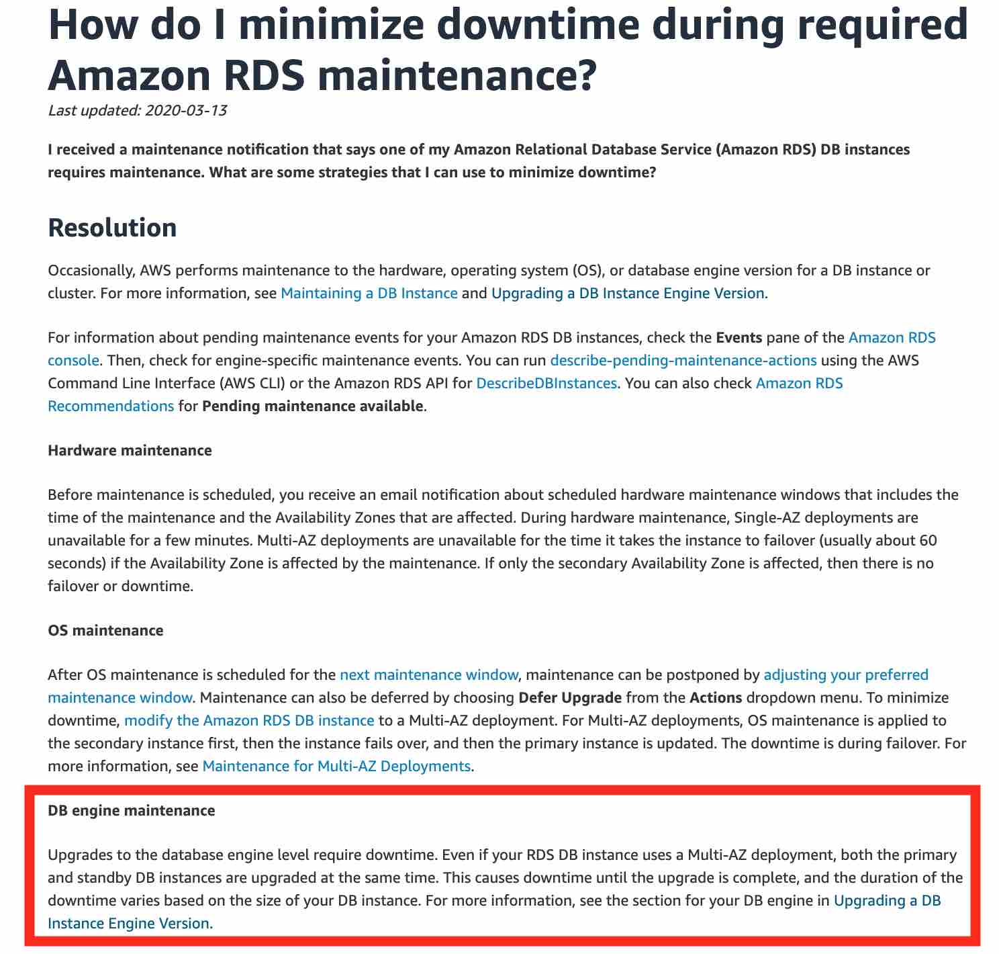

## Q-100

A silicon valley based startup has a content management application with the web-tier running on Amazon EC2 instances and the database tier running on Amazon Aurora. Currently, the entire infrastructure is located in us-east-1 region. The startup has 90% of its customers in the US and Europe. The engineering team is getting reports of deteriorated application performance from customers in Europe with high application load time.

As a solutions architect, which of the following would you recommend addressing these performance issues? (Select two)

- Create Amazon Aurora read replicas in the eu-west-1 region

- Setup another fleet of Amazon EC2 instances for the web tier in the eu-west-1 region. Enable geolocation routing policy in Amazon Route 53

- Setup another fleet of Amazon EC2 instances for the web tier in the eu-west-1 region. Enable latency routing policy in Amazon Route 53

- Create Amazon Aurora Multi-AZ standby instance in the eu-west-1 region

- Setup another fleet of Amazon EC2 instances for the web tier in the eu-west-1 region. Enable failover routing policy in Amazon Route 53

**NOTE**

✔ 1️⃣ Create Amazon Aurora read replicas in the eu-west-1 region

Why?

Allows database reads from Europe

Reduces cross-region DB latency

Aurora supports cross-region read replicas

This is required because if you only move web servers, they would still call a US database → still slow.

✔ 2️⃣ Setup another fleet of EC2 instances in eu-west-1 and enable Latency Routing Policy in Route 53

Why latency routing?

Route 53 automatically routes users to the lowest-latency region

Best for performance optimization

**Geolocation routing**
**Routes based on geographic location** — not optimal latency.
Latency-based routing is better for performance.

**Failover routing**

Used for disaster recovery.
Not for performance optimization.

## Q-101

A Machine Learning research group uses a proprietary computer vision application hosted on an Amazon EC2 instance. Every time the instance needs to be stopped and started again, the application takes about 3 minutes to start as some auxiliary software programs need to be executed so that the application can function. The research group would like to minimize the application boostrap time whenever the system needs to be stopped and then started at a later point in time.

As a solutions architect, which of the following solutions would you recommend for this use-case?

- Use Amazon EC2 User-Data

- Create an Amazon Machine Image (AMI) and launch your Amazon EC2 instances from that

- **Use Amazon EC2 Instance Hibernate**

- Use Amazon EC2 Meta-Data

## Q-102

An IT company has an Access Control Management (ACM) application that uses Amazon RDS for MySQL but is running into performance issues despite using Read Replicas. The company has hired you as a solutions architect to address these performance-related challenges without moving away from the underlying relational database schema. The company has branch offices across the world, and it needs the solution to work on a global scale.

Which of the following will you recommend as the MOST cost-effective and high-performance solution?

- Use Amazon DynamoDB Global Tables to provide fast, local, read and write performance in each region

- Spin up Amazon EC2 instances in each AWS region, install MySQL databases and migrate the existing data into these new databases

- Spin up a Amazon Redshift cluster in each AWS region. Migrate the existing data into Redshift clusters

- **Use Amazon Aurora Global Database to enable fast local reads with low latency in each region**

## Q-103

A financial services company has deployed its flagship application on Amazon EC2 instances. Since the application handles sensitive customer data, the security team at the company wants to ensure that any third-party Secure Sockets Layer certificate (SSL certificate) SSL/Transport Layer Security (TLS) certificates configured on Amazon EC2 instances via the AWS Certificate Manager (ACM) are renewed before their expiry date. The company has hired you as an AWS Certified Solutions Architect Associate to build a solution that notifies the security team 30 days before the certificate expiration. The solution should require the least amount of scripting and maintenance effort.

What will you recommend?

Correct answer
- **Leverage AWS Config managed rule to check if any third-party SSL/TLS certificates imported into ACM are marked for expiration within 30 days. Configure the rule to trigger an Amazon SNS notification to the security team if any certificate expires within 30 days**

- Monitor the days to expiry Amazon CloudWatch metric for certificates imported into ACM. Create a CloudWatch alarm to monitor such certificates based on the days to expiry metric and then trigger a custom action of notifying the security team

Your answer is incorrect
- Monitor the days to expiry Amazon CloudWatch metric for certificates created via ACM. Create a CloudWatch alarm to monitor such certificates based on the days to expiry metric and then trigger a custom action of notifying the security team

- Leverage AWS Config managed rule to check if any SSL/TLS certificates created via ACM are marked for expiration within 30 days. Configure the rule to trigger an Amazon SNS notification to the security team if any certificate expires within 30 days

**NOTE**

- `Certificates created by ACM` are `automatically renewed` by AWS Certificate Manager, so you don’t need to monitor them.

However:

  -   Imported certificates  (third-party certificates) are **NOT automatically renewed**

  - **You are responsible** for **renewing them manually**

  - Therefore, they must be monitored

**Why AWS Config Is the Best Choice**

`Using AWS Config managed rule:`

  - No custom scripting

  - Fully managed compliance check

  - Automatically evaluates certificate expiration

  - Can directly trigger Amazon SNS notification

  - Lowest operational effort

AWS provides a managed rule specifically for ACM certificate expiration monitoring.

## Q-104

A financial services company has developed its flagship application on AWS Cloud with data security requirements such that the encryption key must be stored in a custom application running on-premises. The company wants to offload the data storage as well as the encryption process to Amazon S3 but continue to use the existing encryption key.

Which of the following Amazon S3 encryption options allows the company to leverage Amazon S3 for storing data with given constraints?

- Server-Side Encryption with Amazon S3 managed keys (SSE-S3)

- Client-Side Encryption with data encryption is done on the client-side before sending it to Amazon S3

Correct answer
- **Server-Side Encryption with Customer-Provided Keys (SSE-C)**

Your answer is incorrect
- Server-Side Encryption with AWS Key Management Service (AWS KMS) keys (SSE-KMS)

**NOTE**

`“Encryption key must be stored in a custom application running on-premises.”`

This means:

`The company wants to keep the encryption key on-premises`

- AWS should NOT store or manage the key

- They only want AWS to handle:

- Storage

- Encryption process

**With AWS Key Management Service (SSE-KMS):**

  -  `The key must exist inside AWS KMS`

  - `Even if you import your own key material into KMS, it is still stored and managed inside AWS`

  - `KMS controls lifecycle, storage, availability`

**❗ But the requirement clearly says:**

`Encryption key must be stored in a custom application on-premises`

**✅ Why SSE-C Is Correct**

- With Amazon S3 using SSE-C (Server-Side Encryption with Customer-Provided Keys):

- The customer provides the encryption key with each request

- AWS does NOT store the key

- S3 performs encryption

- The key remains under full customer control (on-premises)

| Feature                 | SSE-KMS | SSE-C |
| ----------------------- | ------- | ----- |
| Key stored in AWS?      | ✅ Yes   | ❌ No  |
| You control rotation?   | ✅ Yes   | ✅ Yes |
| Server-side encryption? | ✅ Yes   | ✅ Yes |
| Key stays on-prem?      | ❌ No    | ✅ Yes |


## Q-105

A retail company wants to rollout and test a blue-green deployment for its global application in the next 48 hours. Most of the customers use mobile phones which are prone to Domain Name System (DNS) caching. The company has only two days left for the annual Thanksgiving sale to commence.

As a Solutions Architect, which of the following options would you recommend to test the deployment on as many users as possible in the given time frame?

- Use AWS CodeDeploy deployment options to choose the right deployment

- Use Amazon Route 53 weighted routing to spread traffic across different deployments

Correct answer
- **Use AWS Global Accelerator to distribute a portion of traffic to a particular deployment**

- Use Elastic Load Balancing (ELB) to distribute traffic across deployments

**NOTE**

**AWS Global Accelerator**

`Global Accelerator:`

  - Uses Anycast IP addresses

  - Does NOT rely on DNS for traffic shifting

  - Traffic routing happens at AWS edge network

  - You can shift traffic instantly between endpoints

  - Works perfectly even with mobile DNS caching

## Q-106

You have a team of developers in your company, and you would like to ensure they can quickly experiment with AWS Managed Policies by attaching them to their accounts, but you would like to prevent them from doing an escalation of privileges, by granting themselves the AdministratorAccess managed policy. How should you proceed?

- Create a Service Control Policy (SCP) on your AWS account that restricts developers from attaching themselves the AdministratorAccess policy

- Put the developers into an IAM group, and then define an IAM permission boundary on the group that will restrict the managed policies they can attach to themselves

- For each developer, define an IAM permission boundary that will restrict the managed policies they can attach to themselves

- Attach an IAM policy to your developers, that prevents them from attaching the AdministratorAccess policy

**NOTE**

- `A permission boundary sets the maximum permissions an IAM user or role can ever have — even if they attach powerful policies.`

Think of it as:

🔒 “You can attach any policy you want, but your effective permissions can never exceed this boundary.”

**✅ Why “Permission Boundary Per Developer” Is Correct**

`Permission boundaries are applied to:`

- IAM users

- IAM roles

- They are **NOT applied** `to groups`.

So:

✔ Each developer must have a permission boundary attached directly
✔ That boundary excludes AdministratorAccess
✔ Even if they attach it, it won’t work

## Q-107

A big data consulting firm needs to set up a data lake on Amazon S3 for a Health-Care client. The data lake is split in raw and refined zones. For compliance reasons, the source data needs to be kept for a minimum of 5 years. The source data arrives in the raw zone and is then processed via an AWS Glue based extract, transform, and load (ETL) job into the refined zone. The business analysts run ad-hoc queries only on the data in the refined zone using Amazon Athena. The team is concerned about the cost of data storage in both the raw and refined zones as the data is increasing at a rate of 1 terabyte daily in each zone.

As a solutions architect, which of the following would you recommend as the MOST cost-optimal solution? (Select two)

**Understood**

- Data stored for 5 years - S3 Deep Glacier but for what `Raw zones` or `Refined zones` ?
- That is, `Raw Zones` - Bcz, `Raw Zones`= Not Processed.
- Data is increase daily by 1TB - `Data will tranfer to Deep Glacier`.

- After data process - Data will stored in `Refined Zones` - **Athena** will ran query on this data. `Refined Data` will ans should stored in S3 as `Compress` or `CSV` file ?

- **AWS Glue Job** can stored data in S3 as both **Compressed** & **CSV**.
- For `Cost Optimize` it should stored as **Compressed** after Athena's Query.

**Summary Points**

Data splited into 1. Raw data , 2. Refined data.

Source data - Kept for 5 years.

source data arrives to Raw zone - process via aws glue - Load to Refined zones.
Athena - Run query on Refined zones data.

Cost for Raw zones and Refined zones + Data increasing by 1TB daily in each zones.


Options:
- Create an AWS Lambda function based job to delete the raw zone data after 1 day

Your selection is correct
- **Setup a lifecycle policy to transition the raw zone data into Amazon S3 Glacier Deep Archive after 1 day of object creation**

- Use AWS Glue ETL job to write the transformed data in the refined zone using CSV format

Your selection is correct
- **Use AWS Glue ETL job to write the transformed data in the refined zone using a compressed file format**

- Setup a lifecycle policy to transition the refined zone data into Amazon S3 Glacier Deep Archive after 1 day of object creation


## Q-108

An application is currently hosted on four Amazon EC2 instances (behind Application Load Balancer) deployed in a single Availability Zone (AZ). To maintain an acceptable level of end-user experience, the application needs at least 4 instances to be always available.

As a solutions architect, which of the following would you recommend so that the application achieves high availability with MINIMUM cost?

Your answer is correct
- **Deploy the instances in three Availability Zones (AZs). Launch two instances in each Availability Zone (AZ)**

- Deploy the instances in one Availability Zones. Launch two instances in the Availability Zone (AZ)

- Deploy the instances in two Availability Zones (AZs). Launch four instances in each Availability Zone (AZ)

- Deploy the instances in two Availability Zones (AZs). Launch two instances in each Availability Zone (AZ)

## Q-109

A company is looking at storing their less frequently accessed files on AWS that can be concurrently accessed by hundreds of Amazon EC2 instances. The company needs the most cost-effective file storage service that provides immediate access to data whenever needed.

Which of the following options represents the best solution for the given requirements?

Amazon Elastic File System (EFS) Standard storage class

Amazon Elastic Block Store (EBS)

Your answer is incorrect
Amazon S3 Standard-Infrequent Access (S3 Standard-IA) storage class

Correct answer
Amazon Elastic File System (EFS) Standard–IA storage class

**NOTE**

🔎 Key Requirements in Question

✅ Less frequently accessed files

✅ Concurrent access by hundreds of EC2 instances

✅ Immediate access

✅ Most cost-effective file storage

The most important word here is:

- **`File storage + concurrently accessed`**

**S3 is:**

- Object storage (NOT file system)

- Accessed via API

- Not mountable like a shared filesystem

**EC2 instances cannot:**

- Mount S3 natively as shared POSIX file system

- Use it like NFS

**✅ Why EFS Standard–IA Is Correct**


**EFS provides:**

✔ Shared file system (NFS)
✔ Can be mounted by hundreds or thousands of EC2 instances
✔ Immediate access (no retrieval delay)
✔ Standard–IA = cheaper for infrequent access

**EFS has two tiers:**

- Standard → frequent access

- Standard-IA → infrequent access (cheaper storage)

So this matches ALL requirements.

## Q-110

An HTTP application is deployed on an Auto Scaling Group, is accessible from an Application Load Balancer (ALB) that provides HTTPS termination, and accesses a PostgreSQL database managed by Amazon RDS.

How should you configure the security groups? (Select three)

- The security group of the Application Load Balancer should have an inbound rule from anywhere on port 80

- The security group of Amazon RDS should have an inbound rule from the security group of the Amazon EC2 instances in the Auto Scaling group on port 80

- The security group of the Amazon EC2 instances should have an inbound rule from the security group of the Amazon RDS database on port 5432

- **The security group of the Amazon EC2 instances should have an inbound rule from the security group of the Application Load Balancer on port 80**

- **The security group of Amazon RDS should have an inbound rule from the security group of the Amazon EC2 instances in the Auto Scaling group on port 5432**

Correct selection
- **The security group of the Application Load Balancer should have an inbound rule from anywhere on port 443**

**NOTE**

✅ ALB SG allows HTTPS (443) from internet
✅ EC2 SG allows HTTP (80) from ALB SG
✅ RDS SG allows PostgreSQL (5432) from EC2 SG

## Q-111

An IT company wants to optimize the costs incurred on its fleet of 100 Amazon EC2 instances for the next year. Based on historical analyses, the engineering team observed that 70 of these instances handle the compute services of its flagship application and need to be always available. The other 30 instances are used to handle batch jobs that can afford a delay in processing.

As a solutions architect, which of the following would you recommend as the MOST cost-optimal solution?

- Purchase 70 on-demand instances and 30 reserved instances

- Purchase 70 on-demand instances and 30 spot instances

- Purchase 70 reserved instances and 30 on-demand instances

- **Purchase 70 reserved instances (RIs) and 30 spot instances**

## Q-112

A retail company wants to share sensitive accounting data that is stored in an Amazon RDS database instance with an external auditor. The auditor has its own AWS account and needs its own copy of the database.

Which of the following would you recommend to securely share the database with the auditor?

- Export the database contents to text files, store the files in Amazon S3, and create a new IAM user for the auditor with access to that bucket

- **Create an encrypted snapshot of the database, share the snapshot, and allow access to the AWS Key Management Service (AWS KMS) encryption key**

- Create a snapshot of the database in Amazon S3 and assign an IAM role to the auditor to grant access to the object in that bucket

- Set up a read replica of the database and configure IAM standard database authentication to grant the auditor access

**NOTE**
- Automated backup snapshot can't sharable.
- Only manually snapshot backup can be sharable.

## !-113

A company has historically operated only in the us-east-1 region and stores encrypted data in Amazon S3 using SSE-KMS. As part of enhancing its security posture as well as improving the backup and recovery architecture, the company wants to store the encrypted data in Amazon S3 that is replicated into the us-west-1 AWS region. The security policies mandate that the data must be encrypted and decrypted using the same key in both AWS regions.

Which of the following represents the best solution to address these requirements?

Create a new Amazon S3 bucket in the us-east-1 region with replication enabled from this new bucket into another bucket in us-west-1 region. Enable SSE-KMS encryption on the new bucket in us-east-1 region by using an AWS KMS multi-region key. Copy the existing data from the current Amazon S3 bucket in us-east-1 region into this new Amazon S3 bucket in us-east-1 region

Change the AWS KMS single region key used for the current Amazon S3 bucket into an AWS KMS multi-region key. Enable Amazon S3 batch replication for the existing data in the current bucket in us-east-1 region into another bucket in us-west-1 region

Create an Amazon CloudWatch scheduled rule to invoke an AWS Lambda function to copy the daily data from the source bucket in us-east-1 region to the destination bucket in us-west-1 region. Provide AWS KMS key access to the AWS Lambda function for encryption and decryption operations on the data in the source and destination Amazon S3 buckets

Enable replication for the current bucket in us-east-1 region into another bucket in us-west-1 region. Share the existing AWS KMS key from us-east-1 region to us-west-1 region

**NOTE**

**“Data must be encrypted and decrypted using the same key in both AWS regions.”**

- This is the most critical sentence.

**Normal AWS Key Management Service keys are:**

- Regional

- Cannot be shared across regions

- Cannot simply be “shared” to another region

So option:

`“Share the existing KMS key from us-east-1 to us-west-1”`

- ❌ Impossible. KMS keys cannot be shared across regions.

**That's for, you will require to create new S3 in `us-east-1` with Multi-AZ Encryption Key, Enable Replication to `us-west-1` S3, Copy Existing data into `us-west-1`.**

## Q-114

You would like to use AWS Snowball to move on-premises backups into a long term archival tier on AWS. Which solution provides the MOST cost savings?

- Create an AWS Snowball job and target a Amazon S3 Glacier Vault

- Create an AWS Snowball job and target an Amazon S3 bucket. Create a lifecycle policy to transition this data to Amazon S3 Glacier on the same day

- **Create an AWS Snowball job and target an Amazon S3 bucket. Create a lifecycle policy to transition this data to Amazon S3 Glacier Deep Archive on the same day**

- Create a AWS Snowball job and target an Amazon S3 Glacier Deep Archive Vault

**NOTE**

- AWS Snowball can import data into:

- Amazon S3 buckets

- It does NOT directly write to:

  - Glacier Vaults

  - Also, the older “Glacier Vault” model is legacy compared to S3 Glacier storage classes.

✅ Correct Flow (Best Practice)

1️⃣ Snowball → Upload into Amazon S3 bucket
2️⃣ Apply lifecycle rule
3️⃣ Transition immediately to Amazon S3 Glacier Deep Archive

## Q-115

A social photo-sharing web application is hosted on Amazon Elastic Compute Cloud (Amazon EC2) instances behind an Elastic Load Balancer. The app gives the users the ability to upload their photos and also shows a leaderboard on the homepage of the app. The uploaded photos are stored in Amazon Simple Storage Service (Amazon S3) and the leaderboard data is maintained in Amazon DynamoDB. The Amazon EC2 instances need to access both Amazon S3 and Amazon DynamoDB for these features.

As a solutions architect, which of the following solutions would you recommend as the MOST secure option?

- Encrypt the AWS credentials via a custom encryption library and save it in a secret directory on the Amazon EC2 instances. The application code can then safely decrypt the AWS credentials to make the API calls to Amazon S3 and Amazon DynamoDB

- Configure AWS CLI on the Amazon EC2 instances using a valid IAM user's credentials. The application code can then invoke shell scripts to access Amazon S3 and Amazon DynamoDB via AWS CLI

- **Attach the appropriate IAM role to the Amazon EC2 instance profile so that the instance can access Amazon S3 and Amazon DynamoDB**

- Save the AWS credentials (access key Id and secret access token) in a configuration file within the application code on the Amazon EC2 instances. Amazon EC2 instances can use these credentials to access Amazon S3 and Amazon DynamoDB

## Q-116

To improve the performance and security of the application, the engineering team at a company has created an Amazon CloudFront distribution with an Application Load Balancer as the custom origin. The team has also set up an AWS Web Application Firewall (AWS WAF) with Amazon CloudFront distribution. The security team at the company has noticed a surge in malicious attacks from a specific IP address to steal sensitive data stored on the Amazon EC2 instances.

As a solutions architect, which of the following actions would you recommend to stop the attacks?

- Create a deny rule for the malicious IP in the network access control list (network ACL) associated with each of the instances

- **Create an IP match condition in the AWS WAF to block the malicious IP address**

- Create a deny rule for the malicious IP in the Security Groups associated with each of the instances

- Create a ticket with AWS support to take action against the malicious IP

## Q-117

Upon a security review of your AWS account, an AWS consultant has found that a few Amazon RDS databases are unencrypted. As a Solutions Architect, what steps must be taken to encrypt the Amazon RDS databases?

- Create a Read Replica of the database, and encrypt the read replica. Promote the read replica as a standalone database, and terminate the previous database

- **Take a snapshot of the database, copy it as an encrypted snapshot, and restore a database from the encrypted snapshot. Terminate the previous database**

- Enable Multi-AZ for the database, and make sure the standby instance is encrypted. Stop the main database to that the standby database kicks in, then disable Multi-AZ

- Enable encryption on the Amazon RDS database using the AWS Console

## Q-118

A financial institution is transitioning its critical back-office systems to AWS. These systems currently rely on Microsoft SQL Server databases hosted on on-premises infrastructure. The data is highly sensitive and subject to regulatory compliance. The organization wants to enhance security and minimize database management tasks as part of the migration.

Which solution will best meet these goals with the least operational burden?

- Move the SQL Server data into Amazon Timestream to gain time series insights. Use AWS CloudTrail to monitor access to the data

- **Migrate the SQL Server databases to a Multi-AZ Amazon RDS for SQL Server deployment. Enable encryption at rest by using an AWS Key Management Service (AWS KMS) managed key**

- Migrate the SQL Server databases to Amazon EC2 instances with encrypted EBS volumes. Use an AWS KMS customer managed key to enable encryption

- Export the SQL Server databases to CSV format and store them in Amazon S3 with S3 bucket policies for access control. Use AWS Backup for data protection

## Q-119

An e-commerce application uses an Amazon Aurora Multi-AZ deployment for its database. While analyzing the performance metrics, the engineering team has found that the database reads are causing high input/output (I/O) and adding latency to the write requests against the database.

As an AWS Certified Solutions Architect Associate, what would you recommend to separate the read requests from the write requests?

- Provision another Amazon Aurora database and link it to the primary database as a read replica

- **Set up a read replica and modify the application to use the appropriate endpoint**

- Activate read-through caching on the Amazon Aurora database

- Configure the application to read from the Multi-AZ standby instance

**NOTE**

- Multi-AZ RDS - Doesn't supports to Read replicas.
- Writing req cause means - Writing req are getting slow.
- Adding high latency means - Latency is high - cause user req are not responding.

`How to seperate Read and Write request ?`

**By Setup a read replicas and use this replicas as endpoint to db.**

## Q-120

The engineering manager for a content management application wants to set up Amazon RDS read replicas to provide enhanced performance and read scalability. The manager wants to understand the data transfer charges while setting up Amazon RDS read replicas.

Which of the following would you identify as correct regarding the data transfer charges for Amazon RDS read replicas?

- There are data transfer charges for replicating data within the same Availability Zone (AZ)

- There are data transfer charges for replicating data within the same AWS Region

- There are no data transfer charges for replicating data across AWS Regions

- **There are data transfer charges for replicating data across AWS Regions**

**NOTE**

- Data Transfer charge is applicable only while **Across AZ** & **Across Regions**.
- There are **NO Data Transfer Charge** for `within single AZ`.

## Q-121

A company has recently launched a new mobile gaming application that the users are adopting rapidly. The company uses Amazon RDS MySQL as the database. The engineering team wants an urgent solution to this issue where the rapidly increasing workload might exceed the available database storage.

As a solutions architect, which of the following solutions would you recommend so that it requires minimum development and systems administration effort to address this requirement?

- Migrate RDS MySQL database to Amazon Aurora which offers storage auto-scaling

- **Enable storage auto-scaling for Amazon RDS MySQL**

- Create read replica for Amazon RDS MySQL

- Migrate Amazon RDS MySQL database to Amazon DynamoDB which automatically allocates storage space when required

**NOTE**

**In Amazon RDS for MySQL:**

You can enable:

Storage Auto Scaling

`When enabled:`

- RDS automatically increases allocated storage

- No downtime

- No migration

- Minimal admin effort

`You just set:`

- Maximum storage threshold

- AWS handles the rest

## Q-122

**NOTE**

**AWS Global Accelerator**

It is a networking service that:

- Provides static Anycast IP addresses

- Routes traffic through AWS global backbone

- Sends users to the closest healthy endpoint

- Reduces latency & improves connection time

- Works at TCP/UDP layer (Layer 4)

**How Many Types of Accelerators?**

`There are 2 types:`

**1. Standard Accelerator (Most common)**

- Used for web apps

- Supports ALB, NLB, EC2, Elastic IP

- TCP/UDP traffic

`Most exam questions use this`

**2. Custom Routing Accelerator**

- Used for very specific port-level routing

- Rare in SAA exam

👉 In 95% of SAA questions → Standard Accelerator


**If question says:**

`“Improve latency using DNS routing”`

  - → Route 53 Latency policy

**If question says:**

  - “Improve TCP connection performance”
  - “Reduce connection time”
  - “Global real-time application”
  - “Gaming / Video conferencing”

`→ Global Accelerator`

## Q-123

The engineering team at a logistics company has noticed that the Auto Scaling group (ASG) is not terminating an unhealthy Amazon EC2 instance.

As a Solutions Architect, which of the following options would you suggest to troubleshoot the issue? (Select three)

- The Amazon EC2 instance could be a spot instance type, which cannot be terminated by the Auto Scaling group (ASG)

- **The instance has failed the Elastic Load Balancing (ELB) health check status**

- A user might have updated the configuration of the Auto Scaling group (ASG) and increased the minimum number of instances forcing ASG to keep all instances alive

- **The instance maybe in Impaired status**

- A custom health check might have failed. The Auto Scaling group (ASG) does not terminate instances that are set unhealthy by custom checks

- **The health check grace period for the instance has not expired**


## Q-124

An e-commerce company operates multiple AWS accounts and has interconnected these accounts in a hub-and-spoke style using the AWS Transit Gateway. Amazon Virtual Private Cloud (Amazon VPCs) have been provisioned across these AWS accounts to facilitate network isolation.

Which of the following solutions would reduce both the administrative overhead and the costs while providing shared access to services required by workloads in each of the VPCs?

- Use Transit VPC to reduce cost and share the resources across Amazon Virtual Private Cloud (Amazon VPCs)

Your answer is correct
- **Build a shared services Amazon Virtual Private Cloud (Amazon VPC)**

- Use VPCs connected with AWS Direct Connect

- Use Fully meshed VPC Peering connection

Overall explanation
Correct option:

Build a shared services Amazon Virtual Private Cloud (Amazon VPC)

- Consider an organization that has built a hub-and-spoke network with AWS Transit Gateway. 
- VPCs have been provisioned into multiple AWS accounts, perhaps to facilitate network isolation or to enable delegated network administration. 
- When deploying distributed architectures such as this, a popular approach is to build a "shared services VPC, which provides access to services required by workloads in each of the VPCs. 
- This might include directory services or VPC endpoints. 
- Sharing resources from a central location instead of building them in each VPC may reduce administrative overhead and cost.

## Q-125

Your company has a monthly big data workload, running for about 2 hours, which can be efficiently distributed across multiple servers of various sizes, with a variable number of CPUs. The solution for the workload should be able to withstand server failures.

Which is the MOST cost-optimal solution for this workload?

**withstand server failures means ?**

  - `If one or more servers fail during the job, the workload should continue running without failing completely.`

- Run the workload on Spot Instances

- **Run the workload on a Spot Fleet**

- Run the workload on Reserved Instances (RI)

- Run the workload on Dedicated Hosts


---

## Q-126

A financial services firm runs a containerized risk analytics tool in its on-premises data center using Docker. The tool depends on persistent data storage for maintaining customer simulation results and operates on a single host machine where the volume is locally mounted. The infrastructure team is looking to replatform the tool to AWS using a fully managed service because they want to avoid managing EC2 instances, volumes, or underlying servers.

Which AWS solution best meets these requirements?

- Use Amazon ECS with Fargate launch type. Attach an Amazon S3 bucket using a shared access script that mounts the S3 bucket into the container for data storage

- **Use Amazon ECS with Fargate launch type. Provision an Amazon Elastic File System (Amazon EFS) file system. Mount the EFS volume inside the container at runtime to provide persistent storage access**

- Use AWS Lambda with a container image runtime. Store stateful data in temporary local storage (/tmp) and sync with Amazon S3 periodically

- Use Amazon EKS with managed node groups. Provision an Amazon EBS volume and mount it inside the container by creating a Kubernetes persistent volume and claim. Manage storage lifecycle manually

## Q-127

The engineering team at a company wants to use Amazon Simple Queue Service (Amazon SQS) to decouple components of the underlying application architecture. However, the team is concerned about the VPC-bound components accessing Amazon Simple Queue Service (Amazon SQS) over the public internet.

As a solutions architect, which of the following solutions would you recommend to address this use-case?

- Use Internet Gateway to access Amazon SQS

- **Use VPC endpoint to access Amazon SQS**

- Use Network Address Translation (NAT) instance to access Amazon SQS

- Use VPN connection to access Amazon SQS


## Q-128

A financial services company is migrating their messaging queues from self-managed message-oriented middleware systems to Amazon Simple Queue Service (Amazon SQS). The development team at the company wants to minimize the costs of using Amazon SQS.

As a solutions architect, which of the following options would you recommend for the given use-case?

- **Use SQS long polling to retrieve messages from your Amazon SQS queues**

 Use SQS message timer to retrieve messages from your Amazon SQS queues

- Use SQS short polling to retrieve messages from your Amazon SQS queues

- Use SQS visibility timeout to retrieve messages from your Amazon SQS queues

**NOTE**

What is Long Polling in Amazon Simple Queue Service?

When a consumer asks SQS:

“Do you have any messages?”

There are two ways SQS can respond:

1️⃣ Short Polling (Default)

Immediately checks the queue.

If no messages → returns empty response.

You still pay for the API call.

If your app polls every second and queue is empty:
👉 You pay for thousands of useless requests.

💸 More API calls = More cost

2️⃣ Long Polling (Recommended)

SQS waits (up to 20 seconds).

If a message arrives → returns immediately.

If no message → returns after timeout.

✅ Reduces empty responses
✅ Reduces API calls
✅ Reduces cost
✅ Improves efficiency

That’s why it is MOST cost-optimal.


## Q-129

A retail company has connected its on-premises data center to the AWS Cloud via AWS Direct Connect. The company wants to be able to resolve Domain Name System (DNS) queries for any resources in the on-premises network from the AWS VPC and also resolve any DNS queries for resources in the AWS VPC from the on-premises network.

As a solutions architect, which of the following solutions can be combined to address the given use case? (Select two)

- **Create an inbound endpoint on Amazon Route 53 Resolver and then DNS resolvers on the on-premises network can forward DNS queries to Amazon Route 53 Resolver via this endpoint**

- **Create an outbound endpoint on Amazon Route 53 Resolver and then Amazon Route 53 Resolver can conditionally forward queries to resolvers on the on-premises network via this endpoint**

- Create a universal endpoint on Amazon Route 53 Resolver and then Amazon Route 53 Resolver can receive and forward queries to resolvers on the on-premises network via this endpoint

- Create an inbound endpoint on Amazon Route 53 Resolver and then Amazon Route 53 Resolver can conditionally forward queries to resolvers on the on-premises network via this endpoint

- Create an outbound endpoint on Amazon Route 53 Resolver and then DNS resolvers on the on-premises network can forward DNS queries to Amazon Route 53 Resolver via this endpoint

**NOTE**

Case 1️⃣ VPC → On-Prem

An EC2 instance inside VPC needs:

db.corp.local


This record exists on on-prem DNS server.

So what happens?

EC2 asks Route 53 Resolver (inside VPC)

Route 53 Resolver does not know corp.local

It uses Outbound Endpoint

It forwards query to On-prem DNS server

So here:
👉 Route 53 Resolver is forwarding.

That’s why the option says:

Route 53 Resolver can conditionally forward queries to on-prem resolvers

Correct.

Case 2️⃣ On-Prem → VPC

Now on-prem server needs:

app.internal.aws


This record exists in a Private Hosted Zone in AWS.

So what happens?

On-prem server asks its local DNS server

On-prem DNS server does not know aws domain

It forwards the query to AWS

It sends query to Inbound Endpoint

Route 53 Resolver answers

So here:
👉 On-prem DNS server is forwarding.

That’s why the option says:

DNS resolvers on-prem can forward DNS queries to Route 53 Resolver

## Q-130

Your application is hosted by a provider on yourapp.provider.com. You would like to have your users access your application using www.your-domain.com, which you own and manage under Amazon Route 53.

Which Amazon Route 53 record should you create?

- Create an A record

- Create a PTR record

- Create an Alias Record

- **Create a CNAME record**

## Q-131

The database backend for a retail company's website is hosted on Amazon RDS for MySQL having a primary instance and three read replicas to support read scalability. The company has mandated that the read replicas should lag no more than 1 second behind the primary instance to provide the best possible user experience. The read replicas are falling further behind during periods of peak traffic spikes, resulting in a bad user experience as the searches produce inconsistent results.

You have been hired as an AWS Certified Solutions Architect - Associate to reduce the replication lag as much as possible with minimal changes to the application code or the effort required to manage the underlying resources.

Which of the following will you recommend?

- Set up an Amazon ElastiCache for Redis cluster in front of the MySQL database. Update the website to check the cache before querying the read replicas

- Set up database migration from Amazon RDS MySQL to Amazon DynamoDB. Provision a large number of read capacity units (RCUs) to support the required throughput and enable Auto-Scaling

- Host the MySQL primary database on a memory-optimized Amazon EC2 instance. Spin up additional compute-optimized Amazon EC2 instances to host the read replicas

- **Set up database migration from Amazon RDS MySQL to Amazon Aurora MySQL. Swap out the MySQL read replicas with Aurora Replicas. Configure Aurora Auto Scaling**

**NOTE**

- Aurora features a distributed, fault-tolerant, and self-healing storage system that is decoupled from compute resources and auto-scales up to 128 TiB per database instance. - It delivers high performance and availability with up to 15 low-latency read replicas, point-in-time recovery, continuous backup to Amazon Simple Storage Service (Amazon S3), and replication across three Availability Zones (AZs).

- Since Amazon Aurora Replicas share the same data volume as the primary instance in the same AWS Region, there is virtually no replication lag. 
- The replica lag times are in the 10s of milliseconds (compared to the replication lag of seconds in the case of MySQL read replicas). 
- Therefore, this is the right option to ensure that the read replicas lag no more than 1 second behind the primary instance.


## Q-132

The application maintenance team at a company has noticed that the production application is very slow when the business reports are run on the Amazon RDS database. These reports fetch a large amount of data and have complex queries with multiple joins, spanning across multiple business-critical core tables. CPU, memory, and storage metrics are around 50% of the total capacity.

Can you recommend an improved and cost-effective way of generating the business reports while keeping the production application unaffected?

- Migrate from General Purpose SSD to magnetic storage to enhance IOPS

- Configure the Amazon RDS instance to be Multi-AZ DB instance, and connect the report generation tool to the DB instance in a different AZ

- **Create a read replica and connect the report generation tool/application to it**

- Increase the size of Amazon RDS instance

## Q-133

An IT training company hosted its website on Amazon S3 a couple of years ago. Due to COVID-19 related travel restrictions, the training website has suddenly gained traction. With an almost 300% increase in the requests served per day, the company's AWS costs have sky-rocketed for just the Amazon S3 outbound data costs.

As a Solutions Architect, can you suggest an alternate method to reduce costs while keeping the latency low?

- Use Amazon EFS service, as it provides a shared, scalable, fully managed elastic NFS file system for storing AWS Cloud or on-premises data

- **Configure Amazon CloudFront to distribute the data hosted on Amazon S3 cost-effectively**

- To reduce Amazon S3 cost, the data can be saved on an Amazon EBS volume connected to an Amazon EC2 instance that can host the application

- Configure Amazon S3 Batch Operations to read data in bulk at one go, to reduce the number of calls made to Amazon S3 buckets

**NOTE**

**If the problem mentions “high S3 data transfer cost” → think CloudFront**

## Q-134

The DevOps team at an IT company has created a custom VPC (V1) and attached an Internet Gateway (I1) to the VPC. The team has also created a subnet (S1) in this custom VPC and added a route to this subnet's route table (R1) that directs internet-bound traffic to the Internet Gateway. Now the team launches an Amazon EC2 instance (E1) in the subnet S1 and assigns a public IPv4 address to this instance. Next the team also launches a Network Address Translation (NAT) instance (N1) in the subnet S1.

Under the given infrastructure setup, which of the following entities is doing the Network Address Translation for the Amazon EC2 instance E1?

- Route Table (R1)

- **Internet Gateway (I1)**

- Subnet (S1)

- Network Address Translation (NAT) instance (N1)

**NOTE**

- NAT Instance is deployed in Public Subnet have IGW.
- Pvt subnet have only pvt ec2, there is no nat gateway in pvt subnet.

- In Public Subnet Route table - Route added for IGW from 0.0.0.0/0.
- NAT Instance deployed in public subnet. Will take Internet from IGW.

- Update Pvt Route table to add Routing 0.0.0.0/0 from NAT Instance IP.


## Q-135

A global pharmaceutical company wants to move most of the on-premises data into Amazon S3, Amazon Elastic File System (Amazon EFS), and Amazon FSx for Windows File Server easily, quickly, and cost-effectively.

As a solutions architect, which of the following solutions would you recommend as the BEST fit to automate and accelerate online data transfers to these AWS storage services?

- Use File Gateway to automate and accelerate online data transfers to the given AWS storage services

- Use AWS Snowball Edge Storage Optimized device to automate and accelerate online data transfers to the given AWS storage services

- Use AWS Transfer Family to automate and accelerate online data transfers to the given AWS storage services

- **Use AWS DataSync to automate and accelerate online data transfers to the given AWS storage services**

**NOTE**

- AWS DataSync is an online data transfer service that simplifies, automates, and accelerates copying large amounts of data to and from AWS storage services over the internet or AWS Direct Connect.

- AWS DataSync fully automates and accelerates moving large active datasets to AWS, up to 10 times faster than command-line tools. 
- It is natively integrated with Amazon S3, Amazon EFS, Amazon FSx for Windows File Server, Amazon CloudWatch, and AWS CloudTrail, which provides seamless and secure access to your storage services, as well as detailed monitoring of the transfer.

## Q-136

A company has a license-based, expensive, legacy commercial database solution deployed at its on-premises data center. The company wants to migrate this database to a more efficient, open-source, and cost-effective option on AWS Cloud. The CTO at the company wants a solution that can handle complex database configurations such as secondary indexes, foreign keys, and stored procedures.

As a solutions architect, which of the following AWS services should be combined to handle this use-case? (Select two)

- Basic Schema Copy

- **AWS Database Migration Service (AWS DMS)**

- **AWS Schema Conversion Tool (AWS SCT)**

- AWS Snowball Edge

- AWS Glue

**Overall explanation**
Correct options:

**AWS Schema Conversion Tool (AWS SCT)**

**AWS Database Migration Service (AWS DMS)**

- AWS Database Migration Service helps you migrate databases to AWS quickly and securely. 
- The source database remains fully operational during the migration, minimizing downtime to applications that rely on the database. 
- AWS Database Migration Service supports homogeneous migrations such as Oracle to Oracle, as well as heterogeneous migrations between different database platforms, such as Oracle or Microsoft SQL Server to Amazon Aurora.


- Given the use-case where the CTO at the company wants to move away from license-based, expensive, legacy commercial database solutions deployed at the on-premises data center to more efficient, open-source, and cost-effective options on AWS Cloud, this is an example of heterogeneous database migrations.


- For such a scenario, the source and target databases engines are different, like in the case of Oracle to Amazon Aurora, Oracle to PostgreSQL, or Microsoft SQL Server to MySQL migrations. 
- In this case, the schema structure, data types, and database code of source and target databases can be quite different, requiring a schema and code transformation before the data migration starts.


- That makes heterogeneous migrations a two-step process. 
- First use the AWS Schema Conversion Tool to convert the source schema and code to match that of the target database, and then use the AWS Database Migration Service to migrate data from the source database to the target database. 
- All the required data type conversions will automatically be done by the AWS Database Migration Service during the migration. 
- The source database can be located on your on-premises environment outside of AWS, running on an Amazon EC2 instance, or it can be an Amazon RDS database. 
- The target can be a database in Amazon EC2 or Amazon RDS.

## Q-137

A big data analytics company is working on a real-time vehicle tracking solution. The data processing workflow involves both I/O intensive and throughput intensive database workloads. The development team needs to store this real-time data in a NoSQL database hosted on an Amazon EC2 instance and needs to support up to 25,000 IOPS per volume.

As a solutions architect, which of the following Amazon Elastic Block Store (Amazon EBS) volume types would you recommend for this use-case?

- **Provisioned IOPS SSD (io1)**

- General Purpose SSD (gp2)

- Throughput Optimized HDD (st1)

- Cold HDD (sc1)

**Overall Explainations**

**Provisioned IOPS SSD (io1)**

- Provisioned IOPS SSD (io1) is backed by solid-state drives (SSDs) and is a high-performance Amazon EBS storage option designed for critical, I/O intensive database and application workloads, as well as throughput-intensive database workloads. io1 is designed to deliver a consistent baseline performance of up to 50 IOPS/GB to a maximum of 64,000 IOPS and provide up to 1,000 MB/s of throughput per volume. Therefore, the io1 volume type would be able to meet the requirement of 25,000 IOPS per volume for the given use-case.

`Incorrect options:`

**General Purpose SSD (gp2)** - gp2 is backed by solid-state drives (SSDs) and is suitable for a broad range of transactional workloads, including dev/test environments, low-latency interactive applications, and boot volumes. It supports max IOPS/Volume of 16,000.

## Q-138

An e-commerce company uses Microsoft Active Directory to provide users and groups with access to resources on the on-premises infrastructure. The company has extended its IT infrastructure to AWS in the form of a hybrid cloud. The engineering team at the company wants to run directory-aware workloads on AWS for a SQL Server-based application. The team also wants to configure a trust relationship to enable single sign-on (SSO) for its users to access resources in either domain.

As a solutions architect, which of the following AWS services would you recommend for this use-case?

- Active Directory Connector

- Amazon Cloud Directory

- **AWS Directory Service for Microsoft Active Directory (AWS Managed Microsoft AD)**

- Simple Active Directory (Simple AD)

**Overall explanation**
Correct option:

- **AWS Directory Service for Microsoft Active Directory (AWS Managed Microsoft AD)**

- AWS Directory Service provides multiple ways to use Amazon Cloud Directory and Microsoft Active Directory (AD) with other AWS services.

- AWS Directory Service for Microsoft Active Directory (aka AWS Managed Microsoft AD) is powered by an actual Microsoft Windows Server Active Directory (AD), managed by AWS. With AWS Managed Microsoft AD, you can run directory-aware workloads in the AWS Cloud such as SQL Server-based applications. You can also configure a trust relationship between AWS Managed Microsoft AD in the AWS Cloud and your existing on-premises Microsoft Active Directory, providing users and groups with access to resources in either domain, using single sign-on (SSO).

`Incorrect options:`

- **Active Directory Connector** - `Use AD Connector if you only need to allow your on-premises users to log in to AWS applications and services with their Active Directory credentials. AD Connector simply connects your existing on-premises Active Directory to AWS. You cannot use it to run directory-aware workloads on AWS, hence this option is not correct.`

## Q-139

An online gaming application has a large chunk of its traffic coming from users who download static assets such as historic leaderboard reports and the game tactics for various games. The current infrastructure and design are unable to cope up with the traffic and application freezes on most of the pages.

Which of the following is a cost-optimal solution that does not need provisioning of infrastructure?

- Use AWS Lambda with Amazon ElastiCache and Amazon RDS for serving static assets at high speed and low latency

- Configure AWS Lambda with an Amazon RDS database to provide a serverless architecture

- Use Amazon CloudFront with Amazon DynamoDB for greater speed and low latency access to static assets

- **Use Amazon CloudFront with Amazon S3 as the storage solution for the static assets**

**NOTE**

**Overall explanation**

`Correct option:`

- **Use Amazon CloudFront with Amazon S3 as the storage solution for the static assets**

- `When you put your content in an Amazon S3 bucket in the cloud, a lot of things become much easier. First, you don’t need to plan for and allocate a specific amount of storage space because Amazon S3 buckets scale automatically. As Amazon S3 is a serverless service, you don’t need to manage or patch servers that store files yourself; you just put and get your content. Finally, even if you require a server for your application (for example, because you have a dynamic application), the server can be smaller because it doesn’t have to handle requests for static content.`

- `Amazon CloudFront is a content delivery network (CDN) service that delivers static and dynamic web content, video streams, and APIs around the world, securely and at scale. By design, delivering data out of Amazon CloudFront can be more cost-effective than delivering it from Amazon S3 directly to your users. Amazon CloudFront serves content through a worldwide network of data centers called Edge Locations. Using edge servers to cache and serve content improves performance by providing content closer to where viewers are located.`

- `When a user requests content that you serve with Amazon CloudFront, their request is routed to a nearby Edge Location. If Amazon CloudFront has a cached copy of the requested file, CloudFront delivers it to the user, providing a fast (low-latency) response. If the file they’ve requested isn’t yet cached, CloudFront retrieves it from your origin – for example, the Amazon S3 bucket where you’ve stored your content. Then, for the next local request for the same content, it’s already cached nearby and can be served immediately.`

- `By caching your content in Edge Locations, Amazon CloudFront reduces the load on your Amazon S3 bucket and helps ensure a faster response for your users when they request content. Also, data transfer out for content by using Amazon CloudFront is often more cost-effective than serving files directly from Amazon S3, and there is no data transfer fee from Amazon S3 to Amazon CloudFront. You only pay for what is delivered to the internet from Amazon CloudFront, plus request fees.`

## Q-140

An IT company hosts windows based applications on its on-premises data center. The company is looking at moving the business to the AWS Cloud. The cloud solution should offer shared storage space that multiple applications can access without a need for replication. Also, the solution should integrate with the company's self-managed Active Directory domain.

Which of the following solutions addresses these requirements with the minimal integration effort?

- Use File Gateway of AWS Storage Gateway to create a hybrid storage solution

- Use Amazon Elastic File System (Amazon EFS) as a shared storage solution

- Use Amazon FSx for Lustre as a shared storage solution with millisecond latencies

- **Use Amazon FSx for Windows File Server as a shared storage solution**

**NOTE**

**Overall explanation**

`Correct option:`

- **Use Amazon FSx for Windows File Server as a shared storage solution**

- `Amazon FSx for Windows File Server provides fully managed, highly reliable, and scalable file storage that is accessible over the industry-standard Server Message Block (SMB) protocol. It is built on Windows Server, delivering a wide range of administrative features such as user quotas, end-user file restore, and Microsoft Active Directory (AD) integration. It offers single-AZ and multi-AZ deployment options, fully managed backups, and encryption of data at rest and in transit. You can optimize cost and performance for your workload needs with SSD and HDD storage options; and you can scale storage and change the throughput performance of your file system at any time.`

- `With Amazon FSx, you get highly available and durable file storage starting from $0.013 per GB-month. Data deduplication enables you to optimize costs even further by removing redundant data. You can increase your file system storage and scale throughput capacity at any time, making it easy to respond to changing business needs. There are no upfront costs or licensing fees.`

**Incorrect Options**

- Use Amazon FSx for Lustre as a shared storage solution with millisecond latencies - Amazon FSx for Lustre is a fully managed service that provides cost-effective, high-performance storage for compute workloads. Many workloads such as machine learning, high performance computing (HPC), video rendering, and financial simulations depend on compute instances accessing the same set of data through high-performance shared storage. Lustre is Linux based, hence it is not the right choice since the use case is about Windows-based applications.

## Q-141

An e-commerce company is using Elastic Load Balancing (ELB) for its fleet of Amazon EC2 instances spread across two Availability Zones (AZs), with one instance as a target in Availability Zone A and four instances as targets in Availability Zone B. The company is doing benchmarking for server performance when cross-zone load balancing is enabled compared to the case when cross-zone load balancing is disabled.

As a solutions architect, which of the following traffic distribution outcomes would you identify as correct?

- With cross-zone load balancing enabled, one instance in Availability Zone A receives 20% traffic and four instances in Availability Zone B receive 20% traffic each. With cross-zone load balancing disabled, one instance in Availability Zone A receives no traffic and four instances in Availability Zone B receive 25% traffic each

- With cross-zone load balancing enabled, one instance in Availability Zone A receives 50% traffic and four instances in Availability Zone B receive 12.5% traffic each. With cross-zone load balancing disabled, one instance in Availability Zone A receives 20% traffic and four instances in Availability Zone B receive 20% traffic each

- With cross-zone load balancing enabled, one instance in Availability Zone A receives no traffic and four instances in Availability Zone B receive 25% traffic each. With cross-zone load balancing disabled, one instance in Availability Zone A receives 50% traffic and four instances in Availability Zone B receive 12.5% traffic each

- **With cross-zone load balancing enabled, one instance in Availability Zone A receives 20% traffic and four instances in Availability Zone B receive 20% traffic each. With cross-zone load balancing disabled, one instance in Availability Zone A receives 50% traffic and four instances in Availability Zone B receive 12.5% traffic each**


## Q-142

An engineering team wants to orchestrate multiple Amazon ECS task types running on Amazon EC2 instances that are part of the Amazon ECS cluster. The output and state data for all tasks need to be stored. The amount of data output by each task is approximately 20 megabytes and there could be hundreds of tasks running at a time. As old outputs are archived, the storage size is not expected to exceed 1 terabyte.

As a solutions architect, which of the following would you recommend as an optimized solution for high-frequency reading and writing?

- Use Amazon EFS with Bursting Throughput mode

- Use Amazon DynamoDB table that is accessible by all ECS cluster instances

- **Use Amazon EFS with Provisioned Throughput mode**

- Use an Amazon EBS volume mounted to the Amazon ECS cluster instances

**NOTE**

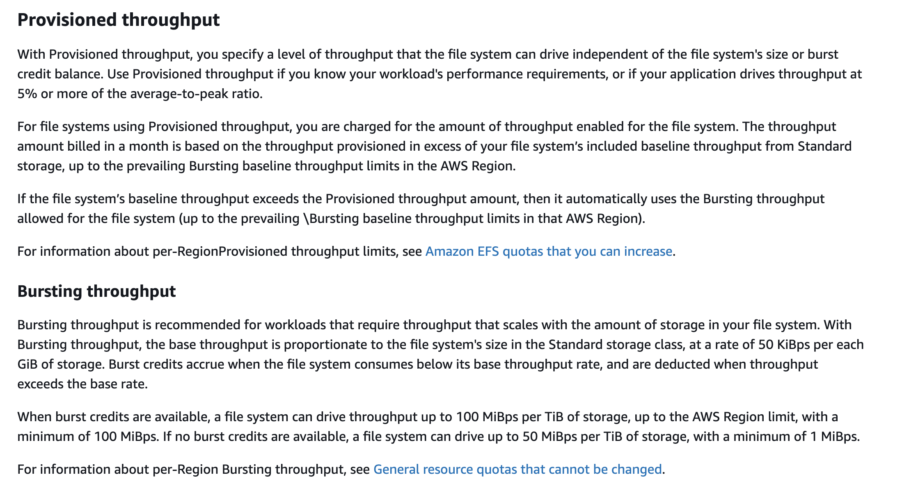

## Q-143

A media company wants a low-latency way to distribute live sports results which are delivered via a proprietary application using UDP protocol.

As a solutions architect, which of the following solutions would you recommend such that it offers the BEST performance for this use case?

- Use Amazon CloudFront to provide a low latency way to distribute live sports results

- **Use AWS Global Accelerator to provide a low latency way to distribute live sports results**

Use Auto Scaling group to provide a low latency way to distribute live sports results

Use Elastic Load Balancing (ELB) to provide a low latency way to distribute live sports results

**NOTE**

- **CloudFront** help to low latency by edge locations but this is not correct ans for this use case.

- Use case uses `UDP Protocol` while **CloudFront** USES `HTTP` & `HTTPS` Protocol.

- **Global Accelarator** supports both **TCP** and **UDP**
- Route traffic via **AWS backbone network**.
- Provides lowest latency routing to nearest healthy endpoint

## Q-144

The engineering team at an e-commerce company wants to migrate from Amazon Simple Queue Service (Amazon SQS) Standard queues to FIFO (First-In-First-Out) queues with batching.

As a solutions architect, which of the following steps would you have in the migration checklist? (Select three)

- **Make sure that the name of the FIFO (First-In-First-Out) queue ends with the .fifo suffix**

- Make sure that the name of the FIFO (First-In-First-Out) queue is the same as the standard queue

- Make sure that the throughput for the target FIFO (First-In-First-Out) queue does not exceed 300 messages per second

- **Make sure that the throughput for the target FIFO (First-In-First-Out) queue does not exceed 3,000 messages per second**

- **Delete the existing standard queue and recreate it as a FIFO (First-In-First-Out) queue**

- Convert the existing standard queue into a FIFO (First-In-First-Out) queue

**Overall explanation**

`By default`, **FIFO queues support up to 3,000 messages per second with batching**, or up to **300 messages per second (300 send, receive, or delete operations per second) without batching**. Therefore, using batching you can meet a throughput requirement of upto 3,000 messages per second.

- The name of a FIFO queue `must end with the` **.fifo** suffix. The suffix counts towards the 80-character queue name limit. To determine whether a queue is FIFO, you can check whether the queue name ends with the suffix.

- If you have an existing application that uses standard queues and you want to take advantage of the `ordering or exactly-once processing features of FIFO queues`, you need to `configure the queue and your application correctly`. You **can't convert an existing standard queue** into a **FIFO queue**. To make the move, you must `either create a new FIFO queue` for your application **or** `delete your existing standard queue and recreate it as a FIFO queue`.

## Q-145

A media streaming startup is building a set of backend APIs that will be consumed by external mobile applications. To prevent API abuse, protect downstream resources, and ensure fair usage across clients, the architecture must enforce rate limiting and throttling on a per-client basis. The team also wants to define usage quotas and apply different limits to different API consumers.

Which solution should the team implement to enforce rate limiting and usage quotas at the API layer?

- Use a Gateway Load Balancer to inspect and control incoming HTTP traffic and throttle requests by integrating with third-party firewall appliances

- Use a Network Load Balancer (NLB) to terminate TLS and apply rate-limiting logic within backend EC2 instances

- Use an Application Load Balancer (ALB) with path-based routing and configure listener rules to enforce request limits

- **Use Amazon API Gateway and configure usage plans with API keys to apply rate limits and quotas per client**

**NOTE**

**Overall explanation**
`Correct option:`

**Use Amazon API Gateway and configure usage plans with API keys to apply rate limits and quotas per client**

- Amazon API Gateway natively supports rate limiting and throttling through the use of usage plans and API keys. 
- By assigning API keys to clients and associating them with usage plans, developers can control the number of requests per second (rate) and the total number of requests over a period (quota). 
- This enables fine-grained traffic control and ensures fair usage across clients, making it ideal for public-facing APIs. 
- Throttling settings are enforced at the API Gateway layer, protecting downstream resources such as Lambda functions or backend services from overload.

## Q-146

The DevOps team at an IT company has recently migrated to AWS and they are configuring security groups for their two-tier application with public web servers and private database servers. The team wants to understand the allowed configuration options for an inbound rule for a security group.

As a solutions architect, which of the following would you identify as an INVALID option for setting up such a configuration?

- You can use an IP address as the custom source for the inbound rule

- You can use a range of IP addresses in CIDR block notation as the custom source for the inbound rule

- You can use a security group as the custom source for the inbound rule

- **You can use an Internet Gateway ID as the custom source for the inbound rule**

## Q-147

A regional transportation authority operates a high-traffic public information portal hosted on AWS. The backend consists of Amazon EC2 instances behind an Application Load Balancer (ALB). In recent weeks, the operations team has observed intermittent slowdowns and performance issues. After investigation, the team suspect the application is being targeted by distributed denial-of-service (DDoS) attacks coming from a wide range of IP addresses. The team needs a solution that provides DDoS mitigation, detailed logs for audit purposes, and requires minimal changes to the existing architecture.

Which solution best addresses these needs?

- Create an Amazon CloudFront distribution in front of the ALB. Enable AWS WAF on the distribution and configure custom rules to filter traffic from known malicious IP ranges and geographies. Use CloudFront access logs for analysis

- Deploy Amazon GuardDuty and integrate with the EC2 environment. Use GuardDuty findings to manually block suspected IP addresses at the ALB level or within EC2 security groups

- Enable Amazon Inspector for the EC2 instances. Use its vulnerability findings to detect potential DDoS attack vectors and patch the EC2 environments accordingly

- **Subscribe to AWS Shield Advanced to gain proactive DDoS protection. Engage the AWS DDoS Response Team (DRT) to analyze traffic patterns and apply mitigations. Use the built-in logging and reporting to maintain an audit trail of detected events**

## Q-148

A startup has recently moved their monolithic web application to AWS Cloud. The application runs on a single Amazon EC2 instance. Currently, the user base is small and the startup does not want to spend effort on elaborate disaster recovery strategies or Auto Scaling Group. The application can afford a maximum downtime of 10 minutes.

In case of a failure, which of these options would you suggest as a cost-effective and automatic recovery procedure for the instance?

- Configure AWS Trusted Advisor to monitor the health check of Amazon EC2 instance and provide a remedial action in case an unhealthy flag is detected

- **Configure an Amazon CloudWatch alarm that triggers the recovery of the Amazon EC2 instance, in case the instance fails. The instance, however, should only be configured with an Amazon EBS volume**

- Configure an Amazon CloudWatch alarm that triggers the recovery of the Amazon EC2 instance, in case the instance fails. The instance can be configured with Amazon Elastic Block Store (Amazon EBS) or with instance store volumes

- Configure Amazon EventBridge events that can trigger the recovery of the Amazon EC2 instance, in case the instance or the application fails

**NOTE**

- `If your instance fails a system status check, you can use Amazon CloudWatch alarm actions to automatically recover it. The recover option is available for over 90% of deployed customer Amazon EC2 instances. The Amazon CloudWatch recovery option works only for system check failures, not for instance status check failures. Also, if you terminate your instance, then it can't be recovered.`

- `You can create an Amazon CloudWatch alarm that monitors an Amazon EC2 instance and automatically recovers the instance if it becomes impaired due to an underlying hardware failure or a problem that requires AWS involvement to repair. Terminated instances cannot be recovered.`

## Q-149

A legacy application is built using a tightly-coupled monolithic architecture. Due to a sharp increase in the number of users, the application performance has degraded. The company now wants to decouple the architecture and adopt AWS microservices architecture. Some of these microservices need to handle fast running processes whereas other microservices need to handle slower processes.

Which of these options would you identify as the right way of connecting these microservices?

- Add Amazon EventBridge to decouple the complex architecture

- **Configure Amazon Simple Queue Service (Amazon SQS) queue to decouple microservices running faster processes from the microservices running slower ones**

- Configure Amazon Kinesis Data Streams to decouple microservices running faster processes from the microservices running slower ones

- Use Amazon Simple Notification Service (Amazon SNS) to decouple microservices running faster processes from the microservices running slower ones

**Overall explanation**
`Correct option:`

**Configure Amazon Simple Queue Service (Amazon SQS) queue to decouple microservices running faster processes from the microservices running slower ones**

- `Amazon Simple Queue Service (Amazon SQS) is a fully managed message queuing service that enables you to decouple and scale microservices, distributed systems, and serverless applications. Amazon SQS eliminates the complexity and overhead associated with managing and operating message-oriented middleware and empowers developers to focus on differentiating work. Using SQS, you can send, store, and receive messages between software components at any volume, without losing messages or requiring other services to be available.`

- `Use Amazon SQS to transmit any volume of data, at any level of throughput, without losing messages or requiring other services to be available. Amazon SQS lets you decouple application components so that they run and fail independently, increasing the overall fault tolerance of the system. Multiple copies of every message are stored redundantly across multiple availability zones so that they are available whenever needed. Being able to store the messages and replay them is a very important feature in decoupling the system architecture, as is needed in the current use case.`


## Q-150

A small business has been running its IT systems on the on-premises infrastructure but the business now plans to migrate to AWS Cloud for operational efficiencies.

As a Solutions Architect, can you suggest a cost-effective serverless solution for its flagship application that has both static and dynamic content?

- Host both the static and dynamic content of the web application on Amazon S3 and use Amazon CloudFront for distribution across diverse regions/countries

- Host the static content on Amazon S3 and use Amazon EC2 with Amazon RDS for generating the dynamic content. Amazon CloudFront can be configured in front of Amazon EC2 instance, to make global distribution easy

- Host both the static and dynamic content of the web application on Amazon EC2 with Amazon RDS as database. Amazon CloudFront should be configured to distribute the content across geographically disperse regions

- **Host the static content on Amazon S3 and use AWS Lambda with Amazon DynamoDB for the serverless web application that handles dynamic content. Amazon CloudFront will sit in front of AWS Lambda for distribution across diverse regions**

**NOTE**

- AWS Lambda with Amazon DynamoDB is the right answer for a serverless solution. Amazon CloudFront will help in enhancing user experience by delivering content, across different geographic locations with low latency. Amazon S3 is a cost-effective and faster way of distributing static content for web applications.

## Q-151

A health care application processes the real-time health data of the patients into an analytics workflow. With a sharp increase in the number of users, the system has become slow and sometimes even unresponsive as it does not have a retry mechanism. The startup is looking at a scalable solution that has minimal implementation overhead.

Which of the following would you recommend as a scalable alternative to the current solution?

- Use Amazon Simple Notification Service (Amazon SNS) for data ingestion and configure AWS Lambda to trigger logic for downstream processing

- Use Amazon Simple Queue Service (Amazon SQS) for data ingestion and configure AWS Lambda to trigger logic for downstream processing

- Use Amazon API Gateway with the existing REST-based interface to create a high performing architecture

- **Use Amazon Kinesis Data Streams to ingest the data, process it using AWS Lambda or run analytics using Amazon Kinesis Data Analytics**

**Overall explanation**
`Correct option:`

**Use Amazon Kinesis Data Streams to ingest the data, process it using AWS Lambda or run analytics using Amazon Kinesis Data Analytics**

- `Amazon Kinesis Data Streams (KDS) is a massively scalable and durable real-time data streaming service with support for retry mechanism`. KDS can continuously capture gigabytes of data per second from hundreds of thousands of sources such as website clickstreams, database event streams, financial transactions, social media feeds, IT logs, and location-tracking events. The data collected is available in milliseconds to enable real-time analytics use cases such as real-time dashboards, real-time anomaly detection, dynamic pricing, and more.

KDS makes sure your streaming data is available to multiple real-time analytics applications, to Amazon S3, or AWS Lambda within 70 milliseconds of the data being collected. `Amazon Kinesis data streams` **scale from** `megabytes to terabytes per hour` and **scale from** `thousands to millions of `**PUT**` records per second`. You can dynamically adjust the throughput of your stream at any time based on the volume of your input data.

## Q-152

An IT consultant is helping a small business revamp their technology infrastructure on the AWS Cloud. The business has two AWS accounts and all resources are provisioned in the us-west-2 region. The IT consultant is trying to launch an Amazon EC2 instance in each of the two AWS accounts such that the instances are in the same Availability Zone (AZ) of the us-west-2 region. Even after selecting the same default subnet (us-west-2a) while launching the instances in each of the AWS accounts, the IT consultant notices that the Availability Zones (AZs) are still different.

As a solutions architect, which of the following would you suggest resolving this issue?

- **Use Availability Zone (AZ) ID to uniquely identify the Availability Zones across the two AWS Accounts**

- Use the default VPC to uniquely identify the Availability Zones across the two AWS Accounts

- Use the default subnet to uniquely identify the Availability Zones across the two AWS Accounts

- Reach out to AWS Support for creating the Amazon EC2 instances in the same Availability Zone (AZ) across the two AWS accounts

**NOTE**

**Overall explanation**
`Correct option:`

- **Use Availability Zone (AZ) ID to uniquely identify the Availability Zones across the two AWS Accounts**

- An Availability Zone is represented by a region code followed by a letter identifier; for example, `us-east-1a`. To ensure that resources are distributed across **the Availability Zones for a region**, **AWS maps Availability Zones to names for each AWS account**. For example, `the Availability Zone us-west-2a for one AWS account `**might not be the same**` location as `**us-west-2a**` for another AWS account`.

- `To coordinate Availability Zones across accounts, you must use the AZ ID, which is a unique and consistent identifier for an Availability Zone. For example, usw2-az2 is an AZ ID for the us-west-2 region and it has the same location in every AWS account.`

## Q-153

A leading online gaming company is migrating its flagship application to AWS Cloud for delivering its online games to users across the world. The company would like to use a Network Load Balancer to handle millions of requests per second. The engineering team has provisioned multiple instances in a public subnet and specified these instance IDs as the targets for the NLB.

As a solutions architect, can you help the engineering team understand the correct routing mechanism for these target instances?

- Traffic is routed to instances using the primary public IP address specified in the primary network interface for the instance

- Traffic is routed to instances using the primary elastic IP address specified in the primary network interface for the instance

- **Traffic is routed to instances using the primary private IP address specified in the primary network interface for the instance**

- Traffic is routed to instances using the instance ID specified in the primary network interface for the instance

## Q-154

A leading online gaming company is migrating its flagship application to AWS Cloud for delivering its online games to users across the world. The company would like to use a Network Load Balancer to handle millions of requests per second. The engineering team has provisioned multiple instances in a public subnet and specified these instance IDs as the targets for the NLB.

As a solutions architect, can you help the engineering team understand the correct routing mechanism for these target instances?

- Traffic is routed to instances using the primary public IP address specified in the primary network interface for the instance

- Traffic is routed to instances using the primary elastic IP address specified in the primary network interface for the instance

- Traffic is routed to instances using the primary private IP address specified in the primary network interface for the instance

- Traffic is routed to instances using the instance ID specified in the primary network interface for the instance

**NOTE**

- If you specify targets using an instance ID, traffic is routed to instances using the primary private IP address specified in the primary network interface for the instance. The load balancer rewrites the destination IP address from the data packet before forwarding it to the target instance.

- If you specify targets using IP addresses, you can route traffic to an instance using any private IP address from one or more network interfaces. This enables multiple applications on an instance to use the same port. Note that each network interface can have its security group. The load balancer rewrites the destination IP address before forwarding it to the target.

## Q-155

The engineering team at a company is moving the static content from the company's logistics website hosted on Amazon EC2 instances to an Amazon S3 bucket. The team wants to use an Amazon CloudFront distribution to deliver the static content. The security group used by the Amazon EC2 instances allows the website to be accessed by a limited set of IP ranges from the company's suppliers. Post-migration to Amazon CloudFront, access to the static content should only be allowed from the aforementioned IP addresses.

Which options would you combine to build a solution to meet these requirements? (Select two)

- **Configure an origin access identity (OAI) and associate it with the Amazon CloudFront distribution. Set up the permissions in the Amazon S3 bucket policy so that only the OAI can read the objects**

- Create a new NACL that allows traffic from the same IPs as specified in the current Amazon EC2 security group. Associate this new NACL with the Amazon CloudFront distribution

- **Create an AWS WAF ACL and use an IP match condition to allow traffic only from those IPs that are allowed in the Amazon EC2 security group. Associate this new AWS WAF ACL with the Amazon CloudFront distribution**

- Create a new security group that allows traffic from the same IPs as specified in the current Amazon EC2 security group. Associate this new security group with the Amazon CloudFront distribution

- Create an AWS Web Application Firewall (AWS WAF) ACL and use an IP match condition to allow traffic only from those IPs that are allowed in the Amazon EC2 security group. Associate this new AWS WAF ACL with the Amazon S3 bucket policy

**NOTE**

- S3 can restrict incoming trafficd from speicif ip by using S3 Bucket Policy.
- CloudFront can restrict ip by WAF and use as Origin Access Identity to S3.

## Q-156

A financial services company has recently migrated from on-premises infrastructure to AWS Cloud. The DevOps team wants to implement a solution that allows all resource configurations to be reviewed and make sure that they meet compliance guidelines. Also, the solution should be able to offer the capability to look into the resource configuration history across the application stack.

As a solutions architect, which of the following solutions would you recommend to the team?

- Use AWS CloudTrail to review resource configurations to meet compliance guidelines and maintain a history of resource configuration changes

- **Use AWS Config to review resource configurations to meet compliance guidelines and maintain a history of resource configuration changes**

- Use AWS Systems Manager to review resource configurations to meet compliance guidelines and maintain a history of resource configuration changes

- Use Amazon CloudWatch to review resource configurations to meet compliance guidelines and maintain a history of resource configuration changes

## Q-157

A startup has created a new web application for users to complete a risk assessment survey for COVID-19 symptoms via a self-administered questionnaire. The startup has purchased the domain covid19survey.com using Amazon Route 53. The web development team would like to create Amazon Route 53 record so that all traffic for covid19survey.com is routed to www.covid19survey.com.

As a solutions architect, which of the following is the MOST cost-effective solution that you would recommend to the web development team?

- Create an NS record for covid19survey.com that routes traffic to www.covid19survey.com

- Create a CNAME record for covid19survey.com that routes traffic to www.covid19survey.com

- Create an MX record for covid19survey.com that routes traffic to www.covid19survey.com

Correct answer
- **Create an alias record for covid19survey.com that routes traffic to www.covid19survey.com**

**NOTE**

1. CNAME Limitations

Your thought: "If i want to create CNAME - I must have create it like www.covid19survey.com - I can't create it like covid19survey.com"

Verification: CORRECT. You can create a CNAME for a subdomain (like www or blog), but you cannot create a CNAME for the "naked" or "root" domain (covid19survey.com).

2. The "No Other Records" Rule

Your thought: "If i create CNAME - I can't create other records like A , AAAA etc"

Verification: CORRECT. DNS rules state that if a CNAME exists for a name, **no other records can exist for that same name**. This is why you can't put a CNAME at the root—because the root must have NS and SOA records.

3. What is a "Root Domain" vs. "Zone Apex"?

This is the part we need to adjust. In the context of AWS and DNS management:

.com / .shop: These are actually called TLDs (Top-Level Domains).

Zone Apex (The Root of your zone): This is the domain you bought. In your case, covid19survey.com is the Zone Apex. It is the highest level of your specific DNS "Zone."
At the Zone Apex (covid19survey.com)

## Q-158

The engineering team at a social media company wants to use Amazon CloudWatch alarms to automatically recover Amazon EC2 instances if they become impaired. The team has hired you as a solutions architect to provide subject matter expertise.

As a solutions architect, which of the following statements would you identify as CORRECT regarding this automatic recovery process? (Select two)

- **If your instance has a public IPv4 address, it retains the public IPv4 address after recovery**

- Terminated Amazon EC2 instances can be recovered if they are configured at the launch of instance

- During instance recovery, the instance is migrated during an instance reboot, and any data that is in-memory is retained

- If your instance has a public IPv4 address, it does not retain the public IPv4 address after recovery

- **A recovered instance is identical to the original instance, including the instance ID, private IP addresses, Elastic IP addresses, and all instance metadata**

**Overall explanation**
`Correct options:`

A recovered instance is identical to the original instance, including the instance ID, private IP addresses, Elastic IP addresses, and all instance metadata

If your instance has a public IPv4 address, it retains the public IPv4 address after recovery

- You can create an Amazon CloudWatch alarm to automatically recover the Amazon EC2 instance if it becomes impaired `due to an underlying hardware failure or a problem that requires AWS involvement to repair`. **Terminated instances cannot be recovered**. A recovered instance is identical to the `original instance, including the instance ID, private IP addresses, Elastic IP addresses, and all instance metadata`. If the impaired instance is in a placement group, the recovered instance runs in the placement group. `If your instance has a public IPv4 address`, **it retains the public IPv4 address after recovery**. During instance recovery, the instance is migrated during an instance reboot, and any data that is in-memory is lost.

## Q-159

The DevOps team at a multi-national company is helping its subsidiaries standardize Amazon EC2 instances by using the same Amazon Machine Image (AMI). Some of these subsidiaries are in the same AWS region but use different AWS accounts whereas others are in different AWS regions but use the same AWS account as the parent company. The DevOps team has hired you as a solutions architect for this project.

Which of the following would you identify as CORRECT regarding the capabilities of an Amazon Machine Image (AMI)? (Select three)

- Copying an Amazon Machine Image (AMI) backed by an encrypted snapshot results in an unencrypted target snapshot

- **You can copy an Amazon Machine Image (AMI) across AWS Regions**

- **Copying an Amazon Machine Image (AMI) backed by an encrypted snapshot cannot result in an unencrypted target snapshot**

- You cannot share an Amazon Machine Image (AMI) with another AWS account

- **You can share an Amazon Machine Image (AMI) with another AWS account**

- You cannot copy an Amazon Machine Image (AMI) across AWS Regions

**NOTE**

An Amazon Machine Image (AMI) provides the information required to launch an instance. An AMI includes the following:

One or more Amazon EBS snapshots, or, for instance-store-backed AMIs, a template for the root volume of the instance.

Launch permissions that control which AWS accounts can use the AMI to launch instances.

A block device mapping that specifies the volumes to attach to the instance when it's launched.

- You can copy an AMI within or across AWS Regions using the AWS Management Console, the AWS Command Line Interface or SDKs, or the Amazon EC2 API, all of which support the CopyImage action. You can copy both Amazon EBS-backed AMIs and instance-store-backed AMIs. You can copy AMIs with encrypted snapshots and also change encryption status during the copy process. Therefore, the option - **"You can copy an AMI across AWS Regions"** - is correct.

- The following table shows encryption support for various AMI-copying scenarios. While it is possible to copy an unencrypted snapshot to yield an encrypted snapshot, you cannot copy an encrypted snapshot to yield an unencrypted one. Therefore, the option - **"Copying an AMI backed by an encrypted snapshot cannot result in an unencrypted target snapshot"** is correct.

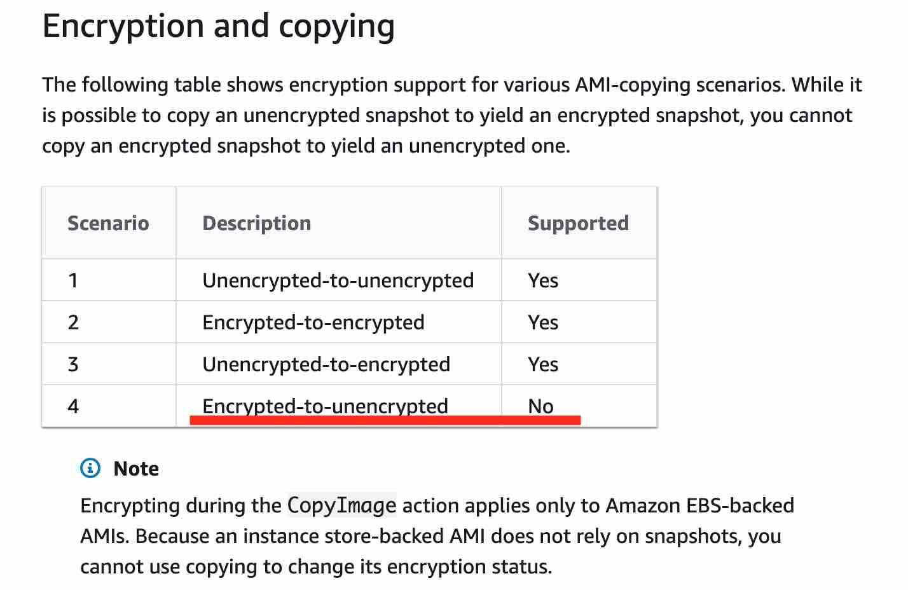

- You can share an AMI with another AWS account. To copy an AMI that was shared with you from another account, the owner of the source AMI must grant you read permissions for the storage that backs the AMI, either the associated Amazon EBS snapshot (for an Amazon EBS-backed AMI) or an associated S3 bucket (for an instance store-backed AMI). Therefore, the option - **"You can share an AMI with another AWS account"** - is correct.

## Q-160

A video conferencing application is hosted on a fleet of EC2 instances which are part of an Auto Scaling group. The Auto Scaling group uses a Launch Template (LT1) with "dedicated" instance tenancy but the VPC (V1) used by the Launch Template LT1 has the instance tenancy set to default. Later the DevOps team creates a new Launch Template (LT2) with shared (default) instance tenancy but the VPC (V2) used by the Launch Template LT2 has the instance tenancy set to dedicated.

Which of the following is correct regarding the instances launched via Launch Template LT1 and Launch Template LT2?

- **The instances launched by both Launch Template LT1 and Launch Template LT2 will have dedicated instance tenancy**

- The instances launched by Launch Template LT1 will have default instance tenancy while the instances launched by the Launch Template LT2 will have dedicated instance tenancy

- The instances launched by Launch Template LT1 will have dedicated instance tenancy while the instances launched by the Launch Template LT2 will have shared (default) instance tenancy

- The instances launched by both Launch Template LT1 and Launch Template LT2 will have default instance tenancy

**NOTE**

  1. If `either the VPC` or `the Instance/Launch Template` is set to **Dedicated**, the result is **Dedicated**.

  2. The only way to **get Shared tenancy** is `if both the VPC and the Launch Template` are **set to Default/Shared**.

## Q-161

A company recently experienced a database outage in its on-premises data center. The company now wants to migrate to a reliable database solution on AWS that minimizes data loss and stores every transaction on at least two nodes.

Which of the following solutions meets these requirements?

- Set up an Amazon RDS MySQL DB instance and then create a read replica in another Availability Zone that synchronously replicates the data

- Set up an Amazon EC2 instance with a MySQL DB engine installed that triggers an AWS Lambda function to synchronously replicate the data to an Amazon RDS MySQL DB instance

- **Set up an Amazon RDS MySQL DB instance with Multi-AZ functionality enabled to synchronously replicate the data**

- Set up an Amazon RDS MySQL DB instance and then create a read replica in a separate AWS Region that synchronously replicates the data

## Q-162

A retail company uses AWS Cloud to manage its IT infrastructure. The company has set up AWS Organizations to manage several departments running their AWS accounts and using resources such as Amazon EC2 instances and Amazon RDS databases. The company wants to provide shared and centrally-managed VPCs to all departments using applications that need a high degree of interconnectivity.

As a solutions architect, which of the following options would you choose to facilitate this use-case?

- Use VPC sharing to share a VPC with other AWS accounts belonging to the same parent organization from AWS Organizations

- Use VPC peering to share a VPC with other AWS accounts belonging to the same parent organization from AWS Organizations

- **Use VPC sharing to share one or more subnets with other AWS accounts belonging to the same parent organization from AWS Organizations**

- Use VPC peering to share one or more subnets with other AWS accounts belonging to the same parent organization from AWS Organizations

## Q-163

An application running on an Amazon EC2 instance needs to access a Amazon DynamoDB table in the same AWS account.

Which of the following solutions should a solutions architect configure for the necessary permissions?

- Set up an IAM user with the appropriate permissions to allow access to the Amazon DynamoDB table. Store the access credentials in an Amazon S3 bucket and read them from within the application code directly

- Set up an IAM service role with the appropriate permissions to allow access to the Amazon DynamoDB table. Add the Amazon EC2 instance to the trust relationship policy document so that the instance can assume the role

- **Set up an IAM service role with the appropriate permissions to allow access to the Amazon DynamoDB table. Configure an instance profile to assign this IAM role to the Amazon EC2 instance**

- Set up an IAM user with the appropriate permissions to allow access to the Amazon DynamoDB table. Store the access credentials in the local storage and read them from within the application code directly

## Q-164

An engineering lead is designing a VPC with public and private subnets. The VPC and subnets use IPv4 CIDR blocks. There is one public subnet and one private subnet in each of three Availability Zones (AZs) for high availability. An internet gateway is used to provide internet access for the public subnets. The private subnets require access to the internet to allow Amazon EC2 instances to download software updates.

Which of the following options represents the correct solution to set up internet access for the private subnets?

- **Set up three NAT gateways, one in each public subnet in each AZ. Create a custom route table for each AZ that forwards non-local traffic to the NAT gateway in its AZ**

- Set up three NAT gateways, one in each private subnet in each AZ. Create a custom route table for each AZ that forwards non-local traffic to the NAT gateway in its AZ

- Set up three Internet gateways, one in each private subnet in each AZ. Create a custom route table for each AZ that forwards non-local traffic to the Internet gateway in its AZ

- Set up three egress-only internet gateways, one in each public subnet in each AZ. Create a custom route table for each AZ that forwards non-local traffic to the egress-only internet gateway in its AZ

**NOTE**

  - ### 1. Egress-only Internet Gateway ❌
  - `Egress-only IGW` - used for IPv6 CIDR

### A. Use Single NAT Gateway instaed of 3 NAT Gateway

  - Yes, We can use 1 NAT Gateway for all AZ like 3 AZs.
  - But, This is not Highly available bcz, if **AZ** failed Where NAT Gateway deployed in pub sub of AZ. So All Private Subnet will no have Internet.


### B. We can use NAT Instance But not recommended

  - Requires manual patching

  - Requires scaling management

  - Requires failover setup

  - Must disable source/destination check

  - Lower bandwidth than NAT Gateway

  - Not managed service

**Exam rule:**

- If NAT Gateway option is present, choose NAT Gateway over NAT Instance (unless cost optimization is explicitly mentioned).

## Q-165

A financial services company wants to move the Windows file server clusters out of their datacenters. They are looking for cloud file storage offerings that provide full Windows compatibility. Can you identify the AWS storage services that provide highly reliable file storage that is accessible over the industry-standard Server Message Block (SMB) protocol compatible with Windows systems? (Select two)

- **File Gateway Configuration of AWS Storage Gateway**

- Amazon Elastic Block Store (Amazon EBS)

- Amazon Elastic File System (Amazon EFS)

- Amazon Simple Storage Service (Amazon S3)

- **Amazon FSx for Windows File Server**

**NOTE**

**Overall explanation**
`Correct options:`

**Amazon FSx for Windows File Server**

- Amazon FSx for Windows File Server is a fully managed, highly reliable file storage that is accessible over the industry-standard Server Message Block (SMB) protocol. It is built on Windows Server, delivering a wide range of administrative features such as user quotas, end-user file restore, and Microsoft Active Directory (AD) integration.

**File Gateway Configuration of AWS Storage Gateway**

- Depending on the use case, AWS Storage Gateway provides 3 types of storage interfaces for on-premises applications: File, Volume, and Tape. The File Gateway enables you to store and retrieve objects in Amazon S3 using file protocols such as Network File System (NFS) and Server Message Block (SMB).

## Q-166

A gaming company uses Application Load Balancers in front of Amazon EC2 instances for different services and microservices. The architecture has now become complex with too many Application Load Balancers in multiple AWS Regions. Security updates, firewall configurations, and traffic routing logic have become complex with too many IP addresses and configurations.

The company is looking at an easy and effective way to bring down the number of IP addresses allowed by the firewall and easily manage the entire network infrastructure. Which of these options represents an appropriate solution for this requirement?

- Assign an Elastic IP to an Auto Scaling Group (ASG), and set up multiple Amazon EC2 instances to run behind the Auto Scaling Groups, for each of the Regions

- Set up a Network Load Balancer with elastic IP address. Register the private IPs of all the Application Load Balancers as targets of this Network Load Balancer

- Configure Elastic IPs for each of the Application Load Balancers in each Region

- **Launch AWS Global Accelerator and create endpoints for all the Regions. Register the Application Load Balancers of each Region to the corresponding endpoints**

**NOTE**

**Launch AWS Global Accelerator and create endpoints for all the Regions. Register the Application Load Balancers of each Region to the corresponding endpoints**

- AWS Global Accelerator is a networking service that sends your user’s traffic through Amazon Web Service’s global network infrastructure, improving your internet user performance by up to 60%. When the internet is congested, Global Accelerator’s automatic routing optimizations will help keep your packet loss, jitter, and latency consistently low.

- With AWS Global Accelerator, you are provided two global static customer-facing IPs to simplify traffic management. On the back end, add or remove your AWS application origins, such as Network Load Balancers, Application Load Balancers, elastic IP address (EIP), and Amazon EC2 Instances, without making user-facing changes. To mitigate endpoint failure, AWS Global Accelerator automatically re-routes your traffic to your nearest healthy available endpoint.

## Q-167

A national logistics company has a dedicated AWS Direct Connect connection from its corporate data center to AWS. Within its AWS account, the company operates 25 Amazon VPCs in the same Region, each supporting different regional distribution services. The VPCs were configured with non-overlapping CIDR blocks and currently use private VIFs for Direct Connect access to on-premises resources. As the architecture scales, the company wants to enable communication across all VPCs and the on-premises environment. The solution must scale efficiently, support full-mesh connectivity, and reduce the complexity of maintaining separate private VIFs for each VPC.

Which combination of solutions will best fulfill these requirements with the least amount of operational overhead? (Select two)

- Create individual Site-to-Site VPN connections from the data center to each VPC. Set up BGP route propagation for every tunnel to facilitate on-premises-to-VPC routing

- **Create a transit virtual interface (VIF) from the Direct Connect connection and associate it with the transit gateway**

- Reconfigure each VPC to connect through AWS PrivateLink endpoints to a central networking service VPC. Share the service with other VPCs using VPC endpoint services

- **Create an AWS Transit Gateway and attach all 25 VPCs to it. Enable route propagation for each attachment to automatically manage inter-VPC routing**

- Convert each existing private VIF into a new Direct Connect gateway association by attaching a virtual private gateway (VGW) to each VPC. Manually configure routing between VGWs

**NOTE**

- **Create an AWS Transit Gateway and attach all 25 VPCs to it. Enable route propagation for each attachment to automatically manage inter-VPC routing**

- Attaching all VPCs to a single AWS Transit Gateway centralizes routing and allows for transitive communication between the VPCs. **Enabling route propagation eliminates** the need to `manually update route tables for every VPC`. This design supports scalable, full-mesh VPC connectivity with low operational burden.

- **Create a transit virtual interface (VIF) from the Direct Connect connection and associate it with the transit gateway**

- Using a transit VIF from the Direct Connect connection to the transit gateway **enables on-premises-to-VPC connectivity through a single, centralized path**. This `eliminates` the need to `maintain multiple private VIFs and simplifies BGP management and route aggregation`. Combined with Option A, this forms a highly efficient hub-and-spoke architecture.

## Q-168

A developer has configured inbound traffic for the relevant ports in both the Security Group of the Amazon EC2 instance as well as the Network Access Control List (Network ACL) of the subnet for the Amazon EC2 instance. The developer is, however, unable to connect to the service running on the Amazon EC2 instance.

As a solutions architect, how will you fix this issue?

- Rules associated with Network ACLs should never be modified from command line. An attempt to modify rules from command line blocks the rule and results in an erratic behavior

- **Security Groups are stateful, so allowing inbound traffic to the necessary ports enables the connection. Network ACLs are stateless, so you must allow both inbound and outbound traffic**

- Network ACLs are stateful, so allowing inbound traffic to the necessary ports enables the connection. Security Groups are stateless, so you must allow both inbound and outbound traffic

- IAM Role defined in the Security Group is different from the IAM Role that is given access in the Network ACLs

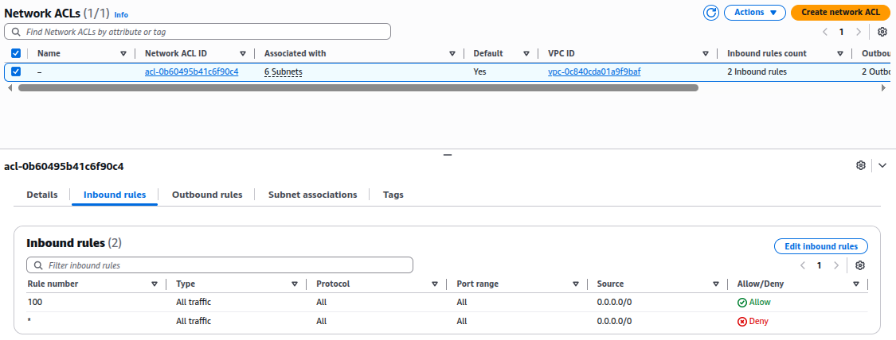

**NOTE**

**Security groups are stateful, so allowing inbound traffic to the necessary ports enables the connection. Network ACLs are stateless, so you must allow both inbound and outbound traffic.**

- To enable the connection to a service running on an instance, the associated network ACL must allow both inbound traffic on the port that the service is listening on as well as allow outbound traffic from ephemeral ports. When a client connects to a server, a random port from the ephemeral port range (1024-65535) becomes the client's source port.

- The designated ephemeral port then becomes the destination port for return traffic from the service, so outbound traffic from the ephemeral port must be allowed in the network ACL.

- By default, network ACLs allow all inbound and outbound traffic. If your network ACL is more restrictive, then you need to explicitly allow traffic from the ephemeral port range.

- If you accept traffic from the internet, then you also must establish a route through an internet gateway. If you accept traffic over VPN or AWS Direct Connect, then you must establish a route through a virtual private gateway (VGW).

## Q-169

The development team at a retail company wants to optimize the cost of Amazon EC2 instances. The team wants to move certain nightly batch jobs to spot instances. The team has hired you as a solutions architect to provide the initial guidance.

Which of the following would you identify as CORRECT regarding the capabilities of spot instances? (Select three)

- **If a spot request is persistent, then it is opened again after your Spot Instance is interrupted**

When you cancel an active spot request, it terminates the associated instance as well

Spot Fleets cannot maintain target capacity by launching replacement instances after Spot Instances in the fleet are terminated

- If a spot request is persistent, then it is opened again after you stop the Spot Instance

- **When you cancel an active spot request, it does not terminate the associated instance**

- **Spot Fleets can maintain target capacity by launching replacement instances after Spot Instances in the fleet are terminated**

**NOTE**

- `Target capacity` = `The total amount of compute capacity you want AWS to maintain`.

  - **It defines:**

  - How many instances OR

  - How many vCPUs OR

  - How many capacity units

```bash
Target capacity = 5
Instance type = t3.large
```

- AWS will try to ensure:

  - 👉 5 instances are running at all times if:


    -  1 Spot instance gets interrupted

    -  Running capacity drops to 4

    -  AWS automatically launches 1 new instance to bring it back to 5.

  - That is maintaining target capacity.

**If a spot request is persistent, then it is opened again after your Spot Instance is interrupted**

✔ TRUE

- Persistent Spot request = AWS will try to relaunch the instance if it gets interrupted.

- One-time request = Not relaunched after interruption.

**“When you cancel an active spot request, it does not terminate the associated instance.”**

When you cancel a Spot request:

- The request is cancelled.

- The running Spot instance continues running.

- It is NOT automatically terminated.

- If you want to stop the instance, you must:

- Manually terminate it OR

- Select “Cancel and terminate instances” explicitly (if using console).

## Q-170

A healthcare startup is modernizing its monolithic Python-based analytics application by transitioning to a microservices architecture on AWS. As a pilot, the team wants to refactor one module into a standalone microservice that can handle hundreds of requests per second. They are seeking an AWS-native solution that supports Python, scales automatically with traffic, and requires minimal infrastructure management and operational overhead to build, test, and deploy the service efficiently.

Which AWS solution best meets these requirements?

- Use Amazon EC2 Spot Instances in an Auto Scaling group. Launch the Python application as a background service and install all required dependencies at instance startup

- Use AWS App Runner to build and deploy the Python application directly from a GitHub repository. Allow App Runner to manage traffic scaling and deployments

- **Use AWS Lambda to run the Python-based microservice. Integrate it with Amazon API Gateway for HTTP access and enable provisioned concurrency for performance during peak loads**

- Deploy the microservice in an AWS Fargate task using Amazon ECS. Package the code in a Docker container image with a Python runtime and configure ECS Service Auto Scaling to respond to CPU utilization metrics

## Q-171

An e-commerce company runs its web application on Amazon EC2 instances in an Auto Scaling group and it's configured to handle consumer orders in an Amazon Simple Queue Service (Amazon SQS) queue for downstream processing. The DevOps team has observed that the performance of the application goes down in case of a sudden spike in orders received.

As a solutions architect, which of the following solutions would you recommend to address this use-case?

- Use a scheduled scaling policy based on a custom Amazon SQS queue metric

- Use a step scaling policy based on a custom Amazon SQS queue metric

- Use a simple scaling policy based on a custom Amazon SQS queue metric

- **Use a target tracking scaling policy based on a custom Amazon SQS queue metric**

## Q-172

A software company manages a fleet of Amazon EC2 instances that support internal analytics applications. These instances use an IAM role with custom policies to connect to Amazon RDS and AWS Secrets Manager for secure access to credentials and database endpoints. The IT operations team wants to implement a centralized patch management solution that simplifies compliance and security tasks. Their goal is to automate OS patching across EC2 instances without disrupting the running applications.

Which approach will allow the company to meet these goals with the least administrative overhead?

- Detach the existing IAM role from all EC2 instances. Replace it with a new role that has both the original permissions and the AmazonSSMManagedInstanceCore policy to enable Systems Manager features

- Manually install the Systems Manager Agent (SSM Agent) on each EC2 instance. Schedule daily patch jobs using cron scripts

- Create a second IAM role with the `mazonSSMManagedInstanceCore` policy and attach both the new and the existing IAM roles to each EC2 instance using Systems Manager Hybrid Activation

- **Enable Default Host Management Configuration in AWS Systems Manager Quick Setup**

**Overall explanation**
`Correct option:`

**Enable Default Host Management Configuration in AWS Systems Manager Quick Setup**

- This is the simplest and most reliable solution that aligns with the company's requirement for zero disruption and minimal administrative effort. 
- AWS Systems Manager’s Default Host Management Configuration (part of Quick Setup) `automatically applies the necessary Systems Manager permissions, activates inventory collection, and enables patching without needing to alter existing IAM roles manually`. It simplifies onboarding by using AWS best practices and auto-configures EC2 instances with the required SSM settings behind the scenes.

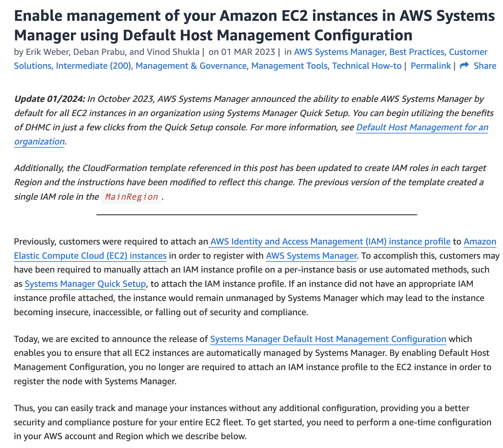

## Q-173

A media startup is looking at hosting their web application on AWS Cloud. The application will be accessed by users from different geographic regions of the world to upload and download video files that can reach a maximum size of 10 gigabytes. The startup wants the solution to be cost-effective and scalable with the lowest possible latency for a great user experience.

As a Solutions Architect, which of the following will you suggest as an optimal solution to meet the given requirements?

- Use Amazon EC2 with AWS Global Accelerator for faster distribution of content, while using Amazon S3 as storage service

- Use Amazon EC2 with Amazon ElastiCache for faster distribution of content, while Amazon S3 can be used as a storage service

- Use Amazon S3 for hosting the web application and use Amazon CloudFront for faster distribution of content to geographically dispersed users

- **Use Amazon S3 for hosting the web application and use Amazon S3 Transfer Acceleration (Amazon S3TA) to reduce the latency that geographically dispersed users might face**

**NOTE**

**Overall explanation**
`Correct option:`

**Use Amazon S3 for hosting the web application and use Amazon S3 Transfer Acceleration (Amazon S3TA) to reduce the latency that geographically dispersed users might face**

- Amazon S3 Transfer Acceleration (S3TA) can speed up content transfers to and from Amazon S3 by as much as `50-500%` for long-distance **transfer of larger objects**. Customers who have either web or mobile applications with widespread users or applications hosted far away from their S3 bucket can experience long and variable upload and download speeds over the Internet. S3 Transfer Acceleration (S3TA) reduces the variability in Internet routing, congestion, and speeds that can affect transfers, and logically shortens the distance to S3 for remote applications.

- S3TA improves transfer performance by routing traffic through Amazon CloudFront’s globally distributed Edge Locations and over AWS backbone networks, and by using network protocol optimizations.

- For applications interacting with your Amazon S3 buckets through the S3 API from outside of your bucket’s region, S3TA helps avoid the variability in Internet routing and congestion. It does this by routing your uploads and downloads over the AWS global network infrastructure, so you get the benefit of AWS network optimizations.

**Incorrect options:**

- **Use Amazon S3 for hosting the web application and use Amazon CloudFront for faster distribution of content to geographically dispersed users**

- Amazon S3 with Amazon CloudFront is a very powerful way of distributing static content to geographically dispersed users with low latency speeds. **If you have objects that are smaller than 1GB or if the data set is less than 1GB in size, you should consider using Amazon CloudFront's PUT/POST commands for optimal performance**. The given use case has data larger than 1GB and hence S3 Transfer Acceleration is a better option.

## Q-174

A company is migrating a legacy workload from on premises to AWS. The application receives customer order files from an on premises ERP system by using the SFTP protocol. After files arrive, the application must process them immediately rather than relying on periodic polling. The company already has secure network connectivity between AWS and the on premises environment. The new solution must remain highly available, secure, and resilient across infrastructure failures.

Which solution should you implement to meet these requirements?

- Deploy an internet facing AWS Transfer Family SFTP server across two Availability Zones backed by Amazon S3. Configure Amazon S3 Event Notifications to invoke an AWS Lambda function when new objects are created

- Deploy an internet facing AWS Transfer Family SFTP server in a single Availability Zone backed by Amazon EFS. Configure a Transfer Family managed workflow to invoke an AWS Lambda function after file upload completes

- **Deploy an internal AWS Transfer Family SFTP server across two Availability Zones backed by Amazon S3. Configure a Transfer Family managed workflow to invoke an AWS Lambda function immediately after file upload completes**

- Deploy an internal AWS Transfer Family SFTP server across two Availability Zones backed by Amazon EFS. Use Amazon EventBridge Scheduler to periodically trigger an AWS Step Functions state machine that scans for new files

**NOTE**

**AWS Transfer Family** 
  - is a secure transfer service that   `enables you to transfer files into and out of AWS storage services`.
  - transfer of files over `SFTP, AS2, FTPS, FTP`, and web browser-based transfers directly into and out of AWS storage services. 

  - Supports Transferring data from or to to AWS Services

    - AWS S3,
    - AWS EFS (Network File System)

**Receives file using SFTP**
  - On-prem ERP System will push file to AWS using SFTP Protocol

  - S3/EFS supports SFTP

**Must Process files Immediatley rather than relying on periodic polling** - Is requirement

  - `S3 supports Event-Driven workFlow`
  - EFS Doesn't support Event-Driven WorkFlow

  - For `Event-Driven WorkFlow` - We can use EventBridge Integrated with S3 and Lambda(to process new data in S3)

## Q-175

A company has hired you as an AWS Certified Solutions Architect – Associate to help with redesigning a real-time data processor. The company wants to build custom applications that process and analyze the streaming data for its specialized needs.

Which solution will you recommend to address this use-case?

**Use Amazon Kinesis Data Streams to process the data streams as well as decouple the producers and consumers for the real-time data processor**

Use Amazon Simple Queue Service (Amazon SQS) to process the data streams as well as decouple the producers and consumers for the real-time data processor

Use Amazon Simple Notification Service (Amazon SNS) to process the data streams as well as decouple the producers and consumers for the real-time data processor

Use Amazon Kinesis Data Firehose to process the data streams as well as decouple the producers and consumers for the real-time data processor

**Overall explanation**
`Correct option:`

**Use Amazon Kinesis Data Streams to process the data streams as well as decouple the producers and consumers for the real-time data processor**

- Amazon Kinesis Data Streams is useful for rapidly moving data off data producers and then continuously processing the data, be it to transform the data before emitting to a data store, run real-time metrics and analytics, or derive more complex data streams for further processing. 
- Kinesis data streams can continuously capture gigabytes of data per second from hundreds of thousands of sources such as website clickstreams, database event streams, financial transactions, social media feeds, IT logs, and location-tracking events.


**Incorrect Options**

`Use Amazon Kinesis Data Firehose to process the data streams as well as decouple the producers and consumers for the real-time data processor`
 
  - Amazon Kinesis Data Firehose is the easiest way to load streaming data into data stores and analytics tools. 
  - `Kinesis Firehose` **cannot be used to process and analyze the streaming data in custom applications**. It `can capture, transform, and load streaming data into Amazon S3, Amazon Redshift, Amazon Elasticsearch Service, and Splunk, enabling near real-time analytics`.

## Q-176

A healthcare company has deployed its web application on Amazon Elastic Container Service (Amazon ECS) container instances running behind an Application Load Balancer. The website slows down when the traffic spikes and the website availability is also reduced. The development team has configured Amazon CloudWatch alarms to receive notifications whenever there is an availability constraint so the team can scale out resources. The company wants an automated solution to respond to such events.

Which of the following addresses the given use case?

- Configure AWS Auto Scaling to scale out the Amazon ECS cluster when the Application Load Balancer's CPU utilization rises above a threshold

- Configure AWS Auto Scaling to scale out the Amazon ECS cluster when the CloudWatch alarm's CPU utilization rises above a threshold

- **Configure AWS Auto Scaling to scale out the Amazon ECS cluster when the ECS service's CPU utilization rises above a threshold**

- Configure AWS Auto Scaling to scale out the Amazon ECS cluster when the Application Load Balancer's target group's CPU utilization rises above a threshold

**NOTE**

`Correct option:`

**Configure AWS Auto Scaling to scale out the Amazon ECS cluster when the ECS service's CPU utilization rises above a threshold**

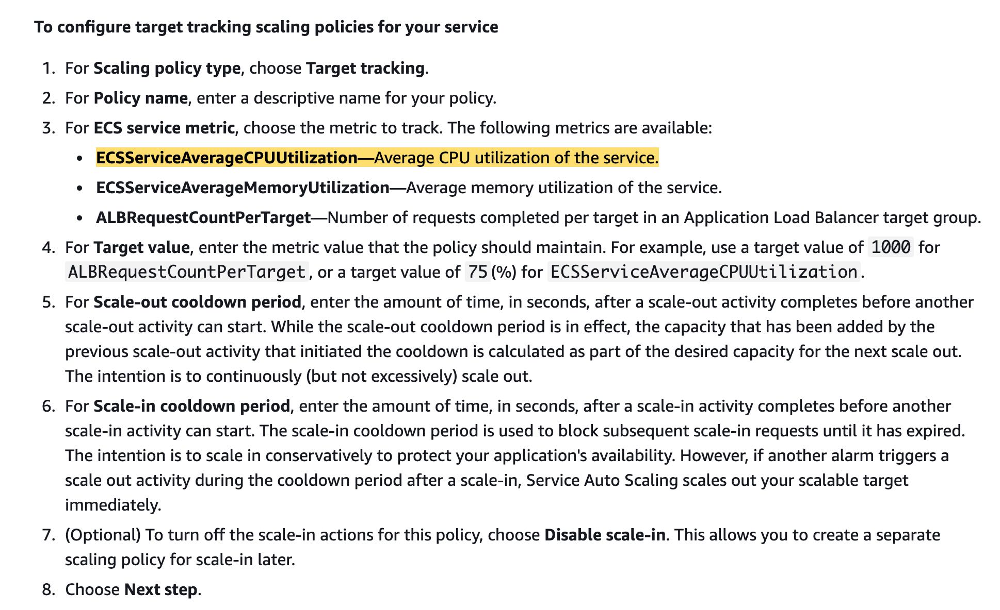

- You use the Amazon ECS first-run wizard to create a cluster and a service that runs behind an Elastic Load Balancing load balancer. Then you can configure a target tracking scaling policy that scales your service automatically based on the current application load as measured by the service's CPU utilization (from the ECS, ClusterName, and ServiceName category in CloudWatch).

- When the average CPU utilization of your service rises above 75% (meaning that more than 75% of the CPU that is reserved for the service is being used), a scale out alarm triggers Service Auto Scaling to add another task to your service to help out with the increased load. Conversely, when the average CPU utilization of your service drops below the target utilization for a sustained period, a scale-in alarm triggers a decrease in the service's desired count to free up those cluster resources for other tasks and services.

## Q-177

A social media startup uses AWS Cloud to manage its IT infrastructure. The engineering team at the startup wants to perform weekly database rollovers for a MySQL database server using a serverless cron job that typically takes about 5 minutes to execute the database rollover script written in Python. The database rollover will archive the past week’s data from the production database to keep the database small while still keeping its data accessible.

As a solutions architect, which of the following would you recommend as the MOST cost-efficient and reliable solution?

- **Schedule a weekly Amazon EventBridge event cron expression to invoke an AWS Lambda function that runs the database rollover job**

- Create a time-based schedule option within an AWS Glue job to invoke itself every week and run the database rollover script

- Provision an Amazon EC2 spot instance to run the database rollover script to be run via an OS-based weekly cron expression

- Provision an Amazon EC2 scheduled reserved instance to run the database rollover script to be run via an OS-based weekly cron expression

**NOTE**

`Correct option:`

- **Schedule a weekly Amazon EventBridge event cron expression to invoke an AWS Lambda function that runs the database rollover job**

- AWS Lambda lets you run code without provisioning or managing servers. You pay only for the compute time you consume. AWS Lambda supports standard rate and cron expressions for frequencies of up to once per minute.

## Q-178

An AWS Organization is using Service Control Policies (SCPs) for central control over the maximum available permissions for all accounts in their organization. This allows the organization to ensure that all accounts stay within the organization’s access control guidelines.

Which of the given scenarios are correct regarding the permissions described below? (Select three)

- **Service control policy (SCP) does not affect service-linked role**

- **If a user or role has an IAM permission policy that grants access to an action that is either not allowed or explicitly denied by the applicable service control policy (SCP), the user or role can't perform that action**

- If a user or role has an IAM permission policy that grants access to an action that is either not allowed or explicitly denied by the applicable service control policy (SCP), the user or role can still perform that action

Service control policy (SCP) affects service-linked roles

- Service control policy (SCP) affects all users and roles in the member accounts, excluding root user of the member accounts

- **Service control policy (SCP) affects all users and roles in the member accounts, including root user of the member accounts**

**NOTE**

**“Service Control Policy (SCP) does not affect any service-linked role.”**

- Service Control Policy restricts `IAM Users`, `IAM Roles`, `IAM Groups`.
- But They DO NOT RESTRICT AWS Service-Linked Roles

- Bcz, 👉Service-Linked roles are used internally by AWS services
👉 AWS must ensure services function correctly
👉 If SCP could block them, services would break

## Q-179

A data analytics company manages an application that stores user data in a Amazon DynamoDB table. The development team has observed that once in a while, the application writes corrupted data in the Amazon DynamoDB table. As soon as the issue is detected, the team needs to remove the corrupted data at the earliest.

What do you recommend?

- **Use Amazon DynamoDB point in time recovery to restore the table to the state just before corrupted data was written**

- Use Amazon DynamoDB Streams to restore the table to the state just before corrupted data was written

- Use Amazon DynamoDB on-demand backup to restore the table to the state just before corrupted data was written

- Configure the Amazon DynamoDB table as a global table and point the application to use the table from another AWS region that has no corrupted data

**NOTE**

**Problem Summary**

  - Application stores user data in:
  - 👉 Amazon DynamoDB

  - Sometimes corrupted data is written

  - Once detected → must restore table to state just before corruption

  - Must remove corrupted data as soon as possible

  **Key Phrase**:
  `“Restore the table to the state just before corrupted data was written”`

  **That screams time-based recovery.**

**Use DynamoDB Point-In-Time Recovery (PITR)** is correct 

DynamoDB Point-In-Time Recovery:

- Continuously backs up your table

- Allows restore to any second within last 35 days

- No performance impact

- Fully managed

- Fast restore

So if corruption happened at : `10:05:30 AM`, you can restore table to : `10:05:29 AM`.

That is satisfils with `“restore to state just before corrupted data was written”`


**InCorrect Options**

**Use Amazon DynamoDB Streams to restore the table to the state just before corrupted data was written**

- That is **Item-Level-Changes**

Whenver a single item is: `INSERTED`, `MODIFIED`, `DELETED`  - **DynamoDB Streams** records that changes and take snapshot as **Item-Level Changes** by **DynamoDB Strams**.

- `DynamoDB Stream` used for Tringger `AWS Lambda` , `Replication Logic`, `Auditing`.

- `DynamoDB Stream` is taking snapshot at only **24 hours**.


## Q-180

A company wants to improve its gaming application by adding a leaderboard that uses a complex proprietary algorithm based on the participating user's performance metrics to identify the top users on a real-time basis. The technical requirements mandate high elasticity, low latency, and real-time processing to deliver customizable user data for the community of users. The leaderboard would be accessed by millions of users simultaneously.

Which of the following options support the case for using Amazon ElastiCache to meet the given requirements? (Select two)

Use Amazon ElastiCache to improve the performance of Extract-Transform-Load (ETL) workloads

- Use Amazon ElastiCache to improve latency and throughput for write-heavy application workloads

- Use Amazon ElastiCache to run highly complex JOIN queries

- **Use Amazon ElastiCache to improve latency and throughput for read-heavy application workloads**

- **Use Amazon ElastiCache to improve the performance of compute-intensive workloads**

**NOTE**

**Use Amazon ElastiCache to run highly complex JOIN queries**

`Wrong.`

`ElastiCache (Redis/Memcached):`

- Is NOT a relational database

- Does NOT support SQL

- Does NOT perform JOINs

- Not designed for relational query execution

- JOIN queries = RDS/Aurora job Not ElastiCache.

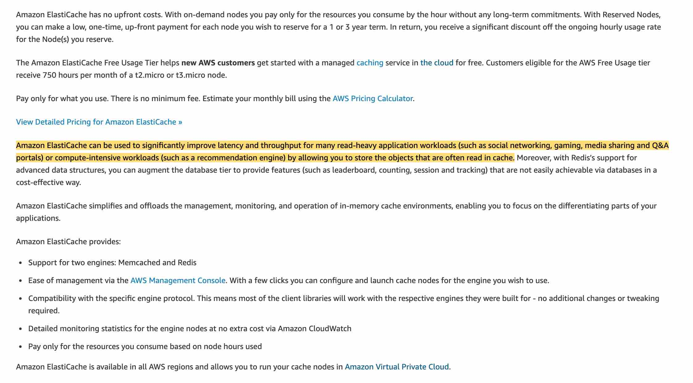

## Q-181

A company has a hybrid cloud structure for its on-premises data center and AWS Cloud infrastructure. The company wants to build a web log archival solution such that only the most frequently accessed logs are available as cached data locally while backing up all logs on Amazon S3.

As a solutions architect, which of the following solutions would you recommend for this use-case?

- Use AWS Volume Gateway - Stored Volume - to store the most frequently accessed logs locally for low-latency access while storing the full volume with all logs in its Amazon S3 service bucket

- Use AWS Direct Connect to store the most frequently accessed logs locally for low-latency access while storing the full backup of logs in an Amazon S3 bucket

- Use AWS Snowball Edge Storage Optimized device to store the most frequently accessed logs locally for low-latency access while storing the full backup of logs in an Amazon S3 bucket

- **Use AWS Volume Gateway - Cached Volume - to store the most frequently accessed logs locally for low-latency access while storing the full volume with all logs in its Amazon S3 service bucket**

**NOTE**

  - **Storage Gateway**

    - **1. File Gateway**
      - File level Access (NFS / SMB)
      - Stores data in `AWS S3`

      - `Caches frequently accessed files locally`
      - Used for logs, file shares, media etc

      - It does NOT store in:

      - EFS ❌

      - FSx ❌

      - EBS ❌

    **2. Volume Gateway**

      - Block-level storage
      - Looks like a disk to on-premise server
      - Data stored in `AWS S3`
      - Used for **DB**, **Legacy app**
      - `Frequently accessed `**`blocks`**` cached locally`

      Volume Gateway has 2 modes

      - **1. Store Volume mode**

          - Primary data stored locally
          - Entire Volume backed up asynchronously to AWS S3
          - S3 is just backup

      - **2. Cached Volume Mode**   

         - Only Frequently Accessed Data stored locally as **Cached stored**

         - REST of Data will stored in AWS S3.


    
    **3. Tape Gateway**
      - Virtual tape library
      - Used for backup software
      - Stores backuips in `AWS S3/Glacier`.

**Overall explanation**
`Correct option:`


- **Use AWS Volume Gateway - Cached Volume - to store the most frequently accessed logs locally for low-latency access while storing the full volume with all logs in its Amazon S3 service bucket**

- AWS Storage Gateway is a hybrid cloud storage service that gives you on-premises access to virtually unlimited cloud storage. The service provides three different types of gateways – Tape Gateway, File Gateway, and Volume Gateway – that seamlessly connect on-premises applications to cloud storage, caching data locally for low-latency access. 

- `With cached volumes, the AWS Volume Gateway stores the full volume in its Amazon S3 service bucket, and just the recently accessed data is retained in the gateway’s local cache for low-latency access.`

## Q-182

A financial services company wants to identify any sensitive data stored on its Amazon S3 buckets. The company also wants to monitor and protect all data stored on Amazon S3 against any malicious activity.

As a solutions architect, which of the following solutions would you recommend to help address the given requirements?

- Use Amazon GuardDuty to monitor any malicious activity on data stored in Amazon S3 as well as to identify any sensitive data stored on Amazon S3

- Use Amazon Macie to monitor any malicious activity on data stored in Amazon S3. Use Amazon GuardDuty to identify any sensitive data stored on Amazon S3

- **Use Amazon GuardDuty to monitor any malicious activity on data stored in Amazon S3. Use Amazon Macie to identify any sensitive data stored on Amazon S3**

- Use Amazon Macie to monitor any malicious activity on data stored in Amazon S3 as well as to identify any sensitive data stored on Amazon S3

**NOTE**

**Use Amazon GuardDuty to monitor any malicious activity on data stored in Amazon S3. Use Amazon Macie to identify any sensitive data stored on Amazon S3**

- `Amazon GuardDuty` offers threat detection that enables you to `continuously monitor and protect your AWS accounts, workloads, and data stored in Amazon S3`.
- GuardDuty **analyzes continuous** streams of `meta-data generated from your account and network activity found in AWS CloudTrail Events, Amazon VPC Flow Logs, and DNS Logs`. 
- It also uses `integrated threat intelligence` such as known **malicious IP addresses**, **anomaly detection**, and **machine learning** to identify threats more accurately.

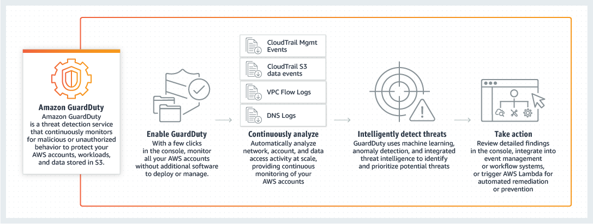

- **Amazon Macie**

 that uses machine learning and pattern matching to discover and protect your sensitive data on Amazon S3.
- Macie automatically detects a large and growing list of sensitive data types, including personally identifiable information (PII) such as names, addresses, and credit card numbers. 
- It also gives you constant visibility of the data security and data privacy of your data stored in Amazon S3.

## Q-183

A company has its application servers in the public subnet that connect to the database instances in the private subnet. For regular maintenance, the database instances need patch fixes that need to be downloaded from the internet.

Considering the company uses only IPv4 addressing and is looking for a fully managed service, which of the following would you suggest as an optimal solution?

- Configure an Egress-only internet gateway for the resources in the private subnet of the VPC

- Configure a Network Address Translation instance (NAT instance) in the public subnet of the VPC

- Configure a Network Address Translation gateway (NAT gateway) in the public subnet of the VPC

- Configure the Internet Gateway of the VPC to be accessible to the private subnet resources by changing the route tables

## Q-184

The DevOps team at an IT company is provisioning a two-tier application in a VPC with a public subnet and a private subnet. The team wants to use either a Network Address Translation (NAT) instance or a Network Address Translation (NAT) gateway in the public subnet to enable instances in the private subnet to initiate outbound IPv4 traffic to the internet but needs some technical assistance in terms of the configuration options available for the Network Address Translation (NAT) instance and the Network Address Translation (NAT) gateway.

As a solutions architect, which of the following options would you identify as CORRECT? (Select three)

- **NAT instance can be used as a bastion server**

- NAT gateway supports port forwarding

- **Security Groups can be associated with a NAT instance**

- **NAT instance supports port forwarding**

- NAT gateway can be used as a bastion server

- Security Groups can be associated with a NAT gateway

## Q-185

An e-commerce company has deployed its application on several Amazon EC2 instances that are configured in a private subnet using IPv4. These Amazon EC2 instances read and write a huge volume of data to and from Amazon S3 in the same AWS region. The company has set up subnet routing to direct all the internet-bound traffic through a Network Address Translation gateway (NAT gateway). The company wants to build the most cost-optimal solution without impacting the application's ability to communicate with Amazon S3 or the internet.

As an AWS Certified Solutions Architect Associate, which of the following would you recommend?

- Set up an egress-only internet gateway in the public subnet. Update the route table in the private subnet to route traffic to the internet gateway. Update the network ACL to allow the S3-bound traffic

- **Set up a VPC gateway endpoint for Amazon S3. Attach an endpoint policy to the endpoint. Update the route table to direct the S3-bound traffic to the VPC endpoint**

- Set up a Gateway Load Balancer (GWLB) endpoint for Amazon S3. Update the route table in the private subnet to direct the S3-bound traffic via the Gateway Load Balancer (GWLB) endpoint

- Provision an internet gateway. Update the route table in the private subnet to route traffic to the internet gateway. Update the network ACL (NACL) to allow the S3-bound traffic

## Q-186

A retail organization is moving some of its on-premises data to AWS Cloud. The DevOps team at the organization has set up an AWS Managed IPSec VPN Connection between their remote on-premises network and their Amazon VPC over the internet.

Which of the following represents the correct configuration for the IPSec VPN Connection?

- Create a virtual private gateway (VGW) on the on-premises side of the VPN and a Customer Gateway on the AWS side of the VPN

- Create a Customer Gateway on both the AWS side of the VPN as well as the on-premises side of the VPN

- **Create a virtual private gateway (VGW) on the AWS side of the VPN and a Customer Gateway on the on-premises side of the VPN**

- Create a virtual private gateway (VGW) on both the AWS side of the VPN as well as the on-premises side of the VPN

**NOTE**

**IPSec VPN OR Site-to-Site VPN Connections**

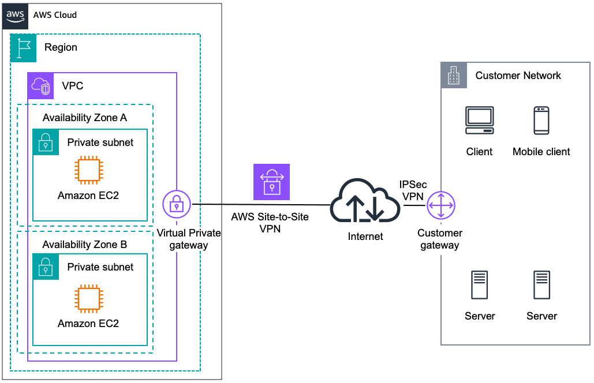

**Create a virtual private gateway (VGW) on the AWS side of the VPN and a Customer Gateway on the on-premises side of the VPN**

- Amazon VPC provides the facility to create an IPsec VPN connection (also known as AWS site-to-site VPN) between remote customer networks and their Amazon VPC over the internet. The following are the key concepts for a site-to-site VPN:

- **Virtual private gateway**: A virtual private gateway (VGW), also known as a VPN Gateway is the endpoint on the AWS VPC side of your VPN connection.

- **VPN connection**: A secure connection between your on-premises equipment and your VPCs.

- **VPN tunnel**: An encrypted link where data can pass from the customer network to or from AWS.

- **Customer Gateway**: An AWS resource that provides information to AWS about your Customer Gateway device.

- **Customer Gateway device**: A physical device or software application on the customer side of the Site-to-Site VPN connection.

## Q-187

A financial services company is modernizing its analytics platform on AWS. Their legacy data processing scripts, built for both Windows and Linux environments, require shared access to a file system that supports Windows ACLs and SMB protocol for compatibility with existing Windows workloads. At the same time, their Linux-based applications need to read from and write to the same shared storage to maintain cross-platform consistency. The solutions architect needs to design a storage solution that allows both Windows and Linux EC2 instances to access the shared file system simultaneously, while preserving Windows-specific features like NTFS permissions and Active Directory (AD) integration.

Which solution will best meet these requirements?

- Deploy Amazon FSx for Lustre and mount the file system using a POSIX-compliant client from both platforms

- **Deploy Amazon FSx for Windows File Server and mount it using the SMB protocol from both Windows and Linux EC2 instances**

- Create an S3 bucket and mount it on EC2 instances using Mountpoint for Amazon S3, managing access through IAM policies to support both Windows and Linux workloads

- Use Amazon EFS with the Standard storage class and mount the file system using NFS from both Windows and Linux instances

**NOTE**

**Deploy Amazon FSx for Windows File Server and mount it using the SMB protocol from both Windows and Linux EC2 instances**

- Amazon FSx for Windows File Server is the best choice for enabling shared file access between both Windows and Linux EC2 instances while preserving Windows-native features like SMB protocol support, NTFS file system permissions, and Active Directory (AD) integration. 
- Windows instances can seamlessly mount the file system using SMB, and Linux instances can also connect using SMB clients (e.g., via cifs-utils). 
- This allows Linux applications to access and interact with the same file system used by Windows applications, maintaining consistent permissions and supporting cross-platform collaboration. 
- FSx for Windows is purpose-built for such hybrid environments, making it a fully managed and feature-rich solution that aligns with enterprise-grade security and interoperability requirements.

## Q-188

A company maintains its business-critical customer data on an on-premises system in an encrypted format. Over the years, the company has transitioned from using a single encryption key to multiple encryption keys by dividing the data into logical chunks. With the decision to move all the data to an Amazon S3 bucket, the company is now looking for a technique to encrypt each file with a different encryption key to provide maximum security to the migrated on-premises data.

How will you implement this requirement without adding the overhead of splitting the data into logical groups?

- Configure a single Amazon S3 bucket to hold all data. Use server-side encryption with AWS KMS (SSE-KMS) and use encryption context to generate a different key for each file/object that you store in the S3 bucket

- **Configure a single Amazon S3 bucket to hold all data. Use server-side encryption with Amazon S3 managed keys (SSE-S3) to encrypt the data**

- Use Multi-Region keys for client-side encryption in the AWS S3 Encryption Client to generate unique keys for each file of data

- Store the logically divided data into different Amazon S3 buckets. Use server-side encryption with Amazon S3 managed keys (SSE-S3) to encrypt the data

**NOTE**

**Overall explanation**
`Correct option:`

- **Configure a single Amazon S3 bucket to hold all data. Use server-side encryption with Amazon S3 managed keys (SSE-S3) to encrypt the data**

- Server-side encryption is the encryption of data at its destination by the application or service that receives it. Amazon S3 encrypts your data at the object level as it writes it to disks in its data centers and decrypts it for you when you access it. When you use server-side encryption with Amazon S3 managed keys (SSE-S3), each object is encrypted with a unique key. As an additional safeguard, it encrypts the key itself with a root key that it regularly rotates.

- Note: Amazon S3 now applies server-side encryption with Amazon S3 managed keys (SSE-S3) as the base level of encryption for every bucket in Amazon S3. Starting January 5, 2023, all new object uploads to Amazon S3 will be automatically encrypted at no additional cost and with no impact on performance.

**Incorrect Options**

**Configure a single Amazon S3 bucket to hold all data. Use server-side encryption with AWS KMS (SSE-KMS) and use encryption context to generate a different key for each file/object that you store in the S3 bucket**

- An encryption context is a set of key-value pairs that contain additional contextual information about the data. When an encryption context is specified for an encryption operation, Amazon S3 must specify the same encryption context for the decryption operation. The encryption context offers another level of security for the encryption key. However, it is not useful for generating unique keys.

## Q-189

departments running their own AWS accounts. The departments operate from different countries and are spread across various AWS Regions. The company wants to set up a consistent resource provisioning process across departments so that each resource follows pre-defined configurations such as using a specific type of Amazon EC2 instances, specific IAM roles for AWS Lambda functions, etc.

As a solutions architect, which of the following options would you recommend for this use-case?

- Use AWS CloudFormation stacks to deploy the same template across AWS accounts and regions

- **Use AWS CloudFormation StackSets to deploy the same template across AWS accounts and regions**

- Use AWS CloudFormation templates to deploy the same template across AWS accounts and regions

- Use AWS Resource Access Manager (AWS RAM) to deploy the same template across AWS accounts and regions

**NOTE**

**Overall explanation**
`Correct option:`

**Use AWS CloudFormation StackSets to deploy the same template across AWS accounts and regions**

- AWS CloudFormation StackSet extends the functionality of stacks by `enabling you to create, update, or delete stacks` **across multiple accounts and regions with a single operation**. 
- A stack set `lets you create stacks in AWS accounts across regions` by using a `single AWS CloudFormation template`. 
- Using an administrator account of an "AWS Organization", you define and manage an AWS CloudFormation template, and use the template as the basis for provisioning stacks into selected target accounts of an "AWS Organization" across specified regions.

AWS CloudFormation StackSets: 

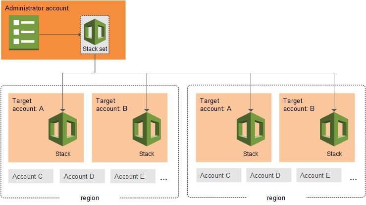

## Q-190

A startup is building a serverless microservices architecture where client applications (web and mobile) authenticate users via a third-party OIDC-compliant identity provider. The backend APIs must validate JSON Web Tokens (JWTs) issued by this provider, enforce scope-based access control, and be cost-effective with minimal latency. The development team wants to use a fully managed service that supports JWT validation natively, without writing custom authentication logic.

Which solution should the team implement to meet these requirements?

- Use Amazon API Gateway WebSocket API with JWT claims validated by a Lambda authorizer

- Use Amazon API Gateway REST API with a Lambda function that manually validates JWT tokens

- Deploy a gRPC backend on Amazon ECS Fargate and expose it through AWS App Runner, handling JWT validation inside the containerized services

- **Use Amazon API Gateway HTTP API with a native JWT authorizer configured to validate tokens from the OIDC provider**

**Overall explanation**
`Correct option: `

**Use Amazon API Gateway HTTP API with a native JWT authorizer configured to validate tokens from the OIDC provider**

- Amazon API Gateway HTTP APIs support native JWT authorizers, allowing developers to configure the API to automatically validate JWT tokens issued by an OIDC-compliant identity provider, such as Auth0, Okta, or Amazon Cognito. This eliminates the need for custom authentication logic in Lambda functions and reduces both latency and cost. HTTP APIs are optimized for low-latency, high-performance workloads and are more cost-effective than REST APIs, making them ideal for modern, serverless applications that require standard JWT validation and claim-based access control.

## Q-191

A company is transferring a significant volume of data from on-site storage to AWS, where it will be accessed by Windows, Mac, and Linux-based Amazon EC2 instances within the same AWS region using both SMB and NFS protocols. Part of this data will be accessed regularly, while the rest will be accessed less frequently. The company requires a hosting solution for this data that minimizes operational overhead.

What solution would best meet these requirements?

- Set up an Amazon FSx for OpenZFS instance. Configure an FSx for OpenZFS file ystem on the root volume and migrate the data to the FSx for OpenZFS volume

- Set up an Amazon Elastic File System (Amazon EFS) volume that uses EFS Infrequent Access. Use AWS DataSync to migrate the data to the EFS volume

- Set up an Amazon Elastic File System (Amazon EFS) volume that uses EFS Intelligent-Tiering. Use AWS DataSync to migrate the data to the EFS volume

- **Set up an Amazon FSx for ONTAP instance. Configure an FSx for ONTAP file system on the root volume and migrate t*he data to the FSx for ONTAP volume**

**Overall explanation**
`Correct option:`

**Set up an Amazon FSx for ONTAP instance. Configure an FSx for ONTAP file system on the root volume and migrate the data to the FSx for ONTAP volume**

- Amazon FSx for NetApp ONTAP is a storage service that `allows customers to launch and run fully managed ONTAP file systems` in the cloud.

- The given use case mandates `that the storage on AWS will be accessed by` **Windows**, **Mac**, and **Linux-based Amazon EC2 instances** within the same AWS region using both `SMB and NFS protocols`. Amongst the Amazon FSx family, FSx for ONTAP is the only file system that supports this key requirement.


---

Paper Set 4
---

## Q-192

A Pharmaceuticals company is looking for a simple solution to connect its VPCs and on-premises networks through a central hub.

As a Solutions Architect, which of the following would you suggest as the solution that requires the LEAST operational overhead?

- **Use AWS Transit Gateway to connect the Amazon VPCs to the on-premises networks**

- Use Transit VPC Solution to connect the Amazon VPCs to the on-premises networks

- Partially meshed VPC peering can be used to connect the Amazon VPCs to the on-premises networks

- Fully meshed VPC peering can be used to connect the Amazon VPCs to the on-premises networks

**NOTE**

-Yes, you can connect your AWS VPC to an on-premise network using AWS Transit Gateway. - It acts as a **central hub** for `connecting multiple VPCs and on-premises networks (via VPN or Direct Connect)` to simplify network architecture, reduce complexity, and provide a single point of management. 

- `Central Hub`: The Transit Gateway acts as a virtual regional router, connecting VPCs, AWS accounts, and on-premises networks together.
- `On-Premise Connection Types`: You can connect your on-premises data center to the Transit Gateway using:
- `AWS Site-to-Site VPN`: For secure, encrypted connections over the internet.
- `AWS Direct Connect`: For dedicated, private, high-bandwidth connectivity.

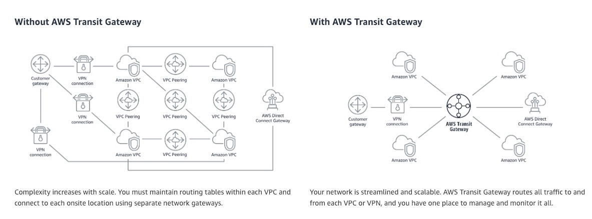

## Q-193

The engineering team at an e-commerce company has been tasked with migrating to a serverless architecture. The team wants to focus on the key points of consideration when using AWS Lambda as a backbone for this architecture.

As a Solutions Architect, which of the following options would you identify as correct for the given requirement? (Select three)

- **By default, AWS Lambda functions always operate from an AWS-owned VPC and hence have access to any public internet address or public AWS APIs. Once an AWS Lambda function is VPC-enabled, it will need a route through a Network Address Translation gateway (NAT gateway) in a public subnet to access public resources**

- The bigger your deployment package, the slower your AWS Lambda function will cold-start. Hence, AWS suggests packaging dependencies as a separate package from the actual AWS Lambda package

- **Since AWS Lambda functions can scale extremely quickly, it's a good idea to deploy a Amazon CloudWatch Alarm that notifies your team when function metrics such as ConcurrentExecutions or Invocations exceeds the expected threshold**

- **If you intend to reuse code in more than one AWS Lambda function, you should consider creating an AWS Lambda Layer for the reusable code**

- Serverless architecture and containers complement each other but you cannot package and deploy AWS Lambda functions as container images

- AWS Lambda allocates compute power in proportion to the memory you allocate to your function. AWS, thus recommends to over provision your function time out settings for the proper performance of AWS Lambda functions

**Overall explanation**

- **✅ 1. VPC & NAT Gateway Behavior (Correct)**

- By default, AWS Lambda functions always operate from an AWS-owned VPC and hence have access to any public internet address or public AWS APIs. Once an AWS Lambda function is VPC-enabled, it will need a route through a Network Address Translation gateway (NAT gateway) in a public subnet to access public resources

✔ Correct

- By default, AWS Lambda runs in an AWS-managed VPC.

- It has outbound internet access by default.

- If you attach Lambda to your own VPC (e.g., to access RDS in private subnet), it loses internet access unless:

- You configure a NAT Gateway in a public subnet

- And route traffic from private subnets to that NAT

## Q-194

A ride-sharing company wants to improve the ride-tracking system that stores GPS coordinates for all rides. The engineering team at the company is looking for a NoSQL database that has single-digit millisecond latency, can scale horizontally, and is serverless, so that they can perform high-frequency lookups reliably.

As a Solutions Architect, which database do you recommend for their requirements?

- Amazon Neptune

- **Amazon DynamoDB**

- Amazon ElastiCache

- Amazon Relational Database Service (Amazon RDS)

**Overall explanation**
`Correct option:`

**Amazon DynamoDB**

- Amazon DynamoDB is a `key-value and document database` that **delivers single-digit millisecond performance** at any scale. It's a fully managed, multi-Region, multi-master, durable NoSQL database with built-in security, backup and restore, and in-memory caching for internet-scale applications. DynamoDB can `handle more than 10 trillion requests per day` and can support **peaks of more than 20 million requests per second**. DynamoDB is `serverless`, has `single-digit millisecond latency and scales horizontally`. This is the correct choice for the given requirements.

**Incorrect options**

- **Amazon Neptune** - Amazon Neptune is a fast, reliable, fully-managed graph database service that makes it easy to build and run applications that work with highly connected datasets. The core of Amazon Neptune is a purpose-built, high-performance graph database engine optimized for storing billions of relationships and querying the graph with milliseconds latency. Neptune powers graph use cases such as recommendation engines, fraud detection, knowledge graphs, drug discovery, and network security.

## Q-195

A ride-hailing startup has launched a mobile app that matches passengers with nearby drivers based on real-time GPS coordinates. The application backend uses an Amazon RDS for PostgreSQL instance with read replicas to store the latitude and longitude of drivers and passengers. As the service scales, the backend experiences performance bottlenecks during peak hours, especially when thousands of updates and reads occur per second to keep location data current. The company expects its user base to double in the next few months and needs a high-performance, scalable solution that can handle frequent write and read operations with minimal latency.

What do you recommend?

- Enable Multi-AZ deployment for the primary RDS instance to improve write resilience and fault tolerance. Use Multi-AZ standby failover to distribute reads during peak hours

- Migrate the location data to Amazon OpenSearch Service and use its geospatial indexing features to retrieve and store coordinates in near real-time. Visualize tracking data using OpenSearch Dashboards

- Create a read-replica Auto Scaling policy for the PostgreSQL database to dynamically add replicas during peak load. Distribute traffic evenly using an RDS proxy with failover configuration

- **Place an Amazon ElastiCache for Redis cluster in front of the PostgreSQL database. Modify the application to cache recent location reads and updates in Redis, using a TTL-based eviction strategy**

**NOTE**

- To maintain data freshness and avoid memory bloat, a TTL (Time To Live) policy can be used on each cache entry—ensuring that each player's location automatically expires after, say, 30 seconds unless refreshed. This TTL-based eviction strategy helps keep the dataset current while minimizing the Redis memory footprint.

- Redis natively supports geospatial data types and commands like GEOADD, GEORADIUS, and GEODIST, making it a perfect fit for storing and querying latitude and longitude data. This means the app can quickly retrieve all drivers within a radius of a user without putting pressure on the relational database.

- Amazon ElastiCache for Redis is a fully managed, in-memory data store that offers sub-millisecond latency for read and write operations. It is ideal for workloads that involve frequent, short-lived data interactions, such as tracking a user's changing GPS coordinates in real time. Instead of hitting the Amazon RDS for PostgreSQL database for every update or query, the application can cache these values temporarily in Redis.

## Q-196

A company wants to adopt a hybrid cloud infrastructure where it uses some AWS services such as Amazon S3 alongside its on-premises data center. The company wants a dedicated private connection between the on-premise data center and AWS. In case of failures though, the company needs to guarantee uptime and is willing to use the public internet for an encrypted connection.

What do you recommend? (Select two)

- **Use AWS Site-to-Site VPN as a backup connection**

- Use Egress Only Internet Gateway as a backup connection

- **Use AWS Direct Connect connection as a primary connection**

- Use AWS Direct Connect connection as a backup connection

- Use AWS Site-to-Site VPN as a primary connection

**Overall explanation**
`Correct options:`

**Use AWS Direct Connect connection as a primary connection**

- AWS Direct Connect lets you establish a dedicated network connection between your network and one of the AWS Direct Connect locations. Using industry-standard 802.1q VLANs, this dedicated connection can be partitioned into multiple virtual interfaces. AWS Direct Connect does not involve the Internet; instead, it uses dedicated, private network connections between your intranet and Amazon VPC.

**Use AWS Site-to-Site VPN as a backup connection**

- AWS Site-to-Site VPN enables you to securely connect your on-premises network or branch office site to your Amazon Virtual Private Cloud (Amazon VPC). You can securely extend your data center or branch office network to the cloud with an AWS Site-to-Site VPN connection. A VPC VPN Connection utilizes IPSec to establish encrypted network connectivity between your intranet and Amazon VPC over the Internet. VPN Connections can be configured in minutes and are a good solution if you have an immediate need, have low to modest bandwidth requirements, and can tolerate the inherent variability in Internet-based connectivity.

- AWS Direct Connect as a primary connection guarantees great performance and security (as the connection is private). Using Direct Connect as a backup solution would work but probably carries a risk it would fail as well. As we don't mind going over the public internet (which is reliable, but less secure as connections are going over the public route), we should use a Site to Site VPN which offers an encrypted connection to handle failover scenarios.

## Q-197

A company has recently created a new department to handle their services workload. An IT team has been asked to create a custom VPC to isolate the resources created in this new department. They have set up the public subnet and internet gateway (IGW). However, they are not able to ping the Amazon EC2 instances with elastic IP address (EIP) launched in the newly created VPC.

As a Solutions Architect, the team has requested your help. How will you troubleshoot this scenario? (Select two)

- **Check if the security groups allow ping from the source**

- **Check if the route table is configured with internet gateway**

- Disable Source / Destination check on the Amazon EC2 instance

- Contact AWS support to map your VPC with subnet

- Create a secondary internet gateway to attach with public subnet and move the current internet gateway to private and write route tables

## Q-198

An e-commerce company has copied 1 petabyte of data from its on-premises data center to an Amazon S3 bucket in the us-west-1 Region using an AWS Direct Connect link. The company now wants to set up a one-time copy of the data to another Amazon S3 bucket in the us-east-1 Region. The on-premises data center does not allow the use of AWS Snowball.

As a Solutions Architect, which of the following options can be used to accomplish this goal? (Select two)

- **Copy data from the source bucket to the destination bucket using the aws S3 sync command**

- **Set up Amazon S3 batch replication to copy objects across Amazon S3 buckets in another Region using S3 console and then delete the replication configuration**

- Set up Amazon S3 Transfer Acceleration (Amazon S3TA) to copy objects across Amazon S3 buckets in different Regions using S3 console

- Use AWS Snowball Edge device to copy the data from one Region to another Region

- Copy data from the source Amazon S3 bucket to a target Amazon S3 bucket using the S3 console

**NOTE**

**Set up Amazon S3 batch replication to copy objects across Amazon S3 buckets in another Region using S3 console and then delete the replication configuration**

**✅ Amazon S3 Batch Replication**

`This is specifically designed for:`

- One-time replication of existing objects

- Cross-Region copying

- Large-scale datasets (like 1 PB)

- When continuous replication is NOT required

- Needs a one-time copy

- Already uploaded 1 PB to Amazon S3 in us-west-1

👉 Normal `S3 Replication (CORS) Replications` - only works for **new objects**
👉 `Batch Replications` works for **existing objects**

**Incorrect Options**

- Set up Amazon S3 Transfer Acceleration (Amazon S3TA) to copy objects across Amazon S3 buckets in different Regions using S3 console - Amazon S3 Transfer Acceleration (Amazon S3TA) is a bucket-level feature that enables fast, easy, and secure transfers of files over long distances between your client and an Amazon S3 bucket. `You cannot use Transfer Acceleration` `to copy objects across Amazon S3 buckets` in different Regions using Amazon S3 console.

## Q-199

A digital media platform is preparing to launch a new interactive content service that is expected to receive sudden spikes in user engagement, especially during live events and media releases. The backend uses an Amazon Aurora PostgreSQL Serverless v2 cluster to handle dynamic workloads. The architecture must be capable of scaling both compute and storage performance to maintain low latency and avoid bottlenecks under load. The engineering team is evaluating storage configuration options and wants a solution that will scale automatically with traffic, optimize I/O performance, and remain cost-effective without manual provisioning or tuning.

Which configuration will best meet these requirements?

A digital media platform is preparing to launch a new interactive content service that is expected to receive sudden spikes in user engagement, especially during live events and media releases. The backend uses an Amazon Aurora PostgreSQL Serverless v2 cluster to handle dynamic workloads. The architecture must be capable of scaling both compute and storage performance to maintain low latency and avoid bottlenecks under load. The engineering team is evaluating storage configuration options and wants a solution that will scale automatically with traffic, optimize I/O performance, and remain cost-effective without manual provisioning or tuning.

Which configuration will best meet these requirements?

- **Configure the Aurora cluster to use Aurora I/O-Optimized storage. This configuration delivers high throughput and low-latency I/O performance with predictable pricing and no I/O-based charges**

- Select Provisioned IOPS (io1) as the storage type for the Aurora cluster. Manually adjust IOPS based on expected traffic during peak usage

- Configure the cluster with Magnetic (Standard) storage to minimize baseline storage costs and rely on Aurora’s autoscaling to handle demand spikes

- Configure the Aurora cluster to use General Purpose SSD (gp2) storage. Increase performance by scaling database compute capacity to reduce IOPS bottlenecks

**Overall explanation**
`Correct option:`

- **Configure the Aurora cluster to use Aurora I/O-Optimized storage. This configuration delivers high throughput and low-latency I/O performance with predictable pricing and no I/O-based charges**

- Aurora I/O-Optimized is a purpose-built storage configuration for Aurora that eliminates I/O-based pricing and provides consistent high-throughput and low-latency performance, especially under high workloads. 
- It's ideal for use cases with frequent read/write operations, such as media platforms and real-time applications. 
- With I/O-Optimized, customers pay a flat storage rate and benefit from enhanced performance without needing to manage or provision IOPS manually. 
- It's designed to be both cost-effective and performant in I/O-heavy environments.

## Q-200

As an e-sport tournament hosting company, you have servers that need to scale and be highly available. Therefore you have deployed an Elastic Load Balancing (ELB) with an Auto Scaling group (ASG) across 3 Availability Zones (AZs). When e-sport tournaments are running, the servers need to scale quickly. And when tournaments are done, the servers can be idle. As a general rule, you would like to be highly available, have the capacity to scale and optimize your costs.

What do you recommend? (Select two)

- Set the minimum capacity to 3

- Set the minimum capacity to 1

- **Use Reserved Instances (RIs) for the minimum capacity**

- Use Dedicated hosts for the minimum capacity

- **Set the minimum capacity to 2**

**NOTE**

**Set the minimum capacity to 2**

- You configure the size of your Auto Scaling group by setting the `minimum`, `maximum`, and `desired capacity`. 
- The minimum and maximum capacity are required to create an Auto Scaling group, while the desired capacity is optional. If `you do not define your desired capacity` upfront, it `defaults to your minimum capacity`.

- Here, even though our ASG is deployed `across 3 Availability Zones (AZs)`, the `minimum capacity` to be **highly available is 2**. `When we specify 2 as the minimum capacity, the ASG would create these 2 instances in separate Availability Zones (AZs)`. **If demand goes up**, the **ASG would spin up a new instance in the third Availability Zone (AZ)**. Later as the demand subsides, the ASG would scale-in and the instance count would be back to 2.

**Use Reserved Instances (RIs) for the minimum capacity**

- Reserved Instances (RIs) provide you with significant savings on your Amazon EC2 costs compared to On-Demand Instance pricing. Reserved Instances are not physical instances, but rather a billing discount applied to the use of On-Demand Instances in your account. These On-Demand Instances must match certain attributes, such as instance type and Region, to benefit from the billing discount. Since minimum capacity will always be maintained, it is cost-effective to choose reserved instances than any other option.

- In case of an Availability Zone (AZ) outage, the instance in that Availability Zone (AZ) would go down however the other instance would still be available. The ASG would provision the replacement instance in the third Availability Zone (AZ) to keep the minimum count to 2.

## Q-201

A streaming media company operates a high-traffic content delivery platform on AWS. The application backend is deployed on Amazon EC2 instances within an Auto Scaling group across multiple Availability Zones in a VPC. The team has observed that workloads follow predictable usage patterns, such as higher viewership on weekends and in the evenings, along with occasional real-time spikes due to viral content. To reduce cost and improve responsiveness, the team wants an automated scaling approach that can forecast future demand using historical usage patterns, scale in advance based on those predictions, and react quickly to unplanned usage surges in real time.

Which scaling strategy should a solutions architect recommend to meet these requirements?

- Implement scheduled scaling actions based on pre-defined time windows from historical traffic data. Adjust instance count manually for known high-traffic hours

- Set up simple scaling policies with longer cooldown periods to avoid rapid scaling. Trigger scale-out events based on average network throughput

- Configure step scaling policies based on EC2 CPU utilization. Use CloudWatch alarms to trigger scaling actions when utilization crosses defined thresholds with incremental adjustments

- **Use predictive scaling for the Auto Scaling group to analyze daily and weekly patterns, and configure dynamic scaling with target tracking policies to respond to real-time traffic changes**

**Overall explanation**
`Correct option:`

**Use predictive scaling for the Auto Scaling group to analyze daily and weekly patterns, and configure dynamic scaling with target tracking policies to respond to real-time traffic changes**

- This strategy offers the most intelligent and automated approach for the given requirements. Predictive scaling uses machine learning to analyze historical workload patterns and forecast future usage. It can schedule capacity adjustments in advance based on expected demand. By combining predictive scaling with dynamic scaling using target tracking (e.g., maintaining average CPU at 60%), the Auto Scaling group can adapt in real time to unforeseen traffic surges. This hybrid method provides cost-efficiency and responsiveness.

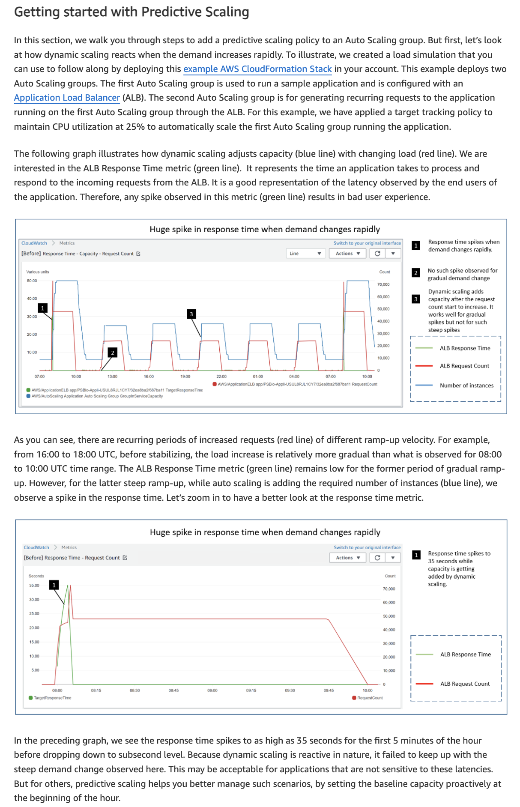

## Q-202

A retail company uses AWS Cloud to manage its technology infrastructure. The company has deployed its consumer-focused web application on Amazon EC2-based web servers and uses Amazon RDS PostgreSQL database as the data store. The PostgreSQL database is set up in a private subnet that allows inbound traffic from selected Amazon EC2 instances. The database also uses AWS Key Management Service (AWS KMS) for encrypting data at rest.

Which of the following steps would you recommend to facilitate end-to-end security for the data-in-transit while accessing the database?

**Configure Amazon RDS to use SSL for data in transit**

- Create a new security group that blocks SSH from the selected Amazon EC2 instances into the database

- Create a new network access control list (network ACL) that blocks SSH from the entire Amazon EC2 subnet into the database

- Use IAM authentication to access the database instead of the database user's access credentials

**NOTE**

**Configure Amazon RDS to use SSL for data in transit**

This is correct ✅

Why?

SSL/TLS:

  - Encrypts traffic between EC2 and RDS

  - Prevents man-in-the-middle attack

  - Protects data while moving over network

  - This provides true end-to-end encryption in transit.

In Amazon RDS:

  - Encryption at rest → KMS

  - Encryption in transit → Enable SSL/TLS

## Q-203

The development team at a social media company wants to handle some complicated queries such as "What are the number of likes on the videos that have been posted by friends of a user A?".

As a solutions architect, which of the following AWS database services would you suggest as the BEST fit to handle such use cases?

- Amazon Redshift

- Amazon OpenSearch Service

- **Amazon Neptune**

- Amazon Aurora

**NOtE**

# 🌊 What is AWS Neptune?

**Amazon Neptune** is a **fully managed graph database service**.

It is used when your data has **relationships** and you need to query connections very fast.

# 🧠 First Understand: What is a Graph Database?

Normal databases store:

* Tables → rows & columns

Graph database stores:

* **Nodes** (entities)
* **Edges** (relationships between nodes)
* **Properties** (data about them)

## Simple Example

Facebook-like example:

* Bhavin → Friend → Rahul
* Bhavin → Works At → Company
* Rahul → Likes → Cricket

This is **relationship-based data**.

If you try to do this in SQL → very complex joins.

In Graph DB → very fast traversal.

# 🏗 Neptune Architecture (Simple Version)

Neptune is built similar to **Amazon RDS** architecture but optimized for graphs.

## Core Components:

### 1️⃣ Neptune Cluster

* 1 Primary instance (writer)
* Up to 15 Read Replicas

### 2️⃣ Storage Layer

* Distributed, fault-tolerant
* 6 copies across 3 AZs
* Auto scaling up to 128 TB

### 3️⃣ Endpoints

* Cluster endpoint (write)
* Reader endpoint (read scaling)


# 🔵 Architecture Flow

```
Application (EC2 / Lambda)
        │
        ▼
Neptune Cluster Endpoint
        │
  ┌───────────────┐
  │ Primary (Write) │
  └───────────────┘
        │
  Shared Storage (6 copies, 3 AZ)
        │
  ┌───────────────┐
  │ Read Replicas  │
  └───────────────┘
```

Runs inside a VPC (private subnet).

# 🛠 Query Languages Supported

Neptune supports:

* Gremlin (Property Graph)
* SPARQL (RDF Graph)

# 🎯 When is Neptune Useful?

Use Neptune when:

### ✅ 1. Social Networks

Friend recommendations
"People you may know"

### ✅ 2. Fraud Detection

Find suspicious transaction chains

### ✅ 3. Recommendation Engines

Amazon-style product recommendations

### ✅ 4. Knowledge Graphs

Wikipedia-style connected information

### ✅ 5. Network/IT dependency mapping

Server → Service → Application mapping

# ❌ When NOT to Use Neptune

Don’t use Neptune for:

* Simple CRUD apps
* Banking ledger
* E-commerce product catalog
* Traditional transactional systems

For those use:

* **Amazon RDS**
* **Amazon DynamoDB**

# 🔥 Interview / Exam Trick

If question says:

* Highly connected data
* Relationship traversal
* Millisecond latency for graph queries
* Social, fraud, recommendation

👉 Answer is **Amazon Neptune**

## Q-204

A company runs a popular dating website on the AWS Cloud. As a Solutions Architect, you've designed the architecture of the website to follow a serverless pattern on the AWS Cloud using Amazon API Gateway and AWS Lambda. The backend uses an Amazon RDS PostgreSQL database. Currently, the application uses a username and password combination to connect the AWS Lambda function to the Amazon RDS database.

You would like to improve the security at the authentication level by leveraging short-lived credentials. What will you choose? (Select two)

- Deploy AWS Lambda in a VPC

- Restrict the Amazon RDS database security group to the AWS Lambda's security group

- **Use IAM authentication from AWS Lambda to Amazon RDS PostgreSQL**

- Embed a credential rotation logic in the AWS Lambda, retrieving them from SSM

- **Attach an AWS Identity and Access Management (IAM) role to AWS Lambda**

## Q-205

A company uses Application Load Balancers in multiple AWS Regions. The Application Load Balancers receive inconsistent traffic that varies throughout the year. The engineering team at the company needs to allow the IP addresses of the Application Load Balancers in the on-premises firewall to enable connectivity.

Which of the following represents the MOST scalable solution with minimal configuration changes?

- Migrate all Application Load Balancers in different Regions to the Network Load Balancers. Configure the on-premises firewall's rule to allow the Elastic IP addresses of all the Network Load Balancers

- **Set up AWS Global Accelerator. Register the Application Load Balancers in different Regions to the AWS Global Accelerator. Configure the on-premises firewall's rule to allow static IP addresses associated with the AWS Global Accelerator**

- Develop an AWS Lambda script to get the IP addresses of the Application Load Balancers in different Regions. Configure the on-premises firewall's rule to allow the IP addresses of the Application Load Balancers

- Set up a Network Load Balancer in one Region. Register the private IP addresses of the Application Load Balancers in different Regions with the Network Load Balancer. Configure the on-premises firewall's rule to allow the Elastic IP address attached to the Network Load Balancer

**NOTE**

# 🧠 Understand the Core Problem

* Company uses **Application Load Balancer** in multiple Regions
* Traffic varies (so scaling happens)
* On-prem firewall must allow ALB IPs
* They want:

  * ✅ Most scalable
  * ✅ Minimal configuration changes
  * ✅ Stable IPs

# 🚨 Important Concept

ALB does **NOT** provide static IP addresses.

* ALB IPs change
* It scales horizontally
* You cannot attach Elastic IP to ALB

So firewall rules will break if you whitelist ALB IPs directly.

# ❌ Option 1

> Migrate ALB to Network Load Balancer and allow Elastic IPs

Uses:
**Network Load Balancer**

Yes, NLB supports Elastic IP.

BUT:

* You must migrate all ALBs
* ALB is Layer 7 (HTTP/HTTPS features)
* NLB is Layer 4 (no WAF, no host-based routing, etc.)
* Major architecture change

❌ Not minimal change
❌ Not best scalable solution


# ❌ Option 3

> Lambda script to fetch ALB IPs and update firewall

Uses:
**AWS Lambda**

Problems:

* ALB IPs change dynamically
* Constant firewall updates required
* High operational overhead
* Risk of downtime

❌ Not scalable
❌ Not minimal ops


# ❌ Option 4

> One NLB in one region pointing to ALBs in other regions

Problem:

* NLB cannot register ALB private IPs across regions
* Cross-region complexity
* Not a valid architecture pattern

❌ Technically incorrect design

# ✅ Correct Answer

## 👉 Use **AWS Global Accelerator**

# 🎯 Why Global Accelerator?

Global Accelerator provides:

* 2 **static Anycast IP addresses**
* Works across multiple regions
* Can register multiple ALBs
* Automatic health checks
* Traffic routing to best region
* No ALB migration required

# 🏗 Architecture

```
On-Prem Firewall
     │
Allow Static IPs
     │
AWS Global Accelerator (Static IPs)
     │
   ├── ALB (us-east-1)
   ├── ALB (eu-west-1)
   └── ALB (ap-south-1)
```

Firewall allows ONLY Global Accelerator static IPs.

Behind the scenes:

* Global Accelerator routes traffic to healthy ALBs.
* ALB IP changes do NOT matter anymore.

# 🔥 Why This Is MOST Scalable

| Requirement           | How GA Solves It        |
| --------------------- | ----------------------- |
| Multi-region          | Native support          |
| Static IP             | Provides 2 static IPs   |
| No ALB migration      | Works with existing ALB |
| Minimal config change | Only add GA             |
| Auto failover         | Built-in                |

# 🧠 Exam Memory Trick

If question says:

* ALB + Need static IP
* Multi-region
* Firewall whitelist
* Minimal change

👉 Immediately think **AWS Global Accelerator**

## Q-207

A research organization is running a high-performance computing (HPC) workload using Amazon EC2 instances that are distributed across multiple Availability Zones (AZs) within a single AWS Region. The workload requires access to a shared file system with the lowest possible latency for frequent reads and writes.The team decides to use Amazon Elastic File System (Amazon EFS) for its scalability and simplicity. To ensure optimal performance and reduce network latency, the solution architect must design the architecture so that each EC2 instance can access the file system with the least possible delay.

Which of the following is the most appropriate solution to meet these requirements?

- Create a single EFS mount target in one AZ and allow all EC2 instances in other AZs to access it using the default mount target

- **Create EFS mount targets in each AZ and mount the EFS file system to EC2 instances in the same AZ as the mount target**

- Use Mountpoint for Amazon S3 to mount an S3 bucket on each EC2 instance and use it as a shared storage layer across Availability Zones

- Create mount targets for Amazon EFS on an EC2 instance in each AZ and use them to serve as access points for other instances

**NOTE**


# 🧠 Key Requirements

* HPC workload (needs **low latency**)
* EC2 across **multiple AZs**
* Shared file system
* Frequent reads & writes
* Using **Amazon Elastic File System**
* Want **least possible delay**

So the focus is:

👉 **Minimize network latency**

# 🔥 Important EFS Concept (Very Exam Important)

EFS is **regional**, but:

* It creates **Mount Targets inside each AZ**
* Each mount target has its own ENI (IP address)
* EC2 instances should connect to the mount target in the SAME AZ

If EC2 connects cross-AZ →
❌ Higher latency
❌ Cross-AZ data transfer cost

# ❌ Option 1

> Single EFS mount target in one AZ

Problem:

* EC2s in other AZs will access it cross-AZ
* Higher latency
* Cross-AZ charges
* Not optimized

# ❌ Option 3

> Use Mountpoint for Amazon S3

Uses:
**Amazon S3**

Problems:

* S3 is object storage, not POSIX file system
* Higher latency than EFS
* Not suitable for HPC shared file system

❌ Wrong

# ❌ Option 4

> Create mount targets on EC2 instance

Completely wrong concept.

Mount targets are created inside EFS, not on EC2.

❌ Incorrect architecture understanding

# ✅ Correct Answer

## 👉 Create EFS mount targets in each AZ and mount EFS to EC2 instances in the same AZ.


# 🏗 Correct Architecture

```id="xopq19"
AZ-A:
  EC2  →  Mount Target A

AZ-B:
  EC2  →  Mount Target B

AZ-C:
  EC2  →  Mount Target C

All Mount Targets connect to same Regional EFS
```

This ensures:

* Local AZ traffic
* Lowest latency
* No cross-AZ data transfer
* Best HPC performance

## Q-208

You are working for a software as a service (SaaS) company as a solutions architect and help design solutions for the company's customers. One of the customers is a bank and has a requirement to whitelist a public IP when the bank is accessing external services across the internet.

Which architectural choice do you recommend to maintain high availability, support scaling-up to 10 instances and comply with the bank's requirements?

- Use a Classic Load Balancer with an Auto Scaling Group

- Use an Auto Scaling Group with Dynamic Elastic IPs attachment

- **Use a Network Load Balancer with an Auto Scaling Group**

- Use an Application Load Balancer with an Auto Scaling Group

**NOTE**

`Application Load Balancer`

No static IP support

IP addresses change

Only DNS-based access

❌ Bank cannot whitelist it reliably

**Network Load Balancer with ASG**

Why?

Because NLB:

- Supports Elastic IP

- You can assign static IP per AZ

- Works with Auto Scaling Group

- Designed for high performance

## Q-209

A social media company wants the capability to dynamically alter the size of a geographic area from which traffic is routed to a specific server resource.

Which feature of Amazon Route 53 can help achieve this functionality?

- Weighted routing

- Latency-based routing

- **Geoproximity routing**

- Geolocation routing

**NOTE**

`“dynamically alter the size of a geographic area from which traffic is routed to a specific server resource”`

that means, **👉 “We want to increase or decrease the geographic coverage area of a server.”**

That means:

- Today this server handles traffic from nearby 2 countries

- Tomorrow we want it to handle 5 countries

- Or reduce it to 1 country

So the area is not fixed.
It must be adjustable.

---------

**Geoproximity** works based on:

- Distance

-Latitude/Longitude

- And most important → Bias

`Bias allows you to:`

- Expand traffic region

- Shrink traffic region

## Q-210

A global insurance company is modernizing its infrastructure by migrating multiple line-of-business applications from its on-premises data centers to AWS. These applications will be deployed across several AWS accounts, all governed under a centralized AWS Organizations structure. The company manages all user identities, groups, and access policies within its on-premises Microsoft Active Directory and wants to continue doing so. The goal is to enable seamless single sign-in across all AWS accounts without duplicating user identity stores or manually provisioning accounts.

Which solution best meets these requirements in the most operationally efficient manner?

- **Deploy AWS IAM Identity Center and configure it to use AWS Directory Service for Microsoft Active Directory (Enterprise Edition). Establish a two-way trust relationship between the managed directory and the on-premises Active Directory to enable federated authentication across all AWS accounts**

- Enable AWS IAM Identity Center and manually create user accounts and groups within it. Assign these users permission sets in each AWS account. Manage synchronization with on-premises Active Directory using custom PowerShell scripts

- Deploy an OpenLDAP server on Amazon EC2, sync it with the on-premises Active Directory, and integrate it with each AWS account by creating IAM roles that trust the EC2-hosted LDAP server as a SAML provider

- Use Amazon Cognito as the primary identity store and create a custom OpenID Connect (OIDC) federation with the on-premises Active Directory. Assign IAM roles using Cognito identity pools and propagate access to multiple AWS accounts using resource policies

**NOTE**

Amazon Cognito

**Cognito is for:**

- Web/mobile app users

- Customer identities (B2C)

`NOT for:`

- Workforce identity

0 AWS account access across organization

**Deploy IAM Identity Center + AWS Directory Service for Microsoft AD (Enterprise) + Two-way trust**

Uses:

- AWS IAM Identity Center

- AWS Directory Service

  - Company keeps managing users in on-prem AD

  - AWS Directory Service creates managed Microsoft AD

  - Two-way trust established

  - IAM Identity Center connects to that directory

  - Permission sets assigned across AWS accounts

## Q-211

Amazon Route 53 is configured to route traffic to two Network Load Balancer nodes belonging to two Availability Zones (AZs): AZ-A and AZ-B. Cross-zone load balancing is disabled. AZ-A has four targets and AZ-B has six targets.

Which of the below statements is true about traffic distribution to the target instances from Amazon Route 53?

- Each of the four targets in AZ-A receives 8% of the traffic

- Each of the six targets in AZ-B receives 10% of the traffic

- Each of the four targets in AZ-A receives 10% of the traffic

- **Each of the four targets in AZ-A receives 12.5% of the traffic**

**NOTEE**

- If `Cross-Zone load balancing is disabled, it will` **Not distriubte correctly between Targets**.

- **It will distribute 50% to Target 1** and **50% to Target 2**.

## Q-212

An enterprise has decided to move its secondary workloads such as backups and archives to AWS cloud. The CTO wishes to move the data stored on physical tapes to Cloud, without changing their current tape backup workflows. The company holds petabytes of data on tapes and needs a cost-optimized solution to move this data to cloud.

What is an optimal solution that meets these requirements while keeping the costs to a minimum?

- **Use Tape Gateway, which can be used to move on-premises tape data onto AWS Cloud. Then, Amazon S3 archiving storage classes can be used to store data cost-effectively for years**

- Use AWS Direct Connect, a cloud service solution that makes it easy to establish a dedicated network connection from on-premises to AWS to transfer data. Once this is done, Amazon S3 can be used to store data at lesser costs

- Use AWS DataSync, which makes it simple and fast to move large amounts of data online between on-premises storage and AWS Cloud. Data moved to Cloud can then be stored cost-effectively in Amazon S3 archiving storage classes

- Use AWS VPN connection between the on-premises datacenter and your Amazon VPC. Once this is established, you can use Amazon Elastic File System (Amazon EFS) to get a scalable, fully managed elastic NFS file system for use with AWS Cloud services and on-premises resources

## Q-213

A company has noticed that its Amazon EBS Elastic Volume (io1) accounts for 90% of the cost and the remaining 10% cost can be attributed to the Amazon EC2 instance. The Amazon CloudWatch metrics report that both the Amazon EC2 instance and the Amazon EBS volume are under-utilized. The Amazon CloudWatch metrics also show that the Amazon EBS volume has occasional I/O bursts. The entire infrastructure is managed by AWS CloudFormation.

As a Solutions Architect, what do you propose to reduce the costs?

- Keep the Amazon EBS volume to io1 and reduce the IOPS

- **Convert the Amazon EC2 instance EBS volume to gp2**

- Change the Amazon EC2 instance type to something much smaller

- Don't use a AWS CloudFormation template to create the database as the AWS CloudFormation service incurs greater service charges

**NOTE**

SSD-backed volumes optimized for transactional workloads involving frequent read/write operations with small I/O size, where the dominant performance attribute is IOPS.

HDD-backed volumes optimized for large streaming workloads where throughput (measured in MiB/s) is a better performance measure than IOPS

Provisioned IOPS SSD (io1) volumes are designed to meet the needs of I/O-intensive workloads, particularly database workloads, that are sensitive to storage performance and consistency. Unlike gp2, which uses a bucket and credit model to calculate performance, an io1 volume allows you to specify a consistent IOPS rate when you create the volume, and Amazon EBS delivers the provisioned performance 99.9 percent of the time.

Convert the Amazon EC2 instance EBS volume to gp2

General Purpose SSD (gp2) volumes offer cost-effective storage that is ideal for a broad range of workloads. These volumes deliver single-digit millisecond latencies and the ability to burst to 3,000 IOPS for an extended duration. Between a minimum of 100 IOPS (at 33.33 GiB and below) and a maximum of 16,000 IOPS (at 5,334 GiB and above), baseline performance scales linearly at 3 IOPS per GiB of volume size. AWS designs gp2 volumes to deliver a provisioned performance of 99% uptime. A gp2 volume can range in size from 1 GiB to 16 TiB.

Therefore, gp2 is the right choice as it is more cost-effective than io1, and it also allows a burst in performance when needed.

## Q-214

For security purposes, a development team has decided to deploy the Amazon EC2 instances in a private subnet. The team plans to use VPC endpoints so that the instances can access some AWS services securely. The members of the team would like to know about the two AWS services that support Gateway Endpoints.

As a solutions architect, which of the following services would you suggest for this requirement? (Select two)

- Amazon Simple Notification Service (Amazon SNS)

- **Amazon S3**

- Amazon Kinesis

- **Amazon DynamoDB**

- Amazon Simple Queue Service (Amazon SQS)

**NOTE**

In Amazon VPC, there are 2 main endpoint types:

1️⃣ Gateway Endpoint
2️⃣ Interface Endpoint (PrivateLink)
🔵 Gateway Endpoint

**Gateway endpoints:**

- Work at route table level

- No ENI created

- Free of charge

Only support 2 services

👉 Only:

- Amazon S3

- Amazon DynamoDB

- That’s it. No other service.

🔵 Interface Endpoint (PrivateLink)

**Interface endpoints:**

- Create ENI inside subnet

- Use private IP

- Have hourly + data cost

- Support most AWS services

Examples:

- SNS

- SQS

- Kinesis

- CloudWatch

- Secrets Manager

- Many others

## Q-215

An e-commerce company tracks user clicks on its flagship website and performs analytics to provide near-real-time product recommendations. An Amazon EC2 instance receives data from the website and sends the data to an Amazon Aurora Database instance. Another Amazon EC2 instance continuously checks the changes in the database and executes SQL queries to provide recommendations. Now, the company wants a redesign to decouple and scale the infrastructure. The solution must ensure that data can be analyzed in real-time without any data loss even when the company sees huge traffic spikes.

What would you recommend as an AWS Certified Solutions Architect - Associate?

- Leverage Amazon SQS to capture the data from the website. Configure a fleet of Amazon EC2 instances under an Auto scaling group to process messages from the Amazon SQS queue and trigger the scaling policy based on the number of pending messages in the queue. Perform real-time analytics using a third-party library on the Amazon EC2 instances

- **Leverage Amazon Kinesis Data Streams to capture the data from the website and feed it into Amazon Kinesis Data Analytics which can query the data in real time. Lastly, the analyzed feed is output into Amazon Kinesis Data Firehose to persist the data on Amazon S3**

- Leverage Amazon Kinesis Data Streams to capture the data from the website and feed it into Amazon Kinesis Data Firehose to persist the data on Amazon S3. Lastly, use Amazon Athena to analyze the data in real time

**NOTE**

**Athena is:**

- Batch query engine

- Not real-time

- Queries data already stored in S3

- This does NOT give near real-time analytics.

**Leverage Amazon Kinesis Data Streams to capture the data from the website and feed it into Amazon Kinesis Data Analytics which can query the data in real time. Lastly, the analyzed feed is output into Amazon Kinesis Data Firehose to persist the data on Amazon S3**

`Website → Kinesis Data Streams`

  - Handles massive traffic

  - Durable

  - Replay capability

  - No data loss

`Kinesis Data Analytics:`

  - Runs SQL on live stream

  - Near real-time processing

  - Perfect for recommendations

`Firehose → S3`

  - Long-term storage

  - Backup

  - Further analytics

## Q-216

A startup's cloud infrastructure consists of a few Amazon EC2 instances, Amazon RDS instances and Amazon S3 storage. A year into their business operations, the startup is incurring costs that seem too high for their business requirements.

Which of the following options represents a valid cost-optimization solution?

- Use AWS Compute Optimizer recommendations to help you choose the optimal Amazon EC2 purchasing options and help reserve your instance capacities at reduced costs

- Use Amazon S3 Storage class analysis to get recommendations for transitions of objects to Amazon S3 Glacier storage classes to reduce storage costs. You can also automate moving these objects into lower-cost storage tier using Lifecycle Policies

- Use AWS Trusted Advisor checks on Amazon EC2 Reserved Instances to automatically renew reserved instances (RI). AWS Trusted advisor also suggests Amazon RDS idle database instances

- **Use AWS Cost Optimization Hub to get a report of Amazon EC2 instances that are either idle or have low utilization and use AWS Compute Optimizer to look at instance type recommendations**

## Q-217

An e-commerce company wants to migrate its on-premises application to AWS. The application consists of application servers and a Microsoft SQL Server database. The solution should result in the maximum possible availability for the database layer while minimizing operational and management overhead.

As a solutions architect, which of the following would you recommend to meet the given requirements?

- Migrate the data to Amazon EC2 instance hosted SQL Server database. Deploy the Amazon EC2 instances in a Multi-AZ configuration

- Migrate the data to Amazon RDS for SQL Server database in a cross-region Multi-AZ deployment

- **Migrate the data to Amazon RDS for SQL Server database in a Multi-AZ deployment**

- Migrate the data to Amazon RDS for SQL Server database in a cross-region read-replica configuration

**NOTE**

- AWS RDS Multi-Az Deploy doesn't support cross-region db servers , cross-regions is a diff things is a **read-replicas**

- To make Multi-Az Deploy a High Available , you can create cross-regions read-replicas in other regions, but this is not in options.

- Otherwise, you can use **Aurora Global Database** is support max 5 regions.

## Q-218

The engineering team at a global e-commerce company is currently reviewing their disaster recovery strategy. The team has outlined that they need to be able to quickly recover their application stack with a Recovery Time Objective (RTO) of 5 minutes, in all of the AWS Regions that the application runs. The application stack currently takes over 45 minutes to install on a Linux system.

As a Solutions architect, which of the following options would you recommend as the disaster recovery strategy?

- Use Amazon EC2 user data to speed up the installation process

- Create an Amazon Machine Image (AMI) after installing the software and copy the AMI across all Regions. Use this Region-specific AMI to run the recovery process in the respective Regions**

- Create an Amazon Machine Image (AMI) after installing the software and use this AMI to run the recovery process in other Regions

- Store the installation files in Amazon S3 for quicker retrieval

## Q-219

A healthcare provider is experiencing rapid data growth in its on-premises servers due to increased patient imaging and record retention requirements. The organization wants to extend its storage capacity to AWS in a way that preserves quick access to critical records, including from its local file systems. The company must optimize bandwidth usage during migration and avoid any retrieval fees or delays when accessing the data in the cloud. The provider wants a hybrid cloud solution that requires minimal application reconfiguration, allows frequent local access to key datasets, and ensures that cloud storage costs remain predictable without paying extra for data retrieval.

Which AWS solution best meets these requirements?

- Deploy AWS Storage Gateway using stored volumes. Retain the full dataset on-premises and asynchronously back up point-in-time snapshots to Amazon S3. Configure applications to read from the local volume and recover data from the cloud if needed

- Implement Amazon FSx for Windows File Server and configure on-premises servers to mount the file system using a VPN connection. Store all primary data in FSx and use it as the central NAS replacement

- **Deploy AWS Storage Gateway using cached volumes. Store frequently accessed data locally, while writing all primary data asynchronously to Amazon S3**

- Set up Amazon S3 Standard-Infrequent Access (S3 Standard-IA) as the primary storage tier. Configure the on-premises file server to replicate changes to the S3 bucket using AWS DataSync for asynchronous updates

## Q-220

You are working as a Solutions Architect for a photo processing company that has a proprietary algorithm to compress an image without any loss in quality. Because of the efficiency of the algorithm, your clients are willing to wait for a response that carries their compressed images back. You also want to process these jobs asynchronously and scale quickly, to cater to the high demand. Additionally, you also want the job to be retried in case of failures.

Which combination of choices do you recommend to minimize cost and comply with the requirements? (Select two)

- Amazon EC2 On-Demand Instances

- **Amazon Simple Queue Service (Amazon SQS)**

- **Amazon EC2 Spot Instances**

- Amazon Simple Notification Service (Amazon SNS)

- Amazon EC2 Reserved Instances (RIs)

## Q-221

A ride-sharing company wants to use an Amazon DynamoDB table for data storage. The table will not be used during the night hours whereas the read and write traffic will often be unpredictable during day hours. When traffic spikes occur they will happen very quickly.

Which of the following will you recommend as the best-fit solution?

- **Set up Amazon DynamoDB table in the provisioned capacity mode with auto-scaling enabled**

- Set up Amazon DynamoDB table with a global secondary index

- **Set up Amazon DynamoDB table in the on-demand capacity mode**

- Set up Amazon DynamoDB global table in the provisioned capacity mode

**NOTE**

**On-Demand mode:**

- No capacity planning required

- Instantly adapts to traffic

- Handles sudden spikes automatically

- You pay per request

- Perfect for unpredictable workloads

**🧠 Exam Memory Trick**

If question says:

`Unpredictable traffic`

`Sudden spikes`

`Unknown usage pattern`

`Idle periods`

**👉 Always choose On-Demand mode**

If question says:

`Predictable workload`

`Stable traffic`

`Want cost optimization at scale`

**👉 Choose Provisioned + Auto Scaling**

## Q-222

A financial services company is implementing two separate data retention policies to comply with regulatory standards:

Policy A: Critical transaction records must be immediately available for audit and must not be deleted or overwritten for 7 years.

Policy B: Archived compliance data must be stored in a low-cost, long-term storage solution and locked from deletion or modification for at least 10 years.

As a solutions architect, which combination of AWS features should you recommend to enforce these policies effectively?

- **Use Amazon S3 Object Lock in Compliance mode for Policy A, and S3 Glacier Vault Lock for Policy B**

- Use Amazon S3 Glacier Vault Lock for both policies to reduce storage costs while enforcing retention

- Use Amazon S3 Object Lock in Governance mode for both policies to ensure data cannot be deleted prematurely

- Use Amazon S3 Standard storage class with S3 Lifecycle policies for Policy A, and S3 Glacier Flexible Retrieval for Policy B

**NOTE**

🏦 Policy A Requirements

Critical transaction records
Immediately available
Must NOT be deleted or overwritten for 7 years

Key words:

Immediately available ✅

Cannot delete/overwrite ✅

Strict regulatory compliance ✅

This is WORM (Write Once Read Many) requirement.

The correct AWS feature for this is:

🔐 Amazon S3 Object Lock – Compliance Mode

Why?

Object Lock Compliance Mode:

Prevents deletion

Prevents overwrite

Even root user cannot remove it

Enforces fixed retention period

Data remains in S3 (immediate access)

🧊 Policy B Requirements

Archived compliance data
Low-cost long-term storage
Locked from deletion/modification
At least 10 years

Key words:

Archived 🧊

Low cost 💰

Long-term retention 🔒

This is cold storage with compliance lock.

Correct feature:

🧊 Amazon S3 Glacier Vault Lock

Why?

Glacier Vault Lock:

Enforces compliance controls

Prevents deletion before retention expires

Designed for long-term archive

Much cheaper than S3 Standard

Ideal for 10+ year storage

## Q-223

A junior developer has downloaded a sample Amazon S3 bucket policy to make changes to it based on new company-wide access policies. He has requested your help in understanding this bucket policy.

As a Solutions Architect, which of the following would you identify as the correct description for the given policy?

```json
{
 "Version": "2012-10-17",
 "Id": "S3PolicyId1",
 "Statement": [
   {
     "Sid": "IPAllow",
     "Effect": "Allow",
     "Principal": "*",
     "Action": "s3:*",
     "Resource": "arn:aws:s3:::examplebucket/*",
     "Condition": {
        "IpAddress": {"aws:SourceIp": "54.240.143.0/24"},
        "NotIpAddress": {"aws:SourceIp": "54.240.143.188/32"}
     }
   }
 ]
}
```

- It ensures the Amazon S3 bucket is exposing an external IP within the Classless Inter-Domain Routing (CIDR) range specified, except one IP

- **It authorizes an entire Classless Inter-Domain Routing (CIDR) except one IP address to access the Amazon S3 bucket**

- It ensures Amazon EC2 instances that have inherited a security group can access the bucket

- It authorizes an IP address and a Classless Inter-Domain Routing (CIDR) to access the S3 bucket

## Q-224

A CRM web application was written as a monolith in PHP and is facing scaling issues because of performance bottlenecks. The CTO wants to re-engineer towards microservices architecture and expose their application from the same load balancer, linked to different target groups with different URLs: checkout.mycorp.com, www.mycorp.com, yourcorp.com/profile and yourcorp.com/search. The CTO would like to expose all these URLs as HTTPS endpoints for security purposes.

As a solutions architect, which of the following would you recommend as a solution that requires MINIMAL configuration effort?

- Use a wildcard Secure Sockets Layer certificate (SSL certificate)

- Change the Elastic Load Balancing (ELB) SSL Security Policy

- **Use Secure Sockets Layer certificate (SSL certificate) with SNI**

- Use an HTTP to HTTPS redirect

**NOTE**

### 1️⃣ What is **SNI in SSL/TLS?**

**SNI (Server Name Indication)** is an extension of the TLS protocol that allows a client (browser) to tell the server **which domain name it wants to connect to during the SSL/TLS handshake**.

Entity reference:
Server Name Indication
Transport Layer Security

In simple words:

👉 **SNI = sending the website hostname to the server before SSL encryption starts**.

Example request:

```
User opens:
https://example.com
```

During TLS handshake the browser sends:

```
Host: example.com
```

so the server knows **which SSL certificate to return**.

---

# 2️⃣ Why do we use SNI?

Because **multiple websites can share the same IP address and server**.

Example server:

```
IP: 203.0.113.10
```

Hosted domains:

```
example.com
api.example.com
myshop.com
blog.com
```

Each domain has **different SSL certificates**.

Without SNI the server **would not know which certificate to send**.

So SNI allows:

```
1 IP
↓
Multiple HTTPS websites
↓
Different SSL certificates
```

This is very common in:

* Shared hosting
* Kubernetes ingress
* Load balancers
* CDN
* Reverse proxies

Examples:

* Cloudflare
* Amazon Web Services
* NGINX

---

# 3️⃣ What happens if we **don't use SNI?**

Without SNI the server **cannot identify which domain the client wants**.

So the server will usually:

### Case 1 — Return default certificate

Example:

User visits:

```
https://api.example.com
```

But server returns certificate for:

```
example.com
```

Browser shows error:

```
SSL Certificate Mismatch
```

---

### Case 2 — HTTPS connection fails

Some servers simply reject the request.

---

### Case 3 — Need separate IP for each domain

Before SNI existed:

```
1 domain = 1 IP
```

Example:

```
example.com → 192.168.1.10
blog.com → 192.168.1.11
shop.com → 192.168.1.12
```

This wasted **a lot of IPv4 addresses**.

SNI solved this problem.

---

# 4. How SNI works (Step-by-Step)

When a user visits:

```
https://myshop.com
```

TLS handshake:

```
1 Browser → Server
   ClientHello
   SNI = myshop.com

2 Server checks
   Which certificate matches myshop.com

3 Server sends
   SSL certificate for myshop.com

4 Secure connection established
```

---

# 5. Real Example in Cloud / DevOps

SNI is heavily used in:

### Kubernetes Ingress

Example:

```
api.company.com  → API service
app.company.com  → frontend service
```

Same Load Balancer IP:

```
35.201.10.20
```

Ingress controller uses **SNI** to route traffic.

Tools using SNI:

* Kubernetes
* NGINX
* HAProxy

## Q-225

A CRM company has a software as a service (SaaS) application that feeds updates to other in-house and third-party applications. The SaaS application and the in-house applications are being migrated to use AWS services for this inter-application communication.

As a Solutions Architect, which of the following would you suggest to asynchronously decouple the architecture?

- Use Amazon Simple Queue Service (Amazon SQS) to decouple the architecture

- Use Elastic Load Balancing (ELB) for effective decoupling of system architecture

- Use Amazon Simple Notification Service (Amazon SNS) to communicate between systems and decouple the architecture

- **Use Amazon EventBridge to decouple the system architecture**

**NOTE**

Amazon EventBridge is designed specifically for event-driven architectures, especially for SaaS integrations.

It allows:

SaaS Application
      ↓
EventBridge Event Bus
      ↓
Multiple consumers
- In-house apps
- Third-party apps
- AWS services
Key Features

Native SaaS integrations

Event routing

Multiple consumers

Loose coupling

Fully asynchronous

Example flow:

CRM SaaS → EventBridge
             ↓
        Rule Filtering
             ↓
    Lambda / SQS / Step Functions / External Apps

This is exactly what the question describes.

## Q-226

A media company uses Amazon ElastiCache Redis to enhance the performance of its Amazon RDS database layer. The company wants a robust disaster recovery strategy for its caching layer that guarantees minimal downtime as well as minimal data loss while ensuring good application performance.

Which of the following solutions will you recommend to address the given use-case?

- Schedule manual backups using Redis append-only file (AOF)

- Add read-replicas across multiple availability zones (AZs) to reduce the risk of potential data loss because of failure

- **Opt for Multi-AZ configuration with automatic failover functionality to help mitigate failure**

- Schedule daily automatic backups at a time when you expect low resource utilization for your cluster

Overall explanation
Correct option:

**Opt for Multi-AZ configuration with automatic failover functionality to help mitigate failure**

Multi-AZ is the best option when data retention, minimal downtime, and application performance are a priority.

**Data-loss potential** - Low. Multi-AZ provides fault tolerance for every scenario, including hardware-related issues.

**Performance impact** - Low. Of the available options, Multi-AZ provides the fastest time to recovery, because there is no manual procedure to follow after the process is implemented.

**Cost** - Low to high. Multi-AZ is the lowest-cost option. Use Multi-AZ when you can't risk losing data because of hardware failure or you can't afford the downtime required by other options in your response to an outage.


## Q-227

A systems administrator is creating IAM policies and attaching them to IAM identities. After creating the necessary identity-based policies, the administrator is now creating resource-based policies.

Which is the only resource-based policy that the IAM service supports?

- **Trust policy**

- AWS Organizations Service Control Policies (SCP)

- Permissions boundary

- Access control list (ACL)

Overall explanation
Correct option:

You manage access in AWS by creating policies and attaching them to IAM identities (users, groups of users, or roles) or AWS resources. A policy is an object in AWS that, when associated with an identity or resource, defines their permissions. Resource-based policies are JSON policy documents that you attach to a resource such as an Amazon S3 bucket. These policies grant the specified principal permission to perform specific actions on that resource and define under what conditions this applies.

Trust policy

Trust policies define which principal entities (accounts, users, roles, and federated users) can assume the role. An IAM role is both an identity and a resource that supports resource-based policies. For this reason, you must attach both a trust policy and an identity-based policy to an IAM role. The IAM service supports only one type of resource-based policy called a role trust policy, which is attached to an IAM role.

## Q-228

A developer in your company has set up a classic 2 tier architecture consisting of an Application Load Balancer and an Auto Scaling group (ASG) managing a fleet of Amazon EC2 instances. The Application Load Balancer is deployed in a subnet of size 10.0.1.0/24 and the Auto Scaling group is deployed in a subnet of size 10.0.4.0/22.

As a solutions architect, you would like to adhere to the security pillar of the well-architected framework. How do you configure the security group of the Amazon EC2 instances to only allow traffic coming from the Application Load Balancer?

- Add a rule to authorize the CIDR 10.0.4.0/22

- Add a rule to authorize the CIDR 10.0.1.0/24

- Add a rule to authorize the security group of the Auto Scaling group

- **Add a rule to authorize the security group of the Application Load Balancer**

## Q-229

A genomics research firm is processing sporadic bursts of data-intensive workloads using Amazon EC2 instances. The shared storage must support unpredictable spikes in file operations, but the average daily throughput demand remains relatively low. The team has selected Amazon Elastic File System (EFS) for its scalability and wants to ensure optimal cost and performance during bursts without provisioning throughput manually.

Which approach should the team take to best meet these requirements?

- Change the throughput mode to provisioned and configure the desired throughput value to support burst workloads

- **Enable EFS burst throughput mode on the file system using the General Purpose performance mode and EFS Standard storage class**

- Enable EFS Infrequent Access (IA) storage class to reduce storage cost while continuing to benefit from burst throughput mode

- Switch the EFS storage class to EFS One Zone to reduce cost, which will automatically enable burst throughput mode

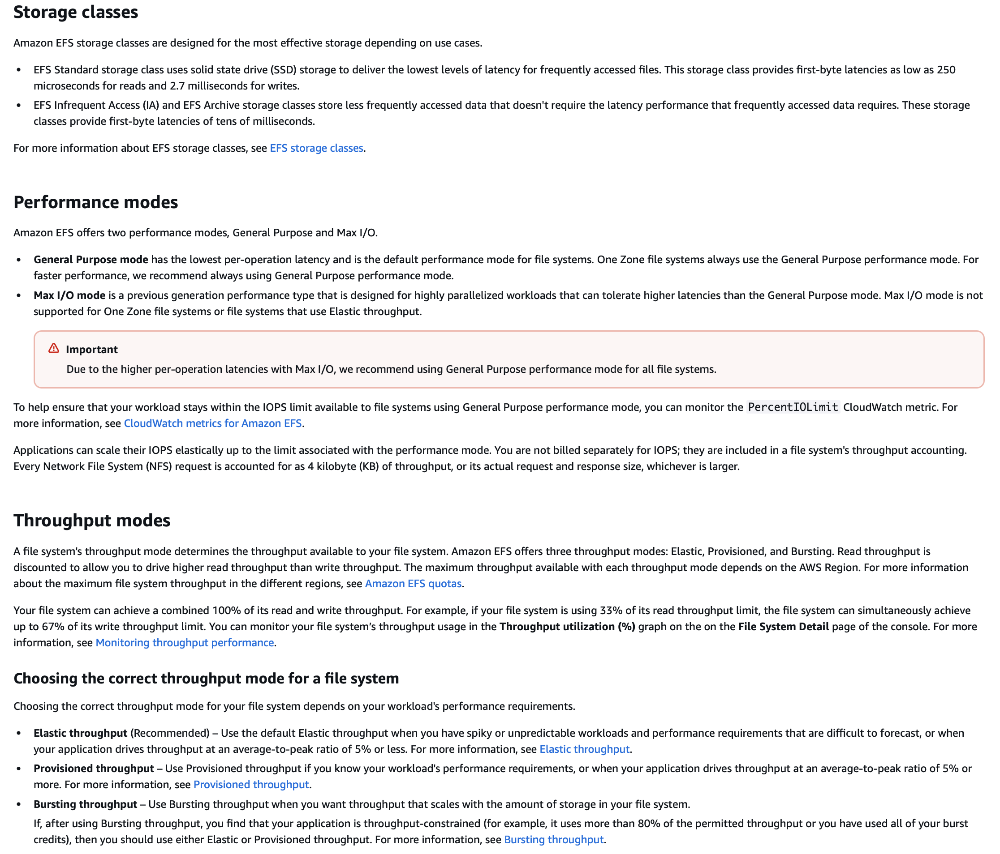

## Q-230

As a solutions architect, you have created a solution that utilizes an Application Load Balancer with stickiness and an Auto Scaling Group (ASG). The Auto Scaling Group spans across 2 Availability Zones (AZs). AZ-A has 3 Amazon EC2 instances and AZ-B has 4 Amazon EC2 instances. The Auto Scaling Group is about to go into a scale-in event due to the triggering of a Amazon CloudWatch alarm.

What will happen under the default Auto Scaling Group configuration?

- A random instance in the AZ-A will be terminated

- **The instance with the oldest launch template or launch configuration will be terminated in AZ-B**

- A random instance will be terminated in AZ-B

- An instance in the AZ-A will be created

## Q-231

A development team has configured Elastic Load Balancing for host-based routing. The idea is to support multiple subdomains and different top-level domains.

The rule *.example.com matches which of the following?

- **test.example.com**

- example.test.com

- EXAMPLE.COM

- example.com

## Q-232

The engineering team at a leading e-commerce company is anticipating a surge in the traffic because of a flash sale planned for the weekend. You have estimated the web traffic to be 10x. The content of your website is highly dynamic and changes very often.

As a Solutions Architect, which of the following options would you recommend to make sure your infrastructure scales for that day?

- Use an Amazon Route 53 Multi Value record

- **Use an Auto Scaling Group**

- Deploy the website on Amazon S3

- Use an Amazon CloudFront distribution in front of your website

## Q-233

A company has developed a popular photo-sharing website using a serverless pattern on the AWS Cloud using Amazon API Gateway and AWS Lambda. The backend uses an Amazon RDS PostgreSQL database. The website is experiencing high read traffic and the AWS Lambda functions are putting an increased read load on the Amazon RDS database.

The architecture team is planning to increase the read throughput of the database, without changing the application's core logic. As a Solutions Architect, what do you recommend?

- Use Amazon RDS Multi-AZ feature

- Use Amazon ElastiCache

- **Use Amazon RDS Read Replicas**

- Use Amazon DynamoDB

## Q-234

A transportation logistics company runs a shipment tracking application on Amazon EC2 instances with an Amazon Aurora MySQL database cluster. The application is experiencing rapid growth due to increased demand from mobile app users querying package delivery statuses. Although the compute layer (EC2) has remained stable, the Aurora DB cluster is under growing read pressure, especially from frequent repeated queries about package locations and delivery history. The company added an Aurora read replica, which temporarily alleviated the load, but read traffic continues to spike as user queries grow. The company wants to reduce the repeated reads pressure on the DB cluster.

Which solution will best meet these requirements in a cost-effective manner?

- **Integrate Amazon ElastiCache for Redis between the application and Aurora. Cache frequently accessed query results in Redis to reduce the number of identical read requests hitting the database**

- Convert the Aurora MySQL DB cluster into a multi-writer setup using Aurora global database. Allow concurrent writes from multiple application nodes across Regions

- Add another Aurora read replica to distribute the increasing read load across more read nodes. Adjust the application to perform client-side load balancing across the read replicas

- Enable Aurora Serverless v2 for the DB cluster to automatically scale read and write capacity in response to usage spikes. Route all traffic through the cluster endpoint

## Q-235

The engineering team at a social media company has recently migrated to AWS Cloud from its on-premises data center. The team is evaluating Amazon CloudFront to be used as a CDN for its flagship application. The team has hired you as an AWS Certified Solutions Architect – Associate to advise on Amazon CloudFront capabilities on routing, security, and high availability.

Which of the following would you identify as correct regarding Amazon CloudFront? (Select three)

- **Amazon CloudFront can route to multiple origins based on the content type**

Amazon CloudFront can route to multiple origins based on the price class

Use geo restriction to configure Amazon CloudFront for high-availability and failover

Use AWS Key Management Service (AWS KMS) encryption in Amazon CloudFront to protect sensitive data for specific content

- Use an origin group with primary and secondary origins to configure Amazon CloudFront for high-availability and failover**

Use field level encryption in Amazon CloudFront to protect sensitive data for specific - **content**

Overall explanation
Correct options:

## Explanation

### 1. Routing to Multiple Origins

CloudFront supports multiple origins within a single distribution. Routing is configured using cache behaviors and path patterns.

Example:

/images/* -> Amazon S3
/api/* -> Application Load Balancer
/videos/* -> Media server

### 2. Origin Groups for High Availability

CloudFront supports origin failover using origin groups.

Primary origin handles requests normally. If it fails, CloudFront automatically routes traffic to the secondary origin.

Example:

CloudFront
-> Primary Origin (ALB)
-> Secondary Origin (S3 Backup)

Failover triggers:

* HTTP 500
* HTTP 502
* HTTP 503
* HTTP 504

### 3. Field-Level Encryption

Field-Level Encryption encrypts specific sensitive fields before they reach the origin server.

Example sensitive data:

* Credit card numbers
* Social security numbers
* Password fields

Encryption uses public key encryption so that only the backend application can decrypt the data.

## Incorrect Options

### Price Class Routing

Price class controls which CloudFront edge locations are used to reduce CDN cost. It does not control routing to origins.

### Geo Restriction

Geo restriction allows or blocks access based on user country. It is used for content licensing or compliance, not for high availability.

### AWS KMS Encryption

CloudFront itself does not use AWS KMS to encrypt specific content. Encryption typically happens via TLS or using Field-Level Encryption.

### Quick Exam Tips

| Requirement                         | CloudFront Feature                |
| ----------------------------------- | --------------------------------- |
| Route traffic to different backends | Multiple Origins + Cache Behavior |
| High availability / failover        | Origin Groups                     |
| Protect sensitive form fields       | Field-Level Encryption            |
| Restrict countries                  | Geo Restriction                   |
| Reduce CDN cost                     | Price Class                       |

## Q-236

# AWS SAA – Maximizing Site-to-Site VPN Throughput

## Question

A retail company is using AWS Site-to-Site VPN connections for secure connectivity to its AWS cloud resources from its on-premises data center. Due to a surge in traffic across the VPN connections to the AWS cloud, users are experiencing slower VPN connectivity.

Which option will maximize the VPN throughput?

Options:

* Create an AWS Transit Gateway with equal cost multipath routing and add additional VPN tunnels
* Use Transfer Acceleration for the VPN connection to maximize the throughput
* Create a virtual private gateway with equal cost multipath routing and multiple channels
* Use AWS Global Accelerator for the VPN connection to maximize the throughput

## Correct Answer

Create an AWS Transit Gateway with equal cost multipath routing and add additional VPN tunnels

## Explanation

### VPN Throughput Limitation

Each IPsec VPN tunnel typically supports about **1.25 Gbps** maximum throughput. A Site-to-Site VPN connection normally provides two tunnels for high availability but not for load balancing.

If traffic increases significantly, a single VPN connection becomes a bottleneck.

### Equal Cost Multipath (ECMP)

AWS Transit Gateway supports **ECMP**, which allows multiple VPN tunnels to carry traffic simultaneously.

This increases aggregate bandwidth because traffic is load balanced across tunnels.

Example:

On-Prem Router
-> Tunnel 1
-> Tunnel 2
-> Tunnel 3
-> Tunnel 4
↓
AWS Transit Gateway

Traffic is distributed across all tunnels, increasing total throughput.

## Why Other Options Are Incorrect

### Transfer Acceleration

Transfer Acceleration is an Amazon S3 feature that speeds up uploads using CloudFront edge locations. It has nothing to do with VPN connectivity.

### Virtual Private Gateway with ECMP

Virtual Private Gateway does **not support ECMP**. Only Transit Gateway supports ECMP for VPN connections.

### AWS Global Accelerator

Global Accelerator improves performance for public internet applications using static IPs and the AWS global network. It does not apply to VPN tunnels.

## Exam Tips

| Requirement                  | Correct AWS Service    |
| ---------------------------- | ---------------------- |
| Increase VPN throughput      | Transit Gateway + ECMP |
| Private dedicated connection | AWS Direct Connect     |
| Highly scalable hub network  | Transit Gateway        |
| Faster internet app routing  | Global Accelerator     |

## Q-237

# AWS SAA – Route53 Record Update Not Redirecting Users

## Question

A company has migrated its application from a monolith architecture to a microservices based architecture. The development team updated the Amazon Route 53 simple record to point `myapp.mydomain.com` from the old Load Balancer to the new one.

Users are still not redirected to the new Load Balancer. What has gone wrong?

Options:

* The Alias Record is misconfigured
* The Time To Live (TTL) is still in effect
* The CNAME Record is misconfigured
* The health checks are failing

## Correct Answer

The Time To Live (TTL) is still in effect

## Explanation

### DNS Caching Behavior

DNS resolvers cache records based on the configured TTL value. Even after the Route 53 record is updated, clients and intermediate DNS resolvers may continue using the cached record until the TTL expires.

Example:

TTL = 300 seconds

User DNS Resolver
-> Cached Old Load Balancer IP
-> Request continues to Old Load Balancer

Only after the TTL expires will the resolver query Route 53 again and obtain the new load balancer endpoint.

## Why Other Options Are Incorrect

### Alias Record Misconfigured

Alias records are commonly used to map a domain to an AWS load balancer. A misconfiguration would normally cause resolution failure rather than continued routing to the old load balancer.

### CNAME Record Misconfigured

The question states that the record was updated successfully. Misconfigured CNAME would result in DNS errors, not traffic still going to the old endpoint.

### Health Checks Failing

Health checks are used with routing policies such as failover or latency routing. The question specifies a simple routing policy, so health checks are not involved.


## Exam Tips

| Scenario                                                  | Root Cause                      |
| --------------------------------------------------------- | ------------------------------- |
| DNS record updated but traffic still goes to old resource | DNS cache / TTL not expired     |
| Blue/Green migration with DNS switch                      | Reduce TTL before cutover       |
| Need instant traffic shift                                | Use weighted routing or low TTL |

## Q-238

A digital media company needs to manage uploads of around 1 terabyte each from an application being used by a partner company.

As a Solutions Architect, how will you handle the upload of these files to Amazon S3?

* Use AWS Direct Connect to provide extra bandwidth

* **Use multi-part upload feature of Amazon S3**

* Use Amazon S3 Versioning

* Use AWS Snowball

## Q-239

You started a new job as a solutions architect at a company that has both AWS experts and people learning AWS. Recently, a developer misconfigured a newly created Amazon RDS database which resulted in a production outage.

How can you ensure that Amazon RDS specific best practices are incorporated into a reusable infrastructure template to be used by all your AWS users?

* **Use AWS CloudFormation to manage Amazon RDS databases**

* Create an AWS Lambda function which sends emails when it finds misconfigured Amazon RDS databases

* Attach an IAM policy to interns preventing them from creating an Amazon RDS database

* Store your recommendations in a custom AWS Trusted Advisor rule

## Q-240

# AWS SAA – DynamoDB Deletion Protection vs PITR

## Question

A fintech startup accidentally deleted a DynamoDB production table. Leadership wants a solution that prevents future data loss from human error with minimal operational overhead.

## Correct Answer

Enable deletion protection on DynamoDB tables

## Explanation

Deletion protection is a built-in DynamoDB feature that prevents a table from being deleted accidentally. When enabled, any DeleteTable operation is blocked until deletion protection is disabled.

This directly addresses the root cause: accidental table deletion.

Key characteristics:

* Prevents accidental DeleteTable operations
* Very low operational overhead
* Simple configuration
* No ongoing management required

Example:

DynamoDB Table
└── Deletion Protection = Enabled

If someone attempts:

DeleteTable API

AWS returns an error and blocks the deletion.

## Why PITR Is Not the Best Answer

Point-in-Time Recovery (PITR) allows restoring a table to any second within the last 35 days. However:

* It does not prevent deletion
* Recovery still requires manual restore
* Service downtime still occurs

Therefore PITR is reactive recovery rather than prevention.

## Exam Tip

| Requirement                   | Best Feature        |
| ----------------------------- | ------------------- |
| Prevent table deletion        | Deletion Protection |
| Recover data after corruption | PITR                |
| Long-term archival            | Export to S3        |

## Q-241

# AWS SAA – Managed Message Broker Supporting MQTT

## Question

A company's microservices running on-premises communicate through a message broker that supports the MQTT protocol. The company wants to migrate the applications and the message broker to AWS without changing application logic.

Which AWS service provides a managed message broker supporting MQTT?

Options:

* Amazon MQ
* Amazon SNS
* Amazon Kinesis Data Streams
* Amazon SQS

## Correct Answer

Amazon MQ

## Explanation

Amazon MQ is a managed message broker service that supports standard messaging protocols such as:

* MQTT
* AMQP
* STOMP
* OpenWire
* JMS

It allows applications that rely on traditional message brokers to migrate to AWS without modifying their messaging logic.

Example architecture:

On‑Prem Microservices
↓
Message Broker (MQTT)
↓
Migrated to AWS
↓
Amazon MQ (Managed Broker)

## Why Other Options Are Incorrect

### Amazon SNS

SNS is a fully managed pub/sub messaging service but it does not support the MQTT protocol for general messaging workloads.

### Amazon Kinesis Data Streams

Kinesis is designed for real-time data streaming and analytics rather than traditional message broker workloads or MQTT communication.

### Amazon SQS

SQS is a managed message queue service but it does not support MQTT or traditional broker protocols.

## Exam Tips

| Requirement                                  | AWS Service    |
| -------------------------------------------- | -------------- |
| Managed message broker (ActiveMQ / RabbitMQ) | Amazon MQ      |
| IoT MQTT messaging                           | AWS IoT Core   |
| Queue-based decoupling                       | Amazon SQS     |
| Pub/Sub notifications                        | Amazon SNS     |
| Real-time streaming analytics                | Amazon Kinesis |

## Q-242

# AWS SAA – DynamoDB Hot Partition Problem

## Question

A serverless social media application uses:

* Amazon API Gateway
* AWS Lambda
* Amazon DynamoDB

Some athletes are extremely popular, causing a large number of reads to the same DynamoDB partition. Even after increasing RCUs, the application still experiences a **hot partition problem**.

Which solution improves performance without significant application refactoring?

Options:

* Use Amazon DynamoDB Streams
* Use Amazon DynamoDB DAX
* Use Amazon ElastiCache
* Use Amazon DynamoDB Global Tables

## Correct Answer

Use Amazon DynamoDB DAX

## Explanation

A **hot partition** occurs when a disproportionate amount of traffic targets a single partition key in DynamoDB. Even if the table has enough overall capacity, one partition may become a bottleneck.

### DynamoDB Accelerator (DAX)

DAX is an **in-memory caching layer** for DynamoDB that significantly reduces read latency and offloads read traffic from DynamoDB.

Key characteristics:

* Fully managed service
* Microsecond read latency
* Compatible with DynamoDB APIs
* Minimal code changes required

Architecture:

API Gateway
↓
Lambda
↓
DAX Cluster
↓
DynamoDB Table

Popular athlete profiles are cached in DAX, preventing repeated reads from hitting the same DynamoDB partition.

## Why Other Options Are Incorrect

### DynamoDB Streams

Streams capture changes to items for downstream processing. They do not improve read performance or solve hot partitions.

### Amazon ElastiCache

While ElastiCache can be used as a caching layer, it requires significant application changes to manage cache logic, which violates the requirement of minimal refactoring.

### DynamoDB Global Tables

Global tables replicate data across regions for multi-region access and disaster recovery. They do not solve hot partition issues within a single region.

## Exam Tips

| Requirement                | Best Solution    |
| -------------------------- | ---------------- |
| DynamoDB read acceleration | DAX              |
| Event-driven processing    | DynamoDB Streams |
| Cross-region replication   | Global Tables    |
| Custom caching layer       | ElastiCache      |

## Q-243

# AWS SAA – Serverless Container Orchestration

## Question

An IT company hosts APIs using Docker containers. They want an AWS solution to orchestrate containers with **serverless infrastructure management**.

Which services should be recommended? (Select two)

Options:

* Amazon EMR for serverless orchestration
* Amazon ECS with EC2 for serverless orchestration
* Amazon SageMaker for serverless orchestration
* Amazon EKS with AWS Fargate for serverless orchestration
* Amazon ECS with AWS Fargate for serverless orchestration

## Correct Answers

1. Amazon Elastic Kubernetes Service (EKS) with AWS Fargate
2. Amazon Elastic Container Service (ECS) with AWS Fargate

## Explanation

### Serverless Container Orchestration

Serverless container orchestration means developers run containers without managing the underlying compute infrastructure.

AWS provides this using **AWS Fargate**.

Fargate removes the need to manage EC2 instances and automatically provisions compute resources for containers.

### ECS with Fargate

Amazon ECS is AWS’s native container orchestration service.

Architecture:

Client → API → ECS Service → Fargate Tasks → Containers

Benefits:

* Fully managed
* No EC2 instances
* Automatic scaling

### EKS with Fargate

Amazon EKS provides managed Kubernetes.

When combined with Fargate, Kubernetes pods run without EC2 worker nodes.

Architecture:

Client → API → EKS Cluster → Fargate Pods → Containers

Benefits:

* Kubernetes compatibility
* Serverless compute

## Why Other Options Are Incorrect

### Amazon EMR

EMR is designed for big data processing frameworks such as Hadoop and Spark, not container orchestration.

### ECS with EC2

ECS with EC2 requires managing EC2 instances, which is not serverless.

### Amazon SageMaker

SageMaker is used for machine learning model training and deployment, not container orchestration.

## Exam Tips

| Requirement                              | Best AWS Service |
| ---------------------------------------- | ---------------- |
| Serverless containers                    | ECS + Fargate    |
| Serverless Kubernetes                    | EKS + Fargate    |
| Container orchestration with EC2 control | ECS with EC2     |
| Big data analytics                       | EMR              |
| Machine learning                         | SageMaker        |

## Q-244

# AWS SAA – Granting Access to S3 Bucket Across Accounts

## Question

A company wants to grant access to an Amazon S3 bucket to users in its own AWS account as well as to users in another AWS account.

Which option can meet this requirement?

Options:

* Use either a bucket policy or a user policy to grant permission to users in its account as well as to users in another account
* Use a user policy to grant permission to users in its account as well as to users in another account
* Use permissions boundary to grant permission to users in its account as well as to users in another account
* Use a bucket policy to grant permission to users in its account as well as to users in another account

## Correct Answer

Use a bucket policy to grant permission to users in its account as well as to users in another account

## Explanation

### Bucket Policies

Amazon S3 bucket policies are **resource-based policies** that can grant permissions to principals both within the same AWS account and in different AWS accounts.

Example:

Bucket Owner Account
↓
S3 Bucket Policy
↓
Allow access to:

* IAM users in same account
* IAM roles/users from another AWS account

Example policy snippet:

```json
{
"Effect": "Allow",
"Principal": {
"AWS": "arn:aws:iam::123456789012:user/ExternalUser"
},
"Action": "s3:GetObject",
"Resource": "arn:aws:s3:::example-bucket/*"
}
```

## Why Other Options Are Incorrect

### User Policy

IAM user policies are identity-based and cannot directly grant permissions to principals in another AWS account's resources unless the resource policy also allows it.

### Permissions Boundary

Permissions boundaries limit the maximum permissions an IAM principal can have. They are not used to grant cross-account resource access.

### Either Bucket or User Policy

While IAM policies can grant access within the same account, cross-account access to S3 requires a **bucket policy or another resource-based policy**.

## Exam Tips

| Requirement             | Solution             |
| ----------------------- | -------------------- |
| Same-account access     | IAM policy           |
| Cross-account S3 access | Bucket policy        |
| Limit IAM permissions   | Permissions boundary |

## Q-245

# AWS SAA – Disaster Recovery Strategy (Warm Standby)

## Question

A financial services firm runs an on‑premises data center and wants a disaster recovery (DR) strategy using AWS. The requirement is to keep a **scaled‑down but fully functional version of the environment always running in AWS** so that **recovery time is minimal during a disaster**.

Which DR strategy fits this requirement?

Options:

* Warm Standby
* Pilot Light
* Multi Site
* Backup and Restore

## Correct Answer

Warm Standby

## Explanation

### Warm Standby

Warm standby keeps a **scaled‑down version of the production environment running in AWS continuously**.

In case of a disaster, the environment can be **quickly scaled up to full capacity**.

Architecture example:

On‑Prem Production
↓
Data Replication
↓
AWS (Scaled‑down environment running)
↓
Scale up during disaster

Key characteristics:

* Core services already running
* Minimal recovery time (low RTO)
* Faster than pilot light

## Why Other Options Are Incorrect

### Pilot Light

Only the **core components** (such as databases) are running in AWS. Application servers are launched only during disaster recovery.

Recovery time is longer than warm standby.

### Multi‑Site (Active‑Active)

Both environments run at full capacity simultaneously and serve production traffic. This is the most expensive DR strategy.

### Backup and Restore

Backups are stored in AWS and infrastructure is rebuilt during disaster. This results in the **highest recovery time (RTO)**.

## Exam Tips

| DR Strategy      | Description                         | RTO     |
| ---------------- | ----------------------------------- | ------- |
| Backup & Restore | Rebuild everything from backups     | Highest |
| Pilot Light      | Only core services running          | Medium  |
| Warm Standby     | Scaled‑down environment running     | Low     |
| Multi‑Site       | Full production in multiple regions | Lowest  |