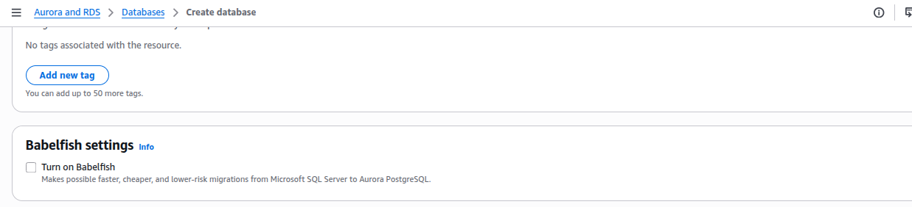
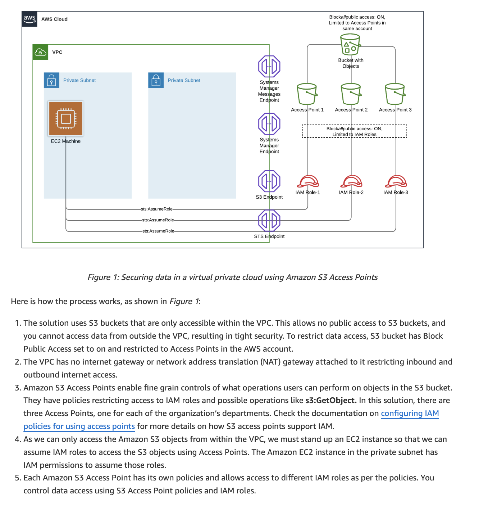
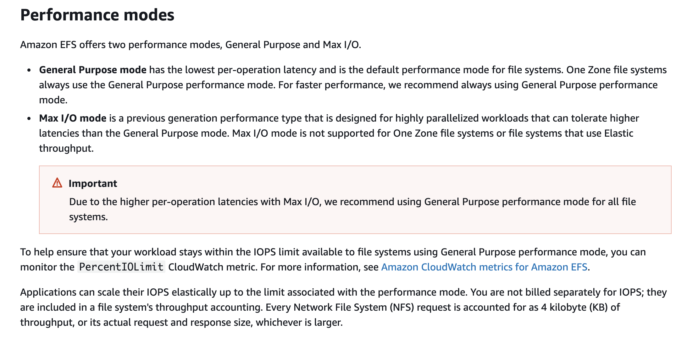
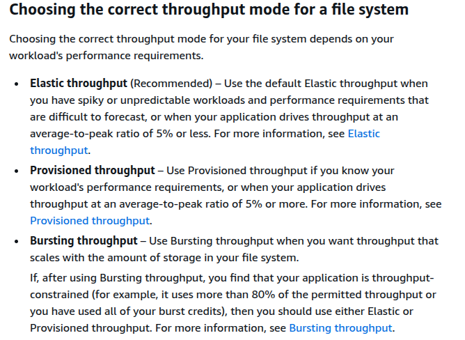
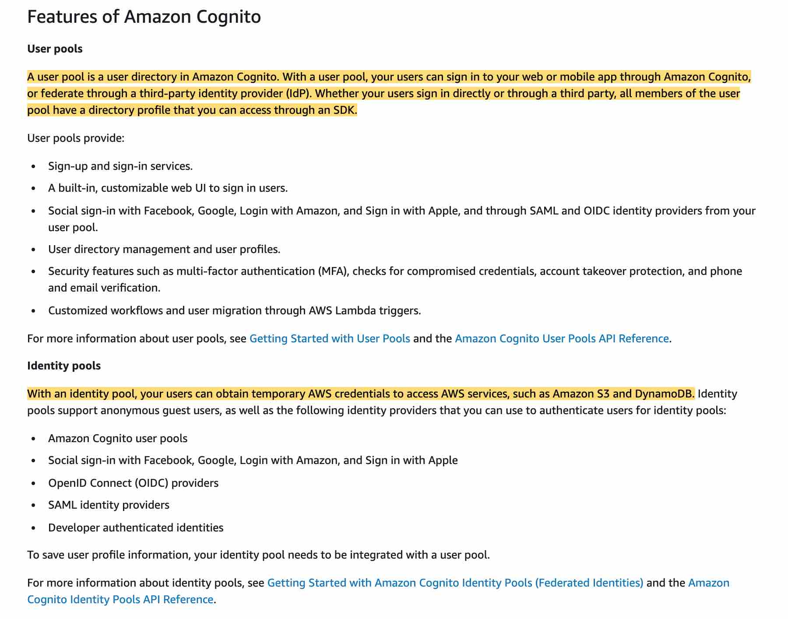

# AWS Solution Architech C03 Exam Questions

## Q-1 

The engineering team at an in-home fitness company is evaluating multiple in-memory data stores with the ability to power its on-demand, live leaderboard. The company's leaderboard requires high availability, low latency, and real-time processing to deliver customizable user data for the community of users working out together virtually from the comfort of their home.

As a solutions architect, which of the following solutions would you recommend? (Select two)

- Power the on-demand, live leaderboard using Amazon Neptune as it meets the in-memory, high availability, low latency requirements

- **Power the on-demand, live leaderboard using Amazon DynamoDB with DynamoDB Accelerator (DAX) as it meets the in-memory, high availability, low latency requirements**

- **Power the on-demand, live leaderboard using Amazon ElastiCache for Redis as it meets the in-memory, high availability, low latency requirements**

- Power the on-demand, live leaderboard using Amazon DynamoDB as it meets the in-memory, high availability, low latency requirements

- Power the on-demand, live leaderboard using Amazon RDS for Aurora as it meets the in-memory, high availability, low latency requirements

## Q-2

A healthcare analytics company centralizes clinical and operational datasets in an Amazon S3–based data lake. Incoming data is ingested in Apache Parquet format from multiple hospitals and wearable health devices. To ensure quality and standardization, the company applies several transformation steps: anomaly filtering, datetime normalization, and aggregation by patient cohort. The company needs a solution to support a code-free interface that enables data engineers and business analysts to collaborate on data preparation workflows. The company also requires data lineage tracking, data profiling capabilities, and an easy way to share transformation logic across teams without writing or managing code.

Which AWS solution best meets these requirements?

- **Use AWS Glue DataBrew to visually build transformation workflows on top of the raw Parquet files in S3. Use DataBrew recipes to track, audit, and share the transformation steps with others. Enable data profiling to inspect column statistics, null values, and data types across datasets**

- **Use AWS Glue DataBrew to visually build transformation workflows on top of the raw Parquet files in S3. Use DataBrew recipes to track, audit, and share the transformation steps with others. Enable data profiling to inspect column statistics, null values, and data types across datasets**

- Use Amazon AppFlow to move and transform Parquet files in S3. Configure AppFlow transformations and mappings within the visual interface. Share flows with collaborators through AWS IAM policies and scheduled executions

- Use AWS Glue Studio’s visual canvas to design data transformation workflows on top of the Parquet files in Amazon S3. Configure Glue Studio jobs to run these transformations without writing code. Share the job definitions with team members for reuse. Use the visual job editor to track transformation progress and inspect profiling statistics for each dataset column

- Create Amazon Athena SQL queries to perform transformation steps directly on S3. Store queries in AWS Glue Data Catalog and share saved queries with other users through Amazon Athena's query editor


## Q-3

An audit department generates and accesses the audit reports only twice in a financial year. The department uses AWS Step Functions to orchestrate the report creating process that has failover and retry scenarios built into the solution. The underlying data to create these audit reports is stored on Amazon S3, runs into hundreds of Terabytes and should be available with millisecond latency.

As an AWS Certified Solutions Architect – Associate, which is the MOST cost-effective storage class that you would recommend to be used for this use-case?

- Amazon S3 Intelligent-Tiering (S3 Intelligent-Tiering)

- Amazon S3 Glacier Deep Archive

- Amazon S3 Standard

- **Amazon S3 Standard-Infrequent Access (S3 Standard-IA)**

## Q-4

A media agency stores **`re-creatable`** assets on Amazon S3. The assets are **accessed** heavily during the **first few days**. After a week, access drops drastically. **Occasional access may occur after the first week**, but assets must remain **immediately accessible** when needed.

The agency wants to **reduce storage costs** as much as possible.

As an AWS Certified Solutions Architect – Associate, can you suggest a way to lower the storage costs while fulfilling the business requirements?

- Configure a lifecycle policy to transition the objects to Amazon S3 One Zone-Infrequent Access (S3 One Zone-IA) after 7 days

- Configure a lifecycle policy to transition the objects to Amazon S3 Standard-Infrequent Access (S3 Standard-IA) after 7 days

- **Configure a lifecycle policy to transition the objects to Amazon S3 One Zone-Infrequent Access (S3 One Zone-IA) after 30 days**

- Configure a lifecycle policy to transition the objects to Amazon S3 Standard-Infrequent Access (S3 Standard-IA) after 30 days

## Q-5

A company has moved its business critical data to Amazon Elastic File System (Amazon EFS) which will be accessed by multiple Amazon EC2 instances.

As an AWS Certified Solutions Architect - Associate, which of the following would you recommend to exercise access control such that only the permitted Amazon EC2 instances can read from the Amazon EFS file system? (Select two)

- Set up the IAM policy root credentials to control and configure the clients accessing the Amazon EFS file system

- **Use VPC security groups to control the network traffic to and from your file system**

- **Use an IAM policy to control access for clients who can mount your file system with the required permissions**

- Use network access control list (network ACL) to control the network traffic to and from your Amazon EC2 instance

- Use Amazon GuardDuty to curb unwanted access to Amazon EFS file system

## Q-6

A junior scientist working with the Deep Space Research Laboratory at NASA is trying to upload a high-resolution image of a nebula into Amazon S3. The image size is approximately 3 gigabytes. The junior scientist is using Amazon S3 Transfer Acceleration (Amazon S3TA) for faster image upload. It turns out that Amazon S3TA did not result in an accelerated transfer.

Given this scenario, which of the following is correct regarding the charges for this image transfer?

- The junior scientist only needs to pay Amazon S3 transfer charges for the image upload

- The junior scientist only needs to pay S3TA transfer charges for the image upload

- **The junior scientist does not need to pay any transfer charges for the image upload**
`Bcz, he is uploadig image not downloading and accessing from multi azs`.

- The junior scientist needs to pay both S3 transfer charges and S3TA transfer charges for the image upload


## Q-7

A development team requires permissions to list an Amazon S3 bucket and delete objects from that bucket. A systems administrator has created the following IAM policy to provide access to the bucket and applied that policy to the group. The group is not able to delete objects in the bucket. The company follows the principle of least privilege.

```yml
    "Version": "2021-10-17",
    "Statement": [
        {
            "Action": [
                "s3:ListBucket",
                "s3:DeleteObject"
            ],
            "Resource": [
                "arn:aws:s3:::example-bucket"
            ],
            "Effect": "Allow"
        }
    ]
```

Which statement should a solutions architect add to the policy to address this issue?

```yml
{
    "Action": [
        "s3:DeleteObject"
    ],
    "Resource": [
        "arn:aws:s3:::example-bucket/*"
    ],
    "Effect": "Allow"
}
```

## Q-8

A large financial institution operates an on-premises data center with hundreds of petabytes of data managed on Microsoft’s Distributed File System (DFS). The CTO wants the organization to transition into a hybrid cloud environment and run data-intensive analytics workloads that support DFS.

Which of the following AWS services can facilitate the migration of these workloads?


- Amazon FSx for Lustre
(Designed for high-performance Linux/HPC workloads, not Microsoft DFS or SMB.)

- **Amazon FSx for Windows File Server**

- AWS Directory Service for Microsoft Active Directory (AWS Managed Microsoft AD)
(Provides Active Directory only (identity), not file storage or DFS data migration.)

- Microsoft SQL Server on AWS

## Q-9 

A news network uses Amazon Simple Storage Service (Amazon S3) to aggregate the raw video footage from its reporting teams across the US. The news network has recently expanded into new geographies in Europe and Asia. The technical teams at the overseas branch offices have reported huge delays in uploading large video files to the destination Amazon S3 bucket.

Which of the following are the MOST cost-effective options to improve the file upload speed into Amazon S3 (Select two)

- Create multiple AWS Site-to-Site VPN connections between the AWS Cloud and branch offices in Europe and Asia. Use these VPN connections for faster file uploads into Amazon S3

- **Use Amazon S3 Transfer Acceleration (Amazon S3TA) to enable faster file uploads into the destination S3 bucket**

- Use AWS Global Accelerator for faster file uploads into the destination Amazon S3 bucket
(Optimizes TCP/UDP traffic to applications behind ALB/NLB/EC2.
Does NOT accelerate S3 uploads.)

- **Use multipart uploads for faster file uploads into the destination Amazon S3 bucket**

- Create multiple AWS Direct Connect connections between the AWS Cloud and branch offices in Europe and Asia. Use the direct connect connections for faster file uploads into Amazon S3

(Faster, yes — but very expensive (ports, circuits, setup).
Question asks for MOST cost-effective, so not the best choice.)

## Q-10

A leading carmaker would like to build a new car-as-a-sensor service by leveraging fully serverless components that are provisioned and managed automatically by AWS. The development team at the carmaker does not want an option that requires the capacity to be manually provisioned, as it does not want to respond manually to changing volumes of sensor data.

Given these constraints, which of the following solutions is the BEST fit to develop this car-as-a-sensor service?

- Ingest the sensor data in Amazon Kinesis Data Firehose, which directly writes the data into an auto-scaled Amazon DynamoDB table for downstream processing

- **Ingest the sensor data in an Amazon Simple Queue Service (Amazon SQS) standard queue, which is polled by an AWS Lambda function in batches and the data is written into an auto-scaled Amazon DynamoDB table for downstream processing**

- Ingest the sensor data in an Amazon Simple Queue Service (Amazon SQS) standard queue, which is polled by an application running on an Amazon EC2 instance and the data is written into an auto-scaled Amazon DynamoDB table for downstream processing

- Ingest the sensor data in Amazon Kinesis Data Streams, which is polled by an application running on an Amazon EC2 instance and the data is written into an auto-scaled Amazon DynamoDB table for downstream processing

## Q-11

A healthcare company is developing a secure internal web portal hosted on AWS. The application must communicate with legacy systems that reside in the company's on-premises data centers. These data centers are connected to AWS via a site-to-site VPN. The company uses Amazon Route 53 as its DNS solution and requires the application to resolve private DNS records for the on-premises services from within its Amazon VPC.

What is the MOST secure and appropriate way to meet these DNS resolution requirements?

- Create a Route 53 private hosted zone for the on-premises domain. Associate the hosted zone with the VPC to allow the application to resolve DNS names of the on-premises services
(Private hosted zones store records inside AWS, not on-prem.

Requirement is to resolve existing on-prem DNS records, not recreate them.)


- Configure a Route 53 Resolver inbound endpoint and create a DNS forwarding rule. Enable recursive DNS resolution in the VPC to access on-premises services
(Inbound endpoint is used when:
👉 On-prem → needs to resolve AWS DNS

Here requirement is the opposite direction.

👉 Quick exam trick:

AWS → On-prem = OUTBOUND

On-prem → AWS = INBOUND)


- **Create a Route 53 Resolver outbound endpoint. Define a forwarding rule that routes DNS queries for on-premises domains to the on-premises DNS server. Associate the rule with the VPC**


- Create a hybrid connectivity gateway and attach the on-premises DNS servers to Route 53 as authoritative zones for internal domains
(No such Route53 feature exists.)

## Q-12

The payroll department at a company initiates several computationally intensive workloads on Amazon EC2 instances at a designated hour on the last day of every month. The payroll department has noticed a trend of severe performance lag during this hour. The engineering team has figured out a solution by using Auto Scaling Group for these Amazon EC2 instances and making sure that 10 Amazon EC2 instances are available during this peak usage hour. For normal operations only 2 Amazon EC2 instances are enough to cater to the workload.

As a solutions architect, which of the following steps would you recommend to implement the solution?

- **Configure your Auto Scaling group by creating a scheduled action that kicks-off at the designated hour on the last day of the month. Set the desired capacity of instances to 10. This causes the scale-out to happen before peak traffic kicks in at the designated hour**

- Configure your Auto Scaling group by creating a simple tracking policy and setting the instance count to 10 at the designated hour. This causes the scale-out to happen before peak traffic kicks in at the designated hour
(Scaling policies react to CloudWatch metrics.

They are reactive, not time-based.

Question requires fixed-time scaling.)

- Configure your Auto Scaling group by creating a target tracking policy and setting the instance count to 10 at the designated hour. This causes the scale-out to happen before peak traffic kicks in at the designated hour

- Configure your Auto Scaling group by creating a scheduled action that kicks-off at the designated hour on the last day of the month. Set the min count as well as the max count of instances to 10. This causes the scale-out to happen before peak traffic kicks in at the designated hour

## Q-13


A technology blogger wants to write a review on the comparative pricing for various storage types available on AWS Cloud. The blogger has created a test file of size 1 gigabytes with some random data. Next he copies this test file into AWS S3 Standard storage class, provisions an Amazon EBS volume (General Purpose SSD (gp2)) with 100 gigabytes of provisioned storage and copies the test file into the Amazon EBS volume, and lastly copies the test file into an Amazon EFS Standard Storage filesystem. At the end of the month, he analyses the bill for costs incurred on the respective storage types for the test file.

What is the correct order of the storage charges incurred for the test file on these three storage types?

- **Cost of test file storage on Amazon EBS < Cost of test file storage on Amazon S3 Standard < Cost of test file storage on Amazon EFS**

- Cost of test file storage on Amazon S3 Standard < Cost of test file storage on Amazon EBS < Cost of test file storage on Amazon EFS

- Cost of test file storage on Amazon S3 Standard < Cost of test file storage on Amazon EFS < Cost of test file storage on Amazon EBS

- Cost of test file storage on Amazon EFS < Cost of test file storage on Amazon S3 Standard < Cost of test file storage on Amazon EBS

## Q-14

A video analytics company runs data-intensive batch processing workloads that generate large log files and metadata daily. These files are currently stored in an on-premises NFS-based storage system located in the company's primary data center. However, the storage system is becoming increasingly difficult to scale and is unable to meet the company's growing storage demands. The IT team wants to migrate to a cloud-based storage solution that minimizes costs, retains NFS compatibility, and supports automated tiering of rarely accessed data to lower-cost storage. The team prefers to continue using existing NFS-based tools and protocols for compatibility with their current application stack.

Which solution will meet these requirements MOST cost-effectively?

- Deploy an AWS Storage Gateway Volume Gateway in cached mode. Attach it as a block device to an on-premises file server and mount NFS on top. Store snapshots in Amazon S3 Glacier Deep Archive, and use AWS Backup to manage recovery operations and tiering

- Provision an Amazon Elastic File System (Amazon EFS) file system with the One Zone–IA storage class. Use AWS DataSync to migrate the NFS data to EFS. Configure the application to mount the file system over NFS and activate lifecycle management to tier infrequently accessed files

- **Deploy an AWS Storage Gateway File Gateway on premises. Configure it to present an NFS-compatible file share to the workloads. Store the uploaded files in Amazon S3, and use S3 Lifecycle policies to automatically transition infrequently accessed objects to lower-cost storage classes**

- Use Amazon FSx for Windows File Server to replace the NFS workload. Enable data deduplication and automatic backups. Use Amazon S3 Glacier to move snapshots to a cost-efficient storage tier. Reconfigure the analytics application to access files using SMB protocol

## Q-15

A biotech research company needs to perform data analytics on real-time lab results provided by a partner organization. The partner stores these lab results in an Amazon RDS for MySQL instance within the partner’s own AWS account. The research company has a private VPC that does not have internet access, Direct Connect, or a VPN connection. However, the company must establish secure and private connectivity to the RDS database in the partner’s VPC. The solution must allow the research company to connect from its VPC while minimizing complexity and complying with data security requirements.

Which solution will meet these requirements?

- Instruct the partner to enable public access on the Amazon RDS instance and add a security group rule to allow inbound access from the company’s IP range. The company accesses the database over the public internet through a NAT Gateway configured in a private subnet

- Set up VPC peering between the company’s VPC and the partner’s VPC. Use AWS Transit Gateway in the partner's account to route traffic from the company’s VPC to the database. Modify the RDS subnet route tables to allow access from the company’s CIDR block

- Configure a client VPN endpoint in the company’s account. Have researchers connect to the VPN from their local machines. Establish a Direct Connect gateway to the partner’s VPC and route RDS traffic via this connection

- **Instruct the partner to create a Network Load Balancer (NLB) in front of the Amazon RDS for MySQL instance. Use AWS PrivateLink to expose the NLB as an interface VPC endpoint in the research company’s VPC**
- **NOTE** - `Need PRIVATE ACCESS to ONE service? → PrivateLink`
`Need PRIVATE NETWORK between locations? → Direct Connect`

## Q-16

An e-commerce company is looking for a solution with high availability, as it plans to migrate its flagship application to a fleet of Amazon Elastic Compute Cloud (Amazon EC2) instances. The solution should allow for content-based routing as part of the architecture.

As a Solutions Architect, which of the following will you suggest for the company?

`Content based rouing means - URL path or host header , HTTP, HTTPS`

- Use an Auto Scaling group for distributing traffic to the Amazon EC2 instances spread across different Availability Zones (AZs). Configure an elastic IP address (EIP) to mask any failure of an instance

- Use a Network Load Balancer for distributing traffic to the Amazon EC2 instances spread across different Availability Zones (AZs). Configure a Private IP address to mask any failure of an instance

- **Use an Application Load Balancer for distributing traffic to the Amazon EC2 instances spread across different Availability Zones (AZs). Configure Auto Scaling group to mask any failure of an instance**

- Use an Auto Scaling group for distributing traffic to the Amazon EC2 instances spread across different Availability Zones (AZs). Configure a Public IP address to mask any failure of an instance


## Q-17

A retail analytics company operates a large-scale data lake on Amazon S3, where they store daily logs of customer transactions, product views, and inventory updates. Each morning, they need to transform and load the data into a data warehouse to support fast analytical queries. The company also wants to enable data analysts to build and train machine learning (ML) models using familiar SQL syntax without writing custom Python code. The architecture must support massively parallel processing (MPP) for fast data aggregation and scoring, and must use serverless AWS services wherever possible to reduce infrastructure management and operational overhead.

Which solution best meets these requirements?

- Provision and run a daily Amazon EMR cluster with Apache Spark to process and transform the S3 data. Load the results into Amazon Redshift (provisioned). Enable ML model development by integrating Redshift with Amazon SageMaker notebooks for advanced modeling tasks

- Use an AWS Glue job to transform and load data into Amazon RDS for PostgreSQL. Allow analysts to run machine learning models using Amazon Aurora ML integrated with PostgreSQL, leveraging Amazon SageMaker endpoints behind the scenes

- **Use a daily AWS Glue job to transform and clean the data stored in Amazon S3. Load the transformed dataset into Amazon Redshift Serverless, which offers MPP capabilities in a serverless model. Enable analysts to use Amazon Redshift ML to build and train ML models**

- Run a daily AWS Glue job to process and transform the raw files in S3 and register the outputs as Amazon Athena tables in AWS Glue Data Catalog. Allow analysts to build ML models using Amazon Athena ML, with SQL-based predictions on top of S3 data without moving it to a warehouse

## Q-18

A software engineering intern at an e-commerce company is documenting the process flow to provision Amazon EC2 instances via the Amazon EC2 API. These instances are to be used for an internal application that processes Human Resources payroll data. He wants to highlight those volume types that **`cannot`** be used as a **`boot volume`**.

Can you help the intern by identifying those storage volume types that CANNOT be used as boot volumes while creating the instances? (Select two)

**NOTE**
`Can be used as Boot Volume`
`General Purpose SSD (gp2 / gp3) ✔`
`Provisioned IOPS SSD (io1 / io2) ✔`

- **Cold Hard disk drive (sc1)**
(boot volumes refer to EBS root volumes.)

- Instance Store

- Provisioned IOPS Solid state drive (io1)

- General Purpose Solid State Drive (gp2)

- **Throughput Optimized Hard disk drive (st1)**


## Q-19

Explain this questions , I really not understood 

The product team at a startup has figured out a market need to support both stateful and stateless client-server communications via the application programming interface (APIs) developed using its platform. You have been hired by the startup as a solutions architect to build a solution to fulfill this market need using Amazon API Gateway.

Which of the following would you identify as correct?

`Stateless API` - Server does **NOT remember previous request**.
                - Each time a new request will create.

`Stateful API` - Server **maintains connections** or session.
               - Live stream game, chats.

**NOTE**
`API Gateway` supports **Stateless API** (HTTP API / REST API)

`WebSocket API`
✔ Stateful (persistent connection)
✔ Two-way communication

- Amazon API Gateway creates RESTful APIs that enable stateless client-server communication and Amazon API Gateway also creates WebSocket APIs that adhere to the WebSocket protocol, which enables stateless, full-duplex communication between client and server

- **Amazon API Gateway creates RESTful APIs that enable stateless client-server communication and Amazon API Gateway also creates WebSocket APIs that adhere to the WebSocket protocol, which enables stateful, full-duplex communication between client and server**

- Amazon API Gateway creates RESTful APIs that enable stateful client-server communication and Amazon API Gateway also creates WebSocket APIs that adhere to the WebSocket protocol, which enables stateless, full-duplex communication between client and server

- Amazon API Gateway creates RESTful APIs that enable stateful client-server communication and Amazon API Gateway also creates WebSocket APIs that adhere to the WebSocket protocol, which enables stateful, full-duplex communication between client and server

## Q-20

A new DevOps engineer has just joined a development team and wants to understand the replication capabilities for Amazon RDS Multi-AZ deployment as well as Amazon RDS Read-replicas.

Which of the following correctly summarizes these capabilities for the given database?


| Feature |	Replication Type | Purpose | Can you use it for Reads ? |
| ------- | ---------------- | ------- | -------------------------- |
| Multi-AZ | Synchronous | Disaster Recovery / Failover | No (Standby is hidden) |
| Read Replica | Asynchronous | Performance Scaling	| Yes |

- **Multi-AZ follows synchronous replication and spans at least two Availability Zones (AZs) within a single region. Read replicas follow asynchronous replication and can be within an Availability Zone (AZ), Cross-AZ, or Cross-Region**

- Multi-AZ follows asynchronous replication and spans one Availability Zone (AZ) within a single region. Read replicas follow synchronous replication and can be within an Availability Zone (AZ), Cross-AZ, or Cross-Region

- Multi-AZ follows asynchronous replication and spans at least two Availability Zones (AZs) within a single region. Read replicas follow synchronous replication and can be within an Availability Zone (AZ), Cross-AZ, or Cross-Region

- Multi-AZ follows asynchronous replication and spans at least two Availability Zones (AZs) within a single region. Read replicas follow asynchronous replication and can be within an Availability Zone (AZ), Cross-AZ, or Cross-Region

## Q-21

A media company runs a photo-sharing web application that is accessed across three different countries. The application is deployed on several Amazon Elastic Compute Cloud (Amazon EC2) instances running behind an Application Load Balancer. With new government regulations, the company has been asked to block access from two countries and allow access only from the home country of the company.

Which configuration should be used to meet this changed requirement?

- Configure the security group for the Amazon EC2 instances

- Configure the security group on the Application Load Balancer

- **Configure AWS Web Application Firewall (AWS WAF) on the Application Load Balancer in a Amazon Virtual Private Cloud (Amazon VPC)**

- Use Geo Restriction feature of Amazon CloudFront in a Amazon Virtual Private Cloud (Amazon VPC)

## Q-22

A retail company's dynamic website is hosted using on-premises servers in its data center in the United States. The company is launching its website in Asia, and it wants to optimize the website loading times for new users in Asia. The website's backend must remain in the United States. The website is being launched in a few days, and an immediate solution is needed.

What would you recommend?

- **Use Amazon CloudFront with a custom origin pointing to the on-premises servers**

- Leverage a Amazon Route 53 geo-proximity routing policy pointing to on-premises servers

- Migrate the website to Amazon S3. Use S3 cross-region replication (S3 CRR) between AWS Regions in the US and Asia

- Use Amazon CloudFront with a custom origin pointing to the DNS record of the website on Amazon Route 53

## Q-23

The sourcing team at the US headquarters of a global e-commerce company is preparing a spreadsheet of the new product catalog. The spreadsheet is saved on an Amazon Elastic File System (Amazon EFS) created in us-east-1 region. The sourcing team counterparts from other AWS regions such as Asia Pacific and Europe also want to collaborate on this spreadsheet.

As a solutions architect, what is your recommendation to enable this collaboration with the LEAST amount of operational overhead?

- The spreadsheet will have to be copied in Amazon S3 which can then be accessed from any AWS region

- **The spreadsheet on the Amazon Elastic File System (Amazon EFS) can be accessed in other AWS regions by using an inter-region VPC peering connection**

**NOTE**
`You can connect to Amazon EFS file systems from EC2 instances in other AWS regions using an inter-region VPC peering connection, and from on-premises servers using an AWS VPN connection.`

- The spreadsheet will have to be copied into Amazon EFS file systems of other AWS regions as Amazon EFS is a regional service and it does not allow access from other AWS regions

- The spreadsheet data will have to be moved into an Amazon RDS for MySQL database which can then be accessed from any AWS region

## Q-24

A digital wallet company plans to launch a new cloud-based service for processing user cash transfers and peer-to-peer payments. The application will receive transaction requests from mobile clients via a secure endpoint. Each transaction request must go through a lightweight validation step before being forwarded for backend processing, which includes fraud detection, ledger updates, and notifications. The backend workload is compute- and memory-intensive, requires scaling based on volume, and must run for a longer duration than typical short-lived tasks. The engineering team prefers a fully managed solution that minimizes infrastructure maintenance, including provisioning and patching of virtual machines or containers.

Which solution will meet these requirements with the LEAST operational overhead?

- Build a REST API using Amazon API Gateway. Integrate it with an AWS Step Functions state machine for validation. Launch the backend application using Amazon EKS with self-managed nodes, and use Kubernetes Jobs to handle transaction processing workflows. Manually scale the cluster based on demand

- Configure Amazon SQS to receive encrypted payment notifications from mobile devices. Use Amazon EventBridge rules to extract the payload and perform validation. Route the messages to a backend system hosted on Amazon Lightsail instances with dynamic scaling policies based on memory thresholds and instance health checks

- Create an Amazon API Gateway endpoint to receive transaction requests from mobile devices. Use AWS Lambda to validate the transactions. For backend processing, deploy the application on Amazon EKS Anywhere, running on on-premises servers in the company’s data center. Use a custom provisioning script to scale Kubernetes worker nodes based on transaction volume

- **Expose an Amazon API Gateway REST API endpoint to receive transaction requests from mobile clients. Integrate the API with AWS Lambda to perform basic validation. For backend processing, deploy the long-running application to Amazon ECS using the Fargate launch type, allowing ECS to manage compute and memory provisioning automatically, with no server management required**

## Q-25

A retail company has developed a REST API which is deployed in an Auto Scaling group behind an Application Load Balancer. The REST API stores the user data in Amazon DynamoDB and any static content, such as images, are served via Amazon Simple Storage Service (Amazon S3). On analyzing the usage trends, it is found that 90% of the read requests are for commonly accessed data across all users.

As a Solutions Architect, which of the following would you suggest as the MOST efficient solution to improve the application performance?

- Enable ElastiCache Redis for DynamoDB and Amazon CloudFront for Amazon S3

- Enable ElastiCache Redis for DynamoDB and ElastiCache Memcached for Amazon S3

- **Enable Amazon DynamoDB Accelerator (DAX) for Amazon DynamoDB and Amazon CloudFront for Amazon S3**

`If question says “heavy read on DynamoDB” → Think DAX first.`

- Enable Amazon DynamoDB Accelerator (DAX) for Amazon DynamoDB and ElastiCache Memcached for Amazon S3

## Q-26

The engineering team at a data analytics company has observed that its flagship application functions at its peak performance when the underlying Amazon Elastic Compute Cloud (Amazon EC2) instances have a CPU utilization of about 50%. The application is built on a fleet of Amazon EC2 instances managed under an Auto Scaling group. The workflow requests are handled by an internal Application Load Balancer that routes the requests to the instances.

- As a solutions architect, what would you recommend so that the application runs near its peak performance state?

- Configure the Auto Scaling group to use simple scaling policy and set the CPU utilization as the target metric with a target value of 50%

- Configure the Auto Scaling group to use a Amazon Cloudwatch alarm triggered on a CPU utilization threshold of 50%

- Configure the Auto Scaling group to use step scaling policy and set the CPU utilization as the target metric with a target value of 50%

- **Configure the Auto Scaling group to use target tracking policy and set the CPU utilization as the target metric with a target value of 50%**
`Add instances if CPU goes above 50%`
`Remove instances if CPU goes below 50%`
`Automatically maintain ~50% CPU`

Also explain all asg policy

  **1. Step Scaling Policy** - Step scaling = predefined scaling steps.
  -  CPU 50–60% → +1
  -  CPU 60–70% → +2
  -  CPU >70% → +3

  **2. Simple Scaling Policy** 
  - CloudWatch alarm triggers
  - Add/remove fixed number of instances
  - Cooldown period

  **3. Scheduled Scaling** - Scheduled for UpComming Big Sale Event
  - This will scheduled for specific Time Periods only.
  - After Time Periods it will `Scale In` Policy Remove Instances

  - Scale out at 9 AM daily
  - Scale in at 10 PM

  **4. Target Tracking**
  - You set threshold of CPU target = 50%
  - AWS automatically scales In and scales Out.
  - `No required to setup cloudwatch metrics`
  - ASG auto scales in/out to maintain it

## Q-27 

A new DevOps engineer has joined a large financial services company recently. As part of his onboarding, the IT department is conducting a review of the checklist for tasks related to AWS Identity and Access Management (AWS IAM).

As an AWS Certified Solutions Architect – Associate, which best practices would you recommend (Select two)?

- Use user credentials to provide access specific permissions for Amazon EC2 instances

- Create a minimum number of accounts and share these account credentials among employees

- **Enable AWS Multi-Factor Authentication (AWS MFA) for privileged users**

- Grant maximum privileges to avoid assigning privileges again

- **Configure AWS CloudTrail to log all AWS Identity and Access Management (AWS IAM)**

## Q-28

A gaming company is developing a mobile game that streams score updates to a backend processor and then publishes results on a leaderboard. The company has hired you as an AWS Certified Solutions Architect Associate to design a solution that can handle major traffic spikes, process the mobile game updates in the order of receipt, and store the processed updates in a highly available database. The company wants to minimize the management overhead required to maintain the solution.

Which of the following will you recommend to meet these requirements?

- Push score updates to Amazon Kinesis Data Streams which uses a fleet of Amazon EC2 instances (with Auto Scaling) to process the updates in Amazon Kinesis Data Streams and then store these processed updates in Amazon DynamoDB

- Push score updates to Amazon Kinesis Data Streams which uses an AWS Lambda function to process these updates and then store these processed updates in Amazon DynamoDB

- Push score updates to an Amazon Simple Notification Service (Amazon SNS) topic, subscribe an AWS Lambda function to this Amazon SNS topic to process the updates and then store these processed updates in a SQL database running on Amazon EC2 instance

- Push score updates to an Amazon Simple Queue Service (Amazon SQS) queue which uses a fleet of Amazon EC2 instances (with Auto Scaling) to process these updates in the Amazon SQS queue and then store these processed updates in an Amazon RDS MySQL database

## Q-29

A research group runs its flagship application on a fleet of Amazon EC2 instances for a specialized task that must deliver high random I/O performance. Each instance in the fleet would have access to a dataset that is replicated across the instances by the application itself. Because of the resilient application architecture, the specialized task would continue to be processed even if any instance goes down, as the underlying application would ensure the replacement instance has access to the required dataset.

Which of the following options is the MOST cost-optimal and resource-efficient solution to build this fleet of Amazon EC2 instances?

- Use Amazon EC2 instances with Amazon EFS mount points

- **Use Instance Store based Amazon EC2 instances**

- Use Amazon EC2 instances with access to Amazon S3 based storage

- Use Amazon Elastic Block Store (Amazon EBS) based EC2 instances

## Q-30

The DevOps team at an e-commerce company has deployed a fleet of Amazon EC2 instances under an Auto Scaling group (ASG). The instances under the ASG span two Availability Zones (AZ) within the us-east-1 region. All the incoming requests are handled by an Application Load Balancer (ALB) that routes the requests to the Amazon EC2 instances under the Auto Scaling Group. As part of a test run, two instances (instance 1 and 2, belonging to AZ A) were manually terminated by the DevOps team causing the Availability Zones (AZ) to have unbalanced resources. Later that day, another instance (belonging to AZ B) was detected as unhealthy by the Application Load Balancer's health check.

Can you identify the correct outcomes for these events? (Select two)

- As the resources are unbalanced in the Availability Zones, Amazon EC2 Auto Scaling will compensate by rebalancing the Availability Zones. When rebalancing, Amazon EC2 Auto Scaling terminates old instances before launching new instances, so that rebalancing does not cause extra instances to be launched

- Amazon EC2 Auto Scaling creates a new scaling activity for launching a new instance to replace the unhealthy instance. Later, Amazon EC2 Auto Scaling creates a new scaling activity for terminating the unhealthy instance and then terminates it

- **Amazon EC2 Auto Scaling creates a new scaling activity for terminating the unhealthy instance and then terminates it. Later, another scaling activity launches a new instance to replace the terminated instance**

- Amazon EC2 Auto Scaling creates a new scaling activity to terminate the unhealthy instance and launch the new instance simultaneously

- **As the resources are unbalanced in the Availability Zones, Amazon EC2 Auto Scaling will compensate by rebalancing the Availability Zones. When rebalancing, Amazon EC2 Auto Scaling launches new instances before terminating the old ones, so that rebalancing does not compromise the performance or availability of your applications**


## Q-31

An ivy-league university is assisting NASA to find potential landing sites for exploration vehicles of unmanned missions to our neighboring planets. The university uses High Performance Computing (HPC) driven application architecture to identify these landing sites.

Which of the following Amazon EC2 instance topologies should this application be deployed on?


- The Amazon EC2 instances should be deployed in an Auto Scaling group so that application meets high availability requirements

- **The Amazon EC2 instances should be deployed in a cluster placement group so that the underlying workload can benefit from low network latency and high network throughput**

- The Amazon EC2 instances should be deployed in a spread placement group so that there are no correlated failures

- The Amazon EC2 instances should be deployed in a partition placement group so that distributed workloads can be handled effectively

👉 HPC workloads need very low latency
👉 Very high network throughput
👉 Tight communication between instances

A cluster placement group places EC2 instances:

Physically close together inside one Availability Zone

On the same high-speed network fabric

This provides:

✔ Ultra-low network latency
✔ High bandwidth (10/25/100+ Gbps depending on instance type)
✔ Best performance for tightly coupled HPC apps

  ## 1. Spread Placement Group

- Instances are placed on separate hardware

- Used for high availability

- NOT for HPC performance

  ## 2. Partition Placement Group

- Designed for big distributed systems (Hadoop, Kafka)

- Fault isolation focus

- Not ultra-low latency

## Q-32

An IT company wants to review its security best-practices after an incident was reported where a new developer on the team was assigned full access to Amazon DynamoDB. The developer accidentally deleted a couple of tables from the production environment while building out a new feature.

Which is the MOST effective way to address this issue so that such incidents do not recur?

- The CTO should review the permissions for each new developer's IAM user so that such incidents don't recur

- **Use permissions boundary to control the maximum permissions employees can grant to the IAM principals**

- Remove full database access for all IAM users in the organization

- Only root user should have full database access in the organization

## Q-33

A leading social media analytics company is contemplating moving its dockerized application stack into AWS Cloud. The company is not sure about the pricing for using Amazon Elastic Container Service (Amazon ECS) with the EC2 launch type compared to the Amazon Elastic Container Service (Amazon ECS) with the Fargate launch type.

Which of the following is correct regarding the pricing for these two services?

- **Amazon ECS with EC2 launch type is charged based on EC2 instances and EBS volumes used. Amazon ECS with Fargate launch type is charged based on vCPU and memory resources that the containerized application requests**

- Both Amazon ECS with EC2 launch type and Amazon ECS with Fargate launch type are just charged based on Elastic Container Service used per hour

- Both Amazon ECS with EC2 launch type and Amazon ECS with Fargate launch type are charged based on Amazon EC2 instances and Amazon EBS Elastic Volumes used

- Both Amazon ECS with EC2 launch type and Amazon ECS with Fargate launch type are charged based on vCPU and memory resources that the containerized application requests


## Q-34

A healthcare startup needs to enforce compliance and regulatory guidelines for objects stored in Amazon S3. One of the key requirements is to provide adequate protection against accidental deletion of objects.

As a solutions architect, what are your recommendations to address these guidelines? (Select two) ?

- Create an event trigger on deleting any Amazon S3 object. The event invokes an Amazon Simple Notification Service (Amazon SNS) notification via email to the IT manager

- **Enable multi-factor authentication (MFA) delete on the Amazon S3 bucket**

- Change the configuration on Amazon S3 console so that the user needs to provide
additional confirmation while deleting any Amazon S3 object

- Establish a process to get managerial approval for deleting Amazon S3 objects

- **Enable versioning on the Amazon S3 bucket**

## Q-35

A major bank is using Amazon Simple Queue Service (Amazon SQS) to migrate several core banking applications to the cloud to ensure high availability and cost efficiency while simplifying administrative complexity and overhead. The development team at the bank expects a peak rate of about 1000 messages per second to be processed via SQS. It is important that the messages are processed in order.

Which of the following options can be used to implement this system?

- **Use Amazon SQS FIFO (First-In-First-Out) queue in batch mode of 4 messages per operation to process the messages at the peak rate**

- Use Amazon SQS FIFO (First-In-First-Out) queue to process the messages

- Use Amazon SQS FIFO (First-In-First-Out) queue in batch mode of 2 messages per operation to process the messages at the peak rate

- Use Amazon SQS standard queue to process the messages

## Q-36

A leading video streaming service delivers billions of hours of content from Amazon Simple Storage Service (Amazon S3) to customers around the world. Amazon S3 also serves as the data lake for its big data analytics solution. The data lake has a staging zone where intermediary query results are kept only for 24 hours. These results are also heavily referenced by other parts of the analytics pipeline.

Which of the following is the MOST cost-effective strategy for storing this intermediary query data?

- Store the intermediary query results in Amazon S3 Glacier Instant Retrieval storage class

- **Store the intermediary query results in Amazon S3 Standard storage class**

- Store the intermediary query results in Amazon S3 One Zone-Infrequent Access storage class

- Store the intermediary query results in Amazon S3 Standard-Infrequent Access storage class


  - Data kept only 24 hours (very short-lived)
  - Data is heavily referenced → frequent access
  - Used in analytics pipeline → needs low latency & high throughput

  **1. S3 Glacier Instant Retrieval**

    - Designed for archive data.

    - Has minimum storage duration charges (90 days).

    - Retrieval cost + unnecessary for hot data.
    - 👉 Very expensive for 24-hour lifecycle.

  **2. S3 Standard-IA**

    - Minimum storage duration 30 days.

    - Retrieval fees apply.
    - 👉 You pay for 30 days even if stored for 1 day → not cost-effective.

  **3. S3 One Zone-IA**

    - Also 30-day minimum + retrieval charges.

    - Intended for infrequently accessed data.
    - 👉 Bad fit for heavily referenced temporary results.


## Q-37

A retail company runs a customer management system backed by a Microsoft SQL Server database. The system is tightly integrated with applications that rely on T-SQL queries. The company wants to modernize its infrastructure by migrating to Amazon Aurora PostgreSQL, but it needs to avoid major modifications to the existing application logic.

Which combination of actions should the company take to achieve this goal with minimal application refactoring? (Select two)

- Use AWS Glue to convert T-SQL queries to PostgreSQL-compatible SQL during the migration

- Use Amazon Aurora Global Database to replicate data across regions for compatibility

- **Deploy Babelfish for Aurora PostgreSQL to enable support for T-SQL commands**
(Babelfish for Aurora PostgreSQL is ability to accept database connections from SQL Server Clints. applications that were originally built for SQL Server can work directly with Aurora PostgreSQL with few code changes without changing database drivers.)

- **Use AWS Schema Conversion Tool (AWS SCT) along with AWS Database Migration Service (AWS DMS) to migrate the schema and data**
(helps convert the SQL Server schema to PostgreSQL-compatible syntax, and AWS Database Migration Service (DMS) can move the actual data with minimal downtime)

- Configure Amazon Aurora PostgreSQL with a custom endpoint that emulates Microsoft SQL Server behavior



## Q-38

A data analytics company measures what the consumers watch and what advertising they’re exposed to. This real-time data is ingested into its on-premises data center and subsequently, the daily data feed is compressed into a single file and uploaded on Amazon S3 for backup. The typical compressed file size is around 2 gigabytes.

Which of the following is the fastest way to upload the daily compressed file into Amazon S3?

- FTP the compressed file into an Amazon EC2 instance that runs in the same region as the Amazon S3 bucket. Then transfer the file from the Amazon EC2 instance into the Amazon S3 bucket

- **Upload the compressed file using multipart upload with Amazon S3 Transfer Acceleration (Amazon S3TA)**

- Upload the compressed file in a single operation

- Upload the compressed file using multipart upload

## Q-39

An e-commerce company manages a digital catalog of consumer products submitted by third-party sellers. Each product submission includes a description stored as a text file in an Amazon S3 bucket. These descriptions may include ingredient information for consumable products like snacks, supplements, or beverages. The company wants to build a fully automated solution that extracts ingredient names from the uploaded product descriptions and uses those names to query an Amazon DynamoDB table, which returns precomputed health and safety scores for each ingredient. Non-food items and invalid submissions can be ignored without affecting application logic. The company has no in-house machine learning (ML) experts and is looking for the most cost-effective solution with minimal operational overhead.

Which solution meets these requirements MOST cost-effectively?

- Use Amazon SageMaker with a custom-trained NLP model to identify ingredients from the uploaded descriptions. Use Amazon EventBridge to invoke a Lambda function that forwards the document content to a SageMaker endpoint and stores the results in DynamoDB. Fine-tune the model using labeled ingredient datasets from open-source repositories and retrain it monthly

- **Configure S3 Event Notifications to trigger an AWS Lambda function whenever a new product description is uploaded. Inside the function, use Amazon Comprehend's custom entity recognition feature to extract ingredient names. Store these names in the DynamoDB table and let the front-end application query for health scores**

- Create a workflow where Amazon Transcribe is used to convert synthetic audio versions (created from text of the product descriptions) back into text. Analyze the transcripts manually or using simple keyword matching within a Lambda function. Use Amazon SNS to notify the content moderation team for each processed file

- Use Amazon Lookout for Vision to scan the uploaded text files in the S3 bucket and extract entities. Invoke this workflow using an S3-triggered Lambda function. Parse the output and use Amazon API Gateway to push updates to the frontend in real time

## Q-40

The DevOps team at an e-commerce company wants to perform some maintenance work on a specific Amazon EC2 instance that is part of an Auto Scaling group using a step scaling policy. The team is facing a maintenance challenge - every time the team deploys a maintenance patch, the instance health check status shows as out of service for a few minutes. This causes the Auto Scaling group to provision another replacement instance immediately.

As a solutions architect, which are the MOST time/resource efficient steps that you would recommend so that the maintenance work can be completed at the earliest? (Select two)

- Delete the Auto Scaling group and apply the maintenance fix to the given instance. Create a new Auto Scaling group and add all the instances again using the manual scaling policy

- Suspend the ScheduledActions process type for the Auto Scaling group and apply the maintenance patch to the instance. Once the instance is ready, you can you can manually set the instance's health status back to healthy and activate the ScheduledActions process type agai

- **Put the instance into the Standby state and then update the instance by applying the maintenance patch. Once the instance is ready, you can exit the Standby state and then return the instance to service**

- **Suspend the ReplaceUnhealthy process type for the Auto Scaling group and apply the maintenance patch to the instance. Once the instance is ready, you can manually set the instance's health status back to healthy and activate the ReplaceUnhealthy process type again**

- Take a snapshot of the instance, create a new Amazon Machine Image (AMI) and then launch a new instance using this AMI. Apply the maintenance patch to this new instance and then add it back to the Auto Scaling Group by using the manual scaling policy. Terminate the earlier instance that had the maintenance issue

**NOTE**
- **1. Put instance in Standby**

  What happens:

  - Instance is temporarily removed from load balancer.

  - Auto Scaling does NOT terminate or replace it.

  - You can safely patch/restart services.

  - 👉 Perfect for maintenance without triggering scaling.

- **2. Suspend ReplaceUnhealthy process**

  - Problem in scenario:

Health check becomes OutOfService.

ASG immediately launches replacement.

  - Solution:

    - Suspend ReplaceUnhealthy process.

    - ASG stops auto replacing failed instances.

    - After patch → mark healthy → resume process.

    - 👉 Fastest way without touching scaling policies.

## Q-41

An enterprise runs a microservices-based application on Amazon EKS, deployed on EC2 worker nodes. The application includes a frontend UI service that interacts with Amazon DynamoDB and a data-processing service that stores and retrieves files from Amazon S3. The organization needs to strictly enforce least privilege access: the UI Pods must access only DynamoDB, and the data-processing Pods must access only S3.

Which solution will best enforce these access controls within the EKS cluster?

- **Create separate Kubernetes service accounts for the UI and data services. Use IAM Roles for Service Accounts (IRSA) to map each service account to an IAM role with only the required permissions. Assign DynamoDB access to the UI Pods and S3 access to the data Pods**

- Create IAM policies for DynamoDB and S3 access, and attach both to the EC2 instance profile used by the EKS nodes. Use Kubernetes role-based access control (RBAC) to control service-level permissions within the cluster

- Attach an IAM policy directly to each Pod using Kubernetes annotations. Assign the S3 policy to data-service Pods and the DynamoDB policy to UI Pods

- Create one Kubernetes service account shared across all Pods. Attach a single IAM role to this account with both AmazonS3FullAccess and AmazonDynamoDBFullAccess policies

## Q-42

A biotechnology firm runs genomics data analysis workloads using AWS Lambda functions deployed inside a VPC in their central AWS account. The input data for these workloads consists of large files stored in an Amazon Elastic File System (Amazon EFS) that resides in a separate AWS account managed by a research partner. The firm wants the Lambda function in their account to access the shared EFS storage directly. The access pattern and file volume are expected to grow as additional research datasets are added over time, so the solution must be scalable and cost-efficient, and should require minimal operational overhead.

Which solution best meets these requirements in the MOST cost-effective way?

- Package the genomic input data as a Lambda layer and publish it in the research partner's account. Share the layer across accounts by modifying its resource policy and attach the layer to the Lambda function in the central account to access the data during execution

- **Use Amazon EFS resource policies to allow cross-account access to the file system from the central account. Attach the EFS mount target to a shared VPC or peered VPC, and mount the file system in the Lambda function configuration using an EFS access point**

- Set up an Amazon S3 bucket in the research partner’s account and periodically copy EFS contents into the bucket using scheduled AWS DataSync jobs. Use Amazon S3 Access Points to expose the data to the Lambda function in the central account, allowing access via S3 API calls instead of file system mounts

- Create a second Lambda function in the research partner's account that mounts the EFS file system locally. Have the main Lambda function in the central account invoke this secondary Lambda via Amazon API Gateway for data access and computation. Use IAM cross-account permissions to allow invocation

## Q-43

While consolidating logs for the weekly reporting, a development team at an e-commerce company noticed that an unusually large number of illegal AWS application programming interface (API) queries were made sometime during the week. Due to the off-season, there was no visible impact on the systems. However, this event led the management team to seek an automated solution that can trigger near-real-time warnings in case such an event recurs.

Which of the following represents the best solution for the given scenario?

- Configure AWS CloudTrail to stream event data to Amazon Kinesis. Use Amazon Kinesis stream-level metrics in the Amazon CloudWatch to trigger an AWS Lambda function that will trigger an error workflow

- Run Amazon Athena SQL queries against AWS CloudTrail log files stored in Amazon S3 buckets. Use Amazon QuickSight to generate reports for managerial dashboards

- **Create an Amazon CloudWatch metric filter that processes AWS CloudTrail logs having API call details and looks at any errors by factoring in all the error codes that need to be tracked. Create an alarm based on this metric's rate to send an Amazon SNS notification to the required team**

- AWS Trusted Advisor publishes metrics about check results to Amazon CloudWatch. Create an alarm to track status changes for checks in the Service Limits category for the APIs. The alarm will then notify when the service quota is reached or exceeded

## Q-44

A financial services company operates a containerized microservices architecture using Kubernetes in its on-premises data center. Due to strict industry regulations and internal security policies, all application data and workloads must remain physically within the on-premises environment. The company’s infrastructure team wants to modernize its Kubernetes stack and take advantage of AWS-managed services and APIs, including automated Kubernetes upgrades, Amazon CloudWatch integration, and access to AWS IAM features — but without migrating any data or compute resources to the cloud.

Which AWS solution will best meet the company’s requirements for modernization while ensuring that all data remains on premises?

- **Install an AWS Outposts rack in the company’s data center. Use Amazon EKS Anywhere on Outposts to run containerized workloads locally while integrating with AWS APIs**

- Deploy Amazon ECS with Fargate in a nearby AWS Local Zone. Use CloudWatch Logs to forward events to the primary region. Connect the Local Zone to the company’s data center over a VPN. Configure containers to pull data from on-premises storage through a mounted file share

- Set up a dedicated AWS Direct Connect connection between the on-premises environment and an AWS Region. Deploy Amazon EKS in the cloud and connect it to the local Kubernetes cluster. Use IAM roles and API Gateway to integrate authentication and traffic flow for hybrid workloads

- Use an AWS Snowball Edge Compute Optimized device to run EKS-compatible Docker containers on-site. Periodically export application logs and container snapshots to Amazon S3 using Snowball’s offline data transfer features. Use the Snowball console to orchestrate workloads in batches

**NOTE** 
`AWS Outposts is a fully managed service that extends AWS infrastructure, services, APIs, and tools to customer premises. By providing local access to AWS managed infrastructure, AWS Outposts enables customers to build and run applications on premises using the same programming interfaces as in AWS Regions, while using local compute and storage resources for lower latency and local data processing needs.`

## Q-45

A US-based healthcare startup is building an interactive diagnostic tool for COVID-19 related assessments. The users would be required to capture their personal health records via this tool. As this is sensitive health information, the backup of the user data must be kept encrypted in Amazon Simple Storage Service (Amazon S3). The startup does not want to provide its own encryption keys but still wants to maintain an audit trail of when an encryption key was used and by whom.

Which of the following is the BEST solution for this use-case?

- **Use server-side encryption with AWS Key Management Service keys (SSE-KMS) to encrypt the user data on Amazon S3**

- Use server-side encryption with Amazon S3 managed keys (SSE-S3) to encrypt the user data on Amazon S3

- Use server-side encryption with customer-provided keys (SSE-C) to encrypt the user data on Amazon S3

- Use client-side encryption with client provided keys and then upload the encrypted user data to Amazon S3

## Q-46

A file-hosting service uses Amazon Simple Storage Service (Amazon S3) under the hood to power its storage offerings. Currently all the customer files are uploaded directly under a single Amazon S3 bucket. The engineering team has started seeing scalability issues where customer file uploads have started failing during the peak access hours with more than 5000 requests per second.

Which of the following is the MOST resource efficient and cost-optimal way of addressing this issue?

- **Change the application architecture to create customer-specific custom prefixes within the single Amazon S3 bucket and then upload the daily files into those prefixed locations**

- Change the application architecture to create a new Amazon S3 bucket for each customer and then upload each customer's files directly under the respective buckets

- Change the application architecture to use Amazon Elastic File System (Amazon EFS) instead of Amazon S3 for storing the customers' uploaded files

- Change the application architecture to create a new Amazon S3 bucket for each day's data and then upload the daily files directly under that day's bucket

## Q-47

A logistics company is building a multi-tier application to track the location of its trucks during peak operating hours. The company wants these data points to be accessible in real-time in its analytics platform via a REST API. The company has hired you as an AWS Certified Solutions Architect Associate to build a multi-tier solution to store and retrieve this location data for analysis.

Which of the following options addresses the given use case?

- **Leverage Amazon API Gateway with Amazon Kinesis Data Analytics**

- Leverage Amazon QuickSight with Amazon Redshift

- Leverage Amazon Athena with Amazon S3

- Leverage Amazon API Gateway with AWS Lambda

## Q-48

An IT security consultancy is working on a solution to protect data stored in Amazon S3 from any malicious activity as well as check for any vulnerabilities on Amazon EC2 instances.

As a solutions architect, which of the following solutions would you suggest to help address the given requirement?

- **Use Amazon GuardDuty to monitor any malicious activity on data stored in Amazon S3. Use security assessments provided by Amazon Inspector to check for vulnerabilities on Amazon EC2 instances**

- Use Amazon GuardDuty to monitor any malicious activity on data stored in Amazon S3. Use security assessments provided by Amazon GuardDuty to check for vulnerabilities on Amazon EC2 instances

- Use Amazon Inspector to monitor any malicious activity on data stored in Amazon S3. Use security assessments provided by Amazon Inspector to check for vulnerabilities on Amazon EC2 instances

- Use Amazon Inspector to monitor any malicious activity on data stored in Amazon S3. Use security assessments provided by Amazon GuardDuty to check for vulnerabilities on Amazon EC2 instances

**NOTE**

**AWS Inspector vs AWS GaurdDuty**

- **AWS Inspector** `finds vulnerabilities` in your workloads (`like outdated software on EC2`).
- **AWS GuardDuty** `detects threats and malicious activity` (like `compromised instances or unusual API calls`) in real-time across your entire AWS account.

## Q-49

One of the biggest football leagues in Europe has granted the distribution rights for live streaming its matches in the USA to a silicon valley based streaming services company. As per the terms of distribution, the company must make sure that only users from the USA are able to live stream the matches on their platform. Users from other countries in the world must be denied access to these live-streamed matches.

Which of the following options would allow the company to enforce these streaming restrictions? (Select two)

- Use Amazon Route 53 based latency-based routing policy to restrict distribution of content to only the locations in which you have distribution rights

- **Use georestriction to prevent users in specific geographic locations from accessing content that you're distributing through a Amazon CloudFront web distribution**

- Use Amazon Route 53 based weighted routing policy to restrict distribution of content to only the locations in which you have distribution rights

- Use Amazon Route 53 based failover routing policy to restrict distribution of content to only the locations in which you have distribution rights

- **Use Amazon Route 53 based geolocation routing policy to restrict distribution of content to only the locations in which you have distribution rights**

## Q-50

The flagship application for a gaming company connects to an Amazon Aurora database and the entire technology stack is currently deployed in the United States. Now, the company has plans to expand to Europe and Asia for its operations. It needs the games table to be accessible globally but needs the users and games_played tables to be regional only.

How would you implement this with minimal application refactoring?

- Use a Amazon DynamoDB global table for the games table and use Amazon Aurora for the users and games_played tables

- **Use an Amazon Aurora Global Database for the games table and use Amazon Aurora for the users and games_played tables**

- Use a Amazon DynamoDB global table for the games table and use Amazon DynamoDB tables for the users and games_played tables

- Use an Amazon Aurora Global Database for the games table and use Amazon DynamoDB tables for the users and games_played tables

## Q-51

The IT department at a consulting firm is conducting a training workshop for new developers. As part of an evaluation exercise on Amazon S3, the new developers were asked to identify the invalid storage class lifecycle transitions for objects stored on Amazon S3.

Can you spot the INVALID lifecycle transitions from the options below? (Select two)

- Amazon S3 Standard-IA => Amazon S3 Intelligent-Tiering

- **Amazon S3 Intelligent-Tiering => Amazon S3 Standard**

- Amazon S3 Standard => Amazon S3 Intelligent-Tiering

- **Amazon S3 One Zone-IA => Amazon S3 Standard-IA**

- Amazon S3 Standard-IA => Amazon S3 One Zone-IA

**NOTE**
`You cannot transition objects back to S3 Standard using lifecycle rules.`
`S3 lifecycle transitions only allow moving to equal or colder storage classes, never “upgrading” back to Standard.`

## Q-52

The solo founder at a tech startup has just created a brand new AWS account. The founder has provisioned an Amazon EC2 instance 1A which is running in AWS Region A. Later, he takes a snapshot of the instance 1A and then creates a new Amazon Machine Image (AMI) in Region A from this snapshot. This AMI is then copied into another Region B. The founder provisions an instance 1B in Region B using this new AMI in Region B.

At this point in time, what entities exist in Region B?

- 1 Amazon EC2 instance and 1 AMI exist in Region B

- **1 Amazon EC2 instance, 1 AMI and 1 snapshot exist in Region B**
(✅ A new AMI (copy)
✅ A new EBS snapshot (copy)
(AMI always points to snapshots — snapshots are copied behind the scenes))

- 1 Amazon EC2 instance and 2 AMIs exist in Region B

- 1 Amazon EC2 instance and 1 snapshot exist in Region B

## Q-53

A healthcare company uses its on-premises infrastructure to run legacy applications that require specialized customizations to the underlying Oracle database as well as its host operating system (OS). The company also wants to improve the availability of the Oracle database layer. The company has hired you as an AWS Certified Solutions Architect – Associate to build a solution on AWS that meets these requirements while minimizing the underlying infrastructure maintenance effort.

Which of the following options represents the best solution for this use case?

-  Deploy the Oracle database layer on multiple Amazon EC2 instances spread across two Availability Zones (AZs). This deployment configuration guarantees high availability and also allows the Database Administrator (DBA) to access and customize the database environment and the underlying operating system

- Leverage cross AZ read-replica configuration of Amazon RDS for Oracle that allows the Database Administrator (DBA) to access and customize the database environment and the underlying operating system

- Leverage multi-AZ 0configuration of Amazon RDS Custom for Oracle that allows the Database Administrator (DBA) to access and customize the database environment and the underlying operating system

- Leverage multi-AZ configuration of Amazon RDS for Oracle that allows the Database Administrator (DBA) to access and customize the database environment and the underlying operating system

## Q-54

A gaming company is looking at improving the availability and performance of its global flagship application which utilizes User Datagram Protocol and needs to support fast regional failover in case an AWS Region goes down. The company wants to continue using its own custom Domain Name System (DNS) service.

Which of the following AWS services represents the best solution for this use-case?

- Amazon CloudFront

- Amazon Route 53

- AWS Global Accelerator

- AWS Elastic Load Balancing (ELB)

## Q-55

A government agency is developing a online application to assist users in submitting permit requests through a web-based interface. The system architecture consists of a front-end web application tier and a background processing tier that handles the validation and submission of the forms. The application is expected to see high traffic and it must ensure that every submitted request is processed exactly once, with no loss of data.

Which design choice best satisfies these requirements?

- **Implement an Amazon SQS FIFO queue to reliably buffer and deliver form submissions from the web application layer to the processing **tier**

- Implement an Amazon SQS standard queue to reliably buffer and deliver form submissions from the web application layer to the processing tier

-  Amazon EventBridge to send events from the web application to the processing tier for asynchronous form handling

- everage Amazon API Gateway to pass the form submissions to AWS Lambda for processing in real time

## Q-56

A company uses Amazon S3 buckets for storing sensitive customer data. The company has defined different retention periods for different objects present in the Amazon S3 buckets, based on the compliance requirements. But, the retention rules do not seem to work as expected.

Which of the following options represent a valid configuration for setting up retention periods for objects in Amazon S3 buckets? (Select two)

- When you use bucket default settings, you specify a Retain Until Date for the object version

- The bucket default settings will override any explicit retention mode or period you request on an object version

- **When you apply a retention period to an object version explicitly, you specify a Retain Until Date for the object version**

- **Different versions of a single object can have different retention modes and periods**

- You cannot place a retention period on an object version through a bucket default setting

## Q-57

The engineering team at a Spanish professional football club has built a notification system for its website using Amazon Simple Notification Service (Amazon SNS) notifications which are then handled by an AWS Lambda function for end-user delivery. During the off-season, the notification systems need to handle about 100 requests per second. During the peak football season, the rate touches about 5000 requests per second and it is noticed that a significant number of the notifications are not being delivered to the end-users on the website.

As a solutions architect, which of the following would you suggest as the BEST possible solution to this issue?

- Amazon SNS has hit a scalability limit, so the team needs to contact AWS support to raise the account limit

- The engineering team needs to provision more servers running the Amazon SNS service

- **Amazon SNS message deliveries to AWS Lambda have crossed the account concurrency quota for AWS Lambda, so the team needs to contact AWS support to raise the account limit**

`AWS Lambda currently supports 1000 concurrent executions per AWS account per region. If your Amazon SNS message deliveries to AWS Lambda contribute to crossing these concurrency quotas, your Amazon SNS message deliveries will be throttled. You need to contact AWS support to raise the account limit.`

- The engineering team needs to provision more servers running the AWS Lambda service

## Q-58

An Electronic Design Automation (EDA) application produces massive volumes of data that can be divided into two categories. The 'hot data' needs to be both processed and stored quickly in a parallel and distributed fashion. The 'cold data' needs to be kept for reference with quick access for reads and updates at a low cost.

Which of the following AWS services is BEST suited to accelerate the aforementioned chip design process?

- Amazon EMR

- AWS Glue

- **Amazon FSx for Lustre**

- Amazon FSx for Lustre

## Q-59

The engineering team at an e-commerce company wants to establish a dedicated, encrypted, low latency, and high throughput connection between its data center and AWS Cloud. The engineering team has set aside sufficient time to account for the operational overhead of establishing this connection.

As a solutions architect, which of the following solutions would you recommend to the company?

- Use AWS Transit Gateway to establish a connection between the data center and AWS Cloud

- **Use AWS Direct Connect plus virtual private network (VPN) to establish a connection between the data center and AWS Cloud**

- Use AWS site-to-site VPN to establish a connection between the data center and AWS Cloud

- Use AWS Direct Connect to establish a connection between the data center and AWS Cloud

## Q-60

An IT company is working on a client project to build a Supply Chain Management application. The web-tier of the application runs on an Amazon EC2 instance and the database tier is on Amazon RDS MySQL. For beta testing, all the resources are currently deployed in a single Availability Zone (AZ). The development team wants to improve application availability before the go-live.

Given that all end users of the web application would be located in the US, which of the following would be the MOST resource-efficient solution?

- Deploy the web-tier Amazon EC2 instances in two regions, behind an Elastic Load Balancer. Deploy the Amazon RDS MySQL database in Multi-AZ configuration

- Deploy the web-tier Amazon EC2 instances in two regions, behind an Elastic Load Balancer. Deploy the Amazon RDS MySQL database in read replica configuration

- Deploy the web-tier Amazon EC2 instances in two Availability Zones (AZs), behind an Elastic Load Balancer. Deploy the Amazon RDS MySQL database in read replica configuration

- **Deploy the web-tier Amazon EC2 instances in two Availability Zones (AZs), behind an Elastic Load Balancer. Deploy the Amazon RDS MySQL database in Multi-AZ configurations**

**NOTE**

- In Multi-AZ - For High Availability
- In Multi-Region - For Disaster Recovery


## Q-61

A media publishing company is migrating its legacy content management application to AWS. Currently, the application and its MySQL database run on a single on-premises virtual machine, which creates a single point of failure and limits scalability. As traffic has increased due to growing reader engagement and video uploads, the company needs to redesign the solution to ensure automatic scaling, high availability, and separation of application and database layers. The company wants to continue using a MySQL-compatible engine and needs a cost-effective, managed solution that minimizes operational overhead.

Which AWS architecture will best fulfill these requirements?

- Deploy the application to EC2 instances registered in a Network Load Balancer target group. Use Amazon ElastiCache for Redis as the database and configure it with Redis Streams for persistent storage

- **Migrate the application to Amazon EC2 instances in an Auto Scaling group behind an Application Load Balancer. Use Amazon Aurora Serverless v2 for MySQL to manage the database layer with auto-scaling and built-in high availability**

- Host the application on EC2 instances that are part of a target group for an Application Load Balancer. Create an Amazon RDS for MySQL Multi-AZ DB instance to provide high availability and automatic failover for the database

- Containerize the application and deploy it to Amazon ECS with EC2 launch type behind an Application Load Balancer. Use Amazon Neptune to store structured relational data with SQL-like queries


## Q-62

A Hollywood studio is planning a series of promotional events leading up to the launch of the trailer of its next sci-fi thriller. The executives at the studio want to create a static website with lots of animations in line with the theme of the movie. The studio has hired you as a solutions architect to build a scalable serverless solution.

Which of the following represents the MOST cost-optimal and high-performance solution?

- Host the website on AWS Lambda. Create an Amazon CloudFront distribution with Lambda as the origin

- Host the website on an Amazon EC2 instance. Create a Amazon CloudFront distribution with the Amazon EC2 instance as the custom origin

- **Build the website as a static website hosted on Amazon S3. Create an Amazon CloudFront distribution with Amazon S3 as the origin. Use Amazon Route 53 to create an alias record that points to your Amazon CloudFront distributions**

- Host the website on an instance in the studio's on-premises data center. Create an Amazon CloudFront distribution with this instance as the custom origin

## Q-63

A multinational logistics company is migrating its core systems to AWS. As part of this migration, the company has built an Amazon S3–based data lake to ingest and analyze supply chain data from external carriers and vendors. While some vendors have adopted the company’s modern REST-based APIs for S3 uploads, others operate legacy systems that rely exclusively on SFTP for file transfers. These vendors are unable or unwilling to modify their workflows to support S3 APIs. The company wants to provide these vendors with an SFTP-compatible solution that allows direct uploads to Amazon S3, and must use fully managed AWS services to avoid managing any infrastructure. It must also support identity federation so that internal teams can map vendor access securely to specific S3 buckets or prefixes.

Which combination of options will provide a scalable and low-maintenance solution for this use case? (Select two)

- Use AWS Transfer Family with SFTP for file uploads. Integrate the SFTP access control with Amazon Route 53 private hosted zones to create vendor-specific upload subdomains pointing to the SFTP endpoint

- **Configure Amazon S3 bucket policies to use IAM role-based access control for each vendor. Combine this with Transfer Family identity provider integration using Amazon Cognito or a custom identity provider for fine-grained permissions**

- **Deploy a fully managed AWS Transfer Family endpoint with SFTP enabled. Configure it to store uploaded files directly in an Amazon S3 bucket. Set up IAM roles mapped to each vendor for secure bucket or prefix access**

- Set up an Amazon EC2 instance with a custom SFTP server using OpenSSH. Configure cron jobs to upload received files to S3. Use Amazon CloudWatch to monitor EC2 health and disk usage

- Use Amazon AppFlow to extract data from the legacy vendor systems and transform it into S3-compliant uploads. Schedule batch sync jobs to trigger every hour and send logs to CloudWatch for audit purposes

**NOTE**

- **AWS Transfer Family** is a secure transfer service that enables you to **transfer files into and out of AWS storage services**. 

- Transfer Family is part of the AWS Cloud platform. 

- AWS Transfer Family offers fully managed support for the transfer of files over SFTP, AS2, FTPS, FTP, and web browser-based transfers directly into and out of AWS storage services. 

## Q-64

You are establishing a monitoring solution for desktop systems, that will be sending telemetry data into AWS every 1 minute. Data for each system must be processed in order, independently, and you would like to scale the number of consumers to be possibly equal to the number of desktop systems that are being monitored.

What do you recommend?

- Use an Amazon Kinesis Data Stream, and send the telemetry data with a Partition ID that uses the value of the Desktop ID

- Use an Amazon Simple Queue Service (Amazon SQS) standard queue, and send the telemetry data as is

- **Use an Amazon Simple Queue Service (Amazon SQS) FIFO (First-In-First-Out) queue, and make sure the telemetry data is sent with a Group ID attribute representing the value of the Desktop ID**

- Use an Amazon Simple Queue Service (Amazon SQS) FIFO (First-In-First-Out) queue, and send the telemetry data as is

## Q-65

What does this IAM policy do?

```json
{
  "Version": "2012-10-17",
  "Statement": [
    {
      "Sid": "Mystery Policy",
      "Action": [
        "ec2:RunInstances"
      ],
      "Effect": "Allow",
      "Resource": "*",
      "Condition": {
        "StringEquals": {
          "aws:RequestedRegion": "eu-west-1"
        }
      }
    }
  ]
}
```

- It allows running Amazon EC2 instances in any region when the API call is originating from the eu-west-1 region

- It allows running Amazon EC2 instances anywhere but in the eu-west-1 region

- **It allows running Amazon EC2 instances only in the eu-west-1 region, and the API call can be made from anywhere in the world**

- It allows running Amazon EC2 instances in the eu-west-1 region, when the API call is made from the eu-west-1 region

## Q-66

A manufacturing company receives unreliable service from its data center provider because the company is located in an area prone to natural disasters. The company is not ready to fully migrate to the AWS Cloud, but it wants a failover environment on AWS in case the on-premises data center fails. The company runs web servers that connect to external vendors. The data available on AWS and on-premises must be uniform.

Which of the following solutions would have the LEAST amount of downtime?

- Set up a Amazon Route 53 failover record. Run an AWS Lambda function to execute an AWS CloudFormation template to launch two Amazon EC2 instances. Set up AWS Storage Gateway with stored volumes to back up data to Amazon S3. Set up an AWS Direct Connect connection between a VPC and the data center

- Set up a Amazon Route 53 failover record. Set up an AWS Direct Connect connection between a VPC and the data center. Run application servers on Amazon EC2 in an Auto Scaling group. Run an AWS Lambda function to execute an AWS CloudFormation template to create an Application Load Balancer

- Set up a Amazon Route 53 failover record. Execute an AWS CloudFormation template from a script to provision Amazon EC2 instances behind an Application Load Balancer. Set up AWS Storage Gateway with stored volumes to back up data to Amazon S3

- **Set up a Amazon Route 53 failover record. Run application servers on Amazon EC2 instances behind an Application Load Balancer in an Auto Scaling group. Set up AWS Storage Gateway with stored volumes to back up data to Amazon S3**

## Q-67

An enterprise uses a centralized Amazon S3 bucket to store logs and reports generated by multiple analytics services. Each service writes to and reads from a dedicated prefix (folder path) in the bucket. The company wants to enforce fine-grained access control so that each service can access only its own prefix, without being able to see or modify other services' data. The solution must support scalable and maintainable permissions management with minimal operational overhead.

Which approach will best meet these requirements?

- **Configure individual S3 access points for each analytics service. Attach access point policies that restrict access to only the relevant prefix in the S3 bucket**

- Create separate IAM users for each service. Manually assign inline IAM policies to grant read/write permissions to the S3 bucket. Reference specific object names in the policy for each user

- Deploy Amazon Macie to classify the objects in the bucket by prefix and apply automated object-level access policies to each object based on service tags

- Create a single S3 bucket policy that lists all object ARNs under each prefix and grants permissions accordingly. Use resource-level permissions to restrict access to individual services



## Q-68

An IT company has built a solution wherein an Amazon Redshift cluster writes data to an Amazon S3 bucket belonging to a different AWS account. However, it is found that the files created in the Amazon S3 bucket using the UNLOAD command from the Amazon Redshift cluster are not even accessible to the Amazon S3 bucket owner.

What could be the reason for this denial of permission for the bucket owner?

- The owner of an Amazon S3 bucket has implicit access to all objects in his bucket. Permissions are set on objects after they are completely copied to the target location. Since the owner is unable to access the uploaded files, the write operation may be still in progress

- When objects are uploaded to Amazon S3 bucket from a different AWS account, the S3 bucket owner will get implicit permissions to access these objects. This issue seems to be due to an upload error that can be fixed by providing manual access from AWS console

- **By default, an Amazon S3 object is owned by the AWS account that uploaded it. So the Amazon S3 bucket owner will not implicitly have access to the objects written by the Amazon Redshift cluster**

- When two different AWS accounts are accessing an Amazon S3 bucket, both the accounts must share the bucket policies. An erroneous policy can lead to such permission failures

 By default, an Amazon S3 object is owned by the AWS account that uploaded it. This is **true even when the bucket is owned by another account**. Because the Amazon Redshift data files from the UNLOAD command were put into your bucket by another account, you (the bucket owner) don't have default permission to access those files.

To get access to the data files, an AWS Identity and Access Management (IAM) role with cross-account permissions must run the UNLOAD command again. Follow these steps to set up the Amazon Redshift cluster with cross-account permissions to the bucket:

  1. From the account of the Amazon S3 bucket, create an IAM role (Bucket Role) with permissions to the bucket.

  2. From the account of the Amazon Redshift cluster, create another IAM role (Cluster Role) with permissions to assume the Bucket Role.

  3. Update the Bucket Role to grant bucket access and create a trust relationship with the Cluster Role.

  4. From the Amazon Redshift cluster, run the UNLOAD command using the Cluster Role and Bucket Role.

This solution `doesn't apply` to Amazon Redshift clusters or Amazon S3 buckets that use `server-side encryption with AWS Key Management Service` (AWS KMS).


## Q-69

A media production studio is building a content rendering and editing platform on AWS. The editing workstations and rendering tools require access to shared files over the SMB (Server Message Block) protocol. The studio wants a managed storage solution that is simple to set up, integrates easily with SMB clients, and minimizes ongoing operational tasks.

Which solution will best meet the requirements with the LEAST administrative overhead?

- Use Amazon S3 with Transfer Acceleration enabled. Configure the application to upload and download files over HTTPS using signed URLs

- Set up an AWS Storage Gateway Volume Gateway in cached volume mode. Attach the volume as an iSCSI device to the application server and configure a file system with SMB sharing enabled

- Launch an Amazon EC2 Windows instance and manually configure a Windows file share. Use this instance to serve SMB access to application clients

- **Provision an Amazon FSx for Windows File Server file system. Mount the file system using the SMB protocol on the media servers**


**NOTE**

- `Amazon FSx for Windows File Server is the most appropriate solution for workloads that require SMB (Server Message Block) protocol access with minimal administrative effort`.

- `FSx is a fully managed file storage service built on Windows Server, natively supporting SMB protocol, NTFS file systems, DFS namespaces, and Windows ACLs. This makes it ideal for applications like media editing platforms where Windows-based tools need seamless access to shared storage`. 

- `Unlike self-managed EC2-based file servers, FSx handles patching, backups, availability, and performance optimization automatically`. 

## Q-70

A media company is migrating its flagship application from its on-premises data center to AWS for improving the application's read-scaling capability as well as its availability. The existing architecture leverages a Microsoft SQL Server database that sees a heavy read load. The engineering team does a full copy of the production database at the start of the business day to populate a dev database. During this period, application users face high latency leading to a bad user experience.

The company is looking at alternate database options and migrating database engines if required. What would you suggest?

- **Leverage Amazon Aurora MySQL with Multi-AZ Aurora Replicas and create the dev database by restoring from the automated backups of Amazon Aurora**

- Leverage Amazon Aurora MySQL with Multi-AZ Aurora Replicas and restore the dev database via mysqldump

- Leverage Amazon RDS for MySQL with a Multi-AZ deployment and use the standby instance as the dev database

- Leverage Amazon RDS for SQL server with a Multi-AZ deployment and read replicas. Use the read replica as the dev database

**NOTE**

- Multi-AZ standby ≠ Read replica

- Standby instance is not readable (it’s only for failover)

## Q-71

"An enterprise organization is expanding its cloud footprint and needs to centralize its security event data from various AWS accounts and services. The goal is to evaluate security posture across all environments and improve threat detection and response — without requiring significant custom code or manual integration.

Which solution will fulfill these needs with the least development effort?

- Use Amazon Athena with predefined SQL queries to scan security logs stored in multiple S3 buckets. Visualize the findings by exporting results to an Amazon QuickSight dashboard

- **Use Amazon Security Lake to create a centralized data lake that automatically collects security-related logs and events from AWS services and third-party sources. Store the data in an Amazon S3 bucket managed by Security Lake**

- Deploy a custom Lambda function to aggregate security logs from multiple AWS accounts. Format the data into CSV files and upload them to a central S3 bucket for analysis

- Set up a data lake using AWS Lake Formation to collect and organize security event logs. Use AWS Glue to perform ETL operations and standardize the log formats for centralized analysis

**NOTE**

- Amazon Security Lake is a fully managed, purpose-built service designed to automatically collect, normalize, and centralize security-related data from various AWS accounts, Regions, services, and even third-party sources. 

- It stores this data in Amazon S3 buckets and formats it using the Open Cybersecurity Schema Framework (OCSF), which enhances compatibility with multiple analytics tools.

- Security Lake eliminates the need to build custom ETL pipelines or configure cross-service log ingestion manually, significantly reducing development effort. 

- It also integrates natively with AWS services like CloudTrail, VPC Flow Logs, GuardDuty, and AWS Config, providing a single authoritative view of security data across the organization. 

## Q-72

A manufacturing analytics company has a large collection of automated scripts that perform data cleanup, validation, and system integration tasks. These scripts are currently run by a local Linux cron scheduler and have an execution time of up to 30 minutes. The company wants to migrate these scripts to AWS without significant changes, and would prefer a containerized, serverless architecture that automatically scales and can respond to event-based triggers in the future. The solution must minimize infrastructure management.

Which solution will best meet these requirements with minimal refactoring and operational overhead?

- Create a container image for each script. Use AWS Step Functions to define a workflow for all scheduled tasks. Use a Wait state to delay execution and run tasks using Step Functions’ RunTask integration with ECS Fargate

- Package the scripts into a container image. Deploy the image to AWS Batch with a managed compute environment on Amazon EC2. Define scheduling policies in AWS Batch to trigger jobs according to cron expressions

- **Package the scripts into a container image. Use Amazon EventBridge Scheduler to define cron-based recurring schedules. Configure EventBridge Scheduler to invoke AWS Fargate tasks using Amazon ECS**
(`Containerized means ECS, respond to event-based triggers means EventBridge1`)

- Convert each script into a Lambda function and package it in a zip archive. Use Amazon EventBridge Scheduler to run the functions on a fixed schedule. Use Amazon S3 to store function outputs and logs

Overall explanation
Correct option:

Package the scripts into a container image. Use Amazon EventBridge Scheduler to define cron-based recurring schedules. Configure EventBridge Scheduler to invoke AWS Fargate tasks using Amazon ECS

This solution best meets all the requirements. Amazon EventBridge Scheduler is a fully managed, serverless scheduler that allows you to define high-scale cron and rate-based jobs without maintaining any scheduling infrastructure. By packaging the legacy cron scripts as containers and running them as ECS Fargate tasks, the company avoids the need to provision EC2 instances or manage runtime environments. The solution is serverless, scalable, and compatible with future event-based triggers using EventBridge’s native integration.

## Q-73

An engineering team wants to examine the feasibility of the user data feature of Amazon EC2 for an upcoming project.

Which of the following are true about the Amazon EC2 user data configuration? (Select two)

- By default, user data is executed every time an Amazon EC2 instance is re-started
(`ReStarted - You can't edit user data`)

- **By default, scripts entered as user data are executed with root user privileges**

- **By default, user data runs only during the boot cycle when you first launch an instance**

- By default, scripts entered as user data do not have root user privileges for executing

- When an instance is running, you can update user data by using root user credentials

## Q-74

An analytics company wants to improve the performance of its big data processing workflows running on Amazon Elastic File System (Amazon EFS). Which of the following performance modes should be used for Amazon EFS to address this requirement?

- General Purpose

- Bursting Throughput

- Max I/O

- Provisioned Throughput



**NOTE**

- `General Purpose` and  `Max I/O` are **Performance Mode**
- `Elastic, Provisioned, or Bursting` are **Throughput Mode**



## Q-75

A social media application is hosted on an Amazon EC2 fleet running behind an Application Load Balancer. The application traffic is fronted by an Amazon CloudFront distribution. The engineering team wants to decouple the user authentication process for the application, so that the application servers can just focus on the business logic.

As a Solutions Architect, which of the following solutions would you recommend to the development team so that it requires minimal development effort?

- Use Amazon Cognito Authentication via Cognito Identity Pools for your Application Load Balancer

- Use Amazon Cognito Authentication via Cognito Identity Pools for your Amazon CloudFront distribution

- Use Amazon Cognito Authentication via Cognito User Pools for your Amazon CloudFront distribution

- **Use Amazon Cognito Authentication via Cognito User Pools for your Application Load Balancer**



**NOTE**

**AWS Cognito User Pools provide:**

✅ Login / signup
✅ MFA
✅ Social IdP
✅ JWT tokens
✅ Hosted UI

Exactly what `“authentication”` means it.

Cognito User Pool will ask `Who are you ?` to user.
So, It will give and create MFA, SignUp/In , Login to web, mobile to user.

While **Cognito Identiy Pool**

- Will Provide `What and Which AWS Service the User can do ?`
- Will provide IAM Permissions to that user with temporary access.

## Q-76

Your company has an on-premises Distributed File System Replication (DFSR) service to keep files synchronized on multiple Windows servers, and would like to migrate to AWS cloud.

What do you recommend as a replacement for the DFSR?

- **Amazon FSx for Windows File Server**

- Amazon Simple Storage Service (Amazon S3)

- Amazon FSx for Lustre

- Amazon Elastic File System (Amazon EFS)

## Q-77

Your company has an on-premises Distributed File System Replication (DFSR) service to keep files synchronized on multiple Windows servers, and would like to migrate to AWS cloud.

What do you recommend as a replacement for the DFSR?

- **Amazon FSx for Windows File Server**

- Amazon Simple Storage Service (Amazon S3)

Your answer is incorrect
- Amazon FSx for Lustre

- Amazon Elastic File System (Amazon EFS)

**NOTE**

**FSx for Lustre is designed for:**

- High-performance computing (HPC)
- Machine learning workloads
- Linux environments
- POSIX file systems

- It is used for workloads such as machine learning, high-performance computing (HPC), video processing, and financial modeling. 
- The open-source Lustre file system is designed for applications that require fast storage – where you want your storage to keep up with your compute. 
- Amazon FSx enables you to use Lustre file systems for any workload where storage speed matters. 
- FSx for Lustre integrates with Amazon S3, making it easy to process data sets with the Lustre file system.

**FSx for Windows Server**:

✅ SMB protocol
✅ Active Directory integration
✅ NTFS permissions
✅ Windows file server behavior

## Q-78

A financial services company wants to store confidential data in Amazon S3 and it needs to meet the following data security and compliance norms:

Encryption key usage must be logged for auditing purposes
Encryption Keys must be rotated every year
The data must be encrypted at rest
Which is the MOST operationally efficient solution?

- Server-side encryption (SSE-S3) with automatic key rotation

- Server-side encryption with customer-provided keys (SSE-C) with automatic key rotation

- **Server-side encryption with AWS Key Management Service (AWS KMS) keys (SSE-KMS) with automatic key rotation**

- Server-side encryption with AWS Key Management Service (AWS KMS) keys (SSE-KMS) with manual key rotation

## Q-79

A security consultant is designing a solution for a company that wants to provide developers with individual AWS accounts through AWS Organizations, while also maintaining standard security controls. Since the individual developers will have AWS account root user-level access to their own accounts, the consultant wants to ensure that the mandatory AWS CloudTrail configuration that is applied to new developer accounts is not modified.

Which of the following actions meets the given requirements?

- Configure a new trail in AWS CloudTrail from within the developer accounts with the organization trails option enabled

- Set up a service-linked role for AWS CloudTrail with a policy condition that allows changes only from an Amazon Resource Name (ARN) in the master account

- Set up an IAM policy that prohibits changes to AWS CloudTrail and attach it to the root user

- **Set up a service control policy (SCP) that prohibits changes to AWS CloudTrail, and attach it to the developer accounts**

**NOTE**

- When using AWS Organizations, the management account can apply:

👉 Service Control Policies (SCPs)

**SCPs:**

- Apply to member accounts

- Restrict permissions

- EVEN restrict root user

- Cannot be overridden inside the account

## Q-80

A media company has created an AWS Direct Connect connection for migrating its flagship application to the AWS Cloud. The on-premises application writes hundreds of video files into a mounted NFS file system daily. Post-migration, the company will host the application on an Amazon EC2 instance with a mounted Amazon Elastic File System (Amazon EFS) file system. Before the migration cutover, the company must build a process that will replicate the newly created on-premises video files to the Amazon EFS file system.

Which of the following represents the MOST operationally efficient way to meet this requirement?

- Configure an AWS DataSync agent on the on-premises server that has access to the NFS file system. Transfer data over the AWS Direct Connect connection to an AWS VPC peering endpoint for Amazon EFS by using a private VIF. Set up an AWS DataSync scheduled task to send the video files to the Amazon EFS file system every 24 hours

- **Configure an AWS DataSync agent on the on-premises server that has access to the NFS file system. Transfer data over the AWS Direct Connect connection to an AWS PrivateLink interface VPC endpoint for Amazon EFS by using a private VIF. Set up an AWS DataSync scheduled task to send the video files to the Amazon EFS file system every 24 hours**

- Configure an AWS DataSync agent on the on-premises server that has access to the NFS file system. Transfer data over the AWS Direct Connect connection to an Amazon S3 bucket by using a VPC gateway endpoint for Amazon S3. Set up an AWS Lambda function to process event notifications from Amazon S3 and copy the video files from Amazon S3 to the Amazon EFS file system

- Configure an AWS DataSync agent on the on-premises server that has access to the NFS file system. Transfer data over the AWS Direct Connect connection to an Amazon S3 bucket by using public VIF. Set up an AWS Lambda function to process event notifications from Amazon S3 and copy the video files from Amazon S3 to the Amazon EFS file system

**NOTE**

`DataSync`

- AWS Direct Connect provides three types of virtual interfaces: public, private, and transit.

-  You can use the DataSync scheduled task to send the video files to the Amazon EFS file system every 24 hours.

- Using task scheduling in AWS DataSync, you can periodically execute a transfer task from your source storage system to the destination. 


- Creates a private network connection Between: `On-premises  ⇄  AWS Region (VPC)`

**It does:**

  - Private connectivity

  - High bandwidth

  - Low latency

  - Bypass internet

**It does NOT:**

  - Transfer data automatically

  - Create service endpoints

`AWS PrivateLink`

**It creates:**

`Private endpoint inside your VPC → to access AWS services privately`

**It ensures:**

  - No public IP

  - No internet routing

  - Traffic stays inside AWS network

`AWS DataSync`

  - Transfers data

  - On-prem ⇄ AWS

  - AWS ⇄ On-prem

  - AWS ⇄ AWS

  - It is a data movement service.

```bash
On-Prem Server
      │
      │  (Direct Connect = private pipe)
      ▼
AWS VPC
      │
      │ (PrivateLink = private service door)
      ▼
Amazon EFS

DataSync = the worker moving files through this path
```

## Q-81

A health-care solutions company wants to run their applications on single-tenant hardware to meet regulatory guidelines.

Which of the following is the MOST cost-effective way of isolating their Amazon Elastic Compute Cloud (Amazon EC2)instances to a single tenant?

- On-Demand Instances

- Spot Instances

- Dedicated Hosts

- **Dedicated Instances**

**NOTE**

`Dedicated Hosts`
- An Amazon EC2 Dedicated Host is a physical server with EC2 instance capacity fully dedicated to your use. 
- Dedicated Hosts allow you to use your existing software licenses on EC2 instances. 
- With a Dedicated Host, you have visibility and control over how instances are placed on the server. 

**Why Dedicated Hosts is not correct ?**

- Untill Requirement is not for **Use your existing software license**

## Q-82

A company is developing a global healthcare application that requires the least possible latency for database read/write operations from users in several geographies across the world. The company has hired you as an AWS Certified Solutions Architect Associate to build a solution using Amazon Aurora that offers an effective recovery point objective (RPO) of seconds and a recovery time objective (RTO) of a minute.

Which of the following options would you recommend?

- Set up an Amazon Aurora provisioned Database cluster

- Set up an Amazon Aurora multi-master Database cluster

- **Set up an Amazon Aurora Global Database cluster**

- Set up an Amazon Aurora serverless Database cluster

**NOTE**

**RTO = Recovery Time Objective**

It means:

`How quickly your database must recover after a failure.`

In simple words:

`“How long can the system be down?”`


Example:

RTO = 5 minutes
→ Database must be back online within 5 minutes after failure.

**RPO = Recovery Point Objective**

It means:

`How much data loss is acceptable.`

In simple words:

`“How much recent data can we afford to lose?”`


Example:

`RPO = 1 minute`
`→ You can lose at most 1 minute of data.`

**Why Aurora Global Database?**

**It provides:**

- 1 primary region (read/write)

  - Up to 5 secondary regions

  - Storage-level replication (not engine-level)

  - Replication lag typically < 1 second

  - Failover in < 1 minute

| Requirement      | How Aurora Global DB Solves It    |
| ---------------- | --------------------------------- |
| Global latency   | Read replicas in multiple regions |
| Write operations | Primary region handles writes     |
| RPO seconds      | Storage-level replication         |
| RTO 1 minute     | Fast cross-region promotion       |

## Q-83

A developer needs to implement an AWS Lambda function in AWS account A that accesses an Amazon Simple Storage Service (Amazon S3) bucket in AWS account B.

As a Solutions Architect, which of the following will you recommend to meet this requirement?

- The Amazon S3 bucket owner should make the bucket public so that it can be accessed by the AWS Lambda function in the other AWS account

- **Create an IAM role for the AWS Lambda function that grants access to the Amazon S3 bucket. Set the IAM role as the AWS Lambda function's execution role. Make sure that the bucket policy also grants access to the AWS Lambda function's execution role**

- Create an IAM role for the AWS Lambda function that grants access to the Amazon S3 bucket. Set the IAM role as the Lambda function's execution role and that would give the AWS Lambda function cross-account access to the Amazon S3 bucket
(`If Account B’s S3 bucket policy does NOT allow that role → Access Denied ❌`

`In cross-account S3 access, bucket policy must explicitly trust the external role`.)


- AWS Lambda cannot access resources across AWS accounts. Use Identity federation to work around this limitation of Lambda

## Q-84

Consider the following policy associated with an IAM group containing several users:

```yml
{
    "Version":"2012-10-17",
    "Id":"EC2TerminationPolicy",
    "Statement":[
        {
            "Effect":"Deny",
            "Action":"ec2:*",
            "Resource":"*",
            "Condition":{
                "StringNotEquals":{
                    "ec2:Region":"us-west-1"
                }
            }
        },
        {
            "Effect":"Allow",
            "Action":"ec2:TerminateInstances",
            "Resource":"*",
            "Condition":{
                "IpAddress":{
                    "aws:SourceIp":"10.200.200.0/24"
                }
            }
        }
    ]
}
```

Which of the following options is correct?

- **Users belonging to the IAM user group can terminate an Amazon EC2 instance in the `us-west-1` region when the user's source IP is `10.200.200.200`**

- Users belonging to the IAM user group can terminate an Amazon EC2 instance belonging to any region except the us-west-1 region when the user's source IP is 10.200.200.200

- Users belonging to the IAM user group can terminate an Amazon EC2 instance in the us-west-1 region when the EC2 instance's IP address is 10.200.200.200

- Users belonging to the IAM user group cannot terminate an Amazon EC2 instance in the us-west-1 region when the user's source IP is 10.200.200.200

## Q-85

A financial services company runs a Kubernetes-based microservices application in its on-premises data center. The application uses the Advanced Message Queuing Protocol (AMQP) to interact with a message queue. The company is experiencing rapid growth and its on-prem infrastructure cannot scale fast enough. The company wants to migrate the application to AWS with minimal code changes and reduce infrastructure management overhead. The messaging component must continue using AMQP, and the solution should offer high scalability and low operational effort.

Which combination of options will together meet these requirements? (Select two)

- Deploy the application to Amazon ECS on EC2, and integrate the messaging workflow using Amazon SNS for asynchronous pub/sub delivery

Correct selection
- **Replace the current messaging system with Amazon MQ, a fully managed broker that supports AMQP natively. Integrate the application with the Amazon MQ endpoint without modifying the existing message format**

Your selection is incorrect
- Use Amazon Simple Queue Service (Amazon SQS) as the replacement for the AMQP message broker. Refactor the application to use SQS SDKs and polling logic

- Run the application on Amazon EC2 Auto Scaling groups and use a self-hosted RabbitMQ instance on EC2 to preserve AMQP compatibility

- **Deploy the containerized application to Amazon Elastic Kubernetes Service (Amazon EKS) using AWS Fargate to avoid managing EC2 nodes**

**NOTE**

**AMQP = Advanced Message Queuing Protocol**

An open messaging protocol Used by brokers like:

- RabbitMQ

- ActiveMQ

- It is NOT an AWS-native protocol.

**It defines:**

- How messages are sent

- Queues

- Exchanges

- Routing rules

**Amazon MQ**

- is Fully managed message broker

`Supports:`

- AMQP

- MQTT

- STOMP

- OpenWire

`Based on:`

- ActiveMQ

- RabbitMQ

It allows you to:

- **Keep your existing AMQP code**
- **Just change endpoint**
- **No refactoring needed**

**`SQS`**:

`Does NOT support AMQP`

- Uses AWS API / SDK

- Uses polling model

- No exchanges, routing like RabbitMQ
