# Deploy Mario Game on Azure AKS

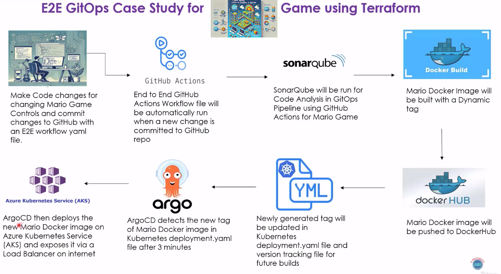

## 1. Create apps in Argocd 

- Create New App in ArgoCD

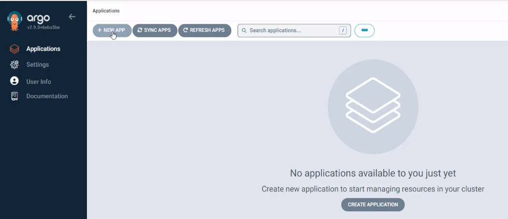

- Give Project and Apps name.

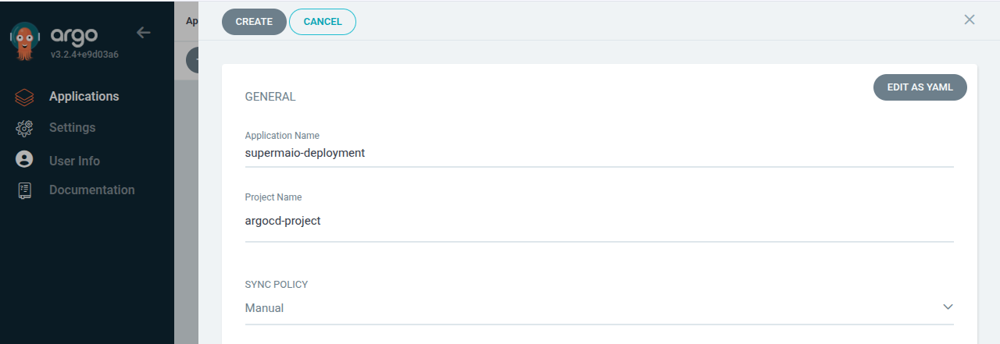

- Provide your git repo url and path where your mario game deployment is

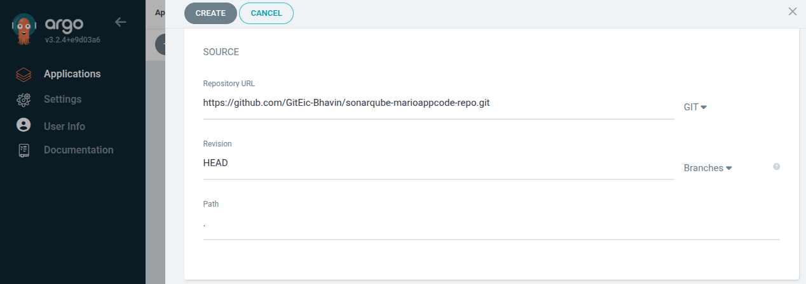

- Select cluster and namespace

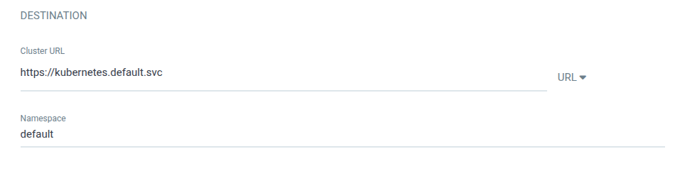


## 2. Enable Auto Sync in ArgoCD.

- Select Sync Policy to `Automatic`.

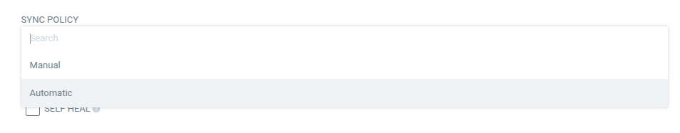

- Create it.


## 3. Deploy supermario game on AKS.

```bash
kubectl apply -f deployment.yml
```

- You can see here, Your ArgoCD has Syncup with latest deployment and shows this deployments and services has deployed

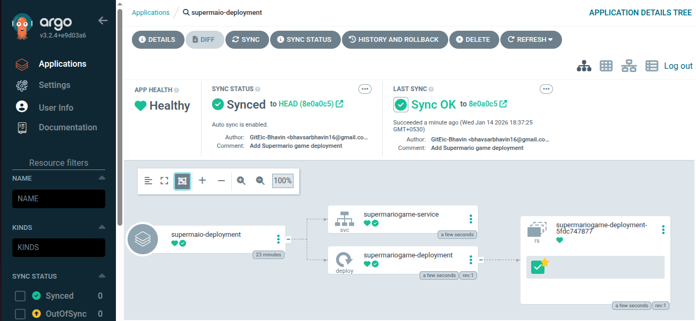


- LB Service created & Service will expose on 8600

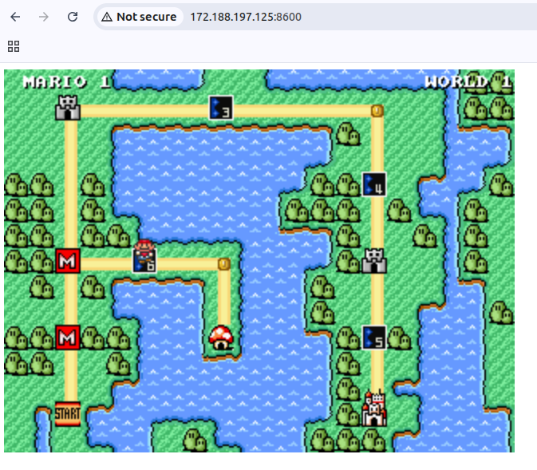

# Make changes for Game should start with S instead of Y

## 1. Make changes in titleState.js

```js
Mario.TitleState.prototype.CheckForChange = function(context) {
    if (Enjine.KeyboardInput.IsKeyDown(Enjine.Keys.S)) {
        context.ChangeState(Mario.GlobalMapState);
    }
}

// Change to asking to Enter S
this.font.Strings[0] = { String: "Press S to Start Game", X: 96, Y: 120 };
```

## 2. Add github action pipeline for modify `deployment.yml` to update with latest tags

- Add repository secrets for `GIT_EMAIL` and `GIT_USERNAME` to allow to push updated `deployment.yml` by jobs itself.

```yml
update_k8s_yaml_version_file_with_latest_image_tag:
    runs-on: ubuntu-latest
    needs: run_container_image_scan_on_supermario_docker_image

    steps:
      - name: Checkout Repository
        uses: actions/checkout@v3

      - name: Calculate VERSION
        run: |
          VERSION=$(($(cat version.txt) + 1))
          echo "VERSION=$VERSION" >> $GITHUB_ENV

      - name: Set Git Config
        run: |
          git config --global user.email "${{ secrets.GIT_EMAIL }}"
          git config --global user.name "${{ secrets.GIT_USERNAME }}"

      - name: Update Deployment YAML and version.txt
        run: |
          git pull
          sed -i "s|image: bhavin1099/supermariogitopsproject:.*$|image: bhavin1099/supermariogitopsproject:${{ env.VERSION }}|" deployment.yml
          echo "${{ env.VERSION }}" > version.txt
          git add deployment.yml version.txt
          git commit -m "Updated deployment yml and version.txt to image tag ${{ env.VERSION }}"
          git push

```

## 3. ArgoCD has syncup with latest updated deployment.yml

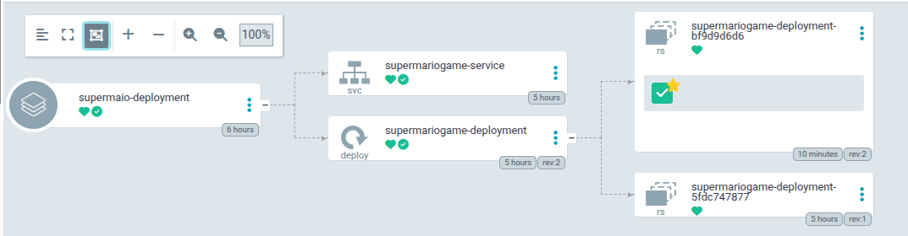

## 4. Ensure SonarQube Scans for your SuperMario code quality

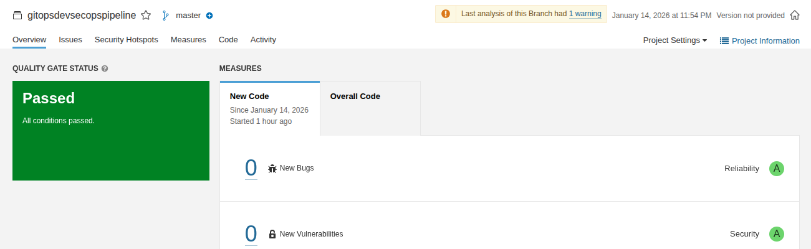

## 5. Ensure your SuperMario has updated

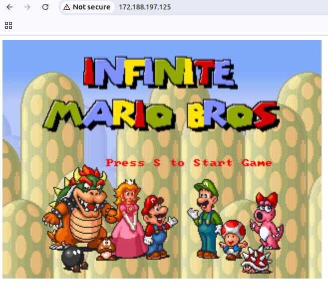


