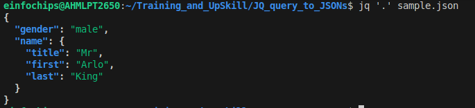
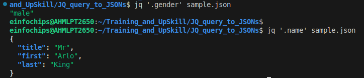
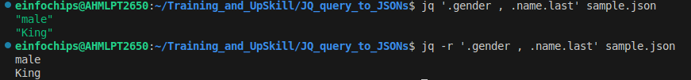

What is JQ ?
---

JQ is JSON Processor used to `slice`, `filter`, `map` and `transform` structured data.

We can use `awk`, `grep`, `sed` but it will be more complexe with jsons.

- **Syntax:**
    - jq [options] 'LogicToParseJsonData' [input].

- **Identity Filter:**
  - It is useful to validate the json data.
  - It is called identity filter because its input and output both are identical.

  **Syntax:**
    - jq .[input]
    - jq '.' [input]
    - jq "." [input]

    - jq '.' sample.json



- **Field Filter:**

  - It is useful to get key/property value from a JSON Data.

  - Extract / filter output for key "name" and key "gender"

```bash
jq '.gender' sample.json
jq '.name' sample.json
```

  

- To print subKey value like name: {last: king}

```bash
jq '.name.last' sample.json
```

- Filter multiple filed at once by using "," and use "-r" to remove "".

```bash
jq '.gender , .name.last' sample.json
jq -r '.gender , .name.last' sample.json
```



