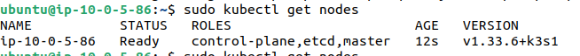
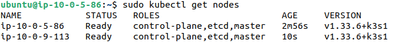
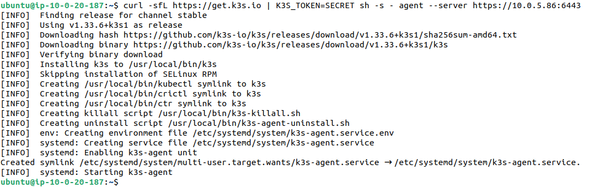

What is K3S ?
---

- K3s is a highly available, certified Kubernetes distribution designed for production workloads in unattended, resource-constrained, remote locations or inside IoT appliances.

- K3s is packaged as a single <70MB binary that reduces the dependencies and steps needed to install, run and auto-update a production Kubernetes cluster.

---

# 🚜 K3s — Lightweight Kubernetes (A → Z Guide)

K3s is a **lightweight, CNCF-certified Kubernetes distribution** designed for:
- 👨‍💻 Developers
- 🧪 Labs & learning environments
- 🏠 Home-lab / Edge / IoT
- 🏭 Production (resource-constrained systems)

It is built by Rancher (SUSE) and focuses on **simplicity + low resource usage** while keeping full Kubernetes compatibility.

---

## 📚 Table of Contents
1. [What is K3s?](#what-is-k3s)
2. [Why use K3s?](#why-use-k3s)
3. [Architecture](#architecture)
4. [Prerequisites](#prerequisites)
5. [Install K3s (Single Node)](#install-k3s-single-node)
6. [Install K3s (Multi Node Cluster)](#install-k3s-multi-node-cluster)
7. [kubectl Access](#kubectl-access)
8. [Storage (Longhorn)](#storage-longhorn)
9. [Networking](#networking)
10. [Deploy Your First App](#deploy-your-first-app)
11. [Ingress (Expose Services)](#ingress-expose-services)
12. [Backups & Upgrades](#backups--upgrades)
13. [Troubleshooting](#troubleshooting)
14. [Useful Commands](#useful-commands)

---

## 🧩 What is K3s?

K3s = **Kubernetes, simplified**.

It removes and replaces heavy components (like etcd) and packages everything into a **single binary (~70MB)**.

> Fully compatible with Kubernetes — same YAML, same APIs — just lighter.

---

## ⭐ Why Use K3s?

| Feature | Why it matters |
|--------|----------------|
Lightweight | Runs on Raspberry Pi, VMs, small cloud instances  
Easy Install | One simple command  
Auto TLS | Certificates handled automatically  
Built-in SQLite or external DB | Flexible control plane  
Production-ready | CNCF certified  
Works anywhere | Cloud, edge, VMs, bare metal  

---

## 🏗 Architecture

K3s simplifies Kubernetes but still has:

- **Server node (control plane)**  
  Runs API server, scheduler, controller, datastore.

- **Agent nodes (workers)**  
  Run workloads (pods).

### 🗄 Datastore Options
- Default: **SQLite** (simple, great for small clusters)
- Production:  
  - **External etcd**
  - **MySQL / MariaDB / PostgreSQL**

---

## ✔️ Prerequisites

- Ubuntu 22.04 / 24.04 (recommended)
- sudo/root access
- Internet access
- Disable swap:

```bash
sudo swapoff -a
sudo sed -i '/ swap / s/^/#/' /etc/fstab
```

## Install K3s (Single Node)

- Your control plans and worker nodes will be on same cluster.
- All pods will be schedule on this single cluster Node.

```bash
# Install k3s
curl -sfL https://get.k3s.io | sh -

# Give read permissoins to your current user:group for read kube config file of k3s
sudo chown $USER:$USER /etc/rancher/k3s/k3s.yaml
```

- Get nodes

```bash
kubectl get nodes
```



## Install K3s (Multi Node Cluster)

### Setup Primary Server Nodes

- Install K3S and ensure you executed with `--cluster-init` and `- server`

```bash
curl -sfL https://get.k3s.io | K3S_TOKEN=SECRET sh -s - server \
    --cluster-init \
    --tls-san=<FIXED_IP> # Optional, needed if using a fixed registration address
```

### Setup and Join new Server Nodes to Primary Server Node's cluster

```bash
curl -sfL https://get.k3s.io | K3S_TOKEN=SECRET sh -s - server \
    --server https://<ip or hostname of server1>:6443 \
    --tls-san=<FIXED_IP> # Optional, needed if using a fixed registration address
```



### Join Worker Node Agent Node

- Use `- agent` to configure as `agent node` only.
- Give Primary Server Nodes `Private IP:6443`.

```bash
curl -sfL https://get.k3s.io | K3S_TOKEN=SECRET sh -s - agent --server https://10.0.5.86:6443
```

#### To find Tokens

- Go to Primary Server Nodes

```bash
sudo cat /var/lib/rancher/k3s/server/token
```




## Storage (Longhorn)

What is Longhorn?
---


- Longhorn is an open-source, distributed block storage system for Kubernetes.
- It lets your Kubernetes clusters have persistent storage that is:

- highly available (data is replicated across nodes)

- easy to manage

- cloud-agnostic (works on-prem, bare metal, or any cloud)

- Think of it as a way to make sure:

“If a node dies, the data for your pods is still safe and available.”

### How Longhorn Works (simple)

- 1. You deploy Longhorn into your Kubernetes cluster.

- 2. It creates a storage layer across all worker nodes.

- 3. When a PVC (Persistent Volume Claim) is created, Longhorn:

- 4. stores data in volumes

- 5. replicates data across multiple nodes

- 6. `If one node goes down — Longhorn automatically heals and keeps data available.`


## 🔹 What k3s Gives You by Default

k3s ships with a built-in provisioner:

### ✅ **`local-path-provisioner` (Default StorageClass)**

When you create a PersistentVolumeClaim (PVC):

* The volume is stored **on the node’s local disk**
* No extra setup is required
* Great for testing and dev clusters

**Pros**

✔️ Works fine for labs / dev
✔️ Very simple
✔️ Zero configuration

**Limitations**

❌ **Not replicated**
❌ If the node dies → **data is lost**
❌ Pods cannot automatically move to another node with their data

> **Example:** The PVC is created on `node-1`.
> If `node-1` goes down, the pod + data are unavailable.

---

## 🔹 What Longhorn Adds (and Why People Use It)

**Longhorn is a distributed storage system built for Kubernetes.**

It turns multiple nodes into a **fault-tolerant storage cluster**.

**Benefits**

✔️ Replication across nodes
✔️ Automatic failover
✔️ Snapshots & backups
✔️ Simple web UI
✔️ Works on bare-metal, VMs, clouds — anywhere

> If **node-1 fails**, Longhorn continues serving the volume from **node-2 or node-3**.

That’s why Longhorn is popular in **HA (Highly Available) clusters** — like yours.