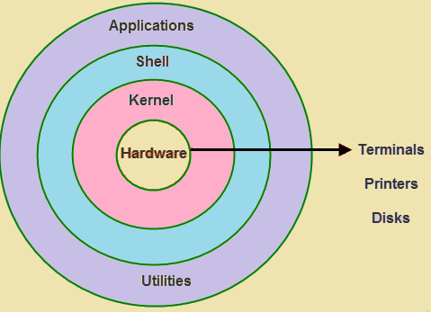

# 🐧 Linux Kernel

## 📌 What is Kernel?
The **Kernel** is the **core component of the Linux Operating System**.  
It acts as a **bridge between hardware and software**, managing how applications interact with physical resources (CPU, memory, disk, devices).
kernal is a program that is stored inside of your OS. It takes command from shell and talks with hardware which is inside of your PC. Shell and kernal together that software built together in one package is called OS.

You can also say that,
**It is an programm which is run all time like calender, clock, window updations, scanning etc.**

---

## 🎯 Kernel Responsibilities
1. **Process Management** – Handles execution, multitasking, scheduling, and termination of processes.  
2. **Memory Management** – Allocates and frees RAM, ensures processes don’t overwrite each other.  
3. **Device Management** – Uses drivers to control hardware devices (keyboard, printer, disk, network card).  
4. **File System Management** – Reads/writes files, manages permissions, organizes data on disks.  

---

## 🌀 Kernel in Linux Architecture

Here’s a layered view of where the kernel sits:



#### See which kernel version is running
```bash
uname -r
```

#### Show full system + kernel info
```bash
uname -a
```

#### Check Linux distribution + kernel version
```bash
cat /etc/os-release && uname -r
```

#### View kernel log messages (requires root)
```bash
dmesg | less
```

### What is linux and why linux ?
- It is an OS is set of instruction that tell the computer what to do or supports computer functinos like executig applications and manage the hardware.
- OS Allows applications to store informations, send docs to pritnters and interect to users.

- Linux can runs on many hardware.
- It allows to runs on older hardware or on embedded system. which means it allow to run on hardwae with least pre-requisites.

# Linux Directory Structure

**/** - Root, the top of the file system hierarchy.

**/bin** - Binraries & Excecutable programs.

**/etc** - System Configurations files for Applications , OS. ex. /etc/nginx/nginx.conf

**/var** - Variable data, apps logs file. /var/log/nginx/access.log or error.log

**/usr** - User related programs.

**/opt** - Third party software installed pkg.

**/home** - Home Directory.

**/boot** - Files requires to boot the OS.

**/media** - Used to as a locations to acess the files stored on CD ROMs, USB Drives

**/root** - Home Directory for Root Account.

**/srv** - To store data served by linux server.

# Linux Fundamentals

```bash
echo $PATH
# OutPut
/bin:/usr/bin:/usr/sbin:/usr/local/bin
```

- When you type in a command at the prompt and press Enter, that command will be searched for
in the directories in your $PATH. 
- In this example, /bin will be searched first. If the command is
found it will be executed. If it is not found, then /usr/bin will be searched and so on. 

# Where command is located ?

```bash
wcich <command>

which mkdir
/usr/bin/mkdir
```

# Creating & Removing Dir

`mkdir [-p] directory` - Create a dir. `-p` to create intermediate dir in parent dir.

```bash
mkdir -p dir/dir1/dir2

ls -l dir
dir1/
```

# What is `umask` ?

- It defines which permission bits `to remove when a file or directory is created`.

**By default Permissions**

 - 1. Dir - 777
 - 2. Files - 666
- `umask` default is - 002.

**Set Umask permissions**

```bash
umask 002 dir1/

# It will give permission 664 for files within dir1/ whenever you create a new file into dir1/.
```


# Common Linux Commands

**rm - file.txt** -- remove single files.
**rmdir dir1/** -- Remove empty dir

once removed, a file is really gone, and there is generally no way to get it back unless you have backups, or you are really fast and have a real good system administrator. To protect the beginning user from this malice, the interactive behavior of the rm, cp and mv commands can be activated using the -i option. In that case the system won't immediately act upon request. Instead it will ask for confirmation, so it takes an additional click on the Enter key to inflict the damage:

```bash
mary:~> rm -ri archive/
rm: descend into directory `archive'? y
rm: descend into directory `archive/reports'? y
rm: remove directory `archive/reports'? y
rm: descend into directory `archive/backup'? y
rm: remove `archive/backup/sysbup200112.tar'? y
rm: remove directory `archive/backup'? y
rm: remove directory `archive'? y
```

**Run Previous command with sudo**

```bash
sudo !!

apt-get update

Reading package lists... Done
E: Could not open lock file /var/lib/apt/lists/lock - open (13: Permission denied)

sudo !!

```
**Run command which is starting with some character**

```bash
# we executed apt-get update in histroy

sudo !a
Enter Password
```

Strip Out comments and blank lines
---

**Before strip out**


**After strip out**


```bash
grep -Ev '^#|^$`featurebranch.txt

# OutPut
feature branch
```

`-E` = "Enable Regular Expressions"
`v` = "Doesn't print that whatever you written in Regular Exp"/"Not print # or Blank lines"
`^#` = "Line is beginnig with `#`. Will not print.
`^$` = "`$` Represent the `End of the Lines`."

last argument of the previous command
---

- **!$** is a `history expansion shortcut` — it refers to the `last argument of the previous command`.

```bash
mkdir testdir

cd !$
cd testdir
# !$ expands to testdir
# So the shell actually runs: cd testdir
```


# Find the file
```bash 
find <path> -name <filename>
```

- find can also perform operations on the found files. A common example is removing files. It is best to first test without the -exec option that the correct files are selected, after that the command can be rerun to delete the selected files. Below, we search for files ending in .tmp:

```bash
find . -name "*.tmp" -exec rm {} \;
```
## Rename all old file to *.old using find command
```bash
find . -name *.tmp -exec mv {} {}.old \;
```

## To lists all 90 days old file with find command
```bash
find . -mtime +90 -exec ls -l {} \;
```

## sort the file and move/rename it with find command
```bash
find /usr - name S* ls -l -exec mv {} {}.test \;
find /usr -type f -name "S*" -exec cp {} /target/dir/ /home/einfochips/DevOps_Tool/Linux {}.old \;
```

## find and copy whole folder with all files and dir using find command
```bash
find /dir/path/ -type f,d -name "*" -exec cp -R {}  /targeted/dir/ \;
```

## Find the oldest file using -mitme days.
```bash
find /usr/bin -mtime +10 -mtime -90
```

## Find file with depth.
- Bydefult find will find a file from each and every dir and files from our filesystem.
- So, the depth i9s unlimited.
- use **-maxdepth 1** for define the depth.

```bash
find *.conf -maxdepth 2 
```

## Delete files and folders with keep required files and folders using find command
```bash
find . ! -path "./README.md" ! -path "./kernal.png" ! -path "." -delete
```

## find files with ls
```bash
find /usr -name S* -ls
```

## find files with size
```bash
find /user -size +10M
```

### find file with size between 100k to 5 MB
```bash
find ~/ -size +100k size -5M
```

### find file with size between 100k OR 5 MB
- Use "o" for condition OR.

```bash
find ~/ -size +100k -o -size -5M
```

### find file with size between 100k OR 5 MB and copy all them to another place with interactive mode for secure copy files or required files only.
- To interactive mode , use "-ok" which will asking for either copy ?
```bash
find ~/ -size +100k -o -size -5M -ok -exec cp {} Backup/ \;
< -exec ... /home/einfochips/ > ? n
< -exec ... /home/einfochips/JenkinsSlackToken > ? n
< -exec ... /home/einfochips/my-swayam > ? n
< -exec ... /home/einfochips/my-swayam/include > ? n
< -exec ... /home/einfochips/my-swayam/bin > ? 
```

## read file from top
```bash
head file.txt
```

## read file from bottom
```bash
tail file.txt
tail -10 file.txt ## Will show last 10 lines from bottom of file
```

# Disk Usage
**du -k** - Display size in kb.
**du -h** - Display size in human readable.

# WildCards make easy to matching the files
## filter the file for ending with .txt
```bash
ls -l /path/ *.txt
```
## filter the file for starting with character
```bash
ls -l abcd.*
```

## filter for only total character of files
- README.md . Here total character is 6 README and ending with .md
```bash
ls -l ??????.txt

```

## fileter file with given opions and ending with .txt
```bash
ls file[0-9].txt
file1.txt

ls *[a-z].txt
awk.txt     bhavin_rsync.txt  message.txt  server_config.txt      testssh.txt
backup.txt  hello.txt         sed.txt  

ls *[a-z][0-9].txt
abc1.txt  abc2.txt  abc3.txt  abc4.txt  abc5.txt  abc6.txt  abc7.txt  abc8.txt  abc9.txt  file1.txt
```

# Create multiple file and folders

## Create dir into dir
- User -p wiht mkdir
```bash
mkdir -p dir1/dir2/dir3/dir4
```

## create multiple files
```bash
# use { } and to define range use ..
file {1..4}.txt
ls
file1.txt file2.txt file3.txt file4.txt
```

## create multiple dirs
```bash
# Use { } to define range
mkdir {jan,feb}{2024..2025}
#OutPut: 
feb2024  feb2025  jan2024  jan2025
```
## Create multiple files into multiple dirs
```bash
touch {jan,feb}{2024..2025}/file{1..10}.txt
# OutPut
ls {jan,feb}{2024..2025}/file{1..10}.txt
feb2024/file10.txt  feb2024/file8.txt   feb2025/file6.txt   jan2024/file4.txt   jan2025/file2.txt
feb2024/file1.txt   feb2024/file9.txt   feb2025/file7.txt   jan2024/file5.txt   jan2025/file3.txt
feb2024/file2.txt   feb2025/file10.txt  feb2025/file8.txt   jan2024/file6.txt   jan2025/file4.txt
feb2024/file3.txt   feb2025/file1.txt   feb2025/file9.txt   jan2024/file7.txt   jan2025/file5.txt
feb2024/file4.txt   feb2025/file2.txt   jan2024/file10.txt  jan2024/file8.txt   jan2025/file6.txt
feb2024/file5.txt   feb2025/file3.txt   jan2024/file1.txt   jan2024/file9.txt   jan2025/file7.txt
feb2024/file6.txt   feb2025/file4.txt   jan2024/file2.txt   jan2025/file10.txt  jan2025/file8.txt
feb2024/file7.txt   feb2025/file5.txt   jan2024/file3.txt   jan2025/file1.txt   jan2025/file9.txt
```

# man for manual of any command
## find manuals for multiple commands
```bash
man -a cal pwd
```
## find where the command is located
```bash
which -a date cal
/usr/bin/date
/bin/date
/usr/bin/cal
/bin/cal
```

## search content to manual of commands
- use -k for serach inside manuals.
- Search contens like "list directory contents"
```bash
man -k "list directory contents"

## OutPut
dir (1)              - list directory contents
ls (1)               - list directory contents
ntfsls (8)           - list directory contents on an NTFS filesystem
vdir (1)             - list directory contents\
```

# Std Input and Std Output
- Std Input is connected to your keyboard for waiting for input
- Std Output is connected to your terminal to show the result of std input

**`0`** - For Std Input
**`1`** - For Std Output
**`1`** - For Std Error

| **`0`** | For Std Input |
| ------- | ------------- |
| **`1`** | For Std Output |
| **`1`** | For Std Error |

**Redirection**

| **&** | Used with redirection to signal that a file descriptor is being used. |
| ----- | --------------------------------------------------------------------- |
| **2>&1** | Combine std error and std output |
| **2>file** | Redirect std error to a file |


```bash
cat - Enter
 cat - Waiting for your input and whatever you will give input same will give output
m - Std input
m - Std output
^C

# While cat file.txt
line1
line2
```

# Redirect the std input/output
## std input - 0, std output - 1, std error - 2

- Redirect your all std input of command cat to file std_output.txt
- use std output - 1 , > - Redirect output.

```bash
cat 1> std_output.txt
std input
^C

cat std_output.txt
std input
```

## Take std input from a file and redirect to output.txt
```bash
cat 0<std_output.txt 1> output.txt
cat output.txt
std input
```
## Std Output and Std Error
```bash
cat -k hi 2>> error.txt
cat error.txt 
cat: invalid option -- 'k'
Try 'cat --help' for more information.
```

# Redirect both Std Output & Std Error to error.txt
```bash
cd /root/ > error.file 2>&1
```

# Std input , Std output using tee command
```bash
date | cut --delimiter=" " --field=1 | tee fullday.txt
Tuesday
cat fullday.txt 
Tuesday
```

## Tee command allow to print output in file by vertically while using pipe for one commands output will use as input for next command.
```bash
date | tee fullday.txt | cut -d " " -f 1
cat fullday.txt
Tue 19 Aug 2025 12:45:24 AM IST
```

- here, tee command will print the output of date to fullday.txt and this output of date will pass to next command for cut and print 1st field like Tue.

## Cut Options
- -d - Use delimiter as field separator
- -f N - Display the Nth field
```bash
cut -d : -f1,5 file.txt
# -f for field/column for 1 and 5.
```

AWK
---

Prints every line of a file.
```bash
awk '{print}' file.txt
```

Print specific column
```bash
awk '{print $1,$2}' file.txt
```

Filed Separator with -F "Define_Filed"
```bash
awk -F " " '{print $2}' awk.txt
# OutPut
is
is
is
is
```

Print everyting after "This"
```bash
awk -F"This " '{print $2}' awk.txt
# OutPut
is first line
is second line

# It will print all after "This" as $2
# If "This " is repeated then it will as $3
```

**Print with conditions**
- Print if salery is greater then 25000

```bash
# Use NF for print only Last colume
awk -F , '$6 > 25000 {print}' awk1.txt 
# OR
awk -F , '$NF>25000 {print}' awk1.txt
```

**For multi-delimeter**

`Use [] and define all delimeter inside []`

```bash
cat multi-delimiter.txt 
#OutPut
This is, example of: Multiple-delimeter
```
Here, filed 1 is before seperator : and , is `This is`
filed 2 is ` example of`
filed 3 is ` Multiple-delimeter`

```bash
awk -F[,:] '{print $3}' multi-delimiter.txt 
#OutPut 
Multiple-delimeter
```

```bash
awk -F[,:] '{print $1}' multi-delimiter.txt 
#OutPut
This is 
```

**For specific line only**
```bash
sudo systemctl status nginx.service | awk -F ":" ' NR==3 {print $2}'
#OutPut 
active (running) since Wed 2025-08-27 10

# Use NR==3 for Line number is only 3
sudo systemctl status nginx.service | awk -F " " ' NR==3 {print $2}'
#OutPut
active
```

**Print long list file by awk**
```bash
ls -lt | awk -F " " '{print $9}'

#OutPut
README.md
multi-delimiter.txt
awk1.txt
awk.txt
error.file
kernal.png

#OR use NF to print only last column
ls -lt | awk -F " " '{print $NF}'
68
README.md
multi-delimiter.txt
awk1.txt
awk.txt
error.file
kernal.png
```

**Avoid 68 from above awk**
```bash
# Use NR>1 - it mean print all lines except line number 1
ls -lt | awk 'NR>1 {print $NF}'

#OutPut
README.md
multi-delimiter.txt
awk1.txt
awk.txt
error.file
kernal.png
```

## use xargs Command in pipe.
- xargs allow you to convert piped data into command line arguments for commands that only accept command line arguments.
- Some commands don’t accept piped input (|), they only work with arguments passed directly.
- Example:
```bash
rm file1 file2 file3
# works because rm accepts file names as arguments.
```

**Print with time range**
```bash
less /var/log/nginx/error.log.1 | awk '$2>="17:23:00" && $2<="17:24:00"'
```

**Print the modified files for Oct only**
```bash
ls -ltr ~/Downloads/ | awk '$6=="Oct" {print}'

#OutPut
-rw-rw-r--   1 einfochips einfochips   27038508 Oct  2  2024 terraform_1.9.6_linux_amd64.zip
-rw-rw-r--   1 einfochips einfochips    1801992 Oct  4  2024 Shiva (2).jpg
```

- But if you try:
```bash
echo "file1 file2 file3" | rm
# it fails, because rm does not read from stdin (the pipe).
```

Sed - Text Manupulating
---

```bash
sed 's/pattern/replacement/flags' file

# s - Substitute
# pattern - Existing word find in file
# replacement - Put new word
$ Flags - g for match all world in all lines
        - 1 Replace 1st occurrence per line
        - 2 Replace 2nd occurrence per line
```


**To modify the word in file**
```bash
cat sed.txt
#OutPut
ID Name Salary Country
1 Pol 25000 India
2 Bont 45000 Belgium
3 Loki 55000 Germany
4 Hina 35000 India
```
**Modify Pol with Paul**
```bash
sed 's/Pol/Paul/1' sed.txt 

#OutPut
ID Name Salary Country
1 Paul 25000 India
2 Bont 45000 Belgium
3 Loki 55000 Germany
4 Hina 35000 India
```
**Replace all occurence in each line use g**
```bash
sed 's/India/Indain/g' sed.txt

#OutPut
ID Name Salary Country
1 Pol 25000 Indian
2 Bont 45000 Belgium
3 Loki 55000 Germany
4 Hina 35000 Indian
```

**Delete a line which match patterns use d**
```bash
sed '/Loki/d' sed.txt

#OutPut
ID Name Salary Country
1 Pol 25000 India
2 Bont 45000 Belgium
4 Hina 35000 India
```

**Insert a new line  before the line of match pattern**

```bash
sed '3i\Two new line' sed.txt 

#OutPut
ID Name Salary Country
1 Pol 25000 India
Two new line
2 Bont 45000 Belgium
3 Loki 55000 Germany
4 Hina 35000 India
```

**Append a new line after match patterns**
```bash
sed '5a Appedn new line' sed.txt 

# 5 - line number
# a - Append new lines after match a patterns
#OutPut
ID Name Salary Country
1 Pol 25000 India
2 Bont 45000 Belgium
3 Loki 55000 Germany
4 Hina 35000 India
Appedn new line

# OR

sed '5a\Appedn new line\' sed.txt 

#OutPut
ID Name Salary Country
1 Pol 25000 India
2 Bont 45000 Belgium
3 Loki 55000 Germany
4 Hina 35000 India
Appedn new line
```


**Change a line by c**
```bash
sed '5c\Appedn new line\' sed.txt 

#OutPut
ID Name Salary Country
1 Pol 25000 India
2 Bont 45000 Belgium
3 Loki 55000 Germany
Appedn new line
```
**NOTE** - sed will not make changes into file during perform sed commands.

## xargs takes piped input and converts it into arguments for the command.
```bash
echo "file1 file2 file3" | xargs rm
```
- Delete all .log files found:

```bash
find . -name "*.log" | xargs rm
```

  - find outputs file list (stdin).

  - xargs converts them into arguments for rm.

## Try to print date output by echo using xargs.
```bash
date | xargs echo
Tue 19 Aug 2025 12:02:43 PM IST
```
## Print hello, currten date using xargs and echo
```bash
date | xargs echo "Hello,"
Hello, Tue 19 Aug 2025 12:08:55 PM IST
```

# Alias -- to give nickname for long commands
```bash
date | tee fulldate.txt | cut -d " " -f 1 | tee day.txt | xargs echo "Hello, today is "
# OutPut: Hello, today is  Tue
alias getdats='date | tee fulldate.txt | cut -d " " -f 1 | tee day.txt | xargs echo "Hello, today is "'
```
## Now, run alias commands named "getdates"
```bash
getdates 
Hello, today is  Tue
```

## Now, use alias which will recieve output from "echo 12 2025" and input to thing.txt with one month before , current month and one month after.
```bash
alias calmagic="xargs cal -A 1 -B 1 > thing.txt"

# alias is created
# Now, just pass cal input like "12 2025" to calmegic
echo "12 2025 | calmegic

cat thing.txt
November 2025         December 2025          January 2026      
Su Mo Tu We Th Fr Sa  Su Mo Tu We Th Fr Sa  Su Mo Tu We Th Fr Sa  
                   1      1  2  3  4  5  6               1  2  3  
 2  3  4  5  6  7  8   7  8  9 10 11 12 13   4  5  6  7  8  9 10  
 9 10 11 12 13 14 15  14 15 16 17 18 19 20  11 12 13 14 15 16 17  
16 17 18 19 20 21 22  21 22 23 24 25 26 27  18 19 20 21 22 23 24  
23 24 25 26 27 28 29  28 29 30 31           25 26 27 28 29 30 31  
30     
```

# 📂 locate Command in Linux

## 🔹 What is `locate`?
The `locate` command is a **fast file search utility** in Linux/Unix.  
Unlike `find`, it uses a **prebuilt database** (created by `updatedb`) instead of scanning the entire filesystem, making searches much faster.

---

## 🔹 Why DevOps Engineers Use It
- 🚀 **Quick file searches** → find configs, logs, scripts instantly  
- 🛠️ **Troubleshooting** → check if required files/binaries exist  
- 🤖 **Automation** → integrate in scripts for fast lookups  
- ✅ **Verification** → confirm installation of configs/binaries (e.g., `docker.service`, `nginx.conf`)  

---

## 🔹 Common Options

### 1. `-e` / `--existing`
Show only files that **currently exist** (ignore stale entries in the database).

```bash
locate -e nginx.conf
```

### 2. `--follow`
locate the symbolic links
```bash
locate --follow /etc/nginx
```

### 3. `-l` -- limit
Limit the number of results shown
```bash
#→ Shows only the first 5 results.
locate -l 5 nginx
```

### Find the first 10 existing Nginx configs:
```bash
locate -e -l 10 nginx.conf
```
### Find Docker service unit file:
```bash
locate -e docker.service
```

### 🔹 locate vs find

| Feature     | locate                               | find                                  |
| ----------- | ------------------------------------ | ------------------------------------- |
| Speed       | Very fast (uses database)            | Slower (scans filesystem)             |
| Freshness   | May show deleted files (stale cache) | Always real-time                      |
| Flexibility | Filename-based only                  | Can search by size, time, perms, etc. |


### Sometimes, your locate can't find or locate the newer created files or you can say missing files/deleted files is not updated regulary into db named updatedb.
### To refrash or update the db use sudo updatedb

```bash
touch file-updatedb.txt
locate file-updatedb.txt # should give the output
"Enter and not seeing any output" due to db is not updated.
# To update the db , run sudo updatedb
# Now, try to locate file-updatedb.txt

locate file-updatedb.txt 
/home/ubuntu/file-updatedb.txt
```

# Viewing Files

## Reverse the output of read files as vertically
- use "tac" command
```bash
cat error.txt input.txt output.txt std_output.txt 
# OutPut without tac
cat: invalid option -- 'k'
Try 'cat --help' for more information.
input 1
input 2
hello
std input
input 1
input 2
hello
std input
```

```bash
cat error.txt input.txt output.txt std_output.txt | tac
# OutPut with tac. tac will make reverse the order of output.
std input
hello
input 2
input 1
std input
hello
input 2
input 1
Try 'cat --help' for more information.
cat: invalid option -- 'k'
```
### Make reverser order as horizontally.
- Use **re** will make each output line by line as **horizontally**.
- Ex. **People** will make it reverse from right to left like **elpoep**.
```bash
cat input.txt 
input 1
input 2

cat input.txt | rev
1 tupni
2 tupni
```
## use head and tail
## head first 20 lines then read only 2 line from bottom from head output
```bash
head -n20 /path/to/file | tail -n 2
```

# Software Repository
## What is Software Repository

  - A central location that stores software packages and metadata (info about version, dependencies, checksums).

  - Used by package managers (like apt in Ubuntu, yum/dnf in RedHat) to install, update, or remove software.

  📦 Software Repo = Library of software packages 

  🛠️ Package Manager = Librarian who fetches books for you

##  Types of Ubuntu Repositories

  `Main` → Free/open-source software officially supported by Canonical.

  Example: apt, ls, systemd.

  `Universe` → Free/open-source but community-maintained, not officially supported. Maintained by ubuntu community

  Example: vlc, gimp, htop.

  `Restricted` → Proprietary but essential software/drivers supported by Canonical.
               → Includes Propprietary software and dirve for company's specific devices such as wireless cards etc

  Example: nvidia-driver, linux-firmware.

  `Multiverse` → Software restricted by copyright/legal issues.

  Example: unrar, some video codecs, certain games.

### Check the repositor in /etc/apt/sources.list
```bash
deb http://archive.ubuntu.com/ubuntu focal main restricted universe multiverse
```

  - deb → Binary packages (ready to install).

  - http://archive.ubuntu.com/ubuntu → Repo server.

  - focal → Ubuntu release name (20.04 = Focal Fossa, 22.04 = jammy, etc.).

  - main restricted universe multiverse → Repo types Sections enabled.


## Distributions codename
```bash
lsb_release -a
# OutPut
No LSB modules are available.
Distributor ID:	Ubuntu
Description:	Ubuntu 20.04.6 LTS
Release:	20.04
Codename:	focal
```

# Searching for pkg using apt
# How to apt pkg manager is uses "caches" to speed up performance.
## To search the pkg using apt 

```bash
# Use apt-cache search "pkg_name"

apt-cache search git

# OutPut
aspnetcore-runtime-8.0 - Shared Framework for hosting of Microsoft ASP.NET Core applications. It is open source, cross-platform and is supported by Microsoft. We hope you enjoy using it! If you do, please consider joining the active community of developers that are contributing to the project on GitHub (https://github.com/dotnet/aspnetcore). We happily accept issues and PRs.
aspnetcore-targeting-pack-8.0 - Shared Framework for hosting of Microsoft ASP.NET Core applications. It is open source, cross-platform and is supported by Microsoft. We hope you enjoy using it! If you do, please consider joining the active community of developers that are contributing to the project on GitHub (https://github.com/dotnet/aspnetcore). We happily accept issues and PRs.
dotnet-apphost-pack-8.0 - Microsoft.NETCore.App.Host 8.0.19
dotnet-host - Microsoft .NET Host - 9.0.4\
```
## To get more informations about pkg
- Use "show"
```bash

apt-cache show git

# OutPut

Package: git
Status: install ok installed
Priority: optional
Section: vcs
Installed-Size: 36036
Maintainer: Ubuntu Developers <ubuntu-devel-discuss@lists.ubuntu.com>
Architecture: amd64
Multi-Arch: foreign
Version: 1:2.25.1-1ubuntu3.14
Replaces: git-core (<< 1:1.7.0.4-1.), gitweb (<< 1:1.7.4~rc1)
Provides: git-completion, git-core
Depends: libc6 (>= 2.28), libcurl3-gnutls (>= 7.56.1), libexpat1 (>= 2.0.1), libpcre2-8-0 (>= 10.22), zlib1g (>= 1:1.2.0), perl, liberror-perl, git-man (>> 1:2.25.1), git-man (<< 1:2.25.1-.)
```

### apt-cache
- apt-cache is use for fast searching the apt repository.
- apt-cache will not gone through over internet which make the searching faster.
- apt-cache is uses cache of apt files which is located in you local at **/var/lib/apt/lists/**.
```bash
1 auxfiles
2 lock
3 _opt_Tanium_TaniumClient_Tools_Patch_data_repos_repo-28_dists_focal_InRelease
4 _opt_Tanium_TaniumClient_Tools_Patch_data_repos_repo-28_dists_focal_main_binary-amd64_Packages
5 _opt_Tanium_TaniumClient_Tools_Patch_data_repos_repo-28_dists_focal_main_cnf_Commands-amd64
6 _opt_Tanium_TaniumClient_Tools_Patch_data_repos_repo-28_dists_focal_main_dep11_Components-amd64.yml.gz
7 _opt_Tanium_TaniumClient_Tools_Patch_data_repos_repo-28_dists_focal_main_dep11_icons-48x48.tar.gz
8 _opt_Tanium_TaniumClient_Tools_Patch_data_repos_repo-28_dists_focal_main_dep11_icons-64x64%402.tar.gz
9 _opt_Tanium_TaniumClient_Tools_Patch_data_repos_repo-28_dists_focal_main_dep11_icons-64x64.tar.gz
10 _opt_Tanium_TaniumClient_Tools_Patch_data_repos_repo-28_dists_focal_main_i18n_Translation-en
11 _opt_Tanium_TaniumClient_Tools_Patch_data_repos_repo-28_dists_focal_multiverse_binary-amd64_Packages
12 _opt_Tanium_TaniumClient_Tools_Patch_data_repos_repo-28_dists_focal_multiverse_cnf_Commands-amd64
```


# Update your APT Cache.
- Update means, your existing repo and remote repo should be same.
- If your APT cache is not updated its metadata will be get fetchig from remote repo then updating to your cache.

#### 🔹 `apt-get update`

Ex. **Local cache before update:**
```bash
xyz
  version: x.y.1
  dependencies: d1, d2
  repo: main
```

**Latest update is available on remote**
```bash
xyz
  version: x.y.2
  dependencies: d1, b2
  repo: main
```

When you run **sudo apt-get update**
→ APT downloads the latest metadata (package lists) from the repo.
→ Your local cache entry for xyz will now be:

```bash
xyz
  version: x.y.2
  dependencies: d1, b2
  repo: main
```

#### 🔹 `apt-get upgrade`

- What it does: Installs newer versions of already-installed packages if available in the updated cache.

- It looks at your installed packages → compares them with versions in the cache → upgrades them only if dependency changes are not required.

**apt-get update** = updates repo package version info (catalog) in local cache.

**apt-get upgrade** = actually downloads and installs the updated versions of packages you already have.

# Uninstall pkg.
- use `sudo apt-get remove <pkg-name>` - will remove pkg but left the configurations file of that pkg.
- use `sudo apt-get purge <pkg-name>` - will remove the whole pkg with its all configurations file.

- The most preferable way to uninstall pkg is
`sudo apt-get purge <pkg-name>`

- To remove the dangling dependencies which is not used by othet pkg before or after uninstall the pkg.
`sudo apt-get autoremove`

- Whenever you install a new pkg to your system via apt-get, it will install pkg and unpack it called extract it to your local at **/var/cache/apt/archives/**.
- Now, you uninstalled pkg and no longer required. but still your pkg copy is saved to your local and which is still consuming your storage.
- To delete all this copy of pkg named **.deb**.
```bash
sudo apt-get clean
```

- Instead of remove all **.deb** pkg, just want to remove no longer available pkg in repo or old pkg or replaced with other pkg.

```bash
sudo apt-get autoclean
```

#### `🔹 sudo apt-get autoclean`

  - This removes old .deb package files from the local package cache (stored in /var/cache/apt/archives/).

  - Specifically, it deletes package versions that can no longer be downloaded from repos (i.e., obsolete packages).

  - It does not remove all cached packages, only the ones that are no longer available in any repo.

  #### 🔹 Example

- Suppose your cache contains:
```bash
curl_7.68.0-1ubuntu1.5_amd64.deb   (old, not in repo anymore)
curl_7.68.0-1ubuntu1.6_amd64.deb   (new, still in repo)
vim_2:8.1.2269-1ubuntu5_amd64.deb  (still in repo)
```

#### After run sudo apt-get autoclean
```bash
curl_7.68.0-1ubuntu1.5_amd64.deb → removed (obsolete).

curl_7.68.0-1ubuntu1.6_amd64.deb → kept (still valid).

vim_...deb → kept.
```

| Command                      | What It Does                                                         | What It Removes                                                                  | When to Use                                                                                   |
| ---------------------------- | -------------------------------------------------------------------- | -------------------------------------------------------------------------------- | --------------------------------------------------------------------------------------------- |
| **`sudo apt-get clean`**     | Deletes **all cached package files** from `/var/cache/apt/archives/` | Removes every `.deb` file (both old and still available in repos)                | When you want to free up maximum disk space, but don’t mind re-downloading packages if needed |
| **`sudo apt-get autoclean`** | Deletes **only outdated/obsolete package files**                     | Removes `.deb` files that are no longer available in repos (superseded versions) | Safer cleanup — frees space without deleting current useful cache                             |


