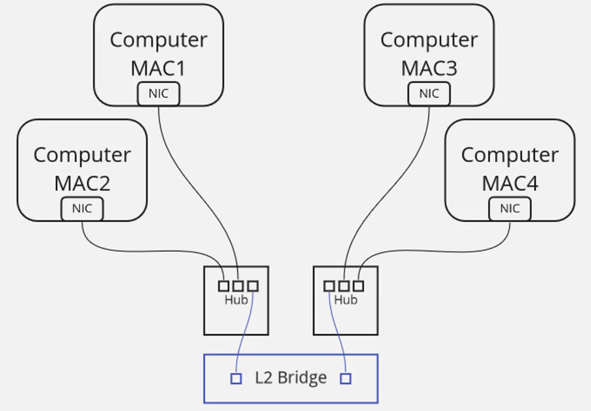

# Networking Basics – Hub vs Bridge vs Switch

This document explains **how devices communicate on a Local Area Network (LAN)** using **Unicast**, and how **Hubs, Bridges, and Switches** handle network traffic differently. It also introduces **collision domains** and **broadcast domains** in a simple way.

## 1. Unicast

**Unicast = One-to-one communication**

Example:
`Computer A → Computer B`

Only one device is the sender and only one device is the receiver.

## 2. Hub (Old & Dumb Device)

A **Hub** does not understand MAC addresses.
It **broadcasts incoming traffic to all ports**.

### How it works

* Receives data → sends it to **every device** connected.
* Destination device picks its own data.

### Problems with Hubs

* **Not efficient** – unnecessary traffic everywhere.
* **Not secure** – all devices see the traffic.
* **Collisions** happen if two devices send data at the same time.

### Collision Domain

* Entire hub = **one big collision domain**
  → Only **one device** can transmit at a time.


## 3. Bridge (Smarter than Hub)

A **Bridge** separates networks into smaller sections and uses a **MAC address table** to forward traffic correctly.

### How it works

* Learns which **MAC addresses** exist on each port.
* Forwards traffic **only where it needs to go**.
* Reduces unnecessary data flooding.



### Benefits

* Less traffic than a hub.
* Fewer collisions.
* Splits one large collision domain into **multiple smaller ones**.

## 4. Switch (Modern, Smart Device)

A **Switch** is an advanced version of a bridge. It maintains a **MAC Address Table** and makes forwarding decisions very accurately.

### How it works

* Learns each device’s MAC address and the port it’s connected to.
* Sends data only to **the destination port**, not to all ports.
* Each port operates independently.

### Benefits

* Fast, secure, and efficient.
* No collisions like in hubs.
* Perfect for modern networks.

### Collision Domain

* **Each switch port = 1 collision domain**
  → Many devices can send simultaneously.

## 5. Broadcasts in Switches

- Sometimes a device needs to send something to everyone, like ARP Request.

- Switch receives broadcast.

- Switch sends it to every port.

- This is necessary for some protocols.

✔ One big broadcast domain = bad for large networks

Too many broadcasts = slow network

MAC table becomes huge

To reduce broadcast domain size → we use Router or VLANs.

A **broadcast** is traffic sent to **all devices** (e.g., ARP request).

* Switch forwards broadcasts to **every port**.
* All connected switches form **one broadcast domain** unless VLANs are used.

### Broadcast Domain

* All devices receiving broadcast traffic.
* Can become large in big networks → leads to congestion.

Routers or VLANs are used to **break broadcast domains**.

## 6. Quick Summary Table

| Device     | Smart?    | MAC Table | Traffic Handling          | Collision Domain | Broadcast Domain          |
| ---------- | --------- | --------- | ------------------------- | ---------------- | ------------------------- |
| **Hub**    | No      | No      | Floods to all ports       | One big domain   | One domain                |
| **Bridge** | Medium | Yes     | Forwards based on MAC     | Split domains    | One domain                |
| **Switch** | Yes     | Yes     | Forwards to specific port | Per-port domain  | One domain (unless VLANs) |


OSI Model
---

## What is the OSI Model?

The **OSI Model (Open Systems Interconnection)** is a 7-layer framework used to understand how data moves across a network.

It helps explain:

* How apps talk over the internet
* How switches, routers, and NICs work
* Where IP addresses, MAC addresses, and ports are used


# OSI Model Layers (Top → Bottom)

| Layer # | Name          | Purpose                                           |
| ------- | ------------- | ------------------------------------------------- |
| 7       | Application   | What the user interacts with (browser, email app) |
| 6       | Presentation  | Formatting, encryption, compression               |
| 5       | Session       | Opens/closes communication sessions               |
| **4**   | **Transport** | TCP/UDP ports, reliable delivery                  |
| **3**   | **Network**   | IP addresses, routing                             |
| **2**   | **Data Link** | MAC addresses, switching                          |
| **1**   | **Physical**  | Cables, NICs, electrical/optical signals          |

Memory Trick (Mnemonic):
**All People Seem To Need Data Processing**


# Real-World Example: Uploading a Video to YouTube

We use all 7 layers:


## **Layer 7 – Application**

You open **Chrome** and go to **YouTube**.
Browser uses **HTTP/HTTPS** to communicate.
This is the “language” between browser ↔ website.

## **Layer 6 – Presentation**

Browser handles:

* encryption (HTTPS)
* compression
* formatting

## **Layer 5 – Session**

Controls:

* login session
* connection management
* cookies/token communication


## **Layer 4 – Transport (TCP/UDP)**

Here we add **port numbers**.

Example:

* HTTP uses **TCP port 80**
* HTTPS uses **TCP port 443**

TCP ensures:

* No errors
* Reliable delivery
* In-order packets

Think of TCP like a courier service with tracking.


## **Layer 3 – Network (IP Layer)**

Adds IP addresses:

* Source IP = your computer
* Destination IP = YouTube servers

If your PC doesn’t know the route:

* It uses **Default Gateway** (your router).

Router decides *where* packets go next.


## **Layer 2 – Data Link (MAC Layer)**

Adds MAC addresses:

* Source MAC = your NIC
* Destination MAC = router’s MAC

Switch uses its **MAC Table** to forward traffic to the right port.

Layer 2 only works **inside your local network**.

## **Layer 1 – Physical Layer**

Actual transmission:

* Ethernet cable
* Fiber/Wi-Fi
* Electrical/optical signals

This is raw **bits (1s and 0s)** crossing the wire.


# Flow Summary (Uploading to YouTube)

1. Browser prepares the video → Application layer
2. TCP adds reliability + port 80/443 → Transport
3. IP decides destination → Network
4. MAC decides how to reach router → Data Link
5. Bits go across cable → Physical
6. Switch reads MAC, forwards to router
7. Router reads IP, forwards traffic to internet
8. YouTube receives your upload


# Key Takeaways

* **Layers 4, 3, 2, 1** matter most for networking jobs.
* **Layer 4** → TCP/UDP ports
* **Layer 3** → IP addresses
* **Layer 2** → MAC addresses and switching
* **Layer 1** → Cables and signals
* Each layer adds a **header** to help deliver data correctly.

What happens while Computer is connected to a switch ?
---


# How Ethernet Switch Learns MAC Addresses – Explained


## 1. NIC & MAC Address Basics

* Every computer has a **Network Interface Card (NIC)**.
* The NIC contains a **hard-coded MAC address** (unique identifier).
* This MAC address never changes for that NIC.


## 2. Connecting a Computer to a Switch

When you plug the computer (NIC) into a switch port:

* The switch receives the computer’s traffic on that port.
* The switch examines the **source MAC address** of the incoming frames.


## 3. How the Switch Learns MAC Addresses

When the switch receives a frame:

1. It checks the **source MAC address**.
2. It records it in the **MAC Address Table** as:

```bash
MAC Address       →   Switch Port
AA:BB:CC:DD:EE:FF →   Port 1
```

* This process is called **MAC learning**.


## 4. How the Switch Uses the MAC Table

When the switch later receives a frame **destined for that MAC address**:

* It looks up the MAC in the table.
* It forwards the frame **only to the correct port**.

**Result: Efficient forwarding** (unlike hubs which flood traffic).


## 5. MAC Table Aging (Timeout)

MAC table entries are **temporary**.

* If no traffic is seen from a MAC for a few minutes:

  * The entry **ages out** and is removed.
* When the computer sends traffic again:

  * The entry is **re-learned**.


## 6. Multiple MAC Addresses on One Port

A single switch port can learn **multiple MAC addresses**, for example:

* If another **switch** is connected to that port.
* If a **hub** is connected.

Example:

```bash
Port 8:
  - MAC A1:B2:C3:D4:E5:F6
  - MAC 11:22:33:44:55:66
  - MAC 77:88:99:AA:BB:CC
```

The top switch learns that all those MACs are reachable via Port 8.


## 7. Benefits of MAC Learning

* Reduces unnecessary broadcasts
* Improves network efficiency
* Ensures frames reach the correct destination


## Summary

| Concept                | Explanation                                |
| ---------------------- | ------------------------------------------ |
| MAC Address            | Unique identifier on NIC                   |
| MAC Table              | Maps MAC address → switch port             |
| MAC Learning           | Switch learns MACs from incoming frames    |
| Aging                  | MAC entries removed after inactivity       |
| Multiple MACs per Port | Happens when connecting another switch/hub |


BUM Traffic
---


## 1) Why BUM matters

* **BUM** = **Broadcast, Unknown Unicast, Multicast** — all are *multi-destination* behaviours that can cause traffic to be sent to multiple ports.
* Knowing BUM helps you understand switch flooding, ARP resolution, multicast services (video, streaming), and how to scale / secure LANs.


## 2) Broadcast

### What it is

* A **Layer-2 broadcast** is an Ethernet frame sent to the broadcast MAC: `FF:FF:FF:FF:FF:FF`.
* Frames with this destination are delivered to **every host** on the same Layer-2 broadcast domain (i.e., same VLAN).

### Real-world example — ARP

* Host A wants to send to IP `10.0.0.2` but only knows IP, not MAC.
* Host A sends an **ARP request** (Layer-2 broadcast) saying “Who has IP 10.0.0.2? Tell 10.0.0.1”.
* Switch receives it and **floods** it out all ports on that VLAN.
* Host B (10.0.0.2) responds with an **ARP reply** (unicast) containing its MAC.
* Host A stores entry in its **ARP table**: `10.0.0.2 → 00:11:22:33:44:55`.

### Packet structure (simplified)

```bash
Ethernet header:
  dst MAC = FF:FF:FF:FF:FF:FF   (broadcast)
  src MAC = 00:aa:bb:cc:dd:ee
  Ethertype = 0x0806 (ARP)
ARP payload:
  who-has 10.0.0.2 tell 10.0.0.1
```

### Why broadcast matters

* Small LANs: fine and necessary (ARP, DHCP, some discovery protocols).
* Large LANs: many broadcasts cause CPU/processing overhead on hosts, saturate links, and inflate switches’ MAC learning and ARP caches.


## 3) Unknown Unicast (deep dive)

### Definition

* The switch receives a frame whose destination MAC is a **unicast MAC** (e.g., `00:11:22:33:44:55`) but that MAC is **not present in the switch’s MAC table**.
* Because the switch does not know the correct egress port, it **floods** the frame out all ports (except the ingress port) — effectively *behaving like a broadcast* for that frame.

### When it happens (common causes)

* Device just joined the network (no MAC learned yet).
* MAC table entry aged out (no traffic recently).
* Asymmetric or misconfigured links (e.g., MAC moves between ports).
* MAC spoofing or virtualization (many VMs behind one physical port with MACs not yet learned).

### Example packet flow

1. Host A sends to host X (MAC unknown to Switch1).
2. Switch1 floods frame to all ports; frame reaches Switch2.
3. Host X receives and responds; the response arrives back on a particular port.
4. When Switch1 sees response, it learns `MAC X → port Y` and installs it in the MAC table.
5. Subsequent frames to MAC X are unicast to port Y (no flood).

### Visual (two switches)

```bash
Host A --- Switch1 --- Link --- Switch2 --- Host X
             (doesn't know X)  ↘floods→ Switch2 ports → Host X
```

### Why it’s important

* Unknown unicast flooding reveals how MAC learning works implicitly.
* Excessive unknown unicasts = lots of flooding = bad performance. Common in virtualization environments or after network changes.


## 4) Multicast (deep dive)

### What multicast is

- Multicast is a network communication method where one sender sends traffic to a group of devices, but not to everyone.

- It is one-to-many communication — but only to a specific group, not all devices.

- If you want to send the same data to 50 people, instead of sending 50 copies, multicast sends just 1 copy, and switches/routers duplicate only when needed.

* **One-to-many but selective**: sender transmits once; switches forward to a subset of ports that have group members.
* Uses special Layer-2 MACs and Layer-3 group addresses.

### IP ↔ MAC multicast mapping (IPv4)

* IPv4 multicast addresses: `224.0.0.0` – `239.255.255.255`.
* Ethernet multicast MACs are derived from IPv4 multicast: `01:00:5e:xx:xx:xx` (low 23 bits of the IPv4 multicast address map into the MAC).

  * Example: IPv4 `224.0.0.1` → MAC `01:00:5e:00:00:01` (simplified).
* This mapping causes **some collisions** (different IP groups mapping to same MAC is possible) but works with IGMP/MLD to control membership.


## 5) How switches learn MAC addresses (MAC table)

* Switch learns by **inspecting source MAC** of incoming frames and recording `MAC → ingress port`.
* **Aging timer**: entries are temporary. Typical default: a few minutes (e.g., 300s). If no frame seen from that MAC for the timeout, entry is removed.
* **Multiple MACs on one port**: if you connect another switch or a host with multiple NICs or virtualization, the parent switch will learn multiple MACs on that single physical port. Example:

  ```bash
  Port 8 → 00:11:22:33:44:55
         → 66:77:88:99:AA:BB
  ```
* **MAC move**: If a MAC appears on a different port, the switch updates the table (possible security alert if unexpected moves).


## 6) Why BUM traffic is a problem at scale

* **Bandwidth waste**: flooding sends copies to many ports; repeated for each unknown unicast or broadcast.
* **CPU/stack load on hosts**: hosts must receive & process (or at least drop) frames they didn’t request.
* **Security/Privacy**: Broadcasts/unknown unicast floods let other hosts see traffic (if they inspect it); ARP spoofing abuses ARP broadcasts.
* **Switch MAC table exhaustion**: lots of MACs (e.g., lots of VMs) can fill MAC tables or cause frequent aging and flooding.
* **Multicast storms**: misconfigured streams or lack of IGMP snooping can flood the LAN.


## 7) How to control/reduce BUM

### Network design basics

* **Use VLANs** to limit broadcast domain size. Each VLAN = separate Layer-2 domain.
* **Put heavy multicast groups on dedicated VLANs** or multicast-enabled infrastructure.

### Switch features & config

* **IGMP snooping** — ensures multicast is sent only to subscribers.
* **Static MACs** — pin a MAC to a port (useful for servers or security): prevents unknown-unicast flooding for those MACs.
* **Port security** — restrict number of MACs per port and block MAC changes / spoofing.
* **Storm control** — drop/buffer broadcast/multicast/unknown-unicast beyond thresholds.
* **BPDU guard / root guard** — protect spanning-tree topology from rogue switches (prevents loops that amplify BUM).

### Router use

* **Routers break broadcast domains** (so broadcasts do NOT cross routers). Put different subnets on different VLANs and interconnect with routers — reduces BUM reach.

### Virtualization & cloud

* Configure hypervisors to behave well: limit promiscuous mode, use proper port groups, enable IGMP proxying when required, etc.

## 8) Troubleshooting — commands & what to check

### On a Windows host

* `arp -a` → show ARP table (IP ↔ MAC). Check for correct MAC for a target IP.
* `ipconfig /all` → see NIC MAC, IP, default gateway.

### On Linux/macOS host

* `ip neigh` or `arp -n` → ARP table
* `ip addr` → NIC info
* `tcpdump -i eth0 arp` → watch ARP requests/replies live
* `tcpdump -i eth0 'ether dst ff:ff:ff:ff:ff:ff'` → see broadcasts

### On Cisco/Juniper switches (examples)

* `show mac address-table` (Cisco) / `show ethernet-switching table` (Juniper) → current MAC table
* `show mac address-table dynamic` → only learned entries
* `show ip igmp snooping` / `show ip igmp groups` → IGMP snooping state
* `show ip mroute` → multicast routing table (if router)
* `show interfaces` / `show interface counters` → high broadcast or multicast counters
* `show spanning-tree` → loops cause massive BUM amplification


---

# **What Does a Router Actually Do?**

A router is a device that **connects multiple Layer-2 networks** and allows communication **between different IP subnets**.

A switch = builds Ethernet network (Layer 2)
A router = connects Ethernet networks together (Layer 3)


# **Part 1: Why We Cannot Keep Adding Switches Forever**

Imagine we keep connecting switches like this (daisy chain):

```bash
PC — Switch — Switch — Switch — Switch — PC
```

It becomes **one big network**.

### Problems:

### 1 **Huge Broadcast Domain**

* ARP = Layer 2 broadcast
* Broadcast goes to *all* switches
* Every device receives it unnecessarily
* More switches = more broadcast traffic = slow network

### 2 **Switch MAC Tables Become Huge**

* Switch must store MAC address for every device
* If 3000 devices → switch table becomes very large
* Searching MAC table takes more processing

- A large L2 network becomes slow, noisy, and inefficient.


# **Part 2: How Router Fixes the Problem**

We break the big network into **two smaller networks**:

```bash
Segment 1 (LAN A) ---- Router ---- Segment 2 (LAN B)
```

Each segment has **its own subnet**:

* Segment 1 → `10.1.1.0/24`
* Segment 2 → `10.1.2.0/24`

Now they are **separate networks**.


# **Result of Adding Router**

### Broadcasts Do NOT Cross the Router

ARP in LAN1 stays in LAN1
ARP in LAN2 stays in LAN2

Router blocks Layer 2 broadcasts.

### Smaller MAC Tables

Switch 1 only learns MACs in LAN1
Switch 2 only learns MACs in LAN2

### Less traffic, more performance


# **Example: ARP Broadcast With Router**

### Scenario

PC1 (10.1.1.12) sends ARP:

- "Who has 10.1.1.1? Tell 10.1.1.12"

### What happens?

1. Switch 1 floods ARP on **only its ports**
2. Router receives ARP on its interface
3. Router **does NOT forward** ARP to Segment 2
4. PCs in Segment 2 **never see** the broadcast

Router isolates broadcast domains.


# **Part 3: How PC Sends Traffic to Another Network**

### Example

PC1 → wants to talk to → PC3
10.1.1.12 → 10.1.2.13

Two different networks → cannot directly talk.

So PC1 checks:

* Is destination in my subnet?
* 10.1.2.x is NOT in my subnet (10.1.1.x)

So PC1 sends traffic to the **Default Gateway**.


# **What is Default Gateway?**

The router interface inside each subnet.

### For Segment 1

Router interface = **10.1.1.1**

### For Segment 2

Router interface = **10.1.2.1**

PC1 has this configured as default gateway:

```bash
Default Gateway: 10.1.1.1
```

This means:

- “If destination is not in my network, send to this router.”


# **How Actual Traffic Flows**

### PC1 wants to talk to PC3

#### 1 PC1 creates an IP packet:

* Source IP: 10.1.1.12
* Destination IP: 10.1.2.13

#### 2 To send this packet, PC1 needs Destination MAC

But MAC belongs to router (default gateway), NOT to PC3.

So PC1 checks its ARP cache:

* If no entry → sends ARP: “Who has 10.1.1.1?”

Router replies with its MAC.

#### 3 PC1 sends Ethernet frame:

* Destination MAC = Router MAC
* Inside frame → IP packet (destined to PC3)

#### 4 Router receives frame

* Reads destination IP = 10.1.2.13
* Looks in its routing table
* Sees: “This network is directly connected on interface 10.1.2.1”
* Sends it to PC3

#### 5 Router ARPs for PC3’s MAC

#### 6 Forwards packet to PC3

Communication works!


# **Part 4: Routing Table (Simple Explanation)**

Router automatically knows networks connected to its interfaces:

| Router Interface | Subnet      | Automatically added? |
| ---------------- | ----------- | -------------------- |
| 10.1.1.1/24      | 10.1.1.0/24 | Yes                  |
| 10.1.2.1/24      | 10.1.2.0/24 | Yes                  |

It does not need static routes for directly connected networks.

# **SUMMARY**

| Concept                                   | Meaning                                            |
| ----------------------------------------- | -------------------------------------------------- |
| Router breaks Layer 2 networks            | Creates smaller broadcast domains                  |
| Broadcasts don’t cross router             | ARP limited to local subnet                        |
| Default gateway                           | Router IP inside each subnet                       |
| PC sends cross-network traffic to gateway | Router forwards based on destination IP            |
| Router routing table                      | Automatically contains directly connected networks |
| Switches store MACs, routers use IPs      | Layer 2 vs Layer 3 roles                           |


DHCP 
---

# **DHCP Explained in Simple Words (With Examples)**

DHCP = **Dynamic Host Configuration Protocol**
It is the service that **automatically gives IP addresses** to computers in a network.

Without DHCP → You must manually assign IPs one by one → hard, slow, mistakes happen.

With DHCP → Device boots → asks for IP → DHCP gives IP → device gets internet.
✔ Fully automatic
✔ No configuration needed
✔ Works for laptops, servers, VMs, mobiles, printers, everything


# **1. Static IP vs Dynamic IP**

### **Static IP (Manual)**

You manually enter:

* IP Address
* Subnet Mask
* Default Gateway
* DNS Server

Example:

```
IP: 10.1.1.50
Subnet: 255.255.255.0
Gateway: 10.1.1.1
DNS: 8.8.8.8
```

Problem:
If you have 500 computers → doing this manually is almost impossible.


# **Dynamic IP (Automatic using DHCP)**

In almost every company → everyone selects:

✔ *“Obtain an IP address automatically”*
✔ *“Obtain DNS automatically”*

DHCP automatically fills:

* IP address
* Subnet mask
* Gateway
* DHCP server
* DNS server


# **2. The DHCP Process (4-Step DORA)**

When a computer starts and has **no IP address**, it runs **DORA**:

```
D → Discover
O → Offer
R → Request
A → Acknowledge
```

### Step 1: DHCP DISCOVER (Broadcast)

Computer → “Hello! I need an IP! Is any DHCP server there?”

This is a **broadcast** = goes to everyone because the device has no IP yet.

```
PC → FF:FF:FF:FF:FF:FF (broadcast)
```

### Step 2: DHCP OFFER

DHCP server replies:

“I can give you IP 10.1.1.11”

### Step 3: DHCP REQUEST

PC says:

“Yes, I want this IP. Please assign it to me.”

### Step 4: DHCP ACKNOWLEDGE (ACK)

DHCP server final confirmation:

“You get this IP. Go ahead.”


# **ASCII Diagram: DHCP Flow**

```
+-------------+                +----------------+
|   Client    |                |  DHCP Server   |
| (No IP yet) |                | (Has IP Pool)  |
+-------------+                +----------------+
        |                                  
        | 1. DHCP DISCOVER  (Broadcast)      
        |------------------------------------> 
        |                                      
        | 2. DHCP OFFER                        
        <-------------------------------------- 
        |                                      
        | 3. DHCP REQUEST                       
        --------------------------------------> 
        |                                      
        | 4. DHCP ACK                           
        <-------------------------------------- 
```


# 🖧 **3. Where can DHCP run?**

### **Option A: Dedicated DHCP Server**

(Windows Server/Linux DHCP service)

### **Option B: Router acts as DHCP Server**

Common in home networks and small offices.

Example:

```bash
DHCP Server = 10.1.1.1
Default Gateway = 10.1.1.1
DNS Server = Provided by DHCP
```


# **4. DHCP Troubleshooting (Windows)**

### ✔ `ipconfig /all`

Shows:

* IP Address
* Subnet Mask
* Gateway
* DHCP Server
* DNS Server

### ✔ `ipconfig /release`

Removes your IP (goes to 169.254.x.x APIPA)

### ✔ `ipconfig /renew`

Requests a fresh IP from DHCP.

### Good for checking:

* Is DHCP server reachable?
* Are you getting backend IPs?
* Did the DHCP scope run out?


# **5. Why DHCP is a broadcast?**

Because the computer does **not have an IP yet**, so it cannot send a unicast message.

Broadcast = “Send to everyone”
MAC: `FF:FF:FF:FF:FF:FF`

# **6. Common Real-Life Issues DHCP Solves**

| Problem             | DHCP Fix                   |
| ------------------- | -------------------------- |
| Duplicate IPs       | DHCP ensures unique IP     |
| New devices need IP | Automatically assigned     |
| Large VM scaling    | Instant IP assignment      |
| Wrong gateway/DNS   | DHCP pushes correct config |
| Changing networks   | New IP every time          |

# **7. DHCP Summary (Simplest Possible)**

* DHCP gives automatic IP addresses
* Uses **broadcast** for discover
* Uses **DORA** process
* Makes network management easy
* Routers/servers can run DHCP
* `ipconfig /release` and `/renew` help diagnose DHCP issues


WiFi
---

# **Wi-Fi / Wireless LAN – Complete Explanation (Beginner to Advanced)**

Wireless LAN (Wi-Fi) simply means:
➡ You connect to the network **without cables**, using **radio waves**.

Earlier, everyone needed to connect laptops to the **wall using Ethernet cables**.
Today, people bring:

* Laptops
* Mobiles
* Tablets
* Smart devices

All these connect **wirelessly** to the **Wi-Fi Access Point (AP)**.

# 1. **Wi-Fi Frequencies: 2.4 GHz vs 5 GHz**

Wi-Fi mainly uses **two radio frequencies**:

| Frequency   | Range                        | Speed  | Best For                       |
| ----------- | ---------------------------- | ------ | ------------------------------ |
| **2.4 GHz** | Long range (150 ft indoor)   | Slower | Large coverage (home, office)  |
| **5 GHz**   | Shorter range (50 ft indoor) | Faster | High-speed internet, streaming |

### Why does 5 GHz have short range?

Because **higher frequency = shorter wavelength** → travels less distance → blocked easily by walls.

### When to use what?

* **2.4 GHz** → longer distance, obstacles, basic browsing
* **5 GHz** → short distance, high-speed LAN, gaming, video calls, copying files over LAN

**Important:**
If your internet speed is 50 Mbps → 2.4 GHz is enough (since bottleneck is the ISP, not Wi-Fi).


# 2. **Basic Home Wi-Fi Network Architecture**

Here’s the simple idea:

```
Your Laptop  ---wireless--->  Wi-Fi Access Point (AP)  ---cable--->  Router  ---> Internet
```

**AP = Device that talks to your wireless devices**
**AP always uses wireless ↔ User**
**AP always uses wired ↔ Router/Switch**

So Wi-Fi works like this:

1. Laptop sends wireless signal → AP
2. AP sends that traffic (over cable) → Router
3. Router → Internet


# 3. **Corporate Wi-Fi Network (More Complex)**

In large offices, you have:

* Many users
* Many rooms
* Many floors
* Huge areas to cover

So you need **multiple Access Points**.

```
 AP1  AP2  AP3  AP4
   \   |   |   /
       Switch
          |
        Router
          |
       Firewall
          |
        Internet
```

Why so many APs?
➡ Each AP serves a specific area (conference room, lobby, floor, office rooms)


# 4. **Wireless LAN Controller (WLC)**

In corporate networks, managing 20–1000 access points manually is a nightmare.

So companies use a **Wireless LAN Controller (WLC)**.

### WLC does 3 main jobs:

1. **Central management**
   (configure once → applies to all APs)

2. **Pushes firmware updates**
   (keeps all APs same version)

3. **Controls roaming**
   (users move without disconnecting)

### ➡ APs become “lightweight”

They don’t make decisions.
**WLC is the brain**.


# 5. **Roaming Between Access Points**

This is important in offices.

Imagine:

* You start a Zoom call in a conference room (connected to AP1)
* Then you walk to your cabin (AP2 is there)

Without a controller, your device would drop Wi-Fi and reconnect.

With a WLC:

➡ Your device automatically shifts from AP1 → AP2
➡ Without losing connection
➡ You don’t notice the change

This is called **seamless roaming**.


# 6. **SSID – The Network Name**

SSID = **Service Set Identifier**
This is simply your Wi-Fi **network name**
Examples:

* Home_WiFi
* Office_WiFi
* Guest_WiFi

Under the hood:

* All APs broadcast the **same SSID**
* The WLC handles which AP you should join

Example:

```
SSID: “Office-WiFi”
AP1 → broadcasts this SSID
AP2 → broadcasts this SSID
AP3 → broadcasts this SSID
```

When you move, your device stays connected to the **same SSID**, not to a specific AP.


# 7. **Wireless vs Wired LAN – What’s Similar?**

Even though Wi-Fi uses radio waves, once the traffic reaches the AP:

➡ Everything follows normal **Ethernet rules**.

Same concepts apply:

| Concept             | Wired | Wireless |
| ------------------- | ----- | -------- |
| MAC address         | Yes   | Yes      |
| MAC table in switch | Yes   | Yes      |
| Upstream routing    | Yes   | Yes      |
| VLANs               | Yes   | Yes      |

The **only difference** is:

* **Wired LAN = Copper/Fiber cable**
* **Wireless LAN = Radio waves**

After traffic enters the AP → it becomes **normal Ethernet**.

# 8. **Summary — Core Concepts You Must Remember**

**2.4 GHz = long range, slow**
**5 GHz = short range, fast**

**Access Point (AP)**
Devices connect wirelessly → AP
AP connects via cable → Network

**Corporate Networks use multiple APs**

**WLC = centralized brain**

* Manage all APs
* Handle roaming
* Apply policies
* Update firmware

**Roaming**
Move from AP1 → AP2 without losing connection

**SSID = Wi-Fi network name**
All APs broadcast same SSID for seamless mobility

**Wi-Fi vs Ethernet**
Only Layer 1 is different (air vs cable)
Rest (MAC, VLANs, routing) is same
