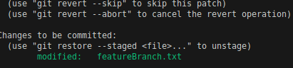
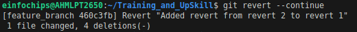
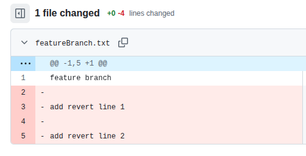
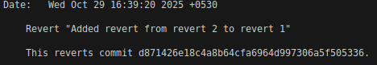

What is Git ?
---
- Git is **version contorl** a tool that tracks and manages changes to files over time.

- Git is a command-line tool installed locally on your computer.

What is GitHub ?
---

- GitHub is a cloud platform that hosts your Git repositories online.

Ex. Your github account.

Install Git in your local
[Install Git](https://git-scm.com/install/linux)

- Check your git versions

```bash
git --version

git version 2.34.1
```

WorkFlow of git
---

1. `git init`

- Initalize your local git repository.
- Creates a hidden folder `.git`

2. `git status`

- Shows which files are being tracking or not.

3. `git add <file/folder_name>`

- Add files / folders in `staging area` and is ready to be saved by commit.

4. `git commit -m <Your_Commit_Msg>`

- Save a snapshot of your staged files and is ready to push in github.

5. `git remote add origin "Your_Git_Repo_URL"`

- To add your git repo in your local.

6. `git push`

- Upload your commited files to github.


7. `git log`

- Shows all commits

```bash
git log
commit b1d57ce03c18913589cc614dcb34d1949af41531 (HEAD -> master, origin/master)
Date:   Wed Oct 29 14:36:10 2025 +0530

    first commit
```

8. `git show <Commit's Hash>`

- It will show what had been changes in your that commits

```bash
git show 3ae894c3992a9fa28a7577aebcb5b5e8a5b6a43b
commit 3ae894c3992a9fa28a7577aebcb5b5e8a5b6a43b (HEAD -> feature_branch, origin/feature_branch)
Date:   Wed Oct 29 15:38:37 2025 +0530

    Add changes

diff --git a/featureBranch.txt b/featureBranch.txt
index 3306430..ef1d402 100644
--- a/featureBranch.txt
+++ b/featureBranch.txt
@@ -1 +1,3 @@
 feature branch
+
+Commited new changes
\ No newline at end of file
```

9. `git show --name-only <Commit's Hash>`

- List only which files has been modified in that commit.

```bash
git show --name-only 3ae894c3992a9fa28a7577aebcb5b5e8a5b6a43b
commit 3ae894c3992a9fa28a7577aebcb5b5e8a5b6a43b (origin/feature_branch, feature_branch)
Date:   Wed Oct 29 15:38:37 2025 +0530

    Add changes

featureBranch.txt
```

10. `git reflog`

- Will show all information about all branches and all project within your git repo.

```bash
 git reflog
hash_no (HEAD -> master, origin/master) HEAD@{0}: commit: Add changes and show hash
hash_no HEAD@{1}: checkout: moving from master to master
hash_no HEAD@{2}: checkout: moving from feature_branch to master
hash_no (origin/feature_branch, feature_branch) HEAD@{3}: commit: Add changes
hash_no HEAD@{4}: checkout: moving from master to feature_branch
hash_no HEAD@{5}: checkout: moving from feature_branch to master
hash_no HEAD@{6}: checkout: moving from master to feature_branch
hash_no HEAD@{7}: checkout: moving from feature_branch to master
hash_no HEAD@{8}: commit: Add feature branch file
hash_no HEAD@{9}: checkout: moving from master to feature_branch
hash_no HEAD@{10}: commit: Add git commands
hash_no HEAD@{11}: Branch: renamed refs/heads/master to refs/heads/master
hash_no HEAD@{13}: commit (initial): first commit
```

11. `git revert <hash>`

- git revert creates a new commit that **undoes the changes made by a previous commit**.
- It does not delete history, unlike git reset --hard.
- That’s why git revert is the safe way to undo a change in shared or remote repositories.

- **`Run` **git push** `after git revert`.

-git reset <commit-hash> moves HEAD to an older commit, removes later commits from history, but keeps the changes in your working directory (unstaged).

- After revert your commits, that given commit will be **unstage** and will asking for `git add`.



- **To continue with made changes of revert**, Run this

```bash
git revert --continue
```




`git reset <last commits hash>` run after git revert

**Before Reset**



**After Reset**


**Reset will delete that commit from history but it will kepp those changes of Revert has made**.


12. `git reset --soft` Bydefault `git reset`

- Removes commits from history and **keep changes**.

13. `git reset --hard`

- Removes commits from histroy and **Removes changes**.

14. `git revert`

- Creates a new commits to Undo Changes

